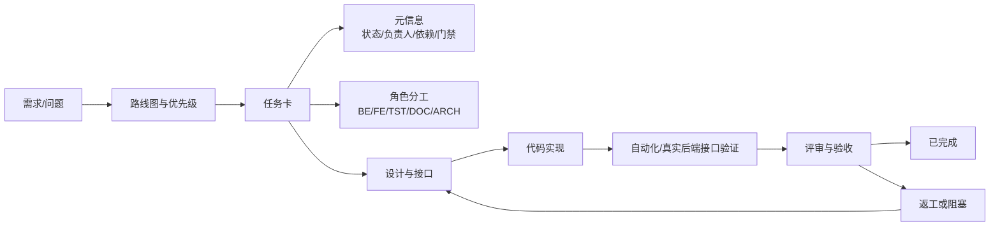

# 任务卡目录说明

本目录存放项目可执行任务卡。文件名负责“快速定位”，文件内部的“元信息”负责“正式管理”。

任务卡的正文、状态、角色说明、决策、风险、验收标准和执行日志统一使用中文。文件名、任务编号、模块标识、接口名称和无法替代的技术缩写可以保留；技术缩写首次出现时应补充中文含义。

一般任务卡沿用下述稳定编号规则。长期专项可以在 `.codex` 下建立独立中文工程档案目录并使用中文文件名；知识中心专项任务入口见 [知识中心建设平台开发任务](../../知识中心建设平台/04-开发任务/README.md)。中文文件名不替代正文中的稳定任务编号。

## 1. 文件名规则

```text
TASK-{模块}-{需求/专题}-{角色/阶段}-{序号}-{功能简称}.md
```

| 片段 | 含义 | 示例 |
|---|---|---|
| `TASK` | 任务卡标识 | `TASK-...` |
| 模块 | 业务模块或专项 | `RAG-KG`、`KGO`、`KQF`、`BUG` |
| 需求/专题 | 父需求、问题域或阶段 | `29`、`RG16`、`JSON-RACE`、`AUD` |
| 角色/阶段 | 责任角色或执行阶段 | `BE`、`FE`、`TST`、`ARCH`、`P0`、`P1` |
| 序号 | 同一范围内的顺序 | `01`、`02` |
| 功能简称 | 人类可读的功能描述 | `state-machine-implementation` |

### 常用标识

| 标识 | 含义 |
|---|---|
| `BE` | 后端实现 |
| `FE` | 前端实现 |
| `TST` | 测试验收 |
| `RPT` | 报告/进度汇总 |
| `REQ` | 需求任务 |
| `MOD` | 模块统筹 |
| `AUD` | 审计 |
| `REV` | 人工复核 |
| `INS` | 洞察/问题分析 |
| `UX` | 用户体验 |
| `ARCH` | 架构设计 |
| `FLOW` | 流程设计 |
| `VERIFY` | 一致性验收 |
| `P0/P1/P2` | 优先级或风险等级，不代表任务状态 |

## 2. 真实案例

| 文件名 | 拆解 | 用途 |
|---|---|---|
| `TASK-RAG-KG-RG16-state-machine-implementation.md` | `RAG-KG` + `RG16` + 功能名 | RAG 知识图谱治理第 16 项实现 |
| `TASK-KGO-29-BE-01.md` | `KGO` + 需求 29 + 后端 + 01 | 需求 29 的第一个后端子任务 |
| `TASK-KQF-AUD-01.md` | `KQF` + 审计 + 01 | 关键词过滤审计任务 |
| `TASK-BUG-JSON-RACE-P0-01.md` | Bug + JSON 竞争 + P0 + 01 | 最高优先级并发缺陷修复 |
| `TASK-DIAGRAM-ARCH-01.md` | 图纸 + 架构图 + 01 | 知识加工架构图任务 |
| `TASK-TRAINING-8053-BE-FIX.md` | 训练批次 8053 + 后端修复 | 特定批次专项修复 |

## 3. 任务卡元信息

| 字段 | 必填 | 含义 | 管理规则 |
|---|---|---|---|
| `状态` | 是 | `待开始/进行中/评审中/已完成/已阻塞/已延期` | 状态以元信息为准，不从文件名推断；若自动化需要固定代码，应使用独立机器字段，不用英文代码替代中文正文 |
| `分配` | 是 | 负责角色或协作角色 | 明确主责，避免无人负责 |
| `创建` | 推荐 | 任务建立日期 | 用于排期和审计 |
| `预计完成` | 推荐 | 计划完成时间 | 用于偏差跟踪 |
| `完成` | 完成时 | 实际完成日期 | 只有有验收证据才能填写 |
| `依赖` | 是 | 前置任务、门禁或需求 | 用于构建任务依赖图 |
| `父任务` | 有父任务时 | 关联需求或模块任务 | 建立需求到子任务的追踪关系 |
| `需人类确认` | 是 | 是否涉及架构、安全、公共接口、外部依赖或性能 | `是` 时不得自行越过确认点 |
| `可并行` | 推荐 | 是否可和其他任务并行 | 用于多角色分工和文件隔离 |
| `文件归属` | 实现任务必填 | 独占或允许修改的文件 | 防止并发覆盖和无关改动 |
| `参考文档` | 推荐 | 需求、设计和相关代码 | 确保实现有依据 |
| `验收标准` | 是 | 可验证的完成条件 | 使用复选项记录证据 |
| `变更文件` | 完成时 | 实际新增/修改/删除文件 | 支持代码审查和提交拆分 |
| `执行日志` | 推荐 | 开始、暂停、完成和验证记录 | 支持过程审计 |

## 4. 任务管理关系



## 5. 底层设计逻辑

1. **可发现**：模块、需求、角色和序号写入文件名，便于搜索和批量统计。
2. **可拆分**：同一需求可拆为后端、前端、测试和报告任务，支持并行开发。
3. **可追踪**：需求 → 路线图 → 任务卡 → 设计 → 代码 → 测试 → 验收形成完整链路。
4. **可控风险**：`P0/P1/P2` 表示优先级；`需人类确认`控制架构、安全、公共接口和外部依赖风险。
5. **可防冲突**：`文件归属`明确执行角色的编辑边界，降低并发修改同一文件的风险。
6. **可审计**：状态、依赖、变更文件和验收证据都保留在任务卡中，不依赖聊天记录。

## 6. 使用原则

- 文件名是索引，不是状态源；状态以任务卡元信息为准。
- 新任务先创建任务卡，再修改代码。
- 代码任务必须有设计、接口或伪代码，并同步测试和相关文档。
- 涉及公共接口、安全、性能、删除功能或外部依赖时，必须标记 `需人类确认: 是`。
- 只有验收证据齐全，才允许从“评审中”变为“已完成”。
- 模块任务较多时，优先使用子目录隔离，例如 `outline-management/`、`reconcile-docs/`。

## 7. 专项任务入口

| 专项 | 任务入口 | 说明 |
|---|---|---|
| 知识中心建设平台通用化 | [中文任务卡索引](./knowledge-platform-generalization/README.md) | `TASK-KPG-00` 至 `TASK-KPG-11`，中文文件名用于识别内容，稳定编号用于追踪 |
