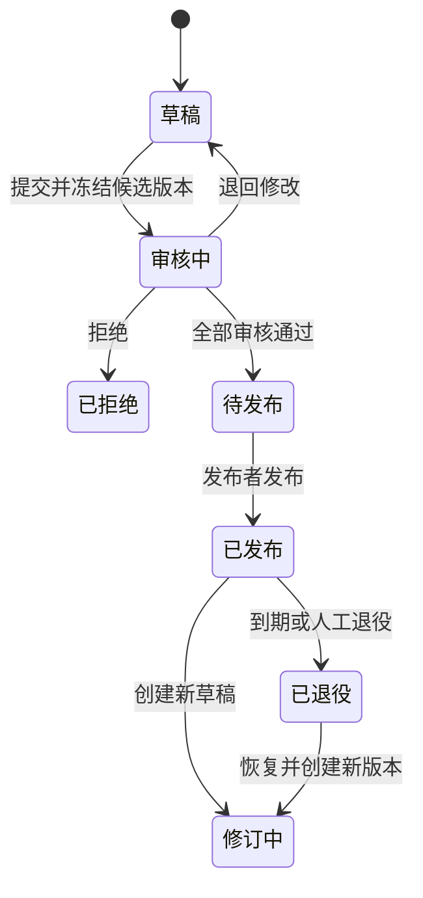

# YashanDB 知识中心建设平台总体需求

> 文档类型：需求文档
> 需求编号：知识中心建设-总体需求-001
> 模块标识：knowledge-center（知识中心）
> 负责人：产品负责人 / 产品经理
> 状态：评审中
> 版本：0.7.0
> 更新日期：2026-08-21
> 关联需求：REQ-OUTLINE-COMPATIBILITY
> 关联设计：agent-runner/docs/overview/知识平台工程化技术汇报构建思路.md
> 关联任务：../04-开发任务/知识中心建设需求规划任务.md

## 1. 文档目的

YashanDB 知识库文档生成器当前是以单次文档生成为主的演示级工具，已经具备知识点选择、大纲上传、提示词或智能代理生成、基础文档查看和文件版本元数据等能力，但尚未形成支撑多人、多个知识领域和持续运营的知识中心。

本需求定义从“文档生成工具”升级为“企业知识中心管理平台”的产品目标、业务边界、用户角色、知识生命周期、能力地图、优先级与验收标准。本文只回答 **为什么做、为谁做、需要什么、如何验收**；除已确认的 CAS 认证和 YashanDB 数据库选型外，不冻结其他技术架构、公共接口和外部依赖选型。

### 1.1 文档版本与检索数据的区别

知识中心需要同时具备文档历史版本能力和知识检索能力，但二者不是一回事：

| 概念 | 业务含义 | 必备能力 | 本需求是否指定技术实现 |
|---|---|---|---|
| 文档版本库 | 保存草稿、审核候选、发布版和退役版的历史事实 | 比较差异、恢复历史、追溯作者与审核记录 | **是；目标业务数据存储确定为 YashanDB，表结构和大对象存储方式在详细设计中冻结** |
| 正式知识检索范围 | 决定哪些文档版本可以被普通读者搜索、被智能问答引用、被后续生成复用 | 权限过滤、版本绑定、撤回和重建 | 只定义业务准入规则，不指定全文、向量或图数据库方案 |
| 检索数据 | 从获准版本派生出来的全文、语义或关系数据 | 可重建、可撤回、与来源版本保持关联 | 否；由知识检索模块在架构阶段设计 |

因此，**D-11 决定的是哪些版本可以进入正式知识检索范围，不决定文档历史存在哪里。** 无论 D-11 如何选择，文档版本管理都是知识中心的必备能力；目标业务事实、文档正文和版本数据统一迁入 YashanDB。数据库表结构、正文与二进制大对象的具体承载方式、容量边界和迁移批次仍需在详细设计中验证。

## 2. 已确认的产品决策

| 决策项 | 确认结果 | 对需求的约束 |
|---|---|---|
| 组织模型 | **单一企业内部平台，支持多个部门及其知识空间；当前实际先配置一个部门** | 数据和权限模型不得固化为单部门；仅有一个部门时前端弱化部门切换，新增部门后自动开放切换与隔离能力 |
| 多人协作 | **首期章节级异步协作，并为同段实时协同预留演进空间** | 首期提供任务分配、章节认领、编辑锁、评论和合并；不把 OT/CRDT 实时编辑列为首期验收项 |
| 审核流程 | **每个知识空间可配置一级或多级审核** | 审核层级、角色和通过规则由空间策略决定，不在业务代码中固定 |
| 外部系统集成 | **采用“核心契约固化 + 受控代码连接器插件”策略；Skill 只处理内容语义** | PingCode 首期只读获取并保存来源快照；GitLab 首期允许发布后异步创建文档分支和 MR；GitHub 预留同一连接器契约，暂不进入 P0 实现 |
| 知识资产目录 | **现阶段建设统一知识资产目录，并作为一级业务导航** | 统一浏览和组织大纲、模板、素材、文档及知识关系；各类资产正文和版本仍由对应业务模块负责，不在目录中形成第二份可编辑事实 |
| 用户认证 | **接入企业内部统一 CAS 登录认证** | CAS 负责确认用户身份；平台仍负责用户映射、空间角色和资源授权，不以“已登录”代替业务鉴权 |
| 数据持久化 | **目标数据库确定为 YashanDB，逐步替换现有 Linux 文件目录存储** | 先迁业务元数据和版本关系，再迁正文与文件内容；迁移批次只允许一个写入主源，并保留摘要核对和回退能力 |

以上决策是本版需求基线。后续修改需形成变更记录，并评估权限模型、状态机、迁移和验收影响。

## 3. 产品目标与非目标

### 3.1 产品目标

1. 将分散的大纲、模板、素材、文档和知识关系纳入统一的知识资产目录，并保留各资产的责任模块和版本事实。
2. 支持多人围绕同一文档集并行生产，明确负责人、章节边界、进度、冲突和交付状态。
3. 建立从大纲与模板准备、来源选择、文档编写、审核到发布的受控生产闭环。
4. 通过空间权限、版本、审核、来源和审计记录，使每个发布文档“谁能看、谁能改、依据什么、何时生效”可追溯。
5. 保留大模型在整理和生成方面的效率优势，同时把来源选择、争议仲裁和发布责任留给人。

### 3.2 非目标

- 首期不建设面向多个企业的软件服务、多租户计费或商业化套餐能力。
- 首期不要求多人同时编辑同一段文字，不承诺 Office/Notion 级实时协同体验。
- 不将模型生成结果默认视为正式知识；未经门禁和审核不能形成正式发布版本。哪些版本可以进入正式知识检索范围由 D-11 确认。
- 不以平台替代 PingCode、GitLab 的项目管理和代码评审；首期通过受控连接器获取来源并保存快照，增量来源由人工选择，全量来源由预设规则形成候选集并经人工确认，其中 GitLab 允许发布后异步创建文档分支和 MR，不覆盖外部既有分支或文件。平台只预留集成管理和受控扩展能力，不承诺首期复制外部平台的全部业务功能。
- 除已确认的 CAS 和 YashanDB 外，本需求不批准其他新技术栈、外部依赖、安全方案或性能指标；相关内容需进入架构门禁。

## 4. 用户角色与责任边界

角色是权限策略的业务基线，具体权限可按空间配置，不要求一个用户只能拥有一个角色。

| 角色 | 主要责任 | 关键权限边界 |
|---|---|---|
| 平台管理员 | 管理企业级配置、身份接入、全局分类和审计 | 不因技术管理身份自动获得所有敏感正文的阅读权 |
| 大纲管理员/手册负责人 | 维护手册大纲、选择模板，并对结构完整性负责 | 可修改负责大纲及其模板绑定，也可编辑共享模板；保存必须产生新版本，不得覆盖历史版本或直接删除模板 |
| 空间管理员 | 创建空间规则、成员、角色、审核流和发布策略 | 仅管理被授权的知识空间 |
| 知识负责人 | 规划知识域、大纲、模板和生产批次，对完整性交付负责 | 可分配任务，不可绕过既定审核流发布 |
| 作者/编辑者 | 编写或生成被分配的文档、章节，处理修改意见 | 只能编辑授权范围，不能审批自己的提交（默认规则，待策略确认） |
| 审核者 | 检查事实、结构、合规和可用性，批准、驳回或退回 | 必须记录结论和意见，不直接无痕改写作者内容 |
| 发布者 | 将审核通过版本发布到指定渠道 | 只能发布满足空间门禁的不可变版本 |
| 知识运营人员 | 维护标签、质量问题、反馈、过期和运营指标 | 不自动拥有业务事实仲裁权 |
| 阅读者 | 检索、阅读、收藏、订阅和反馈 | 只访问自身权限范围内的已发布知识 |
| 审计人员 | 查阅操作、版本、审批和权限变更记录 | 原则上只读，正文访问仍受密级和审计授权约束 |

## 5. 知识生命周期

知识中心不是“多个管理菜单”的集合，而是知识资产目录与文档生产发布闭环的组合：

核心业务不变量：

- **来源与产物分离**：参考素材、生成草稿和正式发布知识是不同资产，不互相覆盖。
- **草稿与发布分离**：可编辑草稿持续变化，发布版本一经生效必须不可变；修订形成新版本。
- **权限与可发现性一致**：无阅读权限的内容不得通过搜索摘要、问答引用、关联关系或缓存泄露。
- **审核与发布分离**：审核通过不等于自动发布，是否合并由空间策略配置。
- **删除与退役分离**：正式知识优先退役和归档，不以物理删除破坏引用与审计链。

## 6. 能力地图

### 6.1 核心知识资产能力

| 能力域 | 解决的问题 | 主要产物 | 优先级 |
|---|---|---|---|
| 知识空间与分类体系 | 不同部门、项目和知识域如何隔离并组织 | 部门、知识空间、目录、分类、标签和术语表 | P0 |
| 统一知识资产目录 | 如何统一发现和浏览分散的资产 | 资产目录项、资产类型、归属、状态和关系摘要 | P0 |
| 文档大纲管理 | 文档集要覆盖什么、章节如何拆分 | 版本化大纲、节点责任、覆盖状态 | P0 |
| 模板管理 | 不同文档怎样保持结构与质量一致 | 模板、槽位约束、适用范围、版本 | P0 |
| 素材与来源管理 | 文档依据从哪里来、是否最新可信 | 来源快照、版本、引用、授权范围 | P0 |
| 文档生产与编辑 | 如何生成、编辑、合并和形成交付物 | 草稿、章节、变更集、评论 | P0 |
| 文档版本管理 | 如何追踪变更、比较、恢复和引用特定版本 | 版本、差异对比、基线、回退记录 | P0 |
| 文档审核与发布 | 谁以什么规则批准并让知识生效 | 审核单、意见、发布版本、发布记录 | P0 |
| 知识关系与引用溯源 | 文档、章节、术语和来源如何关联 | 引用链、依赖关系、影响范围 | P1 |

### 6.2 协作与治理能力

| 能力域 | 解决的问题 | 主要产物 | 优先级 |
|---|---|---|---|
| 任务与并行协作 | 多人如何并行但不互相覆盖 | 生产批次、任务、章节认领、编辑锁 | P0 |
| 权限管理 | 谁可以看、改、审、发和管理 | 用户、用户组、角色、策略、授权记录 | P0 |
| 质量门禁与仲裁 | 哪些内容可以进入正式知识 | 检查报告、冲突节点、仲裁记录 | P0 |
| 文本评论与审核协作 | 审核者如何像 Word 一样针对原文给出意见 | 文本选区、锚点、评论、回复、待办和解决状态 | P0 |
| 通知与订阅 | 协作事项如何到达责任人 | 通知、订阅和提醒 | P1 |
| 生产进展报表 | 如何掌握整本手册的生产进度和更新情况 | 进度汇总、更新摘要、异常与下钻明细 | P0 |
| 生命周期与保鲜 | 如何发现过期、无人维护和低质量知识 | 责任人、复核周期、过期任务、退役记录 | P1 |
| 运营分析 | 如何判断知识是否被使用、是否有效 | 覆盖率、检索效果、反馈和处理时效 | P1 |
| 审计与合规 | 谁在何时因何原因改变了什么 | 不可抵赖操作日志、审批链、导出记录 | P0 |

### 6.3 使用与平台支撑能力

| 能力域 | 解决的问题 | 主要产物 | 优先级 |
|---|---|---|---|
| 统一检索与知识门户 | 用户如何找到已授权的可信知识 | 分类导航、全文/语义搜索、结果解释 | P1 |
| 有来源的智能问答 | 用户如何用自然语言消费知识 | 答案、引用、知识版本和不确定性提示 | P1 |
| 外部来源连接与受控回写 | 如何安全获取 PingCode/GitLab 来源，并把批准的知识版本同步到代码平台 | 连接器实例、来源快照、同步任务、回写审计和失败重试 | P0 |
| 集成管理与开放能力 | 如何统一管理外部平台连接、能力授权、同步策略和后续扩展 | 集成目录、连接实例、能力声明、同步策略、事件订阅和开放接口 | P0（管理壳）/P1（扩展） |
| AI 生成与规则治理 | 文档生产如何可控使用 Agent、Skill、模型、提示词和规则 | 生成方案、Agent/Skill 版本、运行链路、评测结果、成本与失败记录 | P0（生成与追溯）/P1（评测与成本优化） |
| 平台运维与可观测性 | 管理员如何发现任务、容量和服务异常 | 运行状态、告警、容量、失败重试记录 | P1 |
| 备份、恢复与连续性 | 知识资产损坏或误操作后如何恢复 | 备份点、恢复演练、恢复证据 | P1 |

优先级表示产品建设顺序，不代表能力已经实现。

## 7. 核心模块需求

### 7.1 部门、知识空间与资产目录

1. 组织层级采用“企业 → 部门 → 知识空间 → 知识资产”。首期支持多个部门，当前部署可只配置一个部门，数据结构、权限和路由不得写死单部门假设。
2. 部门或空间管理员可创建知识空间，设置名称、用途、负责人、成员、默认权限、审核流和发布策略。
3. 每份大纲、模板、素材、生产任务和文档必须有明确归属；共享模板可被多个大纲和空间按权限引用，但模板本身保留唯一稳定身份。
4. 统一知识资产目录按权限展示大纲、模板、素材、文档和知识关系的目录项、类型、归属、状态与版本摘要；资产正文和版本仍由对应模块维护，目录不复制正文。
5. 每个空间可维护多级目录、标签、文档类型和术语表；企业级公共术语与空间术语区分作用域，冲突时显示差异而不静默覆盖。
6. 部门和空间可进入正常、冻结、归档状态；冻结期间禁止内容变更，归档后只读且不默认进入普通浏览结果。
7. 支持部门和空间级概览，展示资产数量、任务进度、审核积压、断链和权限异常。

验收重点：单部门部署不要求用户重复选择部门；新增第二个部门后无需修改代码即可显示切换入口。不同部门和空间的内容按权限隔离，统一目录不得泄露无权资产的标题、摘要、关系或数量。

### 7.2 文档大纲管理

1. 支持创建、导入、复制和版本化管理文档集大纲，保留标题树、业务流和时序结构。
2. 大纲节点需包含节点 ID、标题、说明、必填性、负责人、目标文档类型、来源要求和完成状态；一个大纲版本可绑定一组明确的模板版本。
3. 章节负责人以已确认的大纲版本和责任映射版本为准；工作台据此生成或更新章节任务。普通作者不得绕过映射自行改换负责人；一个节点可以拆成多个任务，但同一时刻只能存在一个可合并的主编辑分支。
4. 大纲变更需展示新增、移动、改名、删除及对既有文档的影响，已发布文档对应节点不得静默删除。
5. 大纲可从存量文档逆向提取候选结构，但必须经人工确认后才能成为生产基线。
6. 只有该大纲的大纲管理员/手册负责人或管理员可以修改大纲及其模板绑定关系；修改后形成新的大纲版本，已开始的生产任务继续使用原绑定版本。
7. 平台需要展示整本手册的目录结构，并可从目录节点查看对应的具体文档、负责人和生产状态；目录来自 Markdown 大纲，责任人关系来自责任映射表；展示使用稳定节点身份，不以 Excel 行号作为业务身份。

验收重点：大纲版本可比较和恢复；节点到任务、文档和发布版本可追溯；结构变化能生成影响清单。

### 7.3 模板管理

1. 模板按文档类型、共享范围和版本管理，包含章节结构、必填槽位、格式、术语、引用和质量要求；共享模板可被多个大纲选择。
2. 模板生命周期至少包含草稿、审核中、已发布、已停用；已发布模板不可原地修改。
3. 大纲管理员/手册负责人可以编辑其有权使用的共享模板正文；每次保存都必须创建新模板版本，记录修改人、时间、原因和差异，并支持从历史版本恢复为一个新的当前版本。
4. 支持模板继承或组合，但必须能解释最终生效规则和冲突来源。
5. 模板中的阈值、提示词和校验规则采用版本化配置，禁止散落在页面或生成代码中。
6. 普通用户和手册负责人不能直接删除模板。只有管理员可以发起删除；未发布且未被引用的草稿可物理删除，已发布或已被大纲、任务、文档引用的模板只能停用或归档，以保证历史可回放。

验收重点：同一生产批次锁定模板版本；共享模板产生新版本后，其他大纲和既有任务不自动升级；任一历史版本可查看和恢复；停用模板不可用于新任务，但历史文档仍可回放其版本。

### 7.4 权限管理

1. 采用“企业用户/用户组 + 空间角色 + 资源级例外”的授权模型，覆盖查看、创建、编辑、评论、审核、发布、管理和审计权限。
2. 权限可作用于空间、目录、文档和高敏附件；默认继承空间策略，例外授权必须可见、可审计和可到期。
3. 搜索、问答、关联雷达、导出、通知和缓存与正文使用同一授权事实，不能只在页面入口做权限控制。
4. 权限变更立即影响新请求；历史导出和已分享内容按后续确认的安全策略处置。
5. 平台支持最小权限和职责分离，空间可配置作者是否允许审核自己的提交。

验收重点：未授权内容在列表、搜索、问答引用、关系图和统计中均不可见；所有授权变更都有操作者、原因和时间记录。

### 7.5 多人并行生产与编辑

1. 手册负责人上传 Markdown 大纲文件，由平台解析并生成大纲版本、目录节点和整本手册目录；Markdown 是结构事实，不与责任映射表混为一体。
2. 手册负责人通过责任映射 Excel 批量维护“手册—具体文档—负责人”的对应关系，平台同时提供专用表格维护同一份责任映射数据。该表在绝大多数时间保持稳定，仅在责任人、人员或文档映射发生变化时更新，不用于每次重建 Markdown 大纲。
3. 责任映射 Excel 和前端表格是同一业务对象的两个维护入口，不得形成两套状态。上传后先解析并展示映射问题、相对当前映射版本的差异以及受影响的目录节点，负责人确认后才应用更新；确认结果关联当前大纲版本。
4. 知识负责人可基于已确认的大纲版本和责任映射版本创建或更新文档/章节任务，设置负责人、协作者、期限、来源、模板和验收要求。
5. Markdown 解析规则、责任映射 Excel 列定义、必填字段、稳定匹配、重复行处理和表格编辑交互在详细设计中冻结；概要阶段只确定双入口、预览确认、表格维护和版本追溯边界。
6. 首期采用异步协作：章节编辑锁、主动释放、超时回收、管理员接管及离线草稿冲突提示。
7. 不同章节允许并行编辑；同一章节发生基线变化时不得直接覆盖，必须比较并由作者选择重放、合并或放弃。
8. 支持用户用鼠标选择一段连续文本后添加评论，交互参照 Word 审核；评论支持回复、提及、待办和解决状态，并绑定文档版本、章节、文本选区锚点和创建时的引用文本。原文变化导致锚点无法准确定位时，应保留原引用并明确标记“位置待确认”，不得静默挂接到相似文本。
9. 合并时检查大纲覆盖、术语、交叉引用和章节间矛盾，形成可审阅的合并报告。
10. 数据模型应保留稳定文档 ID、章节 ID、操作人和变更序列，为后续实时协同演进提供基础，但首期不实现 OT/CRDT。

验收重点：Markdown 可形成可预览的大纲版本；责任映射 Excel 可批量更新手册、文档和负责人关系，确认前不改变当前映射；同一结果可在前端专用表格继续维护并从整本手册目录查看。至少两名作者可并行完成不同章节且无内容覆盖；审核者可选择一段文字发起评论并在原位置查看回复，原文变化后评论不误挂；锁异常可恢复；冲突无法静默合并；任务进度可按大纲和责任映射版本汇总。

### 7.5.1 Agent 与 Skill 辅助生成

1. Agent 是受控的生产流程编排者，负责按生成方案调用已发布 Skill、模型、提示词和质量规则；Skill 是单一、版本化的语义能力，例如素材清洗、结构映射、章节撰写、术语统一、引用校验和差异分析。
2. 平台管理员在“平台管理 / AI 能力管理”中登记、检查、评测、发布和停用 Agent、Skill、模型、提示词与规则版本；未发布或检查失败的能力不得进入生产。
3. 手册负责人在生产批次创建或启动前，从已授权的发布版本中选择生成方案，确认适用范围、Agent、Skill 组合、模型策略、质量规则和人工门禁。批次启动后配置被冻结，升级只能形成新批次或经审计的新运行。
4. 作者在“文档生产”中首先确认来源快照和生成方案摘要，再启动或继续生成；页面展示素材处理、结构映射、章节生成、引用/质量检查等业务步骤及其状态，技术版本放在可展开的运行详情中。
5. 每次生成运行必须冻结生成方案版本、Agent 版本、Skill 版本集合、模型、提示词、模板、规则、大纲、来源快照和操作人，并记录步骤输入输出摘要、耗时、成本、警告、失败原因和重试关系。
6. 审核者可查看候选版本的生成链路、AI 生成/人工修改/合并差异归因和未通过的检查项；归因只用于追溯，不代表内容质量或免除审核责任。
7. Agent、Skill 或模型不得自行选择未经确认的增量来源、修改审核结论、发布文档、读取连接凭证或执行外部回写；人工始终是来源、生成规则、草稿提交、审核和发布的最终确认者。

验收重点：用户能看懂“用了什么生成方案、当前执行到哪一步、失败后怎么恢复”；发布版本可回放实际使用的 Agent/Skill/模型/提示词/规则和来源快照版本；能力版本更新不漂移运行中的生产任务。

### 7.6 文档版本管理

1. 区分可变草稿、审核候选和不可变发布版本，版本号规则由空间配置或平台统一规则决定。
2. 每次提交记录作者、时间、原因、来源快照、大纲和模板版本、父版本及内容摘要。
3. 支持文档和章节级差异对比，区分人工编辑、大模型生成、合并和审核修订。
4. 支持从历史版本创建新草稿进行恢复，不直接覆盖已发布版本。
5. 引用默认指向稳定文档，并可固定到特定版本；被引用版本退役时通知依赖负责人。
6. 全量文档生成可依据预设来源规则确定候选来源范围或来源集合，但必须由人工确认采用的规则、范围和例外后才启动生成；增量文档更新必须由人工选择具体参考来源，只对确认的来源产生变更补丁。内容摘要、时间戳更新提示和关联雷达仅提供非阻断情报，人工始终是最终审核和确定者。
7. 文档元数据、版本关系、正文和内容摘要的目标持久化介质为 YashanDB；历史 Linux 文件目录在迁移完成前只承担兼容读取、迁移源或经批准的临时回退，不再作为新平台的长期业务事实主源。正文和附件采用普通字段、大对象字段或受控外部对象引用的具体边界在详细设计中依据容量、事务、备份和访问模式确定。

验收重点：任一发布版本可重现其正文、来源、大纲、模板和审核记录；恢复操作形成新版本；历史引用不因新发布而失真。

### 7.7 文档审核与发布

1. 空间管理员可配置一级或多级审核，包括每级审核角色、顺序、通过规则、退回规则和超时升级方式。
2. 提交审核时冻结候选版本；后续编辑必须撤回审核或创建新候选，不能改变审核者正在查看的内容。
3. 审核者可通过、退回修改或拒绝，并对具体章节添加阻断意见；所有决定必须记录理由。
4. 审核流变更只作用于新提交，进行中的审核采用提交时冻结的流程版本。
5. 只有完成全部审核和质量门禁的候选版本可发布；发布范围至少区分空间内发布与企业内发布，外部发布待确认。
6. 支持紧急修订，但不能无痕绕过审核；例外流程必须配置授权、原因、补审期限和审计标记。
7. 审核意见、文本选区、回复、处理结果、候选版本差异和最终修改记录必须结构化保存，并预留按授权读取的分析接口。后续可由大模型结合经审核、版本化的上传 Skill 分析高频问题、修改模式和审核规则候选，但分析结果只能作为建议，不得修改原始审核记录、替代审核结论或自动改变发布状态。

建议状态机：

验收重点：空间 A 可配置一级、空间 B 可配置多级审核；流程版本被冻结；任何发布版本都能定位完整审批链。审核记录分析接口可按文档、版本和权限返回结构化记录，且派生分析与原始审核事实可区分、可追溯。

### 7.8 素材、引用与知识关系

1. 支持本地上传以及通过已登记的来源连接器从 PingCode、GitLab 获取来源。增量更新由人工选择具体参考源；全量生成由预设规则形成候选来源范围，人工确认引入规则后再执行。GitHub 保留同一连接器契约，首期不进入 P0 实现。
2. 连接器是受控的后端代码插件，必须声明平台类型、版本、认证方式、读取范围、写入能力、限流和快照能力，经管理员启用后才能被业务使用；不能把连接器凭证、网络调用或写入动作交给 Skill。
3. 每次使用保存来源地址、远端标识、版本或提交号、内容摘要、获取时间、连接器版本、访问范围和本地来源快照。平台必须先提供完整内容预览，明确抓取状态和内容摘要；只有人工执行“固化为来源快照”后，来源才可被生产任务引用。预览或快照均不直接等同于正式知识、文档版本或发布版本。连接器只能返回统一来源模型，不能直接修改文档正文。
4. PingCode 首期仅允许读取并保存来源快照，不向 PingCode 回写正文、状态或评论。GitLab 首期允许在知识中心发布成功后，由受控异步任务创建文档分支、提交发布文档并创建 MR；不得直接覆盖既有分支或文件。
5. GitLab 回写目标必须由手册级配置显式确定，不能从人工参考源地址自动推断；回写默认按发布批次建立一个 MR，具体粒度和目标映射在详细设计中确认。
6. GitLab 回写不是知识中心发布的原子组成部分。知识版本发布成功后，回写任务可处于排队、成功、失败或待人工接管状态；失败不能撤销已发布知识，必须告警、保留失败原因并支持幂等重试。
7. 段落或事实可关联到具体来源片段，读者在有权限时可回看证据；来源连接器和 Skill 均不得伪造来源证据。
8. 管理文档之间的引用、依赖、替代、适用版本和冲突关系，并提供变更影响清单。来源更新只触发灰色提示和待评估任务，不自动改写已发布知识。

验收重点：关键事实能够回到固定来源版本；来源无权或失效时明确显示；PingCode 只读约束可审计；GitLab 发布后能形成可追溯的分支/MR同步任务；连接失败不影响已发布知识且可重试；不使用模型或 Skill 内容伪造外部证据。

### 7.9 质量门禁与知识仲裁

1. 入库前检查来源、时效、逻辑、术语、完整性、重复、格式、安全和权限标签，规则按版本配置。
2. 检查结果区分阻断、警告和信息；具体级别、阈值和适用文档类型需可配置。
3. 冲突知识进入待仲裁状态，不直接覆盖旧结论；仲裁需记录适用版本、场景、独立信源和人工结论。
4. 三个独立信源一致或人工仲裁可作为确定态的候选规则，但信源独立性和高风险知识的人工要求仍需配置。
5. 若 D-11 确认“仅发布版本进入正式知识检索范围”，则只有高置信、已发布且权限允许的知识进入正式检索和后续生成；草稿如需支持协作者预览，可生成隔离的临时检索数据，但不能进入正式问答或后续生成。置信度下降时可撤回相应检索数据。

验收重点：阻断项不能发布；警告是否可放行由空间策略决定；模型生成内容不能作为自身事实的独立信源。

文档资产状态与检索准备状态必须分开管理，避免把“审核通过”“发布完成”和“已可检索”视为同一件事：

| 文档资产状态 | 允许的检索准备状态 | 用户可见结果 | 失败或退出处理 |
|---|---|---|---|
| 草稿 | 未准备；或待 D-11 确认的隔离预览数据 | 仅授权协作者可见，并明确标记非正式 | 草稿更新使旧预览数据失效 |
| 审核候选 | 未准备或保持隔离预览 | 审核者查看冻结候选，不进入正式问答 | 退回后撤销候选预览数据并回到草稿 |
| 已发布 | 待处理、处理中、可检索、处理失败 | 只有处理成功后才显示为“可检索”；失败时显示发布成功但知识入库失败 | 由知识运营人员重试或回退，不能伪报完整成功 |
| 已退役 | 撤回中、已撤回、撤回失败 | 默认不再出现在搜索和问答中，历史引用按权限可追溯 | 撤回失败需告警、重试并立即阻止新引用 |

检索数据重建、撤回和缓存失效必须共享发布版本标识；具体使用全文索引、向量库、图数据库或其他实现，以及事务和补偿机制，由后续架构设计确定。

### 7.10 检索、问答与知识门户

1. 阅读者可按空间、目录、标签、文档类型、产品版本、状态和更新时间浏览知识。
2. 统一搜索支持标题、正文、术语和语义检索，结果展示命中原因、发布版本、更新时间和来源状态。
3. 智能问答先识别意图，再路由向量检索、图关系或混合检索；答案必须给出当前用户有权访问的引用。
4. 当证据不足、冲突未仲裁或版本不适用时，系统应说明不确定性，不补写确定答案。
5. 支持收藏、订阅、相关文档和最近访问；缓存键必须包含权限、知识版本和路由策略。

验收重点：同一查询对不同权限用户返回不同且不泄露的结果；答案引用能定位发布版本；知识撤回后缓存及时失效。

### 7.11 反馈、运营与知识保鲜

1. 阅读者可反馈错误、过期、难理解、缺少内容或权限问题，并关联到具体文档版本和段落。
2. 反馈进入责任队列，具备负责人、优先级、处理状态、答复和关闭证据。
3. 文档可设置责任人和复核周期；到期、来源更新、依赖变化或持续负反馈可触发复核任务。
4. 运营看板展示生产周期、审核时长、过期率、无结果查询、反馈关闭时长、知识覆盖和引用使用情况。
5. 阅读量不能单独代表质量，指标不得自动改变知识置信度或发布状态。

验收重点：反馈可追踪到关闭；无人负责和超期知识可发现；运营指标支持按空间和文档类型分析且遵守权限。

### 7.11.1 文档生产进展报表

1. 工作台提供文档生产进展报表，至少能按部门、知识空间、手册、生产批次、负责人和时间范围查看整体进展。
2. 报表需要展示整本手册的目录节点总数、未开始、编写中、待审核、退回修改、待发布、已发布和异常数量，并展示完成比例；统计口径必须绑定明确的编排版本和查询时间。
3. 报表需要展示手册更新情况，包括统计周期内新增、修改、删除、移动、负责人变更、重新生成、审核退回和发布的文档或目录节点，并可下钻到对应编排差异、任务、版本或审核记录。
4. 报表数据是对目录编排、生产任务、生成运行、审核实例和文档版本的只读聚合，不成为新的业务事实来源；源状态变化后应按统一口径重新计算或更新投影。
5. 不同角色只能看到授权范围内的汇总和明细；无权资产不得通过数量、标题、负责人或更新摘要泄露。
6. 支持页面查看和按权限导出。具体图表样式、刷新频率、导出格式和大数据量计算方式在详细设计中确定。

验收重点：手册负责人能从总体进度下钻到未完成或异常节点，并查看一个统计周期内的手册更新明细；报表数值可与同一时点的编排、任务、审核和发布事实核对，权限过滤前后一致。

### 7.12 集成、审计与平台治理

1. 用户认证接入企业内部统一 CAS。平台接收并校验 CAS 登录结果，将企业用户标识映射为平台用户；CAS 不承载空间角色、文档权限或审核权限，所有业务请求仍由平台授权模块校验。
2. CAS 不可用、票据无效、用户未映射或账号已停用时拒绝登录并记录安全审计；单点退出、会话时长、用户属性映射和应急访问方式在认证详细设计中冻结。
3. 外部平台连接统一经过 M04 来源管理和受控连接器插件；需记录连接身份、连接器版本、同步范围、能力声明、失败、限流和最近健康状态，不自动扩大访问权限。
4. 平台开放能力应支持知识查询、任务状态、发布事件以及按授权读取审核记录和派生分析结果；接口鉴权、限流、脱敏、分页和审计规则在接口详细设计中冻结。
5. 审核分析任务必须固定输入的审核记录版本、候选与发布版本、模型、提示词、Skill 和规则版本；上传 Skill 需经过权限校验、安全检查和版本登记后才能参与分析。Skill 只参与清洗、抽取、比较或分析等语义工作，不得读取连接凭证、绕过连接器契约或直接执行外部写入。
6. 审计覆盖 CAS 登录结果、授权、查看高敏内容、下载、编辑、评论、审核、审核分析、发布、退役、导出、规则变更和管理员操作。
7. 模型、提示词、Skill、模板和质量规则均需版本化，运行记录关联实际使用版本、成本、耗时和失败原因。
8. 后台任务支持幂等、暂停、取消、失败重试和人工接管，不能因页面关闭丢失生产状态；外部回写任务必须与知识中心发布任务分开记录状态和审计。
9. 提供备份与恢复能力，并通过周期演练验证恢复点和恢复时间；具体目标待确认。

验收重点：用户可通过内部 CAS 登录，未授权用户即使登录成功也不能访问受限资产；可以从发布版本反查完整生成、治理和外部同步链；PingCode 不能出现写入调用，GitLab 回写只能由已授权发布任务触发；审核分析输入、执行版本和输出可追溯；权限和规则变化可审计；任务失败不会生成半发布资产。

### 7.13 集成管理模块

集成管理是“平台管理”下的独立二级业务模块，固定路由为 `/admin/integrations`。它不是某个平台的业务替代，也不是把外部 API 直接暴露给作者，而是统一承载外部平台接入的**登记、授权、能力、策略、任务和审计**。

1. 平台管理员可登记集成提供方、连接器版本、连接实例、授权范围和启停状态；页面只显示脱敏账号、能力和健康摘要，不显示凭证明文。
2. 每个集成实例必须声明可用动作，例如读取来源快照、创建分支、提交文档、创建 MR、接收事件；未声明或未授权的动作不得被业务调用。业务模块不能自行拼接外部平台地址或令牌。
3. 管理员可按知识空间、手册或发布渠道配置集成策略，包括允许的读写方向、目标映射、触发条件、限流、重试和人工接管规则。集成管理不得替作者选择增量参考源，也不得绕过手册负责人对全量来源规则的确认。
4. 集成管理提供连接健康、来源获取、外部同步任务、失败原因、重试次数和人工接管入口，并能跳转到对应来源快照、发布版本、审计事件和外部链接。
5. P0 提供 PingCode 只读和 GitLab 读取/发布后分支-MR 的管理能力；GitHub 只展示契约预留和接入条件。后续接入其他平台必须复用统一连接器契约，不得在文档生产模块中新增平台特判。
6. 平台可以通过集成能力引用外部平台已有的项目、任务、代码评审、通知或事件，补齐知识中心的协作短板；首期只建立稳定链接和受控事件边界，不复制外部平台的项目管理或代码评审事实。
7. 事件订阅、开放接口、跨平台状态映射和更细粒度同步列为后续扩展；任何新增写入动作都必须单独声明能力、最小授权、失败语义和审计要求。

【风险与应对】集成管理容易膨胀为“把所有外部平台搬进知识中心”，导致权限、事实归属和运维责任失控。首期只管理连接和受控动作，外部项目、任务、代码评审仍以外部平台为事实来源；通过能力白名单、目标显式配置、异步任务和审计记录控制范围。若新增能力会改变外部事实或产生双向状态同步，必须先补充详细设计和安全评审。

验收重点：管理员可以在独立的“集成管理”模块查看三类平台的连接实例和能力差异；PingCode 写操作被拒绝，GitLab 仅按已授权发布任务创建分支/MR；作者无法从集成管理绕过人工来源选择；失败任务可重试或人工接管；未来新增连接器不需要改动文档生产的业务规则。

## 8. 关键对象与关系

为保证需求逻辑自洽，产品层至少需要以下稳定业务对象。字段和存储结构由后续设计确定。

| 对象 | 作用 | 关键关系 |
|---|---|---|
| 部门 | 企业内部组织和权限归属边界 | 包含知识空间和部门成员 |
| 知识空间 | 权限、分类、审核和发布策略的治理边界 | 包含成员、目录、大纲、模板、生产任务和文档 |
| 知识资产目录项 | 对大纲、模板、素材、文档和关系的统一索引 | 指向各资产责任模块，不复制正文和版本事实 |
| 大纲及节点 | 定义知识覆盖与生产拆分 | 节点关联任务、模板、文档和负责人 |
| 模板及版本 | 定义结构与质量约束 | 被生产批次和文档版本锁定引用 |
| 来源快照 | 保存人工选择的外部或本地事实依据 | 被章节、事实和生成运行引用 |
| 生产批次/任务 | 组织多人并行交付 | 关联大纲节点、作者、期限和候选版本 |
| 责任映射表 | 统一维护手册、具体文档和负责人的对应关系 | 关联大纲版本、目录节点、文档、章节任务和负责人 |
| 责任映射变更集 | 保存一次责任映射 Excel 解析、差异预览和确认结果 | 应用后形成新的映射版本，失败或取消不改变当前版本 |
| 文档/章节 | 稳定身份与可编辑内容单元 | 拥有草稿、评论、引用和版本 |
| 文档版本 | 不可变内容快照 | 关联父版本、来源、模板、审核和发布 |
| 审核实例 | 某候选版本的冻结审批过程 | 锁定流程版本、审核层级和决定 |
| 发布记录 | 某版本在某范围内的生效事实 | 关联发布者、时间、范围和退役状态 |
| 权限策略 | 定义主体对资源的允许或拒绝 | 作用于空间、目录、文档和附件 |
| 质量/冲突记录 | 保存检查、证据和仲裁过程 | 关联规则版本、内容位置和处置结论 |
| 文本评论锚点 | 保存选中文本评论的版本、章节、位置和原始引用 | 关联评论、回复、处理状态和后续版本定位结果 |
| 生产进展报表投影 | 汇总手册生产进度、更新和异常 | 从编排版本、任务、生成、审核和发布事实派生，可下钻但不反向修改源事实 |
| 审核分析运行 | 记录一次审核数据分析的固定输入、执行配置和派生输出 | 关联审核记录、文档版本、模型、提示词、Skill、规则版本及操作者 |
| 集成提供方 | 描述 PingCode、GitLab、GitHub 或后续外部平台的接入类型、阶段和统一契约 | 提供连接器实例、能力声明和版本，不直接保存业务正文 |
| 外部连接器实例 | 保存平台连接配置、能力声明、连接器版本和授权范围 | 关联来源平台、连接凭证引用、来源快照和外部同步任务 |
| 外部同步任务 | 保存一次来源获取或发布后外部回写的异步执行事实 | 关联发布版本、连接器实例、目标仓库/分支/路径、分支、提交、MR、重试和人工接管 |
| 集成策略与能力授权 | 约束连接实例在部门、空间、手册和动作维度上的可用范围 | 关联集成提供方、连接实例、能力声明、目标映射、事件订阅和审计 |
| 事件订阅 | 记录后续开放事件的订阅方、事件类型、策略版本和投递状态 | 只消费经过授权的事件摘要，不替代外部平台业务事实 |
| 审计事件 | 保存关键操作事实 | 关联主体、对象、动作、原因和时间 |

## 9. 非功能需求

本节定义方向和验收方法，具体数值需在样本规模、部署环境和安全等级确认后校准。

| 维度 | 需求方向 | 验收方式 |
|---|---|---|
| 安全 | 默认拒绝、最小权限、职责分离、传输与存储保护、敏感信息不进入无权日志 | 权限矩阵、越权回归、审计检查和安全评审 |
| 一致性 | 发布版本、审核对象、来源快照和流程版本不可变；Markdown 大纲和责任映射确认前不改当前版本，写入失败不产生半成品 | 并发、故障注入、导入幂等和恢复测试 |
| 性能 | 列表、检索、文档打开、锁获取和提交审核满足约定用户规模下的响应目标 | 先确定并发、数据量和文档大小，再建立 P95/P99 基线 |
| 可用性 | 长任务脱离浏览器会话运行，支持续查、取消、重试和接管 | 重启、断网、超时和重复请求场景验证 |
| 可扩展性 | 部门、空间、权限、审核流、规则和连接器配置化；评论锚点、审核记录和分析接口保留稳定标识 | 单部门部署无需特殊分支，新增部门、空间和文档类型不修改核心业务代码即可配置 |
| 集成可演进性 | 集成提供方、连接器、能力、目标映射和事件策略可独立登记与停用；外部业务事实不复制为第二套主源 | 以新增连接器和策略配置接入一个模拟平台，不修改文档生产核心流程；停用后历史快照、发布和审计仍可追溯 |
| 外部集成安全 | 连接器按最小权限运行，凭证不进入前端、提示词、Skill 或普通日志；写入能力按平台和动作单独授权 | 连接器能力清单、凭证访问审计、越权回写和 PingCode 禁写回归检查 |
| 外部集成可靠性 | 来源快照和 GitLab 回写任务可幂等、可重试、可暂停和人工接管；外部失败不伪造成功 | 重复发布、超时、限流、分支冲突、MR创建失败和连接器升级场景验证 |
| 可观测性 | 用户能看到任务状态，管理员能定位失败步骤、输入版本和责任边界 | 状态、日志、指标、告警和关联 ID 检查 |
| 可恢复性 | 目录索引、正文、版本、来源快照、权限、配置和审计均纳入备份恢复 | 定期恢复演练，不只检查备份任务成功 |
| 可迁移性 | Linux 文件与 `metadata.json` 可分批导入 YashanDB，迁移过程可核对、可重跑、可回退且不产生双写分叉 | 按批次验证数量、稳定 ID、内容摘要、关系、权限和可打开性，切换失败恢复到迁移前只读快照 |
| 可访问性 | 中文界面清晰，状态不只依赖颜色，键盘与基础辅助技术可操作 | 桌面/移动布局及基础无障碍检查 |

## 10. 分期建设建议

### 10.1 P0：从单人工具到受控多人生产

P0 先以一个真实样板空间和一组文档做纵向薄切，参与者至少包含一名手册负责人、两名作者、一名审核者、一名发布者和一名阅读者。首个可演示闭环只要求：内部 CAS 登录、手册负责人上传 Markdown 大纲并维护责任映射 Excel、平台展示整本手册目录和生产进展报表、基础空间角色、章节任务与编辑锁、文本选区评论、通过受控连接器获取并完整预览来源后固化快照、冻结审核候选、可配置的一/多级最小审核、不可变发布快照、最小权限阅读与纠错反馈入口，以及关键审计。验收时，手册负责人可在专用表格中继续维护责任映射并查看整体进展与手册更新；全量生成先确认规则和来源范围，增量更新由作者人工选择来源；两名作者并行完成不同章节，审核者选择一段文字提出意见并退回其中一章，作者完成重提，发布者发布合并版本，并可触发 GitLab 发布后异步创建文档分支和 MR 的演示任务；阅读者在权限范围内找到文档并提交一次可追踪的修订反馈，全程无静默覆盖且可追溯。

薄切验证多人生产价值后，再在 P0 内补齐以下能力：

- 知识空间、成员和基础的基于角色访问控制。
- 统一知识资产目录及按权限过滤的资产浏览，覆盖大纲、模板、素材、文档和关系摘要。
- 大纲、模板、来源快照的版本化管理。
- 生产批次、章节任务、编辑锁、评论和冲突合并。
- 生产进展报表及手册更新下钻明细。
- 审核记录分析接口及版本化模型、提示词和 Skill 的输入追溯边界。
- Markdown 大纲上传解析、责任映射 Excel 批量维护、差异确认、手册目录结构展示和专用责任映射表维护。
- 草稿、候选和发布版本分离，支持文档差异对比和恢复。
- 集成管理模块的 P0 管理壳，包括连接实例、能力声明、授权范围、健康状态、来源快照和 GitLab 异步同步任务；不把 GitHub 实际接入或跨平台双向状态同步作为完成前置。
- 空间可配置一级或多级审核，发布与退役闭环。
- 入库质量门禁、关键操作审计和现有演示工具资产迁移。

复杂模板继承、批量迁移、完整知识运营看板和自动过期治理不作为首个薄切前置，分别在 P0 后续或 P1 验收。文本选区评论和生产进展报表属于首个薄切；审核智能分析能力本身可后置，但结构化记录、授权读取接口和运行追溯边界需在 P0 预留。

P0 完成标志：一个知识空间可由多名作者并行交付一组文档，经过配置化审核成为不可变发布版本，并可在独立的集成管理模块查看受控外部连接和异步同步任务；全过程可追溯且无越权泄露。

### 10.2 P1：从生产平台到可消费、可运营的知识中心

- 统一门户、权限感知搜索和带来源问答。
- 引用关系、影响分析、反馈闭环和过期复核。
- 通知订阅、运营看板、GitHub 连接器和跨平台增量同步。
- AI/规则版本治理、平台可观测性和备份恢复演练。

P1 完成标志：读者能找到并判断知识是否适用，运营者能发现缺口和过期内容，并把反馈转成下一轮生产任务。

### 10.3 P2：深化协作与知识智能

- 在真实协作数据证明必要后，引入同段实时协同能力。
- 基于知识关系提升影响分析、推荐和跨文档一致性检查。
- 扩展连接器、开放能力和更细粒度的自动化治理。

P2 是否启动由 P1 指标和用户研究决定，不能因“技术先进”直接立项。

## 11. 平台级验收指标

指标目标值需在现状基线采集后确认，本版先定义口径和期望方向。

| 目标 | 指标口径 | 期望方向 |
|---|---|---|
| 多人生产有效 | 一个文档集由两名及以上作者并行完成的比例；冲突覆盖次数 | 并行比例提升，静默覆盖为 0 |
| 交付可控 | 从任务创建到发布的周期；各审核层级停留时间 | 周期可度量，瓶颈可定位 |
| 进展透明 | 手册目录节点各状态数量、完成比例、异常数和统计周期内更新数 | 可按手册与负责人查看并下钻核对 |
| 知识可信 | 发布内容关键事实引用覆盖率；阻断项绕过数 | 覆盖率提升，未授权绕过为 0 |
| 版本可追溯 | 发布版本可还原来源、模板、大纲和审批链的比例 | 100% |
| 权限可靠 | 越权读取、搜索摘要泄露、问答引用泄露数量 | 0 |
| 知识可发现 | 搜索无结果率、查询后成功访问率、反馈解决率 | 无结果率下降，解决率提升 |
| 知识保鲜 | 超期未复核率、来源更新后未处理时长 | 持续下降 |
| AI 可治理 | 生成内容人工改写率、无来源事实率、失败和成本 | 可观测、可按版本比较 |

## 12. 演示工具迁移要求

1. 盘点现有大纲、模板、输出文档、`metadata.json`、生成日志和用户配置，形成“可迁移、需转换、只归档、可丢弃”清单。
2. 建立统一仓储接口，先让现有业务代码不直接依赖 Linux 路径和 `metadata.json`；目标实现写入 YashanDB，旧文件实现仅用于迁移期兼容读取。
3. 为历史文档补充稳定 ID、默认知识空间、所有者、来源状态和初始版本；不能推断的信息进入待确认队列，不因迁移自动获得正式发布资格。
4. 第一批迁移结构化业务事实，包括资产目录项、大纲和模板元数据、文档身份、版本关系、任务、权限、审核、审计和文件索引；验证后再让新业务事实以 YashanDB 为唯一写入主源。
5. 第二批迁移文档正文和版本内容，逐项保存内容摘要、原 Linux 路径、迁移批次和校验状态；现有文件版本元数据不得直接等同于新版本事实，需验证父版本关系和可重放性。
6. 第三批迁移附件、来源快照、生成输入输出和其他大文件。具体使用 YashanDB 大对象能力还是受控外部对象存储引用，由容量与性能验证决定；无论采用何种方式，YashanDB 都保存稳定身份、版本、摘要、权限、位置和生命周期事实。
7. 迁移期间按空间、手册或资产批次切换，每一批只能指定一个写入主源。允许“YashanDB 主写、旧文件只读兼容”，禁止没有对账和补偿机制的双写，也禁止新旧入口同时修改同一资产。
8. 每批迁移依次执行盘点冻结、转换导入、数量和摘要核对、关系与权限核对、抽样打开、切换读路径和观察；任一门禁失败不得切换下一批。
9. 回退只恢复访问路径和迁移前只读快照，不把迁移后 YashanDB 新增事实反向无损写回旧 `metadata.json`。发生需回退的写入后，应暂停该批次新写入并形成差异清单，由人工决定重放或放弃。
10. 全部批次稳定运行并完成备份恢复演练后，旧 Linux 业务目录转为受控归档；达到保留期限且审计批准后才能清理，不能在切换当天直接删除。

### 12.1 分阶段替换路线

| 阶段 | 主写位置 | 主要工作 | 切换门禁 | 回退边界 |
|---|---|---|---|---|
| 阶段 0：盘点与仓储抽象 | Linux 文件目录 | 建立资产清单、稳定 ID、内容摘要、仓储接口和迁移批次 | 清单覆盖率、文件可读性、重复与孤儿文件报告完成 | 保持现有文件读写，不改变数据 |
| 阶段 1：元数据先行 | YashanDB 写业务元数据；旧文件只读正文 | 迁资产、版本关系、权限、任务、审核、审计和文件索引 | 数量、关系、权限和审计核对通过，新写请求不再改 `metadata.json` | 停止新写，恢复旧只读页面；数据库增量保留待重放 |
| 阶段 2：正文与版本迁移 | YashanDB 写元数据和新正文 | 按手册迁正文及版本，摘要核对，旧路径作为兼容读取 | 全量摘要一致、版本可回放、抽样打开和并发写验证通过 | 按批次恢复旧正文只读，禁止回写覆盖新版本 |
| 阶段 3：附件与运行产物 | YashanDB 保存事实及选定内容或受控引用 | 迁附件、来源快照、生成产物，验证大对象容量和备份 | 文件可取回、摘要一致、权限和备份恢复通过 | 暂停该类迁移，保留旧文件读取 |
| 阶段 4：全面切换与归档 | YashanDB 为业务事实唯一主源 | 关闭旧写入口、观察运行、恢复演练、归档旧目录 | 观察期无未解释差异，恢复演练通过，业务验收完成 | 仅在批准窗口内按批次恢复兼容读，不恢复无治理双写 |

## 13. 风险与应对

| 风险 | 触发或表现 | 应对原则 |
|---|---|---|
| 把菜单数量当平台能力 | 模块齐全但生命周期仍靠线下沟通 | 以端到端发布和反馈闭环验收，不以页面完成验收 |
| 权限后补导致数据泄露 | 搜索、缓存和关系图绕过正文鉴权 | P0 先冻结统一授权事实，再开放检索和问答 |
| 多人协作造成覆盖 | 锁过期、离线提交或基线变化 | 不静默覆盖；冲突显式比较并人工合并 |
| 审核流过度复杂 | 所有文档都多级审批，积压严重 | 空间配置流程，运营审核时长并持续简化 |
| AI 内容自我循环 | 生成内容回流后成为自己的“独立来源” | 来源分级、禁止自证、发布和高置信门禁 |
| 历史资产不可追溯 | 演示工具文件缺责任人和来源 | 迁移时标记未知，不编造元数据，限制其正式发布资格 |
| 文件与数据库双写分叉 | 同一资产在 Linux 文件和 YashanDB 中都可修改 | 按迁移批次指定唯一写入主源；旧存储只读，使用摘要对账和失败补偿 |
| 大文件直接入库未经验证 | 附件和生成产物导致容量、备份或访问性能不可接受 | 元数据和版本关系先迁；大对象存储方式通过容量、性能和恢复验证后冻结 |
| 规则硬编码 | 空间差异导致频繁改代码 | 权限、审核、模板、质量规则均版本化配置 |
| 报表成为第二套事实 | 汇总数与任务、审核或发布状态不一致 | 只读投影、统一状态口径、绑定统计时间和源版本并支持下钻核对 |
| 审核分析反向污染事实 | 模型摘要覆盖原意见或被误当审核结论 | 原始审核记录不可变，派生结果分区存储并标注模型、提示词和 Skill 版本，不允许自动改变审核状态 |
| 把 Skill 当成连接器 | 提示词或上传 Skill 直接持有令牌、调用外部 API 或执行回写 | 外部网络和副作用只允许受控代码连接器；Skill 只接收授权后的内容快照并执行语义处理 |
| 外部回写与发布强绑定 | GitLab 不可用导致已完成的知识发布被错误回滚或状态悬挂 | 知识发布和外部同步任务分离；发布成功后异步回写，失败告警、幂等重试并支持人工接管 |
| 回写目标漂移或重复建 MR | 目标仓库、分支、路径被自动推断，重复点击产生多个 MR | 手册级显式配置目标，保存目标配置版本；同步任务使用幂等键和发布批次唯一约束 |
| 实时协同过早投入 | 技术复杂度高但实际同段协作低频 | 首期异步协作，使用数据证明必要后再进入 P2 |

## 14. 决策与待交互确认清单

已确认项作为本版需求基线；待确认项不阻塞需求框架评审，但会阻塞架构冻结或相应功能实现。未确认前不得使用推荐值代替正式决策。

| 编号 | 状态 | 决策或待确认事项 | 推荐起点或确认结论 | 影响范围 | 最晚确认门禁 |
|---|---|---|---|---|---|
| D-01 | **已确认** | 企业身份来源 | **接入企业内部统一 CAS 登录认证；平台继续负责用户映射和业务授权** | 登录、用户同步、离职回收、审计 | 已形成需求基线；属性映射和应急访问在详细设计确认 |
| D-02 | 待确认 | 知识密级及跨空间共享规则 | 先设内部/受限两级，跨空间显式授权 | 搜索、问答、导出、缓存和审计 | 权限架构 G1 |
| D-03 | 待确认 | 作者能否审核自己的提交 | 默认禁止，低风险空间可显式放开 | 审核流、职责分离和审计 | 审核设计 G1 |
| D-04 | 待确认 | 发布范围是否包含企业外部 | 首期仅空间内和企业内 | 脱敏、版权、外链、撤回 | 发布设计 G1 |
| D-05 | 待确认 | 文档版本号规则 | 发布版本使用可读版本号，内部草稿使用序列/摘要 | 差异比较、引用、集成和迁移 | 版本设计 G1 |
| D-06 | 待确认 | 文档、审计、旧 Linux 归档及已删除数据保留周期 | 由企业合规要求决定，不预设固定年限 | 存储、迁移、清理、恢复和合规 | 数据治理 G1 |
| D-07 | 待确认 | 首期规模基线 | 采集空间数、用户数、文档数、单文档大小及并发作者数 | 性能、容量、检索数据和成本 | 性能设计 G1 |
| D-08 | 待确认 | 首期必须对接的 PingCode/GitLab 实例及网络方式 | 先选一个真实 PingCode 实例完成只读快照，再选一个 GitLab 实例完成读取和受控 MR 沙箱闭环 | 连接器、凭证、安全和测试 | 集成设计 G1 |
| D-09 | 待确认 | 紧急发布是否允许先发布后补审 | 默认不允许；如业务需要则限定角色和补审时限 | 审核、发布、通知和审计 | 审核设计 G1 |
| D-10 | 待确认 | 知识质量规则的阻断/警告分级责任人 | 产品定义通用基线，空间负责人确认领域规则 | 门禁、仲裁、运营和回退 | 质量设计 G1 |
| D-11 | 待确认 | 哪些文档版本允许进入正式知识检索范围 | 推荐仅已审核发布版本进入；草稿只允许授权协作者隔离预览 | 发布语义、检索隔离、问答引用和回滚 | 知识入库设计 G1 |
| D-12 | **已确认（2026-08-24 调整）** | PingCode/GitLab 首期是否允许双向回写 | **PingCode 首期只读获取并保留来源快照；GitLab 首期允许知识发布后异步创建文档分支和 MR；不回写 PingCode，不直接覆盖 GitLab 既有分支或文件** | 凭证权限、来源追溯、发布同步和失败补偿 | 已形成需求基线；回写细节进入集成详细设计 |
| D-13 | **已确认（纠正）** | 现阶段是否建设统一知识资产目录 | **建设，并作为一级业务导航；上一版“不建设”的结论已由用户在 2026-08-21 纠正** | 产品目标、模块划分、前端导航和分期范围 | 已形成需求基线 |
| D-14 | **已确认** | 文档生产是否需要进展与更新报表 | **需要，作为工作台 P0 能力，展示整本手册进展、更新和异常并可下钻** | 工作台、任务、审核、版本、权限和统计口径 | 已形成需求基线 |
| D-15 | **已确认** | 是否预留审核记录智能分析能力 | **预留结构化记录和授权接口；后续可结合大模型与版本化上传 Skill 分析，但不替代人工审核** | 审核数据、开放接口、AI 治理、安全和审计 | 已形成需求基线 |
| D-16 | **已确认** | 知识中心目标业务数据库及现有文件存储演进方向 | **目标数据库为 YashanDB；现有 Linux 文件存储按元数据、正文版本、附件产物分批迁移，最终退出业务事实主源** | 仓储接口、数据模型、迁移、备份恢复、运维和验收 | 已形成需求基线；大对象具体方式待详细设计验证 |
| D-17 | **已确认** | 外部平台接入机制 | **核心平台固化统一连接器契约，PingCode/GitLab 以受控代码插件接入；Skill 不承担凭证、网络调用或外部写入** | 连接器生命周期、供应链安全、权限和审计 | 已形成需求基线；插件包格式和装载门禁进入详细设计 |
| D-18 | 待确认 | GitLab 发布回写的 MR 粒度、目标映射和失败语义 | 建议每个发布批次一个 MR；手册级显式配置仓库/基线分支/路径；知识中心发布成功与 GitLab 同步结果分离，失败可重试和人工接管 | 发布页面、连接器任务、审计、通知和运维 | 集成详细设计 G1 |
| D-21 | **已确认（2026-08-24 补充）** | 集成管理模块的产品定位 | **作为“平台管理”下的独立二级模块，首期管理连接实例、能力声明、授权范围、同步策略、健康状态、任务和审计；通过 `/admin/integrations` 固定入口预留后续扩展** | 前端信息架构、M04/M09/M12 边界、权限和审计 | 已形成需求基线；扩展能力进入后续详细设计 |
| D-22 | 待确认 | 后续外部平台能力的优先顺序和状态同步范围 | 先按真实业务短板选择项目引用、事件订阅、通知和开放接口，不默认建设双向状态同步 | 集成路线、连接器权限、事件模型和运维成本 | P1 集成扩展评审 |

建议下一轮先确认 D-11，以冻结正式知识的检索准入边界；随后确认 D-02、D-03 和 D-04，因为它们共同决定授权与发布的基本边界。CAS 属性映射、退出和应急访问方式进入认证详细设计，不再讨论身份来源选型。

## 15. 需求评审完成条件

- 产品目标、非目标及单企业多空间边界获得确认。
- 角色职责、知识生命周期和 P0/P1/P2 范围没有逻辑冲突。
- 五项指定能力（大纲、模板、权限、版本、审核）均具备用户场景、业务规则和验收重点。
- 新增能力能够映射到知识生命周期，不存在纯技术导向的孤立模块。
- 已确认、推荐和待确认内容清晰分离，D-01 至 D-16 均有责任门禁。
- P0 能形成多人生产、审核、发布和追溯的最小闭环，P1/P2 不成为 P0 的隐性前置。
- 后续架构设计不得将本文的“能力域”直接机械映射为服务或数据库，必须重新完成模块边界、安全、性能和迁移评审。
