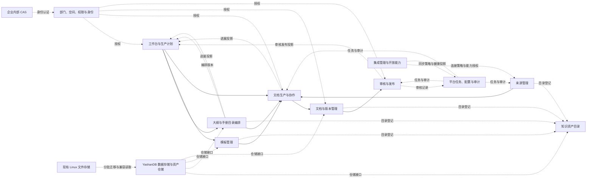
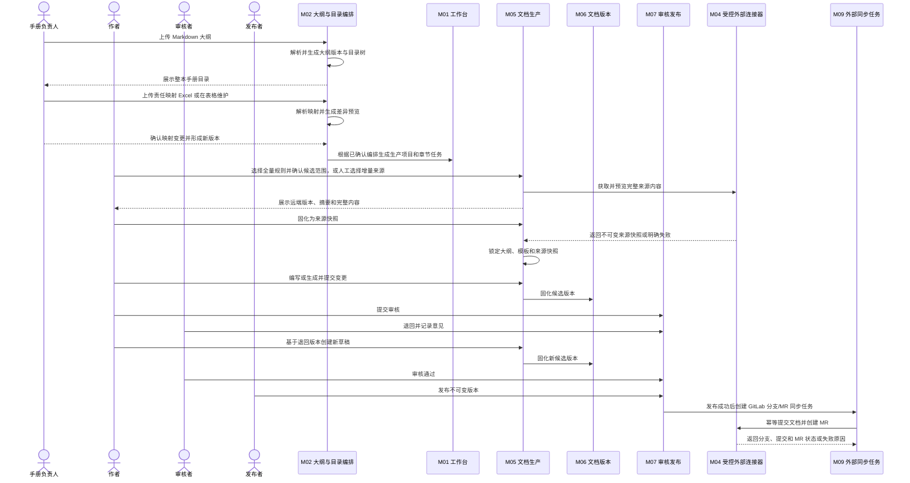
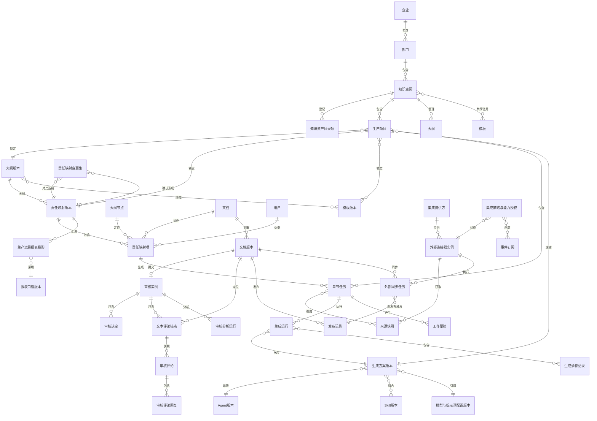
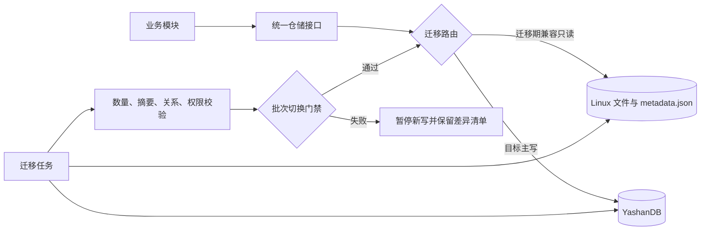

# YashanDB 知识中心建设平台总体概要设计

> 文档类型：总体概要设计
> 设计编号：知识中心建设-总体概要设计-001
> 需求来源：`../01-需求/知识中心建设平台总体需求.md` 0.7.0
> 状态：评审中
> 版本：0.6.0
> 更新日期：2026-08-24

## 1. 设计目的

本设计把总体需求转化为可继续拆分的模块边界，作为后续前端信息架构、模块详细设计和开发任务的共同基线。本阶段冻结职责、依赖、主流程、核心对象归属、逻辑接口，以及已确认的 CAS 认证和 YashanDB 目标数据库；不冻结表结构、大对象存储方式、消息中间件或部署形态。

## 2. 范围判断

### 2.1 本阶段解决的问题

当前平台以单次资料加工和文档生成为主，缺少统一知识资产目录，以及多人生产所需的手册目录编排、大纲、模板、责任分工、版本隔离、审核发布和权限治理闭环。P0 需要让用户先找到有权访问的资产，由手册负责人上传 Markdown 大纲并通过责任映射 Excel 和平台表格维护具体文档与负责人关系，再让一个空间内的多人完成一次可追溯的文档生产：

`浏览知识资产 → 上传 Markdown 大纲 → 维护责任映射 → 预览整本手册目录与映射差异 → 确认编排 → 选择全量规则或增量来源 → 预览并固化来源快照 → 编写或生成 → 提交审核 → 退回重提 → 发布版本`

### 2.2 本阶段不解决的问题

- 不建设同一段落的实时共同编辑。
- 不建设面向企业外部的知识门户。
- 不建设通用的外部平台双向同步；P0 只实现受控连接器获取 PingCode/GitLab 来源，其中 PingCode 只读，GitLab 仅在发布后异步创建文档分支和 MR；同时提供独立的“集成管理”二级入口管理连接、能力和任务；GitHub 只保留扩展契约。统一 CAS 只负责平台用户登录，不能替代外部平台连接实例的独立授权配置。
- 不在概要设计中冻结 YashanDB 表结构、分区、索引、正文与附件的大对象承载方式或部署拓扑。
- 不把现有资料加工页面直接认定为知识中心模块已经完成。

### 2.3 需要保留但暂不实现的边界

稳定企业 ID、部门 ID、空间 ID、资产目录项 ID、文档 ID、章节 ID、版本 ID、来源快照 ID 和审核实例 ID 必须保留，以便后续增加检索、实时协作或外部集成时不重建核心身份。

## 3. 设计原则

1. **按业务责任划分模块**：一个状态只能由一个模块负责修改，避免页面或服务各自解释状态。
2. **发布版本不可变**：编辑、恢复和增量生成都产生新草稿或新版本，不覆盖已发布事实。
3. **来源确认分模式**：增量更新的具体参考源必须由人选择；全量生成可由预设规则形成候选范围，但必须由人确认规则和范围后执行。平台可提示变化和关联，但不能跳过人工确认。
4. **审核绑定内容**：审核实例绑定候选版本和内容摘要，内容变化后原审核失效。
5. **权限贯穿流程**：页面入口隐藏不能替代后端授权；读取、编辑、审核、发布分别校验。
6. **长任务可恢复**：生成、检查和发布准备不依赖浏览器会话，失败可重试和人工接管。
7. **现状与目标分离**：复用现有资料接入、加工、质量和图谱能力时，通过适配边界接入，不把历史技术对象直接暴露为新产品对象。
8. **连接器与 Skill 分离**：外部平台的认证、网络调用、权限、限流、快照和写入副作用只能由受控代码连接器负责；Skill 只处理已经授权的内容快照和语义分析，不直接访问外部平台。

## 4. 总体模块划分

### 4.1 模块全景



### 4.2 模块职责

| 编号 | 模块 | 核心职责 | 拥有的业务事实 | P0 前端归属 |
|---|---|---|---|---|
| M01 | 工作台、生产计划与进展报表 | 基于已确认编排创建生产项目和文档/章节任务，汇总待办，并以只读投影展示整本手册进展、更新和异常 | 生产项目、章节任务、负责人、截止时间、报表口径和报表投影 | 一级导航“工作台” |
| M02 | 大纲与手册目录编排 | 上传/解析 Markdown 大纲版本；通过责任映射 Excel 和平台表格维护手册、具体文档、负责人及模板绑定 | 大纲、大纲版本、大纲节点、责任映射表、责任映射变更集、模板绑定 | 一级导航“大纲管理” |
| M03 | 模板管理 | 管理共享模板结构、约束、版本、恢复和受控删除 | 模板、模板版本、槽位和规则引用 | 一级导航“模板管理” |
| M04 | 来源管理与连接器运行 | 管理本地、PingCode、GitLab 来源选择和连接器执行；保存不可变快照；在发布后按授权执行 GitLab 文档分支/MR同步 | 来源选择、来源快照、连接器调用结果、外部同步执行事实、更新提示 | “文档生产”内二级入口；“平台管理 / 集成管理”任务详情 |
| M05 | 文档生产与协作 | 绑定大纲、模板、来源和已发布生成方案，组织人工编写、Agent 编排的 AI 生成、章节锁和合并 | 工作草稿、章节锁、生成方案绑定、生成运行、变更集、评论 | 一级导航“文档生产” |
| M06 | 文档与版本管理 | 管理稳定文档身份、版本、差异、恢复、归档和查看 | 文档、章节、文档版本、版本差异 | 一级导航“知识资产”内的文档视图；向手册详情提供文档与版本事实 |
| M07 | 审核与发布 | 冻结候选，管理文本选区评论、检查与审核意见，执行一级/多级审核、退回、发布和退役，并提供授权分析读取契约 | 审核实例、文本评论锚点、审核意见、审核决定、发布记录 | 一级导航“审核与发布” |
| M08 | 部门、空间、权限与身份 | 对接企业内部 CAS，管理平台用户映射、部门、知识空间、成员、角色和授权判断 | 平台用户、CAS 身份映射、部门、空间、成员关系、角色、授权策略 | 一级导航“平台管理” |
| M09 | 平台任务、AI 能力配置与审计 | 运行生成/分析长任务，管理生成方案、Agent、Skill、模型、提示词和规则版本，记录关键操作 | 生成方案版本、Agent/Skill 版本、后台任务、生成与分析运行、评测结果、审计事件 | “平台管理 / AI 能力管理”二级入口 |
| M10 | 知识资产目录 | 统一登记、分类、按权限浏览和关联大纲、模板、素材、文档及知识关系；承载手册详情和完整度观察入口 | 资产目录项、类型、归属、标签、关系摘要和手册详情投影引用 | 一级导航“知识资产”，手册详情为其下级视图 |
| M11 | YashanDB 数据存储与资产仓储 | 以 YashanDB 作为目标业务数据库，为正文、元数据、版本、快照和审计提供仓储抽象、迁移、完整性和恢复能力；迁移期兼容读取 Linux 文件 | 仓储契约、数据库业务事实、内容引用、迁移批次、校验摘要、备份恢复记录 | 不作为普通用户导航；管理端只展示健康、迁移和容量摘要 |
| M12 | 集成管理与开放能力 | 统一登记外部平台、连接实例、连接器版本、能力声明、授权范围、同步策略、事件订阅和开放接口；不直接执行平台 API | 集成提供方目录、连接实例配置、能力授权、目标映射策略、事件订阅和集成健康投影 | “平台管理 / 集成管理”二级模块 |

**划分结论：** M01-M07 与 M10 是业务模块，M08、M09、M11、M12 是平台支撑。M12 负责集成配置和治理，M04 负责来源与连接器运行，M09 负责长任务状态；前端一级导航按稳定用户任务组织，不按十二个后端责任模块机械生成十二个入口。

## 5. 模块边界与单一事实源

| 业务判断 | 唯一负责模块 | 其他模块允许做什么 | 禁止行为 |
|---|---|---|---|
| 某人能否编辑章节 | M08 | M05 提交资源和动作请求授权判断 | 前端自行根据角色名放行 |
| 大纲哪个版本生效 | M02 | M01/M05 锁定并引用版本 | 生产任务读取“当前最新”替换历史版本 |
| 大纲绑定哪些模板版本 | M02 | M03 提供有权使用的模板版本 | 模板更新后自动替换大纲绑定 |
| 目录节点对应哪份文档和负责人 | M02 | M01 基于已确认编排生成任务；M06 提供稳定文档引用 | Excel 与前端表格各维护一套状态；使用 Excel 行号作为稳定身份 |
| 模板哪个版本生效 | M03 | M05 锁定并引用版本 | 已开始的任务自动跟随模板更新 |
| 模板内容如何修改和删除 | M03 | 手册负责人保存时创建新版本；管理员执行受控删除 | 覆盖历史版本；物理删除已发布或被引用版本 |
| 使用了哪些来源 | M04 | M05 引用已确认快照 | 系统自动预填或替换人工选择 |
| 草稿正文如何变化 | M05 | M06 在提交时固化版本 | 审核页面无痕修改正文 |
| 某个文档版本是什么 | M06 | M07 只引用候选版本 | 发布后原地覆盖内容 |
| 是否审核通过 | M07 | M06 展示审核状态投影 | AI 或质量规则直接批准 |
| 后台任务是否完成 | M09 | 业务模块读取任务状态并解释业务结果 | 页面关闭即丢失状态 |
| 生产任务使用哪个生成方案 | M05 | M09 提供已发布且已授权的版本；M08 鉴权 | 任务启动后自动跟随最新 Agent、Skill、模型或提示词 |
| Agent/Skill 版本如何发布 | M09 | M05 只引用发布版本；M07 读取运行追溯 | 未检查 Skill 进入生产；覆盖历史版本；在页面中散落硬编码提示词 |
| 生成运行实际用了什么 | M09 | M05 保存运行引用和草稿归因；M06/M07 展示追溯投影 | 仅记录“AI 生成”而不冻结方案、Agent、Skill、模型、提示词、规则和来源版本 |
| 用户是谁 | M08（身份依据来自 CAS） | 其他模块使用平台用户 ID 请求鉴权 | 将 CAS 登录成功直接视为拥有空间或文档权限 |
| 手册进展与更新如何汇总 | M01 | M02/M05/M07 提供带版本和时间的状态投影 | 报表反向修改任务、审核或发布状态；自行定义第二套状态 |
| 审核意见及文本位置是什么 | M07 | M09 按授权读取固定版本开展分析 | 分析结果覆盖原始意见或改变审核决定 |
| 审核分析如何执行 | M09 | M07 提供不可变审核记录；M08 鉴权 | 使用未登记 Skill；不记录模型、提示词、Skill 和输入版本 |
| 资产如何出现在统一目录 | M10 | 各资产模块登记稳定 ID、类型、归属和状态投影 | 目录复制并编辑资产正文 |
| 业务事实如何持久化 | M11 | 各业务模块通过仓储契约读写自身事实 | 页面或业务模块直接依赖 Linux 路径、`metadata.json` 或 YashanDB 表结构 |
| 迁移批次写入哪个存储 | M11 | 业务模块只调用仓储接口并读取迁移状态 | 同一资产同时允许 Linux 文件和 YashanDB 双向写入 |
| 外部平台如何被调用 | M04 | M05 选择已登记连接和快照；M07 在发布后发起同步命令；M09 承载长任务状态 | Skill、前端或业务模块直接持有令牌、拼接外部 API 或绕过连接器能力声明 |
| GitLab 回写是否完成 | M04/M09 | M07 提供已发布版本和授权动作；工作台展示同步投影 | 把 GitLab 成功当成知识发布事务的一部分；失败时伪造成功或回滚已发布知识 |
| 外部连接如何登记和授权 | M12 | M04 读取已启用连接并执行受控动作；M08 校验管理员和空间权限 | M04、M05 或前端自行保存连接凭证、扩大能力范围或自动启用新平台 |
| 集成策略和目标映射如何生效 | M12 | M04/M09 按冻结的策略版本执行和记录任务 | 从来源地址推断回写目标；修改策略后回写历史任务或改变既有审计事实 |

## 6. 现有能力的复用关系

| 现有能力 | 当前证据 | 目标模块 | 复用方式 | 不能直接继承的部分 |
|---|---|---|---|---|
| 本地上传、PingCode 接入 | 已有页面和后端 API、PingCode 专用 Python 客户端和下载器 | M04 来源管理与外部连接器 | 抽取为受控来源连接器，统一返回来源快照；保留现有解析能力作为适配实现 | 现有“资料加工任务”不等同于生产项目；连接器不能把历史配置直接当作平台授权 |
| 未来 GitLab/GitHub 接入 | 当前无知识中心统一连接器契约 | M04 来源管理与外部连接器 | 按统一连接器接口实现 GitLab 读/发布后分支-MR能力，GitHub 后续复用同一契约 | 不允许通过 Skill 或前端直接调用令牌；GitHub 不在 P0 伪装为已实现 |
| 资料加工工作台 | 已有任务聚合和状态展示 | M01/M09 | 复用长任务状态、失败重试和进度投影思路 | 当前工作台缺少章节责任和审核待办 |
| 大纲上传与解析 | 部分具备，兼容演进仍在推进 | M02 | 保留解析能力，外层增加大纲稳定身份和版本 | 上传文件不能直接等同于已发布大纲版本 |
| Markdown 大纲上传 | 目标能力，解析契约尚未设计 | M02 | 作为结构事实的版本化入口，先解析预览再人工确认 | 上传成功直接覆盖当前大纲 |
| 责任映射 Excel | 目标能力，字段契约尚未设计 | M02 | 作为静态责任映射的批量变更入口，先形成映射差异预览再人工确认 | 将 Excel 当成每次重建整本大纲的输入 |
| 文档生成器 | 已有单次生成能力 | M05 | 作为生成执行器，输入改为冻结的结构和来源引用 | 生成结果不能直接成为发布版本 |
| 文档查看和文件版本元数据 | 部分具备 | M06 | 迁移后作为查看器和历史导入来源 | 文件时间戳不能直接等同于业务版本 |
| Linux 文件目录与 `metadata.json` | 当前大纲、文档和运行产物的主要持久化方式 | M11 | 作为分批迁移源和迁移期兼容读取，按稳定 ID 与内容摘要导入 YashanDB | 继续作为新平台长期主源；无治理双写；直接删除迁移源 |
| 历史 SQLite 扩展方案 | `agent-runner/docs/16-数据库方案设计.md` 中的演示阶段建议 | M11 | 只借鉴仓储接口和渐进迁移思想 | SQLite 不再是知识中心目标数据库，不进入新模块实现 |
| 质量分析和图谱治理 | 已完成局部实现与回归 | M05/M07 后续门禁 | 以检查结果形式接入，不改变审核权 | 组件通过不能替代发布验收 |
| 知识点索引和图谱页面 | 已有局部索引与关系展示 | M10 | 作为资产目录和关系摘要的候选数据来源 | 当前索引不等于统一资产目录，也不能绕过资产权限 |

## 7. P0 主流程



异常路径必须满足：Markdown 解析失败或责任映射解析失败、负责人取消确认时不改变当前大纲/映射版本，重复确认不能生成重复任务；章节锁超时可接管、基线变化不静默覆盖、来源抓取失败或未固化不生成假快照、审核退回不修改候选版本、发布失败不标记为已发布；GitLab 连接失败、限流、分支冲突或 MR 创建失败不撤销已发布知识，外部同步任务进入失败/待接管状态并可幂等重试。

## 8. 核心对象关系

核心对象关系不再要求阅读者一次性理解一张高密度 ER 图。文档生成器前端会将下方关系源按“组织与知识空间、大纲与生产编排、版本/审核/发布、集成与运营”四个业务域分组，展示对象、关系方向和业务语义；原始 Mermaid 源码保留在关系阅读器的可展开技术细节中。该视图用于概要设计阅读，不代表数据库表结构。



上述关系是业务模型，不代表数据库表设计。详细字段、聚合边界和持久化方案在模块详细设计中确定。

## 9. 逻辑接口与事件草案

概要设计先定义模块间意图，后续详细设计再决定 HTTP、进程内调用或事件实现。

| 发起模块 | 逻辑命令/查询 | 接收模块 | 结果 |
|---|---|---|---|
| 手册负责人 | 上传 Markdown 大纲 | M02 | 待确认的大纲版本和目录树，不改变当前大纲 |
| 手册负责人 | 上传责任映射 Excel / 查询映射差异 | M02 | 责任映射预览、问题和相对当前映射版本的差异 |
| 手册负责人 | 确认映射变更或保存表格调整 | M02 | 新的已确认责任映射版本 |
| 手册负责人 | 基于已确认编排创建或更新生产项目与章节任务 | M01 | 关联编排版本的项目和任务基线 |
| 用户 | 查询手册生产进展与更新 | M01 | 经权限过滤且绑定编排版本、报表口径和统计时间的汇总与下钻引用 |
| 用户 | 查询手册完整度与目录缺口 | M10/M01/M06/M08 | 经权限过滤的四维完整度、统计上下文、目录节点状态和源对象引用；只读，不返回凭证明文 |
| M01/M05 | 获取可用大纲版本 | M02 | 有权使用的大纲版本摘要 |
| M01/M05 | 获取可用模板版本 | M03 | 有权使用的模板版本摘要 |
| M02 | 保存大纲的模板绑定 | M02/M03 | 新大纲版本及一组固定模板版本引用 |
| M02/M03/M04/M06 | 登记或更新资产目录项 | M10 | 可按权限浏览的目录投影 |
| 用户 | 浏览知识资产 | M10/M08 | 权限过滤后的资产列表和关系摘要 |
| M05 | 预览并固化来源 | M04 | 完整内容预览、来源快照引用或明确失败 |
| 管理员 | 登记/启用/停用集成连接实例与能力 | M12/M08 | 连接器类型、版本、能力、授权范围和健康状态；不返回凭证明文 |
| 管理员 | 配置集成策略和目标映射 | M12 | 按空间/手册冻结的读写方向、触发条件、重试和目标配置版本 |
| M05 | 按人工选择获取外部来源 | M04 | 统一来源快照、远端版本、摘要、连接器版本或明确失败 |
| M05 | 提交候选版本 | M06 | 不可变版本 ID 和内容摘要 |
| M06 | 发起审核 | M07 | 绑定版本与流程版本的审核实例 |
| 审核者 | 对选中文本添加评论 | M07 | 绑定候选版本、章节、文本选区锚点和原引用的审核评论 |
| 获授权的分析调用方 | 查询审核分析数据 | M07/M08 | 权限过滤后的审核记录、评论锚点、回复、版本差异和修改结果 |
| 获授权的分析调用方 | 创建审核分析运行 | M09 | 绑定输入快照、模型、提示词、Skill 和规则版本的任务 ID |
| 用户 | 查询审核分析结果 | M09/M08 | 与原始审核事实分离的派生结果及完整运行追溯信息 |
| M07 | 发布审核通过版本 | M07/M06 | 发布记录和文档状态投影 |
| M07 | 发布后创建 GitLab 同步任务 | M04/M09 | 绑定发布版本、目标映射版本和幂等键的异步任务 |
| M09 | 执行 GitLab 文档分支/MR同步 | M04 | 分支、提交、MR 地址和状态，或可重试失败 |
| 用户 | 查询外部同步状态 | M04/M08 | 仅返回权限范围内的连接、任务和失败摘要 |
| 平台管理员 | 查询集成目录、能力和健康状态 | M12/M08 | 提供方、连接实例、能力声明、策略版本和脱敏健康摘要 |
| 获授权的外部调用方 | 订阅集成事件或调用开放接口（后续） | M12/M08 | 按权限、限流和审计规则返回事件或业务摘要，不暴露凭证和无权正文 |
| 任意模块 | 鉴权 | M08 | 允许/拒绝及策略版本 |
| M04/M05/M07 | 创建长任务、写审计 | M09 | 任务 ID、审计事件 ID |
| M02-M10 | 读取或保存业务事实 | M11 | 不暴露具体存储介质的仓储结果 |

关键事件建议包括：`目录导入已解析`、`目录编排已确认`、`目录编排版本已发布`、`大纲版本已发布`、`模板版本已发布`、`来源快照已固化`、`候选版本已创建`、`文本审核评论已创建`、`审核已退回`、`审核已通过`、`文档版本已发布`、`集成连接已启用`、`集成策略已变更`、`外部同步任务已创建`、`外部同步已成功`、`外部同步已失败`、`发布已撤回`、`审核分析已完成`。报表投影消费这些事实的状态变化，但不能反向驱动源状态；外部同步事件必须携带连接器版本、目标映射版本、幂等键和关联发布版本。后续事件订阅只能消费经过权限过滤的事件摘要。

### 9.1 CAS 认证与平台授权边界

企业内部 CAS 是平台唯一常规登录认证入口，负责证明访问者身份；M08 将 CAS 返回的稳定企业用户标识映射为平台用户，并建立平台会话。空间角色、资源授权、审核和发布权限仍由 M08 的平台策略判断，不能根据 CAS 属性或“登录成功”直接放行正文访问。

认证详细设计需要冻结 CAS 协议参数、票据校验、用户属性映射、单点退出、平台会话时长、账号停用同步和受控应急访问。CAS 不可用或映射失败时默认拒绝登录并记录审计；本概要设计不引入本地常规账号或第二套身份源。

### 9.2 生产进展报表边界

M01 提供工作台内的生产进展报表。报表按报表口径版本，从 M02 的目录编排、M01 的任务、M05 的生成运行、M07 的审核发布状态和 M06 的文档版本形成只读投影，展示生产完成度、关键阶段数量、风险以及统计周期内的新增、修改、删除、移动、负责人变更、重新生成、退回和发布记录。

总负责人视图只使用“未开始、生产中、审核发布中、已完成”四个关键阶段。底层细粒度状态必须由服务端按照 `stageMappingVersion` 映射，前端不得自行归并。审核退回、来源失败、生成失败、质量阻断和内容过期通过独立风险集合返回；风险与阶段正交，同一目录节点只能属于一个关键阶段，但可以同时具有多个风险。

每次查询必须携带部门/空间/手册权限上下文，返回统计时间、编排版本和可下钻的源对象引用。报表不是业务事实所有者，不提供修改源状态的命令；刷新方式、预计算策略、导出格式和性能指标由详细设计依据实际规模确定。

### 9.2.1 手册详情完整度投影边界

手册详情由 M10 承载页面入口和目录聚合，M01 提供生产进展及更新投影，M06 提供文档、版本、来源快照引用和更新时间事实，M08 在查询时执行空间、手册和正文可见范围的权限过滤。M10 不复制或编辑上述业务事实，也不维护第二套状态。

完整度查询必须绑定 `outlineVersionId`、`responsibilityMappingVersionId`、`metricDefinitionVersion`、`stageMappingVersion`、统计时间和 `currentReleaseVersionId`。返回生产完成度及结构、内容、责任、质量门禁四类可解释事实，并提供目录节点、具体文档、负责人、来源快照、关键阶段、底层状态、风险、更新时间和缺口类型。生产完成度必须同时返回分子、分母和百分比；统计口径由服务端版本化，前端不得自行拼接百分比或以文件时间戳替代业务版本。

知识点覆盖度必须以经过确认的版本化知识点基线为分母。基线、映射和确认规则尚未冻结时，接口返回 `metricStatus = undefined` 及原因，不返回推测百分比；目录覆盖、文档发布和知识点覆盖是不同指标，不能互相替代。

缺口和风险筛选只改变查询投影；“前往大纲与责任映射”“前往文档生产”“前往审核与发布”等处理入口必须携带源对象 ID 和上下文返回地址，由责任模块修改事实。工作台和知识资产进入同一手册详情查询，返回操作后可沿上下文返回原入口。手册详情提供“总览、生产进展、目录与缺口、更新与发布”四个页签，泳道和目录表消费同一时点投影。

### 9.2.2 Agent/Skill 生成能力边界

M09 拥有生成方案、Agent、Skill、模型、提示词和规则的版本与发布事实，并执行可持久化的生成长任务。M05 只能为生产项目绑定已发布、已评测且在当前空间授权的生成方案版本，并将实际运行 ID 与工作草稿、变更集关联。M06/M07 只读取运行追溯投影，不反向改写能力配置或运行结果。

```text
大纲版本 + 模板版本 + 已确认来源快照
                    ↓
生成方案版本（Agent + Skill 集合 + 模型/提示词/规则）
                    ↓
素材处理 → 结构映射 → 章节生成 → 引用与质量检查
                    ↓
工作草稿 → 人工编辑/确认 → 冻结审核候选
```

生成方案是稳定的业务配置单元，不是页面临时拼装的一组下拉值。其版本至少冻结 `agentVersionId`、`skillVersionIds`、`modelPolicyVersionId`、`promptBundleVersionId`、`qualityRuleVersionId` 和人工门禁。生成运行在此基础上额外冻结大纲、模板、来源快照、操作人和步骤输入输出摘要，使同一发布版本可回放、可对比、可审计。

前端使用渐进披露：作者默认看到“生成方案、当前步骤、风险和恢复动作”；展开详情后才显示 Agent/Skill/模型/提示词/规则的精确版本。平台管理员在 `/admin/ai-capabilities` 管理能力目录和版本；手册负责人在生产批次启动前选择已授权方案；作者不能直接修改平台提示词、上传任意 Skill 或越过生成方案能力上限。

### 9.3 审核记录分析接口边界

M07 保存不可变审核事实，并提供受 M08 授权控制的查询契约；M09 负责执行分析和保存派生结果。最小分析输入包括审核实例、候选与后续版本、文本选区锚点、评论及回复、审核决定和实际修改结果。每次运行还必须固定模型、提示词、上传 Skill、质量规则和输入快照版本。

分析接口只服务于后续问题归因、高频修改模式和审核规则候选发现。上传 Skill 在参与执行前必须经过授权、安全检查、版本登记和审计；派生结果不得覆盖原始评论、自动通过审核或自动修改发布状态。具体 API 路径、数据脱敏、批量范围、保留期限和 Skill 安全策略在详细设计中冻结。

### 9.4 YashanDB 数据存储与资产仓储边界

存储管理属于后端基础设施，不是普通用户业务导航，但不能从总体设计中省略。M11 以 YashanDB 作为知识中心目标业务数据库，并提供统一仓储边界。业务模块只能依赖领域仓储接口，不能直接拼接 Linux 路径、读写 `metadata.json` 或依赖具体表名，以便迁移、测试和故障回退不扩散到业务代码。

现有 Linux 文件目录是演示工具的当前事实，不会一次性整体替换。迁移先把稳定身份、版本关系、权限、任务、审核和审计等结构化事实迁入 YashanDB，再迁正文与版本内容，最后处理附件、来源快照和生成产物。对于附件和大文件，详细设计需要比较 YashanDB 大对象字段与受控外部对象存储引用；无论内容字节最终放置在哪里，YashanDB 都是其身份、版本、摘要、权限、位置和生命周期的业务事实主源。

| 数据类别 | 主要内容 | 一致性与恢复要求 |
|---|---|---|
| 业务元数据 | CAS 用户映射、部门、空间、资产目录项、大纲版本、责任映射、变更集、任务、权限、文本评论锚点、审核和发布记录 | 支持事务或等价补偿，不能出现半应用导入或半发布状态 |
| 内容与版本 | 大纲、模板、草稿、文档正文及不可变版本 | 内容摘要可校验；历史版本可读取和恢复，不原地覆盖 |
| 来源与运行产物 | 来源快照、生成输入输出、质量检查结果、审核分析输入快照和派生结果 | 绑定来源、模型、提示词、Skill、规则与运行版本；失败产物不得冒充成功事实 |
| 报表投影 | 手册生产进展、更新摘要和异常汇总 | 可从源事实重建；记录统计时间、口径版本和权限范围，不作为源状态 |
| 检索派生数据 | 全文、向量和关系投影 | 可从获准业务版本重建、撤回，不作为业务事实单一来源 |
| 审计与运维数据 | 操作事件、任务日志、容量、备份和恢复记录 | 追加留痕、访问受控，并按保留策略归档 |

仓储层至少提供：稳定 ID、乐观并发或等价冲突控制、原子提交边界、内容摘要校验、幂等写入、备份恢复、容量观测和数据生命周期。平台管理仅展示存储健康、容量、备份与恢复结果；不向普通管理员暴露直接修改数据库或删除底层文件的能力。

#### 9.4.1 分阶段迁移架构



迁移路由按空间、手册或资产批次记录当前主源。阶段 0 仍由 Linux 文件主写，只完成盘点、稳定 ID、摘要和仓储抽象；阶段 1 起，已切换批次的结构化事实只能写 YashanDB，旧文件只读；阶段 2 迁正文和版本；阶段 3 迁附件和运行产物；阶段 4 完成观察、恢复演练和旧目录归档。

不采用“所有请求长期双写两套存储”的方案。短期迁移任务可以对源文件读取并向 YashanDB 幂等写入，但在线业务请求对同一资产只能有一个主写目标。切换前需冻结该批次旧写入口，完成增量扫描与摘要对账后再改变读路由。

#### 9.4.2 批次门禁与回退

| 阶段 | 必须完成的校验 | 允许切换的条件 | 失败处理 |
|---|---|---|---|
| 盘点与抽象 | 文件清单、稳定 ID、内容摘要、重复和孤儿报告 | 仓储接口覆盖目标读写路径，现状基线可复现 | 不改变现有存储行为 |
| 元数据迁移 | 数量、关系、权限、审核和审计链 | 新写不再修改 `metadata.json`，YashanDB 事务与并发检查通过 | 停止新写，保留数据库增量供后续重放 |
| 正文版本迁移 | 全量摘要、父版本、可打开性和恢复 | 按手册全部一致，抽样与并发验证通过 | 恢复旧正文兼容只读，不反向覆盖新版本 |
| 附件产物迁移 | 字节摘要、权限、容量、下载和备份恢复 | 选定存储方式满足验收基线 | 暂停该类迁移，继续旧文件只读 |
| 全面切换 | 观察期差异、故障恢复和业务验收 | 无未解释差异，YashanDB 备份恢复演练通过 | 在批准窗口恢复兼容读，禁止恢复无治理双写 |

回退的目标是恢复服务可读和暂停错误扩散，不承诺把迁移后只存在于 YashanDB 的新事实自动无损写回旧文件结构。发生切换后回退时，必须冻结该批次新写入、导出差异清单，并由人工确认在恢复迁移时重放或放弃哪些增量。

### 9.5 外部平台连接器与 Skill 边界

外部平台接入采用“**核心契约固化、连接器代码插件化、Skill 语义化**”的混合策略。M12 集成管理负责登记与治理，M04 连接器运行负责实际访问，M09 负责长任务状态：

1. 核心平台固定连接器生命周期、能力声明、认证引用、权限校验、限流、超时、重试、幂等、快照模型、审计和任务状态。连接器插件必须经过代码审查、依赖扫描、版本登记和管理员启用，首期不开放运行时任意上传第三方插件。
2. 连接器插件实现具体平台 API 细节和标准化转换。P0 提供 PingCode 只读连接器和 GitLab 读/发布后分支-MR连接器；GitHub 只登记扩展契约和能力占位，不在 P0 宣称已接通。
3. Skill 只能接收平台已经授权并固化的内容快照，用于清洗、结构抽取、差异分析、审核记录分析等语义任务。Skill 不得读取令牌、发起任意网络请求、决定写入目标或直接执行外部回写。
4. GitLab 回写按发布后异步任务执行，不与知识版本发布形成跨系统原子事务。任务必须绑定发布版本、连接器版本、目标映射版本和幂等键；成功保存分支、提交和 MR 标识，失败保存原因、重试次数和人工接管状态。
5. 本轮采用的前端演示默认是“每个发布批次一个 MR、手册级显式配置目标仓库/基线分支/路径、外部失败不回滚知识发布”。MR 粒度、目标映射细节和最终失败升级时限仍属于 D-18 待确认项；集成管理只保存和展示策略版本，不从来源地址自动推断目标。

连接器不等于来源预选器：来源仍由人工在文档生产中选择；平台管理只负责连接实例、授权范围和健康状态，不能替作者决定参考源。

## 10. 核心流程伪代码

```text
function 确认目录编排(手册负责人, 导入变更集, 期望当前编排版本):
  校验手册负责人对目标大纲具有编排权限
  if 导入变更集.存在阻断问题: return 问题清单
  if 当前编排版本 != 期望当前编排版本: return 版本冲突并重新生成差异

  新编排版本 = 原子应用(目录节点、具体文档、负责人及稳定身份映射)
  记录导入文件摘要、差异、确认人和确认时间
  return 新编排版本；未确认、取消或失败均不改变当前编排
```

```text
function 提交审核(操作者, 草稿, 期望基线版本):
  授权 = 权限模块.校验(操作者, 草稿, "提交审核")
  if 授权拒绝: return 无权错误

  if 草稿.当前基线版本 != 期望基线版本:
    return 基线冲突并要求比较或合并

  校验大纲版本、模板版本、来源快照仍可回放
  候选版本 = 版本模块.固化不可变版本(草稿及全部引用)
  审核实例 = 审核模块.按空间策略创建(候选版本, 内容摘要)
  审计模块.记录(操作者, "提交审核", 候选版本, 审核实例)
  return 审核实例
```

```text
function 发布版本(发布者, 审核实例):
  校验发布权限
  校验审核实例绑定的内容摘要未变化
  校验所有必需审核层级均已通过
  校验阻断级质量问题为零
  原子创建发布记录；失败时不得写入“已发布”状态
  记录审计并返回发布结果
```

## 11. 前端与后端边界

- 前端负责呈现用户任务、输入意图、差异、状态和恢复操作；不自行推导权限、审核通过或发布状态。
- 后端返回稳定状态码、允许动作和失败原因；前端根据 `allowedActions` 渲染命令入口。
- 前端登录通过 CAS 跳转和回调建立平台会话，不保存或解释 CAS 凭证；登录成功后所有列表、报表、审核和分析请求仍由后端逐请求授权。
- 前端只展示连接器能力、连接状态、人工来源选择和外部同步任务状态；不保存令牌、不直接调用 PingCode/GitLab/GitHub API，也不根据 Skill 返回结果自行决定回写。
- “集成管理”作为平台管理下的独立二级业务模块，前端展示连接目录、能力授权、策略版本、健康状态和同步任务；它不承担外部项目、任务或代码评审的编辑事实，后续提升为一级导航必须有独立运营角色和使用频率证据。
- 一级业务导航是多角色平台的必要信息架构：它为资产查找、结构维护、内容生产、审核发布和平台治理提供稳定入口，使权限可见性、待办归属、深链和页面状态有明确边界；但不按数据库、Agent、向量库或 GraphStore 等技术模块机械拆分。
- 当前只有一个部门时隐藏部门切换控件并直接展示当前部门；配置多个部门后再显示部门选择器。知识空间仍作为资产、权限和审核策略上下文。
- 当前 Vue 前端路由作为现状复用入口，新知识中心路由需在详细设计后增量接入；本设计不要求立即改写现有路由。

## 12. 分阶段边界

| 阶段 | 必须形成的用户闭环 | 不作为完成前置 |
|---|---|---|
| P0 样板 | 用户通过 CAS 登录，从资产目录进入一个手册；负责人查看生产报表，两名作者分章生产，审核者对选中文本评论并退回重提，发布者发布，读者在权限内阅读和反馈；管理员从集成管理查看 PingCode/GitLab/GitHub 能力状态，来源通过受控连接器获取，发布后可观察 GitLab 分支/MR同步任务 | 统一全文检索、实时同段编辑、审核智能分析执行、GitHub 实际接入和外部自动发布 |
| P0 完整 | 资产目录、大纲、多模板绑定、来源、协作、文本评论、版本、审核发布、生产报表、审核分析接口、权限和审计可配置且可追溯 | 完整知识运营体系、审核智能分析自动化和企业外门户 |
| P1 候选 | 权限感知检索、问答、反馈运营、保鲜、GitHub 连接器和跨平台增量同步 | 实时协同和更复杂的外部回写仍需单独立项 |

## 13. 风险与待确认事项

### 13.1 已发现的逻辑风险

1. **统一资产目录不能成为第二份资产事实。** 目录只保存稳定引用、分类、标签、归属、状态和关系摘要；正文与版本仍由各责任模块维护。
2. **部门与知识空间不能混为一层。** 当前只有一个部门不代表模型可以省略部门；单部门时前端弱化选择，多部门时才展开切换和隔离。
3. **一级导航不能等同于后端模块。** 来源、版本、权限、存储和审计是独立责任模块，但不应全部占用一级导航。
4. **共享模板修改存在影响扩散。** 手册负责人可以编辑正文，但保存必须产生新版本，其他大纲和既有任务不得自动升级；管理员也不能物理删除已被引用的版本。
5. **审核与文档管理存在状态交叉。** 本设计规定文档内容和版本归 M06，审核意见、决定和发布记录归 M07，审核页面不得无痕修改正文。
6. **现有“发布数据集”和目标“发布文档”不是同一概念。** 迁移设计必须明确转换，不能复用同一个用户术语掩盖对象差异。
7. **责任映射 Excel 与前端表格不能形成双重事实。** 两者必须读写同一责任映射版本；Excel 只是人员或文档映射变化时的批量维护入口，前端表格是可视化维护入口，Markdown 大纲另行维护结构版本。
8. **集成管理不能成为外部平台的第二套事实。** M12 管理连接、能力和策略，M04 执行连接器动作；外部项目、任务和代码评审仍由外部平台负责，知识中心只保存稳定引用、快照和同步结果。
9. **预留能力不能等同于已实现能力。** GitHub、事件订阅和开放接口可以出现在集成目录与契约中，但必须标明“未接入/后续”，不能提供会产生真实副作用的假操作。
8. **Excel 行号不能充当稳定身份。** 行移动、插入和排序会改变行号，目录节点、文档、负责人和任务必须依赖稳定业务 ID 或详细设计确定的匹配策略。
9. **上传不能直接覆盖现有编排。** 解析、问题检查和差异预览必须先完成，只有手册负责人明确确认后才原子应用；取消或失败不得留下半成品。
10. **目录调整不能破坏历史引用。** 节点移动、删除或文档改绑必须形成新编排版本并保留旧版本可回放，已生成任务和已发布文档不得静默改指向。
11. **CAS 认证不等于平台授权。** CAS 只确认企业身份；资源权限仍由平台策略判断，否则任一内部登录用户可能读取不属于自己的空间或文档。
12. **文本评论锚点可能因正文修改漂移。** 评论必须保留候选版本和原始引用；无法可靠重定位时标记待确认，不能仅凭相似文本自动挂接。
13. **生产报表不能成为第二套状态。** 汇总必须绑定口径、时间和源版本并可下钻核对，报表页面不得直接修正源事实。
14. **审核智能分析不能污染审核证据。** 原始评论、决定和修改事实不可变；分析结果单独存储并记录模型、提示词、Skill 和输入版本，只能作为建议。
15. **一次性替换文件存储风险过高。** 当前文件布局包含隐式路径关系和不完整元数据，必须先盘点和建立仓储抽象，再按批次迁移并校验。
16. **长期双写会制造不可判定冲突。** 每个迁移批次只能有一个在线写入主源；旧 Linux 文件在切换后只读，差异通过迁移任务和对账处理。
17. **“使用 YashanDB”不等于所有字节都直接入表。** 大附件和运行产物需依据真实容量、备份恢复和访问性能决定使用大对象字段还是受控外部引用，但业务身份和治理事实必须在 YashanDB。
18. **把 Skill 当成连接器会扩大副作用边界。** Skill 的输出不具备确定的认证、限流、幂等和审计保证，不能持有令牌或直接写入外部系统。
19. **外部发布与知识发布不是一个事务。** GitLab 服务不可用、权限失效或分支冲突时，知识版本仍可能已经合法发布，两个状态必须分开展示和处理。

### 13.2 待用户或责任人确认

| 编号 | 待确认项 | 当前建议 | 不确认的影响 |
|---|---|---|---|
| O-04 | D-11 正式检索准入规则 | 仅已审核发布版本进入正式检索 | 影响后续检索，不阻塞 P0 文档发布闭环 |
| O-06 | YashanDB 中正文、附件和运行产物的具体承载方式 | 元数据、版本关系和普通正文进入 YashanDB；大附件在大对象字段与受控外部引用间做容量和恢复验证 | 阻塞 M11 表结构、大对象和容量详细设计，不再阻塞目标数据库选型 |
| O-07 | CAS 属性映射、单点退出、会话和应急访问方式 | 使用稳定企业用户标识建立平台用户映射，异常默认拒绝 | 阻塞认证详细设计和集成测试，不改变 CAS 作为唯一常规认证入口的决策 |
| O-08 | 生产进展报表的刷新、导出和性能口径 | 先按手册查询并支持下钻，依据真实规模选择实时或预计算 | 阻塞报表详细设计，不阻塞业务指标和事实归属评审 |
| O-09 | 上传 Skill 的格式、安全检查和可执行边界 | 只允许经授权、版本登记和安全检查的 Skill 进入隔离分析任务 | 阻塞审核分析执行能力，不阻塞结构化记录与查询接口设计 |
| O-10 | GitLab MR 粒度、目标仓库/分支/路径映射和失败升级时限 | 每个发布批次一个 MR；手册级显式配置目标；发布成功与同步结果分离并支持重试/人工接管 | 阻塞 GitLab 回写详细设计和真实验收，不阻塞来源只读闭环 |

## 14. 后续详细设计顺序

1. 详细设计 M10 知识资产目录的登记、权限过滤和关系摘要契约。
2. 详细设计 M08 权限判断契约与角色矩阵，这是多人闭环的前置。
3. 详细设计 CAS 票据校验、平台用户映射、单点退出、会话和失败边界，并与 M08 授权契约分开验收。
4. 详细设计 M02 的 Markdown 解析契约、责任映射 Excel 字段、格式校验、稳定身份匹配、重复行处理、导入幂等、差异预览、确认应用和前端映射表交互；这些规则在详细设计评审前不冻结。
5. 串行设计 M02/M03 的多模板绑定、模板版本与受控删除契约，再设计 M01 如何从已确认编排生成任务及生产报表、M05 协作状态机、M06 版本模型、M07 审核发布状态机与文本评论锚点。
6. 设计审核记录查询契约，再设计 M09 分析运行、模型/提示词/Skill 版本追溯和安全边界；智能分析执行可晚于接口落地。
7. 详细设计 M11 的 YashanDB 领域模型、仓储接口、事务与并发边界、大对象验证、备份恢复和 Linux 文件分批迁移工具；不再评估 SQLite 作为目标方案。
8. 设计 M04 连接器契约、来源快照、GitLab 发布后同步和 M09 通用长任务、配置、审计接口；先完成真实 PingCode 只读与 GitLab 沙箱回写验证，再冻结 GitHub 扩展。
9. 形成前端路由、目录树与编排表联动、生产报表、文本评论、上下文预览、页面状态、后端 API 和失败恢复矩阵后，再拆开发任务。

## 15. 设计完成条件

- 模块职责和业务事实只有一个所有者。
- P0 主流程能从 Markdown 大纲上传、责任映射差异预览、人工确认和平台表格维护，走到任务生成及不可变发布版本，并包含退回重提。
- Markdown 大纲和责任映射在确认前不改变当前版本；确认后目录树、责任映射表和由其生成的任务引用同一组大纲/映射版本。
- CAS 登录与平台授权边界明确，登录成功不能绕过空间和资源权限。
- 工作台生产报表能够展示手册整体进展与更新，并下钻到同一时点的源事实。
- 文本选区评论绑定固定候选版本和原引用；审核记录接口与派生分析结果保持可区分、可授权和可追溯。
- YashanDB 作为目标业务数据库的边界明确；Linux 文件迁移具备分批唯一主写、幂等导入、摘要对账、切换门禁和可执行回退方案。
- 外部平台接入明确区分核心连接器、受控代码插件和语义 Skill；PingCode 只读、GitLab 发布后异步分支/MR同步、GitHub 后续扩展，且外部失败不伪造或回滚知识发布。
- 一级业务导航能够映射到用户任务和责任模块，但不暴露内部技术结构。
- 现有能力和目标能力边界清晰，不把设计写成已实现。
- O-04、O-06 至 O-09 等阻塞详细设计的事项得到确认后，才能进入相应模块实现。
