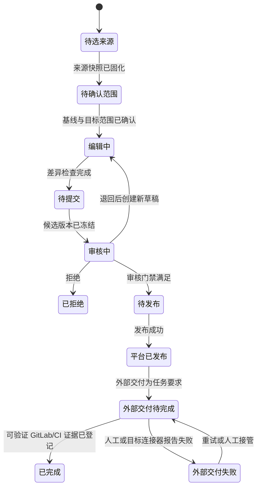

# 知识中心-文档生产-增量构建垂直业务-概要设计文档

> 文档类型：垂直业务概要设计
> 设计编号：知识中心建设-增量构建-001
> 需求来源：`../01-需求/知识中心-平台-总体需求-需求文档.md` 0.7.2
> 状态：评审中
> 版本：0.1.1
> 更新日期：2026-09-02
> 关联设计：`./知识中心-知识资产-GitLab手册映射与协作审阅-概要设计文档.md`

## 1. 目标与主要场景

本设计定义官方手册已有发布基线后，如何围绕需求或代码变更修订指定章节、增加或调整章节，并经过审核、验证和发布形成新版本。它解决：

- 当前由人从 PingCode 选择具体文档内容作为参考材料，并固化为可追溯快照。
- 作者对官方手册指定章节执行新增、删除、修改、移动或章节内内容增删改。
- 变更始终形成新草稿和候选版本，不覆盖已发布基线。
- 当前 GitLab/CI 未真实接入时仍能完成平台内闭环，并如实记录人工衔接结果。
- 未来由 PingCode 与 GitLab 证据自动形成变更候选，辅助或替代人工检索，但不替代人工范围确认、审核和发布。

## 2. 核心判断与非目标

增量构建不是“让模型直接改官方文档”，而是建立从变化证据到可审阅补丁的受控转换：

```text
变化证据 → 人工确认影响范围 → 可比较变更集 → 候选版本
→ 独立审核 → 确定性验证 → 新发布版本
```

本阶段不实现或不假定：

- 不自动发现 PingCode/GitLab 变化并直接确定影响章节。
- 不自动修改正式发布版本、自动通过审核或自动发布。
- 不把 GitLab 受控模拟结果描述为真实分支、提交、MR 或 CI 成功。
- 不要求当前平台与 GitLab 发布形成一个分布式事务。
- 不在本设计中冻结具体 CI 工具、API URL 或 DTO；MR 按目标分支拆分和手册内容映射边界由关联概要设计统一冻结。

## 3. 能力分层

### 3.1 当前可实施闭环

```text
人工选择 PingCode 文档内容
→ 完整预览并固化来源快照
→ 选择官方手册发布基线、目标章节和变更类型
→ 创建变更草稿并人工编辑或调用已批准生成方案
→ 查看差异、引用和影响检查
→ 固化候选版本并审核
→ 平台内发布新版本
→ 人工衔接 GitLab/CI，并记录可验证的外部证据或“未执行”状态
```

当前闭环的完成不依赖伪造 GitLab/CI 状态。若外部发布仍是交付要求，则平台发布只能标记为“平台版本已发布、外部交付待完成”，不能标记端到端交付完成。

### 3.2 目标闭环

```text
PingCode 需求/变更 + GitLab 提交/MR 证据
→ 自动形成带证据和置信度的变更候选
→ 人工确认影响章节和变更范围
→ 平台编写/生成或上传本地变更，并完成差异与审核
→ 按目标业务分支创建工作分支、提交和 MR
→ GitLab CI 执行构建、格式、链接和内容检查
→ 人工在 GitLab 合入
→ 发布官方文档
→ 回写平台的外部任务状态和证据
```

目标闭环需要真实连接器、凭证隔离、目标映射、幂等、失败恢复和端到端专项验收后才能启用。

## 4. 核心对象与事实归属

| 对象 | 作用 | 关键不变量 | 事实模块 |
|---|---|---|---|
| 官方文档基线 | 增量修改的已发布起点 | 不可变，绑定内容摘要 | M06/M07 |
| 来源选择 | 用户本次选择的 PingCode 内容引用 | 选择与快照分离 | M04/M05 |
| 来源快照 | 实际用于修改的不可变证据 | 含远端身份、版本/时间、内容摘要和抓取结果 | M04 |
| 目标范围 | 手册、大纲版本、文档和章节集合 | 必须人工确认 | M05 |
| 变更集 | 对基线执行的结构和正文操作 | 可比较、可重放、可撤销 | M05 |
| 工作草稿 | 可编辑的增量产物 | 不等于正式版本 | M05 |
| 候选版本 | 提交审核的冻结内容 | 绑定摘要、基线、快照和变更集 | M06 |
| 审核实例 | 对候选的审核事实 | 绑定候选和流程版本 | M07 |
| CI 运行 | 外部确定性验证结果 | 当前无真实接入时不得伪造 | M04/M09（目标） |
| 发布记录 | 平台版本生效事实 | 与外部同步状态分离 | M07 |

变更类型至少覆盖：章节新增、章节删除、章节修改、章节移动，以及章节内段落、表格、代码示例、图片引用和交叉引用的新增、删除与修改。删除和移动已发布章节必须显示入链、出链和目录影响，不能静默执行。

## 5. 当前阶段主流程

| 步骤 | 操作者与动作 | 系统结果 | 失败边界 |
|---|---|---|---|
| 1. 建立任务 | 手册责任人选择手册和增量模式 | 任务绑定当前发布基线 | 无已发布基线则不能走增量 |
| 2. 选择材料 | 作者人工检索并选择 PingCode 文档内容 | 保存来源选择，不自动扩大范围 | 无权限或来源不可用时明确失败 |
| 3. 固化证据 | 作者完整预览后确认 | 生成不可变来源快照 | 抓取失败不得生成假快照 |
| 4. 确认范围 | 作者选择文档/章节及变更类型 | 形成目标范围版本 | 系统推荐只能提示，不能代替确认 |
| 5. 生成草稿 | 人工编辑或调用冻结生成方案 | 形成相对基线的变更集 | 模型不得引入无来源事实 |
| 6. 差异检查 | 作者查看结构、正文、引用和范围差异 | 形成检查报告及警告/阻断项 | 阻断项未处理不能提交 |
| 7. 提交候选 | 文档撰写人提交，手册责任人按策略确认范围 | 固化候选版本和摘要 | 基线冲突返回重放/合并选择 |
| 8. 审核 | 被分配审核人评论、退回、拒绝或通过 | 形成审核决定 | 自审存在时至少还需其他人有效通过 |
| 9. 平台发布 | 有权发布者发布审核通过候选 | 形成新的不可变官方版本 | 发布失败不改变原发布基线 |
| 10. 外部衔接 | 当前由人执行 GitLab/CI 并登记证据 | 状态为未执行、执行中、成功或失败 | 没有可验证证据不能登记成功 |

## 6. 当前阶段状态机



若当前任务不要求外部交付，平台发布后即可结束；不得为了流程完整创建虚假外部任务。

## 7. 变更生成和冲突处理

变更必须面向稳定章节 ID，而不是只依赖标题或行号。执行前同时冻结 `baselineVersionId`、`baselineDigest`、`outlineVersionId`、`sourceSnapshotIds`、`targetScopeVersion` 和生成方案版本。

伪代码：

```text
createIncrementalCandidate(command):
  鉴权(document.edit, command.targetScope)
  校验发布基线摘要、来源快照和目标范围仍有效
  依据变更类型生成可比较 patch，不直接覆盖发布版
  执行结构、引用、事实来源和格式检查
  若当前基线 != command.baselineVersionId:
      返回 baseline_conflict 及三方差异，不自动覆盖
  固化候选正文、patch、摘要和完整追溯引用
```

重复提交使用由任务、基线、目标范围和客户端请求组成的幂等键。相同幂等键返回原结果；相同目标出现不同基线时进入冲突，不按最后写入覆盖。

## 8. 审核、CI 与发布边界

- 候选提交后正文冻结；修改必须形成新草稿和新候选。
- 审核规则使用提交时冻结的流程版本；允许一人多角色，但自审不能成为唯一有效通过。
- 当前阶段的确定性检查可在平台内运行，但只有实际执行并保存日志、版本和结果的检查才可标记成功。
- 当前没有真实 GitLab/CI 接入时，外部步骤只允许人工登记：执行人、执行时间、目标引用、结果和证据链接/摘要；缺少证据时保持“未执行”或“待确认”。
- 目标阶段 GitLab 分支/MR 与 CI 是异步外部交付链。外部失败不回滚已合法发布的平台版本，但阻止端到端交付状态变为完成。
- 一个 PingCode SR/任务可以产生多个 MR；不同目标分支必须拆分，同一分支默认一个并允许用户在提交前继续拆分。
- 目标阶段采用用户 OAuth 权限，不把 CAS 登录当作外部 API 授权；知识中心不自动合并 MR。
- 目标阶段启用前必须批准目标映射、OAuth 最小权限、凭证托管、正式 HTTPS、日志脱敏、重试上限、人工接管和回退方案。

## 9. 权限检查点

| 检查点 | 所需责任/动作 |
|---|---|
| 创建手册增量任务 | 手册范围内的责任绑定与 `incremental.create` |
| 选择并固化 PingCode 来源 | 来源读取权限、文档编辑责任与 `source.snapshot` |
| 修改目标章节 | 目标文档/章节的撰写责任与 `document.edit` |
| 调整大纲结构 | 手册大纲责任与 `outline.edit`，不能由正文编辑权限替代 |
| 提交候选 | `document.submit` 且差异门禁满足 |
| 作出审核决定 | 审核实例分配、资源范围与 `review.decide` |
| 发布平台版本 | `release.publish` 且全部审核/质量条件满足 |
| 登记外部证据 | `delivery.record`，不能修改平台发布事实 |
| 目标阶段执行 GitLab/CI | 已验收连接能力、目标映射和服务主体权限 |

## 10. 自动变更候选待办

**状态：待论证、待设计、未实现。** 该能力的目标是辅助或替换人工检索材料，不是替代人工决定。

建议待办定义：

| 项目 | 内容 |
|---|---|
| 输入 | PingCode 需求/变更快照、GitLab 提交/MR 快照、官方文档发布基线和稳定章节索引 |
| 输出 | 候选影响章节、建议变更类型、证据引用、差异摘要、置信度和未知项 |
| 人工门禁 | 人工确认采用/拒绝候选、影响章节、来源范围和修改意图后，才能创建草稿 |
| 禁止动作 | 不直接改正式文档，不自主扩大来源，不作审核决定，不触发发布 |
| 完成标准 | 在真实历史样本上评估召回、误报、证据可追溯和人工节省时间；失败时可完整回退人工选择 |

在准确率、漏检代价和责任归属没有真实样本证据前，不设自动通过阈值，也不把置信度当作业务正确性。

## 11. 审计与可观测性

每次增量构建应可反查：操作者和责任绑定、发布基线、人工选择的 PingCode 项、来源快照、目标范围、变更集、生成方案、检查结果、候选摘要、审核流程/决定、平台发布记录和实际存在的外部证据。

运行指标至少区分：来源抓取失败、基线冲突、审核退回、平台发布失败、外部交付失败和人工接管；不能合并成一个“任务失败”。日志和 DTO 不保存或返回外部令牌、密码及不必要的完整敏感正文。

## 12. 验收标准

### 12.1 当前阶段

1. 用户可人工选择 PingCode 文档内容，完整预览并固化不可变快照；平台不自动扩大来源集合。
2. 增量任务绑定一个已发布基线，能对指定章节执行新增、删除、修改和移动并展示差异影响。
3. 生成或编辑只形成草稿/候选，不覆盖已发布版本；基线变化时阻止静默覆盖。
4. 候选绑定来源、目标范围、变更集和内容摘要，退回修改后形成新候选。
5. 自审存在时，没有其他人有效通过不能进入待发布。
6. 平台发布与外部交付分别显示；没有真实 GitLab/CI 证据不显示成功。
7. 失败可重试或人工接管，重复请求不生成重复快照、候选或发布记录。

### 12.2 目标阶段启用门禁

1. PingCode/GitLab 自动候选经过历史样本评测，输出证据、置信度和未知项，并保留人工确认。
2. 真实 GitLab 连接器在隔离环境完成权限、幂等、冲突、限流、凭证和日志脱敏验收。
3. CI 结果绑定提交和配置版本，失败不能被平台重试逻辑伪造为成功。
4. 从候选发现到官方发布和状态回写完成端到端验收，且可回退到当前人工选择和人工衔接路径。

## 13. 后续优化顺序

1. 先详细设计当前人工选择 PingCode 内容、来源快照、目标范围和变更集接口。
2. 再冻结候选版本、多人审核、平台发布与人工外部证据登记契约。
3. 使用真实增量修订样例完成垂直薄切和失败恢复验证。
4. 收集人工选材数据后论证自动变更候选，避免先建模型后寻找问题。
5. 最后在 OAuth、HTTPS、专项审批和隔离仓库验收后接入真实 GitLab/MR/CI，不与当前闭环绑定上线。
