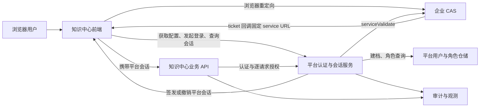
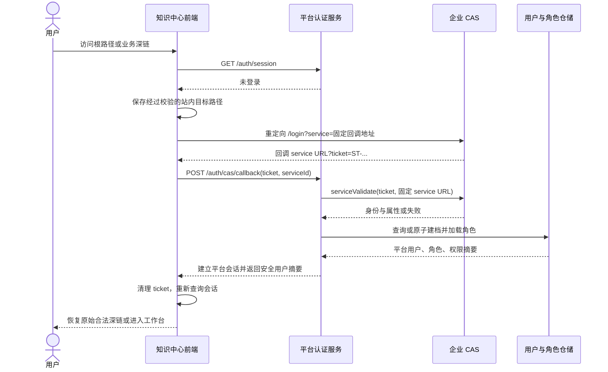
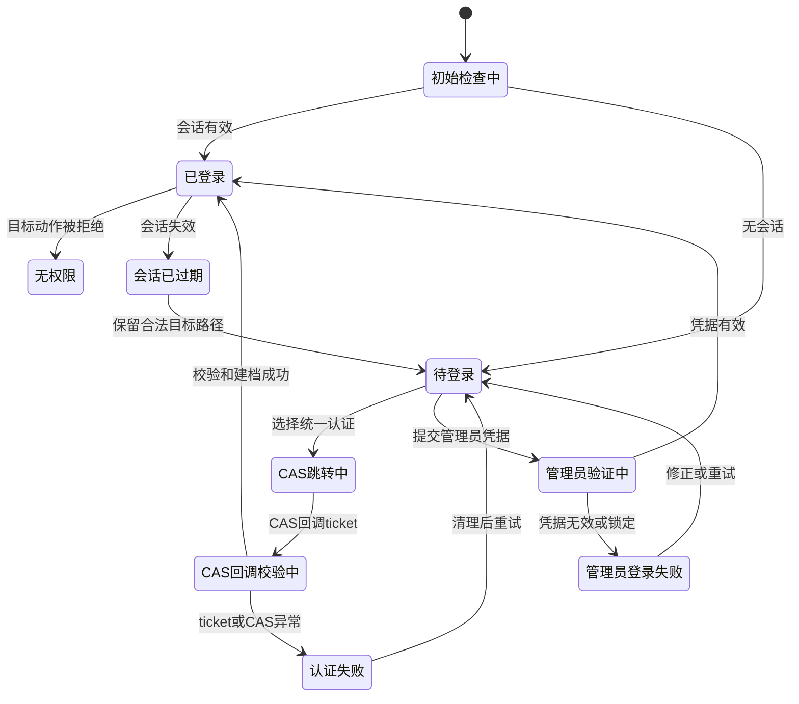

# 知识中心-认证-CAS登录与会话-概要设计文档

> 文档类型：模块概要设计
> 设计编号：知识中心建设-认证概要设计-001
> 需求来源：知识中心管理平台 CAS 登录需求
> 参考实现：`yas-ai-helper/web/src/views/auth/Login.vue`、`yas-ai-helper/yah-api/internal/web/controller/v1/auth.go`、`yas-ai-helper/yah-api/internal/web/service/auth.go`
> 状态：方案三已冻结；管理员默认凭据安全例外为 `needs_decision`
> 版本：0.2.0
> 更新日期：2026-08-31

## 1. 设计目的

本设计定义知识中心管理平台 `/knowledge-center/` 的登录、CAS 认证、平台会话、首次用户建档和认证后授权边界，使后续详细设计可以在不重新决定产品规则的前提下冻结接口、数据模型和部署实现。

本设计复用 `yas-ai-helper` 已验证的 CAS 2.0 思路和登录交互，不把其当前实现直接认定为知识中心已经具备的能力。当前知识中心由 `agent-runner/frontend-server.js` 提供静态页面和有限只读聚合接口，尚无完整认证代理、平台会话和逐请求授权实现。

## 2. 已确认范围与设计维度

### 2.1 已确认产品规则

1. 知识中心沿用企业现有 CAS，但登记知识中心独立的 `service URL`，不复用 AI 助手回调地址。
2. 普通业务用户通过 CAS 登录；首次成功登录后自动建立平台用户档案。
3. CAS 用户默认获得全部业务空间的知识业务读写权限，不自动获得审核、发布或平台管理权限。
4. 本地 `admin` 只用于用户、角色、权限和平台配置等管理操作，由管理员继续为其他用户分配扩展权限。
5. 登录页同时展示“统一认证登录”和管理员本地账号登录；两种入口必须明确标注用途，不能让普通用户误认为本地账号是常规业务登录方式。
6. 用户选择持续保留初始管理员凭据且不增加访问限制；该选择触及认证安全边界，本设计只记录为待审批例外，不代表已经获准进入开发、测试或生产环境。

### 2.2 设计维度

| 维度 | 本设计回答的问题 | 后续详细设计输入 |
|---|---|---|
| 身份来源 | 谁证明用户身份，使用哪个稳定标识 | CAS 属性样例和联调结果 |
| 用户映射 | 首次登录如何建档，后续哪些属性可同步 | 用户表、唯一约束和并发策略 |
| 授权 | 默认角色和管理权限如何隔离 | 权限矩阵、资源粒度和策略接口 |
| CAS 协议 | 登录、回调、票据校验和退出如何衔接 | 精确 URL、证书和响应样例 |
| 平台会话 | 登录后如何维持、过期和撤销会话 | Cookie/令牌字段、时效和密钥管理 |
| 前端体验 | 各登录状态如何展示与恢复 | 页面组件、文案和路由守卫 |
| 安全与审计 | 如何防止票据重放、权限绕过和敏感信息泄露 | 威胁模型、日志字段和告警规则 |
| 可观测性 | 如何区分 CAS、会话、授权和依赖故障 | 指标、健康检查和追踪字段 |
| 兼容与回退 | CAS 异常或新链路失败时如何止损 | 发布开关、回退步骤和应急授权 |
| 易用性 | 桌面、移动、键盘和读屏是否可完成流程 | 四视口原型和无障碍验收 |

## 3. 设计原则

1. **认证与授权分离**：CAS 只确认企业身份；平台后端对每个受保护请求校验角色、动作、空间和资源权限。
2. **默认拒绝与最小管理权限**：首次 CAS 用户可以获得已确认的业务读写基线，但审核、发布和平台管理权限必须显式授予。
3. **服务端是安全事实源**：浏览器不直接校验 CAS 票据，不解释 CAS 属性，不决定角色，也不依赖菜单可见性实施授权。
4. **票据与会话分离**：CAS ticket 只用于一次服务端校验，平台会话使用独立凭据；ticket 不作为平台会话令牌。
5. **敏感信息最少暴露**：ticket 使用后立即从地址栏移除；密码、ticket 和长期会话凭据不得写入 `localStorage`、日志、埋点或错误详情。
6. **失败可恢复**：CAS 不可用、ticket 失效、会话过期和权限不足分别表达，并提供符合当前状态的重试、重新登录或返回入口。
7. **行为可追溯**：登录方式、用户映射、角色变化、失败原因分类、会话撤销和退出都形成审计事件，但不记录敏感原文。
8. **现状与目标分离**：参考实现只提供可复用证据；知识中心的接口、用户库和会话实现必须经详细设计后落地。
9. **一致且可访问**：界面使用中文，主次入口清晰；支持键盘、读屏、缩放和减少动态效果，不用颜色单独表达状态。

## 4. 方案三：独立认证服务边界（已冻结）

经用户选择，知识中心采用方案三：在现有部署中增加独立的认证服务职责边界。认证服务不属于 3500 静态入口、4100 文档生成业务或 8001 资料加工业务；它拥有独立配置、会话存储和审计接口，可先以同一 Node 进程内的隔离模块部署，后续再按容量拆分进程，外部契约保持不变。

### 4.1 服务职责

| 服务 | 端口/入口 | 认证相关职责 | 明确不负责 |
|---|---|---|---|
| 认证服务（方案三） | 内部受控地址；由 3500 代理 `/knowledge-center/auth/*` | CAS ticket 校验、用户建档、角色解析、会话签发/撤销、管理员本地登录、审计、内部身份令牌签发 | 业务对象读写、前端静态资源 |
| 3500 知识中心入口 | `/knowledge-center/` | 同源静态资源、认证接口反向代理、深链恢复；向下游传播认证服务签发的内部身份证明 | 保存用户/角色事实、直接访问 CAS、仅靠菜单做授权 |
| 4100 Node 业务服务 | `/api/*` | 验证内部身份证明，逐请求执行文档/工作流/模型等权限检查 | CAS ticket 校验、浏览器登录态管理 |
| 8001 Python 资料服务 | `/api/*` | 验证内部身份证明，逐请求执行资料/批次/数据集权限检查 | 信任裸用户请求头、直接访问 CAS |

### 4.2 身份传播

1. 浏览器只持有认证服务设置的 `Secure; HttpOnly; SameSite=Lax` 会话 Cookie，不保存 CAS ticket、密码或 Bearer 令牌。
2. 3500 代理请求先向认证服务 introspection 当前 Cookie，再生成短时效、带 `requestId`、`audience`、`principalId` 和权限版本的内部身份证明。
3. 3500 到 4100/8001 的内部请求携带该证明及时间戳；下游使用共享密钥验证签名、受众、时钟偏差和重放缓存，验证失败统一返回 401/403。
4. 下游不得信任浏览器传入的 `X-User`、`X-Role`、`X-Permissions`；所有角色和权限以认证服务/权限仓储事实为准。聚合接口必须向两个下游分别传播同一请求的身份上下文。

### 4.3 方案边界与冻结项

- 认证服务逻辑可与 4100 同进程部署，但代码、配置、路由和存储必须隔离；不得把认证实现放进 3500 静态文件处理器。
- 平台用户、角色、会话和审计的生产事实源为总体设计指定的 YashanDB；临时 JSON/内存仓库仅允许用于隔离测试。
- 方案三不改变 CAS 唯一常规业务身份来源；管理员本地入口只作为平台管理能力展示。按用户批准的兼容策略，初始管理员允许使用 `admin/admin` 且不强制首次改密，同时必须启用失败限流、统一错误、审计、异常告警和可配置凭据入口。
- 管理员“不强制改密”的用户选择仅记录为产品偏好；在无额外审批引用时，实施基线为随机初始化密码、首次登录强制改密、失败锁定、审计告警和受限网络入口。

## 5. 总体边界



### 5.1 责任划分

| 责任方 | 负责 | 不负责 |
|---|---|---|
| 企业 CAS | 用户身份认证、签发和校验服务票据、CAS 单点退出 | 知识空间、文档、审核、发布和平台管理授权 |
| 平台认证与会话服务 | 固定 service 校验、用户映射、平台会话签发与撤销、当前用户上下文 | 代替业务 API 判断具体资源是否可读写 |
| 平台授权层 | 角色与权限解析、空间和资源动作校验、拒绝语义 | 信任前端传入的角色或权限摘要 |
| 知识中心前端 | 发起跳转、展示状态、清理回调地址、恢复合法深链 | 保存或校验 CAS 凭证、在客户端授予权限 |
| 管理员 | 管理用户、角色和扩展权限 | 改变 CAS 身份事实 |

### 5.2 物理部署边界

本设计新增的是逻辑“认证与会话服务”职责，不在概要阶段决定新建服务。详细设计应优先评估将该职责增量放入现有知识中心后端或受控网关，只有现有边界无法满足会话、持久化和逐请求授权时才申请新增服务。不得让当前静态文件处理器直接拼接未经验证的 CAS 响应或把权限判断留在浏览器。

## 6. 角色与权限基线

### 6.1 基础角色

| 角色 | 身份来源 | 默认能力 | 明确禁止 |
|---|---|---|---|
| 知识业务读写者 | CAS 首次登录自动建档 | 读取和编辑全部业务空间内允许读写的知识业务对象 | 用户、角色、权限、连接器、系统配置和审计管理；审核与发布除非另行授权 |
| 扩展业务角色 | 管理员显式授予 | 审核、发布或其他业务职责 | 未授权的平台管理动作 |
| 平台管理员 | 本地 `admin` 或后续获批的管理角色 | 用户、角色、权限和平台配置管理 | 绕过审计或把前端可见性当作授权 |

“全部业务空间读写”是当前确认的产品基线，不等于对所有接口授予通配权限。平台仍需按业务对象和动作建立权限映射；管理、审核、发布、敏感配置和审计读取不包含在基础读写中。

### 6.2 首次建档与属性同步

1. 用户唯一映射优先使用 CAS 返回的稳定企业用户标识；具体选择 `uid`、用户名或其他属性必须通过真实 CAS 样例确认。
2. CAS 校验成功但稳定标识缺失时默认拒绝建档，不能临时使用显示名或邮箱代替稳定身份。
3. 首次建档与基础角色绑定必须在同一事务或具备等价补偿，避免产生无角色的半成品用户。
4. 并发首次登录必须依赖稳定标识唯一约束，重复请求返回同一个平台用户。
5. 后续登录只同步白名单中的显示名、邮箱、工号等非权限属性；CAS 属性不得覆盖本地角色、权限、禁用状态和管理员维护字段。
6. 本地已禁用用户即使通过 CAS 校验也不得建立平台会话，响应不泄露内部禁用原因给无权调用者。

## 7. 认证与会话流程

### 7.1 普通 CAS 登录



处理约束：

1. 原始目标只接受同源 `/knowledge-center/` 范围内的路径，拒绝协议相对地址、外部地址和越界路径，避免开放重定向。
2. 浏览器提交逻辑 `serviceId` 或由服务端生成的登录事务标识；服务端从白名单解析真实 service URL，不接受客户端任意 URL。
3. ticket 校验设置受控连接和总超时，限制响应大小，仅接受预期协议与内容类型，并验证失败响应。
4. ticket 成功使用后视为已消费；重复、过期、伪造或 service 不匹配均拒绝，错误响应不回显 ticket。
5. 平台会话建议使用 `Secure`、`HttpOnly`、合理 `SameSite` 的 Cookie，避免把长时效 Bearer Token 持久化到浏览器脚本可读存储。精确策略在详细设计中冻结。
6. 登录成功后必须重新读取 `/auth/session`，不能直接信任回调请求中携带或页面缓存的角色信息。

### 7.2 管理员本地登录

登录页允许展开管理员登录区，字段为管理员账号和密码，并明确标注“仅用于平台管理”。该流程必须由平台后端验证凭据并建立与 CAS 会话可区分的平台会话；前端允许密码管理器和粘贴，不记录密码，不在错误消息中区分“账号不存在”和“密码错误”。

管理员登录成功后的默认落点为平台管理首页；若尝试恢复业务深链，仍以管理员实际权限为准。失败次数、锁定、解锁和凭据更新策略在安全例外解除后由详细设计冻结。

### 7.3 退出与会话过期

1. `POST /auth/logout` 先撤销平台会话，再返回受控的 CAS logout 地址或退出模式。
2. CAS 用户按配置跳转 CAS 单点退出；本地管理员只结束平台会话，不向 CAS 发送无意义的退出请求。
3. 退出返回地址仍限定为知识中心同源路径。
4. 会话过期时，前端清除内存态用户上下文，提示“登录状态已过期”，保留合法目标路径后重新认证。
5. 对写操作不得在会话恢复后自动重放；用户需确认并重新提交，避免重复写入。

## 8. 逻辑接口契约

所有接口为概要级逻辑契约，公共路径、字段、错误码和 Cookie 细节需在详细设计评审后冻结。除公开配置与登录入口外，认证、业务和管理接口均实施服务端授权。

### 8.1 `GET /auth/config`

返回 CAS 是否启用、CAS 登录入口、知识中心 service 标识或服务端生成的登录地址、是否展示管理员入口、平台显示名称和退出能力。不得返回 CAS 管理凭据、证书私钥、内部网络详情或可由客户端任意替换的信任配置。

### 8.2 `GET /auth/session`

返回 `authenticated`、登录方式、用户安全摘要、角色摘要、`visibleModules`、`allowedActions` 或等价服务端授权投影，以及会话过期或续期提示。授权投影只用于界面展示，不替代业务 API 校验，也不返回会话密钥。

### 8.3 `POST /auth/cas/callback`

输入只包含 ticket、固定 service 标识或登录事务标识；输出包含用户安全摘要、是否首次建档和受控默认跳转。接口负责校验票据、映射平台用户和建立会话，并实施 CSRF、重放、service 白名单、超时、响应大小和审计控制。

### 8.4 `POST /auth/logout`

撤销当前平台会话，返回是否需要跳转 CAS 以及受控退出地址。重复调用保持幂等，不因 CAS 不可用而保留本地有效会话。

### 8.5 `GET /auth/health`

供有平台管理权限的用户查看 CAS 配置完整性、最近探测状态和认证服务状态。健康接口不暴露票据、凭据、完整属性响应或内部调用地址；公开探针与管理员诊断信息应分层。

### 8.6 错误分类

| 类别 | 用户可见语义 | 恢复动作 |
|---|---|---|
| 未登录 | 需要登录后继续 | 发起统一认证或管理员登录 |
| ticket 无效或过期 | 认证信息已失效 | 清理 ticket 并重新发起登录 |
| service 不匹配 | 登录请求无法验证 | 停止重试，联系管理员检查配置 |
| CAS 不可用或超时 | 统一认证暂时不可用 | 保留安全目标并提供稍后重试 |
| 用户被禁用 | 当前账号无法访问平台 | 联系管理员，不暴露内部策略细节 |
| 权限不足 | 已登录但无权执行该动作 | 返回可访问页面并说明所需权限 |
| 平台会话过期 | 登录状态已过期 | 重新登录，不自动重放写操作 |
| 服务端异常 | 当前操作未完成 | 提供追踪编号和重试入口 |

HTTP 状态和稳定错误码在详细设计中统一，前端不得依赖易变的中文错误文本分支。

## 9. 核心对象边界

### 9.1 平台用户

至少包含：平台用户 ID、稳定企业用户标识、登录名、显示名、邮箱、工号、身份来源、启用状态、角色关联、创建与更新时间、最近登录时间和审计关联。具体字段、加密和索引方案由数据详细设计确定。

### 9.2 角色与权限

权限至少分为三组：

1. 业务空间和知识资产的读取、创建、编辑及相关业务动作。
2. 审核、发布、退回、评论处理等职责动作。
3. 用户、角色、权限、连接器、系统配置和审计等平台管理动作。

角色绑定由平台维护。CAS 只提供身份属性，不直接返回平台角色；未来若引入部门或群组映射，必须单独设计、审批和验证，不能从当前“全部业务空间读写”规则推导。

### 9.3 平台会话

会话至少关联：会话 ID、平台用户、登录方式、签发与过期时间、撤销状态、最近活动、安全上下文和审计引用。会话中只放授权计算所需的最小信息；角色或用户状态变化后，应支持立即失效或在受控短周期内重新加载。

## 10. 前端信息与交互设计

### 10.1 页面结构

登录页延续参考页面的居中登录面板、品牌标识和清晰主操作，但使用知识中心现有视觉令牌，不复制参考页面的装饰性渐变或动画。页面从上到下为：

1. 产品标识“知识中心管理”。
2. 主操作“统一认证登录”，视觉优先级最高。
3. 管理员登录区，明确标注“平台管理”，与普通业务入口保持语义和视觉区分。
4. 当前错误与恢复动作。
5. 必要的服务状态或联系信息；不展示内部地址、堆栈和敏感配置。

### 10.2 页面状态机



“登录成功跳转”是短暂反馈，不应延长用户等待；路由失败时回退工作台并说明原因。无权限是授权状态，不得错误地显示为 CAS 登录失败。

### 10.3 易用性与无障碍

1. 初始检查、CAS 跳转和回调校验期间显示明确进度，防止重复提交；不能用持续转圈掩盖超时。
2. 错误信息靠近对应入口，并提供“重试”“重新登录”或“返回工作台”等可执行恢复动作。
3. 管理员表单使用可见标签、`autocomplete="username"` 和 `autocomplete="current-password"`，允许密码管理器及粘贴。
4. 所有控件支持键盘操作和可见焦点；主按钮触控区域不小于 44×44px。
5. 状态变化使用适当的 `role="status"` 或 `role="alert"`，图标有可访问名称或标记为装饰。
6. 文本与背景对比度达到 WCAG 2.2 AA；错误、成功和禁用状态不只依赖颜色。
7. 支持浏览器缩放和 `prefers-reduced-motion`；加载文案和错误详情不得造成布局跳动或遮挡。
8. 在 375px、768px、1024px、1440px 视口验证无横向滚动、操作遮挡和内容截断；移动端登录区单列展示。

### 10.4 路由与深链

- 根路径和八个业务模块深链进入同一认证守卫。
- 登录前仅保存同源、规范化且属于 `/knowledge-center/` 的目标路径。
- 登录后若目标仍存在且有权限则恢复；否则进入第一个可访问页面并显示原因。
- 浏览器前进、后退和刷新不能绕过会话检查。
- 回调处理完成后用 `history.replaceState` 或等价能力移除 ticket，不能把 ticket 留在历史、复制链接或分析事件中。

## 11. 安全、审计与可观测性

### 11.1 必须控制的安全风险

- 固定并校验 CAS 地址、协议和 service URL，防止 SSRF、开放重定向和 service 替换。
- 限制 CAS 响应大小、超时、内容类型和属性白名单；异常默认拒绝。
- 对会话 Cookie、登录回调和本地管理员登录实施 CSRF、防重放、速率限制和安全响应头。
- 不在浏览器存储、日志、指标、URL、Referer 或错误详情中保留 ticket、密码和会话密钥。
- 登录、建档和属性同步不能修改本地权限事实；所有管理接口逐请求鉴权。
- 禁止以菜单隐藏、路由元数据或前端 `allowedActions` 作为唯一授权依据。

### 11.2 审计事件与观测指标

至少记录 CAS 登录发起与结果分类、管理员登录结果分类、首次建档、非权限属性同步、会话签发与撤销、退出、用户禁用拒绝、权限拒绝、角色或权限变更。事件包含时间、平台用户或匿名关联、登录方式、动作、结果、来源摘要和追踪 ID；不得记录 ticket、密码和完整会话令牌。

指标至少覆盖登录成功率、CAS 校验时延与错误分类、首次建档失败、会话创建与撤销失败、401/403 数量、管理员登录失败和认证依赖健康状态。告警阈值和保留周期属于后续运行设计，不在本概要中硬编码。

## 12. 安全例外与审批边界

### 12.1 当前例外

用户已表达以下偏好：登录页同页展示管理员入口，持续保留初始 `admin/admin`，且不附加内网、初始化窗口或首次强制改密限制。

该偏好会造成可预测的未授权管理风险：攻击者无需猜测账号即可持续尝试已知凭据；一旦环境可达，默认凭据可能直接取得平台最高管理权限。审计和告警只能发现或追踪风险，不能抵消弱凭据本身。

### 12.2 审批评估

```yaml
approvalAssessment:
  proposedAction: 在知识中心实现同页本地管理员登录，并持续接受 admin/admin 且无额外访问限制
  knownFacts:
    - 用户已明确选择该交互和凭据策略
    - 该账号拥有用户、角色、权限和平台配置管理能力
    - 当前任务仅交付概要设计，不实施认证代码或部署配置
  unknowns:
    - 生产访问范围、网络暴露面和责任人授权
    - 是否存在企业安全基线、密码策略或上线门禁
    - 默认凭据泄露后的恢复与应急处置能力
  affectedBoundaries: 安全、认证、权限、审计、发布
  reversibility: 实施前可回退；上线并产生访问后仅条件可回退
  recommendation: needs_decision
  rationale: 持续默认管理凭据会降低认证安全控制，必须由有权责任人接受风险后才能实施或上线
  safeWorkWhileWaiting: 详细设计普通 CAS 登录、用户映射、会话、授权、测试桩和管理员入口的安全替代方案
```

当前用户对“接受无额外限制”的选择作为产品偏好证据保留，但不等同于已核验的生产安全审批引用。实现前必须取得能定位决策主体、范围、环境、约束和回退条件的有效批准。

### 12.3 未批准时的默认回退

按以下优先级回退，不阻塞普通 CAS 登录设计：

1. 首次管理员登录强制修改密码，修改前禁止进入其他管理功能。
2. 仅在部署初始化窗口或受限内网开放本地管理员入口，初始化完成后关闭公开入口。
3. 若仍需同页入口，保留“平台管理”分区，但隐藏默认账号信息并执行锁定、告警和强密码策略。

## 13. 兼容、降级与回退

1. CAS 配置缺失或自检失败时，普通用户入口显示不可用及恢复指引，不自动降级为管理员账号登录。
2. CAS 暂时不可用不能扩大已有会话权限；会话到期后默认拒绝写入。
3. 新认证链路以配置开关和独立 service URL 灰度；失败时可以关闭知识中心 CAS 入口并回退到未认证页面，不复用 AI 助手 service URL。
4. 用户建档和角色绑定失败时整体失败，不签发半授权会话；重试必须幂等。
5. CAS 登出失败时仍撤销本地会话，并明确提示企业单点会话可能仍有效。
6. 认证实现不得破坏 `/knowledge-center/` 现有语义路由；静态资源、登录回调和业务深链的服务端匹配顺序需在详细设计中验证。

## 14. 验收设计

### 14.1 功能与安全场景

| 编号 | 场景 | 预期结果 |
|---|---|---|
| AUTH-01 | 未登录访问根路径 | 进入登录态检查并可跳转 CAS |
| AUTH-02 | 未登录访问合法业务深链 | 登录成功且有权限后恢复原路径 |
| AUTH-03 | 合法 ticket | 服务端真实校验，建档或加载用户并建立平台会话 |
| AUTH-04 | 非法、过期或重复 ticket | 拒绝且不回显票据，允许重新发起认证 |
| AUTH-05 | service URL 不匹配 | 服务端拒绝，不向任意目标跳转 |
| AUTH-06 | 首次 CAS 用户 | 原子建档并获得业务读写，不具备管理、审核和发布权限 |
| AUTH-07 | 既有 CAS 用户属性变化 | 仅同步白名单非权限属性，角色和禁用状态不被覆盖 |
| AUTH-08 | 普通用户调用管理接口 | 后端返回无权限，前端菜单状态不影响结论 |
| AUTH-09 | admin 登录 | 仅在安全例外获批后验收管理能力；普通环境不得以设计稿代替批准 |
| AUTH-10 | CAS 退出 | 本地会话先失效，再执行受控 CAS logout |
| AUTH-11 | 本地管理员退出 | 本地会话失效，不产生错误 CAS 调用 |
| AUTH-12 | 会话过期 | 清理用户上下文，重新认证，不自动重放写操作 |
| AUTH-13 | CAS 超时或异常响应 | 受控超时、默认拒绝、页面提供恢复动作 |
| AUTH-14 | 开放重定向尝试 | 外部或越界目标被拒绝并回退安全首页 |
| AUTH-15 | 敏感信息扫描 | URL 清理后、日志、浏览器存储和错误响应无 ticket、密码或会话密钥 |
| AUTH-16 | 审计 | 登录、建档、退出、拒绝和权限变更可按追踪 ID 定位 |

### 14.2 易用性场景

- 375px、768px、1024px、1440px 视口无横向滚动、遮挡和关键文本截断。
- 仅使用键盘可以完成统一认证发起、管理员表单提交、错误恢复和焦点返回。
- 读屏可识别页面标题、两个入口的不同用途、加载状态和错误恢复动作。
- 200% 浏览器缩放下主要操作仍可见；减少动态效果时不依赖动画传递状态。
- CAS 失败、ticket 失效、无权限和会话过期的中文提示可区分且包含下一步动作。

### 14.3 验证方式

1. 单元测试覆盖目标路径校验、service 白名单、属性映射、首次建档幂等、角色隔离和错误分类。
2. 集成测试必须真实调用知识中心认证后端 API，并使用受控 CAS 测试环境或协议桩完成票据校验；不能只验证前端 URL 跳转。
3. 后端 API 测试分别以基础读写者、扩展业务角色和管理员身份验证 401/403/成功边界。
4. Playwright 覆盖根路径、深链、回调清理、退出、四视口、键盘和错误恢复。
5. 安全检查覆盖 CSRF、票据重放、开放重定向、敏感信息落盘/日志、速率限制和会话撤销。

## 15. 后续详细设计输入

进入实现前必须补齐：

1. 知识中心认证与会话职责落入哪个现有后端，以及与 Node、Python 专业服务的统一鉴权方式。
2. CAS 真实 `serviceValidate` 响应、稳定用户标识、属性多值语义、证书信任和单点退出能力。
3. 平台会话载体、时效、续期、撤销、CSRF 和密钥轮换策略。
4. “知识业务读写”到各模块、对象和动作的权限矩阵，以及审核、发布和管理权限的显式边界。
5. 平台用户、角色、会话和审计在 YashanDB 中的模型、事务及唯一约束。
6. 管理员默认凭据安全例外的有效审批或替代方案决策。
7. 稳定错误码、HTTP 状态、前端状态机和真实端到端验收环境。

上述第 6 项只阻塞本地管理员弱凭据策略的实现和上线，不阻塞普通 CAS 登录、用户映射、授权隔离和安全会话的详细设计。
