# YashanDB 知识库文档生成器

> **一句话定位**：通过「知识点驱动 + AI 智能生成 + 自动化工作流」，将 200+ 数据库知识点自动转化为标准化、高质量的技术文档。

---

## 一、项目全景

### 1.1 设计背景与思路

#### 问题起源

YashanDB 作为企业级数据库，需要为 DBA 和开发者提供完整的技术文档体系。传统文档编写方式面临四大挑战：

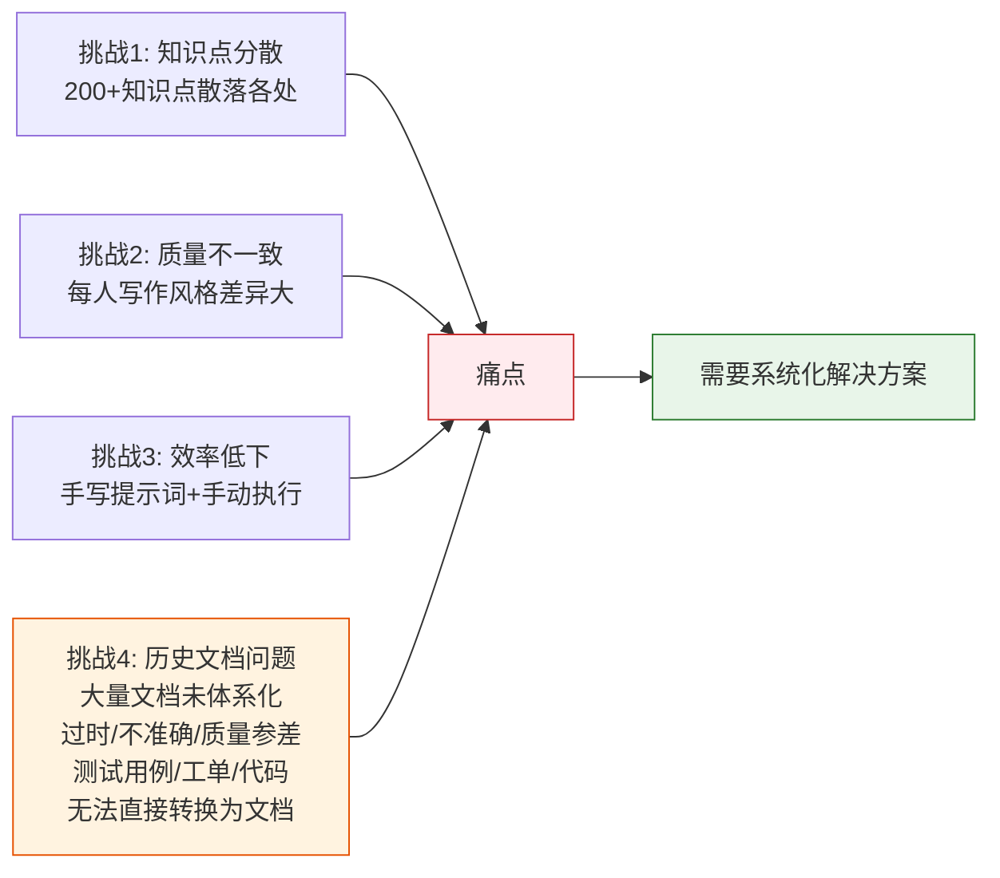

**历史文档困境**：
- 大量历史文档散落在各处，缺乏统一的组织结构
- 文档内容过时、不准确，质量参差不齐
- 大量测试用例、工单记录、研发代码中包含宝贵的技术知识，但无法直接转换为标准文档

#### 解决思路：两阶段演进

我们采用了**渐进式演进**的设计思路，从简单工具逐步发展为完整系统：

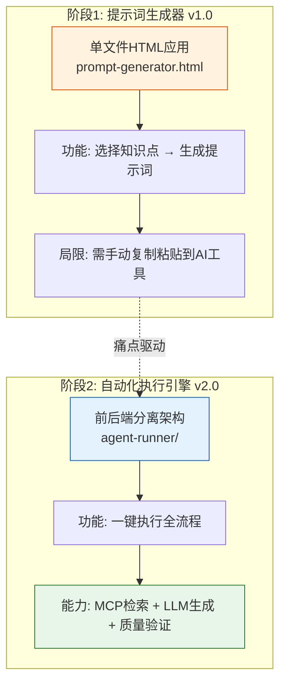

**核心设计理念**：

1. **知识点驱动**：以 200+ 知识点大纲为输入，而非随意提问
2. **模板标准化**：7 套标准模板保证文档结构统一（可扩展）
3. **Skill 专业化**：7 个内置 Skill 文件定义不同类型文档的生成规则（可扩展）
4. **自动化工作流**：Workflow Agent 多步骤协作，减少人工干预
5. **质量可追溯**：生成日志记录完整过程，支持审计和复盘
6. **高度可扩展**：不只是内置的 7 个 Skill，用户可以：
   - 设计自定义知识点大纲
   - 新增 Skill 文件定义新的文档类型
   - 创建文档模板适配不同场景
   - 生成体系化的文档，覆盖任意知识领域

### 1.2 整体架构全景

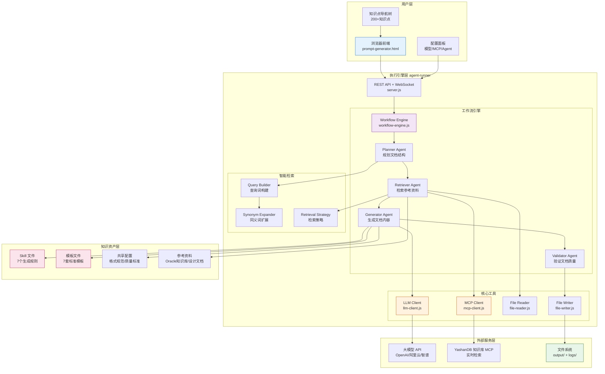

### 1.3 数据流全景

从用户选择知识点到最终生成文档，完整的数据流如下：

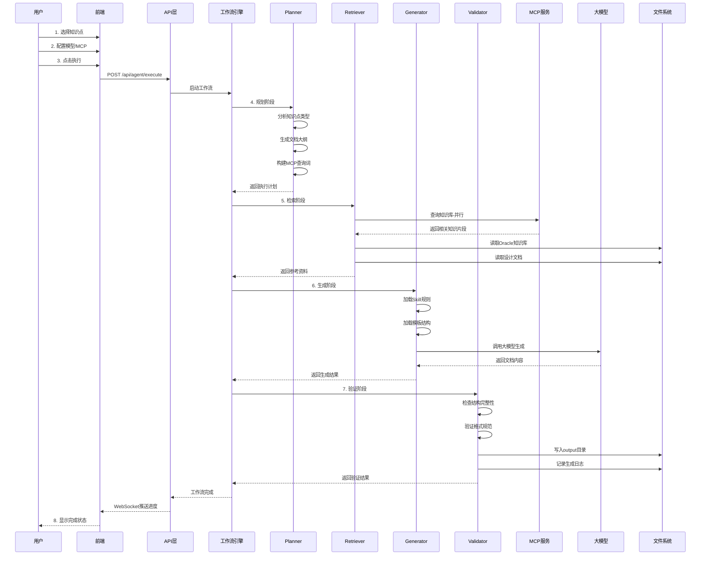

### 1.4 两大核心组成

本项目由**两大核心部分**组成，相互协作：

| 组成部分 | 职责 | 核心文件 |
|---------|------|---------|
| **Skill 仓库** | 定义"生成什么" | `skills/` `templates/` `config/` `outlines/` |
| **执行引擎** | 负责"怎么生成" | `agent-runner/` |

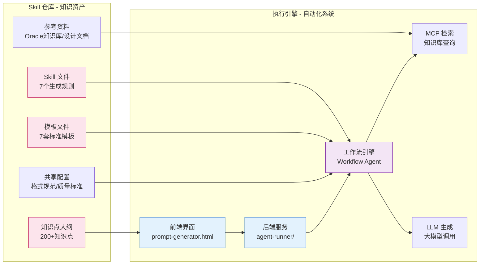

**Skill 仓库**：包含所有知识资产，定义了 7 种文档类型的生成规则和标准模板，是系统的"大脑"。

**执行引擎**：前后端分离的自动化系统，负责调用 MCP 检索知识、调用 LLM 生成文档、验证质量并输出文件，是系统的"手脚"。

---

## 二、系统架构

### 2.1 技术栈

| 层级 | 技术选型 | 说明 |
|------|---------|------|
| **前端** | 原生 HTML/CSS/JS | 单文件应用，无需构建工具 |
| **后端** | Node.js + Express | RESTful API + WebSocket 实时通信 |
| **大模型** | OpenAI SDK | 支持 OpenAI / 阿里云百炼 / 智谱 AI |
| **知识检索** | MCP 协议 | Model Context Protocol，标准化知识检索 |
| **配置存储** | JSON 文件 | AES-256 加密存储 API Key |
| **日志** | Winston | 结构化日志，支持多级别 |

### 2.2 核心模块职责

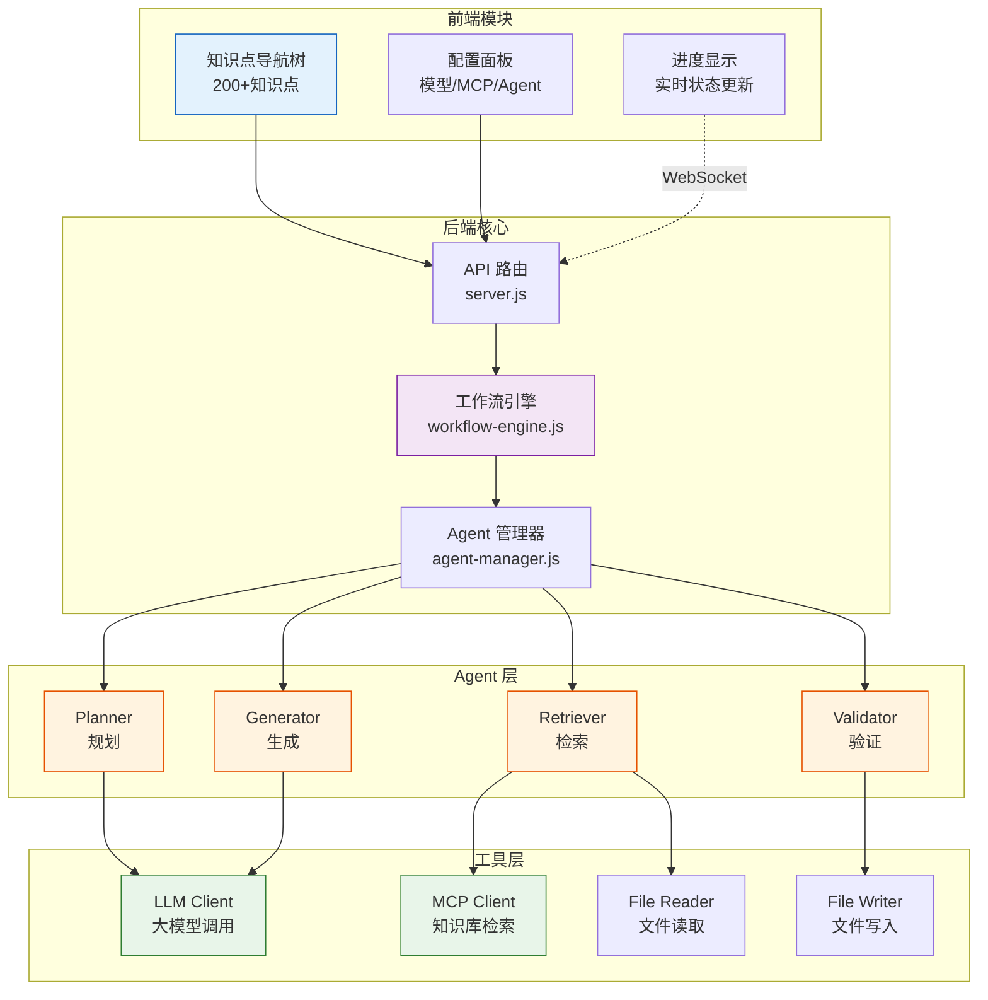

### 2.3 工作流引擎

默认 4 步工作流，支持用户自定义：


**各步骤职责**：

| 步骤 | Agent | 输入 | 输出 | 关键动作 |
|------|-------|------|------|---------|
| **1. 规划** | Planner | 知识点信息 | 执行计划 | 分析类型、生成大纲、构建查询词 |
| **2. 检索** | Retriever | 查询词 | 参考资料 | MCP 查询、读取本地文件 |
| **3. 生成** | Generator | 参考资料 | 文档草稿 | 加载 Skill/模板、调用 LLM |
| **4. 验证** | Validator | 文档草稿 | 最终文档 | 结构检查、格式验证、写入文件 |

---

## 三、核心概念

### 3.1 知识点 x Skill x 模板

三个核心概念的关系：

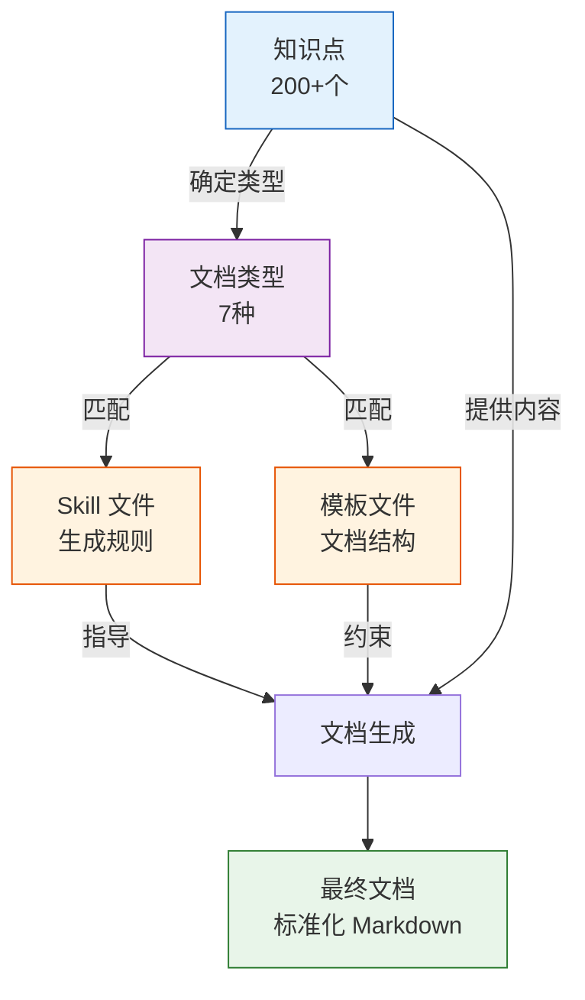

**7 种文档类型**：

| 类型 | Skill 文件 | 模板文件 | 适用场景 |
|------|-----------|---------|---------|
| 通用基础 | `00-通用生成-skill.md` | `01-通用基础模板.md` | 基础概念介绍 |
| 理论机制 | `01-理论机制-skill.md` | `02-理论机制类模板.md` | 内部原理剖析 |
| 实战调优 | `02-实战调优-skill.md` | `03-实战调优类模板.md` | 性能优化指南 |
| 架构对比 | `03-架构对比-skill.md` | `04-架构对比类模板.md` | 与其他数据库对比 |
| 运维SOP | `04-运维SOP-skill.md` | `05-运维SOP类模板.md` | 标准化操作流程 |
| SQL开发参考 | `05-SQL开发参考-skill.md` | `06-SQL开发参考类模板.md` | SQL语法参考 |
| 兼容性差异 | `06-兼容性差异-skill.md` | `07-兼容性差异类模板.md` | 迁移兼容性说明 |

### 3.2 资料引用策略

系统按优先级检索参考资料，确保内容准确性：

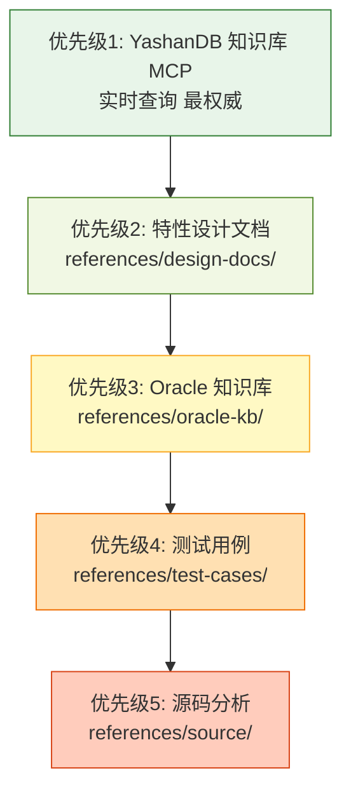

**智能查询词构建**：

系统会自动从知识点中提取关键词，并通过 LLM 进行同义词扩展：

```
输入：数值类型：NUMBER(p,s)
  |
提取关键词：["NUMBER(p,s)", "INTEGER", "DECIMAL"]
  |
LLM 同义词扩展：
  - "NUMBER(p,s)" -> ["NUMBER类型精度标度", "NUMBER数据类型定义", "数值类型映射"]
  - "INTEGER" -> ["整数类型", "INT BIGINT类型", "NUMBER(38)整数"]
  |
MCP 查询：7 条查询词并行检索
```

### 3.3 质量保障体系

四层质量检查机制（第四层待实现）：

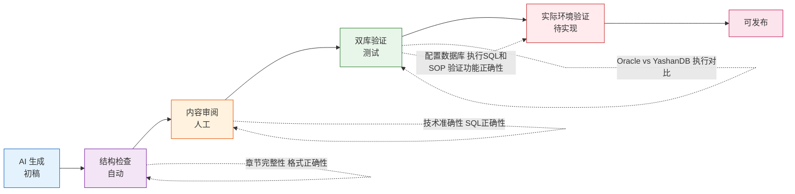

**第四层：实际环境验证（待实现）**

> **状态说明**：此功能为规划中的待实现特性，当前版本尚未实现。以下为初步设计方案。

当前验证阶段还缺乏实际环境验证的内容。计划实现：

**核心功能**：
- 配置测试数据库连接（YashanDB / Oracle / MySQL 等）
- 自动提取文档中的 SQL 语句
- 在真实数据库环境中执行 SQL 和 SOP 操作
- 验证文档中的示例代码是否可执行
- 对比实际执行结果与文档描述是否一致
- 生成验证报告，标记失败的测试用例

**架构设计（待实现）**：

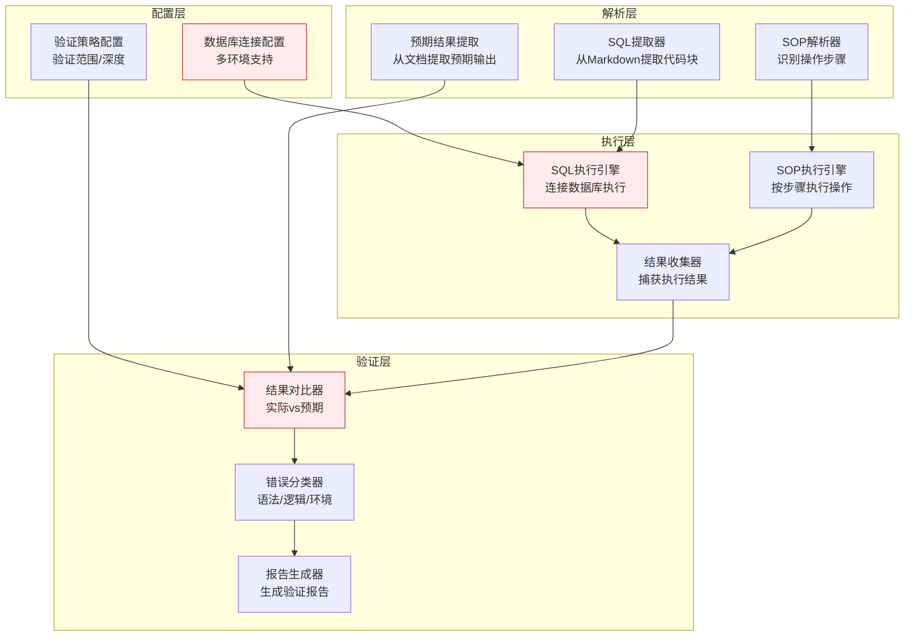

**工作流程（待实现）**：

1. **配置阶段**
   - 配置测试数据库连接信息（支持多环境：开发/测试/生产）
   - 设置验证策略（验证范围：全部/部分章节；验证深度：语法检查/执行验证）

2. **解析阶段**
   - 扫描生成的 Markdown 文档
   - 提取所有 SQL 代码块（```sql ... ```）
   - 识别 SOP 操作步骤
   - 提取文档中描述的预期结果

3. **执行阶段**
   - 建立数据库连接
   - 按顺序执行 SQL 语句（CREATE/INSERT/SELECT/UPDATE/DELETE）
   - 执行 SOP 操作（如备份、恢复、监控等）
   - 捕获实际执行结果和错误信息

4. **验证阶段**
   - 对比实际结果与预期结果
   - 分类错误类型（语法错误/逻辑错误/环境依赖）
   - 生成验证报告（成功/失败/警告统计）

**技术实现要点（待实现）**：

| 模块 | 技术方案 | 说明 |
|------|---------|------|
| **数据库连接** | 多驱动支持 | YashanDB/Oracle/MySQL 驱动，连接池管理 |
| **SQL提取** | Markdown解析器 | 正则 + AST解析，识别代码块语言标记 |
| **执行引擎** | 异步执行 | 支持超时控制、事务回滚、错误隔离 |
| **结果对比** | 智能匹配 | 支持精确匹配/模糊匹配/正则匹配 |
| **报告生成** | HTML/Markdown | 可视化报告，支持导出 |

**配置示例（待实现）**：

```json
{
  "validation": {
    "enabled": false,
    "databases": [
      {
        "name": "yashandb-test",
        "type": "yashandb",
        "host": "localhost",
        "port": 6688,
        "database": "test_db",
        "username": "test_user",
        "password": "encrypted:xxx"
      }
    ],
    "strategy": {
      "scope": "all",
      "depth": "execution",
      "timeout": 30,
      "rollback": true
    }
  }
}
```

**验证报告示例（待实现）**：

```
验证报告：数值类型 NUMBER(p,s) 兼容性
========================================
总测试用例：15
成功：12 (80%)
失败：2 (13%)
跳过：1 (7%)

失败用例：
1. test_boundary.sql - 精度超出范围测试
   预期：报错 ORA-01438
   实际：报错 YAS-01438（错误码不同）
   分类：预期结果差异（非功能性问题）

2. test_implicit_conversion.sql - 隐式转换测试
   预期：成功转换
   实际：执行失败（语法错误）
   分类：文档错误（需修正SQL语法）
```

**溯源机制**：

每次生成都会在 `logs/` 目录记录：
- 生成时间、使用的 Skill 和模板
- MCP 查询词和检索结果
- LLM 调用的完整上下文
- 输出文件路径

支持完整的审计和复盘。

---

## 四、快速上手

### 4.1 环境准备

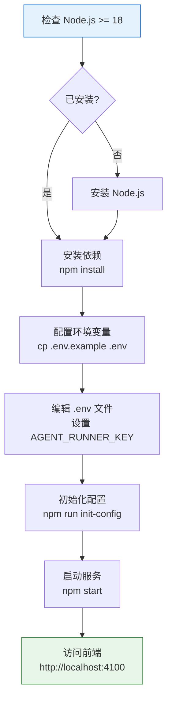

**详细步骤**：

```bash
# 1. 进入 agent-runner 目录
cd agent-runner

# 2. 安装依赖
npm install

# 3. 配置环境变量
cp .env.example .env
# 编辑 .env，设置 AGENT_RUNNER_KEY=your-secret-key

# 4. 初始化配置（生成默认配置文件）
npm run init-config

# 5. 启动服务
npm start

# 6. 打开浏览器访问
# http://localhost:4100
```

### 4.2 首次使用流程

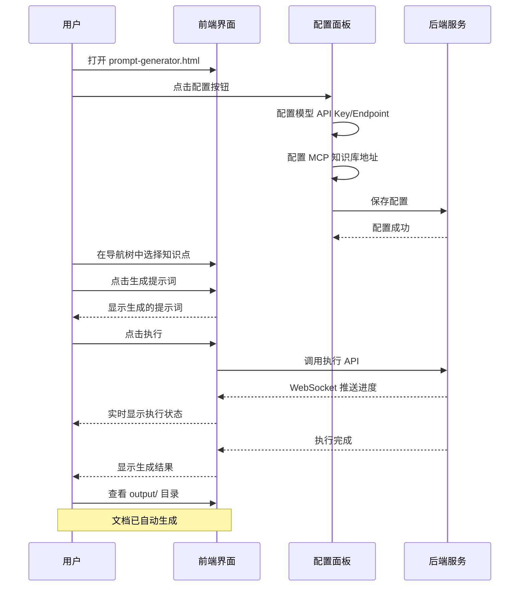

### 4.3 一个完整的生成示例

**目标**：生成"数值类型 NUMBER(p,s) 兼容性"文档

**步骤 1：选择知识点**

在左侧导航树中展开：
```
  业务领域
  -> 第1部分：兼容性领域
      -> 1 DDL 兼容性
          -> 1.1 数据类型映射
              -> 1.1.2 数值类型：NUMBER(p,s) -> INTEGER / DECIMAL / NUMERIC
```

**步骤 2：配置参考资料**（可选）

- MCP 关键词：`NUMBER类型, 精度标度, 数据类型映射`
- Oracle 文档：`P1-02-01 - 关系数据结构.md`

**步骤 3：执行生成**

点击"执行"按钮，系统自动完成：

1. **Planner**：识别为"兼容性差异"类型，选择 `06-兼容性差异-skill.md` 和 `07-兼容性差异类模板.md`
2. **Retriever**：MCP 查询 7 条相关知识，读取 Oracle 知识库
3. **Generator**：调用 LLM 生成 3000+ 行文档
4. **Validator**：验证结构完整性，写入 `output/兼容性领域/01-DDL兼容性/`

**生成结果**：

```
output/
  -> 兼容性领域/
      -> 01-DDL兼容性/
          -> 数值类型：NUMBER(p,s) -> INTEGER / DECIMAL / NUMERIC 等.md
```

文档包含：
- YAML 元数据（知识库ID、分类、版本等）
- 适用范围与编写目的
- 特性功能介绍
- 差异对比总览表
- 详细用法与 SQL 示例
- 常见错误与排查
- 迁移方案
- 测试用例
- 引用来源

---

## 五、使用指南

### 5.1 模型配置

点击前端右上角"配置"按钮，切换到"模型配置" Tab：

| 配置项 | 说明 | 示例 |
|--------|------|------|
| **Provider** | 模型厂商 | `openai` / `aliyun` / `zhipu` |
| **API Key** | 访问密钥（加密存储） | `sk-xxx` |
| **API Endpoint** | API 地址 | `https://api.openai.com/v1` |
| **Model** | 模型名称 | `gpt-4` / `qwen-max` / `glm-4` |
| **Max Tokens** | 最大输出长度 | `8000` |
| **Temperature** | 创造性（0-1） | `0.3`（偏保守） |

配置保存在 `agent-runner/config/model-config.json`，API Key 使用 AES-256 加密。

### 5.2 MCP 配置

切换到"MCP 配置" Tab：

| 配置项 | 说明 | 示例 |
|--------|------|------|
| **Server URL** | MCP 服务地址 | `http://localhost:3001` |
| **Custom Headers** | 自定义 HTTP 头 | `X-Ksacraft-Kb-Id: 1` |
| **Cache TTL** | 缓存时长（秒） | `300` |
| **Retry Count** | 重试次数 | `3` |

配置保存在 `agent-runner/config/mcp-config.json`。

**MCP 工具说明**：

- `search_ku`：根据关键词搜索知识单元
- `get_ku_detail`：获取知识单元详情
- `list_ku`：列出所有知识单元

### 5.3 选择知识点并生成文档

**步骤 1：在导航树中选择知识点**

导航树结构：
```
  数据库基础
  -> 第一部分：基础入门
      -> 1.1 数据库与管理
          -> 1.1.1 基本概念
          -> 1.1.2 体系结构  <-- 当前选中
          -> 1.1.3 存储结构
      -> 1.2 实例与进程
  -> 第二部分：核心原理

  业务领域
  -> 第1部分：兼容性领域
      -> 1 DDL 兼容性
          -> 1.1 数据类型映射
              -> 1.1.1 字符串类型兼容性
```

**步骤 2：填写知识点信息**

- **名称**：自动填充，可修改
- **类型**：自动判断（理论机制/实战调优/兼容性差异等）
- **所属部分/章节**：自动填充
- **描述**：简要说明
- **目标数据库**：Oracle / MySQL / PostgreSQL

**步骤 3：配置参考资料**（可选）

- **MCP 关键词**：用于检索 YashanDB 知识库
- **Oracle 文档**：指定参考的 Oracle 知识库文件
- **设计文档**：指定参考的特性设计文档
- **测试用例**：指定参考的测试用例

**步骤 4：生成提示词**

点击"生成提示词"按钮，系统自动：
1. 根据知识点类型匹配 Skill 和模板
2. 组装完整的提示词（包含知识点信息、参考资料、生成规则）
3. 在"生成结果"区域显示

**步骤 5：执行生成**

点击"执行"按钮，系统调用后端 API 执行工作流：
- 实时显示执行进度（Planner -> Retriever -> Generator -> Validator）
- 可展开查看每个步骤的中间结果
- 执行完成后，文档自动保存到 `output/` 目录

### 5.4 批量生成

点击前端右上角"批量模式"按钮，进入批量生成界面：

**步骤 1：选择知识点范围**

- 选择整个章节（如"1.1 数据类型映射"下的所有知识点）
- 或选择多个知识点（按住 Ctrl 多选）

**步骤 2：配置批量参数**

- **并发数**：同时执行的生成任务数（建议 2-5）
- **失败策略**：继续 / 暂停
- **输出目录**：统一输出路径

**步骤 3：启动批量生成**

点击"开始批量生成"，系统：
- 按顺序或并行执行每个知识点的生成任务
- 实时显示整体进度（已完成/总数）
- 记录每个任务的执行状态和日志

### 5.5 查看中间过程与调试

系统支持完整的调试模式，记录每个步骤的中间结果：

**调试日志位置**：

```
agent-runner/logs/intermediate/
  -> direct_<task_id>/
      -> 01-input-preparation/
      |   -> 01-knowledge-point.json      # 知识点信息
      |   -> 02-standardized-prompt.md    # 标准化后的提示词
      |   -> 03-keyword-extraction.json   # 提取的关键词
      -> 02-retrieval-plan/
      |   -> 01-retrieval-plan.json       # 检索计划
      |   -> 02-query-validation.json     # 查询词验证
      |   -> 03-mcp-queries/              # MCP 查询结果
      |   |   -> query-01.json
      |   |   -> query-02.json
      |   -> 04-design-docs/              # 设计文档检索结果
      |   -> 05-oracle-kb/                # Oracle 知识库检索结果
      |   -> 06-test-cases/               # 测试用例检索结果
      |   -> 07-source-code/              # 源码检索结果
      |   -> 08-retrieval-assessment.json # 检索覆盖度评估
      -> 03-document-generation/
      |   -> 01-context-prompt.md         # 发送给 LLM 的完整上下文
      |   -> 02-llm-response.json         # LLM 完整响应
      |   -> 03-generated-document.md     # 生成的文档
      |   -> 04-format-check.json         # 格式检查结果
      -> final-document.md                # 最终输出的文档
```

**查看调试信息**：

1. 在前端"执行"时，勾选"调试模式"
2. 执行完成后，查看 `logs/intermediate/` 目录
3. 每个文件都记录了该步骤的完整输入输出

**常见问题排查**：

| 问题 | 检查文件 | 可能原因 |
|------|---------|---------|
| MCP 查询结果为空 | `03-mcp-queries/query-*.json` | 查询词不准确，检查关键词 |
| 文档内容不完整 | `02-llm-response.json` | LLM 输出被截断，增加 max_tokens |
| YAML 元数据格式错误 | `04-format-check.json` | 检查 LLM 是否正确关闭代码块 |
| 引用来源缺失 | `08-retrieval-assessment.json` | 检索覆盖度低，增加参考资料 |

---

## 六、目录结构详解

```
06-YashanDB知识库Skill仓库/
|
|-- README.md                          # 本文件：项目完整指南
|-- CHANGELOG.md                       # 变更记录
|-- AGENTS.md                          # Agent 工作指引
|
|-- prompt-generator.html              # 前端界面（单文件应用）
|-- prompt-generator-design.md         # 前端设计文档
|
|-- agent-runner/                      # 执行引擎（后端服务）
|   |-- DESIGN.md                      #    执行器设计文档
|   |-- README.md                      #    执行器使用说明
|   |-- package.json                   #    Node.js 依赖
|   |-- server.js                      #    服务入口
|   |
|   |-- config/                        #    配置文件
|   |   |-- model-config.json          #       模型配置（加密）
|   |   |-- mcp-config.json            #       MCP 配置
|   |   |-- agent-presets.json         #       Agent 预设
|   |   |-- synonym-config.json        #       同义词扩展配置
|   |   |-- quality-config.json        #       质量检查配置
|   |   +-- system-config.json         #       系统配置
|   |
|   |-- lib/                           #    核心库
|   |   |-- agents/                    #       Agent 实现
|   |   |   |-- planner-agent.js       #          规划 Agent
|   |   |   |-- retriever-agent.js     #          检索 Agent
|   |   |   |-- generator-agent.js     #          生成 Agent
|   |   |   +-- validator-agent.js     #          验证 Agent
|   |   |
|   |   |-- tools/                     #       工具实现
|   |   |   |-- mcp-client.js          #          MCP 客户端
|   |   |   |-- llm-client.js          #          LLM 客户端
|   |   |   |-- file-reader.js         #          文件读取
|   |   |   +-- file-writer.js         #          文件写入
|   |   |
|   |   |-- direct-generate/           #       直写模式
|   |   |   |-- direct-task-runner.js  #          直写任务执行器
|   |   |   |-- prompt-parser.js       #          提示词解析
|   |   |   +-- task-store.js          #          任务存储
|   |   |
|   |   |-- retrieval/                  #       精准检索模块（新增）
|   |   |   |-- retrieval-service.js    #          统一检索服务入口
|   |   |   |-- query-planner.js        #          意图化查询规划+质量检查
|   |   |   |-- result-filter.js        #          Score过滤+去重+维度归类
|   |   |   +-- context-assembler.js    #          按维度分组组织上下文
|   |   |
|   |   |-- workflow-engine.js         #       工作流引擎
|   |   |-- retrieval-query-builder.js #       查询词构建
|   |   +-- synonym-expander.js        #       同义词扩展
|   |
|   |-- logs/                          #    日志目录
|   |   |-- intermediate/              #       中间过程（调试）
|   |   +-- tasks/                     #       任务执行日志
|   |
|   |-- docs/                          #    设计文档（20+篇）
|   |   |-- 00-项目总览.md
|   |   |-- 01-系统架构设计.md
|   |   |-- 19-知识点驱动的MCP检索流程设计.md
|   |   |-- 22-Retriever阶段调研-顶级公司方案.md
|   |   |-- 23-Retriever精准检索优化设计.md
|   |   +-- ...
|   |
|   +-- tests/                         #    测试文件
|
|-- skills/                            # Skill 定义（7个）
|   |-- 00-通用生成-skill.md           #    入口 Skill：类型判断+路由
|   |-- 01-理论机制-skill.md           #    理论机制类生成规则
|   |-- 02-实战调优-skill.md           #    实战调优类生成规则
|   |-- 03-架构对比-skill.md           #    架构对比类生成规则
|   |-- 04-运维SOP-skill.md           #    运维SOP类生成规则
|   |-- 05-SQL开发参考-skill.md        #    SQL/开发参考类生成规则
|   +-- 06-兼容性差异-skill.md         #    兼容性差异类生成规则
|
|-- templates/                         # 知识模板（7套）
|   |-- 01-通用基础模板.md
|   |-- 02-理论机制类模板.md
|   |-- 03-实战调优类模板.md
|   |-- 04-架构对比类模板.md
|   |-- 05-运维SOP类模板.md
|   |-- 06-SQL开发参考类模板.md
|   |-- 07-兼容性差异类模板.md
|   +-- README.md
|
|-- config/                            # 共享配置
|   |-- 全局格式规范.md                 #    文档格式约束
|   |-- 质量验证标准.md                 #    质量检查清单
|   |-- 资料引用策略.md                 #    参考资料引用规则
|   +-- 引用溯源规则.md                 #    引用溯源评分规则
|
|-- outlines/                          # 知识点大纲
|   |-- 数据库知识点大纲.md             #    200+知识点定义
|   +-- README.md
|
|-- references/                        # 参考资料
|   |-- mcp-yashandb-kb/               #    YashanDB 知识库 MCP 配置
|   |-- design-docs/                   #    特性设计文档（优先级2）
|   |-- oracle-kb/                     #    Oracle 知识库（优先级3）
|   |   |-- README.md                  #       文档索引
|   |   +-- ...（7篇）
|   |-- test-cases/                    #    测试用例（优先级4）
|   |-- source/                        #    源码分析（优先级5）
|   +-- README.md
|
|-- scripts/                           # 工具脚本
|   +-- pre-check-references.sh        #    前置检查：资料引用环境验证
|
|-- examples/                          # 示例文档
|   +-- 示例-序列兼容性差异.md         #    完整的生成示例
|
|-- output/                            # 生成输出
|   |-- README.md
|   |-- metadata.json                  #    输出元数据
|   |-- 数据库基础/                    #    基础入门文档
|   |-- 核心原理/                      #    核心原理文档
|   |-- 数据库管理/                    #    管理运维文档
|   |-- 高可用和备份恢复领域/          #    高可用文档
|   |-- 性能调优领域/                  #    性能优化文档
|   +-- 兼容性领域/                    #    兼容性文档
|
+-- logs/                              # 生成日志
    +-- README.md
```

---

## 七、扩展指南

### 7.1 新增 Skill

**场景**：需要生成一种新类型的文档（如"故障诊断指南"）

**步骤**：

1. **创建 Skill 文件**

```bash
# 在 skills/ 目录创建新 Skill
touch skills/07-故障诊断-skill.md
```

2. **编写 Skill 内容**

参考现有 Skill 文件结构：

```markdown
# 故障诊断类文档生成 Skill

## 适用场景
- 故障排查指南
- 问题诊断流程
- 应急预案

## 生成规则
1. 必须包含故障现象描述
2. 必须包含排查步骤（命令 + 预期输出）
3. 必须包含解决方案
4. 必须包含预防措施

## 文档结构
- 故障概述
- 故障现象
- 排查步骤
- 解决方案
- 预防措施
- 相关案例
```

3. **创建对应模板**

```bash
touch templates/08-故障诊断类模板.md
```

4. **更新入口 Skill**

编辑 `skills/00-通用生成-skill.md`，在类型判断表中添加：

```markdown
| 故障诊断 | 07-故障诊断-skill.md | templates/08-故障诊断类模板.md |
```

### 7.2 新增模板

**场景**：现有模板不满足需求，需要调整结构

**步骤**：

1. **复制现有模板**

```bash
cp templates/07-兼容性差异类模板.md templates/08-新模板.md
```

2. **修改模板结构**

编辑新模板，调整章节结构、必填项等。

3. **在对应 Skill 中引用**

编辑对应的 Skill 文件，更新模板引用路径。

4. **更新模板索引**

编辑 `templates/README.md`，添加新模板说明。

### 7.3 调整知识点大纲

**场景**：需要新增、删除或修改知识点

**步骤**：

1. **编辑大纲文件**

```bash
vim outlines/数据库知识点大纲.md
```

2. **更新统计信息**

```bash
vim outlines/README.md
```

3. **重新生成**

如果使用批量模式，重新执行批量生成即可。

### 7.4 添加参考资料

**场景**：需要引入新的参考资料（如新版本特性文档）

**步骤**：

1. **放入对应目录**

```bash
# Oracle 知识库
cp new-oracle-doc.md references/oracle-kb/

# 设计文档
cp new-design-doc.md references/design-docs/

# 测试用例
cp new-test-case.md references/test-cases/
```

2. **更新索引**（如果该目录有 README.md 索引）

```bash
vim references/oracle-kb/README.md
```

3. **在生成时引用**

在前端"参考资料配置"中，选择新添加的文件。

---

## 八、常见问题

### Q1：如何判断知识点属于哪种类型？

**A**：使用 `skills/00-通用生成-skill.md` 中的决策树自动判断，或参考 `outlines/README.md` 中的映射表。

类型判断规则：
- **理论机制**：涉及内部原理、算法、数据结构
- **实战调优**：涉及性能优化、参数调整、最佳实践
- **架构对比**：涉及与其他数据库的架构差异
- **运维SOP**：涉及标准化操作流程、应急预案
- **SQL开发参考**：涉及 SQL 语法、函数、关键字
- **兼容性差异**：涉及与其他数据库的语法/行为差异

### Q2：生成的文档质量不满意怎么办？

**A**：从三个方面优化：

1. **优化参考资料**
   - 增加 MCP 关键词，提高检索覆盖率
   - 指定更相关的 Oracle 文档或设计文档

2. **调整 Skill 规则**
   - 编辑对应的 Skill 文件，细化生成规则
   - 增加更多示例或约束

3. **人工修正后反馈**
   - 手动编辑生成的文档
   - 将修正内容反馈到模板或 Skill 中

### Q3：如何保证生成内容不出现客户信息？

**A**：所有 Skill 和模板中都包含编写规范：

```markdown
## 编写规范
- 不要出现客户名称和特定业务表名
- 使用行业通用示例替代
- 使用通用表名如 employees, departments
```

系统会在 Validator 阶段检查是否包含敏感信息。

### Q4：如何追溯某篇文档的生成过程？

**A**：查看 `logs/` 目录中对应日期的日志文件：

```bash
# 查看任务执行日志
ls agent-runner/logs/tasks/

# 查看中间过程（调试模式）
ls agent-runner/logs/intermediate/

# 查看具体任务
cat agent-runner/logs/intermediate/direct_<task_id>/meta.json
```

日志包含：
- 生成时间
- 使用的 Skill 和模板
- MCP 查询词和检索结果
- LLM 调用的完整上下文
- 输出文件路径

### Q5：本仓库是否依赖外部文件？

**A**：**不依赖**。所有模板、大纲、参考资料均已包含在仓库内部，是一个完全独立、可完整运行的目录。

唯一的外部依赖：
- **大模型 API**：需要配置 API Key（OpenAI / 阿里云 / 智谱）
- **MCP 服务**：需要配置 MCP 服务地址（用于检索 YashanDB 知识库）

### Q6：如何切换不同的工作流模式？

**A**：系统支持三种工作流模式：

| 模式 | 说明 | 适用场景 |
|------|------|---------|
| **直写模式** | 跳过 Planner，直接生成 | 简单文档，快速生成 |
| **工作流模式** | 完整 4 步工作流 | 复杂文档，高质量要求 |
| **快速模式** | 简化工作流 | 批量生成，效率优先 |

在前端"执行"时，选择对应模式即可。

### Q7：MCP 查询失败怎么办？

**A**：检查以下几点：

1. **MCP 服务是否启动**

```bash
# 检查 MCP 服务状态
curl http://localhost:3001/health
```

2. **MCP 配置是否正确**

检查 `agent-runner/config/mcp-config.json`：
- Server URL 是否正确
- Custom Headers 是否包含 `X-Ksacraft-Kb-Id`

3. **查看 MCP 查询日志**

```bash
cat agent-runner/logs/intermediate/<task_id>/02-retrieval-plan/03-mcp-queries/query-01.json
```

### Q8：如何批量生成整个章节的文档？

**A**：使用前端"批量模式"：

1. 点击前端右上角"批量模式"按钮
2. 选择整个章节（如"1.1 数据类型映射"）
3. 配置并发数（建议 2-5）
4. 点击"开始批量生成"

系统会自动遍历章节下的所有知识点，逐个生成文档。

---

## 九、版本信息

- **当前版本**：v2.0.0
- **创建日期**：2026-07-01
- **最后更新**：2026-07-21
- **维护者**：YashanDB 知识库团队
- **变更记录**：见 `CHANGELOG.md`

---

## 十、联系与支持

如有问题或建议，请联系 YashanDB 知识库团队。

**相关文档**：
- 执行引擎设计文档：`agent-runner/DESIGN.md`
- 前端设计文档：`prompt-generator-design.md`
- MCP 检索流程设计：`agent-runner/docs/19-知识点驱动的MCP检索流程设计.md`
- Retriever 调研（顶级公司方案）：`agent-runner/docs/22-Retriever阶段调研-顶级公司方案.md`
- Retriever 精准检索优化设计：`agent-runner/docs/23-Retriever精准检索优化设计.md`
- FastGPT 集成改造方案：`docs/16-FastGPT集成改造方案.md`（上游源码快照位于 `src/FastGPT`）
