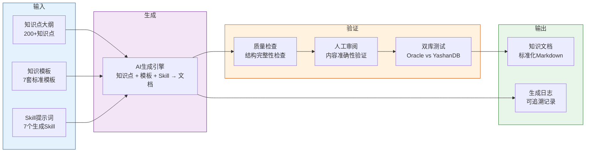
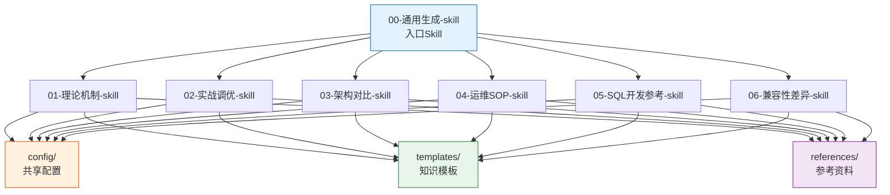

# YashanDB 知识库 Skill 仓库

> **一句话说明**：通过「知识点大纲 + 知识模板 + Skill提示词」的组合，批量生成高质量的 YashanDB 技术文档。

---

## 一、仓库概述

### 1.1 这是什么？

本仓库是一个**完全独立、可完整运行的 Skill 仓库**，用于将数据库知识点大纲中的每个知识点，通过 AI 自动生成标准化的 YashanDB 技术文档。

所有引用的模板、大纲、参考资料均已包含在仓库内部，无需依赖外部文件。

### 1.2 解决什么问题？

| 问题 | 本仓库的解决方式 |
|------|----------------|
| 知识点散落，缺乏体系 | 通过大纲统一规划 200+ 知识点 |
| 文档质量不一 | 通过 7 套标准模板保证结构统一 |
| 每次手写提示词效率低 | 通过 7 个 Skill 文件自动化生成 |
| 生成内容不可信 | 通过质量验证标准 + 双库测试保证准确性 |
| 过程不可追溯 | 通过生成日志记录每次生成的完整信息 |

### 1.3 工作流程



---

## 二、目录结构

```
06-YashanDB知识库Skill仓库/
│
├── README.md                          # 📖 本文件：使用说明
├── CHANGELOG.md                       # 📝 变更记录
│
├── skills/                            # 🧠 Skill定义（核心）
│   ├── 00-通用生成-skill.md           #    入口Skill：类型判断+路由
│   ├── 01-理论机制-skill.md           #    理论机制类生成
│   ├── 02-实战调优-skill.md           #    实战调优类生成
│   ├── 03-架构对比-skill.md           #    架构对比类生成
│   ├── 04-运维SOP-skill.md            #    运维SOP类生成
│   ├── 05-SQL开发参考-skill.md        #    SQL/开发参考类生成
│   └── 06-兼容性差异-skill.md         #    兼容性差异类生成
│
├── config/                            # ⚙️ 共享配置
│   ├── 全局格式规范.md                 #    文档格式约束
│   ├── 质量验证标准.md                 #    质量检查清单
│   └── 资料引用策略.md                 #    参考资料引用规则
│
├── templates/                         # 📐 知识模板（7套）
│   ├── 01-通用基础模板.md
│   ├── 02-理论机制类模板.md
│   ├── 03-实战调优类模板.md
│   ├── 04-架构对比类模板.md
│   ├── 05-运维SOP类模板.md
│   ├── 06-SQL开发参考类模板.md
│   ├── 07-兼容性差异类模板.md
│   ├── 模板设计思路.md
│   └── README.md
│
├── outlines/                          # 📋 知识点大纲
│   ├── 数据库知识点大纲.md             #    200+知识点
│   └── README.md
│
├── references/                        # 📚 参考资料
│   ├── mcp-yashandb-kb/               #    YashanDB知识库MCP配置说明
│   ├── design-docs/                   #    特性设计文档（优先级②）
│   ├── oracle-kb/                     #    Oracle知识库（7篇，优先级③）
│   ├── test-cases/                    #    测试用例（优先级④）
│   ├── source/                        #    源码分析（优先级⑤）
│   └── README.md
│
├── scripts/                           # 🔧 工具脚本
│   └── pre-check-references.sh        #    前置检查：资料引用环境验证
│
├── examples/                          # 📄 示例文档
│   └── 示例-序列兼容性差异.md         #    完整的生成示例
│
├── output/                            # 📦 生成输出
│   ├── README.md
│   ├── 01-基础入门/
│   ├── 02-核心原理/
│   └── ...（共8个子目录）
│
└── logs/                              # 📊 生成日志
    └── README.md
```

---

## 三、前置检查（必须）

> ⚠️ **每次生成文档前，必须先运行前置检查脚本，确认资料引用环境就绪。**

### 3.1 运行检查脚本

```bash
bash scripts/pre-check-references.sh
```

### 3.2 检查内容

| 检查项 | 级别 | 未通过时处理 |
|--------|------|------------|
| YashanDB 知识库 MCP 配置 | 推荐 | 降级到本地资料，文档末尾添加降级警告 |
| `references/` 目录结构 | **必须** | **停止生成**，创建缺失目录 |
| Oracle 知识库文档完整性 | **必须** | **停止生成**，补充缺失文档 |
| 核心配置文件完整性 | **必须** | **停止生成**，补充缺失配置 |
| Skill 文件完整性 | **必须** | **停止生成**，补充缺失 Skill |
| 模板文件完整性 | **必须** | **停止生成**，补充缺失模板 |

### 3.3 资料引用优先级

```
① YashanDB 知识库 MCP（实时查询，推荐配置）
  ↓ 不可用时降级
② 特性设计文档（references/design-docs/）
  ↓ 缺失时降级
③ Oracle知识库（references/oracle-kb/）
  ↓ 缺失时降级
④ 测试用例（references/test-cases/）
  ↓ 缺失时降级
⑤ 源码（references/source/）
```

### 3.4 MCP 配置指南

YashanDB 知识库 MCP 是实时知识查询服务，配置后可获取最新官方文档。配置方法参见 `references/mcp-yashandb-kb/README.md`。

未配置 MCP 时，系统自动降级到本地静态资料，生成的文档会标注警告信息。

---

## 四、快速开始

### 3.1 单篇生成

**步骤1**：运行前置检查

```bash
bash scripts/pre-check-references.sh
```

确认所有必须检查项通过后再继续。

**步骤2**：确定要生成的知识点

从 `outlines/数据库知识点大纲.md` 中选择一个知识点，构造输入 JSON：

```json
{
  "name": "B+树索引原理",
  "part": "第二部分：数据库核心原理",
  "chapter": "2.2 索引原理与实现",
  "description": "B+树索引的结构、特性、插入删除过程、复合索引最左前缀匹配",
  "type": "理论机制"
}
```

**步骤3**：选择 Skill

根据知识类型选择对应的 Skill 文件：

| 知识类型 | Skill文件 | 判断依据 |
|---------|----------|---------|
| 通用基础 | `skills/00-通用生成-skill.md` | 入门概念、基础定义 |
| 理论机制 | `skills/01-理论机制-skill.md` | 内部原理、工作机制 |
| 实战调优 | `skills/02-实战调优-skill.md` | 性能问题、优化方法 |
| 架构对比 | `skills/03-架构对比-skill.md` | 架构设计、方案选型 |
| 运维SOP | `skills/04-运维SOP-skill.md` | 操作规范、部署流程 |
| SQL/开发参考 | `skills/05-SQL开发参考-skill.md` | SQL语法、函数参考 |
| 兼容性差异 | `skills/06-兼容性差异-skill.md` | 与其他数据库差异 |

> 💡 如果不确定类型，使用 `00-通用生成-skill.md`，它会自动判断并路由。

**步骤3**：构造提示词并生成

将 Skill 文件内容 + 知识点 JSON + 模板内容组合为完整提示词，发送给 AI 生成文档。

**步骤4**：质量检查

按 `config/质量验证标准.md` 中的检查清单验证生成的文档。

---

### 3.2 批量生成

**步骤1**：选择要批量生成的章节

例如，批量生成「第一部分：数据库基础入门」的所有知识点。

**步骤2**：提取知识点列表

从 `outlines/数据库知识点大纲.md` 中提取该部分的所有知识点，为每个知识点构造输入 JSON。

**步骤3**：依次生成

对每个知识点，调用对应的 Skill 生成文档，保存到 `output/01-基础入门/` 目录。

**步骤4**：生成汇总报告

在 `logs/` 目录生成批量生成的汇总报告。

---

## 四、使用案例

### 案例1：生成理论机制类文档

**输入知识点**：

```json
{
  "name": "B+树索引原理",
  "part": "第二部分：数据库核心原理",
  "chapter": "2.2 索引原理与实现",
  "description": "B+树索引的结构、特性、插入删除过程",
  "type": "理论机制"
}
```

**使用Skill**：`skills/01-理论机制-skill.md`

**生成输出**：`output/02-核心原理/02-B+树索引原理.md`

**生成内容包含**：
- 核心结构图（Mermaid）
- 工作原理分阶段拆解
- 设计权衡分析
- 可执行的验证SQL

---

### 案例2：生成兼容性差异类文档

**输入知识点**：

```json
{
  "name": "序列（SEQUENCE）兼容性",
  "part": "第一部分：数据库基础入门",
  "chapter": "1.4 SQL基础",
  "description": "YashanDB与Oracle在SEQUENCE语法和行为上的差异",
  "type": "兼容性差异",
  "target_db": "Oracle"
}
```

**使用Skill**：`skills/06-兼容性差异-skill.md`

**生成输出**：`output/01-基础入门/07-序列兼容性.md`

**完整示例**：见 `examples/示例-序列兼容性差异.md`

---

### 案例3：生成运维SOP类文档

**输入知识点**：

```json
{
  "name": "YashanDB数据库备份SOP",
  "part": "第三部分：数据库管理",
  "chapter": "3.4 备份与恢复",
  "description": "YashanDB数据库物理备份和逻辑备份的标准化操作流程",
  "type": "运维SOP",
  "risk_level": "中"
}
```

**使用Skill**：`skills/04-运维SOP-skill.md`

**生成输出**：`output/03-数据库管理/04-数据库备份SOP.md`

**生成内容包含**：
- 前置条件检查清单
- 步骤化操作（命令 + 预期输出 + 验证）
- 回滚方案
- 应急预案

---

## 五、Skill 与模板的对应关系

| Skill | 对应模板 | 模板文件 |
|-------|---------|---------|
| `00-通用生成-skill.md` | 通用基础模板 | `templates/01-通用基础模板.md` |
| `01-理论机制-skill.md` | 理论机制类模板 | `templates/02-理论机制类模板.md` |
| `02-实战调优-skill.md` | 实战调优类模板 | `templates/03-实战调优类模板.md` |
| `03-架构对比-skill.md` | 架构对比类模板 | `templates/04-架构对比类模板.md` |
| `04-运维SOP-skill.md` | 运维SOP类模板 | `templates/05-运维SOP类模板.md` |
| `05-SQL开发参考-skill.md` | SQL/开发参考类模板 | `templates/06-SQL开发参考类模板.md` |
| `06-兼容性差异-skill.md` | 兼容性差异类模板 | `templates/07-兼容性差异类模板.md` |

---

## 六、质量保障

### 6.1 三层质量检查

| 层次 | 检查方式 | 检查内容 | 执行者 |
|------|---------|---------|--------|
| **结构检查** | 自动 | 章节完整性、格式正确性 | AI自检 |
| **内容审阅** | 人工 | 技术准确性、SQL正确性 | DBA/领域专家 |
| **双库验证** | 测试 | Oracle vs YashanDB 执行对比 | 测试环境 |

### 6.2 审阅状态流转


### 6.3 溯源机制

每次生成都会在 `logs/` 目录记录：
- 生成时间、使用的Skill和模板
- 引用的参考资料
- 自检结果
- 输出文件路径

---

## 七、扩展指南

### 7.1 新增Skill

1. 在 `skills/` 目录创建新的 Skill 文件
2. 命名格式：`[序号]-[类型名称]-skill.md`
3. 在 `templates/` 目录添加对应模板
4. 更新 `skills/00-通用生成-skill.md` 中的类型判断表

### 7.2 新增模板

1. 在 `templates/` 创建新模板
2. 更新 `templates/README.md` 中的模板清单
3. 在对应 Skill 中引用新模板

### 7.3 调整知识点大纲

1. 修改 `outlines/数据库知识点大纲.md`
2. 更新 `outlines/README.md` 中的统计信息
3. 重新运行批量生成

---

## 八、内部依赖关系



---

## 九、常见问题

### Q1：如何判断知识点属于哪种类型？

使用 `skills/00-通用生成-skill.md` 中的决策树自动判断，或参考 `outlines/README.md` 中的映射表。

### Q2：生成的文档质量不满意怎么办？

1. 检查引用的参考资料是否充分
2. 调整 Skill 中的生成规则
3. 人工修正后反馈到模板中

### Q3：如何保证生成内容不出现客户信息？

所有 Skill 和模板中都包含编写规范：「不要出现客户名称和特定业务表名」。

### Q4：如何追溯某篇文档的生成过程？

查看 `logs/` 目录中对应日期的日志文件，包含完整的生成信息。

### Q5：本仓库是否依赖外部文件？

**不依赖**。所有模板、大纲、参考资料均已包含在仓库内部，是一个完全独立、可完整运行的目录。

---

## 十、版本信息

- **当前版本**：v1.1.0
- **创建日期**：2026-07-01
- **维护者**：YashanDB 知识库团队
- **变更记录**：见 `CHANGELOG.md`
