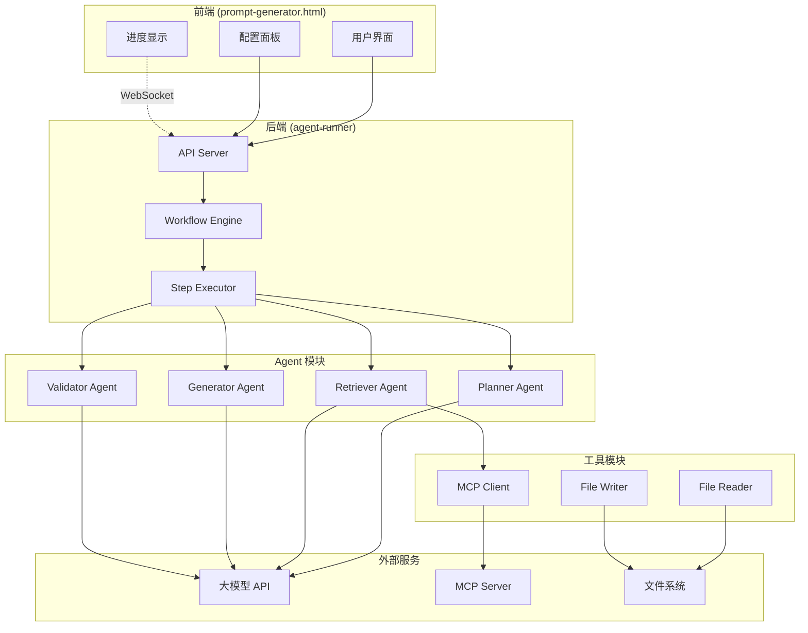
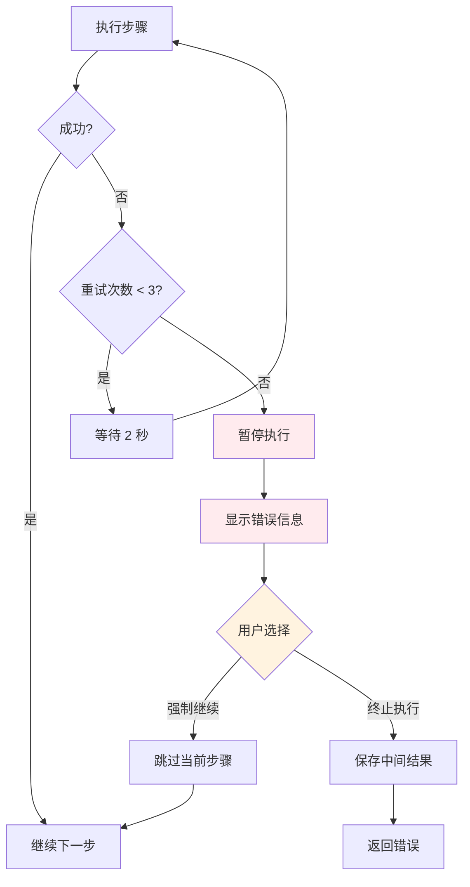
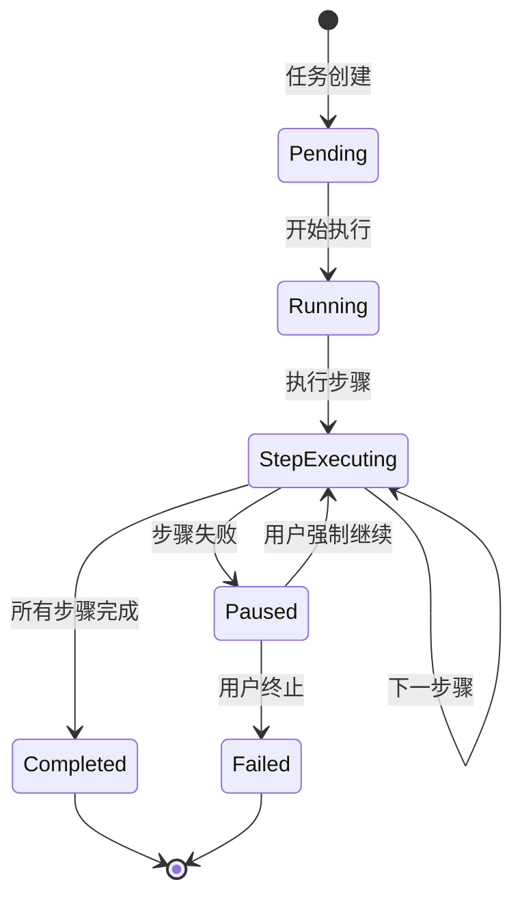
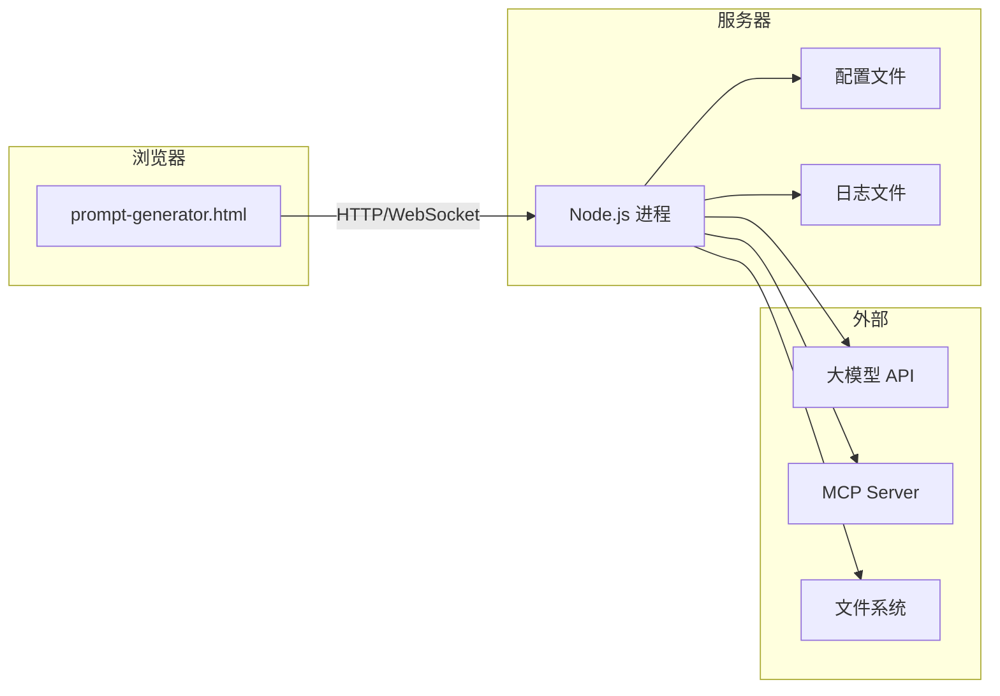

# 系统架构设计文档

## 1. 系统概述

### 1.1 项目目标

构建一个基于 Workflow Agent 的自动化文档生成系统，通过多步骤协作生成高质量的 YashanDB 知识库文档。

### 1.2 核心特性

- **Workflow Agent**：默认4步流程（规划→检索→生成→验证），支持用户自定义步骤
- **数据传递**：Markdown 为主，强规格约束使用 JSON
- **MCP 全局配置**：配置一次，全局共享
- **错误处理**：重试3次，失败后用户可选择强制继续
- **进度反馈**：显示中间结果预览，默认折叠

## 2. 系统架构图



## 3. 模块划分

### 3.1 前端模块

| 模块 | 职责 | 文件 |
|------|------|------|
| 配置面板 | 模型/MCP/Agent 配置 | `prompt-generator.html` |
| 进度显示 | 实时显示执行进度 | `prompt-generator.html` |
| 结果预览 | 显示中间结果（可折叠） | `prompt-generator.html` |

### 3.2 后端模块

| 模块 | 职责 | 文件 |
|------|------|------|
| API Server | HTTP API 接口 | `server.js` |
| Workflow Engine | 工作流编排 | `lib/workflow-engine.js` |
| Step Executor | 步骤执行器 | `lib/step-executor.js` |
| Agent Manager | Agent 管理 | `lib/agent-manager.js` |

### 3.3 Agent 模块

| Agent | 职责 | 输入 | 输出 |
|-------|------|------|------|
| Planner | 规划执行计划 | 知识点信息 | 执行计划 (JSON) |
| Retriever | 检索参考资料 | 执行计划 | 参考资料 (Markdown) |
| Generator | 生成文档内容 | 执行计划 + 参考资料 | 文档草稿 (Markdown) |
| Validator | 验证文档质量 | 文档草稿 | 验证报告 (JSON) + 最终文档 |

### 3.4 工具模块

| 工具 | 职责 |
|------|------|
| MCP Client | 调用 MCP Server 查询知识库 |
| File Reader | 读取参考文档 |
| File Writer | 写入生成的文件 |

## 4. 数据流设计

### 4.1 数据传递格式


| 步骤间传递 | 格式 | 说明 |
|-----------|------|------|
| Planner → Retriever | JSON | 结构化的检索计划 |
| Retriever → Generator | Markdown | 参考资料文档 |
| Generator → Validator | Markdown | 文档草稿 |
| Validator → Output | JSON + Markdown | 验证报告 + 最终文档 |

### 4.2 数据结构定义

#### 执行计划 (Planner 输出)

```json
{
  "knowledge_point": {
    "id": "2.1.2",
    "name": "直接路径插入提示",
    "type": "兼容性差异"
  },
  "document_structure": {
    "sections": ["概述", "语法对比", "示例", "注意事项"]
  },
  "retrieval_plan": {
    "mcp_queries": ["直接路径插入", "INSERT APPEND"],
    "reference_files": ["templates/07-兼容性差异类模板.md"]
  },
  "validation_criteria": {
    "required_sections": ["概述", "语法对比", "示例"],
    "sql_verification": true
  }
}
```

#### 验证报告 (Validator 输出)

```json
{
  "passed": true,
  "score": 95,
  "checks": [
    { "name": "章节完整性", "passed": true },
    { "name": "SQL 语法", "passed": true },
    { "name": "格式规范", "passed": true, "warnings": [] }
  ],
  "suggestions": []
}
```

## 5. 错误处理流程



## 6. 进度反馈设计

### 6.1 进度状态



### 6.2 进度数据结构

```json
{
  "task_id": "abc123",
  "status": "running",
  "progress": 50,
  "current_step": "generator",
  "steps": [
    {
      "name": "planner",
      "status": "completed",
      "duration": 5,
      "output_preview": "执行计划已生成..."
    },
    {
      "name": "retriever",
      "status": "completed",
      "duration": 10,
      "output_preview": "已检索 3 份参考资料..."
    },
    {
      "name": "generator",
      "status": "running",
      "duration": 0,
      "output_preview": null
    },
    {
      "name": "validator",
      "status": "pending",
      "duration": 0,
      "output_preview": null
    }
  ]
}
```

## 7. 技术选型

| 组件 | 技术 | 说明 |
|------|------|------|
| 后端框架 | Express.js | 轻量级 HTTP 框架 |
| WebSocket | Socket.IO | 实时进度推送 |
| 大模型调用 | OpenAI SDK | 支持多家厂商 API |
| 配置存储 | JSON 文件 | 简单可靠 |
| 日志 | Winston | 结构化日志 |
| 加密 | crypto | API Key 加密存储 |

## 8. 部署架构



## 9. 安全设计

1. **API Key 加密**：使用 AES-256 加密存储
2. **CORS 限制**：仅允许 localhost 访问
3. **频率限制**：每分钟最多 10 次执行
4. **输入验证**：所有 API 输入进行校验

## 10. 扩展性设计

1. **自定义步骤**：用户可配置 Workflow 步骤
2. **插件机制**：支持添加新的 Agent 和工具
3. **多模型支持**：每个步骤可使用不同模型

## 11. 前端界面布局设计

### 11.1 整体布局

前端采用经典的左右两栏布局，左侧为导航区，右侧为内容区。

```
┌─────────────────────────────────────────────────────────────┐
│  Header（顶部导航栏）                                        │
│  [标题] [连接状态] [文档] [配置] [批量模式] [主题]             │
├──────────────┬──────────────────────────────────────────────┤
│              │                                              │
│  Sidebar     │  Main Content（右侧主内容区）                  │
│  （左侧导航） │                                              │
│              │  ┌────────────────────────────────────────┐  │
│  [搜索框]    │  │  ① 知识点信息                           │  │
│  [上传文档]  │  │  - 知识点名称                           │  │
│              │  │  - 知识类型                             │  │
│  [知识点树]  │  │  - 所属部分/章节                        │  │
│  - 数据库    │  │  - 知识点描述                           │  │
│  - 业务领域  │  │  - 目标数据库                           │  │
│  - 上传文档  │  │  - 难度级别                             │  │
│              │  └────────────────────────────────────────┘  │
│  [已上传文档]│                                              │
│  - 📋 大纲   │  ┌────────────────────────────────────────┐  │
│  - 📄 文档   │  │  ② 执行方案选择                         │  │
│              │  │  - 默认工作流                           │  │
│              │  │  - 自定义工作流                         │  │
│              │  └────────────────────────────────────────┘  │
│              │                                              │
│              │  ┌────────────────────────────────────────┐  │
│              │  │  ③ 参考资料配置                         │  │
│              │  │  - MCP 查询关键词                       │  │
│              │  │  - Oracle 知识库文档                    │  │
│              │  │  - 特性设计文档路径                     │  │
│              │  └────────────────────────────────────────┘  │
│              │                                              │
│              │  ┌────────────────────────────────────────┐  │
│              │  │  ④ 生成结果                             │  │
│              │  │  [👁️ 查看] [✏️ 编辑] [🎨 预览]          │  │
│              │  │  - 提示词内容                           │  │
│              │  │  - 复制/下载按钮                        │  │
│              │  └────────────────────────────────────────┘  │
│              │                                              │
└──────────────┴──────────────────────────────────────────────┘
```

### 11.2 左侧导航区（Sidebar）

**功能模块：**

1. **搜索框**：快速搜索知识点
2. **上传文档**：统一上传入口，自动识别大纲/文档格式
3. **知识点树**：三级树形结构展示知识点
   - 数据库基础（内置）
   - 业务领域（内置）
   - 上传文档（动态加载）
4. **已上传文档管理**：显示已上传的大纲和文档，支持删除和生成提示词

**HTML 结构：**

```html
<div class="sidebar">
  <div class="sidebar-search">
    <input type="text" placeholder="搜索知识点...">
    <button>📤 上传文档</button>
  </div>
  <div id="treeContainer"></div>
  <div class="outline-management">
    <div class="outline-management-title">📋 已上传文档</div>
    <div id="outlineManagementList"></div>
  </div>
</div>
```

### 11.3 右侧内容区（Main）

**功能模块：**

1. **① 知识点信息**：填写知识点基本信息
   - 知识点名称
   - 知识类型（自动判断）
   - 所属部分/章节
   - 知识点描述
   - 目标数据库
   - 难度级别

2. **② 执行方案选择**：选择工作流
   - 默认工作流
   - 自定义工作流

3. **③ 参考资料配置**：配置参考资料
   - MCP 查询关键词
   - Oracle 知识库文档
   - 特性设计文档路径

4. **④ 生成结果**：显示生成的提示词
   - 三种编辑模式：查看、编辑、预览
   - 复制/下载按钮

**HTML 结构：**

```html
<div class="main">
  <div class="card">① 知识点信息</div>
  <div class="card">② 执行方案选择</div>
  <div class="card">③ 参考资料配置</div>
  <div class="card">④ 生成结果</div>
</div>
```

### 11.4 生成结果编辑模式

生成结果支持三种编辑模式：

| 模式 | 图标 | 说明 | 编辑方式 |
|------|------|------|---------|
| 查看模式 | 👁️ | 只读查看 Markdown 源码 | 不可编辑 |
| 编辑模式 | ✏️ | 直接编辑 Markdown 源码 | textarea 编辑 |
| 预览模式 | 🎨 | 渲染后的 HTML 预览 | contenteditable 编辑 |

**模式切换流程：**

```
查看模式 ←→ 编辑模式（textarea）
查看模式 ←→ 预览模式（contenteditable HTML）
编辑模式 ←→ 预览模式（需要 Markdown ↔ HTML 转换）
```

**技术实现：**

- `marked.js`：Markdown → HTML
- `turndown.js`：HTML → Markdown
- `contenteditable`：预览模式可编辑

### 11.5 响应式设计

- 移动端自动隐藏左侧导航栏
- 导航栏可通过按钮展开/收起

### 11.6 CSS 样式

```css
/* 布局容器 */
.app { display: flex; flex-direction: column; min-height: 100vh; }
.sidebar { width: 280px; border-right: 1px solid var(--border); overflow-y: auto; }
.main { flex: 1; overflow-y: auto; padding: 24px; }

/* 卡片样式 */
.card { background: var(--card-bg); border: 1px solid var(--border); border-radius: var(--radius); padding: 20px; margin-bottom: 16px; }
.card-title { font-size: 15px; font-weight: 600; margin-bottom: 14px; }

/* 编辑模式按钮 */
.output-mode-btn { padding: 6px 12px; border: 1px solid var(--border); background: var(--bg); cursor: pointer; }
.output-mode-btn.active { background: var(--primary); color: white; }
```

