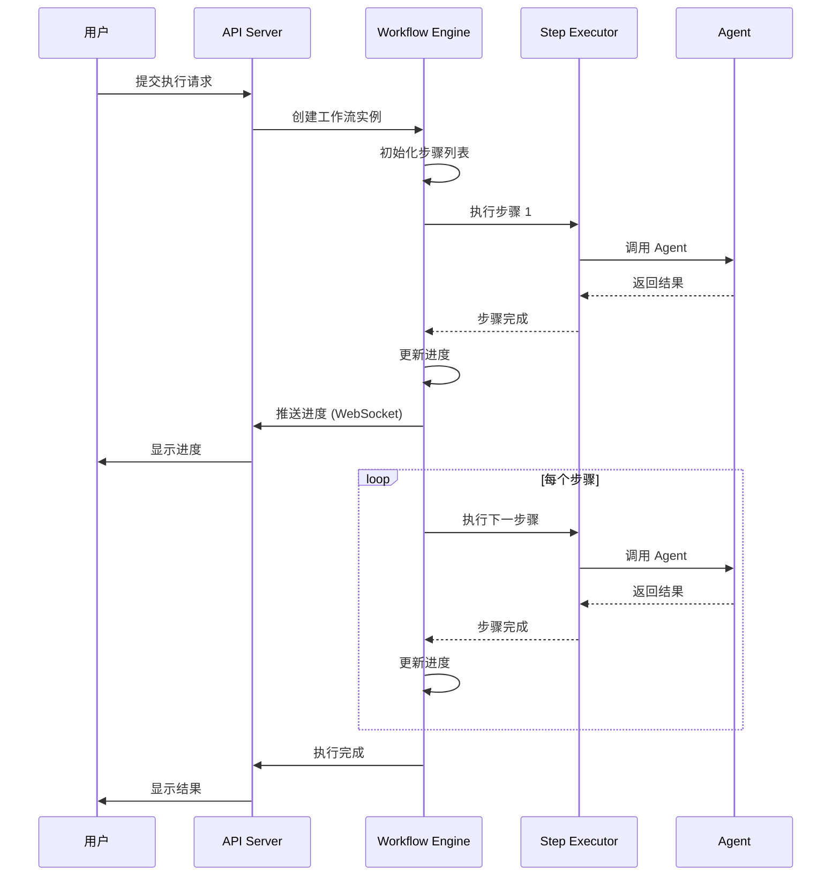
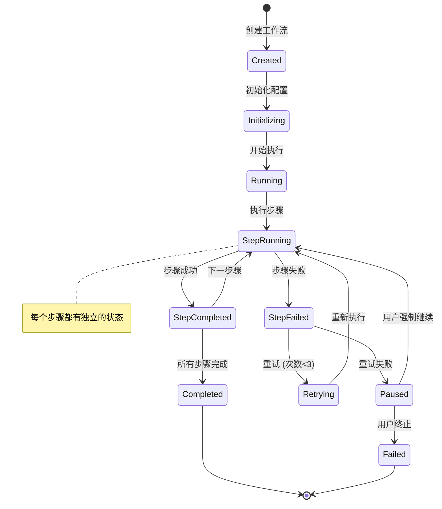
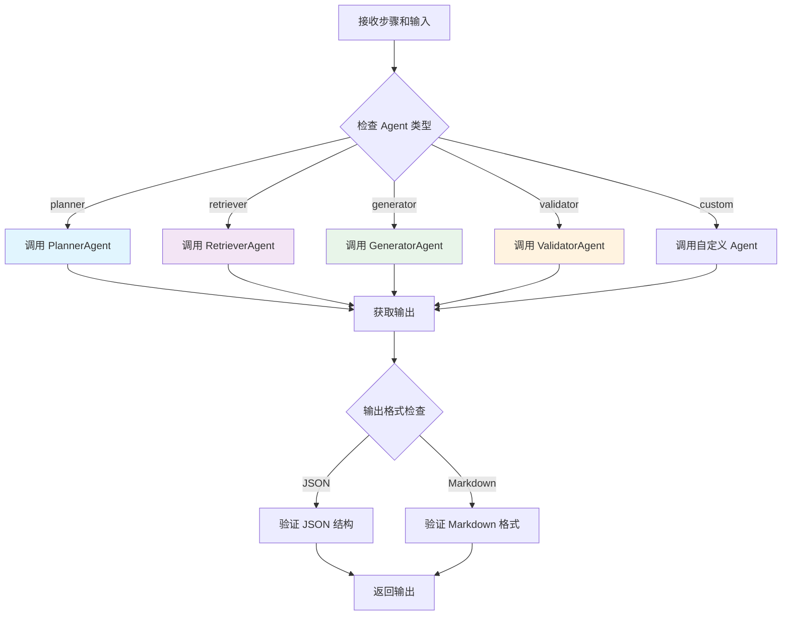
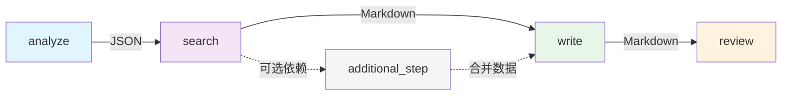

# Workflow 引擎设计文档

## 1. 概述

Workflow 引擎是整个系统的核心组件，负责编排和执行多步骤的文档生成流程。

## 2. 核心职责

1. **工作流编排**：管理步骤的执行顺序和依赖关系
2. **状态管理**：跟踪每个步骤的执行状态
3. **数据传递**：在步骤间传递数据（Markdown/JSON）
4. **错误处理**：重试机制和用户干预
5. **进度反馈**：实时推送执行进度

## 3. 工作流生命周期



## 4. 工作流状态机



## 5. 核心类设计

### 5.1 WorkflowEngine 类

```javascript
class WorkflowEngine {
    constructor(config) {
        this.config = config;
        this.workflows = new Map(); // task_id -> WorkflowInstance
        this.stepExecutor = new StepExecutor(config);
    }
    
    /**
     * 创建工作流实例
     */
    async createWorkflow(params) {
        const taskId = generateTaskId();
        const workflow = new WorkflowInstance({
            taskId,
            steps: params.steps || this.getDefaultSteps(),
            inputData: params.inputData,
            config: params.config
        });
        
        this.workflows.set(taskId, workflow);
        return taskId;
    }
    
    /**
     * 启动工作流
     */
    async startWorkflow(taskId) {
        const workflow = this.workflows.get(taskId);
        if (!workflow) throw new Error('Workflow not found');
        
        workflow.status = 'running';
        this.executeWorkflow(workflow);
    }
    
    /**
     * 执行工作流
     */
    async executeWorkflow(workflow) {
        try {
            for (let i = 0; i < workflow.steps.length; i++) {
                const step = workflow.steps[i];
                workflow.currentStepIndex = i;
                
                // 获取上一步的输出
                const previousOutput = i > 0 
                    ? workflow.steps[i - 1].output 
                    : workflow.inputData;
                
                // 执行步骤（带重试）
                await this.executeStepWithRetry(workflow, step, previousOutput);
                
                // 更新进度
                this.emitProgress(workflow);
            }
            
            workflow.status = 'completed';
            this.emitProgress(workflow);
            
        } catch (error) {
            workflow.status = 'failed';
            workflow.error = error.message;
            this.emitProgress(workflow);
        }
    }
    
    /**
     * 执行步骤（带重试）
     */
    async executeStepWithRetry(workflow, step, input) {
        const maxRetries = 3;
        let lastError;
        
        for (let attempt = 1; attempt <= maxRetries; attempt++) {
            try {
                step.status = 'running';
                step.attempt = attempt;
                this.emitProgress(workflow);
                
                const output = await this.stepExecutor.execute(step, input);
                
                step.status = 'completed';
                step.output = output;
                step.duration = Date.now() - step.startTime;
                return output;
                
            } catch (error) {
                lastError = error;
                console.error(`Step ${step.name} failed (attempt ${attempt}):`, error);
                
                if (attempt < maxRetries) {
                    step.status = 'retrying';
                    this.emitProgress(workflow);
                    await sleep(2000); // 等待 2 秒后重试
                }
            }
        }
        
        // 重试失败，暂停等待用户决策
        step.status = 'failed';
        step.error = lastError.message;
        workflow.status = 'paused';
        
        // 等待用户决策
        await this.waitForUserDecision(workflow, step);
    }
    
    /**
     * 等待用户决策
     */
    async waitForUserDecision(workflow, step) {
        return new Promise((resolve, reject) => {
            workflow.pendingDecision = {
                step,
                resolve,
                reject,
                timeout: setTimeout(() => {
                    reject(new Error('User decision timeout'));
                }, 300000) // 5 分钟超时
            };
            
            this.emitProgress(workflow);
        });
    }
    
    /**
     * 用户强制继续
     */
    async forceContinue(taskId) {
        const workflow = this.workflows.get(taskId);
        if (!workflow || !workflow.pendingDecision) {
            throw new Error('No pending decision');
        }
        
        const { resolve, timeout } = workflow.pendingDecision;
        clearTimeout(timeout);
        
        // 跳过当前步骤，使用空输出
        const step = workflow.pendingDecision.step;
        step.output = this.createEmptyOutput(step);
        step.skipped = true;
        
        workflow.status = 'running';
        delete workflow.pendingDecision;
        
        resolve();
    }
    
    /**
     * 用户终止执行
     */
    async terminateWorkflow(taskId) {
        const workflow = this.workflows.get(taskId);
        if (!workflow) return;
        
        if (workflow.pendingDecision) {
            const { reject, timeout } = workflow.pendingDecision;
            clearTimeout(timeout);
            reject(new Error('User terminated'));
        }
        
        workflow.status = 'failed';
        workflow.error = 'User terminated';
    }
    
    /**
     * 获取默认步骤
     */
    getDefaultSteps() {
        return [
            { name: 'planner', agent: 'planner', config: {} },
            { name: 'retriever', agent: 'retriever', config: {} },
            { name: 'generator', agent: 'generator', config: {} },
            { name: 'validator', agent: 'validator', config: {} }
        ];
    }
    
    /**
     * 发送进度更新
     */
    emitProgress(workflow) {
        const progress = this.buildProgressData(workflow);
        // 通过 WebSocket 推送给前端
        if (this.io) {
            this.io.to(workflow.taskId).emit('progress', progress);
        }
    }
    
    /**
     * 构建进度数据
     */
    buildProgressData(workflow) {
        const completedSteps = workflow.steps.filter(s => s.status === 'completed').length;
        const progress = (completedSteps / workflow.steps.length) * 100;
        
        return {
            task_id: workflow.taskId,
            status: workflow.status,
            progress: Math.round(progress),
            current_step: workflow.steps[workflow.currentStepIndex]?.name,
            steps: workflow.steps.map(step => ({
                name: step.name,
                status: step.status,
                duration: step.duration || 0,
                attempt: step.attempt || 0,
                output_preview: step.output ? this.generatePreview(step.output) : null,
                error: step.error || null,
                skipped: step.skipped || false
            })),
            error: workflow.error || null
        };
    }
    
    /**
     * 生成输出预览
     */
    generatePreview(output) {
        if (typeof output === 'string') {
            return output.substring(0, 200) + (output.length > 200 ? '...' : '');
        }
        if (typeof output === 'object') {
            return JSON.stringify(output).substring(0, 200) + '...';
        }
        return String(output);
    }
}
```

### 5.2 WorkflowInstance 类

```javascript
class WorkflowInstance {
    constructor(params) {
        this.taskId = params.taskId;
        this.steps = params.steps.map(step => ({
            ...step,
            status: 'pending',
            startTime: null,
            duration: 0,
            output: null,
            error: null,
            attempt: 0,
            skipped: false
        }));
        this.inputData = params.inputData;
        this.config = params.config;
        
        this.status = 'created';
        this.currentStepIndex = -1;
        this.error = null;
        this.pendingDecision = null;
        
        this.createdAt = Date.now();
        this.startedAt = null;
        this.completedAt = null;
    }
    
    getProgress() {
        const completed = this.steps.filter(s => s.status === 'completed').length;
        return Math.round((completed / this.steps.length) * 100);
    }
    
    getCurrentStep() {
        return this.steps[this.currentStepIndex];
    }
    
    getOutput() {
        const lastStep = this.steps[this.steps.length - 1];
        return lastStep?.output;
    }
}
```

## 6. 步骤执行器设计

### 6.1 StepExecutor 类



```javascript
class StepExecutor {
    constructor(config) {
        this.config = config;
        this.agentManager = new AgentManager(config);
    }
    
    async execute(step, input) {
        const startTime = Date.now();
        
        // 获取 Agent 实例
        const agent = this.agentManager.getAgent(step.agent);
        
        // 准备 Agent 输入
        const agentInput = this.prepareAgentInput(step, input);
        
        // 调用 Agent
        const output = await agent.execute(agentInput, step.config);
        
        // 验证输出格式
        this.validateOutput(step, output);
        
        return output;
    }
    
    prepareAgentInput(step, previousOutput) {
        // 根据步骤类型准备输入
        switch (step.agent) {
            case 'planner':
                return {
                    knowledgePoint: previousOutput.knowledgePoint,
                    template: previousOutput.template
                };
                
            case 'retriever':
                return {
                    executionPlan: previousOutput, // JSON from planner
                    mcpConfig: this.config.mcp
                };
                
            case 'generator':
                return {
                    executionPlan: previousOutput.executionPlan,
                    references: previousOutput.references // Markdown from retriever
                };
                
            case 'validator':
                return {
                    document: previousOutput, // Markdown from generator
                    validationCriteria: previousOutput.validationCriteria
                };
                
            default:
                return previousOutput;
        }
    }
    
    validateOutput(step, output) {
        // 根据步骤验证输出格式
        const expectedFormat = this.getExpectedFormat(step.agent);
        
        if (expectedFormat === 'json') {
            if (typeof output !== 'object') {
                throw new Error(`Expected JSON output from ${step.agent}`);
            }
        } else if (expectedFormat === 'markdown') {
            if (typeof output !== 'string') {
                throw new Error(`Expected Markdown output from ${step.agent}`);
            }
        }
    }
    
    getExpectedFormat(agentType) {
        const formatMap = {
            'planner': 'json',
            'retriever': 'markdown',
            'generator': 'markdown',
            'validator': 'json'
        };
        return formatMap[agentType] || 'markdown';
    }
}
```

## 7. 自定义工作流

### 7.1 工作流配置格式

```json
{
  "name": "自定义文档生成流程",
  "description": "用户自定义的 Workflow 配置",
  "steps": [
    {
      "name": "analyze",
      "agent": "planner",
      "config": {
        "model": "gpt-4",
        "temperature": 0.3
      }
    },
    {
      "name": "search",
      "agent": "retriever",
      "config": {
        "model": "gpt-3.5-turbo",
        "max_results": 5
      }
    },
    {
      "name": "write",
      "agent": "generator",
      "config": {
        "model": "gpt-4",
        "temperature": 0.7
      }
    },
    {
      "name": "review",
      "agent": "validator",
      "config": {
        "model": "gpt-4",
        "strict_mode": true
      }
    }
  ],
  "global_config": {
    "retry_count": 3,
    "timeout": 300000
  }
}
```

### 7.2 步骤依赖关系



## 8. 并发控制

### 8.1 任务队列

```javascript
class TaskQueue {
    constructor(maxConcurrent = 3) {
        this.maxConcurrent = maxConcurrent;
        this.running = 0;
        this.queue = [];
    }
    
    async enqueue(task) {
        return new Promise((resolve, reject) => {
            this.queue.push({ task, resolve, reject });
            this.processQueue();
        });
    }
    
    async processQueue() {
        while (this.running < this.maxConcurrent && this.queue.length > 0) {
            const { task, resolve, reject } = this.queue.shift();
            this.running++;
            
            try {
                const result = await task();
                resolve(result);
            } catch (error) {
                reject(error);
            } finally {
                this.running--;
                this.processQueue();
            }
        }
    }
}
```

## 9. 日志记录

```javascript
class WorkflowLogger {
    constructor(taskId) {
        this.taskId = taskId;
        this.logs = [];
    }
    
    log(level, message, data = {}) {
        const entry = {
            timestamp: new Date().toISOString(),
            level,
            message,
            data
        };
        this.logs.push(entry);
        console.log(`[${this.taskId}] ${level}: ${message}`, data);
    }
    
    getLogs() {
        return this.logs;
    }
    
    saveToFile(filepath) {
        fs.writeFileSync(filepath, JSON.stringify(this.logs, null, 2));
    }
}
```

## 10. 性能优化

1. **步骤并行化**：无依赖的步骤可以并行执行
2. **缓存机制**：相同输入的 Agent 结果可以缓存
3. **流式输出**：大文档可以流式生成和传输
4. **连接池**：复用 HTTP 连接调用大模型 API

## 11. 监控指标

| 指标 | 说明 |
|------|------|
| 任务总数 | 创建的工作流数量 |
| 成功率 | 成功完成的任务比例 |
| 平均耗时 | 任务平均执行时间 |
| 步骤耗时分布 | 每个步骤的耗时统计 |
| 重试次数 | 步骤重试的总次数 |
| Token 消耗 | 大模型 API 的 Token 使用量 |
