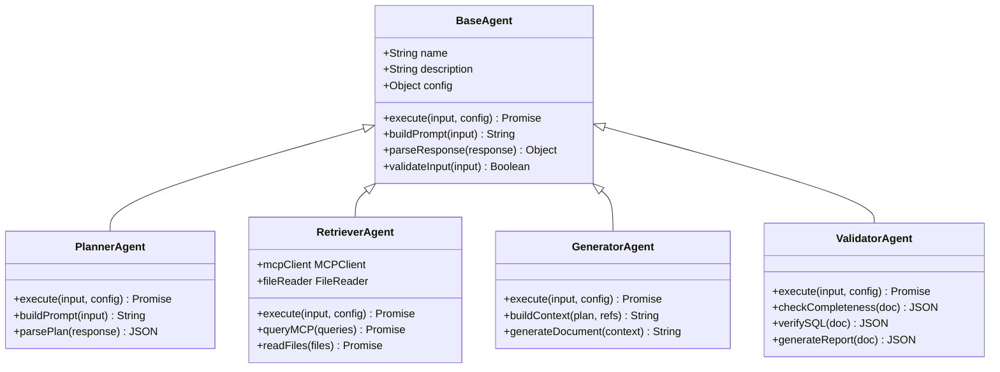
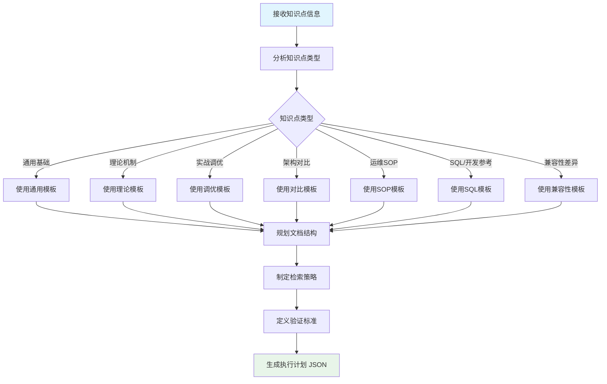
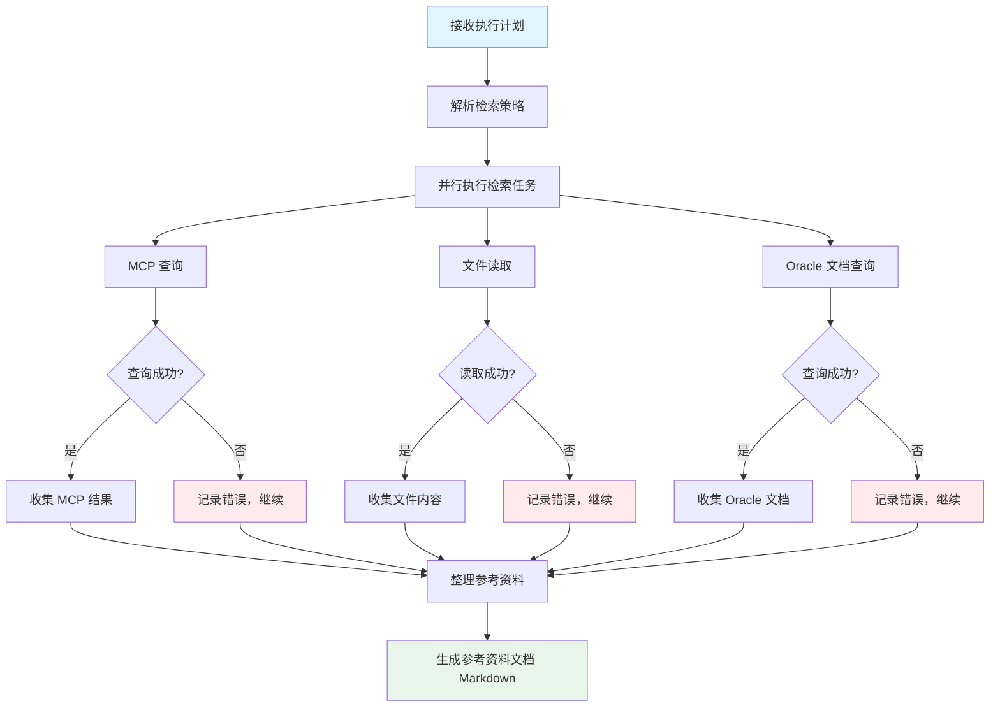
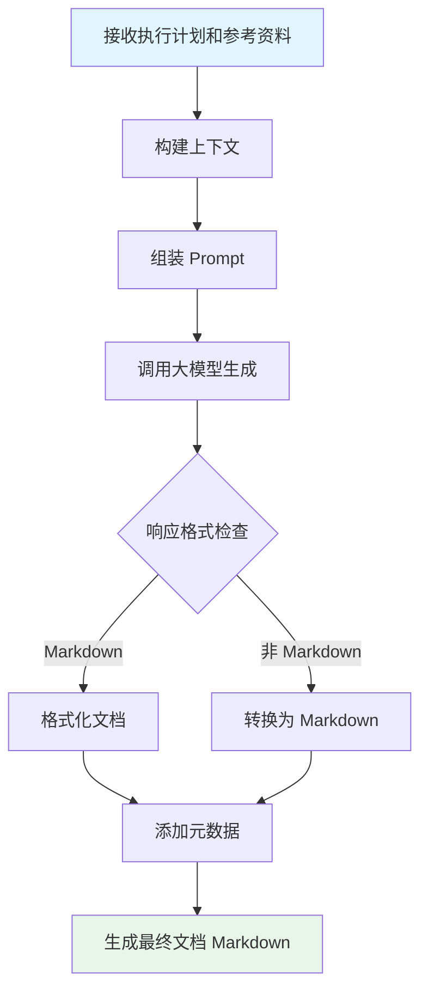
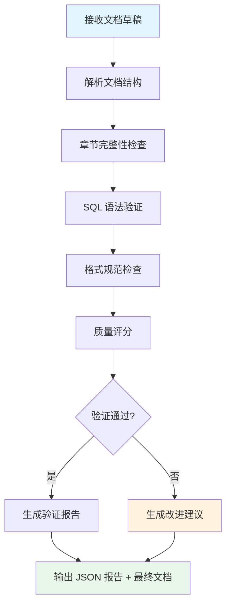

# Agent 模块设计文档

## 1. 概述

Agent 模块是 Workflow 的核心执行单元，每个 Agent 负责完成特定的任务。系统包含 4 个默认 Agent：

| Agent | 职责 | 输入格式 | 输出格式 |
|-------|------|----------|----------|
| Planner | 规划执行计划 | 知识点信息 | JSON |
| Retriever | 检索参考资料 | 执行计划 | Markdown |
| Generator | 生成文档内容 | 计划+资料 | Markdown |
| Validator | 验证文档质量 | 文档草稿 | JSON+Markdown |

## 2. Agent 基类设计



### 2.1 BaseAgent 实现

```javascript
class BaseAgent {
    constructor(name, description, config = {}) {
        this.name = name;
        this.description = description;
        this.config = config;
        this.llmClient = new LLMClient(config);
    }
    
    async execute(input, stepConfig = {}) {
        // 1. 验证输入
        if (!this.validateInput(input)) {
            throw new Error(`Invalid input for ${this.name}`);
        }
        
        // 2. 构建提示词
        const prompt = this.buildPrompt(input, stepConfig);
        
        // 3. 调用大模型
        const response = await this.llmClient.chat({
            model: stepConfig.model || this.config.model,
            messages: prompt,
            temperature: stepConfig.temperature || this.config.temperature || 0.7,
            max_tokens: stepConfig.max_tokens || this.config.max_tokens || 4000
        });
        
        // 4. 解析响应
        const output = this.parseResponse(response);
        
        // 5. 验证输出
        this.validateOutput(output);
        
        return output;
    }
    
    validateInput(input) {
        // 子类实现具体验证逻辑
        return true;
    }
    
    validateOutput(output) {
        // 子类实现具体验证逻辑
        return true;
    }
    
    buildPrompt(input, config) {
        throw new Error('buildPrompt must be implemented by subclass');
    }
    
    parseResponse(response) {
        throw new Error('parseResponse must be implemented by subclass');
    }
}
```

## 3. Planner Agent 设计

### 3.1 职责

分析知识点信息，生成结构化的执行计划，包括：
- 文档结构规划
- 检索策略制定
- 验证标准定义

### 3.2 执行流程



### 3.3 输入格式

```json
{
  "knowledgePoint": {
    "id": "2.1.2",
    "name": "直接路径插入提示",
    "type": "兼容性差异",
    "description": "直接路径插入提示：`/*+ APPEND */` → 目标库批量加载方式",
    "part": "业务领域 - 第1部分：兼容性领域",
    "chapter": "2 DML 兼容性"
  },
  "template": "templates/07-兼容性差异类模板.md"
}
```

### 3.4 输出格式

```json
{
  "knowledge_point": {
    "id": "2.1.2",
    "name": "直接路径插入提示",
    "type": "兼容性差异",
    "target_db": "Oracle"
  },
  "document_structure": {
    "title": "直接路径插入提示 - Oracle 与 YashanDB 兼容性分析",
    "sections": [
      {
        "name": "概述",
        "description": "功能简介和使用场景",
        "required": true
      },
      {
        "name": "Oracle 语法",
        "description": "Oracle 中的实现方式",
        "required": true
      },
      {
        "name": "YashanDB 语法",
        "description": "YashanDB 中的对应实现",
        "required": true
      },
      {
        "name": "差异对比",
        "description": "两者的主要差异点",
        "required": true
      },
      {
        "name": "迁移建议",
        "description": "从 Oracle 迁移到 YashanDB 的建议",
        "required": true
      },
      {
        "name": "示例",
        "description": "SQL 示例代码",
        "required": true
      }
    ]
  },
  "retrieval_plan": {
    "mcp_queries": [
      "直接路径插入",
      "INSERT APPEND 提示",
      "批量加载优化"
    ],
    "reference_files": [
      "templates/07-兼容性差异类模板.md",
      "examples/示例-序列兼容性差异.md"
    ],
    "oracle_docs": [
      "Oracle INSERT 语句文档"
    ]
  },
  "validation_criteria": {
    "required_sections": ["概述", "Oracle 语法", "YashanDB 语法", "差异对比", "迁移建议", "示例"],
    "sql_verification": true,
    "min_length": 1000,
    "max_length": 5000
  },
  "estimated_complexity": "medium"
}
```

### 3.5 Prompt 模板

```markdown
# 任务：文档生成规划

## 知识点信息
- ID: {{knowledgePoint.id}}
- 名称: {{knowledgePoint.name}}
- 类型: {{knowledgePoint.type}}
- 描述: {{knowledgePoint.description}}

## 模板要求
请参考模板：{{template}}

## 输出要求
请生成一个 JSON 格式的执行计划，包含以下字段：

1. `knowledge_point`: 知识点基本信息
2. `document_structure`: 文档结构规划（章节列表）
3. `retrieval_plan`: 检索策略（MCP 查询关键词、参考文件列表）
4. `validation_criteria`: 验证标准（必填章节、SQL 验证等）
5. `estimated_complexity`: 预估复杂度（low/medium/high）

请确保：
- 文档结构完整，覆盖所有必要内容
- 检索关键词精准，能获取相关参考资料
- 验证标准明确，可量化检查
```

## 4. Retriever Agent 设计

### 4.1 职责

根据执行计划检索参考资料：
- 查询 MCP 知识库
- 读取参考文档
- 整理参考资料

### 4.2 执行流程



### 4.3 输入格式

```json
{
  "executionPlan": {
    "retrieval_plan": {
      "mcp_queries": ["直接路径插入", "INSERT APPEND"],
      "reference_files": ["templates/07-兼容性差异类模板.md"],
      "oracle_docs": ["Oracle INSERT 语句文档"]
    }
  },
  "mcpConfig": {
    "server_url": "http://localhost:8080",
    "api_key": "***"
  }
}
```

### 4.4 输出格式（Markdown）

```markdown
# 参考资料汇总

## 1. MCP 知识库查询结果

### 1.1 直接路径插入
> 直接路径插入（Direct Path Insert）是一种高性能的数据加载方式...

### 1.2 INSERT APPEND 提示
> /*+ APPEND */ 提示告诉优化器使用直接路径插入...

## 2. 参考文档

### 2.1 兼容性差异类模板
> 模板内容...

## 3. Oracle 文档

### 3.1 Oracle INSERT 语句
> Oracle 文档内容...

## 4. 关键信息摘要

- 直接路径插入的核心机制
- Oracle 与 YashanDB 的主要差异点
- 迁移时需要注意的事项
```

### 4.5 核心实现

```javascript
class RetrieverAgent extends BaseAgent {
    constructor(config) {
        super('retriever', '检索参考资料', config);
        this.mcpClient = new MCPClient(config.mcp);
        this.fileReader = new FileReader();
    }
    
    async execute(input, stepConfig = {}) {
        const plan = input.executionPlan.retrieval_plan;
        const results = {
            mcp: [],
            files: [],
            oracle: [],
            errors: []
        };
        
        // 并行执行检索任务
        const tasks = [
            this.queryMCP(plan.mcp_queries, results),
            this.readFiles(plan.reference_files, results),
            this.queryOracleDocs(plan.oracle_docs, results)
        ];
        
        await Promise.allSettled(tasks);
        
        // 生成参考资料文档
        return this.generateReferencesDoc(results);
    }
    
    async queryMCP(queries, results) {
        for (const query of queries) {
            try {
                const response = await this.mcpClient.query(query);
                results.mcp.push({ query, data: response });
            } catch (error) {
                results.errors.push({
                    type: 'mcp',
                    query,
                    error: error.message
                });
            }
        }
    }
    
    async readFiles(files, results) {
        for (const file of files) {
            try {
                const content = await this.fileReader.read(file);
                results.files.push({ file, content });
            } catch (error) {
                results.errors.push({
                    type: 'file',
                    file,
                    error: error.message
                });
            }
        }
    }
    
    generateReferencesDoc(results) {
        let doc = '# 参考资料汇总\n\n';
        
        // MCP 结果
        if (results.mcp.length > 0) {
            doc += '## 1. MCP 知识库查询结果\n\n';
            results.mcp.forEach((item, i) => {
                doc += `### 1.${i + 1} ${item.query}\n`;
                doc += `> ${item.data.content}\n\n`;
            });
        }
        
        // 文件内容
        if (results.files.length > 0) {
            doc += '## 2. 参考文档\n\n';
            results.files.forEach((item, i) => {
                doc += `### 2.${i + 1} ${item.file}\n`;
                doc += item.content + '\n\n';
            });
        }
        
        // 错误记录
        if (results.errors.length > 0) {
            doc += '## 检索错误\n\n';
            results.errors.forEach(err => {
                doc += `- [${err.type}] ${err.query || err.file}: ${err.error}\n`;
            });
        }
        
        return doc;
    }
}
```

## 5. Generator Agent 设计

### 5.1 职责

根据执行计划和参考资料生成完整的文档内容。

### 5.2 执行流程



### 5.3 输入格式

```json
{
  "executionPlan": {
    "knowledge_point": {...},
    "document_structure": {...}
  },
  "references": "# 参考资料汇总\n\n..."
}
```

### 5.4 输出格式（Markdown）

```markdown
---
title: 直接路径插入提示 - Oracle 与 YashanDB 兼容性分析
id: 2.1.2
type: 兼容性差异
author: AI Generator
date: 2024-01-01
version: 1.0
---

# 直接路径插入提示 - Oracle 与 YashanDB 兼容性分析

## 概述

直接路径插入（Direct Path Insert）是一种高性能的数据加载方式...

## Oracle 语法

在 Oracle 中，使用 `/*+ APPEND */` 提示...

```sql
INSERT /*+ APPEND */ INTO target_table
SELECT * FROM source_table;
```

## YashanDB 语法

在 YashanDB 中，对应的实现方式...

```sql
-- YashanDB 语法
INSERT INTO target_table
SELECT * FROM source_table;
```

## 差异对比

| 特性 | Oracle | YashanDB |
|------|--------|----------|
| 语法 | /*+ APPEND */ | 自动优化 |
| ... | ... | ... |

## 迁移建议

1. 移除 `/*+ APPEND */` 提示
2. ...

## 示例

### 示例 1：基本用法

```sql
-- Oracle
INSERT /*+ APPEND */ INTO employees
SELECT * FROM temp_employees;

-- YashanDB
INSERT INTO employees
SELECT * FROM temp_employees;
```
```

### 5.5 Prompt 模板

```markdown
# 任务：生成知识库文档

## 知识点信息
- ID: {{executionPlan.knowledge_point.id}}
- 名称: {{executionPlan.knowledge_point.name}}
- 类型: {{executionPlan.knowledge_point.type}}

## 文档结构要求
{{executionPlan.document_structure.sections}}

## 参考资料
{{references}}

## 输出要求
请生成完整的 Markdown 格式文档，包含：

1. YAML 元数据头（title, id, type, author, date, version）
2. 按照文档结构要求组织内容
3. 包含可执行的 SQL 示例
4. 包含必要的对比表格
5. 语言准确、专业

请确保文档内容完整、准确，符合知识库文档规范。
```

## 6. Validator Agent 设计

### 6.1 职责

验证生成的文档质量，包括：
- 章节完整性检查
- SQL 语法验证
- 格式规范检查
- 质量评分

### 6.2 执行流程



### 6.3 输入格式

```json
{
  "document": "# 直接路径插入提示...",
  "validationCriteria": {
    "required_sections": ["概述", "Oracle 语法", "YashanDB 语法"],
    "sql_verification": true,
    "min_length": 1000
  }
}
```

### 6.4 输出格式

```json
{
  "passed": true,
  "score": 95,
  "checks": [
    {
      "name": "章节完整性",
      "passed": true,
      "details": "所有必填章节均已包含"
    },
    {
      "name": "SQL 语法",
      "passed": true,
      "details": "共 3 个 SQL 示例，语法正确"
    },
    {
      "name": "格式规范",
      "passed": true,
      "details": "YAML 元数据完整，标题层级正确"
    },
    {
      "name": "内容长度",
      "passed": true,
      "details": "文档长度 2340 字，符合要求"
    }
  ],
  "warnings": [
    "建议在"迁移建议"章节添加更多注意事项"
  ],
  "suggestions": [
    "可以添加性能对比数据"
  ],
  "final_document": "# 直接路径插入提示..."
}
```

### 6.5 核心实现

```javascript
class ValidatorAgent extends BaseAgent {
    constructor(config) {
        super('validator', '验证文档质量', config);
    }
    
    async execute(input, stepConfig = {}) {
        const doc = input.document;
        const criteria = input.validationCriteria;
        
        // 执行各项检查
        const checks = [];
        
        // 1. 章节完整性检查
        checks.push(this.checkCompleteness(doc, criteria));
        
        // 2. SQL 语法验证
        if (criteria.sql_verification) {
            checks.push(this.verifySQL(doc));
        }
        
        // 3. 格式规范检查
        checks.push(this.checkFormat(doc));
        
        // 4. 内容长度检查
        checks.push(this.checkLength(doc, criteria));
        
        // 计算总分
        const passedCount = checks.filter(c => c.passed).length;
        const score = Math.round((passedCount / checks.length) * 100);
        
        // 生成改进建议
        const suggestions = this.generateSuggestions(checks);
        
        return {
            passed: score >= 80,
            score,
            checks,
            warnings: checks.filter(c => !c.passed).map(c => c.details),
            suggestions,
            final_document: doc
        };
    }
    
    checkCompleteness(doc, criteria) {
        const requiredSections = criteria.required_sections || [];
        const missing = requiredSections.filter(section => 
            !doc.includes(`## ${section}`)
        );
        
        return {
            name: '章节完整性',
            passed: missing.length === 0,
            details: missing.length === 0 
                ? '所有必填章节均已包含'
                : `缺少章节: ${missing.join(', ')}`
        };
    }
    
    verifySQL(doc) {
        // 提取 SQL 代码块
        const sqlBlocks = doc.match(/```sql[\s\S]*?```/g) || [];
        
        // 简单语法检查
        const errors = [];
        sqlBlocks.forEach((block, i) => {
            const sql = block.replace(/```sql|```/g, '').trim();
            
            // 检查基本语法
            if (!sql.match(/^(SELECT|INSERT|UPDATE|DELETE|CREATE|ALTER|DROP)/i)) {
                errors.push(`SQL 块 ${i + 1} 缺少关键字`);
            }
        });
        
        return {
            name: 'SQL 语法',
            passed: errors.length === 0,
            details: errors.length === 0
                ? `共 ${sqlBlocks.length} 个 SQL 示例，语法正确`
                : errors.join('; ')
        };
    }
    
    checkFormat(doc) {
        const issues = [];
        
        // 检查 YAML 元数据
        if (!doc.startsWith('---')) {
            issues.push('缺少 YAML 元数据头');
        }
        
        // 检查标题层级
        const headings = doc.match(/^#+\s/gm) || [];
        if (headings.length === 0) {
            issues.push('缺少标题');
        }
        
        return {
            name: '格式规范',
            passed: issues.length === 0,
            details: issues.length === 0
                ? 'YAML 元数据完整，标题层级正确'
                : issues.join('; ')
        };
    }
    
    checkLength(doc, criteria) {
        const minLength = criteria.min_length || 0;
        const maxLength = criteria.max_length || Infinity;
        const length = doc.length;
        
        return {
            name: '内容长度',
            passed: length >= minLength && length <= maxLength,
            details: `文档长度 ${length} 字`
        };
    }
    
    generateSuggestions(checks) {
        const suggestions = [];
        
        checks.forEach(check => {
            if (!check.passed) {
                switch (check.name) {
                    case '章节完整性':
                        suggestions.push('请补充缺失的章节');
                        break;
                    case 'SQL 语法':
                        suggestions.push('请修正 SQL 语法错误');
                        break;
                    case '格式规范':
                        suggestions.push('请按照规范格式调整文档');
                        break;
                }
            }
        });
        
        return suggestions;
    }
}
```

## 7. Agent 管理器

```javascript
class AgentManager {
    constructor(config) {
        this.config = config;
        this.agents = new Map();
        
        // 注册默认 Agent
        this.registerAgent('planner', new PlannerAgent(config));
        this.registerAgent('retriever', new RetrieverAgent(config));
        this.registerAgent('generator', new GeneratorAgent(config));
        this.registerAgent('validator', new ValidatorAgent(config));
    }
    
    registerAgent(name, agent) {
        this.agents.set(name, agent);
    }
    
    getAgent(name) {
        const agent = this.agents.get(name);
        if (!agent) {
            throw new Error(`Agent not found: ${name}`);
        }
        return agent;
    }
    
    listAgents() {
        return Array.from(this.agents.keys());
    }
}
```

## 8. 自定义 Agent 扩展

用户可以通过配置添加自定义 Agent：

```json
{
  "custom_agents": [
    {
      "name": "summarizer",
      "description": "生成文档摘要",
      "prompt_template": "请为以下文档生成摘要：\n\n{{input}}",
      "output_format": "markdown"
    }
  ]
}
```
