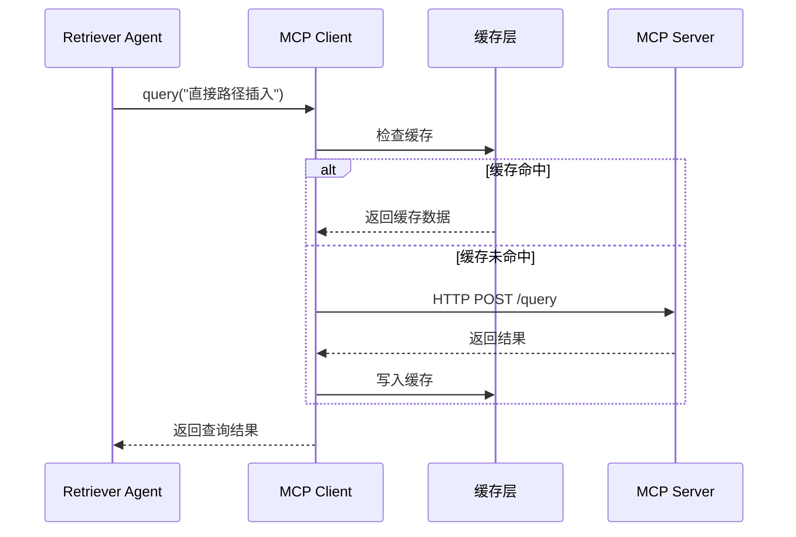
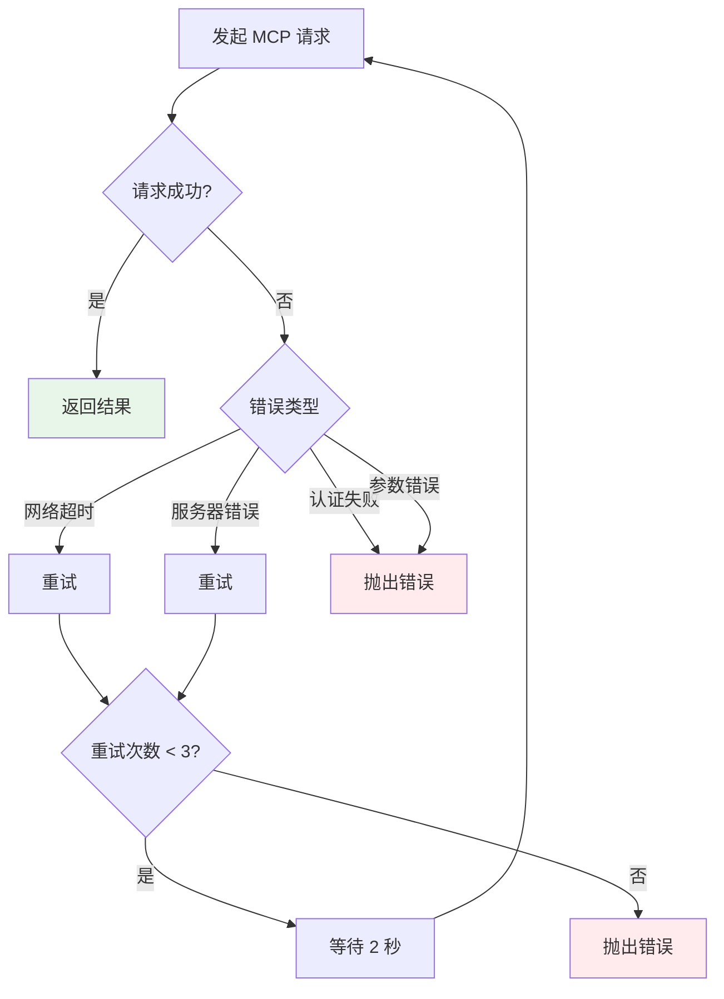
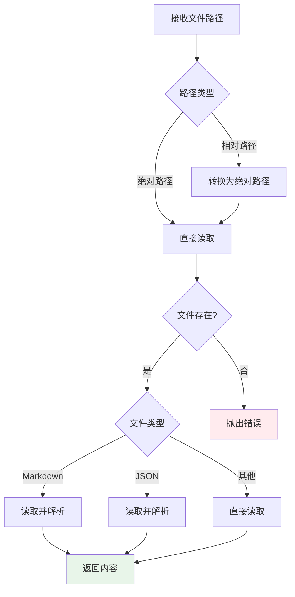
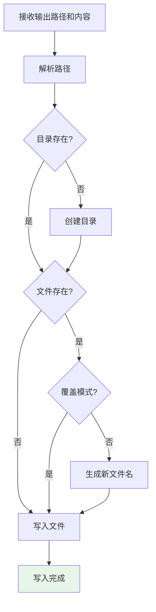

# 工具模块设计文档

## 1. 概述

工具模块为 Agent 提供外部能力支持，包含三个核心工具：

| 工具 | 职责 | 使用场景 |
|------|------|----------|
| MCP Client | 调用 MCP Server 查询知识库 | Retriever Agent |
| File Reader | 读取本地文件 | Retriever Agent |
| File Writer | 写入生成的文件 | Workflow Engine |

## 2. MCP Client 设计

### 2.1 架构



### 2.2 全局配置

MCP 配置为全局共享，配置一次，所有 Agent 都可以使用：

```json
{
  "mcp": {
    "server_url": "http://localhost:8080",
    "api_key": "***",
    "timeout": 30000,
    "retry_count": 3,
    "cache": {
      "enabled": true,
      "ttl": 3600,
      "max_size": 1000
    }
  }
}
```

### 2.3 核心实现

```javascript
class MCPClient {
    constructor(config) {
        this.config = config;
        this.baseUrl = config.server_url;
        this.apiKey = config.api_key;
        this.timeout = config.timeout || 30000;
        this.cache = config.cache?.enabled ? new MCPCache(config.cache) : null;
    }
    
    /**
     * 查询知识库
     */
    async query(queryText, options = {}) {
        // 检查缓存
        if (this.cache) {
            const cached = this.cache.get(queryText);
            if (cached) {
                return cached;
            }
        }
        
        // 发送请求
        const response = await this.request('/query', {
            query: queryText,
            ...options
        });
        
        // 写入缓存
        if (this.cache && response) {
            this.cache.set(queryText, response);
        }
        
        return response;
    }
    
    /**
     * 批量查询
     */
    async batchQuery(queries, options = {}) {
        const results = await Promise.allSettled(
            queries.map(q => this.query(q, options))
        );
        
        return results.map((r, i) => ({
            query: queries[i],
            success: r.status === 'fulfilled',
            data: r.status === 'fulfilled' ? r.value : null,
            error: r.status === 'rejected' ? r.reason.message : null
        }));
    }
    
    /**
     * 获取文档详情
     */
    async getDocument(docId) {
        return this.request('/document', { id: docId });
    }
    
    /**
     * 搜索代码示例
     */
    async searchCode(keyword, options = {}) {
        return this.request('/search/code', {
            keyword,
            ...options
        });
    }
    
    /**
     * 发送 HTTP 请求
     */
    async request(path, data) {
        const url = `${this.baseUrl}${path}`;
        const controller = new AbortController();
        const timeoutId = setTimeout(() => controller.abort(), this.timeout);
        
        try {
            const response = await fetch(url, {
                method: 'POST',
                headers: {
                    'Content-Type': 'application/json',
                    'Authorization': `Bearer ${this.apiKey}`
                },
                body: JSON.stringify(data),
                signal: controller.signal
            });
            
            if (!response.ok) {
                throw new Error(`MCP request failed: ${response.status}`);
            }
            
            return await response.json();
            
        } finally {
            clearTimeout(timeoutId);
        }
    }
    
    /**
     * 测试连接
     */
    async testConnection() {
        try {
            await this.request('/health', {});
            return { success: true, message: '连接成功' };
        } catch (error) {
            return { success: false, message: error.message };
        }
    }
}

/**
 * MCP 缓存
 */
class MCPCache {
    constructor(config) {
        this.ttl = config.ttl || 3600; // 默认 1 小时
        this.maxSize = config.max_size || 1000;
        this.cache = new Map();
    }
    
    get(key) {
        const item = this.cache.get(key);
        if (!item) return null;
        
        // 检查是否过期
        if (Date.now() - item.timestamp > this.ttl * 1000) {
            this.cache.delete(key);
            return null;
        }
        
        return item.data;
    }
    
    set(key, data) {
        // 检查容量
        if (this.cache.size >= this.maxSize) {
            // 删除最旧的
            const oldest = this.cache.keys().next().value;
            this.cache.delete(oldest);
        }
        
        this.cache.set(key, {
            data,
            timestamp: Date.now()
        });
    }
    
    clear() {
        this.cache.clear();
    }
}
```

### 2.4 错误处理



## 3. File Reader 设计

### 3.1 职责

读取本地文件，支持：
- 模板文件读取
- 参考文档读取
- 示例文件读取

### 3.2 执行流程



### 3.3 核心实现

```javascript
class FileReader {
    constructor(basePath = '') {
        this.basePath = basePath;
    }
    
    /**
     * 读取文件
     */
    async read(filePath, encoding = 'utf-8') {
        const fullPath = this.resolvePath(filePath);
        
        // 检查文件是否存在
        if (!fs.existsSync(fullPath)) {
            throw new Error(`File not found: ${fullPath}`);
        }
        
        // 读取文件
        const content = fs.readFileSync(fullPath, encoding);
        
        // 根据文件类型解析
        const ext = path.extname(fullPath).toLowerCase();
        return this.parseContent(content, ext);
    }
    
    /**
     * 批量读取文件
     */
    async readBatch(filePaths) {
        const results = await Promise.allSettled(
            filePaths.map(fp => this.read(fp))
        );
        
        return results.map((r, i) => ({
            file: filePaths[i],
            success: r.status === 'fulfilled',
            content: r.status === 'fulfilled' ? r.value : null,
            error: r.status === 'rejected' ? r.reason.message : null
        }));
    }
    
    /**
     * 读取目录下的所有文件
     */
    async readDirectory(dirPath, pattern = '*') {
        const fullPath = this.resolvePath(dirPath);
        
        if (!fs.existsSync(fullPath)) {
            throw new Error(`Directory not found: ${fullPath}`);
        }
        
        const files = fs.readdirSync(fullPath);
        const matchedFiles = pattern === '*' 
            ? files 
            : files.filter(f => minimatch(f, pattern));
        
        const results = [];
        for (const file of matchedFiles) {
            const filePath = path.join(fullPath, file);
            const stat = fs.statSync(filePath);
            
            if (stat.isFile()) {
                const content = await this.read(filePath);
                results.push({
                    file: filePath,
                    content,
                    size: stat.size,
                    modified: stat.mtime
                });
            }
        }
        
        return results;
    }
    
    /**
     * 解析文件内容
     */
    parseContent(content, ext) {
        switch (ext) {
            case '.json':
                return JSON.parse(content);
            case '.yaml':
            case '.yml':
                return yaml.parse(content);
            default:
                return content;
        }
    }
    
    /**
     * 解析路径
     */
    resolvePath(filePath) {
        if (path.isAbsolute(filePath)) {
            return filePath;
        }
        return path.resolve(this.basePath, filePath);
    }
}
```

## 4. File Writer 设计

### 4.1 职责

将生成的文档写入文件系统，支持：
- 自动创建目录
- 文件名生成
- 文件覆盖检查

### 4.2 执行流程



### 4.3 核心实现

```javascript
class FileWriter {
    constructor(basePath = '') {
        this.basePath = basePath;
    }
    
    /**
     * 写入文件
     */
    async write(outputPath, content, options = {}) {
        const fullPath = this.resolvePath(outputPath);
        const dir = path.dirname(fullPath);
        
        // 创建目录
        if (!fs.existsSync(dir)) {
            fs.mkdirSync(dir, { recursive: true });
        }
        
        // 检查文件是否存在
        if (fs.existsSync(fullPath) && !options.overwrite) {
            // 生成新文件名
            const newPath = this.generateUniquePath(fullPath);
            console.log(`File exists, writing to: ${newPath}`);
            fullPath = newPath;
        }
        
        // 写入文件
        fs.writeFileSync(fullPath, content, 'utf-8');
        
        return {
            success: true,
            path: fullPath,
            size: content.length
        };
    }
    
    /**
     * 批量写入文件
     */
    async writeBatch(files) {
        const results = [];
        
        for (const file of files) {
            try {
                const result = await this.write(file.path, file.content, file.options);
                results.push({ ...result, originalPath: file.path });
            } catch (error) {
                results.push({
                    success: false,
                    originalPath: file.path,
                    error: error.message
                });
            }
        }
        
        return results;
    }
    
    /**
     * 生成唯一文件路径
     */
    generateUniquePath(filePath) {
        const dir = path.dirname(filePath);
        const ext = path.extname(filePath);
        const base = path.basename(filePath, ext);
        
        let counter = 1;
        let newPath = filePath;
        
        while (fs.existsSync(newPath)) {
            newPath = path.join(dir, `${base}_${counter}${ext}`);
            counter++;
        }
        
        return newPath;
    }
    
    /**
     * 解析路径
     */
    resolvePath(filePath) {
        if (path.isAbsolute(filePath)) {
            return filePath;
        }
        return path.resolve(this.basePath, filePath);
    }
}
```

## 5. 工具注册与管理

```javascript
class ToolManager {
    constructor(config) {
        this.config = config;
        this.tools = new Map();
        
        // 注册默认工具
        this.registerTool('mcp', new MCPClient(config.mcp));
        this.registerTool('file_reader', new FileReader(config.basePath));
        this.registerTool('file_writer', new FileWriter(config.basePath));
    }
    
    registerTool(name, tool) {
        this.tools.set(name, tool);
    }
    
    getTool(name) {
        const tool = this.tools.get(name);
        if (!tool) {
            throw new Error(`Tool not found: ${name}`);
        }
        return tool;
    }
    
    listTools() {
        return Array.from(this.tools.keys());
    }
}
```

## 6. 工具调用接口

Agent 可以通过统一接口调用工具：

```javascript
class ToolCallingAgent extends BaseAgent {
    constructor(config, toolManager) {
        super('tool_calling', '工具调用 Agent', config);
        this.toolManager = toolManager;
    }
    
    // 定义可用工具
    getToolDefinitions() {
        return [
            {
                type: 'function',
                function: {
                    name: 'query_mcp',
                    description: '查询 YashanDB 知识库',
                    parameters: {
                        type: 'object',
                        properties: {
                            query: { type: 'string' }
                        },
                        required: ['query']
                    }
                }
            },
            {
                type: 'function',
                function: {
                    name: 'read_file',
                    description: '读取文件',
                    parameters: {
                        type: 'object',
                        properties: {
                            path: { type: 'string' }
                        },
                        required: ['path']
                    }
                }
            }
        ];
    }
    
    // 执行工具调用
    async executeToolCall(toolCall) {
        const { name, arguments: args } = toolCall.function;
        
        switch (name) {
            case 'query_mcp':
                const mcp = this.toolManager.getTool('mcp');
                return await mcp.query(args.query);
                
            case 'read_file':
                const reader = this.toolManager.getTool('file_reader');
                return await reader.read(args.path);
                
            default:
                throw new Error(`Unknown tool: ${name}`);
        }
    }
}
```

## 7. 性能优化

1. **MCP 缓存**：减少重复查询
2. **批量操作**：支持批量读取和写入
3. **流式处理**：大文件流式读写
4. **连接池**：复用 HTTP 连接

## 8. 监控指标

| 指标 | 说明 |
|------|------|
| MCP 查询次数 | 总查询次数 |
| MCP 缓存命中率 | 缓存命中比例 |
| 文件读取次数 | 文件读取总次数 |
| 文件写入次数 | 文件写入总次数 |
| 平均响应时间 | 工具调用平均耗时 |
