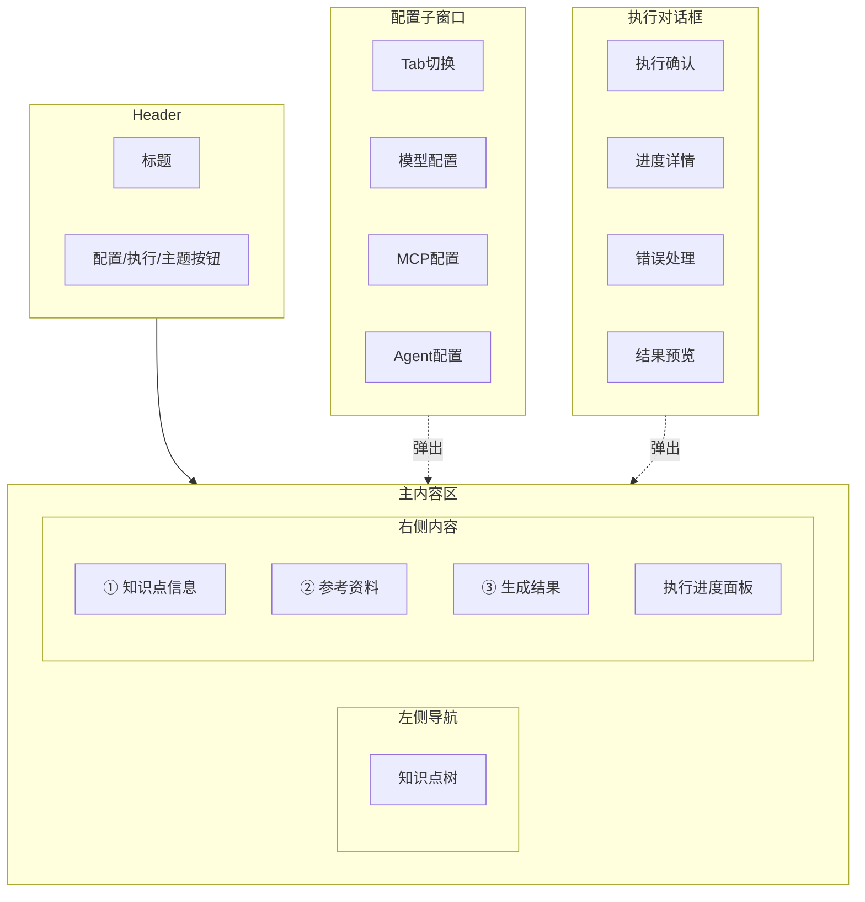
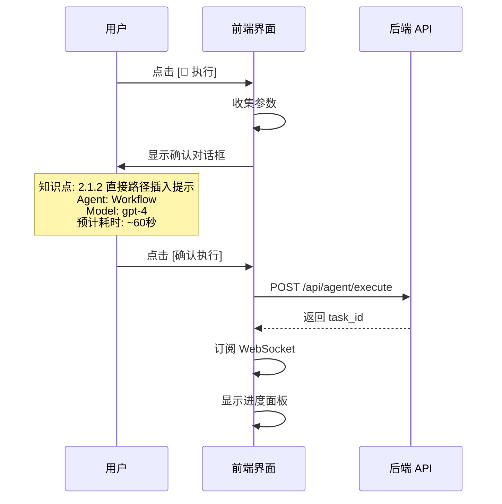
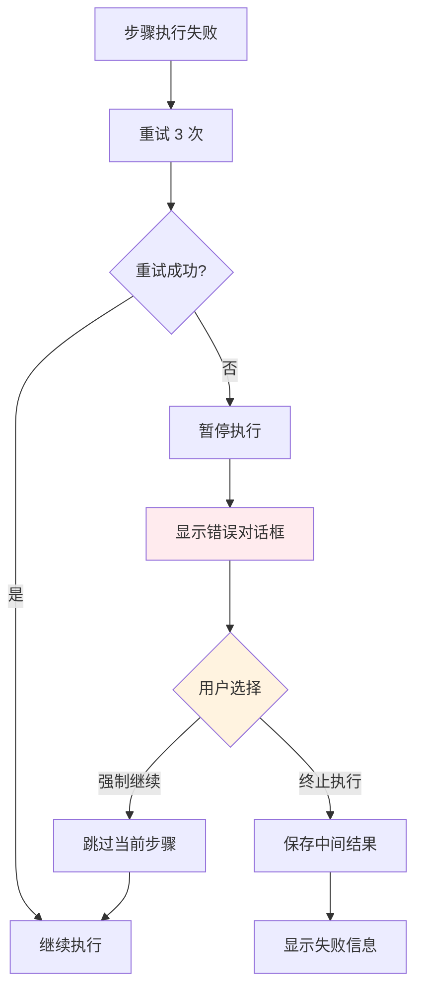

# 前端交互设计文档

## 1. 概述

在现有 `prompt-generator.html` 基础上增加：
1. 配置子窗口（模型/MCP/Agent 配置）
2. 执行进度显示
3. 中间结果预览（可折叠）
4. 错误处理和用户干预界面

## 2. 界面布局



## 3. 配置子窗口设计

### 3.1 整体结构

```
┌─────────────────────────────────────────────────────────────┐
│  ⚙️ 配置                                                    │
│  ┌─────────┬─────────┬─────────┐                            │
│  │ 模型配置 │ MCP配置  │ Agent  │  ← Tab 切换                │
│  └─────────┴─────────┴─────────┘                            │
│                                                              │
│  [当前 Tab 内容]                                             │
│                                                              │
│  ┌──────────┐  ┌──────────┐                                 │
│  │ 💾 保存   │  │ ✖ 关闭   │                                 │
│  └──────────┘  └──────────┘                                 │
└─────────────────────────────────────────────────────────────┘
```

### 3.2 模型配置 Tab

```
┌─────────────────────────────────────────────────────────────┐
│  模型配置                                                     │
│                                                               │
│  Provider:                                                    │
│  ┌───────────────────────────────────────────────────────┐   │
│  │ [OpenAI                    ▼]                         │   │
│  │  ○ OpenAI          https://api.openai.com/v1          │   │
│  │  ○ 阿里云百炼       https://dashscope.aliyuncs.com    │   │
│  │  ○ 智谱 AI         https://open.bigmodel.cn/api/paas  │   │
│  │  ○ 自定义                                            │   │
│  └───────────────────────────────────────────────────────┘   │
│                                                               │
│  API Key:                                                     │
│  ┌──────────────────────────────────────────────┬──────┐    │
│  │ sk-********************************          │ 👁️  │    │
│  └──────────────────────────────────────────────┴──────┘    │
│                                                               │
│  Model:                                                       │
│  ┌───────────────────────────────────────────────────────┐   │
│  │ [gpt-4                     ▼]                         │   │
│  └───────────────────────────────────────────────────────┘   │
│                                                               │
│  Base URL:                                                    │
│  ┌───────────────────────────────────────────────────────┐   │
│  │ https://api.openai.com/v1                             │   │
│  └───────────────────────────────────────────────────────┘   │
│                                                               │
│  Temperature:  [0.7        ]   Max Tokens:  [4000       ]    │
│                                                               │
│  ┌──────────┐                                                │
│  │ 🧪 测试   │  ← 测试连接                                     │
│  └──────────┘                                                │
└─────────────────────────────────────────────────────────────┘
```

### 3.3 MCP 配置 Tab

```
┌─────────────────────────────────────────────────────────────┐
│  MCP 配置（全局共享）                                         │
│                                                               │
│  Server URL:                                                  │
│  ┌───────────────────────────────────────────────────────┐   │
│  │ http://localhost:8080                                 │   │
│  └───────────────────────────────────────────────────────┘   │
│                                                               │
│  API Key:                                                     │
│  ┌──────────────────────────────────────────────┬──────┐    │
│  │ ***                                          │ 👁️  │    │
│  └──────────────────────────────────────────────┴──────┘    │
│                                                               │
│  Timeout:  [30000      ] ms                                   │
│                                                               │
│  ─────────────────────────────────────────────────────────    │
│  缓存设置                                                     │
│  [✓] 启用缓存    TTL: [3600] 秒    最大条数: [1000]          │
│                                                               │
│  ┌──────────┐                                                │
│  │ 🧪 测试   │  ← 测试连接                                     │
│  └──────────┘                                                │
└─────────────────────────────────────────────────────────────┘
```

### 3.4 Agent 配置 Tab

```
┌─────────────────────────────────────────────────────────────┐
│  Agent 配置                                                   │
│                                                               │
│  选择 Agent 类型：                                            │
│  ┌──────────┐  ┌──────────┐  ┌──────────┐                  │
│  │ 📝 Simple│  │ 🔧 Tool  │  │ 🔄 Work- │                  │
│  │   LLM    │  │ Calling  │  │   flow   │                  │
│  │          │  │          │  │  [已选]   │                  │
│  └──────────┘  └──────────┘  └──────────┘                  │
│                                                               │
│  ─────────────────────────────────────────────────────────    │
│  Workflow 步骤配置                                            │
│                                                               │
│  ┌───────────────────────────────────────────────────────┐   │
│  │ 1. Planner    [gpt-4 ▼]  [编辑 Prompt]    [✖]        │   │
│  │ 2. Retriever  [gpt-3.5 ▼] [编辑 Prompt]   [✖]        │   │
│  │ 3. Generator  [gpt-4 ▼]  [编辑 Prompt]    [✖]        │   │
│  │ 4. Validator  [gpt-4 ▼]  [编辑 Prompt]    [✖]        │   │
│  │                                                       │   │
│  │ [+ 添加步骤]                                          │   │
│  └───────────────────────────────────────────────────────┘   │
│                                                               │
│  ─────────────────────────────────────────────────────────    │
│  预设管理                                                     │
│  ┌───────────────────────────────────────────────────────┐   │
│  │ [默认4步流程 ▼]                                       │   │
│  │  ○ 默认4步流程                                         │   │
│  │  ○ 快速生成（跳过验证）                                │   │
│  │  ○ 高质量模式（增加审查步骤）                           │   │
│  │                                                       │   │
│  │ [💾 保存为预设]  [🗑️ 删除预设]                         │   │
│  └───────────────────────────────────────────────────────┘   │
└─────────────────────────────────────────────────────────────┘
```

## 4. 执行流程交互

### 4.1 执行确认对话框



### 4.2 进度显示面板

```
┌─────────────────────────────────────────────────────────────┐
│  🔄 执行中...                                    [取消执行]  │
│                                                               │
│  [████████████████░░░░░░░░] 60%                              │
│                                                               │
│  ┌───────────────────────────────────────────────────────┐   │
│  │ ✅ Planner     5.2秒   [展开预览 ▼]                    │   │
│  │ ┌─────────────────────────────────────────────────┐   │   │
│  │ │ {"knowledge_point": {"id": "2.1.2", ...}}       │   │   │
│  │ └─────────────────────────────────────────────────┘   │   │
│  │                                                        │   │
│  │ ✅ Retriever   8.3秒   [展开预览 ▼]                    │   │
│  │ ┌─────────────────────────────────────────────────┐   │   │
│  │ │ # 参考资料汇总                                   │   │   │
│  │ │ ## 1. MCP 知识库查询结果                         │   │   │
│  │ │ ...                                              │   │   │
│  │ └─────────────────────────────────────────────────┘   │   │
│  │                                                        │   │
│  │ 🔄 Generator   执行中...                               │   │
│  │                                                        │   │
│  │ ⏳ Validator   等待中                                   │   │
│  └───────────────────────────────────────────────────────┘   │
└─────────────────────────────────────────────────────────────┘
```

### 4.3 错误处理对话框



```
┌─────────────────────────────────────────────────────────────┐
│  ❌ 步骤执行失败                                              │
│                                                               │
│  步骤: Retriever                                              │
│  错误: MCP 查询超时（已重试 3 次）                             │
│                                                               │
│  错误详情:                                                    │
│  ┌───────────────────────────────────────────────────────┐   │
│  │ Error: Request timeout after 30000ms                  │   │
│  │ at MCPClient.query (mcp-client.js:45)                 │   │
│  └───────────────────────────────────────────────────────┘   │
│                                                               │
│  ┌────────────────────┐  ┌────────────────────┐             │
│  │ ⏭️ 强制继续         │  │ ✖ 终止执行         │             │
│  │ (跳过当前步骤)      │  │ (保存中间结果)      │             │
│  └────────────────────┘  └────────────────────┘             │
└─────────────────────────────────────────────────────────────┘
```

### 4.4 执行完成对话框

```
┌─────────────────────────────────────────────────────────────┐
│  ✅ 执行成功                                                  │
│                                                               │
│  文件已生成:                                                  │
│  output/兼容性领域/02-DML兼容性/2.1.2-直接路径插入提示.md     │
│                                                               │
│  ─────────────────────────────────────────────────────────    │
│  执行统计                                                     │
│  ┌───────────────────────────────────────────────────────┐   │
│  │ 总耗时:     28秒                                       │   │
│  │ Token 消耗: 3847                                       │   │
│  │ MCP 查询:   3次                                        │   │
│  │ 文件读取:   2次                                        │   │
│  └───────────────────────────────────────────────────────┘   │
│                                                               │
│  ─────────────────────────────────────────────────────────    │
│  各步骤耗时                                                   │
│  ┌───────────────────────────────────────────────────────┐   │
│  │ Planner:    5.2秒  ████████░░░░░░░░░░░░  18%          │   │
│  │ Retriever:  8.3秒  █████████████░░░░░░░  30%          │   │
│  │ Generator:  10.1秒 ████████████████░░░░  36%          │   │
│  │ Validator:  4.4秒  ███████░░░░░░░░░░░░░  16%          │   │
│  └───────────────────────────────────────────────────────┘   │
│                                                               │
│  ┌──────────┐  ┌──────────┐  ┌──────────┐                   │
│  │ 📄 查看   │  │ 📋 复制   │  │ ✖ 关闭   │                   │
│  └──────────┘  └──────────┘  └──────────┘                   │
└─────────────────────────────────────────────────────────────┘
```

## 5. 前端代码结构

### 5.1 新增 DOM 元素

```html
<!-- 配置按钮 -->
<button onclick="openConfigModal()">⚙️ 配置</button>

<!-- 配置子窗口 -->
<div id="configModal" class="modal">
    <div class="modal-content">
        <div class="modal-header">
            <h3>⚙️ 配置</h3>
            <button onclick="closeConfigModal()">✖</button>
        </div>
        <div class="modal-tabs">
            <button class="tab active" onclick="switchTab('model')">模型配置</button>
            <button class="tab" onclick="switchTab('mcp')">MCP 配置</button>
            <button class="tab" onclick="switchTab('agent')">Agent 配置</button>
        </div>
        <div class="modal-body">
            <div id="modelConfigTab" class="tab-content active">...</div>
            <div id="mcpConfigTab" class="tab-content">...</div>
            <div id="agentConfigTab" class="tab-content">...</div>
        </div>
        <div class="modal-footer">
            <button onclick="saveConfig()">💾 保存</button>
            <button onclick="closeConfigModal()">✖ 关闭</button>
        </div>
    </div>
</div>

<!-- 执行进度面板 -->
<div id="progressPanel" class="progress-panel" style="display:none">
    <div class="progress-header">
        <span>🔄 执行中...</span>
        <button onclick="cancelExecution()">取消执行</button>
    </div>
    <div class="progress-bar">
        <div class="progress-fill" id="progressFill"></div>
    </div>
    <div class="progress-steps" id="progressSteps"></div>
</div>
```

### 5.2 核心 JavaScript 函数

```javascript
// 配置管理
function openConfigModal() { ... }
function closeConfigModal() { ... }
function switchTab(tabName) { ... }
function saveConfig() { ... }
function testModelConnection() { ... }
function testMCPConnection() { ... }

// 执行控制
function executeAgent() { ... }
function cancelExecution() { ... }
function forceContinue() { ... }

// 进度显示
function updateProgress(data) { ... }
function renderStepProgress(step) { ... }
function toggleStepPreview(stepName) { ... }

// WebSocket
function connectWebSocket() { ... }
function subscribeTask(taskId) { ... }

// 错误处理
function showErrorDialog(error) { ... }
function showCompleteDialog(result) { ... }
```

## 6. 状态管理

```javascript
// 全局状态
const AppState = {
    // 配置状态
    config: {
        model: null,
        mcp: null,
        agent: null
    },
    
    // 执行状态
    execution: {
        taskId: null,
        status: 'idle', // idle, running, paused, completed, failed
        progress: 0,
        steps: [],
        error: null
    },
    
    // UI 状态
    ui: {
        configModalOpen: false,
        progressPanelVisible: false,
        expandedSteps: new Set()
    }
};
```

## 7. 样式设计

### 7.1 配置子窗口样式

```css
.modal {
    display: none;
    position: fixed;
    top: 0;
    left: 0;
    width: 100%;
    height: 100%;
    background: rgba(0, 0, 0, 0.5);
    z-index: 1000;
}

.modal-content {
    position: absolute;
    top: 50%;
    left: 50%;
    transform: translate(-50%, -50%);
    width: 600px;
    max-height: 80vh;
    background: var(--card-bg);
    border-radius: var(--radius);
    overflow: hidden;
}

.modal-tabs {
    display: flex;
    border-bottom: 1px solid var(--border);
}

.modal-tabs .tab {
    flex: 1;
    padding: 12px;
    border: none;
    background: none;
    cursor: pointer;
}

.modal-tabs .tab.active {
    border-bottom: 2px solid var(--primary);
    color: var(--primary);
}
```

### 7.2 进度面板样式

```css
.progress-panel {
    background: var(--card-bg);
    border: 1px solid var(--border);
    border-radius: var(--radius);
    padding: 16px;
    margin-top: 16px;
}

.progress-bar {
    height: 8px;
    background: var(--bg);
    border-radius: 4px;
    overflow: hidden;
    margin: 12px 0;
}

.progress-fill {
    height: 100%;
    background: var(--primary);
    transition: width 0.3s ease;
}

.progress-step {
    padding: 8px 12px;
    border-left: 3px solid var(--border);
    margin-bottom: 8px;
}

.progress-step.completed {
    border-left-color: var(--success);
}

.progress-step.running {
    border-left-color: var(--primary);
}

.progress-step.failed {
    border-left-color: var(--warning);
}

.step-preview {
    display: none;
    margin-top: 8px;
    padding: 8px;
    background: var(--bg);
    border-radius: 4px;
    font-size: 12px;
    max-height: 200px;
    overflow-y: auto;
}

.step-preview.expanded {
    display: block;
}
```

## 8. 交互细节

1. **配置保存**：配置保存后自动关闭子窗口
2. **执行确认**：执行前显示确认对话框，展示预计耗时和 Token 消耗
3. **进度折叠**：中间结果预览默认折叠，点击展开
4. **错误重试**：自动重试 3 次，失败后暂停等待用户决策
5. **取消执行**：取消后保存已完成的中间结果
