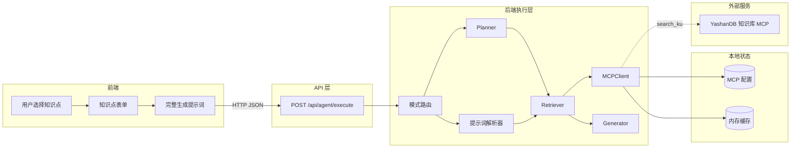
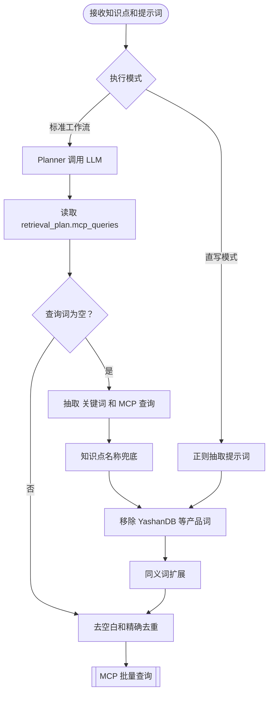
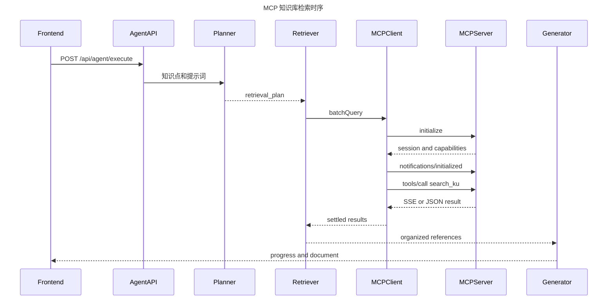

# 知识点驱动的 MCP 检索流程设计

## 1. 文档目标

本文档说明用户在前端选中一个知识点后，系统如何组装上下文、生成 MCP 查询词、调用 YashanDB 知识库、整理检索结果，并将结果交给文档生成器。

文档以当前代码为准，同时区分：

- **当前实现**：代码现在实际执行的逻辑。
- **已知差距**：当前实现与完整检索链路之间的差异。
- **目标设计**：后续改造时建议保持的接口和约束。

## 2. 一句话概括

> 前端选中知识点后不直接调用 MCP，而是将知识点和完整提示词发送给后端；后端再根据执行模式，由 Planner 生成查询词，或从提示词中抽取查询词，最终通过 MCP `search_ku` 工具并发查询。

## 3. 系统边界与总体架构



### 3.1 核心模块职责

| 模块 | 代码位置 | 职责 |
|---|---|---|
| 知识点选择与执行 | `frontend/prompt-generator.html` | 填充知识点表单，组装 `knowledge_point` 和 `prompt` |
| Agent API | `routes/agent.js` | 校验请求，加载最新 MCP 配置，选择工作流或直写模式 |
| 查询词构建器 | `lib/retrieval-query-builder.js` | 从传入提示词和知识点抽取关键词，移除产品词，扩展同义词，输出 MCP 查询词 |
| Planner | `lib/agents/planner-agent.js` | 让 LLM 生成 `retrieval_plan.mcp_queries`，并在为空时调用查询词构建器兜底 |
| 直写解析器 | `lib/direct-generate/prompt-parser.js` | 抽取参考文件，并调用查询词构建器生成 MCP 查询词 |
| Retriever | `lib/agents/retriever-agent.js` | 调用 MCP 和文件工具，合并原始资料，再用 LLM 整理参考资料 |
| MCPClient | `lib/tools/mcp-client.js` | 完成 MCP 初始化、会话维护、`search_ku` 调用、并发和缓存 |
| Generator | `lib/langgraph-workflow.js` / `lib/direct-generate/direct-task-runner.js` | 将检索资料与知识点、模板一起交给 LLM 生成文档 |

## 4. 前端选中知识点后发生了什么

### 4.1 知识点数据

用户在导航树选择知识点后，前端将其写入表单。点击“执行 Agent”时构建如下对象：

```json
{
  "knowledge_point": {
    "name": "NUMBER 数值类型",
    "type": "SQL/开发参考",
    "description": "介绍 YashanDB 数值类型与用法",
    "part": "数据库基础",
    "chapter": "数据类型",
    "target_db": "Oracle",
    "level": "★★"
  },
  "prompt": "# YashanDB 知识文档生成任务 ...",
  "mode": "workflow",
  "workflow_config": {
    "steps": ["planner", "retriever", "generator", "validator"]
  }
}
```

### 4.2 前端的 MCP 关键词输入

前端表单提供“MCP 查询关键词”输入框，该值会写入提示词中的：

```json
{
  "references": {
    "mcp_query": "YashanDB NUMBER 精度范围"
  }
}
```

需注意：当前解析器主要识别自然语言中的 `关键词：...` 和 `MCP 查询：...`，并不会直接解析 JSON 里的 `"mcp_query"`。在标准工作流中，Planner 可能根据整个提示词理解该字段；直写模式则可能因此抽取不到查询词。

## 5. MCP 查询词是怎么产生的



### 5.1 标准工作流：LLM 规划为主，规则兜底

Planner 获得以下上下文：

1. 知识点名称、类型、描述、所属章节、目标库和难度。
2. 文档模板路径。
3. 前端已生成的完整提示词。
4. `planner.md` 中的规划原则：查询词应当精准、具体。

Planner 要求 LLM 返回：

```json
{
  "retrieval_plan": {
    "mcp_queries": [
      "YashanDB NUMBER 精度和标度",
      "YashanDB NUMBER 超出范围错误",
      "YashanDB CREATE TABLE NUMBER 示例"
    ],
    "reference_files": []
  }
}
```

如果 LLM 返回的 `mcp_queries` 为空，Planner 才执行兜底。兜底查询词不再拼接 `YashanDB`，而是直接使用提示词和知识点中的业务词：

```text
queries = 从提示词抽取的查询词
如果 queries 为空:
  queries += knowledge_point.name

queries = removeProductTerms(queries)
queries = expandSynonyms(queries)

queries = 精确字符串去重
```

### 5.1.1 关键词抽取与同义词扩展设计

`buildMcpQueries(context)` 是统一入口：

```typescript
interface BuildMcpQueriesInput {
  prompt?: string;
  knowledgePoint?: {
    name?: string;
    type?: string;
    description?: string;
    chapter?: string;
  };
  maxQueries?: number;
}

interface BuildMcpQueriesOutput {
  queries: string[];
  extracted: string[];
}
```

抽取来源按优先级合并：

1. 自然语言 `关键词：...`。
2. 自然语言 `MCP 查询：...`。
3. JSON 字段 `"mcp_query": "..."`。
4. 当前选中知识点名称、类型、描述和章节中的核心词。

清理规则：

- 删除 `YashanDB`、`崖山DB`、`崖山数据库`、`Yashan 数据库` 等产品词。
- 保留 SQL 类型名、SQL 关键字和技术缩写，例如 `NUMBER`、`CREATE TABLE`、`HA`。
- 删除多余标点和重复空白。
- 查询词为空时丢弃。

同义词扩展采用 **LLM 深度语义分析** 方式（`lib/synonym-expander.js`），通过大模型理解数据库领域语义，从多个维度进行扩展：

1. **同义词扩展**：找出数据库领域中的同义表达、别名、缩写
2. **上下位概念扩展**：上位概念（更大类别）和下位概念（具体子类型）
3. **关联概念扩展**：相关操作、使用场景
4. **实际使用场景扩展**：用户在什么场景下会查询这个概念

同义词组配置文件 `config/synonym-config.json` 作为 LLM 的参考输入，但不限制扩展范围。

扩展策略：

```text
base = extractKeywords(prompt)  // 使用 smartSplit 保护括号内内容
if base is empty:
  base = extractKeywords(knowledgePoint)

base = base.map(removeProductTerms).map(normalizeQuery)
expanded = await llmExpandSynonyms(base)  // LLM 深度语义分析

return unique(expanded).slice(0, maxQueries || 8)
```

**智能拆分（smartSplit）**：关键词提取和查询词拆分时，保护括号、引号内的内容不被分隔符拆分。例如 `NUMBER(p,s)` 不会被逗号拆成 `NUMBER(p` 和 `s)`，而是作为整体保留。

LLM 扩展示例：

```text
输入：["数值类型：NUMBER(p,s)", "INTEGER"]
输出：
- "数值类型：NUMBER(p,s)" → ["NUMBER类型精度标度", "NUMBER数据类型定义", "数值类型映射", "DECIMAL NUMERIC类型", "数据类型转换", "NUMBER存储规则"]
- "INTEGER" → ["整数类型", "INT BIGINT类型", "NUMBER(38)整数", "整型数据定义"]
```

### 5.2 直写模式：规则抽取

直写模式不调用 Planner，`extractDirectReferences()` 抽取参考文件后，调用同一个 `buildMcpQueries()` 生成 MCP 查询词：

```text
规则 1：匹配 "关键词：..."
       使用 smartSplit 智能拆分（保护括号内内容）

规则 2：匹配 "MCP 查询：..."
       每个匹配行作为一条查询

规则 3：匹配 JSON 字段 `"mcp_query": "..."`。

最后：移除产品词，LLM 同义词扩展，清理尾部标点，删除空值，精确去重
```

直写模式现在应传入 `knowledge_point`，当提示词中没有显式关键词时，用选中的知识点兜底。

### 5.3 查询词设计原则

建议每个知识点使用 3–5 条互补查询，不要只查一个过宽的词：

| 维度 | 目的 | 示例 |
|---|---|---|
| 主题词 | 定位概念文档 | `YashanDB NUMBER 数据类型` |
| 语法词 | 获取可执行用法 | `YashanDB CREATE TABLE NUMBER 语法` |
| 边界词 | 获取限制和错误 | `YashanDB NUMBER 精度 标度 范围` |
| 行为词 | 获取隐式转换等机制 | `YashanDB NUMBER 隐式类型转换` |
| 对比词 | 兼容性类型使用 | `YashanDB Oracle NUMBER 差异` |

查询词不主动包含产品名 `YashanDB`。MCP 配置已经指向 YashanDB 知识库，继续在 query 中携带产品词会稀释真正的业务关键词。查询词应保留 SQL 关键字和类型名的原始大写。


### 5.4 检索结果精简

为避免上下文过大导致 LLM 调用 token 超限和成本过高，对检索结果进行精简：

**MCP 查询结果精简**：
- MCP 返回数据包含 `content`（JSON字符串）和 `structuredContent`（解析后对象），两者内容完全重复
- 只提取 `structuredContent` 中的核心结果（标题、摘要、ku_name、相关度）
- 限制每个查询最多展示 8 条结果
- 格式化为简洁的 Markdown 列表

**本地文件内容截断**：
- 设计文档、Oracle 知识库、测试用例、源码等本地文件内容超过 8000 字符时自动截断
- 保留头部 70% 和尾部 30%，中间用省略标记
- 确保关键信息（标题、开头定义、总结）不丢失

精简前 `01-context-prompt.md` 约 35000 行（1MB+），精简后预计降至 2000-3000 行。

## 6. MCP 协议与实际查询流程



### 6.1 初始化和会话

`MCPClient` 首次查询前会：

1. 向 `server_url` 发送 JSON-RPC `initialize`。
2. 协议版本为 `2024-11-05`，客户端名为 `agent-runner`。
3. 记录响应头 `mcp-session-id`。
4. 发送 `notifications/initialized`。
5. 后续请求携带 `Mcp-Session-Id`。

请求头包括：

```http
Content-Type: application/json
Accept: application/json, text/event-stream
Authorization: Bearer <api-key>       # 配置后才发送
Mcp-Session-Id: <session-id>          # 初始化后才发送
<custom headers>
```

### 6.2 `search_ku` 工具调用

每个查询词被转换为：

```json
{
  "jsonrpc": "2.0",
  "id": 2,
  "method": "tools/call",
  "params": {
    "name": "search_ku",
    "arguments": {
      "query": "YashanDB NUMBER 精度和标度"
    }
  }
}
```

MCP 服务可返回普通 JSON，也可返回 SSE。当前客户端只取 SSE 中第一个 `data: ` 行作为 JSON 响应。

### 6.3 并发、缓存和超时

- `batchQuery()` 使用 `Promise.allSettled()` 并发执行所有查询词。
- 单条失败不会中断其他查询。
- 默认超时 30 秒，可通过 MCP 配置修改。
- 缓存键是未归一化的完整查询字符串，默认 TTL 是 3600 秒。
- 缓存默认最多 1000 条；满后删除 `Map` 中最早插入的键。
- 每次启动标准工作流前会用最新配置重建 MCPClient，因此进程内缓存也会重置。

## 7. 检索结果如何进入文档生成

### 7.1 标准工作流

Retriever 将每条结果拼接成：

```markdown
### MCP 查询: YashanDB NUMBER 精度和标度

<MCP 返回内容>

---

### MCP 查询: YashanDB CREATE TABLE NUMBER 语法

<MCP 返回内容>
```

然后 Retriever 还会再调用一次 LLM，把 MCP 结果和本地文件整理成 `references`。Generator 获取：

```text
executionPlan + references + comparison + validation feedback
```

### 7.2 直写模式

直写模式不调用 Retriever LLM 二次整理，而是将 MCP 原始结果、本地文件、模板全文、原始提示词和知识点 JSON 一次性交给生成 LLM。这条链路对原始资料的保真度更高，但输入上下文更大。

## 8. 三种模式的实际差异

| 模式 | 查询词来源 | 是否实际调用 MCP | 是否二次整理 | 当前评价 |
|---|---|---:|---:|---|
| 标准工作流 | Planner LLM，空时用规则兜底 | 是 | 是 | 链路最完整 |
| 直写模式 | 提示词正则抽取 | 是 | 否 | 高保真，但关键词易为空 |
| 快速模式 `planner_retriever` | Planner LLM | **否** | 否 | 当前只将查询词当作 `references` 传给 Generator |

### 8.1 快速模式的关键差距

当前 `createPlannerRetrieverNode()` 的实现是：

```text
output = Planner.execute(mode = merged)
references = output.retrieval_plan.mcp_queries
直接进入 Generator
```

它没有调用 `MCPClient.batchQuery()`，所以界面上的“MCP 查询 N 条”仅表示生成了 N 条查询词，不代表完成了知识库查询。

## 9. 失败和降级策略

| 故障 | 当前行为 | 对最终任务的影响 |
|---|---|---|
| Planner JSON 解析失败 | 构造默认文档结构，再用提示词和知识点兜底 | 可继续 |
| 单条 MCP 查询失败 | 记录失败文本，其他查询继续 | 可继续，资料不完整 |
| MCP 服务整体不可用 | 将错误放入参考资料 | 生成仍继续 |
| MCP 超时 | 单条 Promise 失败 | 同单条失败 |
| 参考文件读取失败 | 记录失败，其他文件继续 | 可继续 |
| 直写模式未抽取到词 | 跳过 MCP | 仅使用本地资料和模型知识 |

进度事件会区分 `running`、`success` 和 `failed`，并展示查询词、内容长度、耗时和估算 token 数，但不展示模型内部思维链。

## 10. 当前实现的已知风险

### 10.1 高优先级

1. **快速模式没有真正查询 MCP**  
   需要在 `planner_retriever` 节点中调用检索服务，或恢复独立 Retriever 节点。

2. **直写模式可能识别不到 `references.mcp_query`**  
   应优先解析提示词中的 JSON 代码块，正则仅作为兼容兜底。

3. **同名 MCP Header 会覆盖**  
   `customHeaders` 是普通对象。当配置两个 `X-Ksacraft-Kb-Id` 时，后一个值覆盖前一个值，当前实际只会发送一个知识库 ID。

### 10.2 中优先级

4. ~~查询词只做精确字符串去重，没有大小写、空白和同义词归一化。~~ **已修复**：使用 smartSplit 保护括号内内容不被拆分，LLM 同义词扩展进行语义归一化。
5. ~~除数值类型外，其他知识点没有确定性的专用扩展规则。~~ **已修复**：改用 LLM 深度语义分析进行多维度扩展（同义词、上下位概念、关联概念、使用场景），不再依赖固定词表。
6. 并发查询没有并发数限制，查询词过多时可能对 MCP 服务造成瞬时压力。

**已修复问题（2026-07-21）**：
- **YAML 代码块未正确关闭**：LLM 生成的文档中，```yaml 代码块缺少关闭的 ```，导致正文被包含在代码块中。通过增强 system prompt 指令（明确说明必须用 ``` 关闭代码块）和添加后处理函数 `fixYamlCodeBlock()` 自动修复。

- **括号内内容被错误拆分**：`NUMBER(p,s)` 被逗号拆成 `NUMBER(p` 和 `s)`。通过 smartSplit 函数保护括号/引号内内容。
- **同义词扩展不足**：原来只依赖本地词表，扩展维度单一。改用 LLM 深度语义分析，从同义词、上下位概念、关联概念、使用场景四个维度扩展。
- **MCP 查询结果重复**：`content` 和 `structuredContent` 包含完全相同的数据。现在只提取 `structuredContent` 并格式化为简洁列表。
- **上下文过大**：`01-context-prompt.md` 达到 35000 行（1MB+）。通过 MCP 结果精简和本地文件内容截断（>8000字符自动截断）大幅缩减。
7. 配置中有 `retry_count`，但 MCPClient 当前未实现请求重试。
8. SSE 解析只读第一个 `data:` 行，不支持多事件或分块结果合并。
9. 缓存不包含知识库 ID、自定义 Header 和 options，如果同一 MCPClient 内动态切换上下文，存在错用缓存的风险。

## 11. 目标设计

### 11.1 统一的检索计划接口

```typescript
interface RetrievalPlan {
  mcp_queries: Array<{
    query: string;
    purpose: 'concept' | 'syntax' | 'boundary' | 'behavior' | 'compatibility';
    required: boolean;
  }>;
  reference_files: string[];
  max_concurrency: number;
}
```

Planner、直写解析器和快速模式都应输出该统一结构，然后交给同一个 RetrievalService，不再在三条链路中重复 MCP 调用逻辑。

### 11.2 统一执行伪代码

```text
context = validate(knowledge_point, prompt, template)
plan = buildRetrievalPlan(context, mode)

if plan.mcp_queries is empty:
  plan.mcp_queries = buildKnowledgePointFallback(context.knowledge_point)

plan.mcp_queries = normalizeAndDeduplicate(plan.mcp_queries)
plan.mcp_queries = limit(plan.mcp_queries, 5)

results = RetrievalService.execute(plan,
  concurrency = min(plan.max_concurrency, 3),
  retry = configuredRetryCount,
  timeout = configuredTimeout)

references = normalizeMcpResults(results)
generator.generate(context, plan, references)
```

### 11.3 结果质量门槛

建议在进入 Generator 前计算：

- 查询词数量和成功数量。
- 返回内容总长度。
- 是否至少有一条必需查询成功。
- 是否包含语法、边界和兼容性等目标维度。
- MCP 结果为空时是否明确告警，而不是静默降级。

## 12. 验证方案

### 12.1 单元测试

1. Planner 有效 JSON 查询词。
2. Planner 空查询词的知识点兜底。
3. 数值类型专用扩展。
4. 直写提示词中的“关键词”、“MCP 查询”和 JSON `mcp_query`。
5. 去重、空值、标点和查询数量上限。
6. MCP JSON 与 SSE 响应解析。
7. 单条失败不影响其他查询。

### 12.2 真实 API 集成测试

根据本仓库要求，集成测试必须启动真实后端，通过 `POST /api/agent/execute` 执行，并通过状态 API 或 WebSocket 验证：

```text
planner 输出包含 mcp_queries
retriever 出现 MCP 批量查询 running 事件
每个 query 出现 success 或 failed 事件
generator 获得非空 references
最终文档存在与 MCP 资料对应的事实和示例
```

## 13. 源码索引

| 主题 | 文件 |
|---|---|
| 前端执行请求 | `frontend/prompt-generator.html` |
| 执行 API 和模式路由 | `routes/agent.js` |
| 工作流节点和路由 | `lib/langgraph-workflow.js` |
| Planner 查询词生成与兜底 | `lib/agents/planner-agent.js` |
| Planner 提示词规范 | `lib/agents/prompts/planner.md` |
| Retriever 工具调用和资料整理 | `lib/agents/retriever-agent.js` |
| 直写关键词抽取 | `lib/direct-generate/prompt-parser.js` |
| 直写检索与生成 | `lib/direct-generate/direct-task-runner.js` |
| MCP 协议、缓存和并发 | `lib/tools/mcp-client.js` |
| MCP 工具注册 | `lib/tools/tool-manager.js` |
| MCP 运行配置 | `config/mcp-config.json` |
