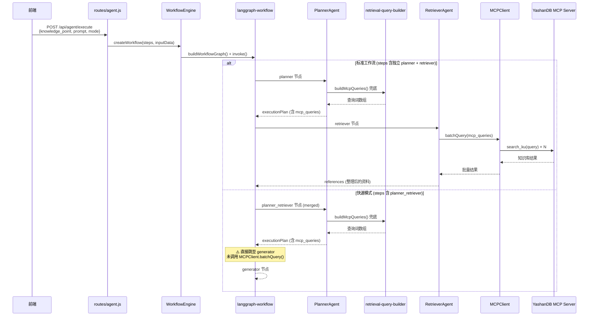
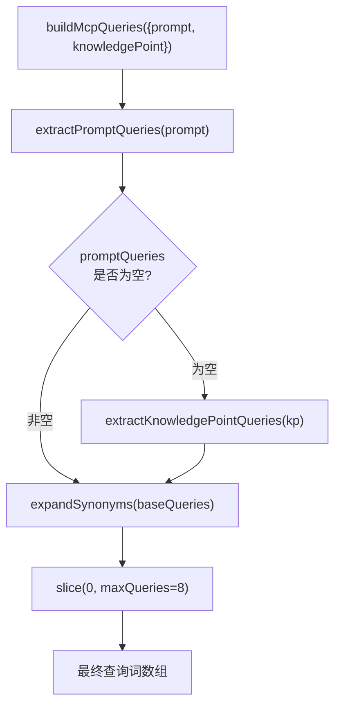
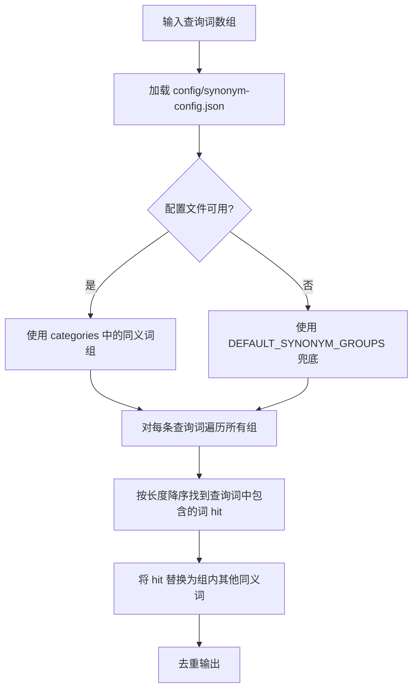
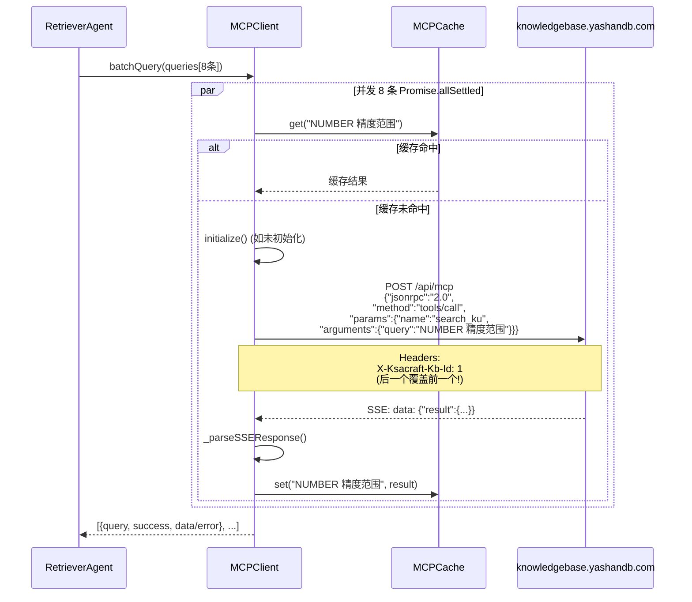
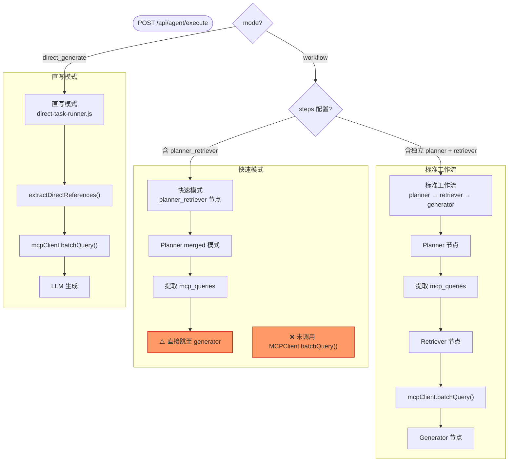
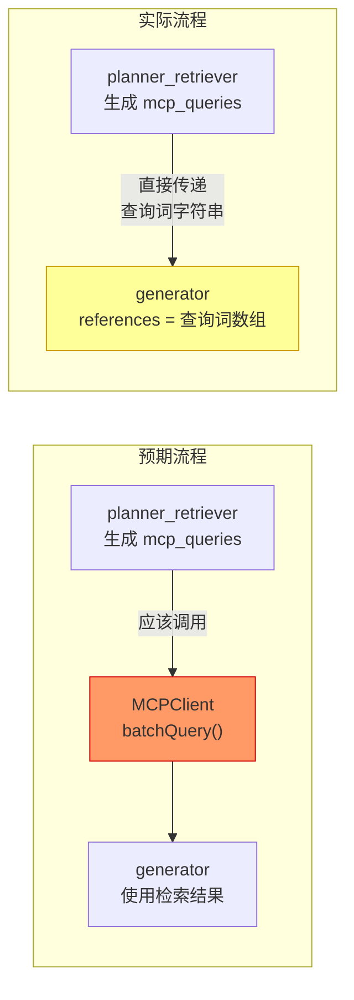

# MCP 检索流程追踪与根因分析

## 1. 文档目标

本文档以"NUMBER 数值类型"知识点为例，**逐步追踪**从前端选中知识点到最终 MCP 查询的完整调用链，说明每个环节组装了哪些关键词、调用了哪些函数，并**定位快速模式下 MCP 未被实际查询的根因**。

---

## 2. 端到端调用链总览



---

## 3. 知识点示例：NUMBER 数值类型

### 3.1 前端发送的请求体

```json
{
  "knowledge_point": {
    "name": "NUMBER 数值类型",
    "type": "SQL/开发参考",
    "description": "介绍 YashanDB 数值类型与用法",
    "part": "数据库基础",
    "chapter": "数据类型",
    "target_db": "Oracle",
    "level": "★★"
  },
  "prompt": "# YashanDB 知识文档生成任务\n...\n关键词：NUMBER 精度范围、数值类型语法、数据类型对比\n...\n```json\n{\"references\":{\"mcp_query\":\"YashanDB NUMBER 精度范围\"}}\n```",
  "mode": "workflow",
  "workflow_config": {
    "steps": [
      { "name": "planner", "agent": "planner" },
      { "name": "retriever", "agent": "retriever" },
      { "name": "generator", "agent": "generator" },
      { "name": "validator", "agent": "validator" }
    ]
  }
}
```

### 3.2 提示词中可被抽取的关键词来源

| 来源 | 位置 | 示例内容 |
|---|---|---|
| `关键词：...` | 提示词自然语言段 | `NUMBER 精度范围、数值类型语法、数据类型对比` |
| `MCP 查询：...` | 提示词自然语言段 | 如存在则直接提取 |
| `"mcp_query"` | 提示词 JSON 代码块 | `YashanDB NUMBER 精度范围` |
| 知识点字段 | `knowledge_point` 对象 | `name`、`type`、`description`、`chapter` |

---

## 4. 关键词组装流程详解

### 4.1 入口函数 `buildMcpQueries()`

文件：`lib/retrieval-query-builder.js`



### 4.2 第一步：从提示词抽取 — `extractPromptQueries()`

该函数用三种正则从提示词中提取关键词：

```
正则 1: /关键词[:：]([\s\S]*?)(?:。|\n|必须|输出|$)/
  → 匹配 "关键词：NUMBER 精度范围、数值类型语法、数据类型对比"
  → 按 、,，;；\n 分割
  → 得到: ["NUMBER 精度范围", "数值类型语法", "数据类型对比"]

正则 2: /(?:MCP\s*查询|mcp\s*查询)[:：]\s*([^\n。]+)/g
  → 匹配 "MCP 查询：xxx"
  → 按分隔符拆分

正则 3: /["']mcp_query["']\s*:\s*["']([^"']+)["']/gi
  → 匹配 JSON 中的 "mcp_query": "YashanDB NUMBER 精度范围"
  → 得到: ["YashanDB NUMBER 精度范围"]
```

### 4.3 第二步：移除产品词 — `stripProductTerms()`

```
输入: "YashanDB NUMBER 精度范围"
      ↓ 移除 /YashanDB/ig, /崖山\s*DB/ig 等
输出: "NUMBER 精度范围"
```

**目的**：MCP 知识库本身就是 YashanDB 的，搜索时带产品名会浪费 token 并可能降低匹配率。

### 4.4 第三步：清理与归一化 — `normalizeQuery()`

```
输入: "YashanDB NUMBER 精度范围"
  → stripProductTerms → " NUMBER 精度范围 "
  → 移除引号 → " NUMBER 精度范围 "
  → 移除尾部标点 → " NUMBER 精度范围 "
  → 压缩空白 → "NUMBER 精度范围"
```

### 4.5 第四步：知识点兜底 — `extractKnowledgePointQueries()`

当提示词中没有抽取到任何关键词时，从知识点字段兜底：

```
kp.name        → "NUMBER 数值类型"  → normalize → "NUMBER 数值类型"
kp.type        → "SQL/开发参考"     → normalize → "SQL/开发参考"
kp.description → "介绍 YashanDB 数值类型与用法" → normalize → "数值类型与用法"
kp.chapter     → "数据类型"         → normalize → "数据类型"
```

### 4.6 第五步：通用同义词扩展 — `expandSynonyms()`

同义词扩展是**通用功能**，不针对任何特定关键词硬编码。所有扩展规则均来自配置文件 `config/synonym-config.json`，新增领域只需编辑配置文件，无需改代码。



#### 配置文件结构

`config/synonym-config.json` 中每个 `category` 包含一组互为同义的词：

```json
{
  "categories": [
    { "name": "高可用", "synonyms": ["高可用", "HA", "主备", "主从", "故障切换", "容灾"] },
    { "name": "数据类型", "synonyms": ["数据类型", "类型映射", "数值类型", "精度", "标度"] },
    { "name": "性能调优", "synonyms": ["性能", "优化", "调优", "慢SQL", "执行计划"] },
    ...
  ]
}
```

#### 通用扩展逻辑（无硬编码）

```text
对每条查询词 query:
  对每个同义词组 group:
    按长度降序排列组内词（优先匹配更具体的词，如"增量备份"先于"备份"）
    找到 query 中包含的第一个词 hit
    对组内每个其他词 synonym:
      将 query 中的 hit 替换为 synonym → 生成新查询词
  去重
```

#### 扩展示例

| 原始查询 | 匹配同义词组 | 扩展结果 |
|---|---|---|
| `主备切换` | `[高可用, HA, 主备, 主从, 故障切换, 容灾]` | `高可用切换`、`HA切换`、`主从切换`、`故障切换切换`、`容灾切换` |
| `NUMBER 数值类型` | `[数据类型, 类型映射, 数值类型, 精度, 标度]` | `NUMBER 数据类型`、`NUMBER 类型映射`、`NUMBER 精度`、`NUMBER 标度` |
| `慢SQL 分析` | `[性能, 优化, 调优, 慢SQL, 执行计划]` | `性能分析`、`优化分析`、`调优分析`、`执行计划分析` |
| `索引重建` | `[索引, B树索引, 位图索引, 函数索引, 索引重建]` | `B树索引重建`、`位图索引重建`、`函数索引重建` |

#### 扩展新领域

只需在 `config/synonym-config.json` 的 `categories` 数组中追加新条目即可，无需修改任何代码：

```json
{ "name": "新领域", "synonyms": ["术语A", "术语B", "术语C"] }
```

### 4.7 最终输出（以 NUMBER 知识点为例）

经过 `unique()` 去重和 `slice(0, 8)` 截断后，最终发送给 MCP 的查询词：

```json
[
  "NUMBER 精度范围",
  "数值类型语法",
  "数据类型对比",
  "NUMBER 数据类型",
  "NUMBER 类型映射",
  "NUMBER 精度",
  "数据类型语法",
  "类型映射语法"
]
```

---

## 5. MCP 实际调用过程

### 5.1 MCPClient 调用链



### 5.2 MCP 配置

```json
{
  "server_url": "https://knowledgebase.yashandb.com/api/mcp",
  "timeout": 30000,
  "headers": [
    {"name": "X-Ksacraft-Kb-Id", "value": "24"},
    {"name": "X-Ksacraft-Kb-Id", "value": "1"}
  ]
}
```

⚠️ **已知问题**：两个同名 Header 导致 `customHeaders` 对象中 `value: "1"` 覆盖 `value: "24"`，实际只查询了知识库 ID=1（官方文档），知识库 ID=24（运维知识库）未被查询。

---

## 6. 两条执行路径对比

### 6.1 路径图



### 6.2 三条路径 MCP 调用情况

| 路径 | 查询词生成 | MCP 实际调用 | 状态 |
|---|---|---|---|
| 标准工作流 | ✅ Planner + query-builder 兜底 | ✅ `RetrieverAgent._retrieveContent()` 调用 `batchQuery()` | **正常** |
| 快速模式 | ✅ Planner merged 生成 `mcp_queries` | ❌ `planner_retriever` 节点只存了查询词字符串到 `references`，未调用 `batchQuery()` | **🔴 缺陷** |
| 直写模式 | ✅ `extractDirectReferences()` | ✅ `direct-task-runner.js` 直接调用 `batchQuery()` | **正常** |

---

## 7. 根因定位：快速模式未查询 MCP

### 7.1 问题代码

文件：`lib/langgraph-workflow.js` → `createPlannerRetrieverNode()`

```javascript
function createPlannerRetrieverNode(agentManager, toolManager, options = {}) {
  return async (state) => {
    const agent = agentManager.getAgent('planner');
    const output = await agent.execute(input, { mode: 'merged' });

    // ⚠️ 问题所在：只是把查询词字符串数组放入 references
    const references = output.retrieval_plan?.mcp_queries || [];

    return {
      executionPlan: output,
      references: references,  // ← 这里是 ["NUMBER 精度范围", ...] 字符串数组
      // 而非 MCP 查询后的实际知识库内容
    };
  };
}
```

### 7.2 图路由跳过了 Retriever

```javascript
if (hasMergedPlanner) {
    graph.addEdge(START, 'planner_retriever');
    graph.addEdge('planner_retriever', 'generator');  // ← 直接到 generator
    // 没有经过 retriever 节点，因此不会调用 MCPClient.batchQuery()
}
```

### 7.3 调用链断裂示意



### 7.4 前端表现

前端进度事件显示：

```
planner_retriever 完成: "规划完成，MCP 查询 8 条"
```

这里的"MCP 查询 8 条"仅表示**生成了 8 条查询词**，不代表完成了知识库查询。用户可能误以为已经查询了 MCP。

---

## 8. 其他已知问题汇总

| # | 问题 | 影响 | 代码位置 |
|---|---|---|---|
| 1 | 快速模式 `planner_retriever` 未调用 MCP | 生成文档缺少知识库实际资料 | `langgraph-workflow.js: createPlannerRetrieverNode()` |
| 2 | 同名 Header 覆盖 | 只查询了 Kb-Id=1，丢失 Kb-Id=24 | `mcp-client.js: constructor` |
| 3 | 直写模式 `references.mcp_query` 可能识别不到 | 正则只匹配 `关键词：` 和 `MCP 查询：`，JSON 字段需通过 `jsonQueryMatches` 匹配 | `retrieval-query-builder.js: extractPromptQueries()` |
| 4 | 缓存不含知识库 ID | 切换 MCP 配置后可能返回错误缓存 | `mcp-client.js: query()` |
| 5 | SSE 解析只读第一个 `data:` 行 | 多事件响应丢失数据 | `mcp-client.js: _parseSSEResponse()` |

---

## 9. 修复建议

### 9.1 快速模式修复（高优先级）

在 `createPlannerRetrieverNode()` 中增加 MCP 调用：

```javascript
function createPlannerRetrieverNode(agentManager, toolManager, options = {}) {
  return async (state) => {
    const agent = agentManager.getAgent('planner');
    const output = await agent.execute(input, { mode: 'merged' });

    const mcpQueries = output.retrieval_plan?.mcp_queries || [];
    let references = '';

    // 新增：实际调用 MCP 查询
    if (mcpQueries.length > 0 && toolManager) {
      const mcpClient = toolManager.getTool('mcp');
      const results = await mcpClient.batchQuery(mcpQueries);
      const parts = [];
      results.forEach((r, i) => {
        if (r.success && r.data) {
          const content = typeof r.data === 'string' ? r.data : JSON.stringify(r.data);
          parts.push(`### MCP: ${mcpQueries[i]}\n\n${content}`);
        }
      });
      references = parts.join('\n\n---\n\n');
    }

    return {
      executionPlan: output,
      references: references,  // ← 现在是实际检索内容
    };
  };
}
```

### 9.2 Header 覆盖修复

将 `customHeaders` 改为数组或合并同名 Header 值：

```javascript
// 方案 A：合并为逗号分隔
const headerMap = new Map();
config.headers.forEach(h => {
  const existing = headerMap.get(h.name) || [];
  existing.push(h.value);
  headerMap.set(h.name, existing);
});
headerMap.forEach((values, name) => {
  this.customHeaders[name] = values.join(',');
});
```

---

## 10. 源码索引

| 文件 | 关键函数 | 作用 |
|---|---|---|
| `lib/retrieval-query-builder.js` | `buildMcpQueries()` | 组装 MCP 查询词 |
| `lib/retrieval-query-builder.js` | `extractPromptQueries()` | 从提示词正则抽取 |
| `lib/retrieval-query-builder.js` | `expandSynonyms()` | 通用同义词扩展（从配置文件加载） |
| `config/synonym-config.json` | `categories` | 同义词组配置（可扩展） |
| `lib/agents/planner-agent.js` | `_applyPromptRetrievalFallback()` | Planner 兜底逻辑 |
| `lib/langgraph-workflow.js` | `createPlannerRetrieverNode()` | 🔴 快速模式缺陷所在 |
| `lib/langgraph-workflow.js` | `createRetrieverNode()` | 标准模式 MCP 调用 |
| `lib/agents/retriever-agent.js` | `_retrieveContent()` | 实际调用 `batchQuery()` |
| `lib/tools/mcp-client.js` | `batchQuery()` / `query()` | MCP 协议调用 |
| `lib/direct-generate/direct-task-runner.js` | `executeDirectGenerate()` | 直写模式 MCP 调用 |
| `config/mcp-config.json` | `headers` | MCP 服务端配置 |
