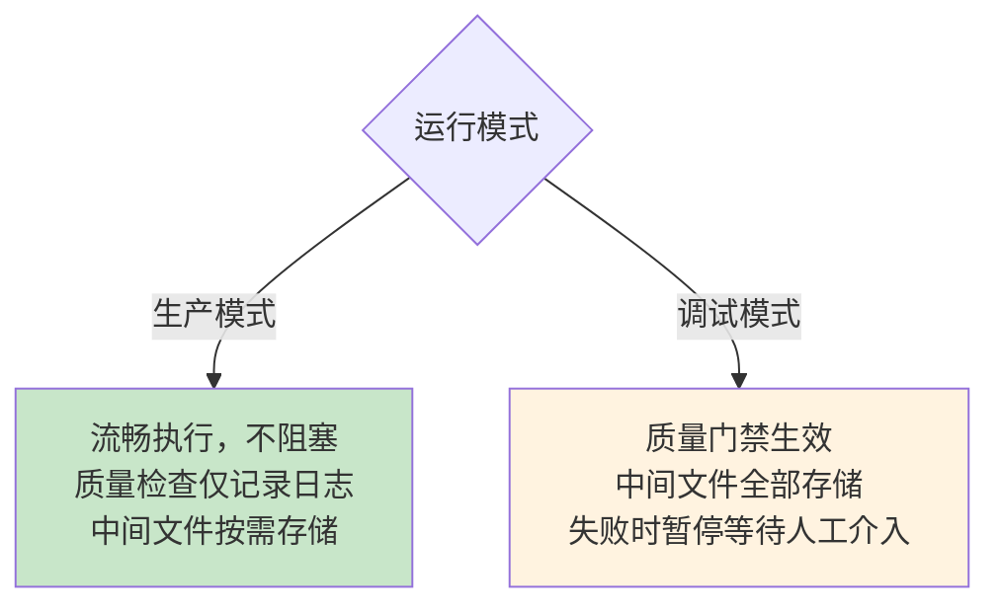
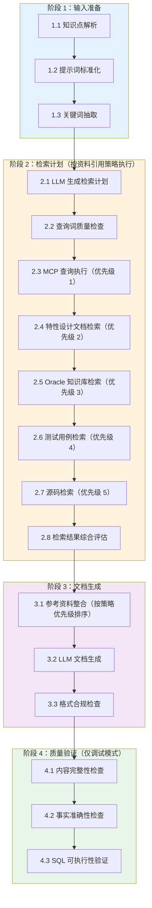
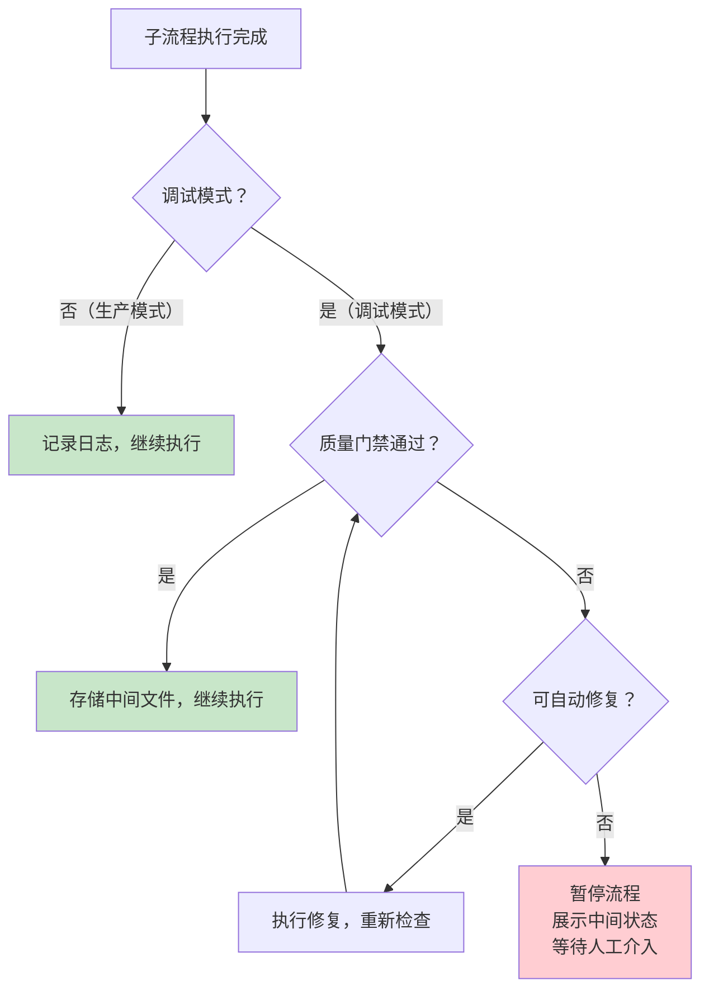

# 子流程切分与中间过程存储设计

## 1. 设计目标

将文档生成流程切分为**独立的子流程**，每个子流程有明确的输入、输出和中间文件存储。设计遵循两个核心原则：

1. **质量门禁仅用于调试阶段**：生产流程不阻塞，调试流程可拦截
2. **中间过程全部持久化**：任何阶段的输入、输出、提示词、LLM 响应都写入文件，支持事后回溯和调试
3. **资料引用策略贯穿始终**：阶段 2 和阶段 3.1 严格按照提示词中的资料引用策略执行，而非仅做 MCP 查询

---

## 2. 两种运行模式



| 维度 | 生产模式 | 调试模式 |
|---|---|---|
| 质量门禁 | 仅记录日志，不阻塞 | 检查不通过则暂停 |
| 中间文件 | 仅存储关键节点 | 每个子流程都存储 |
| LLM 同义词扩展 | 启用 | 启用，并记录扩展前后对比 |
| MCP 查询失败 | 降级继续，标记风险 | 暂停，等待人工确认 |
| 文档生成失败 | 重试后降级 | 暂停，展示中间状态 |
| 触发方式 | 默认 | 前端勾选"调试模式"或 API 参数 `debug: true` |

---

## 3. 中间过程文件存储设计

### 3.1 目录结构

所有中间文件统一存储在 `logs/intermediate/` 子目录下，按任务 ID 组织，便于后续统一处理（清理、分析、导出）：

```
logs/
├── intermediate/                          # 所有中间文件统一存储在此
│   ── task_20260720_143000_abc123/
│       ├── meta.json                      # 任务元信息（知识点、模式、时间戳）
│       ├── 01-input-preparation/
│       │   ├── 01-knowledge-point.json    # 知识点解析结果
│       │   ├── 02-standardized-prompt.md  # 标准化后的提示词
│       │   └── 03-keyword-extraction.json # 关键词抽取结果（含 LLM 扩展前后对比）
│       ├── 02-retrieval-plan/
│       │   ├── 01-retrieval-plan.json     # LLM 生成的检索计划
│       │   ├── 02-query-validation.json   # 查询词质量检查结果
│       │   ├── 03-mcp-queries/
│       │   │   ├── query-01.json          # 每条 MCP 查询的请求和响应
│       │   │   ├── query-02.json
│       │   │   ── ...
│       │   ├── 04-design-docs/            # 特性设计文档检索结果
│       │   │   └── doc-01.json
│       │   ├── 05-oracle-kb/              # Oracle 知识库检索结果
│       │   │   ├── index.json             # oracle-kb/README.md 索引
│       │   │   └── ref-01.md              # 相关 Oracle 文档内容
│       │   ├── 06-test-cases/             # 测试用例检索结果
│       │   │   └── case-01.md
│       │   ├── 07-source-code/            # 源码检索结果
│       │   │   └── src-01.md
│       │   └── 08-retrieval-assessment.json # 检索结果综合评估
│       ├── 03-document-generation/
│       │   ├── 01-context-prompt.md       # 发送给 LLM 的完整上下文提示词
│       │   ├── 02-llm-response.json       # LLM 原始响应（含 usage、model 信息）
│       │   ├── 03-generated-document.md   # 生成的文档
│       │   └── 04-format-check.json       # 格式合规检查结果
│       ├── 04-quality-validation/
│       │   ├── 01-completeness.json       # 内容完整性检查
│       │   ├── 02-accuracy.json           # 事实准确性检查
│       │   └── 03-sql-check.json          # SQL 语法检查
│       └── final-document.md              # 最终输出文档（副本）
├── backend.log                            # 应用日志（不变）
── direct_xxx.md                          # 旧格式日志（逐步迁移）
```

### 3.2 存储时机

| 子流程 | 存储内容 | 生产模式 | 调试模式 |
|---|---|---|---|
| 知识点解析 | 解析后的 JSON | ✅ | ✅ |
| 提示词标准化 | 标准化后的 Markdown | ❌ | ✅ |
| 关键词抽取 | 抽取结果 + LLM 扩展前后对比 | ❌ | ✅ |
| 检索计划 | LLM 生成的计划 JSON | ✅ | ✅ |
| MCP 查询 | 每条查询的请求/响应 | ✅（仅摘要） | ✅（完整） |
| 设计文档检索 | 匹配的设计文档内容 | ❌ | ✅ |
| Oracle 知识库检索 | 索引 + 相关文档内容 | ❌ | ✅ |
| 测试用例检索 | 匹配的测试用例 |  | ✅ |
| 源码检索 | 匹配的源码片段 | ❌ | ✅ |
| 检索评估 | 覆盖度评分 | ❌ | ✅ |
| 上下文提示词 | 发送给 LLM 的完整 prompt | ✅ | ✅ |
| LLM 响应 | 原始响应 + usage | ✅ | ✅ |
| 生成文档 | 文档内容 | ✅ | ✅ |
| 质量验证 | 各检查项结果 | ❌ | ✅ |

### 3.3 存储接口

```javascript
class ProcessStore {
  constructor(taskId, mode = 'production') {
    this.taskId = taskId;
    this.mode = mode;
    // 所有中间文件统一存储在 logs/intermediate/ 下
    this.basePath = path.join(process.cwd(), 'logs', 'intermediate', taskId);
  }

  // 每个子流程调用此方法存储中间结果
  async save(stage, filename, data) {
    const dir = path.join(this.basePath, stage);
    await fs.mkdir(dir, { recursive: true });
    const filePath = path.join(dir, filename);

    if (typeof data === 'string') {
      await fs.writeFile(filePath, data, 'utf-8');
    } else {
      await fs.writeFile(filePath, JSON.stringify(data, null, 2), 'utf-8');
    }

    logger.debug(`[process-store] Saved: ${filePath}`);
    return filePath;
  }

  // 读取中间文件（用于调试或重试）
  async load(stage, filename) {
    const filePath = path.join(this.basePath, stage, filename);
    const content = await fs.readFile(filePath, 'utf-8');
    try {
      return JSON.parse(content);
    } catch {
      return content;
    }
  }

  // 存储 MCP 查询的完整请求和响应
  async saveMcpQuery(index, query, result) {
    return this.save('02-retrieval-plan/03-mcp-queries', `query-${String(index + 1).padStart(2, '0')}.json`, {
      query,
      request: { method: 'tools/call', name: 'search_ku', arguments: { query } },
      response: result,
      timestamp: new Date().toISOString()
    }, true);
  }

  // 存储 LLM 调用的完整上下文
  async saveLlmCall(stage, messages, response) {
    return this.save(stage, 'llm-response.json', {
      request: {
        model: response.model,
        messages_count: messages.length,
        messages: messages // 完整保存，便于调试提示词
      },
      response: {
        content: response.content,
        usage: response.usage,
        model: response.model,
        finish_reason: response.finish_reason
      },
      timestamp: new Date().toISOString()
    });
  }
}
```

---

## 4. 子流程定义

### 4.1 总体流程



### 4.2 资料引用策略

提示词中定义的优先级策略，阶段 2 和阶段 3.1 必须严格遵守：

```
1. YashanDB 知识库 MCP（实时查询）        ← 最高优先级
2. 特性设计文档（references/design-docs/）
3. Oracle 知识库（references/oracle-kb/）
   - 先阅读 references/oracle-kb/README.md 获取完整文档索引
   - 根据索引找到与当前知识点相关的 Oracle 文档进行引用
4. 测试用例（references/test-cases/）
5. 源码（references/source/）              ← 最低优先级
```

**执行规则**：
- 每个优先级都要尝试检索，不因上一级失败而跳过
- 检索结果按优先级顺序整合到参考资料中
- 高优先级内容在提示词中排在前面，确保 LLM 优先参考

### 4.3 各子流程详细定义

#### 子流程 1.1：知识点解析

**输入**：前端表单数据

**处理**：
- 验证必填字段非空
- 规范化字段格式

**输出**：`01-knowledge-point.json`

**质量门禁（仅调试模式）**：
- `name` 非空且长度 ≥ 5
- `type` 为预定义类型之一

---

#### 子流程 1.2：提示词标准化

**输入**：原始提示词 + 知识点对象

**处理**：
- **注入当前日期**（解决"最后更新"日期问题）
- **自动补充 `关键词：` 标注**（从知识点 name/description 提取）
- 验证引用的 Skill/模板文件存在

**输出**：`02-standardized-prompt.md`

**关键改造**：
```javascript
function standardizePrompt(rawPrompt, knowledgePoint) {
  const currentDate = new Date().toISOString().split('T')[0];
  const keywords = extractKeywordsFromKnowledgePoint(knowledgePoint);

  let prompt = rawPrompt;
  const hasKeywordSection = prompt.includes('关键词：') || prompt.includes('关键词:');
  
  if (!hasKeywordSection && keywords.length > 0) {
    const injection = `\n\n## 关键词\n关键词：${keywords.join('、')}\n\n## 当前日期\n${currentDate}\n`;
    prompt = prompt.replace('## 知识点信息', injection + '\n## 知识点信息');
  } else if (hasKeywordSection) {
    if (!prompt.includes('当前日期')) {
      prompt += `\n\n## 当前日期\n${currentDate}\n`;
    }
  } else {
    prompt += `\n\n## 当前日期\n${currentDate}\n`;
  }

  return prompt;
}
```

**质量门禁（仅调试模式）**：
- 提示词长度 ≥ 200 字符
- 包含 `关键词：` 标注
- 包含当前日期

---

#### 子流程 1.3：关键词抽取

**输入**：标准化提示词 + 知识点对象

**处理**：
- 从 `关键词：` 标注抽取基础词
- 调用 LLM 同义词扩展（替代字符串匹配）
- 记录扩展前后对比

**输出**：`03-keyword-extraction.json`

```json
{
  "base_queries": ["字符串类型", "CHAR", "VARCHAR2", "长度语义"],
  "expanded_queries": ["字符串类型", "CHAR 类型", "VARCHAR2 类型", "NCHAR", "NVARCHAR2", "长度语义", "BYTE 语义", "CHAR 语义"],
  "expansion_method": "llm",
  "llm_request": { "model": "qwen3.7-plus", "prompt": "..." },
  "llm_response": { "content": "...", "tokens": 120 },
  "filtered_out": [],
  "count": 8
}
```

**质量门禁（仅调试模式）**：
- 基础词数量 ≥ 1
- 无垃圾词（如 `C高可用R`）

---

#### 子流程 2.1：LLM 生成检索计划

**输入**：知识点 + 关键词列表 + 提示词

**处理**：调用 LLM 生成结构化检索计划

**输出**：`01-retrieval-plan.json`

**质量门禁（仅调试模式）**：
- `mcp_queries` 非空
- 查询词数量 1-8 条

---

#### 子流程 2.2：查询词质量检查

**输入**：检索计划中的 `mcp_queries`

**处理**：
- 过滤过短（<2 字符）或过长（>30 字符）的词
- 过滤包含明显错误的词

**输出**：`02-query-validation.json`

**质量门禁（仅调试模式）**：
- 有效查询词 ≥ 1 条

---

#### 子流程 2.3：MCP 查询执行（优先级 1）

**输入**：验证后的查询词列表

**处理**：
- 并发调用 `MCPClient.batchQuery()`
- 每条查询单独存储请求和响应

**输出**：`03-mcp-queries/query-XX.json`（每条一个文件）

**存储示例**：
```json
{
  "query": "字符串类型",
  "request": {
    "method": "tools/call",
    "name": "search_ku",
    "arguments": { "query": "字符串类型" }
  },
  "response": {
    "success": true,
    "data": "YashanDB 支持 CHAR、VARCHAR2...",
    "tokens": 1200
  },
  "timestamp": "2026-07-20T14:30:00.000Z"
}
```

**质量门禁（仅调试模式）**：
- 成功率 ≥ 50%
- 若调试模式下失败，暂停等待人工确认

---

#### 子流程 2.4：特性设计文档检索（优先级 2）

**输入**：知识点名称、章节信息

**处理**：
- 扫描 `references/design-docs/` 目录
- 根据知识点名称和章节匹配相关设计文档
- 读取匹配文档的内容

**输出**：`04-design-docs/doc-XX.json`

```json
{
  "source": "references/design-docs/数据类型设计.md",
  "relevance_score": 0.85,
  "content": "YashanDB 数据类型设计规范...",
  "matched_keywords": ["字符串类型", "CHAR", "VARCHAR2"]
}
```

---

#### 子流程 2.5：Oracle 知识库检索（优先级 3）

**输入**：知识点名称、关键词列表

**处理**：
1. 读取 `references/oracle-kb/README.md` 获取完整文档索引
2. 根据索引找到与当前知识点相关的 Oracle 文档
3. 读取相关文档内容

**输出**：
- `05-oracle-kb/index.json` — Oracle 知识库索引
- `05-oracle-kb/ref-XX.md` — 相关 Oracle 文档内容

```json
{
  "index_file": "references/oracle-kb/README.md",
  "total_docs": 50,
  "matched_docs": [
    {
      "id": "P2-02-01",
      "title": "Oracle 字符串类型",
      "relevance_score": 0.9,
      "file": "references/oracle-kb/P2-02-01-字符串类型.md"
    }
  ]
}
```

---

#### 子流程 2.6：测试用例检索（优先级 4）

**输入**：知识点名称、关键词列表

**处理**：
- 扫描 `references/test-cases/` 目录
- 根据关键词匹配相关测试用例
- 读取匹配内容

**输出**：`06-test-cases/case-XX.md`

---

#### 子流程 2.7：源码检索（优先级 5）

**输入**：知识点名称、关键词列表

**处理**：
- 扫描 `references/source/` 目录
- 根据关键词匹配相关源码文件
- 读取匹配内容（限制长度，避免上下文溢出）

**输出**：`07-source-code/src-XX.md`

---

#### 子流程 2.8：检索结果综合评估

**输入**：所有优先级检索结果（MCP + 设计文档 + Oracle 知识库 + 测试用例 + 源码）

**处理**：
- 合并所有参考资料
- 评估资料覆盖度（是否覆盖知识点核心内容）
- 评估资料质量（长度、相关性、优先级分布）

**输出**：`08-retrieval-assessment.json`

```json
{
  "coverage_assessment": {
    "score": 0.8,
    "missing_topics": ["NCHAR 特殊用法"],
    "recommendation": "proceed"
  },
  "source_summary": {
    "mcp": { "queries": 3, "success": 2, "tokens": 2000 },
    "design_docs": { "files": 1, "tokens": 500 },
    "oracle_kb": { "files": 2, "tokens": 1500 },
    "test_cases": { "files": 0, "tokens": 0 },
    "source_code": { "files": 0, "tokens": 0 }
  },
  "total_length": 5000,
  "total_tokens": 1250
}
```

**质量门禁（仅调试模式）**：
- 资料总长度 ≥ 1000 字符
- 覆盖度评分 ≥ 0.6

---

#### 子流程 3.1：参考资料整合（按策略优先级排序）

**输入**：所有检索结果（阶段 2 输出）

**处理**：
- **严格按照资料引用策略的优先级顺序**组织参考资料
- 高优先级内容排在前面，确保 LLM 优先参考
- 标注每个资料来源的优先级和来源类型

**输出**：`01-context-prompt.md`

```markdown
# 参考资料

## 优先级 1：YashanDB 知识库 MCP

### MCP 查询：字符串类型
YashanDB 支持 CHAR、VARCHAR2...

### MCP 查询：CHAR VARCHAR2 区别
CHAR 是定长字符串，VARCHAR2 是变长字符串...

## 优先级 2：特性设计文档

### 数据类型设计.md
YashanDB 数据类型设计规范...

## 优先级 3：Oracle 知识库

### P2-02-01-字符串类型.md
Oracle 字符串类型包括 CHAR、VARCHAR2...

## 优先级 4：测试用例

（无匹配内容）

## 优先级 5：源码

（无匹配内容）
```

**质量门禁（仅调试模式）**：
- 上下文长度 ≤ 模型上下文窗口 80%
- 包含至少 1 个资料来源

---

#### 子流程 3.2：LLM 文档生成

**输入**：上下文提示词 + 知识点对象 + 生成配置

**处理**：调用 LLM 生成文档，完整保存请求和响应

**输出**：
- `02-llm-response.json`（完整 LLM 交互记录）
- `03-generated-document.md`（生成的文档）

**质量门禁（仅调试模式）**：
- 文档长度 ≥ 500 字符
- 包含 YAML 元数据头
- 包含当前日期

---

#### 子流程 3.3：格式合规检查

**输入**：生成的文档

**处理**：验证 YAML 元数据、章节结构、SQL 示例

**输出**：`04-format-check.json`

**质量门禁（仅调试模式）**：
- YAML 元数据完整
- 必选章节存在

---

#### 子流程 4.1-4.3：质量验证（仅调试模式）

生产模式下**跳过整个阶段 4**。调试模式下执行：
- 4.1 内容完整性检查 → `01-completeness.json`
- 4.2 事实准确性检查 → `02-accuracy.json`
- 4.3 SQL 可执行性验证 → `03-sql-check.json`

---

## 5. 质量门禁决策逻辑



### 5.1 生产模式行为

```javascript
async function runSubProcess(subProcess, input, store, mode) {
  const result = await subProcess.run(input);

  // 生产模式：始终存储关键文件
  if (mode === 'production' || subProcess.alwaysSave) {
    await store.save(subProcess.stage, subProcess.outputFile, result);
  }

  // 生产模式：质量检查仅记录日志
  if (mode === 'debug') {
    const gateResult = subProcess.qualityGate.check(result);
    if (!gateResult.passed) {
      if (gateResult.retriable) {
        return await runSubProcess(subProcess, input, store, mode);
      }
      // 调试模式：暂停等待人工介入
      await store.save(subProcess.stage, 'quality-gate-failed.json', gateResult);
      throw new QualityGatePauseError(subProcess.name, gateResult);
    }
    await store.save(subProcess.stage, 'quality-gate-passed.json', gateResult);
  } else {
    // 生产模式：记录质量日志但不阻塞
    const gateResult = subProcess.qualityGate.check(result);
    if (!gateResult.passed) {
      logger.warn(`[quality] ${subProcess.name}: ${gateResult.reason} (production mode, continuing)`);
    }
  }

  return result;
}
```

### 5.2 重试与降级策略

| 子流程 | 最大重试次数 | 降级方案 |
|---|---|---|
| 关键词抽取 | 2 | 使用原始关键词，不扩展 |
| 检索计划生成 | 2 | 使用关键词列表作为查询词 |
| MCP 查询执行 | 3 | 标记"未查询 MCP"，使用本地文件 |
| 设计文档检索 | 1 | 跳过，使用其他来源 |
| Oracle 知识库检索 | 1 | 跳过，使用其他来源 |
| 文档生成 | 2 | 降低 temperature 重试 |
| 质量验证 | 1（仅调试） | 人工确认后继续 |

---

## 6. 前端调试模式支持

### 6.1 前端增加调试开关

在 `prompt-generator.html` 的执行按钮旁增加调试模式复选框：

```html
<div class="form-group">
  <label>
    <input type="checkbox" id="debugMode"> 调试模式
  </label>
  <small>启用后：质量门禁生效、中间文件全部存储、失败时暂停</small>
</div>
```

### 6.2 API 请求增加 debug 参数

```javascript
const data = {
  prompt: promptText,
  mode: 'direct_generate',
  debug: document.getElementById('debugMode').checked,
  knowledge_point: { ... },
  ...
};
```

### 6.3 后端接收 debug 参数

```javascript
// routes/agent.js
const debugMode = req.body.debug === true;
const task = createDirectTask({
  prompt, knowledge_point, output_path,
  filename: effectiveFilename,
  template: req.body.template,
  debug: debugMode
});
```

### 6.4 调试模式下的前端展示

调试模式下，前端进度面板展示每个子流程的中间文件链接：

```
✅ 1.1 知识点解析 — 查看 [knowledge-point.json]
✅ 1.2 提示词标准化 — 查看 [standardized-prompt.md]
✅ 1.3 关键词抽取 — 查看 [keyword-extraction.json]
   基础词：4 条 → 扩展后：8 条
✅ 2.1 LLM 生成检索计划 — 查看 [retrieval-plan.json]
✅ 2.2 查询词质量检查 — 查看 [query-validation.json]
✅ 2.3 MCP 查询执行（优先级 1）— 查看 [mcp-queries/]
   成功：2/3 条
✅ 2.4 特性设计文档检索（优先级 2）— 查看 [design-docs/]
   匹配：1 个文档
✅ 2.5 Oracle 知识库检索（优先级 3）— 查看 [oracle-kb/]
   匹配：2 个文档
 3.1 参考资料整合 — 进行中...
```

---

## 7. 中间文件查看接口

新增 API 端点，支持前端查看中间文件：

```
GET /api/agent/task/:taskId/logs              # 列出所有中间文件
GET /api/agent/task/:taskId/logs/:stage/:file # 查看具体文件内容
```

```javascript
// routes/agent.js 新增
router.get('/task/:taskId/logs', async (req, res) => {
  const taskDir = path.join('logs', 'intermediate', req.params.taskId);
  if (!await fs.exists(taskDir)) {
    return res.status(404).json({ error: 'Task logs not found' });
  }
  const files = await listFilesRecursive(taskDir);
  res.json({ taskId: req.params.taskId, files });
});

router.get('/task/:taskId/logs/:stage/:file', async (req, res) => {
  const filePath = path.join('logs', 'intermediate', req.params.taskId, req.params.stage, req.params.file);
  const content = await fs.readFile(filePath, 'utf-8');
  const isJson = filePath.endsWith('.json');
  res.json({ file: req.params.file, content: isJson ? JSON.parse(content) : content });
});
```

---

## 8. 改造清单

| 模块 | 改造内容 | 优先级 |
|---|---|---|
| `lib/process-store.js` | **新增**：中间过程文件存储类（统一存储在 `logs/intermediate/`） | P0 |
| `lib/synonym-expander.js` | **新增**：LLM 同义词扩展器 | P0 |
| `lib/retrieval-query-builder.js` | 改为异步，调用 LLM 扩展 | P0 |
| `lib/direct-generate/prompt-parser.js` | 改为异步，注入关键词和日期 | P0 |
| `lib/direct-generate/direct-task-runner.js` | 拆分为子流程，集成 ProcessStore，按资料引用策略执行 | P1 |
| `lib/retrieval-strategy/` | **新增**：资料引用策略执行器（MCP + 设计文档 + Oracle + 测试用例 + 源码） | P1 |
| `lib/quality-gates/` | **新增**：质量门禁检查器 | P1 |
| `routes/agent.js` | 接收 debug 参数，新增日志查看 API | P1 |
| `frontend/prompt-generator.html` | 增加调试模式开关和中间文件展示 | P2 |
| `config/quality-config.json` | **新增**：质量阈值配置 | P2 |

---

## 9. 预期效果

| 问题 | 改造前 | 改造后 |
|---|---|---|
| MCP 查询 0 条 | 无告警，静默失败 | 调试模式暂停，生产模式记录日志 |
| 最后更新日期错误 | LLM 自行编造 | 提示词标准化阶段注入当前日期 |
| 同义词扩展垃圾词 | `CHAR` → `C高可用R` | LLM 语义理解，无子串误匹配 |
| 中间过程丢失 | 无法回溯 | 每个子流程输入输出全部持久化到 `logs/intermediate/` |
| 质量问题发现晚 | 事后验证 | 调试模式每阶段拦截 |
| 调试效率低 | 需看完整日志 | 前端直接查看中间文件 |
| 资料检索不完整 | 仅 MCP 查询 | 按 5 级优先级策略全面检索 |
