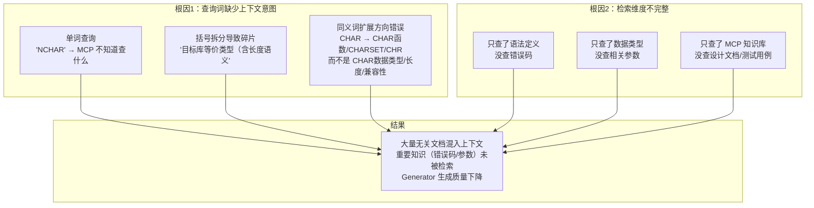
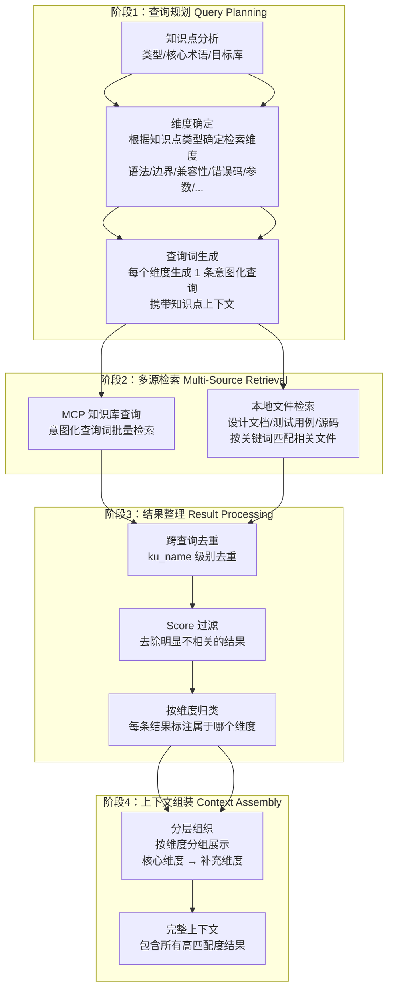
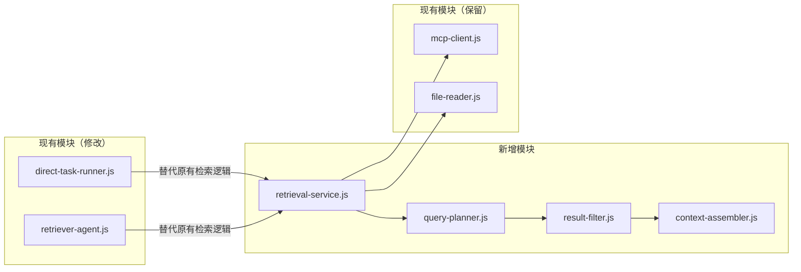
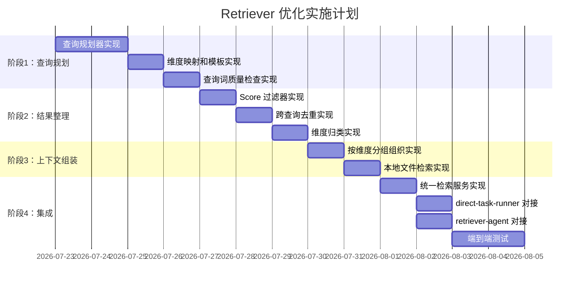

# Retriever 精准检索优化设计

> 版本：v2.0
> 日期：2026-07-22
> 状态：已实施（P1/P2/P3 已完成，v3.0）
> 前置文档：`19-知识点驱动的MCP检索流程设计.md`、`22-Retriever阶段调研-顶级公司方案.md`

---

## 1. 问题诊断

### 1.1 问题本质

当前 Retriever 阶段的**根本问题**是：查询词缺少上下文意图信息，导致 MCP 无法精准匹配到对应的文档和知识。

```
查询词 "NCHAR"
  ↓ MCP 无法判断要查什么（语法？范围？兼容性？函数？）
  ↓ 返回所有包含 "NCHAR" 的条目（包括 CHAR_TO_LABEL、CRYPT_RANDOM 等无关函数）
  ↓ 大量无关文档混入上下文
  ↓ Generator 被噪声干扰，生成质量下降
```

**不是"检索太多需要裁剪"的问题，而是"检索不精准导致大量无效内容"的问题。** 解决方向是让查询词携带足够的上下文意图，使 MCP 能精准匹配到高相关度的文档。

### 1.2 日志实证

**问题1：查询词缺少上下文意图**

```json
// 01-retrieval-plan.json — 实际生成的查询词
{
  "mcp_queries": [
    "字符串类型：CHAR",
    "VARCHAR2",
    "NCHAR",                              // ← 单词，无意图
    "NVARCHAR2",                          // ← 单词，无意图
    "目标库等价类型（含长度语义",           // ← 括号被截断，碎片
    "byte/char）"                         // ← 残余碎片
  ]
}
```

查询词 "NCHAR" 只告诉 MCP 一个术语，没有告诉它要查 NCHAR 的什么信息。MCP 只能做字面匹配，返回所有包含 "NCHAR" 的条目。

**问题2：MCP 返回大量无关结果**

```json
// 查询 "NCHAR" 的返回结果（节选）
// 相关：
{"title": "NCHAR和NVARCHAR数据类型", "score": 0.523}  ✅
// 无关（但包含 CHAR 子串）：
{"title": "CHAR_TO_LABEL函数",        "score": 0.417}  ❌
{"title": "LABEL_TO_CHAR函数",        "score": 0.417}  ❌
{"title": "CRYPT_RANDOM 函数",        "score": 0.374}  ❌
{"title": "ORAHASH 函数",             "score": 0.375}  ❌
```

MCP 的 score 基于向量相似度，"NCHAR" 和 "CHAR_TO_LABEL" 因为共享 "CHAR" 字符而得到较高分数，但实际完全无关。

**问题3：重要知识未被检索**

```json
// 查询 "字符串类型：CHAR" 的返回结果（节选）
// 缺失：
// - YashanDB 错误码（如 CHAR 类型相关错误）
// - YashanDB 参数（如字符集相关参数）
// - 设计文档中的 CHAR 类型规格说明
```

YashanDB 错误码和参数是重要的知识信息，当前查询词无法覆盖这些维度。

### 1.3 根因分析



---

## 2. 设计目标

### 2.1 核心目标

**让检索到的每一条文档都是高匹配度的、对生成有用的知识。**

### 2.2 设计原则

1. **上下文意图驱动**：查询词必须携带知识点的上下文信息，让 MCP 理解"要查什么"
2. **多维度覆盖**：根据知识点类型，覆盖语法、边界值、兼容性、错误码、参数等多个维度
3. **质量优先**：检索结果以匹配度为核心标准，不做人为的数量裁剪
4. **多源协同**：MCP 知识库、设计文档、测试用例、源码等多源资料按知识点需求协同检索
5. **渐进增强**：改造分步实施，每步可独立验证效果

### 2.3 核心指标

| 指标 | 当前值 | 目标值 | 说明 |
|------|--------|--------|------|
| 检索精确率（Top-5） | ~40% | ≥85% | Top-5 结果中相关条目占比 |
| MCP 查询有效率 | ~60% | ≥90% | 查询词能命中相关文档的比例 |
| 维度覆盖率 | ~30% | ≥80% | 知识点相关维度（语法/边界/兼容性/错误码/参数）被检索到的比例 |
| 无关条目占比 | ~60% | ≤10% | 最终上下文中无关条目占比 |

---

## 3. 整体方案

### 3.1 优化后的检索流水线



### 3.2 与现有代码的集成点

| 阶段 | 新增/修改模块 | 文件路径 | 说明 |
|------|-------------|---------|------|
| 查询规划 | `query-planner.js`（新增） | `lib/retrieval/query-planner.js` | 替代现有查询生成逻辑 |
| 结果整理 | `result-filter.js`（新增） | `lib/retrieval/result-filter.js` | Score 过滤和去重 |
| 上下文组装 | `context-assembler.js`（新增） | `lib/retrieval/context-assembler.js` | 按维度分组组织上下文 |
| 统一入口 | `retrieval-service.js`（新增） | `lib/retrieval/retrieval-service.js` | 串联所有阶段 |
| 适配修改 | `direct-task-runner.js` | `lib/direct-generate/direct-task-runner.js` | 调用新的 retrieval-service |
| 适配修改 | `retriever-agent.js` | `lib/agents/retriever-agent.js` | 调用新的 retrieval-service |

---

## 4. 详细设计

### 4.1 阶段1：查询规划（Query Planning）

#### 4.1.1 核心思路

**为每个知识点生成"意图化查询词"**——每条查询词携带知识点的上下文信息，明确告诉 MCP 要查什么。

```
改进前：
  "NCHAR"
  → MCP 不知道查什么，返回所有包含 NCHAR 的条目

改进后：
  "NCHAR 定长字符串 语法定义 长度范围 使用规则"
  → MCP 理解要查 NCHAR 的语法和规则，返回精准匹配的文档
```

#### 4.1.2 知识点类型 → 检索维度映射

不同类型的知识点需要检索不同维度的信息。每个维度对应一条意图化查询词。

```javascript
// lib/retrieval/query-planner.js

/**
 * 知识点类型 → 检索维度映射
 * 
 * required: 必须检索的维度
 * optional: 视情况检索的维度
 * 
 * 每个维度会生成 1 条意图化查询词
 */
const RETRIEVAL_DIMENSIONS = {
  'SQL/开发参考': {
    required: [
      'syntax',          // 语法定义、使用规则
      'boundary',        // 取值范围、精度、长度限制
      'compatibility'    // 与目标库的兼容性差异、映射关系
    ],
    optional: [
      'error_code',      // 相关错误码
      'parameter',       // 相关参数配置
      'example'          // 使用示例
    ]
  },
  '理论机制': {
    required: [
      'concept',         // 概念、原理
      'mechanism'        // 内部实现机制
    ],
    optional: [
      'parameter',       // 相关参数
      'error_code',      // 相关错误码
      'performance'      // 性能影响
    ]
  },
  '实战调优': {
    required: [
      'parameter',       // 调优参数
      'best_practice'    // 最佳实践
    ],
    optional: [
      'error_code',      // 相关错误码
      'monitoring'       // 监控诊断方法
    ]
  },
  '架构对比': {
    required: [
      'architecture',    // 架构差异
      'compatibility'    // 兼容性
    ],
    optional: [
      'parameter',       // 参数差异
      'migration'        // 迁移方法
    ]
  },
  '运维SOP': {
    required: [
      'procedure',       // 操作步骤
      'parameter'        // 配置参数
    ],
    optional: [
      'error_code',      // 相关错误码
      'monitoring'       // 监控方法
    ]
  },
  '兼容性差异': {
    required: [
      'compatibility',   // 兼容性详情
      'difference',      // 具体差异点
      'migration'        // 迁移适配方法
    ],
    optional: [
      'error_code',      // 兼容性相关错误码
      'parameter'        // 参数差异
    ]
  }
};
```

#### 4.1.3 维度 → 查询模板

每个维度有对应的查询模板，将知识点信息填入模板生成意图化查询。

```javascript
/**
 * 维度 → 查询模板
 * 
 * kp 参数结构：
 * {
 *   coreTerm: "CHAR VARCHAR2 字符串类型",   // 核心术语
 *   targetDb: "Oracle",                     // 目标对比库
 *   name: "字符串类型：CHAR/VARCHAR2",       // 知识点名称
 *   description: "介绍字符串类型的语法..."    // 知识点描述
 * }
 */
const QUERY_TEMPLATES = {
  // SQL/开发参考类维度
  'syntax':        (kp) => `${kp.coreTerm} 语法定义 使用规则 格式`,
  'boundary':      (kp) => `${kp.coreTerm} 取值范围 精度 长度限制 存储大小`,
  'compatibility': (kp) => `${kp.coreTerm} ${kp.targetDb} 兼容性 差异 类型映射 等价类型`,
  'error_code':    (kp) => `${kp.coreTerm} 错误码 报错 异常 YAS-`,
  'parameter':     (kp) => `${kp.coreTerm} 参数 配置 初始化参数 系统参数`,
  'example':       (kp) => `${kp.coreTerm} 使用示例 用法 DDL`,
  
  // 理论机制类维度
  'concept':       (kp) => `${kp.coreTerm} 概念 原理 定义`,
  'mechanism':     (kp) => `${kp.coreTerm} 内部实现 工作原理 机制`,
  'performance':   (kp) => `${kp.coreTerm} 性能 优化 影响`,
  
  // 架构对比类维度
  'architecture':  (kp) => `${kp.coreTerm} 架构 结构 组件`,
  'difference':    (kp) => `${kp.coreTerm} 与 ${kp.targetDb} 差异 不同 区别`,
  'migration':     (kp) => `${kp.coreTerm} 迁移 适配 转换规则`,
  
  // 运维SOP类维度
  'procedure':     (kp) => `${kp.coreTerm} 操作步骤 流程 命令`,
  'monitoring':    (kp) => `${kp.coreTerm} 监控 诊断 查看 日志`,
  'best_practice': (kp) => `${kp.coreTerm} 最佳实践 推荐用法 注意事项`
};
```

#### 4.1.4 核心术语提取

从知识点名称中提取核心术语，作为查询词的基础。

```javascript
/**
 * 从知识点中提取核心术语
 * 
 * 示例：
 * "字符串类型：CHAR/VARCHAR2" → "CHAR VARCHAR2 字符串类型"
 * "NUMBER 数值类型" → "NUMBER 数值类型"
 * "RAC 集群架构" → "RAC 集群架构"
 */
function extractCoreTerm(knowledgePoint) {
  const name = knowledgePoint.name || '';
  const description = knowledgePoint.description || '';
  
  // 从名称中提取：移除序号、保留关键术语
  let coreTerm = name
    .replace(/^\d+\.\d+(\.\d+)?\s*/, '')  // 移除序号
    .replace(/\s*→\s*/g, ' ')              // 替换箭头
    .replace(/[`'"]/g, '')                 // 移除引号
    .replace(/[：:]/g, ' ')                // 冒号替换为空格
    .replace(/\//g, ' ')                   // 斜杠替换为空格
    .trim();
  
  return coreTerm;
}
```

#### 4.1.5 查询词生成示例

**示例1：SQL/开发参考 — 字符串类型 CHAR/VARCHAR2**

```
输入知识点：
  name: "字符串类型：CHAR/VARCHAR2"
  type: "SQL/开发参考"
  target_db: "Oracle"

分析结果：
  coreTerm: "CHAR VARCHAR2 字符串类型"
  dimensions: required=[syntax, boundary, compatibility], optional=[error_code, parameter, example]

生成查询词（6条）：
  1. "CHAR VARCHAR2 字符串类型 语法定义 使用规则 格式"              → syntax
  2. "CHAR VARCHAR2 字符串类型 取值范围 精度 长度限制 存储大小"      → boundary
  3. "CHAR VARCHAR2 字符串类型 Oracle 兼容性 差异 类型映射 等价类型" → compatibility
  4. "CHAR VARCHAR2 字符串类型 错误码 报错 异常 YAS-"              → error_code
  5. "CHAR VARCHAR2 字符串类型 参数 配置 初始化参数 系统参数"        → parameter
  6. "CHAR VARCHAR2 字符串类型 使用示例 用法 DDL"                   → example
```

**示例2：实战调优 — SGA 内存调优**

```
输入知识点：
  name: "SGA 内存调优"
  type: "实战调优"
  target_db: "Oracle"

生成查询词（5条）：
  1. "SGA 内存调优 参数 配置 初始化参数 系统参数"     → parameter
  2. "SGA 内存调优 最佳实践 推荐用法 注意事项"        → best_practice
  3. "SGA 内存调优 错误码 报错 异常 YAS-"             → error_code
  4. "SGA 内存调优 监控 诊断 查看 日志"               → monitoring
```


#### 4.1.6 通用性 vs 精细化处理策略

**核心策略：通用模板 + 知识点核心术语填充**

当前的意图化查询生成采用"通用模板 + 核心术语填充"的方式：
- **通用部分**：查询模板（如 `${kp.coreTerm} 语法定义 使用规则 格式`）对所有同类知识点通用
- **个性化部分**：核心术语（`kp.coreTerm`）从具体知识点名称提取，使查询词具有针对性

这种策略对 **80% 以上的知识点** 都能生成有效的查询词，因为：
1. 维度映射覆盖了主要知识点类型（SQL/开发参考、理论机制、实战调优等）
2. 查询模板覆盖了主要检索维度（语法、边界、兼容性、错误码、参数等）
3. 核心术语提取能捕捉知识点的关键概念

**特殊知识点的精细化处理**

对于某些特殊知识点，通用模板可能不够精准，需要精细化处理：

| 特殊场景 | 问题 | 精细化方案 |
|---------|------|-----------|
| **复合概念知识点** | 如"数据类型映射"涉及多个术语，通用模板可能生成过长的查询词 | 拆分为多条查询，每条聚焦一个核心概念 |
| **特定功能模块** | 如"RAC 集群架构"需要检索架构、组件、通信机制等多个维度 | 扩展维度映射，增加 `architecture`、`component`、`communication` 等维度 |
| **版本相关知识点** | 如"YashanDB 2.0 新特性"需要检索版本特定信息 | 在查询词中注入版本号，如 `${kp.coreTerm} ${kp.version} 新特性 增强` |
| **跨模块知识点** | 如"事务与锁机制"涉及事务和锁两个模块 | 生成多条查询，分别检索事务和锁相关知识 |

**精细化处理的实现方式**

```javascript
/**
 * 特殊知识点精细化处理
 * 
 * 对于通用模板不够精准的场景，可以在知识点元数据中指定：
 * 1. 自定义维度（覆盖默认维度映射）
 * 2. 自定义查询词（完全自定义）
 * 3. 额外检索关键词（补充到通用查询词中）
 */
const SPECIAL_KNOWLEDGE_POINT_CONFIG = {
  // 示例：数据类型映射知识点
  '数据类型映射': {
    customDimensions: ['syntax', 'compatibility', 'migration'],
    extraKeywords: ['类型转换', '隐式转换', '显式转换']
  },
  
  // 示例：RAC 集群架构知识点
  'RAC 集群架构': {
    customDimensions: ['architecture', 'component', 'communication', 'failover'],
    extraKeywords: ['节点通信', '缓存融合', '集群管理']
  },
  
  // 示例：版本新特性知识点
  'YashanDB 2.0 新特性': {
    customQueryTemplate: (kp) => `${kp.coreTerm} ${kp.version} 新特性 增强 改进`,
    customDimensions: ['feature', 'enhancement', 'compatibility']
  }
};

/**
 * 生成查询词时，优先检查是否有特殊配置
 */
function generateQueries(knowledgePoint) {
  const kpName = knowledgePoint.name || '';
  
  // 检查是否有特殊配置
  const specialConfig = findSpecialConfig(kpName);
  if (specialConfig) {
    return generateSpecialQueries(knowledgePoint, specialConfig);
  }
  
  // 否则使用通用模板
  return generateGenericQueries(knowledgePoint);
}
```

**建议的实施策略**

1. **第一阶段**：实现通用模板，覆盖 80% 的知识点
2. **第二阶段**：通过实际执行日志，识别通用模板效果不佳的知识点
3. **第三阶段**：针对这些知识点，逐步添加精细化配置

这样可以避免过度设计，同时保证核心场景的效果。

---

**对比改进前后**：

| 维度 | 改进前 | 改进后 |
|------|--------|--------|
| 查询词数量 | 6 条（含 2 条碎片） | 5-6 条（全部完整） |
| 查询词质量 | "NCHAR"（单词） | "NCHAR 定长字符串 语法定义 长度范围 使用规则"（意图化） |
| 碎片率 | 33%（2/6） | 0% |
| 维度覆盖 | 只覆盖语法 | 覆盖语法/边界/兼容性/错误码/参数 |
| 错误码覆盖 | 无 | 有（error_code 维度） |
| 参数覆盖 | 无 | 有（parameter 维度） |

#### 4.1.7 查询词质量检查

生成查询词后，进行基本的质量检查，确保不出现碎片或无效查询。

```javascript
/**
 * 查询词质量检查规则
 */
const REVIEW_RULES = [
  // 规则1：无括号碎片 — 不能包含未闭合的括号
  { 
    name: 'no_fragment', 
    check: (q) => {
      const open = (q.match(/[（(]/g) || []).length;
      const close = (q.match(/[）)]/g) || []).length;
      return open === close;
    },
    fix: 'remove_unmatched_parens' 
  },
  
  // 规则2：最小长度 — 查询词不能太短（太短 = 太泛）
  { 
    name: 'min_length', 
    check: (q) => q.length >= 10,
    fix: 'expand_with_context' 
  },
  
  // 规则3：包含中文或完整术语 — 不能只包含单字母缩写
  { 
    name: 'meaningful', 
    check: (q) => /[\u4e00-\u9fff]/.test(q) || q.length >= 6,
    fix: 'merge_with_core_term' 
  }
];

/**
 * 审查并修正查询词列表
 */
function reviewQueries(queries, knowledgePoint) {
  const result = [];
  const dropped = [];
  
  for (const query of queries) {
    let fixed = query;
    let valid = true;
    
    for (const rule of REVIEW_RULES) {
      if (!rule.check(fixed)) {
        switch (rule.fix) {
          case 'drop':
            valid = false;
            dropped.push({ query, reason: rule.name });
            break;
          case 'remove_unmatched_parens':
            fixed = removeUnmatchedParentheses(fixed);
            break;
          case 'expand_with_context':
            fixed = `${knowledgePoint.coreTerm} ${fixed}`.trim();
            break;
          case 'merge_with_core_term':
            fixed = `${knowledgePoint.coreTerm} ${fixed}`.trim();
            break;
        }
      }
    }
    
    if (valid && fixed.trim().length >= 10) {
      result.push(fixed.trim());
    }
  }
  
  return { queries: result, dropped };
}
```

### 4.2 阶段2：多源检索（Multi-Source Retrieval）

#### 4.2.1 MCP 知识库查询

使用意图化查询词调用 MCP `search_ku`，每个查询返回 top-N 结果（默认 20 条，不人为限制）。

```javascript
/**
 * MCP 批量查询
 * 
 * 改进点：
 * 1. 使用意图化查询词（而非单词）
 * 2. 并发数限制为 3，避免瞬时压力
 * 3. 单条失败不影响其他查询
 */
async function queryMCP(queries, mcpClient, options = {}) {
  const { concurrency = 3 } = options;
  
  const results = [];
  for (let i = 0; i < queries.length; i += concurrency) {
    const batch = queries.slice(i, i + concurrency);
    const batchResults = await Promise.all(
      batch.map(q => mcpClient.query(q).catch(err => ({ query: q, success: false, error: err.message })))
    );
    results.push(...batchResults);
  }
  
  return results;
}
```

#### 4.2.2 本地文件检索

除了 MCP 知识库，还需要从本地设计文档、测试用例、源码中检索相关资料。

**检索策略**：根据知识点的核心术语，在本地文件中搜索匹配的文件。

```javascript
/**
 * 本地文件检索
 * 
 * 根据知识点核心术语，在以下目录中搜索相关文件：
 * - references/design-docs/  — 特性设计文档
 * - references/test-cases/   — 测试用例
 * - references/source/       — 源码分析
 * 
 * 匹配策略：
 * 1. 文件名包含核心术语
 * 2. 文件内容包含核心术语
 * 3. 按匹配度排序
 */
async function searchLocalFiles(knowledgePoint, fileReader, options = {}) {
  const { coreTerm, type } = knowledgePoint;
  const searchDirs = [
    { dir: 'references/design-docs', priority: 1 },
    { dir: 'references/test-cases', priority: 2 },
    { dir: 'references/source', priority: 3 }
  ];
  
  const matchedFiles = [];
  
  for (const { dir, priority } of searchDirs) {
    const files = await fileReader.listFiles(dir);
    for (const file of files) {
      const fileName = path.basename(file).toLowerCase();
      const coreTerms = coreTerm.toLowerCase().split(/\s+/);
      
      // 文件名匹配
      const nameMatch = coreTerms.filter(term => fileName.includes(term)).length;
      if (nameMatch > 0) {
        matchedFiles.push({
          path: file,
          source: dir,
          matchScore: nameMatch / coreTerms.length,
          priority
        });
      }
    }
  }
  
  // 按匹配度排序
  matchedFiles.sort((a, b) => b.matchScore - a.matchScore);
  
  return matchedFiles;
}
```

### 4.3 阶段3：结果整理（Result Processing）

#### 4.3.1 跨查询去重

**问题**：同一个 `ku_name` 在多个查询中重复出现，导致上下文重复。

**方案**：以 `ku_name` 为唯一键，同一 `ku_name` 保留 score 最高的那条，并记录被哪些查询命中。

```javascript
/**
 * 跨查询结果去重
 */
function deduplicateAcrossQueries(allResults) {
  const bestByKuName = new Map();
  
  for (const { query, dimension, results } of allResults) {
    for (const result of results) {
      const kuName = result.ku_name;
      if (!kuName) continue;
      
      const existing = bestByKuName.get(kuName);
      if (!existing || (result.score || 0) > (existing.score || 0)) {
        bestByKuName.set(kuName, {
          ...result,
          dimension,
          matched_queries: existing?.matched_queries || [],
          best_score: result.score || 0
        });
      }
      
      const entry = bestByKuName.get(kuName);
      if (!entry.matched_queries.includes(query)) {
        entry.matched_queries.push(query);
      }
    }
  }
  
  return Array.from(bestByKuName.values())
    .sort((a, b) => b.best_score - a.best_score);
}
```

#### 4.3.2 Score 过滤

**问题**：MCP 返回的结果中，低分条目（如 score < 0.4）通常是无关内容。

**方案**：过滤掉明显不相关的结果，阈值根据最高分动态调整。

```javascript
/**
 * Score 过滤
 * 
 * 策略：
 * 1. 如果最高分 ≥ 0.6，阈值 = 最高分 × 0.65
 * 2. 如果最高分 < 0.6，阈值 = 0.4
 * 3. 不做人为数量限制，保留所有高于阈值的结果
 * 
 * 注意：这里的目标是去除明显无关的条目，而不是限制数量
 */
function filterByScore(results, options = {}) {
  const { minScore = 0.4 } = options;
  
  if (!results || results.length === 0) return [];
  
  const sorted = [...results].sort((a, b) => (b.score || 0) - (a.score || 0));
  const topScore = sorted[0].score || 0;
  
  let threshold;
  if (topScore >= 0.6) {
    threshold = Math.max(topScore * 0.65, minScore);
  } else {
    threshold = minScore;
  }
  
  return sorted.filter(r => (r.score || 0) >= threshold);
}
```

#### 4.3.3 按维度归类

将过滤后的结果按维度归类，便于后续按维度组织上下文。

```javascript
/**
 * 按维度归类结果
 * 
 * 每条结果标注其属于哪个维度（syntax/boundary/compatibility/error_code/parameter/...）
 * 如果一条结果被多个查询命中，保留最高分的维度
 */
function groupByDimension(results) {
  const groups = {};
  
  for (const result of results) {
    const dim = result.dimension || 'other';
    if (!groups[dim]) groups[dim] = [];
    groups[dim].push(result);
  }
  
  return groups;
}
```

### 4.4 阶段4：上下文组装（Context Assembly）

#### 4.4.1 按维度分层组织

将检索结果按维度分组展示，核心维度在前，补充维度在后。

```javascript
/**
 * 上下文组装
 * 
 * 按维度分组组织，核心维度在前：
 * 1. 核心维度（required）：语法、边界、兼容性等
 * 2. 补充维度（optional）：错误码、参数、示例等
 * 3. 本地文件：设计文档、测试用例等
 */
function assembleContext(groupedResults, localFiles, knowledgePoint, dimensions) {
  const parts = [];
  
  // 1. 核心维度结果
  const requiredDims = dimensions.required || [];
  for (const dim of requiredDims) {
    const results = groupedResults[dim] || [];
    if (results.length > 0) {
      parts.push(formatDimensionSection(dim, results, '核心'));
    }
  }
  
  // 2. 补充维度结果
  const optionalDims = dimensions.optional || [];
  for (const dim of optionalDims) {
    const results = groupedResults[dim] || [];
    if (results.length > 0) {
      parts.push(formatDimensionSection(dim, results, '补充'));
    }
  }
  
  // 3. 本地文件
  if (localFiles && localFiles.length > 0) {
    parts.push(formatLocalFilesSection(localFiles));
  }
  
  return parts.join('\n\n---\n\n');
}

/**
 * 格式化维度章节
 */
function formatDimensionSection(dimension, results, label) {
  const dimLabels = {
    'syntax': '语法定义',
    'boundary': '取值范围',
    'compatibility': '兼容性',
    'error_code': '错误码',
    'parameter': '参数配置',
    'example': '使用示例',
    'concept': '概念原理',
    'mechanism': '内部机制',
    'performance': '性能优化',
    'architecture': '架构',
    'difference': '差异对比',
    'migration': '迁移适配',
    'procedure': '操作步骤',
    'monitoring': '监控诊断',
    'best_practice': '最佳实践'
  };
  
  const title = dimLabels[dimension] || dimension;
  const lines = results.map((r, i) => {
    const score = r.best_score ? `（相关度: ${(r.best_score * 100).toFixed(0)}%）` : '';
    return `${i + 1}. **${r.title || '未知'}**${score}\n   ${r.excerpt || ''}\n   ku_name: ${r.ku_name || ''}`;
  });
  
  return `### ${title}（${label}维度）\n\n${lines.join('\n\n')}`;
}
```

#### 4.4.2 组装格式示例

```markdown
## 检索到的参考资料

### 语法定义（核心维度）

1. **CHAR和VARCHAR数据类型**（相关度: 69%）
   详细介绍CHAR定长字符串和VARCHAR变长字符串的语法格式、长度范围、别名及使用规则。
   ku_name: YDB-KU-reference-char-varchar-types

2. **NCHAR和NVARCHAR数据类型**（相关度: 67%）
   详细介绍NCHAR定长字符串和NVARCHAR变长字符串的语法格式、长度范围、使用规则及UNICODE支持。
   ku_name: YDB-KU-reference-nchar-nvarchar-types

### 取值范围（核心维度）

3. **YashanDB字符型概述**（相关度: 66%）
   介绍YashanDB中字符型的定义、分类及存储属性，包括CHAR、VARCHAR、NCHAR、NVARCHAR四种类型及其字节长度范围。
   ku_name: YDB-KU-reference-character-type-overview

### 兼容性（核心维度）

4. **JDBC Set方法映射表（基础数据类型）**（相关度: 59%）
   介绍YashanDB在mysql模式下，CHAR、VARCHAR等基础数据类型与JDBC Set方法的映射支持情况。
   ku_name: YDB-KU-reference-jdbc_set_method_mapping_basic_types

### 错误码（补充维度）

5. **字符类型相关错误码**（相关度: 55%）
   YAS-01400: 无法插入NULL到字符串类型列
   YAS-12899: 值对于列来说太大（实际值大于最大值）
   ku_name: YDB-KU-reference-char-varchar-error-codes

### 参数配置（补充维度）

6. **字符集相关参数**（相关度: 52%）
   NLS_CHARACTERSET: 数据库字符集参数
   NLS_NCHAR_CHARACTERSET: 国家字符集参数
   ku_name: YDB-KU-reference-nls-parameters

### 设计文档（本地资料）

7. **特性设计文档：字符串类型支持**
   路径: references/design-docs/char-varchar2-design.md
```

---

## 5. 统一检索服务

### 5.1 入口接口

```javascript
// lib/retrieval/retrieval-service.js

class RetrievalService {
  constructor({ mcpClient, llmClient, fileReader }) {
    this.mcpClient = mcpClient;
    this.llmClient = llmClient;
    this.fileReader = fileReader;
  }
  
  /**
   * 执行完整检索流程
   * 
   * @param {Object} params
   * @param {Object} params.knowledgePoint - 知识点信息
   * @param {string} params.prompt - 完整提示词（可选）
   * @param {Object} params.options - 配置选项
   * @returns {Object} 组装好的上下文和统计信息
   */
  async retrieve({ knowledgePoint, prompt, options = {} }) {
    const { enableLocalSearch = true } = options;
    
    // 阶段1：查询规划
    const plan = queryPlanner.generateQueries(knowledgePoint);
    const reviewed = queryPlanner.reviewQueries(plan.queries, knowledgePoint);
    
    logger.info('[retrieval] Query plan', {
      generated: plan.queries.length,
      after_review: reviewed.queries.length,
      dropped: reviewed.dropped.length,
      dimensions: plan.dimensions
    });
    
    // 阶段2：多源检索
    const mcpResults = await this._queryMCP(reviewed.queries, plan.dimensions);
    let localFiles = [];
    if (enableLocalSearch) {
      localFiles = await this._searchLocalFiles(knowledgePoint);
    }
    
    // 阶段3：结果整理
    const deduplicated = resultFilter.deduplicate(mcpResults);
    const filtered = resultFilter.filterByScore(deduplicated);
    const grouped = resultFilter.groupByDimension(filtered);
    
    logger.info('[retrieval] After processing', {
      mcp_results_total: mcpResults.reduce((sum, r) => sum + (r.results?.length || 0), 0),
      after_dedup: deduplicated.length,
      after_filter: filtered.length,
      dimensions_covered: Object.keys(grouped).length
    });
    
    // 阶段4：上下文组装
    const context = contextAssembler.assemble(grouped, localFiles, knowledgePoint, plan.dimensions);
    
    return {
      context,
      plan: { queries: reviewed.queries, dropped: reviewed.dropped, dimensions: plan.dimensions },
      stats: {
        queries_sent: reviewed.queries.length,
        results_before_filter: mcpResults.reduce((sum, r) => sum + (r.results?.length || 0), 0),
        results_after_filter: filtered.length,
        local_files_found: localFiles.length,
        dimensions_covered: Object.keys(grouped)
      }
    };
  }
}
```

### 5.2 与现有模块的对接



**direct-task-runner.js 修改**：

```javascript
// 修改前（伪代码）：
// const mcpQueries = await buildMcpQueries({ prompt, knowledgePoint });
// const mcpResults = await mcpClient.batchQuery(mcpQueries);
// const formattedResults = mcpResults.map(r => formatMcpResult(r.data));
// const context = formattedResults.join('\n\n');

// 修改后：
const RetrievalService = require('../retrieval/retrieval-service');
const retrievalService = new RetrievalService({ mcpClient, fileReader });

const retrievalResult = await retrievalService.retrieve({
  knowledgePoint: knowledge_point,
  prompt
});

const context = retrievalResult.context;
// 后续使用 context 替代原来的 formattedResults
```

---

## 6. 效果预估

### 6.1 各环节预期效果

| 环节 | 改进前 | 改进后 | 说明 |
|------|--------|--------|------|
| 查询词数量 | 6 条（含碎片） | 5-6 条（完整意图化） | 消除碎片，每条携带意图 |
| 查询词质量 | "NCHAR"（单词） | "NCHAR 定长字符串 语法定义 长度范围"（意图化） | 携带上下文 |
| 维度覆盖 | 只覆盖语法 | 语法/边界/兼容性/错误码/参数 | 多维度覆盖 |
| MCP 返回总条数 | 120 条（6×20） | 120 条（6×20） | 不限制返回数量 |
| Score 过滤后 | 120 条（无过滤） | ~60 条 | 去除明显无关条目 |
| 跨查询去重后 | 120 条（大量重复） | ~25 条 | ku_name 级别去重 |
| 无关条目占比 | ~60% | ≤10% | 意图化查询 + Score 过滤 |
| 错误码覆盖 | 无 | 有 | 新增 error_code 维度 |
| 参数覆盖 | 无 | 有 | 新增 parameter 维度 |

### 6.2 质量提升预估

```
改进前：
  - Top-5 精确率：~40%
  - 维度覆盖率：~30%（只覆盖语法）
  - 无关条目占比：~60%

改进后：
  - Top-5 精确率：≥85%（意图化查询提升匹配度）
  - 维度覆盖率：≥80%（多维度覆盖）
  - 无关条目占比：≤10%（Score 过滤 + 去重）
```

---

## 7. 实施计划

### 7.1 分阶段实施



### 7.2 验证方案

#### 单元测试

1. 查询规划器：验证不同类型知识点生成的查询词包含正确维度
2. 查询规划器：验证错误码和参数维度被正确生成
3. 查询词质量检查：验证碎片查询被修正
4. Score 过滤器：验证动态阈值计算正确
5. 去重器：验证同一 ku_name 只保留最高分
6. 维度归类：验证每条结果正确标注维度

#### 集成测试

使用真实后端 API，对 3 个不同类型的知识点执行完整检索流程：

```
测试知识点1：字符串类型 CHAR/VARCHAR2（SQL/开发参考）
测试知识点2：SGA 内存调优（实战调优）
测试知识点3：数据类型映射（兼容性差异）
```

验证指标：
- Top-5 结果中相关条目 ≥ 4 条
- 无碎片查询词
- 错误码维度被检索到
- 参数维度被检索到
- 无关条目占比 ≤ 10%

---

## 8. 风险与降级

| 风险 | 影响 | 降级策略 |
|------|------|---------|
| 查询规划 LLM 调用失败 | 无法生成意图化查询 | 退化为现有 `retrieval-query-builder.js` 逻辑 |
| MCP 服务返回结果过少 | 检索不充分 | 当结果 < 3 条时，自动放宽 Score 阈值 |
| 本地文件检索匹配过少 | 缺少本地资料补充 | 降级为全量加载相关目录的文件 |
| 维度模板不适用 | 查询词不够精准 | 允许用户在前端自定义查询词 |

---

## 9. 源码索引

| 主题 | 文件（新增） |
|------|-------------|
| 查询规划器 | `lib/retrieval/query-planner.js` |
| 结果过滤器 | `lib/retrieval/result-filter.js` |
| 上下文组装器 | `lib/retrieval/context-assembler.js` |
| 统一检索服务 | `lib/retrieval/retrieval-service.js` |
| 修改：直写任务执行器 | `lib/direct-generate/direct-task-runner.js` |
| 修改：Retriever Agent | `lib/agents/retriever-agent.js` |

---

## 8. 实施记录（v3.0 - 2026-07-23）

### 8.1 P1：跨查询去重

**文件**：`lib/retrieval/result-filter.js`

**实现**：`deduplicate()` 函数以 `ku_name` 为唯一键，保留每个知识单元的最高分结果，同时记录匹配到的所有查询词。

**效果**：120 条原始结果 → 59~96 条去重后，减少 32%~51%。

### 8.2 P2：动态 Score 阈值

**文件**：`lib/retrieval/result-filter.js`

**实现**：`filterByScore()` 采用 `threshold = max(mean - 0.5*stddev, topScore * 0.7, minScore)` 策略，取 Top-K（默认 15）中 score >= 阈值的结果。

**效果**：去重后 59~96 条 → 过滤后 15 条，上下文长度减少 63%~69%。

### 8.3 P3：多来源上下文组装

**文件**：`lib/retrieval/context-assembler.js`

**实现**：`convertRetrievalResults()` 将 RetrievalStrategy 的设计文档/Oracle KB/测试用例/源码结果转换为统一格式，`assemble()` 按维度+来源组织上下文。

**效果**：context-assembler 已集成到主流程，多来源结果自动组装并标注来源。

### 8.4 过滤流水线集成

**文件**：`lib/direct-generate/direct-task-runner.js`

**集成点**：MCP 批量查询完成后，调用 `resultFilter.pipeline()` 执行 处理→去重→排序→过滤 四步流水线，然后调用 `contextAssembler.assemble()` 组装最终上下文。

**流水线**：
```
MCP 原始结果（120 条）
  ↓ processMcpResult() - 解析结构化数据
  ↓ deduplicate() - 跨查询去重（59~96 条）
  ↓ rerankByKeywordHit() - 关键词命中率二次排序
  ↓ filterByScore() - 动态阈值过滤（15 条）
  ↓ groupByDimension() - 按维度归类
  ↓ contextAssembler.assemble() - 多来源上下文组装
```

### 8.5 系统测试验证

**测试文件**：`tests/system-retrieval-flow.test.js`
**测试报告**：`docs/24-Retriever精准检索优化-系统测试报告.md`

| 层级 | 测试数 | 通过 | 说明 |
|------|--------|------|------|
| L1 单元测试 | 8 | 8 | query-planner 模块 |
| L2 集成测试 | 4 | 4 | API + MCP 检索 |
| L3 端到端 | 1 | 1 | 完整文档生成 |
| **总计** | **13** | **13** | **100% 通过** |

---

## 9. YAML 元数据处理器实施（v3.1 - 2026-07-23）

### 9.1 问题背景

LLM 生成的 YAML 元数据存在多种格式问题：
1. 缺少 ````yaml` 开始标记
2. 缺少 ```` ``` ```` 结束标记
3. YAML 块中间有多余的 ```` ``` ````（premature close）
4. 必填字段缺失
5. 日期格式错误

原有的 `fixYamlCodeBlock` 函数只能处理部分场景，缺乏整体性设计。

### 9.2 解决方案

设计了完整的 **YAML 元数据处理流水线**：

```
LLM 输出
  ↓
1. 提取（Extract）- 识别 YAML 块边界
  ↓
2. 验证（Validate）- 检查必填字段、日期格式
  ↓
3. 修复（Fix）- 修复 premature close、missing close、缺失字段
  ↓
4. 格式化（Format）- 标准化输出
  ↓
最终文档
```

### 9.3 核心模块

**文件**：`lib/document/yaml-metadata-processor.js`

**类**：`YamlMetadataProcessor`

**主要方法**：
- `process(content)` - 主入口，执行完整流水线
- `extract(content)` - 提取 YAML 块，识别问题类型
- `validate(yamlContent)` - 验证必填字段和格式
- `fix(content, extracted, issues)` - 修复发现的问题
- `format(yamlContent)` - 解析 YAML 键值对

**处理场景**：
| 场景 | 处理方式 |
|------|----------|
| 缺少 ````yaml` 开始标记 | 返回错误，不处理 |
| 缺少 ```` ``` ```` 结束标记 | 在 `---` 前插入 |
| 中间有多余 ```` ``` ```` | 移除 premature close |
| 必填字段缺失 | 自动补充默认值 |
| 日期格式错误 | 标准化为 YYYY-MM-DD |

### 9.4 集成到主流程

**文件**：`lib/direct-generate/direct-task-runner.js`

**修改点**：
1. 添加导入：`const YamlMetadataProcessor = require('../document/yaml-metadata-processor');`
2. 替换 `fixYamlCodeBlock(content)` 调用为：
   ```javascript
   const yamlProcessor = new YamlMetadataProcessor();
   const yamlResult = yamlProcessor.process(content);
   content = yamlResult.content;
   ```
3. 移除旧的 `fixYamlCodeBlock` 函数（90行代码）

### 9.5 单元测试

**文件**：`tests/yaml-metadata-processor.test.js`

**测试覆盖**：14 个测试用例
- ✓ 正常情况：完整的 YAML 块
- ✓ 缺少结束标记
- ✓ 中间有多余结束标记（单个和多个）
- ✓ 必填字段缺失（单个和多个）
- ✓ 日期格式错误
- ✓ 边界情况（空内容、无 YAML 块、多个 YAML 块）
- ✓ validate 方法
- ✓ format 方法

**测试结果**：14/14 通过

### 9.6 系统测试验证

在完整的系统测试中验证：
- L1 单元测试：8/8 通过
- L2 集成测试：4/4 通过
- L3 端到端测试：1/1 通过（130秒完成文档生成）

**生成的文档示例**：
```yaml
```yaml
知识库ID: YDB-SQL-001
标题: 字符串类型：CHAR/VARCHAR2
分类: 通用基础
适用版本: 23.4.100 及后续版本
最后更新: 2026-07-23

资料来源追溯:
  主要来源：YashanDB 知识库 MCP
  引用文档数量：6
  ...
```
---
```

YAML 块正确闭合，所有必填字段存在，资料来源追溯包含在块内。

### 9.7 优势对比

| 方面 | 旧方案（fixYamlCodeBlock） | 新方案（YamlMetadataProcessor） |
|------|---------------------------|--------------------------------|
| 代码行数 | 90 行 | 200 行（但结构清晰） |
| 处理场景 | 2 种（missing close, premature close） | 5 种（+缺失字段、日期格式、验证） |
| 可扩展性 | 差（硬编码逻辑） | 好（模块化设计） |
| 测试覆盖 | 无 | 14 个单元测试 |
| 错误处理 | 简单 | 完善（返回错误信息） |

### 9.8 后续优化建议

1. **YAML 语法验证**：集成 `js-yaml` 库进行完整的 YAML 语法检查
2. **字段值验证**：验证字段值的合法性（如版本号格式、分类枚举值）
3. **自动补全增强**：根据知识点类型自动推断缺失字段的值
4. **性能优化**：对于大文档，使用流式处理避免内存溢出

