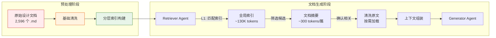
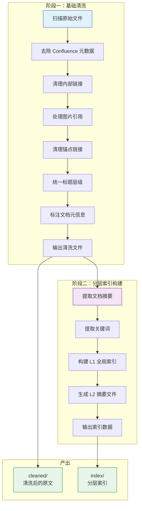
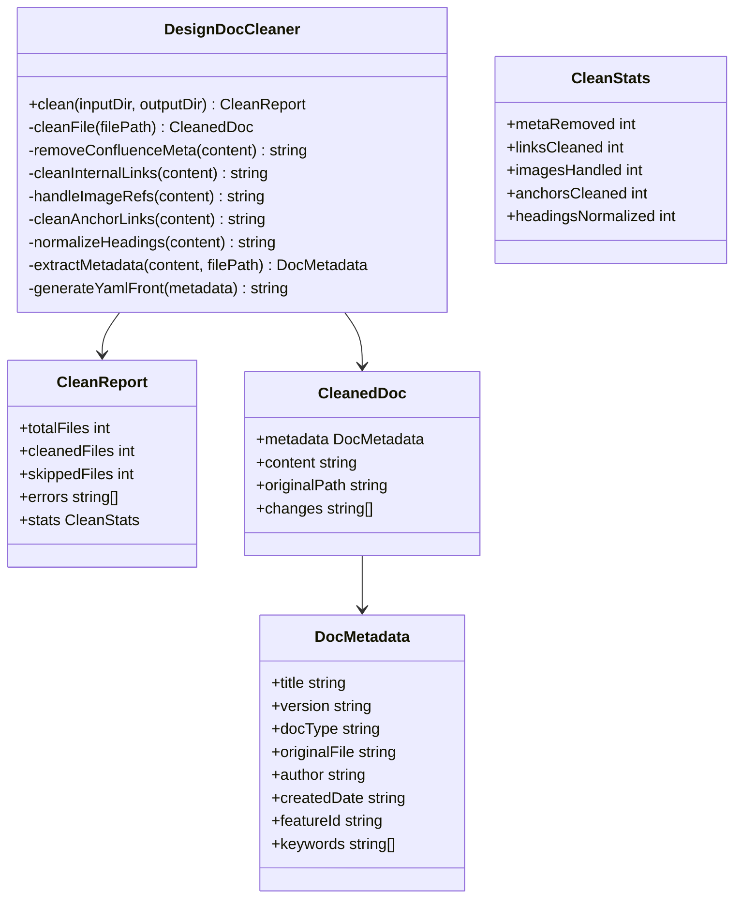
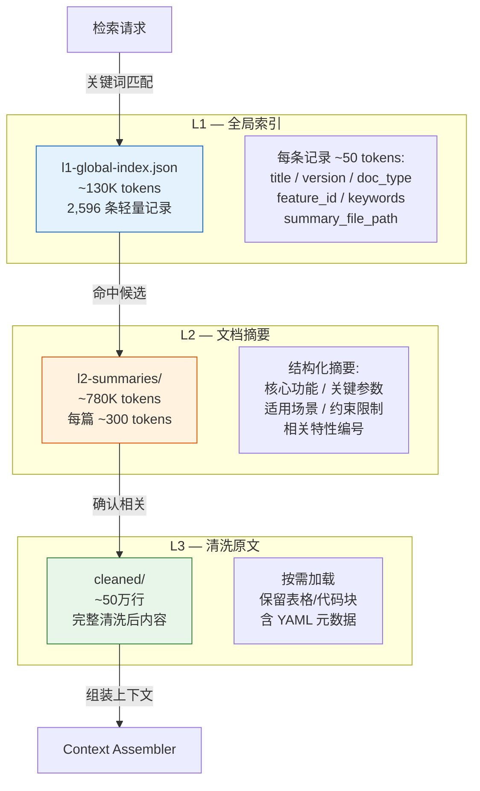
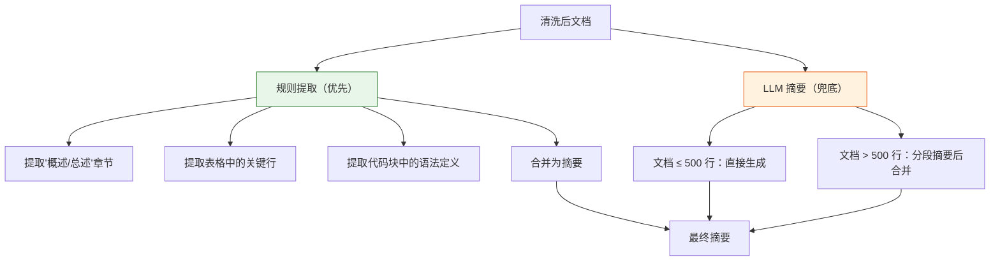
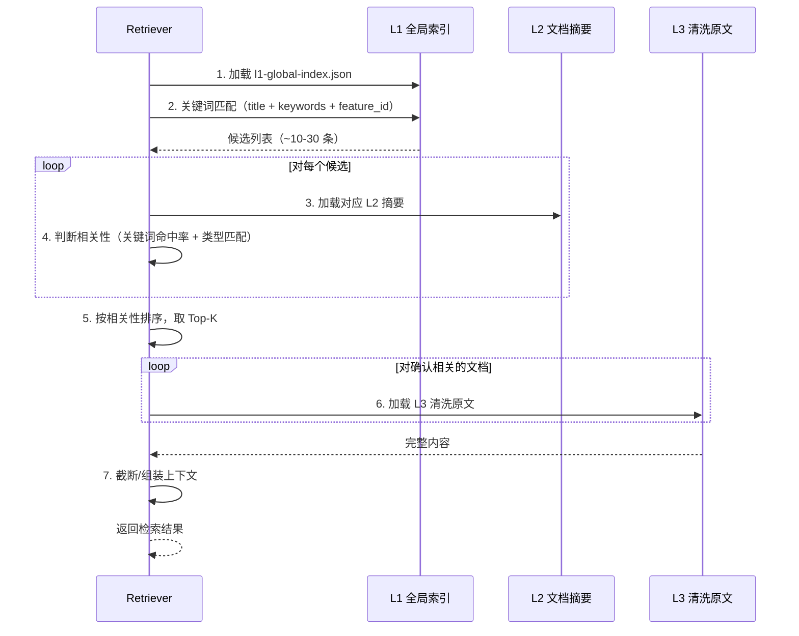
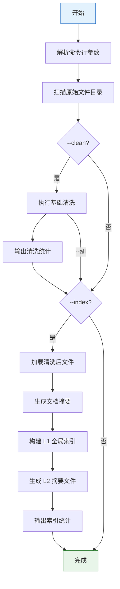

# 26-设计文档预处理与分层索引设计

> 版本：v1.0
> 日期：2026-07-23
> 状态：设计中
> 前置文档：`19-知识点驱动的MCP检索流程设计.md`、`23-Retriever精准检索优化设计.md`

---

## 1. 概述

### 1.1 背景

`references/design-docs/YashanDB 文档 主页/` 目录包含从 Confluence 导出的 YashanDB 各版本设计文档，是文档生成系统最权威的参考资料来源。当前该目录存在以下问题，无法直接用于检索和文档生成：

| 问题 | 数据 | 影响 |
|------|------|------|
| 文件数量庞大 | 2,596 个 `.md` 文件，~59.5 万行 | 关键词匹配效率低，检索噪声大 |
| Confluence 格式噪音 | 87% 文件含内部链接（`conf.yasdb.com`/`jira.yasdb.com`/`pingcode.yasdb.com`） | 不可达链接干扰 LLM 理解 |
| 图片引用失效 | 42% 文件含 `` 引用 | 图片不可用，但 alt 文本可能有价值 |
| 跨版本冗余 | v23.2 含 12 个小版本，同一特性多次出现 | 重复内容浪费 token |
| 元数据干扰 | 每个文件头部含 `Created by ... on ...` | 对知识内容无贡献 |
| 缺乏索引 | 无 README 或索引文件 | Retriever 无法高效定位相关文档 |

### 1.2 设计目标

通过 **基础清洗** + **分层索引** 两阶段预处理，将原始设计文档转化为可高效检索的知识资产：

1. **基础清洗**：去除格式噪音，统一文档结构，保留全部知识内容
2. **分层索引**：构建"全局索引 → 文档摘要 → 清洗原文"三层结构，支持渐进式检索

### 1.3 与现有架构的关系



本方案与现有 `retrieval-strategy/index.js` 中的 `executeDesignDocsRetrieval()` 方法对接，替换其当前的简单关键词扫描逻辑。

---

## 2. 数据画像

### 2.1 文件规模

| 版本 | 文件数 | 说明 |
|------|--------|------|
| YashanDB v23.1 | 736 | 含需求分析/特性设计/测试设计/架构设计/开发概要 |
| YashanDB v23.2 | 1,341 | 含 12 个小版本（v23.2.1 ~ v23.2.12），文档量最大 |
| YashanDB v23.3 | 240 | 单版本 |
| YashanDB v23.4 | 279 | 单版本 |
| **合计** | **2,596** | **~59.5 万行** |

### 2.2 文档类型分布

| 文档类型 | 文件数 | 占比 | 知识密度 |
|----------|--------|------|----------|
| 特性设计 | 1,118 | 43% | 高（功能描述/语法/参数/示例） |
| 测试设计 | 1,072 | 41% | 中（测试范围/用例/预期结果） |
| 需求分析 | 149 | 6% | 高（竞品分析/原型验证/需求来源） |
| 开发概要 | 124 | 5% | 中高（模块设计/接口定义） |
| 概要设计 | 109 | 4% | 中高（方案设计/关键技术点） |
| 架构设计 | 10 | <1% | 最高（系统架构/组件关系） |

### 2.3 文件长度分布

| 行数区间 | 文件数 | 占比 | 说明 |
|----------|--------|------|------|
| ≤10 行 | 171 | 7% | 多为空壳模板或占位文件 |
| 11-50 行 | 133 | 5% | 简要描述或会议纪要 |
| 51-200 行 | 1,140 | 44% | 标准设计文档 |
| 201-500 行 | 958 | 37% | 详细设计文档 |
| 501-1000 行 | 170 | 7% | 大型特性设计 |
| >1000 行 | 24 | 1% | 综合性文档 |

### 2.4 内容特征

| 特征 | 文件数 | 占比 | 处理策略 |
|------|--------|------|----------|
| 含内部链接 | 2,258 | 87% | 替换为纯文本标注 |
| 含表格 | 1,832 | 70% | 保留（核心结构化内容） |
| 含图片引用 | 1,092 | 42% | 删除引用，保留 alt 文本 |
| 含代码块 | 879 | 34% | 保留（核心知识内容） |

---

## 3. 整体架构

### 3.1 预处理流水线



### 3.2 产出目录结构

```
references/design-docs/
├── YashanDB 文档 主页/          # 原始文件（保持不变）
├── cleaned/                     # 阶段一产出：清洗后的文件
│   ├── _index.json              # 清洗统计报告
│   ├── YashanDB v23.1/
│   │   └── ...（保持原目录结构）
│   ├── YashanDB v23.2/
│   ├── YashanDB v23.3/
│   └── YashanDB v23.4/
├── index/                       # 阶段二产出：分层索引
│   ├── l1-global-index.json     # L1：全局索引（轻量）
│   ├── l2-summaries/            # L2：文档摘要（按版本分目录）
│   │   ├── v23.1/
│   │   ├── v23.2/
│   │   ├── v23.3/
│   │   └── v23.4/
│   └── _stats.json              # 索引统计信息
└── README.md                    # 更新后的索引说明
```

---

## 4. 阶段一：基础清洗

### 4.1 清洗规则

#### 规则 1：去除 Confluence 元数据

**匹配模式**：文件开头的 `Created by ... on ...` 行。

```
输入：Created by 冯皓博 on 一月 18, 2024
输出：（删除该行）
```

**实现要点**：
- 仅处理文件前 5 行内的 `Created by` 模式
- 同时处理 `Created by ..., last modified on ...` 变体
- 将作者和日期信息提取到文档元信息中（不丢弃）

#### 规则 2：清理内部链接

**匹配模式**：指向 `conf.yasdb.com`、`jira.yasdb.com`、`pingcode.yasdb.com` 的 Markdown 链接。

```
输入：[C驱动支持TAF调研](https://conf.yasdb.com/pages/viewpage.action?pageId=109603415)
输出：[C驱动支持TAF调研]

输入：[YDBRD-13369](https://jira.yasdb.com/browse/YDBRD-13369?src=confmacro)
输出：YDBRD-13369

输入：https://pingcode.yasdb.com/pjm/items/671865a0e489dd0868fcbc46
输出：[内部链接: pingcode]
```

**实现要点**：
- Markdown 链接格式 `[text](url)`：保留 text，删除 url 部分
- 裸 URL 格式：替换为 `[内部链接: 域名]` 标注
- 提取链接中的工单编号（`YDBRD-XXXXX`、`SAISSUE-XXX`）保留为纯文本

#### 规则 3：处理图片引用

**匹配模式**：``

```
输入：
输出：[图片: 架构图]

输入：
输出：[图片]
```

**实现要点**：
- 有 alt 文本时保留：`[图片: alt text]`
- 无 alt 文本时：`[图片]`
- 这些标注可以帮助 LLM 理解原文中"此处有图"的上下文

#### 规则 4：清理锚点链接

**匹配模式**：`[显示文本](#anchor)` 形式的内部锚点。

```
输入：[1. 总述](#1-总述)
输出：1. 总述

输入：[1.1 需求来源](#11-需求来源)
输出：1.1 需求来源
```

**实现要点**：
- 仅处理 `#` 开头的锚点链接
- 保留显示文本，去除链接语法
- 注意处理标题中的中文锚点

#### 规则 5：统一标题层级

**处理逻辑**：
- 确保每个文件有且仅有一个 `#` 一级标题
- 如果原文以 `##` 开头，提升为 `#`
- 如果原文有多个 `#`，保留第一个，其余降级为 `##`
- 子章节层级关系保持不变

#### 规则 6：标注文档元信息

在每个清洗后文件的头部添加 YAML 元数据块：

```yaml
---
title: "C驱动支持TAF设计文档"
version: "v23.1"
doc_type: "特性设计"
original_file: "YashanDB v23.1/YashanDB v23.1 文档/v23.1 特性设计文档/C驱动支持TAF设计文档/C驱动支持TAF设计文档.md"
author: "冯皓博"
created_date: "2024-01-18"
feature_id: ""
keywords: ["TAF", "故障转移", "透明应用故障转移", "C驱动"]
cleaned_at: "2026-07-23T10:00:00Z"
---
```

**字段说明**：

| 字段 | 来源 | 说明 |
|------|------|------|
| `title` | 从一级标题提取 | 文档标题 |
| `version` | 从目录路径提取 | 所属版本（v23.1/v23.2/...） |
| `doc_type` | 从目录路径提取 | 文档类型（特性设计/测试设计/需求分析/...） |
| `original_file` | 原始相对路径 | 便于溯源 |
| `author` | 从 `Created by` 行提取 | 作者 |
| `created_date` | 从 `Created by` 行提取 | 创建日期 |
| `feature_id` | 从文件名/内容提取 | YDBRD 编号（如有） |
| `keywords` | 从标题和内容提取 | 关键词列表，用于检索匹配 |

### 4.2 清洗处理器设计



### 4.3 清洗伪代码

```javascript
class DesignDocCleaner {
  /**
   * 清洗单个文件
   */
  cleanFile(filePath, content) {
    const changes = [];
    let result = content;

    // 1. 提取 Confluence 元数据（在删除前先提取）
    const metadata = this.extractMetadata(result, filePath);

    // 2. 去除 Confluence 元数据行
    result = this.removeConfluenceMeta(result);
    if (result !== content) changes.push('meta_removed');

    // 3. 清理内部链接
    result = this.cleanInternalLinks(result);
    changes.push('links_cleaned');

    // 4. 处理图片引用
    result = this.handleImageRefs(result);
    changes.push('images_handled');

    // 5. 清理锚点链接
    result = this.cleanAnchorLinks(result);
    changes.push('anchors_cleaned');

    // 6. 统一标题层级
    result = this.normalizeHeadings(result);
    changes.push('headings_normalized');

    // 7. 添加 YAML 元数据头
    const yamlFront = this.generateYamlFront(metadata);
    result = yamlFront + '\n' + result;

    // 8. 清理多余空行（连续 3 个以上空行合并为 2 个）
    result = result.replace(/\n{3,}/g, '\n\n');

    return { content: result, metadata, changes };
  }

  /**
   * 去除 Confluence 元数据
   */
  removeConfluenceMeta(content) {
    // 匹配文件开头的 "Created by ... on ..." 行
    return content.replace(
      /^Created by .+?(?:, last modified on .+?)?\s*\n+/m,
      ''
    );
  }

  /**
   * 清理内部链接
   */
  cleanInternalLinks(content) {
    const INTERNAL_DOMAINS = [
      'conf.yasdb.com',
      'jira.yasdb.com',
      'pingcode.yasdb.com'
    ];

    let result = content;

    // 处理 Markdown 链接 [text](internal_url)
    for (const domain of INTERNAL_DOMAINS) {
      // [text](https://domain/...) → text
      const escapedDomain = domain.replace(/\./g, '\\.');
      const mdLinkPattern = new RegExp(
        `\\[([^\\]]*)\\]\\(https?://${escapedDomain}[^\\)]*\\)`,
        'g'
      );
      result = result.replace(mdLinkPattern, '$1');
    }

    // 处理裸 URL
    for (const domain of INTERNAL_DOMAINS) {
      const escapedDomain = domain.replace(/\./g, '\\.');
      const bareUrlPattern = new RegExp(
        `https?://${escapedDomain}[^\\s\\)]+`,
        'g'
      );
      result = result.replace(bareUrlPattern, `[内部链接: ${domain}]`);
    }

    return result;
  }

  /**
   * 处理图片引用
   */
  handleImageRefs(content) {
    //  → [图片: alt] 或 [图片]
    return content.replace(
      /!\[([^\]]*)\]\([^)]+\)/g,
      (match, alt) => alt.trim() ? `[图片: ${alt}]` : '[图片]'
    );
  }

  /**
   * 清理锚点链接
   */
  cleanAnchorLinks(content) {
    // [text](#anchor) → text
    return content.replace(/\[([^\]]*)\]\(#[^)]+\)/g, '$1');
  }

  /**
   * 统一标题层级
   */
  normalizeHeadings(content) {
    const lines = content.split('\n');
    const headings = lines.filter(l => /^#{1,6}\s/.test(l));

    if (headings.length === 0) return content;

    // 找到最小层级
    const minLevel = Math.min(
      ...headings.map(h => h.match(/^(#+)/)[1].length)
    );

    // 如果最小层级不是 1，整体提升
    if (minLevel > 1) {
      const shift = minLevel - 1;
      return content.replace(/^(#{1,6})\s/gm, (match, hashes) => {
        const newLevel = Math.max(1, hashes.length - shift);
        return '#'.repeat(newLevel) + ' ';
      });
    }

    return content;
  }

  /**
   * 提取文档元信息
   */
  extractMetadata(content, filePath) {
    const metadata = {};

    // 提取标题（第一个 # 开头的行）
    const titleMatch = content.match(/^#{1,6}\s+(.+)$/m);
    metadata.title = titleMatch ? titleMatch[1].trim() : path.basename(filePath, '.md');

    // 从路径提取版本
    const versionMatch = filePath.match(/YashanDB (v[\d.]+)/);
    metadata.version = versionMatch ? versionMatch[1] : 'unknown';

    // 从路径提取文档类型
    const typePatterns = {
      '特性设计': /特性设计/,
      '测试设计': /测试设计/,
      '需求分析': /需求分析/,
      '概要设计': /概要设计/,
      '开发概要': /开发概要/,
      '架构设计': /架构设计/
    };
    metadata.docType = '其他';
    for (const [type, pattern] of Object.entries(typePatterns)) {
      if (pattern.test(filePath)) {
        metadata.docType = type;
        break;
      }
    }

    // 提取作者和日期
    const authorMatch = content.match(
      /Created by (.+?)(?:, last modified on (.+?))?\s*$/m
    );
    if (authorMatch) {
      metadata.author = authorMatch[1].trim();
      metadata.createdDate = authorMatch[2]?.trim() || '';
    }

    // 提取特性编号
    const featureMatch = filePath.match(/YDBRD-(\d+)/) ||
                         content.match(/YDBRD-(\d+)/);
    metadata.featureId = featureMatch ? `YDBRD-${featureMatch[1]}` : '';

    // 提取关键词（从标题和文件名中）
    metadata.keywords = this.extractKeywords(metadata.title, filePath);

    metadata.originalFile = filePath;
    return metadata;
  }
}
```

---

## 5. 阶段二：分层索引构建

### 5.1 三层索引结构



### 5.2 L1 全局索引

**文件**：`index/l1-global-index.json`

**设计原则**：足够轻量，可一次性加载到内存中进行关键词匹配。

**数据结构**：

```json
{
  "version": "1.0",
  "generated_at": "2026-07-23T10:00:00Z",
  "total_entries": 2596,
  "entries": [
    {
      "id": "v23.1-特性设计-C驱动支持TAF设计文档",
      "title": "C驱动支持TAF设计文档",
      "version": "v23.1",
      "doc_type": "特性设计",
      "feature_id": "",
      "keywords": ["TAF", "故障转移", "透明应用故障转移", "C驱动", "客户端"],
      "summary_path": "index/l2-summaries/v23.1/v23.1-特性设计-C驱动支持TAF设计文档.json",
      "content_path": "cleaned/YashanDB v23.1/.../C驱动支持TAF设计文档.md",
      "line_count": 156,
      "has_code": true,
      "has_table": true
    }
  ]
}
```

**字段说明**：

| 字段 | 类型 | 说明 |
|------|------|------|
| `id` | string | 唯一标识，格式 `{version}-{doc_type}-{title}` |
| `title` | string | 文档标题 |
| `version` | string | 所属版本 |
| `doc_type` | string | 文档类型 |
| `feature_id` | string | YDBRD 编号（如有） |
| `keywords` | string[] | 关键词列表（5-15 个） |
| `summary_path` | string | 对应 L2 摘要文件路径 |
| `content_path` | string | 对应 L3 清洗文件路径 |
| `line_count` | number | 文件行数 |
| `has_code` | boolean | 是否含代码块 |
| `has_table` | boolean | 是否含表格 |

**Token 预算**：每条 ~50 tokens × 2,596 条 ≈ 130K tokens，可一次性加载。

### 5.3 L2 文档摘要

**文件**：`index/l2-summaries/{version}/{id}.json`

**设计原则**：每篇摘要 ~300 tokens，包含足够信息让 Retriever 判断是否与当前知识点相关。

**数据结构**：

```json
{
  "id": "v23.1-特性设计-C驱动支持TAF设计文档",
  "title": "C驱动支持TAF设计文档",
  "version": "v23.1",
  "doc_type": "特性设计",
  "feature_id": "",
  "author": "冯皓博",
  "created_date": "2024-01-18",

  "summary": "透明应用程序故障转移（TAF）是客户端功能，用于在实例或网络故障时最小化应用中断。支持服务端+客户端配置，可在 Oracle RAC 和 Data Guard 物理备库上实施。C 驱动实现了 TAF 的 FAILOVER 参数配置，包括 BACKUP、TYPE（session/select/none）、METHOD（basic/preconnect）等子参数。",

  "key_points": [
    "TAF 支持 session 和 select 两种故障转移类型",
    "basic 模式在故障转移时建立连接，preconnect 预先建立连接",
    "不支持远程数据库链接或 DML 语句的 TAF",
    "同时支持服务端和客户端配置"
  ],

  "related_features": [],
  "applicable_kp_types": ["理论机制", "运维SOP", "架构对比"],

  "content_stats": {
    "line_count": 156,
    "section_count": 5,
    "has_code": true,
    "has_table": true,
    "table_count": 1,
    "code_block_count": 2
  }
}
```

**字段说明**：

| 字段 | 类型 | 说明 |
|------|------|------|
| `summary` | string | 200-300 字的内容摘要 |
| `key_points` | string[] | 3-8 个核心要点 |
| `related_features` | string[] | 关联的特性编号 |
| `applicable_kp_types` | string[] | 适用的知识点类型 |
| `content_stats` | object | 内容统计信息 |

**Token 预算**：每篇 ~300 tokens × 2,596 篇 ≈ 780K tokens，按需加载单篇。

### 5.4 摘要生成策略

摘要生成采用 **规则提取 + LLM 辅助** 的混合策略：



**规则提取逻辑**（优先使用，零成本）：

1. **提取概述章节**：匹配 `# 概述`、`# 总述`、`# Overview` 等标题下的内容（限 300 字）
2. **提取表格关键行**：提取"需求分析"表格中的功能描述行
3. **提取代码块**：提取语法定义类的代码块（限 200 字）
4. **合并摘要**：将上述内容拼接，截断到 300 字

**LLM 摘要逻辑**（规则提取不足时使用）：

- 触发条件：规则提取的摘要 < 100 字
- 输入：文档前 500 行（或全文如果 ≤ 500 行）
- 输出：结构化摘要 JSON

### 5.5 关键词提取策略

```javascript
/**
 * 关键词提取 — 多策略融合
 */
function extractKeywords(title, content, filePath) {
  const keywords = new Set();

  // 策略 1：从标题提取技术术语
  // 去除常见修饰词，保留核心技术词
  const titleTerms = extractTechnicalTerms(title);
  titleTerms.forEach(t => keywords.add(t));

  // 策略 2：从文件名提取
  // 文件名通常包含特性名称
  const fileNameTerms = extractTechnicalTerms(path.basename(filePath, '.md'));
  fileNameTerms.forEach(t => keywords.add(t));

  // 策略 3：从 YDBRD 编号关联
  // 如果文档包含 YDBRD-XXXXX，提取对应的特性名
  const featureId = extractFeatureId(filePath, content);
  if (featureId) keywords.add(featureId);

  // 策略 4：从文档内容提取高频术语
  // 使用预定义的数据库术语词典进行匹配
  const domainTerms = matchDomainTerms(content, DB_TERMS_DICTIONARY);
  domainTerms.forEach(t => keywords.add(t));

  // 策略 5：从目录路径提取分类标签
  // 如 "存储"、"协议"、"PLSQL" 等
  const pathTags = extractPathTags(filePath);
  pathTags.forEach(t => keywords.add(t));

  return Array.from(keywords).slice(0, 15);
}
```

---

## 6. Retriever 集成设计

### 6.1 检索流程改造

改造 `retrieval-strategy/index.js` 中的 `executeDesignDocsRetrieval()` 方法，实现三层渐进式检索：



### 6.2 匹配算法

```javascript
/**
 * 三层检索：设计文档匹配
 */
async function executeDesignDocsRetrieval(context) {
  const { keywords, knowledgePoint } = context;

  // === L1：全局索引匹配 ===
  const l1Index = await loadL1Index();
  const candidates = l1Index.entries.filter(entry => {
    const score = computeMatchScore(entry, keywords, knowledgePoint);
    return score > 0;
  }).map(entry => ({
    ...entry,
    matchScore: computeMatchScore(entry, keywords, knowledgePoint)
  })).sort((a, b) => b.matchScore - a.matchScore)
    .slice(0, 30); // 取 Top-30 候选

  logger.info('[design-docs] L1 match', {
    total_entries: l1Index.entries.length,
    candidates: candidates.length
  });

  // === L2：摘要确认 ===
  const confirmed = [];
  for (const candidate of candidates) {
    const summary = await loadL2Summary(candidate.summary_path);
    const relevance = computeRelevance(summary, keywords, knowledgePoint);

    if (relevance > RELEVANCE_THRESHOLD) {
      confirmed.push({
        ...candidate,
        summary,
        relevance
      });
    }

    // 确认到足够数量即可停止
    if (confirmed.length >= MAX_DESIGN_DOCS) break;
  }

  logger.info('[design-docs] L2 confirm', {
    candidates: candidates.length,
    confirmed: confirmed.length
  });

  // === L3：加载原文 ===
  const results = [];
  for (const doc of confirmed) {
    const content = await fs.readFile(doc.content_path, 'utf-8');
    results.push({
      source: doc.content_path,
      title: doc.title,
      version: doc.version,
      doc_type: doc.docType,
      content: truncateContent(content, MAX_CONTENT_LENGTH),
      relevance: doc.relevance,
      matchType: 'design_doc_indexed'
    });
  }

  return { results };
}

/**
 * 匹配分数计算
 */
function computeMatchScore(entry, keywords, knowledgePoint) {
  let score = 0;

  // 关键词命中（标题权重 ×3，关键词权重 ×1）
  for (const kw of keywords) {
    if (entry.title.toLowerCase().includes(kw.toLowerCase())) {
      score += 3;
    }
    if (entry.keywords.some(k => k.toLowerCase().includes(kw.toLowerCase()))) {
      score += 1;
    }
  }

  // 特性编号匹配
  if (entry.feature_id && keywords.some(kw =>
    kw.toLowerCase() === entry.feature_id.toLowerCase()
  )) {
    score += 5;
  }

  // 知识点类型匹配
  if (knowledgePoint?.type && entry.keywords.some(k =>
    k.includes(knowledgePoint.type)
  )) {
    score += 2;
  }

  return score;
}
```

### 6.3 Token 预算控制

| 阶段 | Token 消耗 | 说明 |
|------|-----------|------|
| L1 索引加载 | ~130K | 一次性加载，内存中匹配 |
| L2 摘要读取 | ~300 × 30 = 9K | 读取 30 个候选摘要 |
| L3 原文加载 | ~2K × 5 = 10K | 加载 5 篇确认相关的原文 |
| **总计** | **~149K** | 远低于直接加载全部 59.5 万行 |

对比当前方案（关键词扫描全目录），优势：
- **精度提升**：从全文扫描变为精确匹配 + 摘要确认
- **Token 节省**：从加载大量无关文件变为按需加载
- **速度提升**：L1 内存匹配 + L2 按需读取，避免大量文件 I/O

---

## 7. 预处理脚本设计

### 7.1 脚本入口

```
scripts/
├── preprocess-design-docs.js      # 主入口
├── pre-check-references.sh        # 已有脚本
```

### 7.2 命令行接口

```bash
# 执行完整预处理（清洗 + 索引）
node scripts/preprocess-design-docs.js --all

# 仅执行清洗
node scripts/preprocess-design-docs.js --clean

# 仅构建索引（需先完成清洗）
node scripts/preprocess-design-docs.js --index

# 指定 LLM 模型（用于摘要生成）
node scripts/preprocess-design-docs.js --all --model qwen-plus

# 预览模式（不写入文件，仅输出统计）
node scripts/preprocess-design-docs.js --all --dry-run
```

### 7.3 执行流程



### 7.4 配置文件

新增配置文件 `config/preprocess-config.json`：

```json
{
  "source": {
    "inputDir": "references/design-docs/YashanDB 文档 主页",
    "filePattern": "**/*.md"
  },
  "output": {
    "cleanedDir": "references/design-docs/cleaned",
    "indexDir": "references/design-docs/index"
  },
  "cleaning": {
    "removeConfluenceMeta": true,
    "cleanInternalLinks": true,
    "handleImageRefs": true,
    "cleanAnchorLinks": true,
    "normalizeHeadings": true,
    "addYamlFront": true,
    "internalDomains": [
      "conf.yasdb.com",
      "jira.yasdb.com",
      "pingcode.yasdb.com"
    ]
  },
  "indexing": {
    "maxKeywords": 15,
    "summaryMaxLength": 300,
    "useLlmForSummary": true,
    "llmModel": "qwen-plus",
    "ruleBasedSummaryFirst": true,
    "ruleBasedMinLength": 100
  },
  "retrieval": {
    "maxCandidates": 30,
    "maxConfirmed": 5,
    "relevanceThreshold": 0.3,
    "maxContentLength": 4000
  }
}
```

---

## 8. 错误处理与日志

### 8.1 错误处理策略

| 场景 | 处理方式 |
|------|----------|
| 文件读取失败 | 记录到错误列表，跳过该文件，继续处理 |
| 编码异常 | 尝试 GBK → UTF-8 转换 |
| 摘要生成失败 | 使用规则提取的摘要兜底 |
| LLM 调用失败 | 降级为纯规则提取，不阻塞流程 |
| YAML 解析失败 | 跳过元数据标注，保留原文 |

### 8.2 日志输出

预处理过程输出到 `agent-runner/logs/preprocess.log`，包含：

```
[INFO] 扫描完成：2,596 个文件
[INFO] 清洗完成：2,596 个文件，0 个跳过
[INFO] 清洗统计：元数据删除 2,258 | 链接清理 8,432 | 图片处理 1,092 | 锚点清理 3,210
[INFO] 索引构建完成：2,596 条 L1 记录，2,596 个 L2 摘要
[INFO] L1 索引大小：128K tokens
[INFO] L2 摘要总量：762K tokens
[WARN] 3 个文件摘要生成失败，已降级为规则提取
[INFO] 总耗时：45.2s
```

---

## 9. 开发任务分解

### 9.1 任务列表

| 编号 | 任务 | 优先级 | 预估工时 | 依赖 |
|------|------|--------|----------|------|
| T1 | 实现 `DesignDocCleaner` 类（6 条清洗规则） | P0 | 4h | 无 |
| T2 | 实现元数据提取（作者/日期/版本/类型/关键词） | P0 | 2h | T1 |
| T3 | 实现 YAML 前置元数据生成 | P0 | 1h | T2 |
| T4 | 实现清洗脚本 CLI 入口 | P1 | 2h | T1 |
| T5 | 实现 L1 全局索引构建 | P0 | 3h | T3 |
| T6 | 实现规则提取摘要 | P0 | 3h | T3 |
| T7 | 实现 LLM 辅助摘要生成 | P1 | 4h | T6 |
| T8 | 实现 L2 摘要文件生成 | P0 | 2h | T6 |
| T9 | 改造 `executeDesignDocsRetrieval()` 集成三层检索 | P0 | 4h | T5, T8 |
| T10 | 编写配置文件 `preprocess-config.json` | P1 | 1h | 无 |
| T11 | 编写单元测试 | P1 | 3h | T1, T5 |
| T12 | 端到端测试：预处理 → 检索 → 生成 | P1 | 2h | T9 |

### 9.2 里程碑

| 阶段 | 内容 | 预估总工时 |
|------|------|-----------|
| M1：基础清洗 | T1-T4 | 9h |
| M2：分层索引 | T5-T8 | 12h |
| M3：集成联调 | T9-T12 | 11h |
| **合计** | | **32h** |

---

## 10. 验证标准

### 10.1 清洗质量验证

| 验证项 | 标准 | 验证方法 |
|--------|------|----------|
| Confluence 元数据清除率 | 100% | 扫描清洗后文件，不应出现 `Created by` |
| 内部链接清除率 | 100% | 扫描清洗后文件，不应出现 `yasdb.com` URL |
| 图片引用处理率 | 100% | 扫描清洗后文件，不应出现 `` |
| YAML 元数据覆盖率 | ≥95% | 检查清洗后文件的 YAML 块 |
| 知识内容保留率 | 100% | 表格、代码块、正文内容不应被删除 |

### 10.2 索引质量验证

| 验证项 | 标准 | 验证方法 |
|--------|------|----------|
| L1 索引完整性 | 覆盖所有清洗文件 | 比对文件数 |
| 关键词覆盖率 | 核心技术术语 100% 覆盖 | 人工抽检 50 篇 |
| 摘要准确度 | 人工评分 ≥ 4/5 | 人工抽检 30 篇 |
| 检索命中率 | 已知知识点能匹配到相关设计文档 | 用 10 个已知知识点测试 |

### 10.3 性能验证

| 验证项 | 标准 |
|--------|------|
| 清洗速度 | ≥ 50 文件/秒 |
| 索引构建速度 | ≥ 20 文件/秒（含摘要生成） |
| L1 匹配耗时 | ≤ 100ms |
| 三层检索总耗时 | ≤ 5s（含 LLM 摘要读取） |
