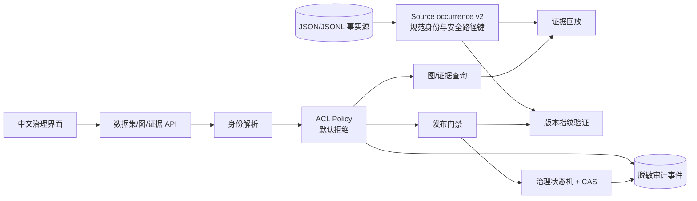
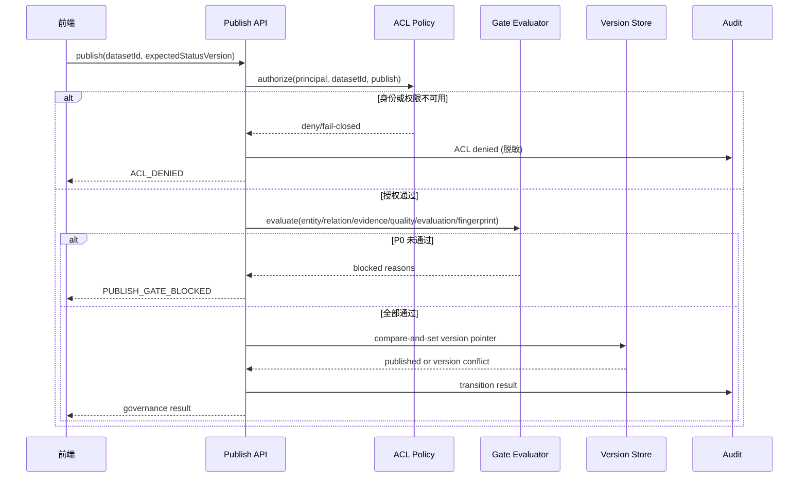

# M2 安全可发布基础架构

```yaml
documentType: architecture-design
moduleId: knowledge-graph-governance
relatedTasks: [RG-17, RG-18, RG-19, RG-20, RG-21]
status: ready-for-implementation
```

## 1. 逻辑架构



## 2. 发布时序



## 3. 信任边界和不变量

| 边界 | 不变量 |
|---|---|
| HTTP 请求→应用 | 不信任客户端 principal/datasetId，由服务端解析和鉴权 |
| 应用→事实源 | 所有查询必须携带 dataset/version 边界 |
| 快照→证据 | source/chunk/evidence 父链和哈希必须完整 |
| 来源事实→Source occurrence | Schema `2.0` 新写的逻辑身份仅由 `datasetId + resourceId + contentHash` 决定；不同 resource 即使内容相同也不合并 |
| 身份→文件系统 | `sourceId` 与快照路径分离；未校验 `resourceId` 不得拼接进 ID、目录或文件名 |
| v1 清单→兼容读 | Schema `1.0` 仅可原样验证/回放；无法证明 resource occurrence 时标记歧义，禁止自动升级或重新发布 |
| 门禁→发布指针 | P0 不允许 `force`；CAS 失败不改变指针 |
| 审计→运维 | 不记录 token、原文或完整查询；失败不阻断拒绝决策 |

## 4. 降级规则

- 身份、ACL 策略或事实源不可用：拒绝发布和敏感读取。
- 单条 evidence 损坏：隔离并生成质量问题；引用不可回放。
- manifest 整体不可验证：版本失败，禁止发布。
- v1 source 只能确认 contentHash，无法唯一还原 `resourceId` occurrence：允许在原不可变包内历史回放，但禁止升级、合并或发布为 v2。
- 审计写入异常：安全操作保持拒绝，返回可重试的策略不可用错误。
