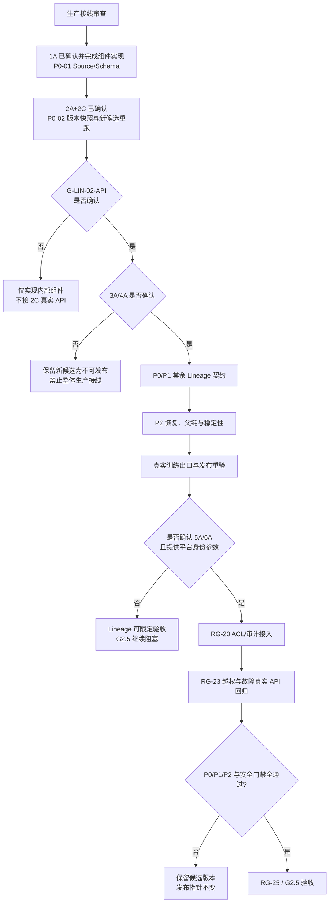

# M2 生产可发布就绪审查

```yaml
documentType: production-readiness-review
moduleId: knowledge-graph-governance
documentVersion: 1.2.0
applicableVersion: M2
createdAt: 2026-08-18
updatedAt: 2026-08-18
relatedTasks: [RG-17, RG-19, RG-20, RG-23, RG-24, RG-25, TASK-RAG-KG-M2-LINEAGE-REWORK-01]
status: blocked-by-decision
approvedDecisions: [G-LIN-01-1A, G-LIN-02-2A-2C, G-LIN-02-API-A, G-LIN-03-3A, G-LIN-04-4A, G2-03-TRUSTED-GATEWAY]
pendingDecisionGates: [JWT-RUNTIME-PARAMETERS, JWT-DEPENDENCY]
owner: Architect / Backend / Security / Test / Doc
```

## 1. 审查结论

**M2 当前不具备生产可发布条件，状态为 `blocked-by-decision`。**

[`17-m2-production-lineage-integration.md`](./17-m2-production-lineage-integration.md) 已依 `G-LIN-01=1A` 和 `G-LIN-02=2A+2C` 更新为部分批准状态；本文档仍是整体生产就绪结论的权威记录。P0-01 Source/Schema、P0-02/2A 规则快照、producer、legacy resolver 和 2C 冻结输入重建内核已完成组件实现；2C 公共 API 触发尚未接入。2C 公共 API 行为等待 `G-LIN-02-API` 明确确认，未确认的权威目录、偏移和安全契约不得越过。

2026-08-18 基于当前工作树重新执行 2C 专项与既有回归：`tests.test_keyword_rule_rebuild` 9/9 通过；`test_keyword_extractor_version + test_lineage_manifest + test_production_lineage + test_m2_lineage_replay + test_version_fingerprint + test_training_service` 共 **175 项，173 passed / 2 skipped**。两个跳过项均有明确门禁：`PL-A18` 等待 G-LIN-04 冻结 `offsetUnit`，`PL-A23` 等待 G-LIN-04 冻结 formal `evidenceOffsets` 表示。新增 2C 契约已证明冻结输入重验、稳定 key、同 key 单飞、异 key 并行、CAS 失败重试、独立新 run、零模型调用和 legacy 不变。该证据仍没有证明真实训练出口、公共 API、发布重验、ACL 与崩溃恢复正确。`G-LIN-02-API` 与 `3A..6A` 仍未确认，因此整体生产接线仍处于阻断状态。

## 2. 审查依据与真实样本

| 证据 | 已核验事实 | 对当前实现的影响 | 证据边界 |
|---|---|---|---|
| 文档 occurrence 样本 | 10,100 个文档中有 2,321 个额外重复内容 occurrence | `source:{datasetId}:{contentHash}` 会产生 Source ID 冲突，并错误合并不同 URI/ACL 来源 | 数字是本次只读样本结果，不得硬编码为业务常量 |
| keyword candidate 双角色审计 | 55,324 条历史记录缺少 `schemaVersion/extractorVersion`；无可信同 run 规则快照，分类为 `RECOVERABLE=0`、`ISOLATE=55,324`；run `training_c56bf44e9e6f4fc4` 与 dataset `dataset_1d7438983dc34062` candidate 均为 46,458,586 bytes、`cmp=0`，SHA-256=`b23f0a8b73b9e72648a848c9b4ac4423c033adbc248725d1c6826ef1e79f3e92`，记录结构合法且 ID 唯一 | 2A 对目标 run 只能逐条隔离；结构合法不能证明 extractor 版本；业务恢复必须由 2C 从冻结 normalized 输入创建新 run/候选版本 | 实施时须现场重算完整 SHA-256。2C 完成前不得宣称存量已恢复 |
| 上游错误信封样本 | 最大重复组 2,027 条已确认为同一 JSON 权限错误信封，normalized SHA-256 为 `7aadae...48eb`；569 条状态为 `completed`、1,458 条为 `completed_with_warnings`，与 189 条 `CONVERSION_FAILED` 交集为 0 | 已污染 2,027 chunks、2,027 keyword candidates 和 2,027 graph edges，且污染边 offset 全为 `-1/-1` | 详见 [生产事实只读审计](../../../../../.codex/workflow/audits/knowledge-graph-governance/2026-08-18-m2-production-fact-audit.md)；必须按完整 JSON 错误信封或批准指纹识别，禁止只匹配 `400402` |
| 决策前适配器修订 | 非对象 evidence 隔离、issues JSONL 校验、路径/symlink 拒绝、跨 resource overlap 隔离、确定性和并发提交已有聚焦回归 | 已降低组件内未分类异常、根外读取、证据串文档、产物漂移和并发覆盖风险 | 仅覆盖 PL-A01、A07、A12—A17、A19—A22、A24—A27；不能外推为生产接线已完成 |
| 提交时序审查 | run 和 dataset 两次 rename 不具备跨目录事务；rename 后 fsync 失败可形成“返回失败但正式目录已存在” | 两份治理包可分叉，重试可误报冲突，发布无法确定权威事实 | 只能选择一个发布权威目录，审计镜像不参与发布判定 |
| 安全基线 | 仓库内没有可复用的可信会话/JWT/RBAC 中间件，上传 token 也未构成图谱主体 | 无法可信地实现 RG-20/23；客户端自报 Principal 或复用上传 token 都会扩大越权边界 | 详见 [身份与 ACL 决策提案](./18-m2-identity-acl-decision-proposal.md) |

上述样本数字应在最终验收时由只读脚本重新生成计数、摘要和比例，并将命令输出写入验收报告。

### 2.1 决策前已实现证据

| 范围 | 当前实现与测试证据 | 仍然不能证明的内容 |
|---|---|---|
| 单记录隔离 | 非对象 evidence 不再在隔离边界外抛 `AttributeError`；issue 的 `objectId` 优先采用 producer ID，否则采用规范记录内容摘要；issues 按 `objectId/reason` 排序后重新分配规范 `recordIndex` | legacy keyword 仅可信同 run 快照恢复/隔离的组件已实现，但目标 55,324 条的真实分类和 2C 重跑未验证；转换错误结构化隔离仍未实现 |
| 治理包完整性 | `lineage-manifest.json`、`lineage-verification.json`、`lineage-issues.jsonl`、`version-fingerprint.json` 全部参与 staging 校验 | 尚未接入 dataset 唯一权威目录、业务 manifest、store gate 和真实发布 API |
| PL-A16 二次校验 | staging 写完后首次校验；`before_publish` 故障注入点之后、目录原子替换之前再次读取并校验。测试分别覆盖首次校验前损坏 issues，以及首次校验后替换 issues，均不生成最终目录 | 该二次校验是组件内防篡改证据，不等同于生产发布时重新读取 dataset 权威包，也不证明掉电恢复 |
| 路径与 symlink | 覆盖非法 `resourceId`、normalized 文件/子目录 symlink 逃逸，以及 governance 父目录、最终目录、staging 被 symlink 替换的 fail-closed 行为 | 尚未经过真实训练出口和部署文件系统边界验证 |
| 父链、确定性与并发 | overlap 仅允许同 resource 父 chunk；缺失、自指、环和跨 resource 父链被单条隔离；100 组输入乱序结果相同；同一事实跨候选版本的 occurrence ID 稳定；两个并发 writer 恰好一个提交成功，失败方获得结构化冲突，最终四文件可重验 | PL-A18/PL-A23 的正式偏移契约未冻结；并发测试证明进程内竞态路径，不等同于部署文件系统掉电演练 |

本轮六模块回归 166 项中，新增 7 项 G-LIN-02/2A 契约用例通过，其余已通过项覆盖 Lineage、版本指纹和 TrainingService 既有回归；2 项为 PL-A18/PL-A23 显式跳过。PL-A02 的快照解析与 producer 契约已有直接组件断言；2C 真实数据重跑、PL-A03/A04、PL-A06 生产门禁半部、PL-A08—A10 和 PL-A11 生产门禁半部仍不能宣称完整实现。组件覆盖不能替代端到端用例。

## 3. 风险分级与处置

| 级别 | 问题 | 为什么必须处理 | 通过条件 |
|---|---|---|---|
| P0 | Source occurrence ID 冲突与转换失败混入 | 会导致整批失败、来源/ACL 语义丢失或错误正文入图 | 相同内容不同 resource 保留独立 occurrence；确认的转换失败进入 source/chunk/evidence/graph/index 数量为 0 |
| P0 | legacy keyword 版本事实缺失 | 会导致 evidence 全量隔离或伪造历史版本 | 有已提交历史事实的记录接纳率 100%；无事实记录可定位隔离 |
| P0 | dataset/run 双权威与发布未重验 | 可造成 `manifest=true` 但磁盘事实不可验证 | dataset 治理包为唯一权威；任一文件缺失/篡改、CAS 冲突或 `force=true` 均不改发布指针 |
| P0 | 可信身份、ACL 与审计未接入 | 无法证明不越权读取/发布 | JWT 本地验签、dataset ACL、deny 优先、fail-closed 和脱敏审计均经真实 API 验证 |
| P1 | evidence 类型、issues 全包校验、路径和 symlink 边界 | 组件内已有修订，但生产路径尚未接线和重验，仍可能造成包完整性绕过或越界文件访问 | traversal、绝对路径、glob、symlink 逃逸成功数为 0；四文件自校验完整；真实 API 复验通过 |
| P1 | keyword/formal 模式、graphSource、model/embedding 和偏移单位未强校验 | 可把规则结果伪装为正式语义或产生跨语言引用漂移 | 模式边界与实际产物一致；`offsetUnit=unicode_code_point`；非 BMP 回放一致 |
| P2 | fsync 后幂等恢复、overlap 父链和顺序稳定性 | 不一定立即泄露，但会造成重试失败、证据串联或指纹漂移 | 同指纹包可幂等确认；跨 resource 父链为 0；100 次乱序重建字节一致 |

## 4. 决策状态

| 编号 | 决策门 | 方案 A | 状态/约束 |
|---|---|---|---|
| 1A | G-LIN-01 Source identity | 逻辑身份为 `datasetId + resourceId + contentHash`；`sourceId=source:v2:sha256(canonical-json(logicalKey))`；Schema `2.0` 新写，v1 仅读 | **2026-08-18 已确认**；可进入 P0-01 测试红灯与实现，不解除其他门禁 |
| 2A+2C | G-LIN-02 keyword 版本与恢复 | 新 producer 显式写 `extractorVersion` 和同 run 已提交规则快照引用；legacy 仅从 manifest 哈希绑定且覆盖完整规则事实的快照恢复，否则逐条隔离；当前 YashanDB 批次从冻结 normalized 输入重跑到新 run/候选版本 | **2026-08-18 已确认；2A、2C 内核、请求时冻结和 API-A 基础触发已实现**；API 扩展错误矩阵、性能内存门禁和生产批次验证仍未完成；不得用当前配置/源码/Git 时间推断，不改写 legacy；规则路径模型调用必须为 0 |
| API-A | G-LIN-02-API 2C 触发 | 保持现有请求字段，定义 `keyword_analysis + sourceDatasetId` 为指定 dataset 冻结输入重建；校验同 batch、keyword 候选态和 manifest/taskId，写 `rebuildOf` | **2026-08-18 已按常设推荐授权选定；基础真实 FastAPI 验收 2/2 通过**。扩展错误矩阵、并发 admission 和异步失败信封转 API-TST-01；不读取 `latest`，不发布 DatasetVersion |
| 3A | G-LIN-03 权威目录 | `datasets/{datasetId}/governance` 是唯一发布权威；training run 仅保留可重建审计镜像 | 不得实现“两目录同时原子提交”的伪事务 |
| 4A | G-LIN-04 模式与偏移 | 强制 keyword/formal 模式边界；formal 只接受真实 Agent 版本快照；manifest 明示 `offsetUnit=unicode_code_point` | 不得让调用方任意传入 model/graphSource 或在未声明单位时进行跨语言展示 |
| 5A | G2-03 身份/ACL/审计 | 可信网关 JWT + 应用本地验签 + dataset ACL + deny 优先 + 默认禁止跨数据集 + 180 天配置化脱敏审计 | RG-20/23/25 保持阻塞；不得使用客户端自报 Principal、静态本地 Token ACL 或匿名放行 |
| 6A | JWT-DEPENDENCY 依赖授权 | 批准引入受维护的 JWT/JWKS 验签依赖，锁定版本并执行供应链/许可证检查 | 不自行实现密码协议；改为对接平台现有验证器或继续 fail-closed |

5A 落地还需平台提供 issuer、audience、JWKS URI、可信网关网络/mTLS 边界和 claims 契约。若平台已有 RBAC introspection，应回到文档 18 比较方案 C，不应为了赶进度自建静态 Token ACL。

## 5. 阻断与恢复流程



## 6. 实施顺序

1. **冻结决策**：`1A/G-LIN-01` 与 `2A+2C/G-LIN-02` 已写入决策记录；`G-LIN-02-API` 推荐复用 `keyword_analysis + sourceDatasetId` 但尚未获批，确认前不得改变公共行为；`3A/4A` 和 5A/6A 同样遵守各自审批边界。
2. **P0-01 Source/Schema**：先写双读旧格式、新写 occurrence ID 的失败测试，再修改 `lineage_manifest.py`/`production_lineage.py`；同时以结构化转换状态隔离错误资源。
3. **P0-02 历史版本与重跑**：2A 新 producer 规则快照/显式版本和 legacy 可信同 run 解析隔离已完成组件实现与回归。下一步以 2C 幂等/不可变/零模型调用测试建立红灯，内部编排从冻结 normalized 输入创建新 run 和候选版本。只有 G-LIN-02-API 确认后才接真实训练路由，并保留旧产物摘要证据。
4. **P0-03 唯一权威与发布重验**：先提交 dataset 治理包，再更新业务 manifest 引用，最后 CAS 更新 store gate；发布每次从磁盘权威包重验。
5. **P1/P2 硬化**：按 [`TASK-RAG-KG-M2-LINEAGE-REWORK-01`](../../../../../.codex/workflow/tasks/TASK-RAG-KG-M2-LINEAGE-REWORK-01.md) 顺序完成包校验、路径边界、模式契约、幂等恢复、父链与稳定性。
6. **生产事实接线**：业务代码依次修改 `training_service.py` 和 `services.py`，共享文件不并行编辑；运行 keyword/formal 真实 FastAPI/TestClient 隔离回归。
7. **安全接线**：5A/6A 确认后实现 RG-20，再执行 RG-23 直接 ID、跨数据集、历史版本、绕过网关和依赖故障测试。
8. **验收**：按 [生产接线测试设计](../testing/03-m2-production-lineage-integration-test-design.md) 产出逐项证据；只有 RG-20/23 与所有 P0 门禁全通过才能更新 RG-25/G2.5。

## 7. 回滚与恢复顺序

| 故障阶段 | 安全回滚/恢复 | 禁止操作 |
|---|---|---|
| 新 Schema/ID 上线后失败 | 停止新候选构建；旧清单保持只读兼容；修复后用新 versionId 重建 | 不原地改写旧清单，不恢复旧的 contentHash-only 新写逻辑 |
| extractor 快照/2C 重跑失败 | 停止新 producer 或重跑调度；保留 legacy 只读和已提交新候选；用相同 rebuildKey 重验后幂等恢复 | 不用当前配置回填版本，不删除/改写 legacy，不把部分 staging 注册为候选 |
| 权威包提交中断 | 清理未引用 staging；已 rename 包先重验指纹，同指纹幂等确认，异指纹隔离 | 不用 run 镜像覆盖 dataset 权威包，不以文件时间选“较新”版本 |
| 业务 manifest/store CAS 中断 | 保持 `manifest=false` 和未发布指针；从可验证权威包重建引用后重放 CAS | 不直接修改 store 为 true，不跳过磁盘重验 |
| JWT/ACL 接入失败 | 回滚到“全部拒绝/只读关闭”，保留脱敏审计和未发布候选 | 不恢复匿名读、客户端自报身份或共享静态 token |
| 验收失败 | 保留失败夹具、requestId、脱敏摘要和 gate 前后值；建立新候选重试 | 不更改已发布历史事实，不删除失败证据来获得绿灯 |

## 8. 不得宣称完成的边界

在验收证据补齐前，下列表述均不成立：

- 不得因当前六模块 166 项回归为 164 passed / 2 skipped 就宣称生产 Lineage 已接线；两个 G-LIN-04 跳过项也不能计入通过。
- 不得把 RG-17/19 的纯组件完成、RG-24 的注入式回放解释为真实训练出口或生产快照回放已完成。
- 不得把 `manifest=true` 或业务 store 缓存当作磁盘治理包可验证的证据。
- 不得把 keyword 规则结果宣称为 formal entity/relation 语义或模型生成结果。
- 不得因 `2A+2C` 已获批且 2A 组件完成就宣称 55,324 条 legacy 已恢复；必须分别报告可信快照恢复数、隔离数和 2C 新运行计数，且证明旧产物未变化。
- 不得宣称 8,000+ 文档已安全加工，直到真实隔离批次的 source/chunk/evidence/质量问题计数可复算，且错误转换内容未进入图/索引。
- 不得在 RG-20/23 未完成、越权成功数未证明为 0 时宣称 RG-25 或 G2.5 通过。

## 9. 复审入口与产出

剩余 3A..6A 确认并完成实现，且 2A+2C 已取得代码、真实 API 和存量重跑证据后，按以下产物证明复审结论：

1. [生产 Lineage 修订任务卡](../../../../../.codex/workflow/tasks/TASK-RAG-KG-M2-LINEAGE-REWORK-01.md) 的 P0/P1/P2 逐项勾选和对应 Git 差异。
2. [生产 Lineage 测试设计](../testing/03-m2-production-lineage-integration-test-design.md) PL-A/B/C/D 测试 ID 的命令、输出、夹具摘要和失败数。
3. [`18-m2-identity-acl-decision-proposal.md`](./18-m2-identity-acl-decision-proposal.md) 中身份前提的平台配置证据与 RG-23 真实 API 越权回归。
4. M2 验收报告中的权威治理包摘要、发布指针前后值、重建一致性、安全审计摘要和 `git diff --check` 结果。

任一必需证据缺失、仅有纯函数测试、或真实 API 未经过业务路由时，复审状态仍为 `blocked-by-decision` 或 `blocked-by-verification`，不得提升为 ready/complete。
