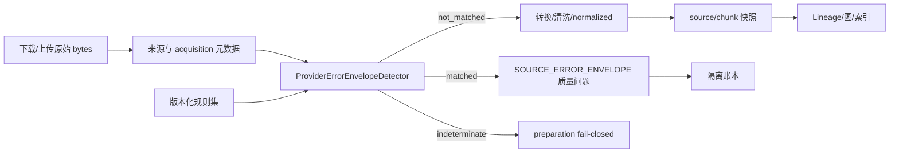

# M2 供应商错误信封输入边界设计

```yaml
documentType: architecture-and-detailed-design
moduleId: knowledge-graph-governance
documentVersion: 1.0.0
applicableVersion: M2
createdAt: 2026-08-18
updatedAt: 2026-08-18
relatedTasks: [TASK-RAG-KG-M2-LINEAGE-REWORK-01, RG-17, RG-19, RG-24, RG-25]
status: design-ready-partially-approved
approvedDecisions: [G-LIN-01-1A]
pendingDecisionGates: [G-LIN-02, G-LIN-03, G-LIN-04]
owner: Architect / Backend / Test / Doc
```

## 1. 问题、用户价值与事实边界

知识库运营人员需要确认“加工成功的资料确实是业务文档”，而不是上游下载接口返回的错误对象。生产事实审计已经证明：2,027 个完整 JSON 权限错误信封被 preparation 标记为成功，随后分别生成 2,027 个 chunk、keyword candidate 和 graph edge。污染边的 evidence offset 全为 `-1/-1`。

本设计在 preparation 创建 source/chunk 之前建立输入质量边界。目标是隔离已证明的供应商错误响应，同时不误伤正文中讨论 `400402`、JSON API 或错误处理的合法文档。

本文不自行修改 Source ID、Lineage Schema、发布权威目录或 ACL。`G-LIN-01=1A` 已确认，Source occurrence v2 契约由文档 16/17 负责；`G-LIN-03` 和 `G2-03` 仍未确认。本文只冻结检测器边界、接口、配置、质量问题和测试方式。

## 2. 方案比较

| 方案 | 判定依据 | 优点 | 致命问题 | 结论 |
|---|---|---|---|---|
| 字符串过滤 | 正文包含 `400402` 或固定 message | 实现简单 | 会误删合法文档、示例和日志，规则不可审计 | 禁止 |
| 仅解析 JSON 结构 | 根对象包含 `error.code/message` | 比字符串准确 | 合法 API 文档可能正好保存同一示例 | 不单独使用 |
| 来源元数据 + 完整契约 + 批准指纹 | 已知 provider/acquisition 元数据与完整 JSON 契约同时成立；历史缺元数据时只接受批准的完整内容指纹 | 误判边界清晰、可版本化、可回放 | 需要保存来源元数据和规则快照 | 采用 |

“批准指纹”只能是经过审计登记的完整 payload SHA-256，不能是前缀、局部正文或错误码摘要。新增指纹属于配置变更，必须经过评审并留下样本摘要和失效日期。

## 3. 架构与单一职责



职责边界：

- 下载/上传层保留 provider、acquisition channel、响应 media type 和可用的响应状态摘要，不记录 token 或完整响应头。
- 检测器只做有界解析和规则匹配，不转换文档、不生成 Lineage，也不决定发布。
- preparation 根据检测结果决定继续、隔离或整体失败；隔离项不得进入 converter、normalized、source、chunk、candidate、graph 或 index。
- Lineage 适配器只消费 preparation 已提交的可信 source facts，不重复实现错误信封过滤。
- 前端沿用资料质量问题展示，不新增“忽略并继续入库”的绕过入口。

## 4. 接口与数据契约

### 4.1 内部接口

```text
ProviderErrorEnvelopeRuleRepository.load_committed() -> RuleSetSnapshot

ProviderErrorEnvelopeDetector.detect(
  payload: bytes,
  provenance: SourceProvenance,
  rules: RuleSetSnapshot
) -> EnvelopeDetection
```

`EnvelopeDetection`：

| 字段 | 类型 | 说明 |
|---|---|---|
| `status` | `not_matched | matched | indeterminate` | 三态结果；解析器故障和规则不可验证不得伪装成未匹配 |
| `ruleSetVersion` | string | 已提交规则集版本 |
| `ruleSetHash` | `sha256-v1` | 规范化规则快照摘要 |
| `ruleId` | string/null | 命中的稳定规则 ID |
| `provider` | string/null | 来源 provider，不从正文猜测 |
| `providerCode` | string/null | 结构化错误码；进入质量问题前转为字符串 |
| `contentHash` | `sha256-v1` | 对完整 payload 计算 |
| `reasonCode` | string | 稳定机器码 |
| `redactedSummary` | string | 配置化长度限制后的中文摘要，不包含 stack、token、文件名或完整原文 |

`SourceProvenance` 至少包括 `provider`、`acquisitionChannel`、`declaredMediaType` 和 `resourceId`。HTTP 状态只作为辅助证据，因为已审计样本可能以成功状态落盘。

### 4.2 规则集

规则集必须来自已提交配置快照，禁止在 `preparation_service.py` 硬编码供应商错误码：

```json
{
  "schemaVersion": "provider-error-envelope-rules/v1",
  "ruleSetVersion": "<approved-version>",
  "limits": {
    "maxProbeBytes": "<approved-positive-integer>",
    "maxJsonDepth": "<approved-positive-integer>",
    "maxObjectMembers": "<approved-positive-integer>"
  },
  "rules": [
    {
      "ruleId": "<stable-id>",
      "provider": "<provider-id>",
      "acquisitionChannels": ["<channel>"],
      "mediaTypes": ["application/json"],
      "rootType": "object",
      "requiredFields": [
        {"path": ["error", "code"], "type": "integer", "equals": "<configured-code>"},
        {"path": ["error", "message"], "type": "string", "equals": "<configured-message>"}
      ],
      "approvedPayloadHashes": ["sha256-v1:<approved-full-payload-digest>"]
    }
  ]
}
```

示例中的占位值不是默认业务配置。实现阶段需新增独立规则文件并记录审批，不得把本次审计的 code/message/hash 复制为代码常量。

### 4.3 质量问题

命中后逐 occurrence 写入：

```text
code = SOURCE_ERROR_ENVELOPE
severity = error
objectType = source
objectId = resourceId
details = {
  provider, ruleId, ruleSetVersion, ruleSetHash,
  providerCode, contentHash, redactedSummary,
  acquisitionChannel, originalProcessingStatus
}
```

质量问题不得保存 stack、token、完整正文、下载 URL 查询参数或根目录绝对路径。相同 blob 可以复用内容摘要，但 occurrence、resourceId 和原始处理状态不得合并。

## 5. 判定算法伪代码

```text
detect(payload, provenance, rules):
  verify rules schema, version and canonical hash
  if verification fails:
    return indeterminate(RULESET_INVALID)

  contentHash = sha256(payload)
  fingerprintMatches = rules.findApprovedHash(contentHash, provenance.provider)
  if fingerprintMatches exactly one enabled rule:
    return matched(rule, APPROVED_PAYLOAD_FINGERPRINT)
  if fingerprintMatches more than one incompatible rule:
    return indeterminate(RULESET_AMBIGUOUS)

  candidates = rules.byProviderAndChannel(provenance)
  if candidates is empty:
    return not_matched(PROVIDER_NOT_CONFIGURED)

  if payload length exceeds rules.limits.maxProbeBytes:
    return not_matched(PAYLOAD_OUTSIDE_ENVELOPE_LIMIT)
  if payload does not have a JSON object lexical prefix:
    return not_matched(NOT_JSON_OBJECT)

  parsed = boundedJsonParse(payload, depth/member limits)
  if parsing fails:
    return not_matched(NOT_COMPLETE_JSON_ENVELOPE)

  matches = candidates where:
    declared media type is allowed AND
    root type matches AND
    every configured typed field path matches exactly

  if exactly one rule matches:
    return matched(rule, PROVIDER_CONTRACT_MATCH)
  if more than one incompatible rule matches:
    return indeterminate(RULESET_AMBIGUOUS)
  return not_matched(CONTRACT_NOT_MATCHED)
```

注意：JSON 解析失败表示“不是完整错误信封”，不是输入整体损坏。只有规则集不可验证、匹配结果矛盾或检测器内部故障才返回 `indeterminate` 并终止 preparation。

## 6. 状态、原子性与回放

1. detection 在 converter 调用前执行，命中项不创建转换子进程。
2. 每个 detection 结果先写 preparation staging 事件；source/chunk/质量问题及规则快照一起提交。
3. preparation manifest 增加检测器 `schemaVersion/ruleSetVersion/ruleSetHash` 和 matched/notMatched/indeterminate 计数。
4. 规则快照与 source 事实必须属于同一 preparation commit；不得在重放时读取当前配置重新判定历史数据。
5. 重试同一 snapshot 和规则版本必须得到相同 occurrence 结果；规则升级创建新 preparation snapshot，不原地改写历史结论。
6. `indeterminate` 不提交 source/chunk，也不更新 training/store gate；用户看到中文可重试错误和 requestId。

## 7. 性能与资源限制

- 每个 payload 最多读取 `maxProbeBytes`；超限内容不进入 JSON parser。
- 先按 provider/channel 缩小候选，再检查词法前缀，最后有界解析；正常 Office/PDF 不付出 JSON 解析成本。
- JSON parser 必须限制深度、成员数和输入字节数，避免深层对象或超大数组造成 CPU/内存放大。
- 完整 SHA-256 可复用下载或 preparation 已有流式摘要，禁止为了检测重复读取大文件。
- 规则按 `(provider, channel, mediaType)` 建不可变索引，单文档匹配复杂度为 `O(payloadProbe + candidateRules)`。
- 验收记录 1k/10k 文档的 detector P50/P95、总额外 CPU、峰值内存和 converter 跳过数；目标阈值在固定硬件基线后审批，不在代码中硬编码。

## 8. 测试与验收

| ID | 场景 | 必须证明 |
|---|---|---|
| PL-A08 | 已审计脱敏完整信封，状态分别为 completed/completed_with_warnings | 两者均逐 occurrence 隔离并写 `SOURCE_ERROR_ENVELOPE`，下游事实为 0 |
| PL-A09 | 普通正文含 `400402`；合法 JSON 文档含相同错误示例但 provider/channel 不匹配 | 均不误隔离 |
| PL-A10 | 大量相同错误 blob 混入正常文档 | occurrence 全部可审计，正常 source/chunk 数不变，converter 不处理命中项 |
| PL-A10F | 完整 payload 指纹命中但历史来源元数据缺失 | 仅批准指纹可隔离；未批准相似 payload 不隔离 |
| PL-A10R | 规则集损坏、摘要漂移或多规则矛盾 | preparation fail-closed，不产生半快照，不更新门禁 |
| PL-A10P | 1k/10k 正常和错误混合样本 | 有界内存、无 JSON 解析放大，性能报告可复算 |

自动化必须包含 detector 单元测试、preparation 仓储故障注入、真实后端 API 隔离批次和生产脱敏计数回放。纯函数测试不能替代真实 API 和 committed snapshot 证据。

## 9. 实施文件与串行边界

| 阶段 | 文件范围 | 约束 |
|---|---|---|
| 配置契约 | 新增版本化规则文件、配置 loader/schema 测试 | 新配置内容需人类审批；不引入外部依赖 |
| 检测器 | 新建独立 detector 模块及单测 | 不读全局当前配置，不写业务状态 |
| preparation 接线 | `preparation_service.py`、对应真实 API/仓储测试 | 与其他 preparation 修改串行；先检测再转换 |
| Lineage 验收 | 生产回放测试与验收报告 | 不在 Lineage 适配器重复过滤 |

## 10. 回滚与待确认项

回滚时禁用具体规则并发布新规则版本；历史 snapshot 保持原样。若检测器或规则集不可用，系统必须停止创建新 preparation snapshot，不能降级为“全部未匹配”。

实现前仍需确认：

1. 规则配置的正式 owner、审批流程和部署路径。
2. 历史缺失 provenance 时，是否批准使用已审计完整 payload 指纹作为唯一兜底。
3. 固定硬件上的 detector 性能预算；在取得基线前不承诺具体毫秒阈值。

`G-LIN-01=1A` 已于 2026-08-18 由 Product Owner/用户在当前任务会话确认，不再列为本文待确认项。
