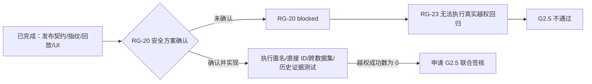

# M2 安全可发布基础部分验收记录

```yaml
documentType: acceptance-record
moduleId: knowledge-graph-governance
relatedTasks: [RG-17, RG-18, RG-19, RG-20, RG-21, RG-22, RG-23, RG-24, RG-25]
status: blocked
decisionGate: G2.5
testedAt: 2026-08-18
```

## 1. 验收结论

M2 当前为**部分验收通过、G2.5 未通过**。发布状态与门禁契约、Lineage/版本指纹组件、中文治理界面和注入式证据回放已具备可重复证据；真实身份、ACL 数据源前过滤和安全审计尚未实施，因此不能证明“越权成功数为 0”，不得进入安全发布。

| 范围 | 状态 | 结论边界 |
|---|---|---|
| RG-17 Lineage Manifest | `completed` | 组件完成；尚未接知识加工生产事实源 |
| RG-18 发布门禁 | `completed` | P0、CAS、越级和历史兼容已验证；ACL 保持默认拒绝 |
| RG-19 版本指纹 | `completed` | 组件完成；尚未接生产事实源和正式发布指针 |
| RG-20 ACL 与审计 | `blocked` | 等待身份、权限粒度及审计策略确认 |
| RG-21 中文治理界面 | `completed` | 治理状态、阻断原因、下一步和冲突刷新契约完成 |
| RG-22 契约回归 | `completed` | 真实 FastAPI 路由与前端 helper 契约通过 |
| RG-23 越权回归 | `blocked` | 依赖 RG-20 和隔离测试身份 |
| RG-24 Lineage 回放 | `completed` | 注入式快照回放完成，不代表生产端到端接线 |
| RG-25 G2.5 验收 | `blocked` | RG-20/RG-23 未完成，联合签核条件不成立 |

## 2. 自动化证据

| 验证项 | 结果 | 说明 |
|---|---:|---|
| M2 后端合并回归 | 51/51 通过 | 状态机、发布 API、manifest、版本指纹及 M2 契约/回放 |
| 图版本真实 API 定向回归 | 1/1 通过 | 重复发布保持 `graphVersionId` 稳定并复用版本 |
| RG-22/RG-24 独立回归 | 18/18 通过 | 发布契约 8 项、Lineage 回放 10 项 |
| 前端生产构建 | 通过 | Vite build 通过；保留既有 500 kB 分包告警 |
| Python 语法检查 | 通过 | M2 新模块和测试可编译 |

详细用例与复现命令见 [M2 发布契约与 Lineage 回放测试报告](./01-m2-contract-lineage-test-report.md)。

## 3. G2.5 阻断原因



当前 fail-closed 只说明未判定 ACL 不会被伪造为通过，不能替代真实身份解析、授权过滤和审计持久化。

## 4. 待人类确认

1. **可信身份源**：网关 JWT、现有会话或平台 RBAC；应用不得信任客户端自报 principal。
2. **ACL 粒度与冲突规则**：建议 dataset 为基础边界，resource 只能收紧，deny 优先，默认禁止跨数据集。
3. **审计策略**：确定存储位置、保留期、查阅角色，以及 principalId/IP 的脱敏标准；禁止记录 token、原文和完整查询。
4. **隔离测试身份**：为 RG-23 提供允许、拒绝、过期和撤权四类身份及至少两个隔离数据集。

上述事项涉及安全架构，确认前 RG-20、RG-23 和 RG-25 必须保持 `blocked`。

## 5. 下一步验收顺序

1. 完成 G2-03 人类确认，并更新 ACL/审计设计契约。
2. 实现 RG-20，在图、证据和检索读取事实源前统一授权并写入脱敏审计。
3. 执行 RG-23 真实 API 越权矩阵，确认越权成功数为 0。
4. 将 RG-17/19 接入生产事实源后补充集成证据，再由 Product/Architect/Test 联合执行 RG-25 G2.5 判断。
