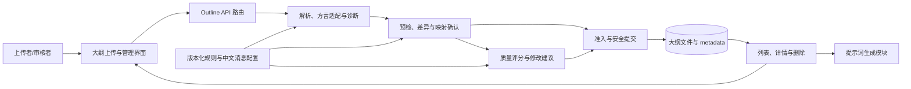

# 大纲管理模块概要设计

> documentType: overview-design
> moduleId: outline-management
> owner: Architect
> 文档层级：模块概要设计
> 当前基线：`routes/outline.js` 文件型实现
> 演进范围：P1-P5 大纲兼容与质量治理
> 更新日期：2026-09-02

## 1. 产品目标与用户

大纲管理模块解决的不是“把文件存下来”，而是让用户确认上传内容已经成为可用于知识库生成的标准知识点树。当系统不能可靠转换时，应明确指出位置、原因和下一步动作，避免“上传成功但知识点为 0”或静默丢失标题。

| 用户 | 核心任务 | 业务诉求 |
|---|---|---|
| 数据库管理员 | 上传管理员手册等领域大纲 | 保留原稿；快速知道能否上传；问题能定位到原行并可修改 |
| 知识库维护者 | 审核、选择知识点并生成提示词 | 树结构稳定、知识点 ID 唯一、描述足以支撑后续生成 |
| 规则运营人员 | 调整解析和评分规则 | 规则可版本化、可回归、可审计、可回退，历史结论可解释 |
| 开发与测试人员 | 演进上传链路 | 接口契约单一、失败无残留、真实 API 结果可重复验证 |

成功标准是：用户看到的预检树、确认落库的详情树和下游消费的知识点树一致；所有阻断和扣分均有证据；任何失败都不覆盖原稿或留下不完整正式记录。

## 2. 模块边界

### 2.1 模块内职责

- 接收单个 JSON、Markdown 或 CSV 大纲文件，执行大小、格式和编码等准入检查。
- 识别输入方言，归一化为 `parts → chapters → kps` 标准树并统计知识点。
- 输出带行号或字段路径的诊断、未决映射和结构化转换差异。
- 在用户确认后安全持久化原文件、标准树、摘要和规则版本。
- 管理大纲列表、详情与删除，并向提示词生成链路提供选定知识点。
- 对标准树进行确定性评分，生成有证据、可执行、可复评的修改建议。

### 2.2 模块外职责

- 原始手册正文的编辑和领域事实补写不由本模块自动完成。
- 文档正文生成、模板选择和事实正确性验证属于下游文档生成模块。
- PingCode 素材下载、Office/PDF 预处理和通用 `sections` 文档树不等同于大纲标准树。
- 身份认证、全局限流和基础存储平台由系统公共能力提供；本模块只声明使用边界。

## 3. 架构与组件



| 组件 | 稳定责任 | 当前实现 | 目标状态 |
|---|---|---|---|
| 大纲管理界面 | 选择文件、展示树、诊断、差异、评分和确认状态 | `OutlineUploader.js` 与 `prompt-generator.html` | 只消费服务端事实，中文完成预检到确认闭环 |
| Outline API | 协议适配、权限上下文、错误映射和响应 | `routes/outline.js` 集中实现全部职责 | 路由变薄，调用解析、预检、评分和提交服务 |
| 解析与诊断 | 输入方言识别、来源 AST、标准树和可定位诊断 | 路由内 Markdown 正则，浏览器另有解析逻辑 | 服务端单一事实来源，规则和方言版本化 |
| 预检与确认 | 无正式落库地计算差异并绑定用户确认 | 尚未实现 | 摘要、规则版本和短期令牌绑定确认内容 |
| 评分与建议 | 确定性评分、证据、建议和准入结论 | 规格已定义，代码尚未实现 | 配置化八维评分和可审计治理 |
| 安全提交 | 写前校验、原子持久化、幂等和补偿 | Multer 先写文件，metadata 直接改写 | 失败无残留，响应计数与持久化树一致 |
| 查询与下游适配 | 列表、详情、删除和选点生成提示词 | `routes/outline.js` | 只暴露已准入标准树，保持兼容读取 |

## 4. 上下游与数据契约

### 4.1 上游输入

- 浏览器以 `multipart/form-data` 提交 `file`，可附带 `name` 和 `type`。
- P1 延续当前 `POST /api/outline/upload`；P4 规划 `POST /api/outline/preflight` 和 `POST /api/outline/confirm`。
- 文件约束、标准树和评分基线见[上传内容与格式规格](../development/29-YashanDB知识库大纲上传内容与格式规格.md)。

### 4.2 模块核心数据

标准树的稳定业务契约为：

```text
Outline(title, specVersion, ruleVersion)
  └─ Part(part, level)
       └─ Chapter(name)
            └─ KnowledgePoint(id, name, desc)
```

来源 AST、诊断、未决映射、结构差异、内容摘要和评分报告是处理上下文，不得被误当作知识点树本身。正式记录需要能够追溯其规格版本、解析规则版本和内容摘要。

### 4.3 下游输出

- 管理界面通过列表和详情接口展示已上传大纲。
- 提示词生成模块按 `part + chapter + kp_id` 提取知识点，消费 `name` 和 `desc`。
- 测试与运营侧消费诊断码、规则版本、评分证据和脱敏指标，不消费完整敏感正文。

## 5. 主流程与不变量

```text
选择文件
 → 文件准入检查
 → 方言识别与来源 AST
 → 标准树归一化
 → 结构校验与诊断
 → [存在阻断/未决] 返回位置、原因和修改动作，不正式落库
 → [可继续] 展示转换差异与质量评分
 → 用户确认绑定的内容摘要和规则版本
 → 写前复核
 → 原子提交文件与 metadata
 → 返回大纲 ID 和知识点计数
 → 列表/详情/提示词生成消费同一标准树
```

必须长期成立的不变量：

1. 原始用户文件只读，系统转换产物使用新对象保存。
2. 服务端是解析、诊断和准入的唯一事实来源。
3. 归一化后至少包含一个知识点，且每个知识点有唯一 ID、非空名称、描述和所属章节。
4. 任何存在歧义的目录条目进入 `unresolvedMappings`，不得静默提升、删除或虚构描述。
5. 未确认、令牌失效、摘要不一致或存在阻断时不得正式落库。
6. 成功响应的 `kp_count`、详情树计数和持久化树计数完全一致。
7. 失败请求不留下正式文件或 metadata 半成品。

## 6. 架构演进映射

| 阶段 | 用户可感知结果 | 架构落点 | 设计 |
|---|---|---|---|
| P1 基线 | 获得不覆盖原稿的规范副本和问题映射 | 固化输入规格、转换报告和真实 API 基准 | [P1 设计](../development/39-管理员手册大纲兼容阶段一-基线与规范副本设计.md) |
| P2 统一解析 | 普通标题树也能被识别，错误可定位 | 服务端 AST、方言适配器、诊断和版本化配置 | [P2 设计](../development/40-管理员手册大纲兼容阶段二-统一解析与结构化诊断设计.md) |
| P3 安全上传 | 不再出现“成功但 0 知识点”，失败无残留 | 写前准入、原子提交、幂等、补偿和真实 API 门禁 | [P3 设计](../development/41-管理员手册大纲兼容阶段三-安全上传与真实API验收设计.md) |
| P4 预检确认 | 上传前看到转换差异并处理歧义 | 无副作用预检、结构 diff、确认令牌和状态机 | [P4 设计](../development/42-管理员手册大纲兼容阶段四-预检差异确认与正式上传设计.md) |
| P5 质量治理 | 看到分项得分、证据和可执行修改建议 | 确定性评分、建议模板、准入策略和规则治理 | [P5 设计](../development/43-管理员手册大纲兼容阶段五-评分建议与持续治理设计.md) |

P2 改变解析和零知识点上传行为，P4 新增预检/确认 API，均属于需要人类审批的架构或公共行为变更。P1 可先独立交付，P3-P5 按前置阶段串行推进。

## 7. 接口与代码映射

| 能力 | 当前/规划接口 | 主要代码或设计责任 |
|---|---|---|
| 上传 | `POST /api/outline/upload` | 当前见 [`routes/outline.js`](../../../../routes/outline.js)；P2/P3 后接入统一解析和安全提交 |
| 列表 | `GET /api/outline/list` | 返回 metadata 及标准树，兼容读取旧记录 |
| 详情 | `GET /api/outline/:id` | 返回单个正式大纲记录 |
| 删除 | `DELETE /api/outline/:id` | 删除记录和所属文件；破坏性边界需精确限定对象 |
| 生成提示词 | `POST /api/outline/generate-prompts` | 按标准树提取所选知识点并调用下游生成器 |
| 预检 | `POST /api/outline/preflight`（P4 规划） | 无正式落库副作用，返回诊断、差异、未决映射和确认条件 |
| 确认 | `POST /api/outline/confirm`（P4 规划） | 校验令牌、摘要、规则版本和幂等键后调用安全提交 |

## 8. 非功能约束

- 安全：限制文件大小和类型；拒绝路径穿越、敏感内容和伪造客户端标准树；日志不记录全文、令牌或凭据。
- 一致性：并发提交不得覆盖 metadata；文件与 metadata 作为一个业务提交处理。
- 可追溯：诊断、映射、评分和正式记录携带稳定码、来源位置、规格版本和规则版本。
- 可配置：解析规则、阈值、消息、评分权重和建议模板不得散落硬编码。
- 可测试：实现测试必须启动真实后端，通过 HTTP 调用接口，并核对响应、文件和 metadata 状态。
- 可用性：所有用户界面和错误信息使用中文，长标题和问题列表在桌面与移动端均可操作。

## 9. 需求与任务入口

模块需求由[大纲兼容模块需求](../../../../../.codex/requirements/modules/outline-management/REQ-OUTLINE-COMPATIBILITY.md)维护，项目状态由[实施计划](../../../../../.codex/workflow/modules/outline-management/PLAN.md)和[开发进度](../../../../../.codex/workflow/modules/outline-management/PROGRESS.md)维护。开发执行以以下任务卡为准：

- [P1 规格基线与样本规范化](../../../../../.codex/workflow/tasks/outline-management/TASK-OUTLINE-EVOLUTION-P1.md)
- [P2 统一解析与结构化诊断](../../../../../.codex/workflow/tasks/outline-management/TASK-OUTLINE-EVOLUTION-P2.md)
- [P3 上传准入与真实 API 回归](../../../../../.codex/workflow/tasks/outline-management/TASK-OUTLINE-EVOLUTION-P3.md)
- [P4 预检转换与差异确认](../../../../../.codex/workflow/tasks/outline-management/TASK-OUTLINE-EVOLUTION-P4.md)
- [P5 评分建议与持续演进](../../../../../.codex/workflow/tasks/outline-management/TASK-OUTLINE-EVOLUTION-P5.md)

模块任务状态和证据以模块 `PROGRESS.md` 为准，全局 `PROGRESS.md`、`RISKS.md` 和 `NEXT.md` 只做跨模块汇总；概要设计不复制动态状态，避免多处信息漂移。

## 10. 相关设计

- [文档预处理与大纲管理设计](../../../18-文档预处理与大纲管理设计.md)：现有大纲列表、删除和提示词生成背景。
- [前后端分离重构设计](../../../15-前后端分离重构设计.md)：Outline API 与前后端组件的系统位置。
- [数据库方案设计](../../../16-数据库方案设计.md)：文件型 metadata 与未来仓储边界。
- [模块文档索引](../README.md)：本模块所有概要和开发设计入口。

## 11. 前端治理工作台设计

### 11.1 设计目标与交互原则

大纲管理前端是管理员的任务入口，不是技术字段台账。首屏必须回答“正在处理哪本手册、当前处于什么阶段、还有什么问题、下一步做什么”四个问题。页面只突出一个主操作，其余信息按需展开；所有状态同时用文字和结构表达，颜色仅作辅助。

写操作仍由大纲管理模块负责，前端不复制解析、预检或发布事实。列表和详情消费同一接口数据；保存、确认、发布成功后必须重新读取服务端事实，禁止用乐观状态伪造完成。

页面采用“一个页面只承担一个核心任务”的原则：列表页负责查找、筛选和进入手册，详情页负责当前手册的大纲治理。原“左侧完整手册列表 + 右侧当前阶段工作区”的常驻双栏方案已被替代，不再通过压缩两侧内容维持同屏展示。

### 11.2 页面职责、路由与信息架构

| 页面 | 正式路由 | 核心任务 | 不承担的内容 |
|---|---|---|---|
| 大纲列表 | `/knowledge-center/outlines` | 查看摘要、搜索、按状态筛选并进入手册 | 不渲染选中手册的目录和阶段详情 |
| 大纲详情 | `/knowledge-center/outlines/{handbookId}?stage={stage}` | 治理一份手册，依次处理目录、责任、模板、检查和发布 | 不常驻展示完整手册列表或概览统计 |

`stage` 允许 `directory`、`responsibility`、`template`、`check`、`publish`；缺失或无效时回到 `directory`。`handbookId` 使用服务端稳定身份，不使用手册名称、大纲版本或目录条目编号代替。

桌面端列表页：

```text
┌──────────────────────────────────────────────────────────────┐
│ 大纲管理                                      [导入大纲]     │
│ 查找并继续处理手册大纲                                       │
├──────────────────────────────────────────────────────────────┤
│ [搜索手册名称或编号] [状态 ▼]                                │
├──────────────────────────────────────────────────────────────┤
│ 手册 │ 产品/业务版本 │ 状态 │ 待处理 │ 更新时间 │ 下一步 │
│ ……                                                         │
└──────────────────────────────────────────────────────────────┘
```

桌面端详情页：

```text
┌──────────────────────────────────────────────────────────────┐
│ ← 返回大纲列表                                               │
│ 手册名称          大纲版本          状态          [主要操作] │
├──────────────────────────────────────────────────────────────┤
│ 目录        责任        模板        检查        发布          │
├──────────────────────────────────────────────────────────────┤
│                                                              │
│                    当前阶段全宽工作区                        │
│                                                [手册信息抽屉] │
└──────────────────────────────────────────────────────────────┘
```

移动端仍使用列表页到详情页的页面导航，不把列表和详情纵向堆叠。详情依次展示返回入口、手册标题与主操作、可横向滚动或合理换行的阶段栏、当前阶段内容；手册信息以抽屉覆盖显示，关闭时不占工作区宽度。

### 11.3 任务驱动的大纲列表

列表默认按“待处理优先、更新时间倒序”排序，支持 URL 可恢复的搜索和筛选。首屏字段固定为：

| 字段 | 说明 | 展示要求 |
|---|---|---|
| 手册 | 手册名称与稳定编号 | 名称可缩略，完整值通过悬停提示或详情查看 |
| 产品 / 业务版本 | 适用产品形态和业务版本 | 使用业务名称，不展示内部 ID |
| 状态 | 面向管理员的聚合状态 | 只展示“待完善 / 待评审 / 已发布” |
| 待处理问题 | 阻断或待确认项数量及摘要 | 无真实统计显示“待检查”，不得虚构 0 |
| 更新时间 | 服务端最后更新时间 | 使用本地化时间 |
| 下一步 | 与后端原始阶段绑定的唯一主操作 | 每行最多一个主按钮 |

不在首屏展示来源文件、解析器版本、规则版本、内部状态码等诊断字段；这些字段仅在详情的“更多信息/诊断”区域提供。

列表顶部展示大纲总数、待处理问题和三种状态计数。状态聚合规则固定为：草稿、导入中、预检失败等未进入评审的阶段显示“待完善”；待确认和已确认显示“待评审”；已发布及其历史归档版本显示“已发布”。这三种是前端展示口径，不覆盖后端原始阶段，下一步操作仍依原始阶段决定。

筛选状态使用查询参数恢复：`q` 表示搜索内容，`status` 只允许 `incomplete`、`review`、`published` 三种前端展示状态。进入详情前将列表滚动位置写入当前浏览历史状态；用户通过详情页“返回大纲列表”或浏览器后退时恢复原查询参数和滚动位置。直接打开列表路由且没有历史状态时从页面顶部开始。

导入大纲保留为列表页页面级操作，通过对话框或独立流程按需打开，不在列表首屏常驻展开表单。手册名称和“下一步”均可进入同一详情路由，每行只保留一个视觉主操作。

### 11.4 状态到动作映射

列表只展示“待完善、待评审、已发布”三种状态；列表行的主操作仍必须与后端原始阶段一一对应。接口返回未知阶段时显示“查看详情”，不得默认显示发布动作。

| 后端原始阶段 | 列表主操作 | 详情默认阶段 | 进入条件与反馈 |
|---|---|---|---|
| 解析中 | 查看解析进度 | 目录 | 展示进度和不可编辑提示 |
| 预检失败 | 修复问题 | 检查 | 定位阻断项，提交修复后重新预检 |
| 待确认 | 查看目录差异 | 目录 | 展示新增、修改、删除、移动差异 |
| 已确认 | 提交发布 | 发布 | 仅检查门禁通过时可执行 |
| 已发布 | 创建新大纲版本 | 目录 | 创建候选版本，正式版本保持只读 |
| 草稿 | 继续编辑 | 目录 | 恢复上次阶段和筛选上下文 |

主操作点击后 300ms 内进入处理中状态；成功后显示中文确认消息并重新读取列表和详情；失败或被门禁阻断时保留上下文，定位到具体问题，不清空用户输入。

### 11.5 阶段式详情工作台

详情页采用单一主阶段的顺序工作流，阶段顺序固定为：`1 目录 → 2 责任 → 3 模板 → 4 检查 → 5 发布`。任一时刻只有一个阶段承载主要内容，已完成阶段可回看，未满足前置条件的阶段显示为待开始且不可误操作。影响分析、版本记录和原始文件信息作为辅助抽屉或“更多信息”，不与主流程平铺竞争。

详情顶部固定展示手册名称、大纲版本、当前状态和唯一主操作。产品、业务版本、A 角、B 角等上下文收进默认关闭的“手册信息”抽屉；目录条目数、待处理问题和发布门禁只在相关阶段或抽屉中出现，不在页头重复占位。原独立“下一步”横幅取消，其动作与反馈合并到页头主操作。

目录阶段默认打开并获得完整内容宽度。目录通过层级缩进、展开控件和结构化列表表达父子关系，不为每个目录条目嵌套装饰性卡片。手册信息抽屉打开时可以覆盖或在宽屏推开内容，但关闭后不得保留空白列。

各阶段的最小内容与完成条件如下：

| 阶段 | 主要内容 | 完成条件 |
|---|---|---|
| 目录 | 目录树、差异标记、受影响文档 | 无阻断错误；删除项完成关联转移；负责人确认差异 |
| 责任 | A/B 负责人、主责/协作领域、缺口列表 | 所有可生产条目有有效主责且无重复主责 |
| 模板 | 知识点、当前模板、模板版本、停用模板 | 所有可生产知识点绑定有效模板版本 |
| 检查 | 发布门禁、证据、修复入口 | 所有阻断项解决；高风险变更完成人工确认 |
| 发布 | 发布版本、生效范围、影响文档/任务、发布说明 | 检查通过；服务端幂等提交成功；产生审计记录 |

目录差异至少区分新增、删除、移动、改名四类，并同时提供文字标签和图标/颜色。颜色不能作为唯一语义来源。阶段切换由服务端返回的完成条件控制，前端不得绕过门禁。

### 11.6 导航恢复、异常与降级

- 详情阶段写入 `stage` 查询参数；阶段切换、刷新、浏览器前进和后退均恢复同一手册与阶段。
- 从知识资产等其他模块直接进入详情时，以 URL 中的 `handbookId` 为事实，不依赖列表页预先选中；返回入口优先回到有效历史来源，没有有效来源时回到大纲列表。
- 手册不存在显示“未找到该手册”，并提供返回列表操作；无查看权限显示“无权查看该手册”，不得泄露目录、负责人或诊断内容；认证失效交给平台认证流程处理。
- 列表或详情接口失败时显示服务端可安全公开的失败原因和“重新加载”；已有成功数据可保留并标记为可能过期，但不得把缓存内容标记为最新事实。
- 空列表、筛选无结果、手册无目录条目和阶段事实暂不可用是不同状态，分别提供清空筛选、返回列表或前往责任模块的适当动作，不使用同一个“暂无数据”掩盖原因。
- 未知 `stage` 回退到目录；未知业务状态只允许“查看详情”，不得推断可编辑、可确认或可发布。

### 11.7 反馈、响应式与可访问性

- 保存、预检、确认和发布均提供进行中、成功、失败、阻断四种中文反馈；成功反馈说明已进入的下一阶段。
- 错误必须关联到具体字段、目录条目或问题编号；焦点移动到首个错误。`Esc` 只关闭抽屉或对话框，返回列表使用明确的返回控件或浏览器后退。
- 列表行、阶段步骤、树项和主操作支持键盘访问，焦点状态清晰；关系/树形信息必须有结构化列表或文本等价视图供屏幕阅读器使用。
- 1440 和 1024 宽度使用独立详情工作区，不恢复常驻双栏；768 和 375 宽度通过页面导航切换列表与详情，阶段栏允许可控横向滚动或换行，手册信息使用抽屉。
- 页面不得产生整体横向滚动；表格确需横向查看时只允许表格容器局部滚动，并保留首列与操作的可理解性。
- 详情默认只展示当前阶段、当前问题和主操作；版本记录、影响分析、技术诊断按需展开。

### 11.8 前端验收标准

1. 新用户不阅读设计文档，5 秒内能在列表中找到最需要处理的大纲；每行最多一个主操作且与状态一致。
2. 从“待确认”大纲进入后，3 次交互内能看到目录差异并进入责任阶段；从“预检失败”进入后能定位首个阻断项。
3. 阶段未满足完成条件时，下一阶段和发布动作不可用；发布请求无法绕过服务端门禁。
4. 列表、详情和阶段计数来自同一服务端事实；操作成功后刷新仍保持一致，不出现虚假零值或已完成状态。
5. 成功、失败、阻断均有中文文字反馈；键盘可完成列表选择、阶段切换和主操作；屏幕阅读器可获得树/列表等价信息。
6. 在 1440、1024、768、375 四种视口下完成核心流程，无页面级横向滚动，长标题和问题文本不遮挡相邻控件。
7. E2E 验收必须启动真实后端，通过 HTTP 验证列表筛选、阶段恢复、预检/确认/发布门禁和失败无残留；同时核对响应、文件与 metadata 状态。
8. 列表页不渲染目录详情；详情页不常驻渲染完整列表，手册信息抽屉关闭时不占目录宽度。
9. 从列表进入详情再返回后，搜索、当前进度筛选和滚动位置恢复；直接访问、刷新及浏览器前进后退均能恢复 `handbookId` 和阶段。
10. 手册不存在、无权限、接口失败、空列表和筛选无结果均有互不混淆的中文反馈与恢复操作。

### 11.9 统一解析、目录一致性与增删权限

知识中心和 YashanDB 知识库文档生成器共用服务端 `outline-management` 的解析与节点投影。浏览器只消费 `parts → chapters → kps` 或其 `nodes` 投影，不再将客户端 Markdown 解析结果作为成功事实。目录默认展示部分、章节、知识点编号、标题和描述，顺序及层级以服务端返回为准。

所有已登录用户具有 `outline:read`；只有 `PLATFORM_ADMIN` 具有 `outline:create` 和 `outline:delete`。普通用户已有的 `knowledge:write` 不包含大纲增删。知识中心 BFF 对每个写请求读取平台会话并校验动作，前端只承担入口呈现和只读说明，不能作为授权边界。

删除仅适用于未发布、非只读候选大纲；已发布、已替代和遗留来源保持不可变，通过归档或新版本治理，不允许物理删除。具体接口、伪代码和验收见[统一解析展示与管理员增删权限设计](../development/44-知识中心大纲统一解析展示与管理员增删权限设计.md)。
