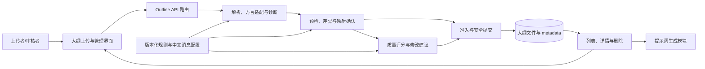

# 大纲管理模块概要设计

> documentType: overview-design
> moduleId: outline-management
> owner: Architect
> 文档层级：模块概要设计
> 当前基线：`routes/outline.js` 文件型实现
> 演进范围：P1-P5 大纲兼容与质量治理
> 更新日期：2026-08-17

## 1. 产品目标与用户

大纲管理模块解决的不是“把文件存下来”，而是让用户确认上传内容已经成为可用于知识库生成的标准知识点树。当系统不能可靠转换时，应明确指出位置、原因和下一步动作，避免“上传成功但知识点为 0”或静默丢失标题。

| 用户 | 核心任务 | 业务诉求 |
|---|---|---|
| 数据库管理员 | 上传管理员手册等领域大纲 | 保留原稿；快速知道能否上传；问题能定位到原行并可修改 |
| 知识库维护者 | 审核、选择知识点并生成提示词 | 树结构稳定、知识点 ID 唯一、描述足以支撑后续生成 |
| 规则运营人员 | 调整解析和评分规则 | 规则可版本化、可回归、可审计、可回退，历史结论可解释 |
| 开发与测试人员 | 演进上传链路 | 接口契约单一、失败无残留、真实 API 结果可重复验证 |

成功标准是：用户看到的预检树、确认落库的详情树和下游消费的知识点树一致；所有阻断和扣分均有证据；任何失败都不覆盖原稿或留下不完整正式记录。

## 2. 模块边界

### 2.1 模块内职责

- 接收单个 JSON、Markdown 或 CSV 大纲文件，执行大小、格式和编码等准入检查。
- 识别输入方言，归一化为 `parts → chapters → kps` 标准树并统计知识点。
- 输出带行号或字段路径的诊断、未决映射和结构化转换差异。
- 在用户确认后安全持久化原文件、标准树、摘要和规则版本。
- 管理大纲列表、详情与删除，并向提示词生成链路提供选定知识点。
- 对标准树进行确定性评分，生成有证据、可执行、可复评的修改建议。

### 2.2 模块外职责

- 原始手册正文的编辑和领域事实补写不由本模块自动完成。
- 文档正文生成、模板选择和事实正确性验证属于下游文档生成模块。
- PingCode 素材下载、Office/PDF 预处理和通用 `sections` 文档树不等同于大纲标准树。
- 身份认证、全局限流和基础存储平台由系统公共能力提供；本模块只声明使用边界。

## 3. 架构与组件



| 组件 | 稳定责任 | 当前实现 | 目标状态 |
|---|---|---|---|
| 大纲管理界面 | 选择文件、展示树、诊断、差异、评分和确认状态 | `OutlineUploader.js` 与 `prompt-generator.html` | 只消费服务端事实，中文完成预检到确认闭环 |
| Outline API | 协议适配、权限上下文、错误映射和响应 | `routes/outline.js` 集中实现全部职责 | 路由变薄，调用解析、预检、评分和提交服务 |
| 解析与诊断 | 输入方言识别、来源 AST、标准树和可定位诊断 | 路由内 Markdown 正则，浏览器另有解析逻辑 | 服务端单一事实来源，规则和方言版本化 |
| 预检与确认 | 无正式落库地计算差异并绑定用户确认 | 尚未实现 | 摘要、规则版本和短期令牌绑定确认内容 |
| 评分与建议 | 确定性评分、证据、建议和准入结论 | 规格已定义，代码尚未实现 | 配置化八维评分和可审计治理 |
| 安全提交 | 写前校验、原子持久化、幂等和补偿 | Multer 先写文件，metadata 直接改写 | 失败无残留，响应计数与持久化树一致 |
| 查询与下游适配 | 列表、详情、删除和选点生成提示词 | `routes/outline.js` | 只暴露已准入标准树，保持兼容读取 |

## 4. 上下游与数据契约

### 4.1 上游输入

- 浏览器以 `multipart/form-data` 提交 `file`，可附带 `name` 和 `type`。
- P1 延续当前 `POST /api/outline/upload`；P4 规划 `POST /api/outline/preflight` 和 `POST /api/outline/confirm`。
- 文件约束、标准树和评分基线见[上传内容与格式规格](../development/29-YashanDB知识库大纲上传内容与格式规格.md)。

### 4.2 模块核心数据

标准树的稳定业务契约为：

```text
Outline(title, specVersion, ruleVersion)
  └─ Part(part, level)
       └─ Chapter(name)
            └─ KnowledgePoint(id, name, desc)
```

来源 AST、诊断、未决映射、结构差异、内容摘要和评分报告是处理上下文，不得被误当作知识点树本身。正式记录需要能够追溯其规格版本、解析规则版本和内容摘要。

### 4.3 下游输出

- 管理界面通过列表和详情接口展示已上传大纲。
- 提示词生成模块按 `part + chapter + kp_id` 提取知识点，消费 `name` 和 `desc`。
- 测试与运营侧消费诊断码、规则版本、评分证据和脱敏指标，不消费完整敏感正文。

## 5. 主流程与不变量

```text
选择文件
 → 文件准入检查
 → 方言识别与来源 AST
 → 标准树归一化
 → 结构校验与诊断
 → [存在阻断/未决] 返回位置、原因和修改动作，不正式落库
 → [可继续] 展示转换差异与质量评分
 → 用户确认绑定的内容摘要和规则版本
 → 写前复核
 → 原子提交文件与 metadata
 → 返回大纲 ID 和知识点计数
 → 列表/详情/提示词生成消费同一标准树
```

必须长期成立的不变量：

1. 原始用户文件只读，系统转换产物使用新对象保存。
2. 服务端是解析、诊断和准入的唯一事实来源。
3. 归一化后至少包含一个知识点，且每个知识点有唯一 ID、非空名称、描述和所属章节。
4. 任何歧义节点进入 `unresolvedMappings`，不得静默提升、删除或虚构描述。
5. 未确认、令牌失效、摘要不一致或存在阻断时不得正式落库。
6. 成功响应的 `kp_count`、详情树计数和持久化树计数完全一致。
7. 失败请求不留下正式文件或 metadata 半成品。

## 6. 架构演进映射

| 阶段 | 用户可感知结果 | 架构落点 | 设计 |
|---|---|---|---|
| P1 基线 | 获得不覆盖原稿的规范副本和问题映射 | 固化输入规格、转换报告和真实 API 基准 | [P1 设计](../development/39-管理员手册大纲兼容阶段一-基线与规范副本设计.md) |
| P2 统一解析 | 普通标题树也能被识别，错误可定位 | 服务端 AST、方言适配器、诊断和版本化配置 | [P2 设计](../development/40-管理员手册大纲兼容阶段二-统一解析与结构化诊断设计.md) |
| P3 安全上传 | 不再出现“成功但 0 知识点”，失败无残留 | 写前准入、原子提交、幂等、补偿和真实 API 门禁 | [P3 设计](../development/41-管理员手册大纲兼容阶段三-安全上传与真实API验收设计.md) |
| P4 预检确认 | 上传前看到转换差异并处理歧义 | 无副作用预检、结构 diff、确认令牌和状态机 | [P4 设计](../development/42-管理员手册大纲兼容阶段四-预检差异确认与正式上传设计.md) |
| P5 质量治理 | 看到分项得分、证据和可执行修改建议 | 确定性评分、建议模板、准入策略和规则治理 | [P5 设计](../development/43-管理员手册大纲兼容阶段五-评分建议与持续治理设计.md) |

P2 改变解析和零知识点上传行为，P4 新增预检/确认 API，均属于需要人类审批的架构或公共行为变更。P1 可先独立交付，P3-P5 按前置阶段串行推进。

## 7. 接口与代码映射

| 能力 | 当前/规划接口 | 主要代码或设计责任 |
|---|---|---|
| 上传 | `POST /api/outline/upload` | 当前见 [`routes/outline.js`](../../../../routes/outline.js)；P2/P3 后接入统一解析和安全提交 |
| 列表 | `GET /api/outline/list` | 返回 metadata 及标准树，兼容读取旧记录 |
| 详情 | `GET /api/outline/:id` | 返回单个正式大纲记录 |
| 删除 | `DELETE /api/outline/:id` | 删除记录和所属文件；破坏性边界需精确限定对象 |
| 生成提示词 | `POST /api/outline/generate-prompts` | 按标准树提取所选知识点并调用下游生成器 |
| 预检 | `POST /api/outline/preflight`（P4 规划） | 无正式落库副作用，返回诊断、差异、未决映射和确认条件 |
| 确认 | `POST /api/outline/confirm`（P4 规划） | 校验令牌、摘要、规则版本和幂等键后调用安全提交 |

## 8. 非功能约束

- 安全：限制文件大小和类型；拒绝路径穿越、敏感内容和伪造客户端标准树；日志不记录全文、令牌或凭据。
- 一致性：并发提交不得覆盖 metadata；文件与 metadata 作为一个业务提交处理。
- 可追溯：诊断、映射、评分和正式记录携带稳定码、来源位置、规格版本和规则版本。
- 可配置：解析规则、阈值、消息、评分权重和建议模板不得散落硬编码。
- 可测试：实现测试必须启动真实后端，通过 HTTP 调用接口，并核对响应、文件和 metadata 状态。
- 可用性：所有用户界面和错误信息使用中文，长标题和问题列表在桌面与移动端均可操作。

## 9. 需求与任务入口

模块需求由[大纲兼容模块需求](../../../../../.codex/requirements/modules/outline-management/REQ-OUTLINE-COMPATIBILITY.md)维护，项目状态由[实施计划](../../../../../.codex/workflow/modules/outline-management/PLAN.md)和[开发进度](../../../../../.codex/workflow/modules/outline-management/PROGRESS.md)维护。开发执行以以下任务卡为准：

- [P1 规格基线与样本规范化](../../../../../.codex/workflow/tasks/outline-management/TASK-OUTLINE-EVOLUTION-P1.md)
- [P2 统一解析与结构化诊断](../../../../../.codex/workflow/tasks/outline-management/TASK-OUTLINE-EVOLUTION-P2.md)
- [P3 上传准入与真实 API 回归](../../../../../.codex/workflow/tasks/outline-management/TASK-OUTLINE-EVOLUTION-P3.md)
- [P4 预检转换与差异确认](../../../../../.codex/workflow/tasks/outline-management/TASK-OUTLINE-EVOLUTION-P4.md)
- [P5 评分建议与持续演进](../../../../../.codex/workflow/tasks/outline-management/TASK-OUTLINE-EVOLUTION-P5.md)

模块任务状态和证据以模块 `PROGRESS.md` 为准，全局 `PROGRESS.md`、`RISKS.md` 和 `NEXT.md` 只做跨模块汇总；概要设计不复制动态状态，避免多处信息漂移。

## 10. 相关设计

- [文档预处理与大纲管理设计](../../../18-文档预处理与大纲管理设计.md)：现有大纲列表、删除和提示词生成背景。
- [前后端分离重构设计](../../../15-前后端分离重构设计.md)：Outline API 与前后端组件的系统位置。
- [数据库方案设计](../../../16-数据库方案设计.md)：文件型 metadata 与未来仓储边界。
- [模块文档索引](../README.md)：本模块所有概要和开发设计入口。
