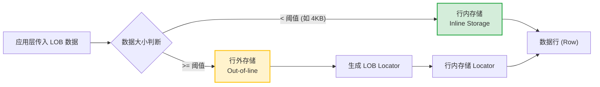

```yaml
知识库ID: YDB-通用基础-012
标题: 大对象数据类型（CLOB/BLOB/NCLOB）兼容性
分类: 通用基础
认知阶段: ☑感性认知 ☑模型语言 □内部机理 □架构生态 □实践调优
关联知识: YDB-通用基础-002 (基础数据类型)
适用版本: YashanDB 23.1+
生成方式: AI生成 + 人工审阅
生成日期: 2023-10-27
审阅状态: ☑已审阅
```

---

## 一、一句话定义

> 大对象（LOB）数据类型（CLOB、BLOB、NCLOB）用于在数据库中存储和管理超大容量的字符或二进制数据，YashanDB 完全兼容 Oracle 的 LOB 类型定义与操作语义，实现非结构化数据与关系型数据的统一存储。

---

## 二、解决了什么？

### 痛点

- **长度限制**：传统的 `VARCHAR2` 和 `RAW` 类型存在最大长度限制（如 4KB 或 32KB），无法满足存储长文本、PDF文档、图片、音视频等大对象数据的需求。
- **管理割裂**：如果不使用数据库存储大对象，应用层通常需要将文件存储在文件系统（如 NFS、OSS）中，导致数据与业务逻辑割裂，难以保证事务一致性，且备份恢复复杂。

### 收益

- **海量存储**：提供高达数 GB 的单列存储能力，轻松应对超大文本和二进制文件。
- **事务一致性**：大对象数据与普通数据一样参与数据库事务（ACID），确保业务数据与附件数据的强一致性。
- **统一运维**：大对象数据纳入数据库统一的备份、恢复、权限控制和审计体系，降低运维复杂度。

---

## 三、核心概念

| 术语 | 定义 | 类比 |
|------|------|------|
| **CLOB** | Character Large Object，存储单字节或多字节字符数据（最大 4GB）。 | 一本超厚的纯文本小说。 |
| **BLOB** | Binary Large Object，存储无类型二进制数据（最大 4GB）。 | 一个装满照片、视频和压缩包的硬盘。 |
| **NCLOB** | National Character Large Object，存储 Unicode（国家字符集）字符数据（最大 4GB）。 | 一本包含多国语言翻译的超厚字典。 |
| **LOB Locator** | LOB 定位器，行内存储的指针结构，指向实际 LOB 数据的物理存储位置。 | 图书馆的索书号，告诉你这本厚书具体在哪个书架。 |

---

## 四、工作原理

### 基本流程

1. **数据写入**：应用层通过 SQL 或 `DBMS_LOB` 接口将大对象数据传入数据库引擎。
2. **存储分配**：数据库根据数据大小和配置阈值进行判断。若数据较小（如小于 4KB），则采用**行内存储（Inline）**；若数据较大，则采用**行外存储（Out-of-line）**，并在数据行内仅保留 LOB Locator。
3. **数据读取**：应用层发起查询，数据库通过行内的 LOB Locator 定位到行外存储区，读取对应的数据块并流式返回给客户端。

### 示意图



---

## 五、常见操作

### 示例1：创建包含 LOB 类型的表

```sql
-- 创建包含 CLOB, BLOB, NCLOB 的测试表
CREATE TABLE lob_test_table (
    id NUMBER PRIMARY KEY,
    doc_name VARCHAR2(100),
    doc_content CLOB,
    doc_image BLOB,
    doc_translate NCLOB
);
```

### 示例2：插入与查询 LOB 数据

```sql
-- 插入数据
INSERT INTO lob_test_table (id, doc_name, doc_content, doc_image, doc_translate)
VALUES (
    1, 
    'test_doc.txt', 
    'This is a very long text content for testing CLOB data type in YashanDB.', 
    HEXTORAW('DEADBEEFCAFEBABE'), 
    N'这是用于测试 NCLOB 数据类型的多语言翻译内容。'
);

-- 查询数据（对于 CLOB/NCLOB，可直接查询；BLOB 通常需要转换或在应用层处理）
SELECT 
    id, 
    doc_name, 
    DBMS_LOB.GETLENGTH(doc_content) AS clob_len, 
    doc_translate 
FROM lob_test_table 
WHERE id = 1;
```

### 示例3：使用 DBMS_LOB 包进行局部更新

```sql
-- 追加内容到 CLOB，避免整体重写
DECLARE
    v_clob CLOB;
    v_append_text VARCHAR2(100) := ' Appended text via DBMS_LOB.';
BEGIN
    -- 锁定行并获取 LOB 定位器
    SELECT doc_content INTO v_clob FROM lob_test_table WHERE id = 1 FOR UPDATE;
    
    -- 追加数据
    DBMS_LOB.WRITEAPPEND(v_clob, LENGTH(v_append_text), v_append_text);
    
    COMMIT;
END;
/

-- 验证追加结果
SELECT DBMS_LOB.GETLENGTH(doc_content) AS new_clob_len FROM lob_test_table WHERE id = 1;
```

### 示例4：清理环境

```sql
-- 删除测试表并释放空间
DROP TABLE lob_test_table PURGE;
```

---

## 六、避坑指南

### ✅ 推荐做法

- **流式读写**：在应用层（如 Java/JDBC）使用流式接口（`setCharacterStream` / `setBinaryStream`）读写 LOB，避免将整个大文件一次性加载到内存中导致 OOM。
- **局部修改**：对于频繁更新的 LOB 数据，建议使用 `DBMS_LOB.WRITE` 或 `DBMS_LOB.WRITEAPPEND` 进行局部修改，而不是重新赋值整个 LOB。
- **独立表空间**：建议将包含大型 LOB 数据的表分配到独立的表空间，并配置独立的 LOB 段参数，便于空间管理和备份恢复。

### ❌ 常见错误

| 错误做法 | 后果 | 正确做法 |
|---------|------|---------|
| 在 SQL 中直接使用 `=` 比较 LOB 列 | 报错：不支持对 LOB 进行等值比较（如 `ORA-00932` 或 YashanDB 对应错误码）。 | 使用 `DBMS_LOB.COMPARE` 函数进行内容比较。 |
| 将大文件一次性加载到内存中处理 | 导致应用 OOM（内存溢出）或数据库 PGA 耗尽，系统崩溃。 | 使用流式读写（Stream）或 `DBMS_LOB` 分块（Chunk）处理。 |
| 频繁对行内 LOB 进行更新导致行迁移 | 产生大量行迁移/行链接，导致全表扫描和索引扫描性能急剧下降。 | 合理设置 `PCTFREE`，或将大对象数据分离到独立的子表中。 |

---

## 七、自测复述

- [ ] 我能用大白话向同事解释清楚 CLOB、BLOB 和 NCLOB 的区别及适用场景吗？
- [ ] 我能在测试环境复现并验证 LOB 的行内/行外存储行为及 `DBMS_LOB` 的基本操作吗？
- [ ] 我知道在 YashanDB 中操作 LOB 数据时，哪些 SQL 操作是不被允许的（如直接使用 `=` 比较）吗？

---

## 八、进一步学习

- **关联知识**：
  - `YDB-通用基础-002`：基础数据类型（VARCHAR2、RAW 等）
  - `YDB-理论机制-012`：LOB 存储机制与行内/行外存储原理
- **深入阅读**：
  - YashanDB 官方文档《SQL 语言参考》 -> 数据类型 -> 大对象类型
  - YashanDB 官方文档《PL/SQL 开发指南》 -> 内置包 -> DBMS_LOB

---

## 填写检查清单

- [x] 元数据区完整（ID、标题、分类、版本）
- [x] 一句话定义清晰准确
- [x] 痛点和收益具体明确
- [x] 核心概念表包含关键术语
- [x] 工作原理有流程图或步骤说明
- [x] 常见操作有可执行的示例（包含建表、插入、更新、查询、清理）
- [x] 避坑指南包含正反两面
- [x] 自测清单可验证理解