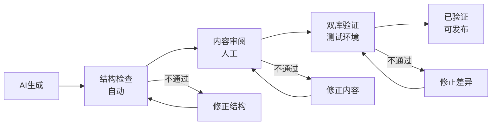

# 质量验证标准

> 生成文档后的质量检查清单，分为结构检查、内容检查、可执行检查三个层次。

---

## 一、结构完整性检查（自动）

| 检查项 | 说明 | 通过标准 |
|--------|------|---------|
| 元数据完整 | YAML 头包含所有必填字段 | ID、标题、分类、版本、日期 |
| 章节完整 | 模板中所有必选章节均已填写 | 无空白占位符 `[xxx]` 残留 |
| 标题层级 | 标题层级正确（# → ## → ###） | 无跳级 |
| 代码块格式 | 所有代码块有语言标签 | 无空标签代码块 |
| 图表格式 | 所有图表使用 Mermaid | 无 ASCII art |

## 二、内容准确性检查（人工）

| 检查项 | 说明 | 通过标准 |
|--------|------|---------|
| 概念准确 | 技术概念描述正确 | 与官方文档一致 |
| SQL 正确 | SQL 语法正确、可执行 | 在测试环境验证通过 |
| 差异准确 | 兼容性差异描述准确 | 双库对比验证 |
| 示例可运行 | 所有 SQL 示例可独立执行 | 包含建表和清理 |
| 无客户信息 | 不含客户名称和业务表名 | 使用行业通用示例 |

## 三、可执行验证（双库测试）

| 检查项 | 说明 | 通过标准 |
|--------|------|---------|
| Oracle 执行 | 在 Oracle 环境执行示例 SQL | 记录实际输出 |
| YashanDB 执行 | 在 YashanDB 环境执行示例 SQL | 记录实际输出 |
| 结果对比 | 对比两个数据库的输出 | 标注差异点 |
| 错误处理 | 验证错误场景的报错信息 | 记录错误码和消息 |

## 四、审阅状态流转

## 五、质量评分标准

| 维度 | 权重 | 评分标准 |
|------|------|---------|
| 结构完整性 | 20% | 所有章节填写完整、格式正确 |
| 内容准确性 | 30% | 技术描述准确、无事实错误 |
| 示例可执行性 | 25% | SQL 可独立运行、输出正确 |
| 差异覆盖度 | 15% | 主要差异点均已覆盖 |
| 可读性 | 10% | 语言清晰、图表辅助理解 |

**合格标准**：总分 ≥ 80 分，且内容准确性 ≥ 25 分
