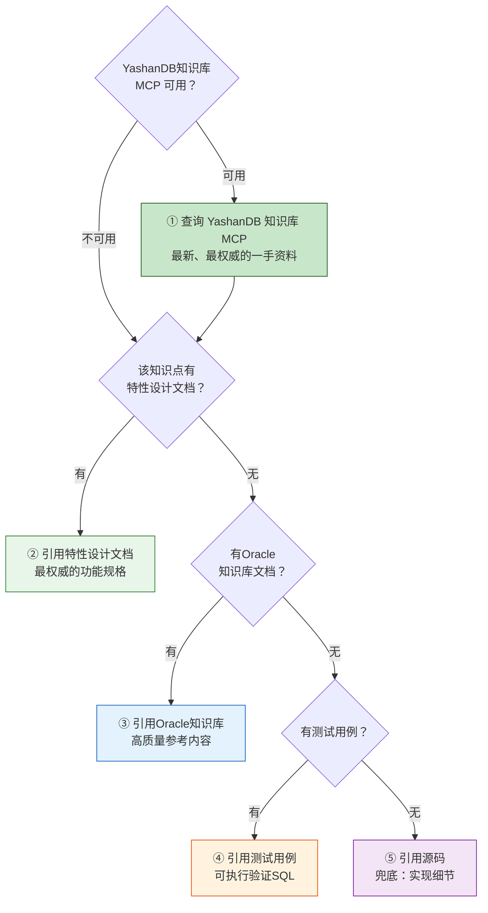

# 资料引用策略

> 生成文档时，按优先级自动引用参考资料，确保内容准确可信。

---

## 一、资料引用优先级



## 二、资料类型与用途

| 优先级 | 资料类型 | 存放位置/来源 | 用途 | 引用方式 |
|--------|---------|-------------|------|---------|
| ① | YashanDB 知识库 MCP | MCP Server（实时查询） | 最新功能规格、官方文档、已知差异 | 通过 MCP 工具查询，直接引用 |
| ② | 特性设计文档 | `knowledge/references/design-docs/` | 功能规格、行为定义 | 直接引用设计描述 |
| ③ | Oracle知识库 | `knowledge/references/oracle-kb/` | 高质量参考内容 | 改写为YashanDB版本 |
| ④ | 测试用例 | `knowledge/references/test-cases/` | 可执行验证SQL | 直接作为示例 |
| ⑤ | 源码 | `knowledge/references/source/` | 实现细节、行为兜底 | 提取关键逻辑描述 |

## 三、YashanDB 知识库 MCP

### 3.1 概述

YashanDB 知识库 MCP（Model Context Protocol）是一个实时知识查询服务，提供对 YashanDB 官方文档、技术手册、兼容性说明等知识库内容的直接访问能力。相比静态文件引用，MCP 具有以下优势：

- **实时性**：始终获取最新的文档内容，无需手动同步
- **精确性**：支持按知识点、功能模块精确检索
- **完整性**：覆盖 YashanDB 全量官方文档

### 3.2 MCP 配置要求

在使用本 Skill 仓库生成文档前，**必须确认** YashanDB 知识库 MCP 已正确配置。配置方式：

```json
{
  "mcpServers": {
    "yashandb-kb": {
      "command": "<mcp-server-command>",
      "args": ["<args>"],
      "env": {
        "YASHANDB_KB_ENDPOINT": "<endpoint_url>"
      }
    }
  }
}
```

> ⚠️ **未配置 MCP 时的降级策略**：如果 YashanDB 知识库 MCP 不可用，系统将自动降级到本地 `knowledge/references/` 目录中的静态资料，按优先级 ②→③→④→⑤ 依次引用。但生成的文档需在末尾标注：`> ⚠️ 本文档生成时 YashanDB 知识库 MCP 不可用，内容基于本地静态资料生成，建议人工复核最新官方文档。`

### 3.3 MCP 查询规范

通过 MCP 查询资料时，遵循以下规范：

1. **查询关键词**：使用知识点名称 + 关键功能词作为查询条件
2. **结果验证**：MCP 返回的内容需与知识点描述匹配，不匹配则降级到下一级资料源
3. **引用标注**：MCP 查询结果引用格式为 `> 来源：YashanDB 知识库 MCP 查询 [查询关键词]，[返回文档标题]`

### 3.4 MCP 可用工具（预期）

| 工具名称 | 功能 | 使用场景 |
|---------|------|---------|
| `search_docs` | 按关键词搜索文档 | 查找功能说明、语法参考 |
| `get_compatibility` | 查询兼容性差异 | 兼容性差异类文档生成 |
| `get_sql_reference` | 查询 SQL 语法参考 | SQL/开发参考类文档生成 |
| `get_architecture` | 查询架构设计文档 | 架构对比类文档生成 |

> 注：具体工具名称以实际 MCP Server 提供的为准，以上为预期工具清单。

## 四、引用规则

### 4.1 YashanDB 知识库 MCP 引用

- 优先使用 MCP 查询最新官方文档
- 查询结果可直接引用，无需改写
- 如 MCP 返回内容与知识点不匹配，降级到本地资料
- 引用格式：`> 来源：YashanDB 知识库 MCP [文档标题]`

### 4.2 特性设计文档引用

- 直接引用文档中的功能描述和行为定义
- 保留文档中的参数说明和限制条件
- 如文档中有示例代码，优先使用

### 4.3 Oracle知识库引用

- **禁止直接复制**：必须改写为YashanDB版本
- 保留结构和方法论，替换具体产品特性
- 标注与Oracle的差异点（如有）
- 引用格式：`> 参考：Oracle知识库 [文档名称]，已改写为YashanDB版本`

### 4.4 测试用例引用

- 直接使用测试用例中的SQL作为示例
- 补充预期输出和执行说明
- 如有双库测试数据，标注差异

### 4.5 源码引用

- 不直接引用代码，而是提取行为描述
- 用自然语言描述实现逻辑
- 标注"基于源码分析"

## 五、资料索引

### 5.1 YashanDB 知识库 MCP 索引

MCP 为实时查询服务，无需维护静态索引。查询时直接使用知识点关键词即可。

### 5.2 特性设计文档索引

| 知识点 | 设计文档路径 | 说明 |
|--------|-------------|------|
| [待补充] | `knowledge/references/design-docs/[待补充]` | [待补充] |

### 5.3 Oracle知识库映射

| YashanDB知识点 | 对应Oracle文档 | 映射说明 |
|---------------|---------------|---------|
| 集群基础概念 | `knowledge/references/oracle-kb/01-Oracle集群基础概念与架构.md` | 改写为YashanDB版本 |
| 集群核心组件 | `knowledge/references/oracle-kb/02-集群核心组件与内部机制.md` | 改写为YashanDB版本 |
| 资源管理运维 | `knowledge/references/oracle-kb/03-集群资源管理与日常运维.md` | 改写为YashanDB版本 |
| 性能监控诊断 | `knowledge/references/oracle-kb/04-集群性能监控与诊断.md` | 改写为YashanDB版本 |
| 性能调优 | `knowledge/references/oracle-kb/05-集群性能调优实战.md` | 改写为YashanDB版本 |
| 高可用容灾 | `knowledge/references/oracle-kb/06-高可用与容灾架构.md` | 改写为YashanDB版本 |
| 内核机制 | `knowledge/references/oracle-kb/07-集群内核机制深度解析.md` | 改写为YashanDB版本 |

### 5.4 测试用例索引

| 知识点 | 测试用例路径 | 说明 |
|--------|-------------|------|
| [待补充] | `knowledge/references/test-cases/[待补充]` | [待补充] |

### 5.5 源码索引

| 知识点 | 源码路径 | 说明 |
|--------|---------|------|
| [待补充] | `knowledge/references/source/[待补充]` | [待补充] |

## 六、引用标注规范

生成文档中引用外部资料时，使用以下标注格式：

- MCP 查询引用：`> 来源：YashanDB 知识库 MCP [文档标题]`
- 设计文档引用：`> 参考：特性设计文档 [文档名称]`
- Oracle知识库引用：`> 参考：Oracle知识库 [文档路径]，已改写为YashanDB版本`
- 测试用例引用：`> 来源：测试用例 [用例名称]`
- 源码分析引用：`> 基于源码分析`
- MCP 不可用降级标注：`> ⚠️ 本文档生成时 YashanDB 知识库 MCP 不可用，内容基于本地静态资料生成，建议人工复核最新官方文档。`

## 七、前置检查

在每次生成文档前，**必须执行前置检查脚本**确认资料引用环境就绪：

```bash
bash tools/repository/pre-check-references.sh
```

脚本会检查：
1. YashanDB 知识库 MCP 是否已配置并可用
2. `knowledge/references/` 目录下各资料子目录是否存在
3. Oracle 知识库文档是否完整
4. 缺失的资料类型给出补充提示

详见 `tools/repository/pre-check-references.sh` 和 `README.md` 中的使用说明。
