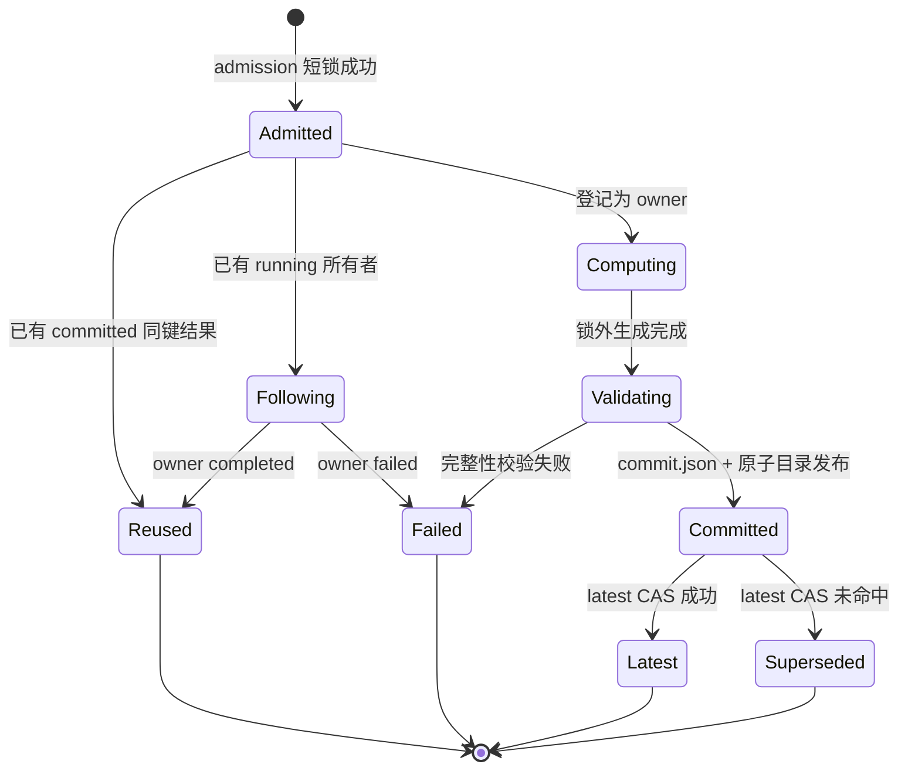

# PingCode 知识加工流水线详细设计

> 版本：v1.1
> 日期：2026-08-07
> 状态：当前前端可见流水线已收敛为四阶段；历史六步骤中的按需语义补充未实现，后续需单独设计和验收
> 上位设计：`docs/04-pingcode-processing-e2e-framework-design.md`

专项设计：

- `docs/01-PingCode资料预处理步骤详细设计.md`
- `docs/11-PingCode元数据构建步骤详细设计.md`
- `docs/12-PingCode知识提取步骤详细设计.md`
- `docs/13-PingCode按需语义补充步骤详细设计.md`
- `docs/14-PingCode知识校验与合并步骤详细设计.md`
- `docs/15-PingCode图谱与数据集生成步骤详细设计.md`

## 一、设计目标

本设计固定知识加工流水线当前可执行的四个前端可见步骤，明确每一步的输入、输出、主要功能、执行方、失败处理和落盘产物。历史六步骤设计中的 `semantic_enrichment` 按需语义补充暂未实现，不作为当前前端阶段和后端执行路径。

```text
1. 资料预处理
2. 元数据构建
3. 知识提取
4. 索引生成
```

核心原则：

1. 四阶段及阶段内的固定流程由代码调度；是否调用模型由具体任务模式和既有知识提取实现决定；
2. 每一步只读取上一步已经落盘并通过 Schema 校验的产物；
3. 原始资料永久保留，步骤之间传递结构化元数据、候选结果和必要证据片段；处理单元是原文的处理视图，不代表删除或覆盖原文；
4. “不确定项识别”只能作为质量问题记录，不触发未实现的按需语义补充；
5. 后续如引入模型输出，不能直接进入图谱，必须经过代码校验；
6. 第 4 步只读取已落盘的候选、质量问题和索引输入构建图谱/数据集；
7. 任何失败、跳过和降级都必须生成中文说明和可追溯事件。

## 二、总体数据流

```text
MaterialBatch
  │
  ▼
资料预处理
  ├─ metadata/source-documents.jsonl
  ├─ metadata/chunks.jsonl
  └─ quality/preparation-issues.json
  │
  ▼
元数据构建
  ├─ metadata/documents.jsonl
  └─ metadata/chunk-contexts.jsonl
  │
  ▼
知识提取
  ├─ extraction-results/knowledge-candidates.jsonl
  └─ quality/extraction-issues.json
  │
  ▼
索引生成
  ├─ final-results/knowledge.jsonl
  ├─ final-results/rejected.jsonl
  ├─ graph/nodes.json
  ├─ graph/edges.json
  ├─ dataset/manifest.json
  └─ run-report.json
```

## 三、公共运行契约

### 3.1 运行上下文 `PipelineRunContext`

每一步接收同一个只读运行上下文，不通过全局变量隐式传递状态。

```json
{
  "taskId": "training_xxx",
  "batchId": "batch_xxx",
  "datasetId": "dataset_xxx",
  "pipelineVersion": "2.0",
  "config": {
    "preset": "training_standard",
    "segmentationStrategy": "structure_first",
    "maxUnitCharacters": 6000,
    "boundaryContextMode": "metadata",
    "fallbackOverlapCharacters": 0
  },
  "runRoot": "training-runs/training_xxx",
  "createdAt": "2026-07-27T10:00:00+08:00"
}
```

约束：

- `runRoot` 对外只返回相对路径；
- 模型密钥、Cookie、认证头不得进入运行上下文；
- `pipelineVersion` 用于识别产物契约，禁止用同一版本静默改变字段含义；
- 每个输入文件和产物记录必须包含稳定标识和内容哈希。

### 3.2 公共步骤结果 `StageResult`

```json
{
  "stage": "metadata_construction",
  "state": "completed",
  "inputCount": 42,
  "outputCount": 42,
  "failedCount": 0,
  "skippedCount": 0,
  "startedAt": "2026-07-27T10:01:00+08:00",
  "completedAt": "2026-07-27T10:01:12+08:00",
  "durationMs": 12000,
  "message": "元数据构建完成：42 篇文档",
  "artifacts": ["metadata/documents.jsonl"],
  "metrics": {}
}
```

步骤状态只使用：

```text
pending / running / completed / skipped / failed / cancelled
```

`skipped` 和 `failed` 必须包含中文 `message`，不得只返回状态码。

### 3.3 证据契约

所有进入最终知识的知识点、实体和关系必须包含：

```json
{
  "sourceResourceId": "resource_xxx",
  "chunkId": "resource_xxx:0",
  "sourcePath": "docs/error-code.md",
  "evidenceText": "YAS-00001 表示参数 p_size 无效。",
  "evidenceOffsets": {
    "start": 120,
    "end": 145
  }
}
```

证据文本必须能在对应处理单元原文中精确回查。无法回查的结果不能进入 `final-results/knowledge.jsonl`。

### 3.4 原文保留与处理单元

资料处理不得以“分块”作为删除原文的理由。运行产物至少区分三层内容：

```text
originalContent       原始文件内容，永久保留，只读
normalizedContent     编码、换行和 Unicode 规范化后的内容
processingUnits       面向提取的结构化处理单元
```

处理单元采用“结构优先、必要时再切分”的策略：

- 短文档可以整篇作为一个处理单元；
- 标题、段落、表格、列表和保留的非 C/C++ 代码块优先保持完整；C/C++ 代码块仅从加工视图排除，原始层永久保留；
- 超过 `maxUnitCharacters` 的结构块才按边界二次切分；
- 默认不强制重叠，跨单元上下文通过标题路径、相邻单元摘要和引用关系传递；
- 只有在结构无法安全切分时才使用 `fallbackOverlapCharacters`，且必须记录重叠来源和偏移；
- 被判定为导航、重复页脚等非正文内容时，不得静默删除，必须记录排除原因和原文偏移。

### 3.5 代码、Agent、Skill 与模型的职责边界

流水线不是 Skill 驱动，而是代码驱动：

```text
PipelineScheduler（代码）
  -> PipelineStage（代码）
     -> 必要时创建 AgentTask（代码）
        -> 专用 Agent 加载 Prompt + Skill + ContextEnvelope
           -> 调用大模型
        <- AgentResult
     -> 代码校验、落盘、事件和状态迁移
```

职责固定如下：

- 代码：决定步骤顺序、输入范围、是否调用 Agent、超时重试、Schema 校验、证据校验、落盘和恢复；
- 专用 Agent：针对一个明确任务组织提示词、Skill 和上下文，并把模型结果转换为约定结构；
- Skill：提供 Agent 执行任务所需的方法、领域说明、工具使用方式和输出约束，不承担步骤调度；
- 大模型：完成需要语义理解的提取、类型候选发现、指代消解和关系判断；
- 前端：只展示一个知识加工任务及其四个稳定阶段，不展示独立资料预处理任务，也不展示 Agent 或 Skill 为额外流水线步骤；源文件检查和加工预览属于启动前检查，不生成第二条正式产物链。

## 四、步骤一：资料预处理

### 4.1 步骤标识

```text
material_preparation
```

### 4.2 执行方

资源预处理阶段包含清洗、低成本初筛、embedding 生成和聚类报告四类确定性或可降级工作。embedding/cluster 在 `preselection-report.json` 完成后执行，写入 `metadata/embedding-index.jsonl` 与 `metadata/cluster-report.json`；失败只写 `quality/embedding-issues.json` 或 `quality/cluster-issues.json`，后续关键词默认档继续执行。

仅代码执行，不调用大模型。

### 4.3 输入

| 输入 | 来源 | 必填 | 说明 |
|---|---|---|---|
| `MaterialBatch` | 素材批次服务 | 是 | 批次、来源类型、资源清单和逻辑路径 |
| 原始资源文件 | 下载目录或上传目录 | 是 | 已下载的 Markdown、文本、Office 和 PDF；图片/附件仅作为已下载关联资源校验 |
| `PreprocessConfig` | 任务请求 | 是 | 清洗预设、结构化处理单元上限和边界策略 |
| 文件格式策略 | 服务配置 | 是 | 可处理、待转换、隔离和忽略规则 |

### 4.4 主要功能

1. 扫描批次资源，校验文件存在性、大小、编码、来源路径和上游登记哈希；
2. 识别空文件、重复文件、乱码、不可支持格式和危险文件；
3. 将 Office 和可提取文本 PDF 转换为统一 Markdown，扫描型 PDF 标记为 `ocr_required`，不自动 OCR；
4. 执行编码、换行和 Unicode 规范化，从加工视图排除 C/C++ 围栏代码块，并保留原始文件、排除偏移和来源映射；
5. 保留并校验图片、附件的批次内相对引用，不在本步骤重新下载或识别类型；
6. 解析 Markdown 标题层级和结构块；
7. 按结构优先策略生成处理单元，默认上限 6000 字符，超长结构块才执行二次切分；
8. 记录处理单元在规范化正文中的字符偏移、内容哈希，以及 PDF 页码、Office 段落/表格/单元格等原始位置；
9. 生成准备阶段质量问题，不做知识判断。

### 4.5 输出

#### `metadata/source-documents.jsonl`

```json
{
  "resourceId": "resource_xxx",
  "sourcePath": "docs/error-code.md",
  "fileName": "error-code.md",
  "mediaType": "text/markdown",
  "sourceType": "pingcode",
  "contentHash": "sha256:...",
  "originalContentArtifact": "originals/resource_xxx.md",
  "normalizedContentArtifact": "normalized/resource_xxx.md",
  "originalCharacters": 8230,
  "normalizedCharacters": 8230,
  "parseState": "completed",
  "excludedRanges": [],
  "warnings": []
}
```

#### `metadata/chunks.jsonl`

文件名沿用 `chunks.jsonl` 以兼容现有产物契约，但其中每条记录表示“结构化处理单元”，不是固定字符长度的机械切片。

```json
{
  "chunkId": "resource_xxx:0",
  "resourceId": "resource_xxx",
  "sourcePath": "docs/error-code.md",
  "chunkIndex": 0,
  "headingPath": ["错误码", "参数错误"],
  "content": "YAS-00001 表示参数 p_size 无效。",
  "contentHash": "sha256:...",
  "documentOffsets": {"start": 0, "end": 25},
  "previousChunkId": null,
  "nextChunkId": "resource_xxx:1",
  "overlap": {"enabled": false, "sourceChunkId": null}
}
```

#### `quality/preparation-issues.json`

保存格式不支持、内容为空、来源缺失、解析失败、转换失败、OCR 待处理、引用缺失和内容排除等问题。单资源问题必须包含中文原因及 `retryable` 标记；资源隔离不阻止批次其他资源继续处理。

### 4.6 完成条件

- 每个可处理文档至少生成一条文档记录；
- 每个处理单元具有来源、标题路径、内容哈希、偏移和原文映射；
- 不可处理文件有明确中文原因；
- 输出 Schema 校验通过后才能进入步骤二。

### 4.7 失败处理

- 单文件失败：保留原始文件，隔离资源，记录可重试信息，继续处理其他文件；
- 存在部分成功和部分隔离资源：步骤状态为 `completed_with_warnings`，允许后续单资源重试；
- 批次没有任何可处理文档：步骤失败，停止流水线；
- 用户取消：完成当前原子写入后标记取消，不生成后续步骤产物。

## 五、步骤二：元数据构建

### 5.1 步骤标识

```text
metadata_construction
```

### 5.2 执行方

仅代码执行，不调用大模型。

### 5.3 输入

| 输入 | 来源 |
|---|---|
| `metadata/source-documents.jsonl` | 步骤一 |
| `metadata/chunks.jsonl` | 步骤一 |
| 分类和关键词规则 | 代码配置 |
| YashanDB 产品、版本、错误码和对象词典 | 领域规则库 |

### 5.4 主要功能

1. 聚合文档级标题、路径、章节和长度信息；
2. 使用代码生成抽取式摘要，不生成模型自由摘要；
3. 根据目录、标题、扩展名和领域词典生成分类；
4. 使用词频、领域词典和格式规则生成关键词；
5. 提取文档中明确出现的版本、产品模块和来源描述；
6. 为每个分块生成轻量摘要；
7. 建立当前分块与前后分块的上下文索引；
8. 标记缺少标题、分类冲突和版本不明确等元数据问题。

### 5.5 输出

#### `metadata/documents.jsonl`

```json
{
  "resourceId": "resource_xxx",
  "sourcePath": "docs/error-code.md",
  "title": "YashanDB 错误码说明",
  "summary": "本文说明 YAS 错误码及相关参数。",
  "summaryMethod": "extractive_rule",
  "category": "故障诊断",
  "keywords": ["YAS-00001", "p_size", "错误码"],
  "applicableVersions": ["23.2.1"],
  "headingCount": 8,
  "chunkCount": 6,
  "metadataIssues": []
}
```

#### `metadata/chunk-contexts.jsonl`

```json
{
  "chunkId": "resource_xxx:0",
  "resourceId": "resource_xxx",
  "headingPath": ["错误码", "参数错误"],
  "chunkSummary": "YAS-00001 与参数 p_size 无效有关。",
  "previousChunkSummary": null,
  "nextChunkSummary": "下一节给出处理方法。",
  "documentCategory": "故障诊断",
  "documentKeywords": ["YAS-00001", "p_size"]
}
```

### 5.6 完成条件

- 每个文档有一条文档元数据；
- 每个分块有一条上下文元数据；
- 元数据记录与步骤一的 `resourceId/chunkId` 一一对应；
- 摘要必须标记生成方法，不能伪装为模型摘要。

### 5.7 失败处理

- 单项分类无法确定：分类设为“未分类”，记录元数据问题，不调用模型；
- 标题或来源缺失：记录 `human_required` 质量问题；
- 输入记录数量不一致：步骤失败，禁止进入步骤三。

## 六、步骤三：知识提取

### 6.1 步骤标识

```text
knowledge_extraction
```

### 6.2 执行方

步骤由代码驱动。代码先完成输入校验、明确锚点识别、领域词典匹配和上下文装配；正式知识构建沿用既有 `KnowledgeExtractionAgent` / Workflow Agent 路径生成知识点候选，并由代码完成证据校验、失败分类和质量问题归类。本轮只收敛前端可见阶段边界，不改变正式知识提取执行策略。

规则、词典、Agent 和 Skill 都是知识提取阶段内部执行输入，不是额外流水线阶段。Stage 的开始、结束、重试、落盘和失败处理仍由代码控制。

### 6.3 输入

| 输入 | 来源 |
|---|---|
| `metadata/chunks.jsonl` | 步骤一 |
| `metadata/documents.jsonl` | 步骤二 |
| `metadata/chunk-contexts.jsonl` | 步骤二 |
| 明确锚点识别器 | 代码配置 |
| 已发布的实体和关系类型 | 版本化知识 Schema |
| Agent 提示词和 Skill 清单 | Prompt Registry、Skill Registry |
| 模型配置和最近连接测试 | 文档生成器 Model Gateway |

#### 6.3.1 关键词默认档进度与取消契约

`keyword_analysis` 由代码按资源执行确定性规则，不调用模型。其提取规则、候选排序、预选 skip 语义和落盘格式保持不变，只补充内部进度与取消观测。

```python
def _keyword_analysis_progress_callback(
    task_id: str,
    total_chunks: int,
) -> Callable[[int, int, int, int, int, bool], None]:
    """参数为 processedResources/current/succeeded/failed/skipped/force。"""
```

计数口径：

- `current`：已经完成提取、失败或明确跳过的处理单元数；
- `succeeded`：完成确定性提取的处理单元数，不要求该单元一定产出关键词；
- `failed`：当前资源提取异常时包含的处理单元数，记录进度后仍按既有语义抛出异常并终止阶段；
- `skipped`：`preselectionState=skip` 的处理单元数；
- 始终满足 `current = succeeded + failed + skipped <= total_chunks`。

```text
extract_keyword_analysis(task, chunks):
  group chunks by resource without changing order or content
  check_cancel before/after each document summary resource
  current = succeeded = failed = skipped = 0
  for each resource:
    check_cancel()
    if preselection == skip:
      skipped += resource.chunkCount
    else:
      try deterministic_extract_with_existing_rules()
      catch:
        failed += resource.chunkCount
        current += resource.chunkCount
        emit_progress(force=true)
        raise
      succeeded += resource.chunkCount
    current += resource.chunkCount
    emit_progress when elapsed >= 1s or processedResources-last >= 50 or current == total
    check_cancel()
  persist exactly the existing artifacts
```

公开事件固定为 `knowledge_extraction.keyword_analysis.progress`，父任务 `progressDetail` 增加 `substage=keyword_analysis` 和累计计数。日志可以节流，资源前后的取消检查不得节流。该变更不修改 HTTP API、提取规则、模型调用边界、候选内容或产物 Schema。

### 6.4 知识 Schema 的发现与发布

实体和关系类型不能只靠代码从零构建。代码只负责 Schema 的存储、版本、校验和运行时约束；领域类型候选由独立的 `KnowledgeSchemaDiscoveryAgent` 在设计期或 Schema 升级时生成：

```text
代表性文档
  -> 代码选择样本并创建发现任务
  -> KnowledgeSchemaDiscoveryAgent 加载提示词和 schema-discovery Skill
  -> 大模型输出实体类型、关系类型、定义、正反例和证据
  -> 代码执行格式校验、重复合并和冲突检测
  -> 人工审核确认
  -> 发布版本化 Knowledge Schema
  -> 步骤三按已发布版本执行提取
```

约束：

- 后续模型能力可以提出新类型，但不能直接写入正式 Schema；
- 每个类型必须包含中文定义、允许属性、适用边界、正例和反例；
- 运行中发现 Schema 外候选时，记录为 `schema_candidate` 或 `human_required`，不得自动扩展正式类型；
- Schema 版本变化后，步骤三及后续产物必须失效并重新生成。

### 6.5 主要功能

1. 代码识别 `YAS-xxxxx`、`ORA-xxxxx`、版本号、参数名、配置项和 SQL 对象等明确锚点；
2. 代码按单个处理单元读取标题路径、元数据上下文、领域词典、已发布规则和已确认关键词上下文；
3. 正式知识构建沿用 Workflow Agent 生成知识点候选；
4. 代码校验候选 Schema、证据文本、偏移范围和候选类型；
5. 代码去除同一处理单元内完全重复的候选；
6. 代码识别需要人工处理或后续语义补充能力处理的不确定项；
7. 将候选路由到既有候选状态、`schema_candidate` 或 `human_required`。

### 6.6 不确定项识别规则

以下情况当前不触发独立的 `semantic_enrichment` 阶段，按既有知识提取失败分类或质量问题处理：

- 同一名称对应多个候选实体类型；
- 存在“该参数”“上述对象”“其配置”等指代；
- 原文暗示关系，但关系类型不能通过固定句式确定；
- 当前分块证据需要相邻分块摘要才能判断；
- 代码锚点和知识候选之间存在冲突；
- 首次知识提取结果缺少解决问题所需的局部语义，但存在可补充的相邻上下文。

以下情况直接进入 `human_required`：

- 缺少来源资源或分块标识；
- 没有可回查的证据片段；
- 输入内容损坏或上下文元数据缺失；
- 候选超出当前知识 Schema 且无法安全映射或登记为 Schema 候选。

不允许仅以“置信度低于阈值”作为进入独立语义补充阶段的依据。当前版本没有按需语义补充执行阶段，相关问题必须先作为质量问题落盘，等待后续能力补齐。

### 6.7 输出

#### `extraction-results/knowledge-candidates.jsonl`

```json
{
  "candidateId": "candidate_xxx",
  "state": "agent_resolved",
  "kind": "entity",
  "resourceId": "resource_xxx",
  "chunkId": "resource_xxx:0",
  "value": {
    "name": "YAS-00001",
    "type": "YashanDBErrorCode"
  },
  "evidenceText": "YAS-00001 表示参数 p_size 无效。",
  "evidenceOffsets": {"start": 0, "end": 25},
  "sourceMethod": "knowledge_extraction_workflow_agent",
  "promptVersion": "knowledge-point-extraction:当前版本",
  "skillVersions": ["knowledge-point-extraction"],
  "confidence": 0.96
}
```

#### `quality/extraction-issues.json`

```json
{
  "code": "KNOWLEDGE_EXTRACTION_FAILED",
  "state": "human_required",
  "message": "知识提取失败或需要人工处理，按需语义补充尚未实现",
  "resourceId": "resource_xxx",
  "chunkId": "resource_xxx:1",
  "evidence": "该参数需要配合线程池设置。"
}
```

保存输入缺失、证据缺失、Schema 外候选和无法安全处理的问题。

### 6.8 完成条件

- 每个候选具有来源方法、Agent/Skill/Prompt 版本和原文证据；
- 每个不确定项只对应一个明确问题；
- 不确定项不得携带完整文档；
- Agent 输出必须经过代码校验后才能落盘为知识候选。

### 6.9 失败处理

- 单处理单元提取或校验失败：记录质量问题，继续处理其他单元；
- 规则、词典、Agent、模型配置或知识 Schema 无法加载：步骤失败；
- 独立按需语义补充未实现：不生成 `semantic_enrichment` 阶段或相关执行产物；
- 无不确定项：不生成语义补充产物。

## 七、步骤四：索引生成

### 7.1 步骤标识

```text
index_generation
```

### 7.2 执行方

仅代码执行，不调用大模型。

### 7.3 输入

| 输入 | 来源 |
|---|---|
| `final-results/knowledge.jsonl` | 步骤三内部校验输出 |
| `metadata/documents.jsonl` | 步骤二 |
| `metadata/chunks.jsonl` | 步骤一 |
| `quality/issues.json` | 步骤三内部校验输出 |
| 数据集版本信息 | 运行上下文 |

禁止读取：

- 未校验的模型原始输出；
- `semantic_enrichment` 相关产物；
- `extraction-results/knowledge-candidates.jsonl` 中未通过代码校验的结果。

### 7.4 主要功能

1. 创建文档、分块和实体节点；
2. 创建文档包含分块、分块提及实体和实体关系边；
3. 每条知识关系保留来源、分块、证据和偏移；
4. 使用稳定 ID 去重节点和边；
5. 统计节点类型、关系类型和质量问题；
6. 生成候选数据集 Manifest；
7. 生成运行报告和阶段耗时；
8. 更新数据集为“候选”状态，不自动正式发布。

### 7.5 输出

#### `graph/nodes.json`

节点至少包含：

```json
{
  "id": "entity_xxx",
  "type": "Parameter",
  "name": "max_connections",
  "properties": {},
  "sourceResourceId": "resource_xxx",
  "chunkId": "resource_xxx:0"
}
```

#### `graph/edges.json`

边至少包含：

```json
{
  "id": "edge_xxx",
  "type": "COORDINATES_WITH",
  "source": "entity_source",
  "target": "entity_target",
  "sourceResourceId": "resource_xxx",
  "chunkId": "resource_xxx:1",
  "evidenceText": "该参数需要配合线程池设置。",
  "evidenceOffsets": {"start": 30, "end": 45},
  "confidence": 0.86
}
```

#### `dataset/manifest.json`

```json
{
  "datasetId": "dataset_xxx",
  "taskId": "training_xxx",
  "state": "candidate",
  "pipelineVersion": "2.0",
  "documentCount": 42,
  "chunkCount": 186,
  "knowledgeCount": 326,
  "nodeCount": 410,
  "edgeCount": 680,
  "qualityIssueCount": 3,
  "createdAt": "2026-07-27T10:10:00+08:00"
}
```

#### `run-report.json`

记录四阶段耗时、输入输出数量、模型调用统计、质量问题和产物相对路径。

### 7.6 完成条件

- 图谱只来自最终知识；
- 每条实体关系具有来源和证据；
- 数据集状态为 `candidate`；
- 运行报告包含四阶段结果；
- 前端图谱统计与文件产物一致。

### 7.7 失败处理

- 单条知识无法构图：记录质量问题，不阻止其他知识构图；
- 图谱文件或数据集 Manifest 写入失败：步骤失败；
- 高严重度质量问题存在：候选数据集可以生成，但不得正式发布。

## 八、当前四阶段输入输出总表

| 步骤 | 主要输入 | 主要输出 | 是否调用模型 |
|---|---|---|---|
| 1. 资料预处理 | MaterialBatch、原始文件、结构化单元配置 | 原文映射、源文档记录、处理单元、准备问题 | 否 |
| 2. 元数据构建 | 源文档记录、处理单元、领域词典 | 文档元数据、处理单元上下文 | 否 |
| 3. 知识提取 | 处理单元、元数据、规则和 Schema | 知识候选、拒绝记录、统一质量问题 | 否 |
| 4. 索引生成 | 最终知识、元数据、质量问题 | 节点、边、关键词倒排索引、候选数据集、运行报告 | 否 |

## 九、后续未实现能力

`semantic_enrichment` 按需语义补充当前未实现。后续补齐时必须重新定义触发条件、模型输入 `ContextEnvelope`、Schema 归一化、失败隔离、并发限制、成本预算和真实模型验收，不得直接恢复旧执行分支。

## 十、步骤接口设计

每个步骤实现统一接口，禁止在一个超长函数中完成全部流程。

```text
interface PipelineStage:
  id: string
  name: string

  validate_inputs(context) -> ValidationResult
  execute(context) -> StageResult
  validate_outputs(context, result) -> ValidationResult
```

建议实现边界：

```text
MaterialPreparationStage
MetadataConstructionStage
KnowledgeExtractionStage
SemanticEnrichmentStage
KnowledgeValidationStage
GraphDatasetGenerationStage
```

调度器只负责：

```text
for stage in configured_stages:
  verify previous stage completed
  validate stage inputs
  mark stage running
  execute stage
  validate stage outputs
  persist StageResult and events
  stop on fatal failure or cancellation
```

需要语义能力的 Stage 通过统一代码接口调用专用 Agent：

```text
AgentGateway.execute(
  agent_id,
  task_id,
  prompt_version,
  skill_versions,
  context_envelope,
  output_schema
) -> AgentResult
```

`AgentGateway` 不能反向控制流水线步骤，也不能绕过 Stage 直接写最终产物。

## 十二、事件与前端进度

### 12.1 全链路追踪标识

一次知识加工执行使用 `taskId` 作为根标识；每个步骤执行生成唯一 `stageRunId`，每个 Agent 工作项生成唯一 `agentTaskId`，每次实际模型请求生成唯一 `modelCallId`，每条事件生成唯一 `eventId`。模型重试必须生成新的 `modelCallId`，并通过 `retryOf` 指向上一次调用。缓存命中保留新的 `agentTaskId`，但 `modelCallId` 为 `null` 且调用状态为 `reused`。

所有事件必须包含 `eventId/taskId/stageRunId`；Agent 和模型事件按实际情况增加 `agentTaskId/modelCallId`。运行清单保存四个 `stageRunId`，中间产物保存产生该记录的追踪标识，使日志、处理单元、模型结果、最终知识和质量问题可以相互反查。

启动前预检使用独立 `preflightId`，快照保存输入哈希、处理单元数和标准配置。正式 `taskId` 在 `run-manifest.json` 中引用与当前输入匹配的 `preflightId`，以支持预检与正式产物的数量和哈希对账。

### 12.2 事件类型

每一步至少产生：

```text
stage.started
work_item.completed
work_item.failed
stage.completed / stage.skipped / stage.failed
```

步骤三和步骤四在调用专用 Agent 时额外产生：

```text
agent_task.started
agent_task.completed
agent_task.failed
model_call.started
model_call.completed
model_call.failed
```

事件主信息必须为中文。事件 `details` 可包含：

```text
resourceId / chunkId / uncertainItemId / artifact / durationMs
```

不得包含：完整文档、完整 Prompt、Token、Cookie、密码或完整认证头。

## 十三、幂等与恢复

1. 每一步产物写入临时文件后原子替换；
2. 每一步保存输入文件哈希和输出文件哈希；
3. 输入哈希和步骤版本不变时允许复用已完成产物；
4. 上一步产物变化后，后续所有步骤必须失效并重新执行；
5. 当前进程内线程实现不支持自动恢复运行中的模型调用；
6. 服务重启后遗留的运行中任务必须标记为失败，允许用户重新启动。

## 十四、实施顺序

必须按以下顺序逐步实现和验证，禁止一次性改写整个流水线：

1. 定义公共数据模型、Schema、目录和 `PipelineStage` 接口；
2. 实现步骤一，并通过真实批次 API 验证原文保留、结构化处理单元和偏移；
3. 实现步骤二，并验证文档/处理单元元数据一一对应；
4. 实现知识 Schema 发现 Agent、人工审核和版本发布流程；
5. 实现步骤三的代码锚点识别、AgentGateway 调用和候选校验；
6. 实现步骤四，先验证超时和失败降级，再验证真实模型成功路径；
7. 实现步骤五，验证无证据模型结果不能进入最终知识；
8. 实现步骤六，验证图谱只读取最终知识；
9. 最后接入前端实时进度和四阶段状态。

每完成一步，必须同步：

- 该步骤设计状态；
- 单元测试；
- 真实后端 API 测试；
- 产物样例和失败样例；
- 未完成项记录。

## 十五、验收标准

1. 前端只显示四个稳定阶段；
2. 不确定项识别不单独显示；
3. 每一步输入输出文件均通过 Schema 校验；
4. 原始文档完整保留，处理单元不会静默删除或覆盖原文；
5. 默认采用结构优先切分且不强制重叠，只有超长结构块或安全边界不足时才启用后备切分策略；
6. 步骤三由代码调用知识提取 Agent，Agent 明确记录 Prompt、Skill、模型和 Schema 版本；
7. 步骤四每次 Agent 调用只处理一个不确定项；
8. Agent 输入不包含无关完整文档；短文档整篇作为一个处理单元时除外，但仍受任务范围约束；
9. 步骤四模型超时不会阻止步骤三已通过校验的结果生成候选数据集；
10. 缺少证据的结果不能进入最终知识；
11. 图谱只读取 `final-results/knowledge.jsonl`；
12. 四阶段均展示处理数量、耗时、成功、失败或跳过中文说明；
13. 所有公开路径为相对路径；
14. 使用真实后端 API 完成至少一条知识提取 Agent 成功任务和一条语义补充 Agent 调用或跳过任务。

## 十六、方案 C：不可变快照与并发协调契约

> 本节是 `TASK-BUG-JSON-RACE-P0-01` 的跨阶段规范性契约。步骤一、步骤二和训练编排的实现必须引用本节，不得各自定义同名但语义不同的字段。

### 16.1 接口先行

```python
from dataclasses import dataclass
from typing import Literal, Protocol


@dataclass(frozen=True)
class ArtifactSnapshotRef:
    batch_id: str
    stage: str
    run_id: str
    input_hash: str
    manifest_path: str
    manifest_hash: str
    generation: int


class BatchOperationCoordinator(Protocol):
    def admit(self, batch_id: str, operation: str, idempotency_key: str): ...
    def single_flight(self, batch_id: str, stage: str, execution_hash: str): ...
    def complete_single_flight(self, execution_hash: str, snapshot_ref: ArtifactSnapshotRef): ...
    def fail_single_flight(self, execution_hash: str, error: dict): ...
    def commit_latest(
        self,
        snapshot_ref: ArtifactSnapshotRef,
        expected_generation: int,
    ) -> Literal["committed", "cas_mismatch"]: ...


class ArtifactRepository(Protocol):
    def begin_snapshot(self, batch_id: str, stage: str, run_id: str): ...
    def commit_snapshot(self, staging_root, manifest: dict) -> ArtifactSnapshotRef: ...
    def read_committed_jsonl(
        self,
        snapshot_ref: ArtifactSnapshotRef,
        artifact_name: str,
    ): ...
```

报告模型只增加字段，不删除现有路径字段：

```python
class PreparationReport:
    snapshot_ref: ArtifactSnapshotRef | None
    manifest_path: str | None       # 兼容字段
    output_root: str | None         # 兼容字段

class MetadataBuildReport:
    snapshot_ref: ArtifactSnapshotRef | None
    manifest_path: str | None       # 兼容字段
    output_root: str | None         # 兼容字段
```

新运行必须写入 `snapshotRef`；旧字段仅用于历史产物读取和兼容响应，不得成为新流水线重新定位输入的依据。公共 HTTP 路径、请求参数和现有响应字段不变。

### 16.2 流水线伪代码

```text
start_training(batchId, request):
  admission = coordinator.admit(batchId, "knowledge_processing", request.idempotencyKey)
  if admission is reused:
    return admission.task

  resourceRef = freeze_resource_snapshot(batchId)
  prepExecutionHash = hash(stageVersion, resourceRef.hash, configHash, ruleSetHash)
  flight = coordinator.single_flight(batchId, "material_preparation", prepExecutionHash)

  if flight is committed:
    prepRef = flight.snapshotRef
  else if flight is follower:
    prepRef = await flight.ownerResult
  else:
    # 从此处到产物校验结束均不持有协调锁
    staging = artifacts.begin_snapshot(batchId, "material_preparation", newRunId())
    generate_all_artifacts(staging, resourceRef)
    validate_required_files_counts_hashes_and_references(staging)
    write_manifest(staging)
    write_commit_json_last(staging)
    prepRef = artifacts.commit_snapshot(staging)
    coordinator.complete_single_flight(prepExecutionHash, prepRef)
    coordinator.commit_latest(prepRef, flight.expectedGeneration)

  # 正确性依赖固定引用，不重新读取 preparation/latest.json
  metadataReport = metadata.build(batchId, preparation_snapshot=prepRef)
  return run_remaining_stages(prepRef, metadataReport.snapshotRef)
```

`latest.json` 只服务页面发现、人工查询和缓存候选发现。流水线一旦取得 `ArtifactSnapshotRef`，后续阶段必须按该引用无锁读取已经提交的不可变目录。

### 16.3 目录和两阶段发布

```text
artifacts/<batchId>/<stage>/
├── .staging/<runId>-<randomSuffix>/
├── .locks/<sha256(lockKey)>.lock
├── single-flight/<executionHash>.json
├── runs/<runId>/
│   ├── manifest.json
│   ├── commit.json
│   └── <stage artifacts>
└── latest.json
```

写入顺序固定为：唯一 staging 目录生成产物 -> 校验 -> 写 `manifest.json` -> 最后写 `commit.json` -> 同文件系统目录级 `os.replace()` 发布为 `runs/<runId>` -> latest 短锁/CAS。正式运行目录发布后只读；CAS 失败只表示该运行不是最新发现指针，不删除或判坏已经提交的快照。

单文件原子写必须使用目标同目录的唯一临时文件，完成 `flush`、文件 `fsync`、`os.replace` 和父目录 `fsync`。禁止复用固定的 `target.tmp`。大 JSONL 在流式写入时同步累计字节数、记录数和 SHA-256，不为提交再做一次全量扫描。

### 16.4 JSON Schema 契约

所有时间使用带时区的 ISO 8601，所有哈希使用 `sha256:<hex>`，路径均相对阶段根目录且禁止 `..`。以下对象可直接 JSON 序列化，字段名在 v1 内不得复用为其他含义。

`ArtifactSnapshotRef`：

```json
{
  "batchId": "batch_xxx",
  "stage": "material_preparation",
  "runId": "prep_xxx",
  "inputHash": "sha256:...",
  "manifestPath": "runs/prep_xxx/manifest.json",
  "manifestHash": "sha256:...",
  "generation": 42
}
```

`manifest.json` 描述业务输入和预期产物；它在计算结束后生成，但不代表已提交：

```json
{
  "schemaVersion": "artifact-manifest/v1",
  "batchId": "batch_xxx",
  "stage": "material_preparation",
  "runId": "prep_xxx",
  "stageVersion": "material-preparation/v2",
  "executionHash": "sha256:...",
  "inputHash": "sha256:...",
  "configHash": "sha256:...",
  "ruleSetHash": "sha256:...",
  "inputSnapshots": [{"stage": "resource_download", "runId": "download_xxx", "manifestHash": "sha256:..."}],
  "requiredArtifacts": ["metadata/source-documents.jsonl", "metadata/chunks.jsonl"],
  "createdAt": "2026-08-07T12:00:00+08:00"
}
```

`commit.json` 是提交标志且必须最后写入：

```json
{
  "schemaVersion": "artifact-commit/v1",
  "batchId": "batch_xxx",
  "stage": "material_preparation",
  "runId": "prep_xxx",
  "inputHash": "sha256:...",
  "manifestPath": "manifest.json",
  "manifestHash": "sha256:...",
  "artifacts": [
    {"path": "metadata/chunks.jsonl", "sha256": "sha256:...", "bytes": 1024, "records": 8, "schemaVersion": "processing-unit/v1"}
  ],
  "committedAt": "2026-08-07T12:01:00+08:00"
}
```

`latest.json` 只是可 CAS 的发现指针：

```json
{
  "schemaVersion": "artifact-latest/v1",
  "batchId": "batch_xxx",
  "stage": "material_preparation",
  "runId": "prep_xxx",
  "inputHash": "sha256:...",
  "manifestPath": "runs/prep_xxx/manifest.json",
  "manifestHash": "sha256:...",
  "generation": 42,
  "committedAt": "2026-08-07T12:01:00+08:00"
}
```

single-flight 持久状态：

```json
{
  "schemaVersion": "single-flight/v1",
  "batchId": "batch_xxx",
  "stage": "material_preparation",
  "executionHash": "sha256:...",
  "state": "running",
  "ownerTaskId": "training_xxx",
  "ownerProcessId": 12345,
  "runId": "prep_xxx",
  "attempt": 1,
  "expectedGeneration": 41,
  "snapshotRef": null,
  "error": null,
  "startedAt": "2026-08-07T12:00:00+08:00",
  "updatedAt": "2026-08-07T12:00:00+08:00",
  "completedAt": null
}
```

`state` 只允许 `running/completed/failed`。`completed` 必须携带 `snapshotRef`；`failed` 必须携带脱敏后的结构化 `error`；`running` 不得携带二者。进程退出后的遗留 `running` 由恢复器在确认所有者失活后原子转为 `failed`，等待者随后可以递增 `attempt` 重新竞争。

### 16.5 状态机、锁顺序和 CAS



协调器使用线程锁减少同进程系统调用，再使用标准库 `fcntl.flock` 保证多进程正确性；不引入第三方依赖。锁键与临界区如下：

| 锁键 | 临界区 | 禁止事项 |
|---|---|---|
| `{batch}:admission` | 校验批次、创建/复用任务、登记 active task | 不扫描或转换文件 |
| `{batch}:{stage}:{executionHash}` | 登记/完成/失败 single-flight | 不执行阶段计算 |
| `{batch}:{stage}:latest` | 读取 generation、校验资源版本、替换 latest | 不校验大产物 |
| `state-store` | 一次 `state.json` 跨进程读改写 | 不调用业务阶段 |

禁止嵌套持锁。逻辑顺序固定为 `admission -> 释放 -> single-flight 登记 -> 释放 -> 锁外计算 -> single-flight 完成登记 -> 释放 -> latest CAS -> 释放`。若一次操作需要另一把锁，必须先释放当前锁后重试状态判断，以消除死锁环。

latest CAS 仅当当前 generation 等于 `expectedGeneration`、输入对应的资源快照仍允许发布且候选 generation 等于 `expectedGeneration + 1` 时替换。CAS 未命中返回 `cas_mismatch`，不得覆盖当前指针。

### 16.6 兼容期和读取优先级

兼容期从 v1.1 发布开始至少跨一个完整发布周期，结束条件是历史运行迁移/归档完成且遥测确认没有 legacy fallback；移除旧字段必须另立公共契约变更任务。

读取优先级固定为：

1. 报告中的 `snapshotRef`，并验证 `commit.json`、manifest 哈希、必需产物和输入引用；
2. 仅对历史报告，读取显式 `manifestPath/outputRoot`，标记 `legacy=true` 并执行可用的完整性检查；
3. `latest.json` 只可用于页面查询或在流水线开始前发现缓存候选，不能作为运行中阶段的 fallback；
4. 新运行缺少 `snapshotRef` 直接报 `SchemaValidationError`，禁止静默降级到 latest。

### 16.7 错误分类与 JSONL 损坏隔离

| 异常类型 | 分类 | 阶段行为 | 用户摘要 |
|---|---|---|---|
| `ModelGatewayError` | `model_gateway` | 按模型策略重试或失败 | 允许“模型服务返回错误” |
| `ArtifactRecordDecodeError` | `artifact_record_decode` | 满足阈值时隔离单记录 | “产物记录损坏，已隔离” |
| `ArtifactIntegrityError` | `artifact_integrity` | 阻断当前阶段 | “产物完整性校验失败” |
| `FileNotFoundError/OSError` | `file_io` | 阻断或按资源隔离 | “文件读取或写入失败” |
| `ConversionError` | `conversion` | 隔离当前资源 | “文档转换失败” |
| `SchemaValidationError` | `schema_validation` | 阻断当前阶段 | “产物格式校验失败” |
| 其他异常 | `internal` | 阻断并返回 `traceId` | “知识加工内部错误” |

只有 `ModelGatewayError` 可以进入模型错误摘要函数。普通 JSON、文件、转换和 Schema 异常不得包装成 `ModelGatewayError`。

单条 JSONL 损坏仅在行边界明确、commit/manifest 哈希验证通过、当前行不是控制文件、隔离后 ID/引用/必需计数仍成立且损坏数量和比例均不超过配置阈值时继续。质量记录写入 `quality/artifact-read-issues.jsonl`：

```json
{
  "schemaVersion": "artifact-read-issue/v1",
  "issueId": "issue_xxx",
  "severity": "warning",
  "code": "ARTIFACT_RECORD_DECODE_FAILED",
  "artifactPath": "metadata/chunks.jsonl",
  "snapshotId": "prep_xxx",
  "lineNumber": 17,
  "byteOffset": 4096,
  "fileSize": 8192,
  "fileMtimeNs": 1786084800000000000,
  "expectedHash": "sha256:...",
  "actualHash": "sha256:...",
  "recordHash": "sha256:...",
  "redactedPrefix": "{\"chunkId\":\"...",
  "redactedSuffix": "...}",
  "errorClass": "ArtifactRecordDecodeError",
  "traceId": "trace_xxx",
  "action": "isolated"
}
```

摘要只保存脱敏后的行首尾和原始行哈希，不保存完整正文。`commit.json`、manifest 或 Schema 解析失败、文件哈希不匹配、缺少文件、无明确行边界/中间截断、隔离后引用不成立或超过阈值时抛出 `ArtifactIntegrityError` 并终止。

阈值来自版本化的 `scripts/pingcode/processing/artifact-integrity.yaml`：

```yaml
schemaVersion: artifact-integrity-config/v1
artifactCorruption:
  maxRecordRatio: 0.001
  maxRecordCount: 10
  redactedPrefixCharacters: 80
  redactedSuffixCharacters: 80
```

数量和比例采用“双阈值同时满足”规则；任一超过即阻断。业务代码不得内置另一套默认值，配置缺失或 Schema 非法时按 `SchemaValidationError` 阻断。
