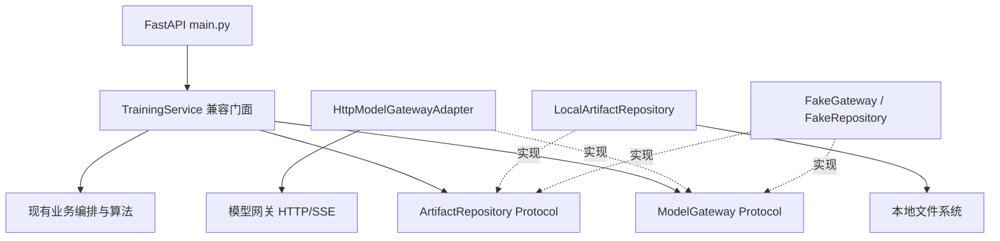
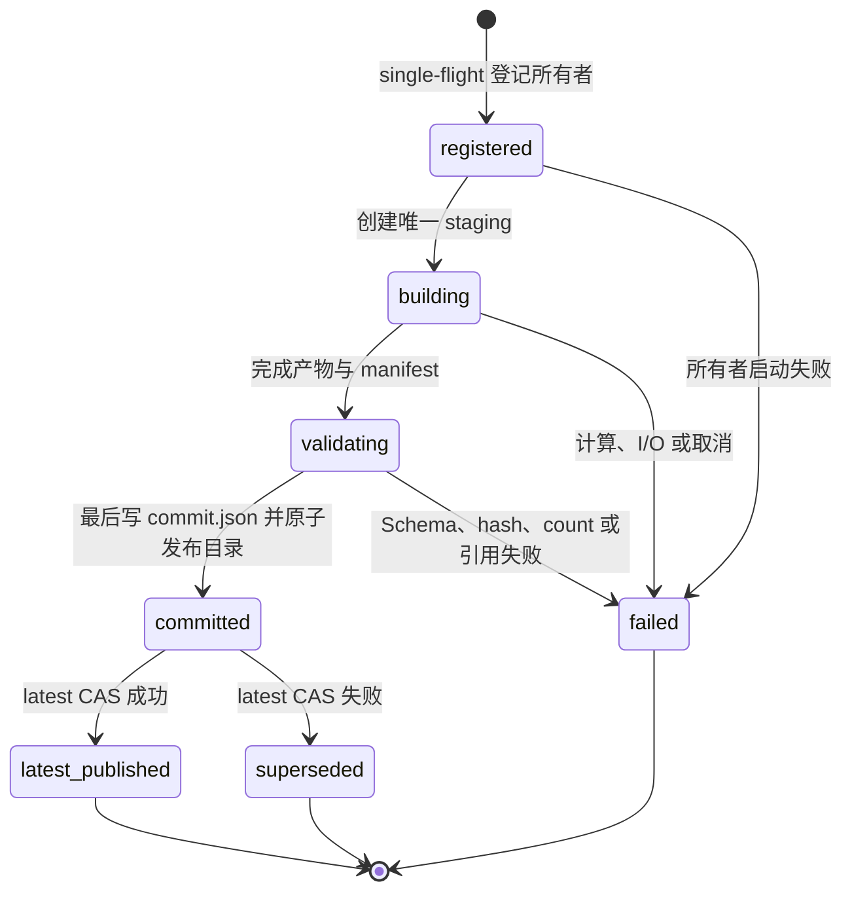

# TrainingService 分层重构详细设计

> 版本：v1.4
> 更新日期：2026-08-07
> 状态：Phase 1 已完成；Phase 2 有条件通过；方案 C 核心实现与真实 API 验证完成，大规模性能基线待验证
> 适用范围：`scripts/pingcode/web/backend/app/training_service.py`
> 上位设计：[12-PingCode知识提取步骤详细设计.md](./12-PingCode知识提取步骤详细设计.md)、[15-PingCode图谱与数据集生成步骤详细设计.md](./15-PingCode图谱与数据集生成步骤详细设计.md)

---

## 1. 文档目的

本文冻结 `TrainingService` Phase 2 重构所需的基础设施兼容基线，并同步 2026-08-05 已落盘的模型网关和产物仓储实现。其后续关键词过滤收敛改造以 `docs/20` 顶部 2026-08-05 设计为准：保留关键词过滤预览、SSE、应用决策、图谱读取、正式知识构建和发布门禁，删除业务三态、L2 和质量评价专用公共 API。

本文明确区分三层状态：源码与聚焦自动化测试已验证；真实后端 API 和真实模型网关只读链路已验收；主动 apply 决策写入尚未验收。验收结论和边界以 [TrainingService Phase 0-2 重构验收报告](../scripts/pingcode/web/backend/tests/test-report-training-service-phase2.md) 为准，不得用 fake HTTP server、临时目录或单元测试结果替代真实链路证据。

## 2. 现状量化与问题

### 2.1 量化基线

| 指标 | 当前值 | 证据范围 |
|---|---:|---|
| `training_service.py` 行数 | 7,287 行 | 当前源码静态统计 |
| `TrainingService` 方法总数 | 175 | 31 个非下划线方法，144 个私有方法 |
| `ModelGatewayClient` 方法总数 | 7 | 5 个公开方法，2 个私有方法 |
| `main.py` 直接调用的门面方法 | 27 | 从 `training.<method>` 调用点去重统计 |
| 测试直接依赖的文件私有方法 | 4 | `_read_json`、`_read_jsonl`、`_write_json`、`_write_jsonl` |
| 测试直接依赖的业务私有方法 | 2 | `_build_dataset_graph`、`_formal_keyword_context_by_chunk` |
| 当前构造依赖 | 8 个 | `store/batches/tasks/preprocess/prompts/preparation/metadata_construction/gateway` |

### 2.2 职责混杂

当前单类同时承担以下职责：

1. 模型网关 HTTP、认证、同步 JSON 和 SSE 通信；
2. 模型配置读取、测试状态和调用超时推导；
3. 训练任务启动、取消、恢复、日志与事件；
4. 资料准备、元数据衔接和处理单元调度；
5. 关键词提取、智能过滤与 `admissionStatus` 决策应用；
6. 正式知识点抽取与 Workflow Agent 协调；
7. 图谱生成、读取、修复和邻域查询；
8. 数据集生成与运行产物复制；
9. 质量问题、复核项和决策审计；
10. JSON、JSONL、文本和目录复制等文件操作。

由此产生的主要问题：

- 基础设施失败与业务失败共享同一实现文件，难以独立测试和替换；
- 模型网关超时、SSE 连接关闭和认证头只能通过大型服务间接验证；
- 文件原子写约束散落在静态私有方法中，业务代码直接依赖实现细节；
- 测试直接调用私有方法，重构时容易误删兼容入口；
- 若新服务反向持有 `TrainingService`，会形成 `TrainingService -> Service -> TrainingService` 循环依赖；
- 继续在单文件追加逻辑会扩大每次缺陷修复的修改范围。

## 3. SMART 目标

| 维度 | Phase 1 / Phase 2 约束 |
|---|---|
| Specific | 仅提取模型网关与产物仓储，`TrainingService` 保持兼容门面 |
| Measurable | 两个 Protocol、两个默认 Adapter、31 个公开方法签名不变；MG-01..MG-12、AR-01..AR-08、TS-01 及受保护关键词链路可重复验证 |
| Achievable | 使用 Python 标准库 `typing.Protocol`、`urllib/http.client`、`pathlib`，不引入外部依赖 |
| Relevant | 优先隔离调用失败和文件损坏风险，为后续业务服务拆分提供稳定端口 |
| Time-bound | Phase 1 设计与基线 4 小时；Phase 2 网关提取 4 小时、仓储提取与验证 4 小时 |

## 4. 范围与非范围

### 4.1 Phase 2 范围

- 新增 `ModelGateway` Protocol；
- 将现有 `ModelGatewayClient` HTTP 行为迁入默认 `HttpModelGatewayAdapter`；
- 新增 `ArtifactRepository` Protocol；
- 将 JSON、JSONL、文本和嵌入缓存复制迁入默认 `LocalArtifactRepository`；
- 通过 `TrainingService` 构造器注入两个端口，未注入时使用默认 Adapter；
- 保留 `self.gateway` 属性和现有文件私有方法作为兼容委托；
- 增加独立网关、仓储特征测试，并保护现有关键词与正式知识链路。

### 4.2 Phase 2 非范围

- 不提取或重写关键词提取、关键词智能过滤和决策应用逻辑；
- 不提取图谱构建、图谱修复和数据集生成算法；
- 不提取训练任务生命周期、并发、取消、事件和恢复编排；
- 不提取 Prompt Registry、Skill 调用或 Workflow Agent；
- 不改变 FastAPI 路由、请求模型、响应字段和错误码；
- 不改变 `docs/12` 规定的关键词与正式知识边界；
- 不改变 `docs/15` 规定的图谱节点、边、证据和数据集语义；
- 不引入第三方 HTTP、依赖注入或文件系统库；
- 不在 Phase 2 删除测试直接调用的私有兼容方法。

### 4.3 当前落盘状态

| 范围 | 当前实现 | 状态 |
|---|---|---|
| 模型网关端口 | `app/gateways/model_gateway.py` 提供 `ModelGateway` Protocol、`HttpModelGatewayAdapter`、`ModelGatewayClient` 兼容别名、`ModelGatewayError` 和 `error_summary()` | 已落盘并通过本地契约测试 |
| 模型网关接线 | `TrainingService.gateway` 接受 `ModelGateway` 注入，默认仍通过本模块兼容类构造 HTTP Adapter | 已落盘 |
| 时间与稳定 ID | `utcnow()`、`stable_id()` 仍定义在 `training_service.py` | 未迁移，且不属于网关职责 |
| 产物仓储端口 | `app/repositories/artifact_repository.py` 提供 `ArtifactRepository` 和 `LocalArtifactRepository` | 已落盘并通过本地仓储测试 |
| 仓储接线 | 构造器增加关键字专用 `artifact_repository`；六个私有文件方法委托给 `self.artifacts` | 已落盘 |
| 业务域迁移 | 关键词、图谱、Skill、Workflow Agent 和训练任务编排 | 未迁移，仍由 `TrainingService` 承担 |
| 真实链路验收 | 健康检查、模型测试、指定数据集图谱摘要、非流式过滤预览和 SSE 过滤分析 | 已完成只读验收，均返回 HTTP 200；主动 apply 未执行 |

### 4.4 关键词过滤收敛后的公共边界

- `admissionStatus` 是关键词是否进入正式知识构建的唯一状态，只允许 `admitted`、`excluded`；历史审批和业务状态只用于旧产物兼容读取。
- 应用决策响应、图谱摘要和前端四项统计必须满足 `过滤前关键词 = 保留关键词 + 排除关键词`、`过滤后关键词 = 保留关键词`。
- 图谱读取向质量分析页返回 `admitted` 关键词投影及两端均可见的边；完整图谱文件继续用于内部审计。
- 删除业务审核、业务状态更新、手工业务准入、L2 创建/关联/展开和质量评价报告公共路由，不提供兼容别名。
- 保留内部质量问题采集、证据完整性检查、发布质量门禁和历史质量字段读取能力；这些能力不再作为关键词过滤页的独立人工状态。
- 非流式和 SSE 过滤必须通过同一 `ModelGateway` 配置读取模型与参数，禁止在流式路径硬编码模型名称。

## 5. 目标分层与依赖方向



依赖规则：

1. `TrainingService` 只依赖 Protocol，不依赖默认 Adapter 的内部实现；
2. 默认 Adapter 不导入、不持有、不回调 `TrainingService`；
3. Protocol 不引用任务、关键词、图谱或 Skill 领域对象；
4. `main.py` 继续按当前方式创建 `TrainingService`，默认依赖由门面内部装配；
5. 测试可以直接注入 Fake，不替换全局设置，也不 mock Python HTTP 底层函数。

## 6. 公开 API 兼容基线

### 6.1 构造器

当前构造签名必须保持兼容：

```python
TrainingService(
    store,
    batches,
    tasks,
    preprocess,
    prompts,
    preparation=None,
    metadata_construction=None,
    gateway=None,
)
```

Phase 2 只允许在末尾增加关键字专用参数：

```python
TrainingService(
    store,
    batches,
    tasks,
    preprocess,
    prompts,
    preparation=None,
    metadata_construction=None,
    gateway: ModelGateway | None = None,
    *,
    artifact_repository: ArtifactRepository | None = None,
)
```

兼容要求：原有位置参数和 `gateway=FakeGateway(...)` 测试保持有效；`self.gateway` 继续可用；未注入时分别创建 `HttpModelGatewayAdapter` 和 `LocalArtifactRepository`。

### 6.2 `TrainingService` 非下划线方法

| 方法签名 | 当前调用方 | 输入 / 输出 | Phase 2 兼容要求 |
|---|---|---|---|
| `model_config() -> dict` | `main.py` | 无；公开模型状态与 Skill 默认值 | 字段与异常不变 |
| `update_model_config(config) -> dict` | 当前路由未调用、测试可调用 | 模型配置；更新结果 | 保留方法与 API Key 条件传递 |
| `test_model() -> dict` | `main.py` | 无；测试结果和有效期 | 缓存与指纹行为不变 |
| `preflight(request) -> dict` | `main.py` | `TrainingTaskCreate`；预检结果 | 不改变校验和输出 |
| `require_model_test() -> None` | 内部/测试 | 无；失败抛异常 | 保留公开兼容入口 |
| `start(request) -> TaskSnapshot` | `main.py` | 训练请求；任务快照 | 不改变启动与冲突语义 |
| `cancel(task_id) -> TaskSnapshot` | `main.py` | 任务 ID；任务快照 | 不改变幂等和终态规则 |
| `list(batch_id=None) -> list[TaskSnapshot]` | `main.py` | 可选批次 ID；任务列表 | 顺序和过滤不变 |
| `reconcile_interrupted() -> int` | `main.py` 启动流程 | 无；恢复数量 | 不改变活跃任务判断 |
| `get(task_id) -> TaskSnapshot` | `main.py` | 任务 ID；任务快照 | 不改变僵尸任务恢复 |
| `graph(dataset_id, kind) -> Any` | `main.py` | 数据集与 `summary/nodes/edges`；图谱数据 | 不改变回填和读取语义 |
| `graph_neighborhood(dataset_id, node_id, limit=50) -> dict` | `main.py` | 节点和上限；邻域 | 不改变截断规则 |
| `ensure_dataset_graph(dataset_id)` | `main.py` | 数据集 ID；数据集对象 | 不改变按需生成规则 |
| `repair_dataset_graph(dataset_id) -> dict` | `main.py` | 数据集 ID；修复摘要 | 不改变可修复条件 |
| `preview_keywords_filter_by_skill(dataset_id) -> dict` | `main.py` | 数据集 ID；过滤建议 | 只读预览，不应用决策 |
| `stream_keywords_filter_by_skill(dataset_id)` | `main.py` | 数据集 ID；SSE 文本迭代器 | 与非流式共用模型配置，事件总数和结束语义一致 |
| `apply_keywords_filter(dataset_id, decisions) -> dict` | `main.py` | keep/exclude 决策列表；四项统计 | 只写 `admissionStatus`，不重建证据索引 |
| `start_formal_knowledge_task(dataset_id) -> TaskSnapshot` | `main.py` | 数据集 ID；任务快照 | 仅使用 `admissionStatus=admitted` 关键词 |
| `clean_display_name(value) -> str` | 内部/测试 | 任意值；清洗名称 | 静态调用行为不变 |
| `logs(task_id, offset=0, limit=200) -> dict` | `main.py` | 分页参数；日志页 | 分页结构不变 |
| `review_items(task_id) -> list[dict]` | `main.py` | 任务 ID；复核项 | 数据格式不变 |
| `decide_review_item(task_id, item_id, decision) -> dict` | `main.py` | 决策模型；更新结果 | 审计字段不变 |

### 6.3 测试私有兼容入口

Phase 2 不能直接删除以下方法：

- `_read_json`、`_read_jsonl`、`_write_json`、`_write_jsonl`：改为对 `ArtifactRepository` 的薄委托；
- `_write_text`、`_copy_embedding_cache`：改为薄委托并保留当前签名；
- `_build_dataset_graph`、`_formal_keyword_context_by_chunk`：不在 Phase 2 迁移或改写。

## 7. ModelGateway 端口设计

### 7.1 Protocol

```python
from collections.abc import Iterator
from typing import Any, Protocol


class ModelGateway(Protocol):
    def status(self) -> dict[str, Any]: ...

    def update_config(self, config: dict[str, Any]) -> dict[str, Any]: ...

    def test(self) -> dict[str, Any]: ...

    def chat_json(
        self,
        messages: list[dict[str, str]],
        options: dict[str, Any] | None = None,
    ) -> dict[str, Any]: ...

    def stream_chat(
        self,
        messages: list[dict[str, str]],
        options: dict[str, Any] | None = None,
    ) -> Iterator[dict[str, Any]]: ...
```

Protocol 只表达当前调用能力。Phase 2 不引入模型供应商、Prompt、Skill、任务 ID 或业务候选类型，避免基础设施端口被业务对象污染。

### 7.2 默认 Adapter

`HttpModelGatewayAdapter` 保持当前端点契约：

| 方法 | HTTP 契约 |
|---|---|
| `status()` | `GET /status` |
| `update_config(config)` | `POST /config`，JSON 原样传递 |
| `test()` | `POST /test`，空 JSON，固定 60 秒 |
| `chat_json(messages, options)` | `POST /chat`，请求体含 `messages`、`responseFormat="json"`、`options` |
| `stream_chat(messages, options)` | `POST /chat/stream`，消费 SSE `data:` JSON 事件 |

为降低迁移风险，`app/gateways/model_gateway.py` 已保留 `ModelGatewayClient = HttpModelGatewayAdapter` 兼容别名；`training_service.py` 另保留同名薄兼容类，以维持旧测试补丁点。

### 7.3 超时契约

- 默认同步请求：使用 Adapter 构造参数 `timeout`，当前默认来自 `MODEL_GATEWAY_TIMEOUT_SECONDS`；
- `test()`：固定 60 秒，不继承 180 秒默认值；
- `chat_json()`：若 `options.timeout_ms` 是数值，则 HTTP 等待上限为 `ceil(timeout_ms / 1000) * (max_retries + 1) + 10` 秒，最少一次尝试；
- `stream_chat()`：若 `options.timeout_ms` 是数值，则 HTTP 等待上限为 `ceil(timeout_ms / 1000) + 30` 秒，不乘重试次数；
- Phase 2 不调整业务 `max_tokens`、`timeout_ms` 或重试策略，只保证 Adapter 正确执行调用方选项。

### 7.4 错误契约

- 所有网关连接、超时、HTTP 和响应解析失败统一抛出 `ModelGatewayError`；
- HTTP 错误保留状态码，用户可见语义保持中文，例如 `模型网关 HTTP 429: ...`；
- 连接、读取超时和非法 JSON 使用 `模型网关不可用: ...` 分类；
- `/chat` 的 `data` 不是对象时抛出 `模型网关未返回 JSON 对象`；
- Adapter 不吞掉 `ModelGatewayError`，上层继续通过 `error_summary()` 和 FastAPI 错误码转换；
- Adapter 不主动记录认证 token、API Key、完整请求正文或完整提示词。
- 当前 HTTP 和 SSE 错误仍将远端错误正文原样拼入 `ModelGatewayError`，尚未实现长度截断和敏感字段脱敏。该行为保持旧契约，但属于剩余安全风险，后续应在不丢失状态码和中文分类的前提下整改。

### 7.5 SSE 生命周期契约

1. 建立连接并发送 UTF-8 JSON；
2. HTTP 状态码大于等于 400 时读取远端错误正文并抛出 `ModelGatewayError`；当前正文未截断、未脱敏；
3. TCP chunk 可任意切分，Adapter 按空行重组 SSE 事件；
4. 只解析 `data:` 行，合法 JSON 按收到顺序产出；
5. 非法 JSON 事件保持当前兼容行为：跳过，不中断后续合法事件；
6. 正常 EOF 结束迭代；异常或消费者提前结束时均关闭响应和连接；
7. Phase 2 不新增业务 `stage/decision/complete` 事件，这些仍由 `TrainingService` 生成。

### 7.6 认证契约

- 仅当内部 token 非空时发送 `X-Internal-Token`；
- token 只保存在 Adapter 实例中，不进入返回值、异常、日志或测试快照；
- `update_model_config()` 仅在请求包含非空 `apiKey` 时向网关发送 `api_key`；
- Phase 2 不改变模型配置来源，也不新增凭据文件。

## 8. ArtifactRepository 端口设计

### 8.1 Protocol

```python
from pathlib import Path
from typing import Any, Protocol


class ArtifactRepository(Protocol):
    def read_json(self, path: Path, default: Any = None) -> Any: ...

    def read_jsonl(self, path: Path) -> list[dict[str, Any]]: ...

    def write_json(self, path: Path, value: Any) -> None: ...

    def write_jsonl(self, path: Path, items: list[dict[str, Any]]) -> None: ...

    def write_text(self, path: Path, value: str) -> None: ...

    def copy_embedding_cache(self, source_root: Path, target_root: Path) -> None: ...
```

Phase 2 采用当前业务所需的最小接口，不提前抽象通用对象存储、事务或版本控制。路径由 `TrainingService` 计算，Repository 只负责文件系统语义。

### 8.2 默认 Adapter

`LocalArtifactRepository` 使用 `pathlib`、`json` 和 `shutil` 实现：

- UTF-8 读写，JSON 使用 `ensure_ascii=False`；
- `read_json()` 在文件不存在、读取失败或 JSON 损坏时返回调用方默认值；
- Phase 2 兼容方法 `read_jsonl()` 忽略空行与损坏行，保留合法对象顺序；方案 C 的 `read_committed_jsonl()` 禁止静默忽略损坏行，必须按 16.7 节隔离并落质量问题，或升级为完整性失败；
- 写入前自动创建父目录；
- JSON、JSONL 和文本采用同目录临时文件后原子替换；
- 嵌入缓存源不存在时创建空目标目录；源存在时完整替换目标缓存。

### 8.3 原子写契约

```text
序列化到内存
  -> 创建父目录
  -> 写入与目标同目录的唯一临时文件（禁止固定 `.tmp` 名称）
  -> 完成 UTF-8 写入
  -> replace(target)
  -> 成功后目标一次切换到完整新内容
```

约束：

- 临时文件必须与目标位于同一文件系统，保证 `replace()` 的原子替换语义；
- 序列化、临时写入或替换失败时异常向上抛出，原目标字节不得改变；
- 失败后尽力清理临时文件，清理失败不得覆盖原始异常；
- 不使用“先清空目标再写入”的方式；
- JSONL 空列表写为空文件；非空列表每项一行且末尾保留换行；
- 嵌入缓存目录复制不承诺与单文件相同的系统级原子性，但必须保证成功后目标完整、源缺失时目标为空，并在失败时避免留下被误认为成功的半成品。

## 9. 构造注入与兼容委托

### 9.1 装配伪代码

```python
class TrainingService:
    def __init__(..., gateway=None, *, artifact_repository=None):
        self.gateway = gateway or HttpModelGatewayAdapter(
            settings.model_gateway_url,
            settings.model_gateway_token,
            settings.model_gateway_timeout,
        )
        self.artifacts = artifact_repository or LocalArtifactRepository()
        self.extraction_agent = KnowledgeExtractionWorkflowAgent({
            "prompts": self.prompts,
            "gateway": self.gateway,
            "skill_root": str(skill_root),
        })
```

### 9.2 文件兼容入口伪代码

现有业务大量以 `self._read_json(...)` 形式调用。Phase 2 首先保留这些入口，避免一次性机械修改数十个业务调用点：

```python
def _read_json(self, path, default=None):
    return self.artifacts.read_json(path, default)

def _read_jsonl(self, path):
    return self.artifacts.read_jsonl(path)

def _write_json(self, path, value):
    self.artifacts.write_json(path, value)

def _write_jsonl(self, path, items):
    self.artifacts.write_jsonl(path, items)

def _write_text(self, path, value):
    self.artifacts.write_text(path, value)

def _copy_embedding_cache(self, source_root, target_root):
    self.artifacts.copy_embedding_cache(source_root, target_root)
```

这些方法从 `@staticmethod` 调整为实例委托属于内部实现变化，但调用形态保持不变。待后续阶段完成业务服务拆分并迁移测试后，才能评估删除。

## 10. 关键流程伪代码

### 10.1 同步模型调用

```text
接收 messages 和 options
  -> 由 timeout_ms/max_retries 推导 HTTP 等待上限
  -> 构造不含日志副本的认证请求
  -> POST /chat
  -> 非 2xx 转中文 ModelGatewayError
  -> 解析 JSON
  -> 校验 data 为对象
  -> 返回完整响应（保留 usage 等字段）
```

### 10.2 流式模型调用

```text
接收 messages 和 options
  -> 推导单次 SSE 等待上限
  -> POST /chat/stream
  -> 按空行累计跨 chunk 事件
  -> 对合法 data JSON 逐项 yield
  -> 跳过非法 JSON 事件
  -> EOF / 异常 / 提前结束均关闭连接
```

### 10.3 产物写入

```text
TrainingService 计算业务路径和业务数据
  -> 调用 ArtifactRepository
  -> Repository 创建父目录并序列化
  -> 同目录临时文件完整写入
  -> 原子替换目标
  -> 失败则保留旧目标并向业务层抛出异常
```

## 11. 迁移策略

### 11.1 实施顺序

1. 新增 `ModelGateway` Protocol、`HttpModelGatewayAdapter` 和独立特征测试；
2. 在原模块保留 `ModelGatewayClient` 兼容别名或兼容类；
3. 将 `TrainingService.gateway` 类型收窄到 Protocol，验证 FakeGateway 与现有模型测试；
4. 新增 `ArtifactRepository` Protocol、`LocalArtifactRepository` 和独立特征测试；
5. 构造器增加关键字专用 `artifact_repository`，默认装配本地 Adapter；
6. 将六个文件私有方法改为实例薄委托，不改业务调用点；
7. 运行网关、仓储、现有训练服务和关键词受保护测试；
8. 启动真实后端，验证公开 HTTP API；具备可用配置时再执行真实模型网关验收。

### 11.2 每步提交边界

- 网关提取与仓储提取应保持独立变更，可分别回滚；
- 不把关键词、图谱或任务编排重写混入 Phase 2；
- 新模块目录若增加 `README.md`，需同步说明职责与依赖方向；
- 任何不得避免的硬编码必须记录待办，Phase 2 不新增规则或提示词硬编码。

## 12. 回滚策略

| 触发条件 | 回滚动作 | 数据影响 |
|---|---|---|
| 网关特征测试或真实 API 契约不一致 | 恢复原 `ModelGatewayClient` 实现和默认构造，保留 Protocol 文件但不接线 | 无持久化数据迁移 |
| SSE 分片、关闭或超时回归 | 回滚网关 Adapter 接线，恢复原流式实现 | 不修改关键词决策 |
| 仓储读取兼容失败 | 恢复六个原静态文件方法 | 既有产物格式不变 |
| 原子写失败导致旧文件变化 | 立即停止 Phase 2，恢复旧方法并保留失败样本定位 | 从备份/旧目标恢复，不执行批量修复 |
| 关键词受保护测试失败 | 回滚本阶段接线，不修改关键词业务以适配新模块 | 不应用测试决策到真实数据集 |

Phase 2 不执行数据格式迁移，因此回滚不需要转换现有 `training-runs/` 或 `datasets/` 产物。

## 13. 特征测试矩阵

以下矩阵记录 Phase 2 的契约覆盖目标。当前已落盘 11 个网关测试、9 个仓储测试及 TrainingService 依赖注入与关键词保护测试；测试使用标准库 fake HTTP/SSE server、临时目录和故障注入。矩阵中的场景编号是契约追踪项，不与测试函数数量一一对应。

### 13.1 模型网关测试

统一命令：`cd scripts/pingcode/web/backend && python -m unittest tests.test_model_gateway -v`

| ID | 前置条件 | 输入 | 预期结果 | 执行命令 |
|---|---|---|---|---|
| MG-01 | 本地 fake HTTP server 提供三端点 | 调用 `status/update_config/test` | 方法、路径和 JSON 请求体保持契约 | `python -m unittest tests.test_model_gateway -v` |
| MG-02 | fake server 记录 `/chat` 请求 | `chat_json(messages, options)` | 请求含 `responseFormat=json` 和原始参数 | `python -m unittest tests.test_model_gateway -v` |
| MG-03 | `/chat` 返回 `data` 与 `usage` | 正常同步调用 | 返回完整响应，不丢失附加字段 | `python -m unittest tests.test_model_gateway -v` |
| MG-04 | `/chat` 分别返回空、数组或缺少 `data` | 三组非法结果 | 均抛 `模型网关未返回 JSON 对象` | `python -m unittest tests.test_model_gateway -v` |
| MG-05 | Adapter 默认超时已知 | `timeout_ms=60000,max_retries=2` | HTTP 超时为 190 秒 | `python -m unittest tests.test_training_service.TrainingErrorSummaryTests -v` |
| MG-06 | Adapter 默认超时 180 秒 | 调用 `test()` | `/test` 使用固定 60 秒 | `python -m unittest tests.test_model_gateway -v` |
| MG-07 | fake SSE server | `timeout_ms=60000` | SSE 超时为 90 秒且不乘重试 | `python -m unittest tests.test_training_service.KeywordFilterCompatibilityTests -v` |
| MG-08 | 一个 JSON 事件拆成多个 TCP chunk | 调用 `stream_chat()` | 重组后只产出一个完整事件 | `python -m unittest tests.test_model_gateway -v` |
| MG-09 | 合法、非法事件混合后正常 EOF | 消费整个迭代器 | 合法事件有序产出，非法事件跳过，连接关闭 | `python -m unittest tests.test_model_gateway -v` |
| MG-10 | `/chat/stream` 返回 HTTP 错误 | 发起流式调用 | 抛含状态码的 `ModelGatewayError` 且连接关闭 | `python -m unittest tests.test_model_gateway -v` |
| MG-11 | fake server 模拟 HTTP 错误、非法 JSON 和拒绝连接 | 同步调用 | 统一转成 `ModelGatewayError` | `python -m unittest tests.test_model_gateway -v` |
| MG-12 | 分别配置和不配置内部 token | 发起同步与流式请求 | 仅非空时发送认证头；请求不主动记录 token/正文；远端错误正文脱敏仍是剩余风险 | `python -m unittest tests.test_model_gateway -v` |

### 13.2 产物仓储测试

统一命令：`cd scripts/pingcode/web/backend && python -m unittest tests.test_artifact_repository -v`

| ID | 前置条件 | 输入 | 预期结果 | 执行命令 |
|---|---|---|---|---|
| AR-01 | 临时目录含不存在、无权限或损坏 JSON 文件 | `read_json(path, default)` | 返回调用方给定默认值 | `python -m unittest tests.test_artifact_repository.ArtifactReadTests.test_json_default -v` |
| AR-02 | 临时目录可写 | 中文、嵌套对象、布尔与空值 | 写后读取完全一致，中文不转义 | `python -m unittest tests.test_artifact_repository.ArtifactRoundTripTests.test_json_round_trip -v` |
| AR-03 | JSONL 含合法行、空行和损坏行 | `read_jsonl(path)` | 仅保留合法行且顺序不变 | `python -m unittest tests.test_artifact_repository.ArtifactReadTests.test_jsonl_tolerates_bad_lines -v` |
| AR-04 | 临时目录可写 | 多对象列表和空列表 | 每项一行并以换行结束；空列表为空文件 | `python -m unittest tests.test_artifact_repository.ArtifactRoundTripTests.test_jsonl_format -v` |
| AR-05 | 目标已有旧内容 | 写入新 JSON/JSONL/文本 | 同目录临时文件完整写入后一次替换 | `python -m unittest tests.test_artifact_repository.ArtifactAtomicWriteTests -v` |
| AR-06 | 注入临时写入或 `replace()` 失败 | 覆盖已有目标 | 异常上抛，旧目标字节完全不变 | `python -m unittest tests.test_artifact_repository.ArtifactAtomicWriteTests -v` |
| AR-07 | 父目录不存在 | 写入中文文本 | 自动创建目录，原子写入且内容一致 | `python -m unittest tests.test_artifact_repository.ArtifactRoundTripTests.test_text_write_creates_parent -v` |
| AR-08 | 源缓存存在、缺失，目标已存在 | 复制嵌入缓存 | 完整替换目标；源缺失时创建空目标目录 | `python -m unittest tests.test_artifact_repository.ArtifactCopyTests.test_embedding_cache_copy -v` |

### 13.3 门面与业务保护测试

| ID | 前置条件 | 输入 | 预期结果 | 执行命令 |
|---|---|---|---|---|
| TS-01 | 准备 FakeGateway/FakeRepository | 原位置参数、默认构造和依赖注入三种方式 | 原构造有效，默认 Adapter 可用，注入对象被薄委托调用 | `python -m unittest tests.test_training_service.TrainingServiceDependencyTests -v` |
| KF-01 | 真实 FastAPI 后端和有关键词数据集 | 调用过滤预览 API | 返回全部建议和汇总，不修改图谱或索引 | `curl -fsS -X POST http://127.0.0.1:8001/api/datasets/<dataset_id>/keywords/filter-by-skill` |
| KF-02 | 真实后端和可用模型网关 | 消费过滤 SSE API | 顺序出现 `stage/decision/complete`；与非流式使用同一模型配置、总数一致；失败产生 `error` | `curl -N http://127.0.0.1:8001/api/datasets/<dataset_id>/keywords/filter-by-skill/stream` |
| KF-03 | 隔离数据集已取得过滤建议 | POST keep/exclude 决策 | 只更新 `admissionStatus`；四项统计满足恒等式；不重建 `keyword-chunk-index.json` | `curl -fsS -X POST -H 'Content-Type: application/json' -d '{"decisions":[{"keywordId":"<keyword_id>","shouldExclude":false,"reason":"验收保留"}]}' http://127.0.0.1:8001/api/datasets/<dataset_id>/keywords/filter-apply` |
| KF-04 | 数据集含 admitted/excluded 关键词 | 启动正式知识任务 | 只有 `admitted` 关键词进入输入计划 | `python -m unittest tests.test_training_service.KeywordExtractionPerformanceTests -v` |
| KF-05 | 已应用过滤决策 | 读取 nodes/edges/summary | 只返回 admitted 关键词及无悬空边的展示投影；统计与节点状态一致 | `python -m unittest tests.test_training_service.KeywordFilterCompatibilityTests -v` |
| KF-06 | FastAPI 应用已加载 | 调用已删除业务、L2、质量评价路由 | 公共路由返回 404；内部质量审计和发布门禁仍可用 | `python -m unittest tests.test_keyword_filter_routes -v` |

必须继续保护以下现有用例，不得为通过新测试而删除或弱化：

- `test_clear_semantic_title_and_glossary_skip_model`
- `test_clear_semantic_title_without_glossary_still_skips_model`
- `test_keyword_analysis_reads_preselection_report_and_only_model_required_calls_model`
- `test_formal_keyword_context_uses_materialized_index_and_filters_rejected`
- `test_formal_keyword_context_deduplicates_sorts_and_excludes_rejected_keywords`
- `test_keyword_filter_apply_persists_admission_status_and_consistent_counts`
- `test_keyword_graph_projection_excludes_nodes_and_dangling_edges`
- `test_formal_keyword_context_requires_admitted`
- `test_removed_business_l2_and_quality_routes_return_404`
- `test_formal_knowledge_run_writes_auditable_input_plan`
- `test_start_formal_knowledge_converts_dataset_preprocess_config`

## 14. 分层验证命令

Phase 2 已按由小到大的顺序执行本地测试；以下命令保留为可重复验证入口：

```bash
cd scripts/pingcode/web/backend

python -m unittest tests.test_model_gateway -v
python -m unittest tests.test_artifact_repository -v
python -m unittest tests.test_training_service.TrainingErrorSummaryTests -v
python -m unittest tests.test_training_service.KeywordExtractionPerformanceTests -v
python -m unittest discover -s tests -p 'test_*.py'
```

真实后端 HTTP 验收：

```bash
curl -fsS http://127.0.0.1:8001/api/training/model-config
curl -fsS -X POST http://127.0.0.1:8001/api/datasets/<dataset_id>/keywords/filter-by-skill
curl -N http://127.0.0.1:8001/api/datasets/<dataset_id>/keywords/filter-by-skill/stream
```

本轮已在网关配置可用的后端进程上完成真实验收：健康检查返回 HTTP 200；模型测试返回 HTTP 200，实际模型 `qwen3.7-plus`，耗时 `3163ms`，`schemaPassed=true`；`dataset_1df85d1df97143ca` 图谱摘要返回 HTTP 200；非流式过滤预览返回 HTTP 200，耗时 `58.99s` 并生成 43 条建议；SSE 返回 HTTP 200，耗时 `20.86s`，事件统计为 `stage=3`、`decision=43`、`complete=1`、`error=0`。为避免修改用户数据，本轮未主动执行 apply 决策接口。详细证据见 [TrainingService Phase 0-2 重构验收报告](../scripts/pingcode/web/backend/tests/test-report-training-service-phase2.md)。

## 15. Phase 2 完成定义

当前 Phase 2 的代码交付、聚焦自动化测试和只读真实链路验收已完成，结论为有条件通过：

| 验收项 | 当前状态 |
|---|---|
| 两个 Protocol 不反向依赖 `TrainingService` | 已完成 |
| 默认 Adapter、构造注入及原构造兼容 | 已完成 |
| Phase 2 基础设施门面兼容 | 已完成静态检查；健康、模型测试、图谱摘要及两类过滤接口真实 HTTP 验收通过 |
| 网关、仓储、依赖注入及 TrainingService 回归测试 | 聚焦回归 92/92 通过 |
| 关键词、图谱、任务编排或 Skill 业务重写 | 未混入；这些职责也尚未迁移 |
| 后端全量回归 | 共 223 项：200 项通过、2 项范围外失败、21 项跳过 |
| 真实后端 API | HTTP 200：健康检查、图谱摘要、非流式过滤预览、SSE 过滤分析 |
| 真实模型网关 | HTTP 200：`qwen3.7-plus`，`3163ms`，`schemaPassed=true` |
| 主动 apply 决策 | 未执行；`admissionStatus` 持久化、四统计和图谱投影待隔离数据集验收 |
| 流式与非流式模型选择 | 验收时发现 SSE 硬编码模型；现行设计要求统一模型配置，待一致性回归关闭风险 |
| 远端错误正文截断与敏感字段脱敏 | 未实现，列为剩余安全风险 |

因此，本阶段标记为“有条件通过”。模型网关与产物仓储提取满足 Phase 2 功能验收条件；关闭剩余验收缺口前，必须统一流式与非流式模型选择，在隔离数据集补充 `admissionStatus`、四统计和图谱投影验收，并实现远端错误正文截断与敏感字段脱敏。业务三态、L2 和质量评价专用公共 API 不再属于兼容基线；内部质量审计和发布门禁必须继续保护。两项全量回归失败属于 Phase 2 范围外问题，应独立跟踪，不得改写为本阶段新增回归。

## 16. 不可变产物快照与批次协调契约（TASK-BUG-JSON-RACE-P0-01）

本节冻结 Phase 3 的仓储与协调实现边界。跨阶段规范性 Schema、状态机和默认配置以 [六步骤流水线 16 节](./08-pingcode-processing-six-step-pipeline-design.md#十六方案-c不可变快照与并发协调契约) 为唯一基线；本节不得定义另一套同名字段。Phase 2 的单文件原子替换继续保留，但不再被视为跨文件运行产物的一致性边界。资料准备、元数据构建及训练流水线必须显式传递不可变快照引用；共享 `latest.json` 仅用于页面发现、人工查询和流水线开始前的缓存候选发现，不参与运行中流水线选择输入。

### 16.1 兼容边界与读取优先级

- 公共 HTTP 路由、请求体、状态码和既有响应字段保持兼容；本任务不删除 `manifestPath`、`documentsPath`、`chunksPath` 等历史路径字段。
- `PreparationReport` 与 `MetadataBuildReport` 新增可选 `snapshotRef`。新写入报告必须同时返回 `snapshotRef` 和既有路径字段；兼容期至少跨一个完整发布周期，移除旧字段必须另立公共契约变更任务。
- 内部读取优先级固定为：调用方显式传入的 `snapshotRef` > 仅历史报告中的 `manifestPath` 经一次性校验后冻结成 `snapshotRef`。`latest.json` 只允许页面查询或在流水线开始前发现缓存候选；方案 C 新运行缺少 `snapshotRef` 时抛 `SchemaValidationError`，不得静默降级到 latest。
- `latest.json` 的 CAS 失败不改变已提交快照的有效性；调用方继续使用本次返回的 `snapshotRef`，不得回退到 latest。

### 16.2 核心引用与目录布局

所有字段使用唯一的 camelCase JSON 名称；Python 数据类通过显式序列化映射输出相同字段。

```python
@dataclass(frozen=True)
class ArtifactSnapshotRef:
    batch_id: str
    stage: str
    run_id: str
    input_hash: str
    manifest_path: str
    manifest_hash: str
    generation: int
```

```json
{
  "batchId": "batch_xxx",
  "stage": "material_preparation",
  "runId": "prep_xxx",
  "inputHash": "sha256:...",
  "manifestPath": "runs/prep_xxx/manifest.json",
  "manifestHash": "sha256:...",
  "generation": 42
}
```

```text
artifacts/<batchId>/<stage>/
├── .locks/
├── single-flight/<executionHash>.json
├── .staging/<runId>-<randomSuffix>/
│   ├── <artifacts...>
│   ├── manifest.json
│   └── commit.json
├── runs/<runId>/
│   ├── <artifacts...>
│   ├── manifest.json
│   └── commit.json
└── latest.json
```

`.staging` 与 `runs` 必须位于同一文件系统。`runs/<runId>` 在目录级原子发布后不可原地修改；重试必须创建新 `runId`。读取器只接受存在且通过校验的 `commit.json`，不扫描或读取 `.staging`。

### 16.3 manifest、commit 与 latest Schema

`manifest.json` 描述业务输入、版本和产物清单，不代表已经提交：

```json
{
  "schemaVersion": "artifact-manifest/v1",
  "batchId": "batch_xxx",
  "stage": "metadata_construction",
  "runId": "meta_xxx",
  "executionHash": "sha256:...",
  "inputHash": "sha256:...",
  "inputSnapshots": [{"stage": "material_preparation", "runId": "prep_xxx", "manifestHash": "sha256:..."}],
  "stageVersion": "metadata-construction/v1",
  "configHash": "sha256:...",
  "ruleSetHash": "sha256:...",
  "requiredArtifacts": ["metadata/documents.jsonl", "metadata/chunk-contexts.jsonl"],
  "createdAt": "2026-08-07T10:00:00+08:00"
}
```

`commit.json` 必须最后写入 staging，且只引用已经完成哈希、计数和引用校验的 manifest：

```json
{
  "schemaVersion": "artifact-commit/v1",
  "batchId": "batch_xxx",
  "stage": "metadata_construction",
  "runId": "meta_xxx",
  "inputHash": "sha256:...",
  "manifestPath": "manifest.json",
  "manifestHash": "sha256:...",
  "artifacts": [
    {"path": "metadata/documents.jsonl", "sha256": "sha256:...", "bytes": 1234, "records": 12, "schemaVersion": "metadata-document/v1"}
  ],
  "committedAt": "2026-08-07T10:00:01+08:00"
}
```

`latest.json` 仅用于发现，generation 从 0 单调递增：

```json
{
  "schemaVersion": "artifact-latest/v1",
  "batchId": "batch_xxx",
  "stage": "material_preparation",
  "runId": "prep_xxx",
  "inputHash": "sha256:...",
  "manifestPath": "runs/prep_xxx/manifest.json",
  "manifestHash": "sha256:...",
  "generation": 42,
  "committedAt": "2026-08-07T10:00:01+08:00"
}
```

读取已提交快照必须同时满足：`commit.json` 可解析；commit 与 ref 的 batch/stage/run/input/manifest hash 一致；manifest hash 匹配；所有必需产物存在且 hash/count/schema 匹配；manifest 的输入快照与调用方固定引用一致。任一条件失败均不得改读 latest 或其他 run。

### 16.4 两阶段发布状态机



`committed` 与 `superseded` 的快照都可被持有其 ref 的调用方读取；`superseded` 只表示未成为 latest。`registered/building/validating/failed` 均不可作为下游输入。进程终止遗留的 staging 只能由恢复/清理流程隔离或删除，不得提升为 committed。

### 16.5 single-flight 状态与协调接口

```json
{
  "schemaVersion": "single-flight/v1",
  "batchId": "batch_xxx",
  "stage": "material_preparation",
  "executionHash": "sha256:...",
  "state": "running",
  "ownerTaskId": "training_xxx",
  "ownerProcessId": 12345,
  "runId": "prep_xxx",
  "attempt": 1,
  "expectedGeneration": 41,
  "snapshotRef": null,
  "error": null,
  "startedAt": "2026-08-07T10:00:00+08:00",
  "updatedAt": "2026-08-07T10:00:00+08:00",
  "completedAt": null
}
```

`state` 仅允许 `running/completed/failed`。`completed` 必须带 `snapshotRef`；`failed` 必须带结构化 `error`；等待者不得读取所有者 staging。所有者失败后，等待者接收同一失败结果，后续新请求递增 `attempt` 重新竞争新 run 的所有权。

```python
class BatchOperationCoordinator(Protocol):
    def admit(self, batch_id, operation, idempotency_key): ...
    def single_flight(self, batch_id, stage, execution_hash): ...
    def commit_latest(self, snapshot_ref, expected_generation): ...

class ArtifactRepository(Protocol):
    def begin_snapshot(self, batch_id, stage, run_id): ...
    def commit_snapshot(self, staging_root, manifest) -> ArtifactSnapshotRef: ...
    def read_committed_json(self, snapshot_ref, artifact_name): ...
    def read_committed_jsonl(self, snapshot_ref, artifact_name, corruption_policy): ...
```

执行哈希固定为：

```text
executionHash = SHA-256(stageVersion + inputSnapshotManifestHash
                       + resourceSnapshotHash + configHash + ruleSetHash)
```

不适用的组成项使用空字符串，但字段顺序不得变化。相同 executionHash 的已提交结果直接复用；正在执行时等待同一所有者；不同 hash 可独立计算。

### 16.6 锁顺序与持久化边界

| 锁键 | 保护内容 | 允许的锁内操作 | 禁止的锁内操作 |
|---|---|---|---|
| `{batchId}:admission` | 批次状态、任务创建、activeTask 登记 | 单次读改写 | 扫描、转换、分块、模型调用 |
| `{batchId}:{stage}:{executionHash}` | single-flight 登记、完成结果 | 状态登记/读取 | 业务计算、全文件 hash |
| `{batchId}:{stage}:latest` | generation CAS | 读指针、比较、唯一临时文件替换 | manifest 校验、产物生成 |
| `state-store` | `state.json` 跨进程读改写 | 一次读改写 | 调用业务服务 |

禁止嵌套持锁。时间顺序固定为：`admission` 获取并释放 -> single-flight 登记并释放 -> 无锁计算和快照提交 -> single-flight 完成登记并释放 -> latest CAS 获取并释放。进程内 keyed Lock/Condition 与 `fcntl.flock` 组合实现相同键的线程/多进程互斥；不引入外部依赖。所有文件原子写使用同目录唯一临时文件、`flush`、文件 `fsync`、`os.replace` 和父目录 `fsync`，不得复用固定 `.tmp` 文件名。

### 16.7 损坏隔离、质量问题与异常契约

版本化配置固定放在 `scripts/pingcode/processing/artifact-integrity.yaml`，由 manifest 记录配置内容 hash：

```yaml
schemaVersion: artifact-integrity-config/v1
artifactCorruption:
  maxRecordRatio: 0.001
  maxRecordCount: 10
  redactedPrefixCharacters: 80
  redactedSuffixCharacters: 80
```

业务代码不得覆盖这些阈值。坏记录仅在行边界明确、非 commit/manifest/schema、其余记录可解析、隔离后唯一性和引用仍成立，且坏记录数量与比例均未超过配置上限时隔离。质量问题写入本次下游快照的 `quality/artifact-read-issues.jsonl`：

```json
{
  "issueId": "issue_xxx",
  "schemaVersion": "artifact-read-issue/v1",
  "code": "ARTIFACT_RECORD_DECODE_FAILED",
  "severity": "warning",
  "message": "已隔离一条无法解析的产物记录，其余记录继续处理。",
  "batchId": "batch_xxx",
  "taskId": "training_xxx",
  "stageRunId": "stage_xxx",
  "traceId": "trace_xxx",
  "snapshotId": "prep_xxx",
  "artifactPath": "metadata/source-documents.jsonl",
  "lineNumber": 7,
  "byteOffset": 842,
  "fileSize": 4096,
  "fileMtimeNs": 123456789,
  "expectedHash": "sha256:...",
  "actualHash": "sha256:...",
  "recordHash": "sha256:...",
  "redactedPrefix": "{...",
  "redactedSuffix": "...}",
  "errorClass": "ArtifactRecordDecodeError",
  "action": "isolated"
}
```

不得保存完整坏行、正文、凭据或绝对路径。异常层级与失败语义固定如下：

| 异常 | HTTP/任务分类 | 是否可隔离 | 阶段语义 |
|---|---|---:|---|
| `ArtifactRecordDecodeError` | `artifact_record_decode` | 满足策略时是 | `completed_with_warnings`，否则升级完整性失败 |
| `ArtifactIntegrityError` | `artifact_integrity` | 否 | 阶段失败，不读取 latest 回退 |
| `FileNotFoundError/OSError` | `file_io` | 否 | 阶段失败，或沿用步骤一单资源隔离边界 |
| `SchemaValidationError` | `schema_validation` | 否 | 阶段失败，禁止发布快照 |
| `ConversionError` | `conversion` | 仅既有单资源边界 | 资源隔离或阶段失败，沿用步骤一规则 |
| `ModelGatewayError` | `model_gateway` | 否 | 仅模型调用路径使用模型错误摘要 |

结构化异常至少包含 `errorCode/message/traceId/batchId/taskId/stageRunId/snapshotId/artifactPath/lineNumber/byteOffset/expectedHash/actualHash/retryable`；不适用字段为 `null`。普通 JSON、文件 I/O、转换、Schema 或未知异常禁止包装为模型错误。

### 16.8 端到端伪代码

```python
def execute_stage(batch_id, stage, input_snapshot, versions, idempotency_key):
    with coordinator.admission(batch_id):
        coordinator.admit(batch_id, stage, idempotency_key)

    execution_hash = calculate_execution_hash(input_snapshot, versions)
    flight = coordinator.single_flight(batch_id, stage, execution_hash)
    # single_flight() 返回前已经释放登记锁。
    if flight.reusable:
        return flight.snapshot_ref
    if flight.follower:
        return await_owner_result(flight.owner_task_id)

    staging = artifacts.begin_snapshot(batch_id, stage, flight.run_id)
    try:
        build_outputs(staging, input_snapshot)              # 无锁长耗时操作
        manifest = hash_count_and_validate(staging, input_snapshot)
        write_commit_last(staging, manifest)
        snapshot_ref = artifacts.commit_snapshot(staging, manifest)
        coordinator.complete_single_flight(execution_hash, snapshot_ref)
    except Exception as exc:
        coordinator.fail_single_flight(execution_hash, classify_error(exc))
        raise

    coordinator.commit_latest(snapshot_ref, expected_generation=flight.expected_generation)
    return snapshot_ref
```

训练运行清单必须记录 `lineage.preparation` 和 `lineage.metadata` 的完整 `ArtifactSnapshotRef`。元数据构建固定接收 preparation ref；后续阶段固定接收本任务的 prep/meta refs。任何阶段开始后更新 latest 都不得改变其输入。
