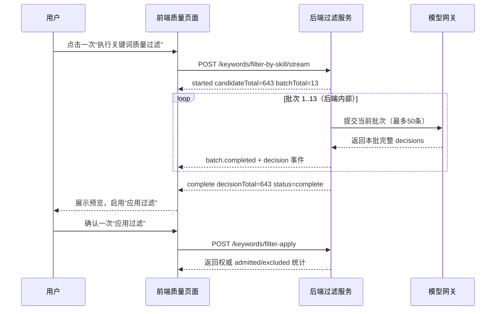
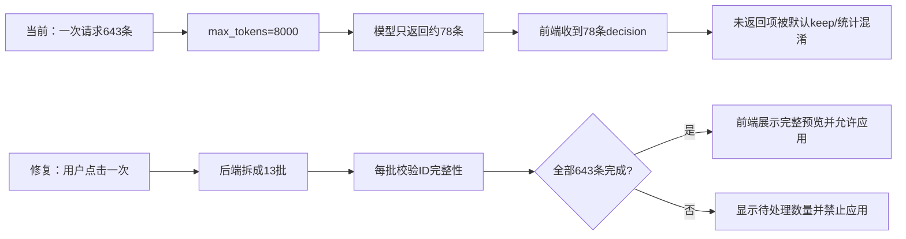

# 关键词质量过滤 643 与 78 不一致问题分析及修改方案

## 1. 问题范围

- 批次：`batch_dc23fc9141ba4d6f`
- 数据集：`dataset_1f0d622d3bd54fd8`
- 训练任务：`training_ca4bde5bb7ae453e`
- 现象：质量页面显示 643 个关键词，但本次过滤实际只形成约 78 条模型决策。
- 本文原为问题定位和修改设计；方案已实施，执行结果见 `docs/24-关键词质量过滤修复执行效果.md`。

## 2. 证据与结论

### 2.1 643 的真实含义

`datasets/dataset_1f0d622d3bd54fd8/run-report.json` 记录：

```json
{
  "keywordCount": 643,
  "graph": {
    "nodeTypes": {"Keyword": 643},
    "keywordFilterState": {
      "beforeTotal": 643,
      "afterTotal": 643,
      "retained": 643,
      "excluded": 0
    }
  }
}
```

这 643 是图谱中去重后的 `Keyword` 节点数，不是模型已经完成质量判断的数量。节点当前 `admissionStatus` 全部为 `admitted`，表示过滤前的迁移默认状态。

### 2.2 任务没有在训练阶段完成质量过滤

`training_ca4bde5bb7ae453e/events.jsonl` 的完成事件明确写出：关键词 643、模型成功 0、模型失败 0；训练阶段执行的是确定性关键词抽取，质量过滤是后续质量页面触发的独立预览/应用流程。因此不能用训练任务的 `keywordCount` 推断过滤完成数。

### 2.3 78 的来源

后端 `stream_keywords_filter_by_skill` 将全部关键词拼成一次模型请求，并将 `max_tokens` 设置为：

```python
estimated_max_tokens = min(8000, 200 + len(keywords) * 80)
```

643 条输入会触发 8000 token 上限。模型输出 JSON 决策数组在达到上限前被截断，流式解析器只对已闭合的决策对象发出 `decision` 事件；本次约 78 条对象被解析并进入前端。`complete.total` 统计的是“解析出的决策数”，不是关键词候选总数。

### 2.4 造成误导的默认行为

普通预览 `preview_keywords_filter_by_skill` 使用：

```python
decision = decision_map.get(kw_id, {})
action = "keep" if not decision.get("shouldExclude", False) else "exclude"
```

模型未返回的 565 条被静默视为 `keep`，所以接口可能返回 `suggestions.length == 643`，但其中只有模型实际返回的 78 条有 `reason` 和真实决策。应用接口又只更新提交的决策条目，其余节点继续沿用/写入 admitted，最终出现“展示 643、实际处理 78”的口径分裂。

## 3. 底层逻辑（可复核流程）

```text
资料/处理单元
  -> 确定性关键词抽取与去重
  -> 643 个 Keyword 节点（候选总数）
  -> 质量页面读取 graph/nodes.json
  -> 一次性构造 643 条模型输入
  -> max_tokens=8000，输出被截断
  -> 流式 JSON 解析器只发出已闭合的约 78 条 decision
  -> 前端把 decision.total/keywordCount 当成同一 total
  -> 未决策项在普通模式中默认 keep，应用时只更新已提交项
```

需要禁止的隐含推理是：`候选数 = 模型决策数 = 已应用数`。正确关系应为：

```text
candidateTotal = 643
decisionTotal <= candidateTotal
appliedTotal <= decisionTotal
```

只有在 `decisionTotal == candidateTotal` 且所有 `keywordId` 唯一、可回查时，才允许进入“可应用”状态。

## 4. 修改方案

### 4.1 后端：分批、完整性校验、权威统计（P0）

1. 按配置的 `keyword_filter_batch_size`（建议 40~60）拆分关键词；每批独立调用模型，避免单次输出超过 token 上限。该值进入配置文件，不写死在业务代码中。
2. 每批请求只允许返回输入批次中的 `keywordId`，并校验：缺失、重复、未知 ID、非法 `shouldExclude` 均视为批次失败。
3. 对批次失败执行有限重试；仍失败则返回 `incomplete`，禁止把缺失项默认保留。
4. 普通预览与 SSE 使用同一批处理核心，避免两套逻辑再次产生不同统计。
5. 返回明确的数据契约：

```json
{
  "candidateTotal": 643,
  "decisionTotal": 643,
  "appliedTotal": 0,
  "pendingTotal": 0,
  "suggestedKeep": 565,
  "suggestedExclude": 78,
  "status": "complete",
  "missingKeywordIds": [],
  "failedBatches": []
}
```

6. `filter-apply` 必须校验 `decisions` 覆盖全部候选 ID；不完整时返回 409，并带出缺失 ID 数量，不能隐式 admitted。

### 4.2 前端：按阶段展示统计（P0）

- 进度显示 `已完成决策 / 候选总数`，例如 `78 / 643`，不能显示为“已过滤 643”。
- `complete` 事件增加 `candidateTotal`、`decisionTotal`、`pendingTotal`、`status`；收到 `status=incomplete` 时显示失败并禁用“应用过滤”。
- 预览列表只展示真实决策；待处理项单独显示数量，不伪造 keep 建议。
- 应用前显示覆盖率校验：`decisionTotal == candidateTotal` 才允许提交。

### 4.2.1 是否需要前端多次执行

**不需要用户多次点击。** 推荐交互是“前端触发一次，后端内部批量执行”。例如批大小为 50 时，643 个候选会被后端拆成 13 批：



前端只有两个用户动作：一次“执行预览”和一次“应用结果”。13 次模型调用、失败重试和进度累计都由后端完成。只有在后端返回 `status=incomplete` 时，前端才显示失败批次和“重试本次过滤”，不应要求用户手工重复点击 13 次。

### 4.2.2 页面效果示意

| 阶段 | 页面主状态 | 数量展示 | 按钮状态 |
| --- | --- | --- | --- |
| 未执行 | 待执行质量过滤 | 候选关键词 `643` | `执行过滤` 可用 |
| 执行中 | 正在分析第 5/13 批 | 已完成决策 `250/643`，待处理 `393` | 执行中禁用 |
| 完整预览 | 分析完成，可人工复核 | 候选 `643`，保留建议 `565`，排除建议 `78` | `应用过滤` 可用 |
| 不完整 | 部分批次失败 | 已完成 `600/643`，待处理 `43` | `应用过滤` 禁用，`重试失败批次` 可用 |
| 已应用 | 过滤结果已写入图谱 | 过滤前 `643`，保留 `565`，排除 `78` | 可查看结果，不重复应用 |

```text
关键词质量过滤
候选关键词              643
模型决策进度       250 / 643   [##########..........] 38.9%
当前批次             第 5 / 13 批

建议保留              220
建议排除               30
待处理                 393

[执行中，暂不可应用]
```

完整完成后的结果页应变为：

```text
过滤完成
候选 643  =  保留 565  +  排除 78

[查看全部决策]  [应用过滤]
```

这里的“排除 78”只是示例结果，实际数值必须来自模型决策和用户复核；不能把当前故障中的 78 条不完整返回直接当成最终排除数。

### 4.2.3 当前实现与修复后实现对照



**最终效果**：用户不感知模型调用次数，只看到真实的候选数、已决策数、待处理数和应用结果；任何不完整结果都不会被伪装成“已完成”。

### 4.3 数据与审计（P1）

- 保存每次过滤运行的 `runId`、规则版本/hash、模型调用批次数、输入/输出 ID 集合、失败批次和时间。
- 图谱 summary 同时保留 `candidateTotal`、`admittedTotal`、`excludedTotal`，旧字段 `keywordCount` 仅作为候选数兼容字段。
- 日志事件使用统一字段，禁止用 `total` 表示不同阶段的数量。

## 5. 接口伪代码

```text
filter(datasetId):
  candidates = loadKeywordNodes(datasetId)
  batches = split(candidates, config.keyword_filter_batch_size)
  decisions = []
  failures = []
  for batch in batches:
    result = callModel(batch, skillPrompt)
    if not validDecisionSet(result, ids(batch)):
      retry(batch)
    if still invalid:
      failures.append(batch)
      continue
    decisions.extend(result.decisions)
  missing = ids(candidates) - ids(decisions)
  status = "complete" if not missing and not failures else "incomplete"
  return {candidateTotal, decisionTotal, pendingTotal, status, decisions, failures}

apply(datasetId, decisions):
  candidates = loadKeywordNodes(datasetId)
  validateExactCoverage(ids(candidates), ids(decisions))
  transaction:
    writeAdmissionStatus(decisions)
    persistFilterRunAudit()
  return authoritativeCountsFromNodes()
```

## 6. 验收标准

1. 对本批次，候选总数仍为 643；完整运行的 `decisionTotal` 必须为 643。
2. 任一模型批次被截断或缺失 ID 时，页面显示“不完整”，不得显示“分析完成”，不得允许应用。
3. `candidateTotal`、`decisionTotal`、`appliedTotal` 三个数在 SSE、普通接口、应用响应和页面统计中一致。
4. 对 643 条输入执行集成测试：模型按批调用，所有关键词 ID 恰好一次，过滤结果可重复。
5. 回归测试覆盖：空关键词、重复 ID、未知 ID、模型截断、单批失败重试、部分成功禁止应用。

## 7. 风险与待办

- 批量调用会增加模型调用次数和总耗时，需要按实际网关限流配置并行度。
- 过滤规则和提示词继续从 `skills/keyword-filter/SKILL.md` 读取；如调整批大小、重试次数或输出 schema，应同步记录配置和设计文档。
- 本轮未修改代码；下一步应先补充接口/伪代码对应的测试设计，再实施后端、前端和运行产物迁移。
