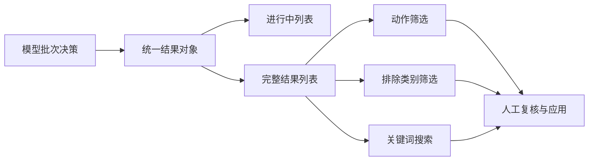

# 关键词过滤前端易用性优化设计

## 1. 设计范围

本设计只针对质量分析页的关键词过滤区域，已按确认方案完成实现。目标是解决：

1. 过滤进行中，左侧“保留/排除”标签缺少对应关键词名称；
2. 结果区域受固定高度影响，默认只能看到约 6 条详细信息；
3. 排除关键词缺少可聚合、可筛选的问题类别，难以发现文档共性问题。

## 2. 总体交互

用户仍然只点击一次“执行过滤”。前端持续接收后端批次结果，并将每条结果呈现为“动作 + 关键词 + 类别 + 原因”。过滤完成后，结果区支持按动作、问题类别和关键词搜索；不再通过固定高度隐藏其余结果。



## 3. 页面设计

### 3.1 进行中列表：红框区域补齐关键词

当前红框区域只显示“保留/排除”标签。修改为四列：

| 列 | 内容 | 说明 |
| --- | --- | --- |
| 动作 | 保留/排除 | 使用现有绿色/红色标签 |
| 关键词 | `keywordName` | 必须始终显示，过长省略并提供完整悬浮提示 |
| 问题类别 | `issueCategory` | 保留项显示“无”；排除项显示具体类别 |
| 判定理由 | `reason` | 展示模型解释，可换行 |

示意：

```text
┌──────┬──────────────────┬──────────────┬──────────────────────────────┐
│ 保留 │ 视图             │ -            │ 明确的数据库对象概念          │
│ 保留 │ 集群             │ -            │ 具有明确业务含义                │
│ 排除 │ 对象             │ 通用词       │ 范围过宽，无法独立定位功能      │
│ 排除 │ LOB              │ 同义重复     │ 与“大对象”重复，降级为别名      │
└──────┴──────────────────┴──────────────┴──────────────────────────────┘
```

批次处理中，列表展示已返回的真实决策；顶部显示“已决策 N / 候选总数”，不能将未返回项伪装成保留项。

### 3.2 详情列表：从固定 6 条改为完整可达

不建议简单取消高度限制后让页面无限增长。采用“固定可视区 + 虚拟滚动/分页”的方式：

- 桌面端结果区保持约 420px 高度，内部滚动；
- 默认加载并展示全部结果数据，但只渲染可视行，643 条不会造成页面卡顿；
- 顶部显示 `当前筛选结果 / 总决策数`，例如 `1-50 / 643`；
- 提供“上一页/下一页”和每页 50/100 条选择；
- **关键词搜索是全局搜索**：搜索范围为当前过滤运行的完整决策集合，不受当前页限制；先完成全量集合的动作/类别/关键词筛选，再对筛选结果分页或虚拟滚动；
- 搜索输入采用约 300ms 防抖，实时更新匹配总数，例如 `匹配 12 条，当前显示 1-12`；
- 关键词搜索支持标准名称、原始名称、别名和关键词 ID；默认不区分大小写，中文按包含匹配；
- 关键词搜索和筛选后自动回到第一页；清空搜索恢复当前动作和类别筛选结果；
- 移动端改为单列卡片，保留内部滚动和分页；
- 结果列表不再使用“只显示前 6 条”的隐式截断。

列表头部示意：

```text
过滤建议                         共 643 条  保留 565  排除 78
[全部] [保留] [排除]  [问题类别 v]  [搜索关键词________]  每页 50 条

当前显示 1-50 / 643                                      [<] [>]
```

全局搜索处理顺序：

```text
完整决策集合（643）
  -> 动作筛选（全部/保留/排除）
  -> 排除类别筛选
  -> 关键词全局搜索
  -> 得到匹配集合（例如12条）
  -> 对匹配集合分页/虚拟滚动
```

因此用户在第 8 页输入“LOB”，仍会从全部 643 条决策中查找，而不是只查第 8 页的 50 条。筛选结果为空时显示“未找到匹配关键词”，并保留当前搜索词和筛选条件，方便继续调整。

### 3.3 排除类别筛选

排除结果增加标准化 `issueCategory` 字段，并在结果区提供类别下拉筛选。类别首版建议如下，最终名称和提示词从过滤规则配置读取：

| 类别 ID | 中文名称 | 典型含义 |
| --- | --- | --- |
| `generic_term` | 通用词/过于宽泛 | “对象”“处理”“管理”等无法独立定位 |
| `duplicate_alias` | 同义重复 | 与已有中文关键词重复，适合作为别名 |
| `language_variant` | 语言版本 | 英文版本降级为中文关键词别名 |
| `error_code_alias` | 错误码别名 | 错误码不作为独立关键词 |
| `internal_implementation` | 内部实现词 | 内部类名、函数名、实现细节 |
| `insufficient_evidence` | 证据不足 | 原文出现频次或关联证据不足 |
| `irrelevant_term` | 业务无关 | 与 YashanDB 核心业务无直接关系 |
| `other` | 其他 | 无法归入以上类别，需人工复核 |

筛选交互：

- 默认显示全部；
- 选择“排除”后，类别下拉只展示实际存在的排除类别及数量；
- 类别选项显示数量，例如 `通用词/过于宽泛（42）`；
- 可组合“排除 + 通用词 + 搜索”，用于定位文档中反复出现的共性问题；
- 保留项的类别固定为“无”，不参与排除类别统计。

## 4. 数据契约设计

### 4.1 决策对象新增字段

```json
{
  "keywordId": "keyword:abc",
  "keywordName": "对象",
  "shouldExclude": true,
  "issueCategory": "generic_term",
  "issueCategoryLabel": "通用词/过于宽泛",
  "reason": "范围过宽，无法独立定位具体数据库功能"
}
```

兼容规则：历史结果没有 `issueCategory` 时，前端显示“未分类”，后端应用不因缺少该字段失败；新生成结果必须提供类别，无法判断时使用 `other` 并要求人工复核。

### 4.2 SSE 事件

`decision` 事件新增 `issueCategory`、`issueCategoryLabel`；`complete` 事件新增聚合统计：

```json
{
  "candidateTotal": 643,
  "decisionTotal": 643,
  "pendingTotal": 0,
  "excludedByCategory": {
    "generic_term": 42,
    "duplicate_alias": 18
  },
  "status": "complete"
}
```

## 5. 后端与提示词边界

- 类别定义进入过滤规则配置或 Skill 输出约束，不在 Vue 模板中硬编码规则文本；
- 后端负责校验类别 ID 是否属于当前规则版本；新模型决策缺失或使用非法类别时整批重试，重试失败返回 `incomplete`，不得静默生成“未分类”；
- 前端只负责展示、筛选和统计，不自行根据 `reason` 文本猜类别；
- 应用接口继续以 `keywordId` 和 `action` 为准，类别作为审计和筛选信息保存。

历史结果与新运行使用不同边界：历史结果缺少类别时仍兼容显示“未分类”；新运行的排除决策必须使用 Skill 中声明的类别 ID。这样页面分类直接来自过滤 Skill 的结构化输出，而不是根据理由文本二次猜测。

## 6. 验收标准

| 编号 | 验收项 | 通过条件 |
| --- | --- | --- |
| UX-01 | 进行中展示关键词 | 每条已返回决策同时显示关键词名称 |
| UX-02 | 全量详情可达 | 643 条结果可通过虚拟滚动/分页访问，不限于 6 条 |
| UX-03 | 排除分类 | 每条排除决策有类别或“未分类”，保留项不计入排除分类 |
| UX-04 | 全局搜索 | 在任意页输入关键词，均从完整决策集合检索，不受当前页限制 |
| UX-05 | 组合筛选 | 可同时按动作、类别、关键词搜索 |
| UX-06 | 统计一致 | 类别计数之和等于排除结果数，未分类单独计数 |
| UX-07 | 流式兼容 | 批处理中列表增量更新，完成/不完整状态不混淆 |
| UX-08 | 性能 | 643 条结果滚动和筛选无明显卡顿，不一次性渲染全部 DOM |
| UX-09 | 历史数据 | 无类别的旧结果可正常显示和应用 |

## 7. 实施顺序与完成状态

1. 先确定排除类别字典和文案；
2. 更新 Skill 输出约束、Schema 和后端决策对象；
3. 更新 SSE/普通预览接口的类别字段与聚合统计；
4. 更新前端进行中列表、全量分页/虚拟滚动和组合筛选；
5. 增加后端接口、前端交互和 643 条列表性能验收；
6. 使用隔离 fixture 验证后，再连接真实批次进行只读预览。

已确认采用配置驱动的首版类别字典，以及固定可视区内分页方案；全局搜索先筛选完整决策集合，再进行分页。执行结果记录见 `docs/24-关键词质量过滤修复执行效果.md`。
