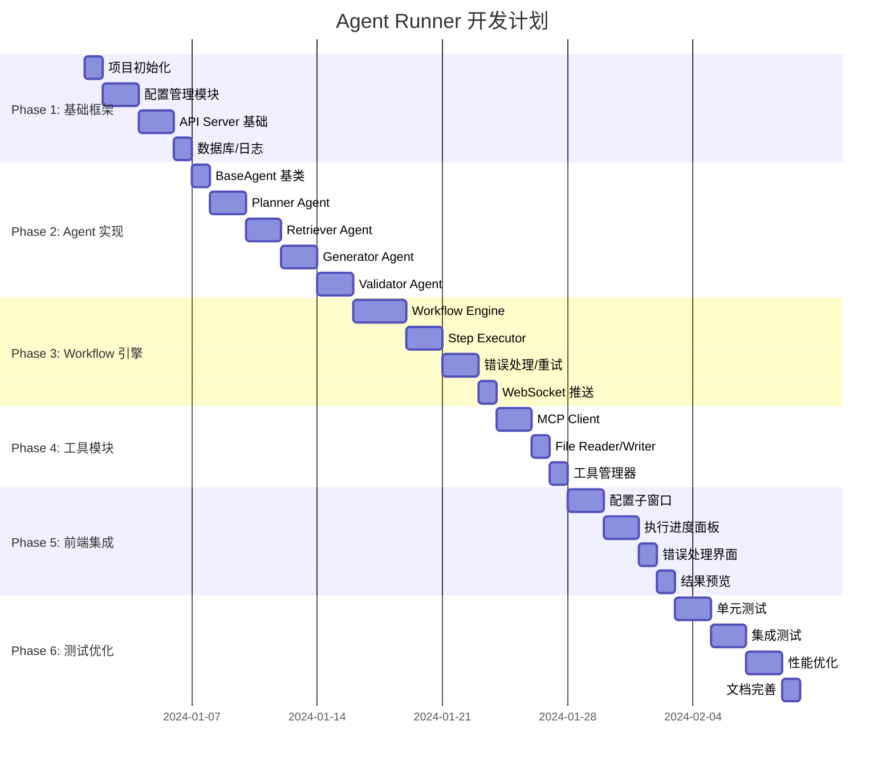

# 开发任务分解

## 1. 任务总览



## 2. Phase 1: 基础框架（5天）

### 2.1 项目初始化

| 任务 | 文件 | 说明 |
|------|------|------|
| 创建项目结构 | `package.json` | Node.js 项目配置 |
| 安装依赖 | `package.json` | express, socket.io, openai 等 |
| 创建目录结构 | 各目录 | config/, lib/, logs/ 等 |
| 环境变量配置 | `.env.example` | 环境变量模板 |

**依赖列表：**
```json
{
  "dependencies": {
    "express": "^4.18.2",
    "socket.io": "^4.6.1",
    "openai": "^4.20.0",
    "cors": "^2.8.5",
    "express-rate-limit": "^7.1.5",
    "winston": "^3.11.0",
    "dotenv": "^16.3.1"
  },
  "devDependencies": {
    "jest": "^29.7.0",
    "nodemon": "^3.0.2"
  }
}
```

### 2.2 配置管理模块

| 任务 | 文件 | 说明 |
|------|------|------|
| ConfigManager 类 | `lib/config-manager.js` | 配置加载/保存/加密 |
| ConfigValidator 类 | `lib/config-validator.js` | 配置验证 |
| 默认配置初始化 | `scripts/init-config.js` | 初始化默认配置 |
| 配置热更新 | `lib/config-manager.js` | 文件监听 |

**验收标准：**
- [ ] 可以加载/保存 JSON 配置
- [ ] API Key 加密存储
- [ ] 配置验证通过/失败有明确提示

### 2.3 API Server 基础

| 任务 | 文件 | 说明 |
|------|------|------|
| Express 应用 | `server.js` | HTTP 服务入口 |
| 路由定义 | `routes/*.js` | API 路由 |
| 中间件 | `middleware/*.js` | CORS, 认证, 限流 |
| 错误处理 | `middleware/error-handler.js` | 统一错误处理 |

**验收标准：**
- [ ] 服务启动正常
- [ ] CORS 配置正确
- [ ] 频率限制生效

### 2.4 日志系统

| 任务 | 文件 | 说明 |
|------|------|------|
| Winston 配置 | `lib/logger.js` | 日志记录器 |
| 日志格式 | `lib/logger.js` | JSON 格式日志 |
| 日志轮转 | `lib/logger.js` | 文件大小限制 |

---

## 3. Phase 2: Agent 实现（9天）

### 3.1 BaseAgent 基类

| 任务 | 文件 | 说明 |
|------|------|------|
| BaseAgent 类 | `lib/agents/base-agent.js` | Agent 基类 |
| LLM Client | `lib/llm-client.js` | 大模型调用 |
| Prompt 模板 | `lib/agents/prompts/*.md` | Prompt 模板文件 |

**验收标准：**
- [ ] 可以调用大模型 API
- [ ] 支持多家厂商 API
- [ ] Prompt 模板可配置

### 3.2 Planner Agent

| 任务 | 文件 | 说明 |
|------|------|------|
| PlannerAgent 类 | `lib/agents/planner-agent.js` | 规划 Agent |
| 执行计划生成 | `lib/agents/planner-agent.js` | 生成 JSON 计划 |
| Prompt 模板 | `lib/agents/prompts/planner.md` | 规划提示词 |

**验收标准：**
- [ ] 输入知识点信息，输出执行计划 JSON
- [ ] 执行计划包含文档结构、检索策略、验证标准

### 3.3 Retriever Agent

| 任务 | 文件 | 说明 |
|------|------|------|
| RetrieverAgent 类 | `lib/agents/retriever-agent.js` | 检索 Agent |
| MCP 查询 | `lib/agents/retriever-agent.js` | 调用 MCP |
| 文件读取 | `lib/agents/retriever-agent.js` | 读取参考文档 |
| 结果整理 | `lib/agents/retriever-agent.js` | 生成 Markdown |

**验收标准：**
- [ ] 可以查询 MCP 知识库
- [ ] 可以读取本地文件
- [ ] 输出格式为 Markdown

### 3.4 Generator Agent

| 任务 | 文件 | 说明 |
|------|------|------|
| GeneratorAgent 类 | `lib/agents/generator-agent.js` | 生成 Agent |
| 上下文构建 | `lib/agents/generator-agent.js` | 组装上下文 |
| 文档生成 | `lib/agents/generator-agent.js` | 生成 Markdown |
| Prompt 模板 | `lib/agents/prompts/generator.md` | 生成提示词 |

**验收标准：**
- [ ] 根据计划和参考资料生成完整文档
- [ ] 文档包含 YAML 元数据
- [ ] 包含 SQL 示例和对比表格

### 3.5 Validator Agent

| 任务 | 文件 | 说明 |
|------|------|------|
| ValidatorAgent 类 | `lib/agents/validator-agent.js` | 验证 Agent |
| 章节检查 | `lib/agents/validator-agent.js` | 完整性检查 |
| SQL 验证 | `lib/agents/validator-agent.js` | 语法检查 |
| 质量评分 | `lib/agents/validator-agent.js` | 评分算法 |

**验收标准：**
- [ ] 可以检查文档完整性
- [ ] 可以验证 SQL 语法
- [ ] 输出验证报告 JSON

---

## 4. Phase 3: Workflow 引擎（8天）

### 4.1 Workflow Engine

| 任务 | 文件 | 说明 |
|------|------|------|
| WorkflowEngine 类 | `lib/workflow-engine.js` | 工作流引擎 |
| WorkflowInstance 类 | `lib/workflow-engine.js` | 工作流实例 |
| 状态管理 | `lib/workflow-engine.js` | 状态机实现 |
| 进度计算 | `lib/workflow-engine.js` | 进度更新 |

**验收标准：**
- [ ] 可以创建和启动工作流
- [ ] 状态转换正确
- [ ] 进度计算准确

### 4.2 Step Executor

| 任务 | 文件 | 说明 |
|------|------|------|
| StepExecutor 类 | `lib/step-executor.js` | 步骤执行器 |
| Agent 调度 | `lib/step-executor.js` | 调用对应 Agent |
| 数据传递 | `lib/step-executor.js` | 步骤间数据传递 |
| 格式验证 | `lib/step-executor.js` | 输出格式检查 |

**验收标准：**
- [ ] 可以正确调度 Agent
- [ ] 数据传递格式正确
- [ ] 输出格式验证通过

### 4.3 错误处理

| 任务 | 文件 | 说明 |
|------|------|------|
| 重试机制 | `lib/workflow-engine.js` | 3 次重试 |
| 暂停/恢复 | `lib/workflow-engine.js` | 用户干预 |
| 强制继续 | `lib/workflow-engine.js` | 跳过失败步骤 |

**验收标准：**
- [ ] 失败自动重试 3 次
- [ ] 重试失败后暂停
- [ ] 用户可以强制继续

### 4.4 WebSocket 推送

| 任务 | 文件 | 说明 |
|------|------|------|
| Socket.IO 集成 | `server.js` | WebSocket 服务 |
| 进度推送 | `lib/workflow-engine.js` | 实时进度 |
| 事件订阅 | `lib/workflow-engine.js` | 订阅/取消 |

**验收标准：**
- [ ] WebSocket 连接正常
- [ ] 进度实时更新
- [ ] 事件推送正确

---

## 5. Phase 4: 工具模块（4天）

### 5.1 MCP Client

| 任务 | 文件 | 说明 |
|------|------|------|
| MCPClient 类 | `lib/tools/mcp-client.js` | MCP 客户端 |
| 查询接口 | `lib/tools/mcp-client.js` | query/batchQuery |
| 缓存实现 | `lib/tools/mcp-client.js` | MCPCache 类 |
| 连接测试 | `lib/tools/mcp-client.js` | testConnection |

**验收标准：**
- [ ] 可以查询 MCP Server
- [ ] 缓存命中/未命中正确
- [ ] 连接测试通过

### 5.2 File Reader/Writer

| 任务 | 文件 | 说明 |
|------|------|------|
| FileReader 类 | `lib/tools/file-reader.js` | 文件读取 |
| FileWriter 类 | `lib/tools/file-writer.js` | 文件写入 |
| 批量操作 | `lib/tools/*.js` | 批量读写 |
| 路径解析 | `lib/tools/*.js` | 相对/绝对路径 |

**验收标准：**
- [ ] 可以读取/写入文件
- [ ] 自动创建目录
- [ ] 批量操作正常

### 5.3 工具管理器

| 任务 | 文件 | 说明 |
|------|------|------|
| ToolManager 类 | `lib/tools/tool-manager.js` | 工具管理 |
| 工具注册 | `lib/tools/tool-manager.js` | 注册/获取 |
| 工具调用接口 | `lib/tools/tool-manager.js` | 统一调用 |

---

## 6. Phase 5: 前端集成（6天）

### 6.1 配置子窗口

| 任务 | 文件 | 说明 |
|------|------|------|
| Modal 结构 | `prompt-generator.html` | HTML 结构 |
| Tab 切换 | `prompt-generator.html` | CSS/JS |
| 模型配置表单 | `prompt-generator.html` | 表单实现 |
| MCP 配置表单 | `prompt-generator.html` | 表单实现 |
| Agent 配置表单 | `prompt-generator.html` | 表单实现 |
| 配置保存 | `prompt-generator.html` | API 调用 |
| 连接测试 | `prompt-generator.html` | 测试按钮 |

**验收标准：**
- [ ] 子窗口正常打开/关闭
- [ ] Tab 切换正常
- [ ] 配置可以保存/加载
- [ ] 连接测试正常

### 6.2 执行进度面板

| 任务 | 文件 | 说明 |
|------|------|------|
| 进度面板结构 | `prompt-generator.html` | HTML 结构 |
| 进度条 | `prompt-generator.html` | CSS 动画 |
| 步骤列表 | `prompt-generator.html` | 步骤渲染 |
| WebSocket 连接 | `prompt-generator.html` | 实时接收 |
| 进度更新 | `prompt-generator.html` | DOM 更新 |

**验收标准：**
- [ ] 进度条实时更新
- [ ] 步骤状态正确显示
- [ ] WebSocket 连接稳定

### 6.3 错误处理界面

| 任务 | 文件 | 说明 |
|------|------|------|
| 错误对话框 | `prompt-generator.html` | HTML 结构 |
| 错误信息展示 | `prompt-generator.html` | 错误详情 |
| 用户选择 | `prompt-generator.html` | 强制继续/终止 |
| API 调用 | `prompt-generator.html` | 调用后端 API |

**验收标准：**
- [ ] 错误信息正确显示
- [ ] 用户可以选择操作
- [ ] 操作正确执行

### 6.4 结果预览

| 任务 | 文件 | 说明 |
|------|------|------|
| 预览面板 | `prompt-generator.html` | HTML 结构 |
| 折叠/展开 | `prompt-generator.html` | 交互逻辑 |
| Markdown 渲染 | `prompt-generator.html` | 内容渲染 |
| JSON 格式化 | `prompt-generator.html` | JSON 展示 |

**验收标准：**
- [ ] 预览默认折叠
- [ ] 点击可以展开/折叠
- [ ] 内容正确渲染

---

## 7. Phase 6: 测试优化（7天）

### 7.1 单元测试

| 任务 | 文件 | 说明 |
|------|------|------|
| ConfigManager 测试 | `tests/config-manager.test.js` | 配置管理 |
| Agent 测试 | `tests/agents/*.test.js` | 各 Agent |
| Workflow 测试 | `tests/workflow.test.js` | 工作流 |
| 工具测试 | `tests/tools/*.test.js` | 各工具 |

**验收标准：**
- [ ] 覆盖率 > 80%
- [ ] 所有测试通过

### 7.2 集成测试

| 任务 | 文件 | 说明 |
|------|------|------|
| API 测试 | `tests/api.test.js` | API 接口 |
| 端到端测试 | `tests/e2e.test.js` | 完整流程 |
| WebSocket 测试 | `tests/websocket.test.js` | 实时推送 |

**验收标准：**
- [ ] API 接口测试通过
- [ ] 端到端流程正常
- [ ] WebSocket 推送正常

### 7.3 性能优化

| 任务 | 文件 | 说明 |
|------|------|------|
| 缓存优化 | `lib/tools/mcp-client.js` | MCP 缓存 |
| 并发控制 | `lib/workflow-engine.js` | 任务队列 |
| 内存优化 | 各文件 | 内存泄漏检查 |

### 7.4 文档完善

| 任务 | 文件 | 说明 |
|------|------|------|
| README | `agent-runner/README.md` | 使用说明 |
| API 文档 | `docs/agent-runner/api.md` | API 文档 |
| 部署文档 | `docs/agent-runner/deploy.md` | 部署指南 |

---

## 8. 里程碑

| 里程碑 | 日期 | 交付物 |
|--------|------|--------|
| M1: 基础框架完成 | Day 5 | 可运行的服务骨架 |
| M2: Agent 实现完成 | Day 14 | 4 个 Agent 可用 |
| M3: Workflow 引擎完成 | Day 22 | 工作流可执行 |
| M4: 工具模块完成 | Day 26 | 工具可调用 |
| M5: 前端集成完成 | Day 32 | 完整可用界面 |
| M6: 测试优化完成 | Day 39 | 生产就绪 |

---

## 9. 风险与应对

| 风险 | 影响 | 应对措施 |
|------|------|----------|
| 大模型 API 不稳定 | 执行失败 | 重试机制 + 多厂商支持 |
| MCP Server 不可用 | 检索失败 | 降级处理 + 缓存 |
| 前端兼容性问题 | 界面异常 | 多浏览器测试 |
| 性能瓶颈 | 响应慢 | 并发控制 + 缓存优化 |

---

## 10. 验收标准

### 功能验收

- [ ] 可以配置模型/MCP/Agent
- [ ] 可以选择知识点并执行
- [ ] 4 步 Workflow 正常执行
- [ ] 进度实时显示
- [ ] 错误可以重试和用户干预
- [ ] 生成的文件保存到正确位置

### 性能验收

- [ ] 单次执行 < 3 分钟
- [ ] 并发支持 > 5 个任务
- [ ] 内存占用 < 500MB

### 质量验收

- [ ] 单元测试覆盖率 > 80%
- [ ] 无严重 Bug
- [ ] 文档完整
