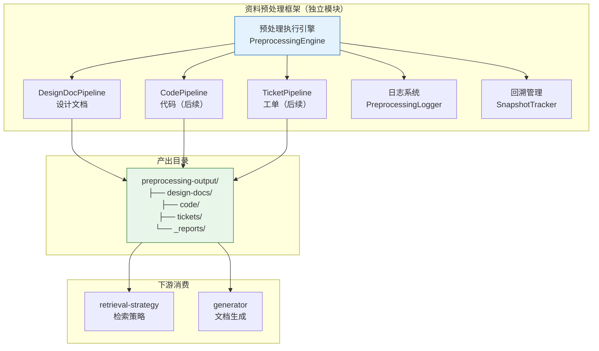
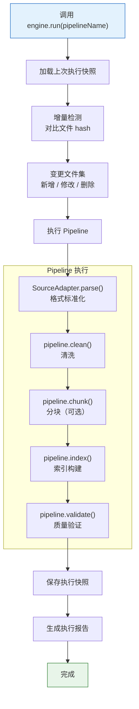
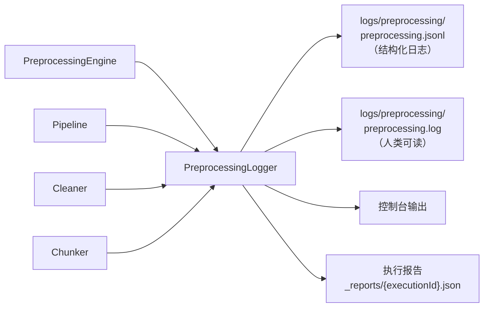

# 27-资料预处理框架概要设计

> 版本：v1.3
> 日期：2026-07-24
> 状态：实施中（Phase 1 已完成，Phase 2-4 待实施）
> 前置文档：`26-设计文档预处理与分层索引设计.md`、`10-设计文档预处理-专业提示词.md`
> 替代文档：`27-设计文档预处理系统概要设计.md`（v1.0，已废弃）

---

## 1. 概述

### 1.1 模块定位

资料预处理框架是 **独立于检索和生成流程的预处理模块**，负责将各类原始素材转化为高质量、可检索的知识资产。

```
┌─────────────────────────────────────────────────────────────┐
│                    资料预处理框架                              │
│                                                             │
│  输入：原始素材          输出：清洗后素材 + 索引              │
│  - 设计文档（当前）      - 标准化 Markdown                   │
│  - 代码（后续）          - 分层索引                          │
│  - 工单（后续）          - 结构化摘要                        │
│  - ...（可扩展）         - 质量报告                          │
│                                                             │
│  特性：幂等执行 / 可回溯 / 结构化日志 / 可扩展              │
└─────────────────────────────────────────────────────────────┘
         │                                    │
         ▼                                    ▼
  code/packages/agent-runner-core/lib/                  retrieval-strategy
  preprocessing/                     （消费预处理产出）
```

**基准处理流程（5 阶段）**：
1. **多格式解析**：AdapterChain 将各种格式文档解析为统一的 NormalizedDocument
2. **质量过滤**：两阶段过滤（规则快筛 + LLM 精筛），去除低质量文档
3. **格式统一与清洗**：DesignDocCleaner 执行 6 条清洗规则，输出标准化 Markdown
4. **语义分块与分类**：SemanticChunker 按语义边界切分 + FeatureClassifier 混合分类
5. **混合索引构建**：结构化索引 + 向量索引 + 知识图谱，支持多路融合检索

**核心原则**：
1. **独立性**：预处理模块不依赖检索/生成流程，可独立运行和测试
2. **通用性**：框架层面不绑定特定资料类型，通过 Pipeline 扩展
3. **幂等性**：相同输入产生相同输出，可安全重复执行
4. **可回溯**：每次执行记录完整快照，支持回滚到任意历史版本
5. **可观测**：结构化日志 + 执行报告，每次执行可审计
6. **混合策略**：规则处理 80% 确定性工作，LLM 处理 20% 语义理解环节

### 1.2 与现有架构的关系

素材来源接入不再限定为 PingCode 下载。统一的本地上传、PingCode 映射下载、临时区、分片上传、原始文件快照和安全解压由 `33-通用素材上传映射下载与加工平台概要设计.md` 定义；本文件负责接入完成后的格式解析、质量过滤、清洗、分块、分类和索引流程。



### 1.3 模块目录结构

```
agent-runner/
├── lib/
│   ├── preprocessing/                    # 预处理模块（新增）
│   │   ├── index.js                      # 模块入口，导出 PreprocessingEngine
│   │   ├── engine.js                     # 预处理执行引擎
│   │   ├── pipeline.js                   # Pipeline 基类
│   │   ├── source-adapter.js             # SourceAdapter 基类
│   │   ├── quality-validator.js          # 质量验证器
│   │   ├── snapshot-tracker.js           # 回溯管理
│   │   ├── preprocessing-logger.js       # 预处理专用日志
│   │   ├── pipelines/                    # 具体 Pipeline 实现
│   │   │   ├── design-doc-pipeline.js    # 设计文档流水线
│   │   │   └── (后续: code-pipeline.js)
│   │   │   └── (后续: ticket-pipeline.js)
│   │   ├── cleaners/                     # 清洗器
│   │   │   ├── design-doc-cleaner.js     # 设计文档清洗
│   │   │   └── (后续: ...)
│   │   ├── chunkers/                     # 分块器
│   │   │   ├── semantic-chunker.js       # 语义分块
│   │   │   └── (后续: ...)
│   │   └── indexers/                     # 索引构建器
│   │       ├── layered-indexer.js        # 分层索引
│   │       └── (后续: ...)
│   ├── retrieval-strategy/               # 现有检索策略（消费预处理产出）
│   ├── retrieval/                        # 现有检索模块
│   └── ...
├── config/
│   └── preprocessing-config.json         # 预处理配置（新增）
├── scripts/
│   └── preprocess.js                     # CLI 入口（新增）
└── preprocessing-output/                 # 预处理产出目录（新增）
    ├── design-docs/                      # 设计文档预处理产出
    │   ├── cleaned/                      # 清洗后文件
    │   ├── chunks/                       # 语义分块
    │   └── index/                        # 分层索引
    ├── _snapshots/                       # 执行快照（回溯用）
    └── _reports/                         # 执行报告
```

---

## 2. 核心抽象

### 2.1 Pipeline — 流水线基类

每种资料类型实现一个 Pipeline，定义从原始素材到可检索知识资产的完整处理流程。

```javascript
/**
 * 资料预处理流水线基类
 * 
 * 每种资料类型（设计文档/代码/工单...）继承此基类，
 * 实现具体的清洗、分块、索引构建逻辑。
 */
class Pipeline {
  /**
   * 流水线名称（唯一标识）
   * @returns {string} 如 'design-docs', 'code', 'tickets'
   */
  get name() { throw new Error('Not implemented'); }

  /**
   * 源数据适配器
   * @returns {SourceAdapter}
   */
  get adapter() { throw new Error('Not implemented'); }

  /**
   * 执行完整流水线
   * 
   * @param {Object} context - 执行上下文
   * @param {string} context.sourceDir - 原始素材目录
   * @param {string} context.outputDir - 产出目录
   * @param {Object} context.config - 配置
   * @param {Object} context.snapshot - 上次执行快照（用于增量判断）
   * @returns {Promise<PipelineResult>}
   */
  async execute(context) {
    const { sourceDir, outputDir, config, snapshot } = context;
    const report = new PipelineReport(this.name);

    // 1. 扫描源文件
    const files = await this.adapter.scan(sourceDir);
    report.scan(files.length);

    // 2. 增量检测：计算变更集
    const delta = this.computeDelta(files, snapshot);
    report.delta(delta);

    // 3. 清洗
    const cleaned = await this.clean(delta.changed, config);
    report.clean(cleaned);

    // 4. 分块（可选，由子类决定是否启用）
    const chunked = await this.chunk(cleaned, config);
    report.chunk(chunked);

    // 5. 索引构建
    const indexed = await this.index(chunked || cleaned, config);
    report.index(indexed);

    // 6. 质量验证
    const quality = await this.validate(report, config);
    report.quality(quality);

    // 7. 清理已删除文件的产出
    await this.cleanupDeleted(delta.deleted, outputDir);

    return report;
  }

  // === 子类可覆写的阶段 ===

  /** 清洗阶段 */
  async clean(files, config) { throw new Error('Not implemented'); }

  /** 分块阶段（默认不启用） */
  async chunk(cleaned, config) { return null; }

  /** 索引构建阶段 */
  async index(data, config) { throw new Error('Not implemented'); }

  /** 质量验证阶段 */
  async validate(report, config) { return { passed: true }; }
}
```

### 2.2 SourceAdapter — 源数据适配器

负责屏蔽不同资料格式的差异，输出统一的 `NormalizedDocument`。支持多种文档格式的智能识别和转换。

#### 2.2.1 支持的文档格式

| 格式 | 扩展名 | 适配器 | 依赖库 | 状态 |
|------|--------|--------|--------|------|
| Markdown | .md, .markdown | MarkdownAdapter | 无 | ✅ 已实现 |
| HTML | .html, .htm | HtmlAdapter | cheerio | ✅ 已实现 |
| PDF | .pdf | PdfAdapter | pdf-parse@1.x | ✅ 已实现 |
| Word | .docx | DocxAdapter | mammoth | ✅ 已实现 |
| PowerPoint | .pptx | PptxAdapter | adm-zip + cheerio | ✅ 已实现 |
| Excel | .xlsx, .xls | ExcelAdapter | xlsx | ✅ 已实现 |
| 压缩包 | .tar, .tar.gz, .zip | ArchiveAdapter | tar-stream, adm-zip | ✅ 已实现 |

```javascript
/**
 * 源数据适配器基类
 * 
 * 将不同格式的原始文件转化为统一的 NormalizedDocument。
 * Pipeline 通过 adapter 与原始数据交互，不直接处理格式差异。
 */
class SourceAdapter {
  get name() { throw new Error('Not implemented'); }
  get supportedExtensions() { throw new Error('Not implemented'); }

  /** 检测是否可处理 */
  canHandle(filePath) {
    const ext = path.extname(filePath).toLowerCase();
    return this.supportedExtensions.includes(ext);
  }

  /** 解析单个文件为标准化文档 */
  async parse(filePath) { throw new Error('Not implemented'); }

  /** 扫描目录，返回匹配文件列表 */
  async scan(dir) { throw new Error('Not implemented'); }

  /** 计算文件内容 hash */
  async computeHash(filePath) {
    const content = await fs.readFile(filePath);
    return crypto.createHash('sha256').update(content).digest('hex');
  }
}

/**
 * 标准化文档 — 所有适配器的统一输出
 */
class NormalizedDocument {
  constructor({ title, content, metadata }) {
    this.title = title;
    this.content = content;          // 统一为 Markdown 格式
    this.metadata = {
      sourcePath: metadata.sourcePath,     // 原始文件路径
      sourceFormat: metadata.sourceFormat, // 原始格式
      version: metadata.version || '',
      docType: metadata.docType || '',
      author: metadata.author || '',
      createdDate: metadata.createdDate || '',
      keywords: metadata.keywords || [],
      extra: metadata.extra || {}          // 扩展字段
    };
    this.hash = metadata.hash || '';       // 内容 hash
  }
}
```

### 2.3 Pipeline 扩展示例

后续新增资料类型时，只需实现 Pipeline + SourceAdapter：

```javascript
// 示例：代码预处理流水线（后续实现）
class CodePipeline extends Pipeline {
  get name() { return 'code'; }
  get adapter() { return new CodeAdapter(); }

  async clean(files, config) {
    // 去除注释噪音、提取函数签名、标准化格式
  }

  async chunk(cleaned, config) {
    // 按函数/类/模块分块
  }

  async index(data, config) {
    // 构建 API 索引、调用关系索引
  }
}

// 示例：工单预处理流水线（后续实现）
class TicketPipeline extends Pipeline {
  get name() { return 'tickets'; }
  get adapter() { return new TicketAdapter(); }

  async clean(files, config) {
    // 提取问题描述、解决方案、关联特性
  }

  async index(data, config) {
    // 构建问题-解决方案索引
  }
}
```

---

## 3. 预处理执行引擎

### 3.1 PreprocessingEngine

引擎负责 Pipeline 的调度、日志记录、快照管理。

```javascript
/**
 * 预处理执行引擎
 * 
 * 职责：
 * 1. 注册和管理 Pipeline
 * 2. 调度 Pipeline 执行
 * 3. 管理执行快照（支持增量和回溯）
 * 4. 记录结构化日志
 * 5. 生成执行报告
 */
class PreprocessingEngine {
  constructor(config) {
    this.config = config;
    this.pipelines = new Map();
    this.logger = new PreprocessingLogger(config.logDir);
    this.snapshotTracker = new SnapshotTracker(config.snapshotDir);
  }

  /** 注册 Pipeline */
  register(pipeline) {
    this.pipelines.set(pipeline.name, pipeline);
  }

  /**
   * 执行指定 Pipeline
   * 
   * @param {string} pipelineName - 流水线名称
   * @param {Object} options - 执行选项
   * @param {boolean} options.full - 是否强制全量（忽略增量）
   * @param {boolean} options.dryRun - 预览模式
   * @param {string} options.snapshotId - 回滚到指定快照
   * @returns {Promise<ExecutionReport>}
   */
  async run(pipelineName, options = {}) {
    const pipeline = this.pipelines.get(pipelineName);
    if (!pipeline) throw new Error(`Pipeline not found: ${pipelineName}`);

    const executionId = this.generateExecutionId();
    this.logger.startExecution(executionId, pipelineName, options);

    try {
      // 加载上次执行快照
      const snapshot = options.full
        ? null
        : await this.snapshotTracker.loadLatest(pipelineName);

      // 构建执行上下文
      const context = {
        sourceDir: this.resolveSourceDir(pipelineName),
        outputDir: this.resolveOutputDir(pipelineName),
        config: this.config.pipelines?.[pipelineName] || {},
        snapshot,
        executionId,
        dryRun: options.dryRun || false
      };

      // 执行流水线
      const startTime = Date.now();
      const result = await pipeline.execute(context);
      const duration = Date.now() - startTime;

      // 保存执行快照
      const newSnapshot = this.buildSnapshot(executionId, result, context);
      if (!options.dryRun) {
        await this.snapshotTracker.save(pipelineName, newSnapshot);
      }

      // 记录日志和报告
      this.logger.endExecution(executionId, result, duration);
      const report = this.buildReport(executionId, result, duration, newSnapshot);
      await this.saveReport(report);

      return report;

    } catch (error) {
      this.logger.error(executionId, error);
      throw error;
    }
  }

  /**
   * 执行所有已注册的 Pipeline
   */
  async runAll(options = {}) {
    const results = [];
    for (const [name] of this.pipelines) {
      const result = await this.run(name, options);
      results.push(result);
    }
    return results;
  }

  /**
   * 回滚到指定快照
   */
  async rollback(pipelineName, snapshotId) {
    const snapshot = await this.snapshotTracker.load(pipelineName, snapshotId);
    if (!snapshot) throw new Error(`Snapshot not found: ${snapshotId}`);

    this.logger.info(`Rolling back ${pipelineName} to snapshot ${snapshotId}`);
    // 恢复产出目录到快照状态
    await this.restoreFromSnapshot(snapshot);
  }

  /**
   * 列出所有执行快照
   */
  async listSnapshots(pipelineName) {
    return this.snapshotTracker.list(pipelineName);
  }
}
```

### 3.2 执行流程



---

## 4. 幂等性与回溯设计

### 4.1 幂等性保证

预处理操作设计为 **幂等的**：相同输入 + 相同配置 = 相同输出。

**保证措施**：

| 维度 | 策略 |
|------|------|
| **文件写入** | 写入临时文件 → 原子 rename，避免半写状态 |
| **索引更新** | 增量合并时按 id upsert，结果确定性 |
| **hash 计算** | 基于文件内容（SHA-256），不含时间戳等变量 |
| **摘要生成** | LLM 摘要设置 temperature=0，确保确定性 |
| **配置版本** | 快照中记录配置 hash，配置变更触发全量重处理 |

**幂等执行流程**：

```
第 1 次执行：处理全部 2,596 文件 → 产出 A
第 2 次执行（无变更）：检测到 0 变更 → 跳过 → 产出不变
第 3 次执行（3 文件修改）：仅处理 3 文件 → 合并到产出 A → 产出 A'
第 4 次执行（同第 3 次输入）：与第 3 次结果完全一致
```

### 4.2 快照与回溯

每次执行生成一个快照，记录本次执行的完整状态。

```json
{
  "snapshot_id": "snap-20260723-100000-a1b2c3",
  "pipeline": "design-docs",
  "executed_at": "2026-07-23T10:00:00Z",
  "duration_ms": 45200,
  "config_hash": "f4e3d2c1b0a9...",
  "trigger": "manual",

  "input": {
    "source_dir": "references/design-docs/YashanDB 文档 主页",
    "total_files": 2596,
    "delta": {
      "added": 0,
      "modified": 3,
      "deleted": 0,
      "unchanged": 2593
    }
  },

  "output": {
    "cleaned_files": 2596,
    "chunk_count": 8432,
    "l1_entries": 2596,
    "l2_summaries": 2596
  },

  "quality": {
    "passed": true,
    "checks": {
      "table_preservation": { "rate": 1.0, "threshold": 1.0 },
      "code_block_preservation": { "rate": 1.0, "threshold": 1.0 },
      "term_coverage": { "rate": 0.97, "threshold": 0.95 }
    }
  },

  "file_hashes": {
    "YashanDB v23.1/.../C驱动支持TAF设计文档.md": {
      "hash": "a1b2c3d4...",
      "processed_at": "2026-07-23T10:00:00Z",
      "chunk_count": 7
    }
  },

  "previous_snapshot_id": "snap-20260722-150000-x9y8z7"
}
```

**回溯操作**：

```bash
# 查看历史快照
node scripts/preprocess.js --list-snapshots design-docs

# 回滚到指定快照
node scripts/preprocess.js --rollback design-docs --snapshot snap-20260722-150000-x9y8z7
```

**快照保留策略**：
- 默认保留最近 10 个快照
- 可通过配置调整：`snapshots.maxRetained: 20`
- 每个快照包含 file_hashes，支持精确回溯

---

## 5. 日志系统设计

### 5.1 日志架构

预处理模块使用独立的日志系统，与主 `logger.js` 分离但风格一致（基于 winston）。



### 5.2 日志级别与分类

| 级别 | 用途 | 示例 |
|------|------|------|
| `error` | 不可恢复的错误 | 文件读取失败、hash 计算异常 |
| `warn` | 可恢复的异常 | 摘要生成失败降级为规则提取 |
| `info` | 关键流程节点 | 扫描完成、清洗完成、索引构建完成 |
| `debug` | 详细处理过程 | 单文件清洗详情、分块边界检测结果 |
| `trace` | 最细粒度追踪 | 每条清洗规则的应用情况 |

### 5.3 结构化日志格式

每条日志为 JSON 行（JSONL），便于程序化分析：

```json
{
  "timestamp": "2026-07-23T10:00:01.234Z",
  "level": "info",
  "execution_id": "exec-20260723-100000-a1b2",
  "pipeline": "design-docs",
  "phase": "clean",
  "message": "清洗完成",
  "data": {
    "total_files": 2596,
    "cleaned_files": 2596,
    "skipped_files": 0,
    "duration_ms": 12000,
    "stats": {
      "meta_removed": 2258,
      "links_cleaned": 8432,
      "images_handled": 1092,
      "anchors_cleaned": 3210
    }
  }
}
```

### 5.4 执行报告

每次执行生成一份完整的执行报告，保存为 JSON 文件：

```
preprocessing-output/_reports/
├── design-docs/
│   ├── exec-20260723-100000-a1b2.json    # 最近一次
│   ├── exec-20260722-150000-x9y8.json    # 上一次
│   └── ...
└── _latest.json -> 软链接到最新报告
```

**报告结构**：

```json
{
  "execution_id": "exec-20260723-100000-a1b2",
  "pipeline": "design-docs",
  "started_at": "2026-07-23T10:00:00Z",
  "finished_at": "2026-07-23T10:00:45Z",
  "duration_ms": 45200,
  "status": "success",

  "phases": {
    "scan": {
      "status": "completed",
      "duration_ms": 500,
      "files_found": 2596
    },
    "delta": {
      "status": "completed",
      "duration_ms": 1200,
      "added": 0, "modified": 3, "deleted": 0, "unchanged": 2593
    },
    "clean": {
      "status": "completed",
      "duration_ms": 12000,
      "processed": 3,
      "stats": { "meta_removed": 3, "links_cleaned": 12 }
    },
    "chunk": {
      "status": "completed",
      "duration_ms": 8000,
      "chunks_generated": 21
    },
    "index": {
      "status": "completed",
      "duration_ms": 23000,
      "l1_entries": 2596,
      "l2_summaries": 2596
    },
    "validate": {
      "status": "completed",
      "duration_ms": 500,
      "passed": true,
      "checks": { "..." : "..." }
    }
  },

  "warnings": [
    { "phase": "clean", "file": "...", "message": "编码异常，已尝试 GBK→UTF-8 转换" }
  ],

  "errors": []
}
```

---

## 6. 设计文档 Pipeline 详细设计

### 6.1 DesignDocPipeline

支持多格式文档处理，通过适配器链自动选择对应的解析器。

```javascript
class DesignDocPipeline extends Pipeline {
  get name() { return 'design-docs'; }
  
  // 使用适配器链，支持多格式
  get adapter() { 
    return new AdapterChain([
      new MarkdownAdapter(),
      new HtmlAdapter(),
      new PdfAdapter(),
      new DocxAdapter(),
      new PptxAdapter(),
      new ExcelAdapter(),
      new ArchiveAdapter()
    ]); 
  }

  constructor(config) {
    super();
    this.cleaner = new DesignDocCleaner(config.cleaning);
    this.chunker = new SemanticChunker(config.chunking);
    this.indexer = new LayeredIndexer(config.indexing);
    this.validator = new QualityValidator(config.quality);
  }

  async clean(files, config) {
    const results = [];
    for (const file of files) {
      const doc = await this.adapter.parse(file.filePath);
      const cleaned = this.cleaner.cleanFile(doc);
      results.push(cleaned);
    }
    return results;
  }

  async chunk(cleaned, config) {
    if (!config.chunking?.enabled) return null;
    const chunks = [];
    for (const doc of cleaned) {
      const docChunks = this.chunker.chunkFile(doc.content, doc.metadata);
      chunks.push(...docChunks);
    }
    return chunks;
  }

  async index(data, config) {
    return this.indexer.build(data, config);
  }

  async validate(report, config) {
    return this.validator.validateAll(report, config);
  }
}
```

### 6.2 DesignDocCleaner（6 条清洗规则）

与 doc #26 设计一致，此处不重复。关键规则：

| 规则 | 输入 | 输出 |
|------|------|------|
| 去除 Confluence 元数据 | `Created by ... on ...` | 删除该行 |
| 清理内部链接 | `[text](https://conf.yasdb.com/...)` | `text` |
| 处理图片引用 | `` | `[图片: alt]` |
| 清理锚点链接 | `[text](#anchor)` | `text` |
| 统一标题层级 | 最小层级 > `#` | 整体提升至 `#` |
| 标注文档元信息 | 文件内容 | 添加 YAML 前置元数据 |

### 6.3 SemanticChunker（语义分块）

**分块策略**：规则驱动的语义边界检测。

```
优先级 1（强边界）：一级/二级标题 → 必定切分
优先级 2（中边界）：三级标题 → token 超阈值时切分
优先级 3（弱边界）：段落间空行 → 仅在超限时切分

保护规则（不可切分）：表格内部、代码块内部、YAML 元数据块
```

**上下文前缀**：每个 chunk 头部添加元信息。

```markdown
<!--
chunk_id: "v23.1-特性设计-C驱动TAF-chunk-003"
source_doc: "C驱动支持TAF设计文档"
version: "v23.1"
doc_type: "特性设计"
section_path: "详细设计 > 参数配置"
chunk_index: 3 / 7
tokens: 856
-->

> 📄 C驱动支持TAF设计文档 | v23.1 | 特性设计
> 📑 详细设计 > 参数配置

---

（正文内容）
```

**参数**：minTokens=500, maxTokens=1500, overlap=2 句

### 6.4 分层索引（L1/L2/L3）

与 doc #26 设计一致：

| 层级 | 内容 | Token 预算 | 加载方式 |
|------|------|-----------|----------|
| L1 全局索引 | 每条 ~50 tokens 的轻量记录 | ~130K | 一次性加载 |
| L2 文档摘要 | 每篇 ~300 tokens | ~300/篇 | 按需加载 |
| L3 清洗原文 / chunk | 完整内容 | 按需 | 按需加载 |

L1 索引扩展 chunk 引用：

```json
{
  "id": "v23.1-特性设计-C驱动TAF",
  "title": "C驱动支持TAF设计文档",
  "version": "v23.1",
  "doc_type": "特性设计",
  "keywords": ["TAF", "故障转移"],
  "chunk_count": 7,
  "chunks_index": "chunks/.../_chunks.json",
  "content_path": "cleaned/.../C驱动TAF.md"
}
```

### 6.5 多格式处理策略

#### 6.5.1 压缩包处理

对于 tar/tar.gz/zip 等压缩包，采用递归解压策略：

```javascript
class ArchiveAdapter extends SourceAdapter {
  get name() { return 'archive'; }
  get supportedExtensions() { return ['.tar', '.tar.gz', '.tgz', '.zip']; }
  
  async parse(filePath) {
    // 1. 解压到临时目录
    const tempDir = await this.extractToTemp(filePath);
    
    // 2. 递归扫描解压后的文件
    const files = await this.scanRecursive(tempDir);
    
    // 3. 对每个文件调用对应的适配器
    const documents = [];
    for (const file of files) {
      const adapter = this.selectAdapter(file);
      if (adapter) {
        const doc = await adapter.parse(file);
        documents.push(doc);
      }
    }
    
    // 4. 返回聚合文档（或分别处理）
    return this.aggregateDocuments(documents, filePath);
  }
}
```

#### 6.5.2 Office 文档处理

**PPT 处理**：
- 提取每页幻灯片的文本内容
- 保留幻灯片顺序和标题
- 将备注（notes）作为补充内容
- 图片转为 `[图片: 描述]` 标注

**Excel 处理**：
- 每个 Sheet 作为一个章节
- 表格数据保留为 Markdown 表格
- 提取 Sheet 名称作为章节标题
- 公式和图表转为文字描述

```javascript
class PptxAdapter extends SourceAdapter {
  async parse(filePath) {
    const pptx = await pptx2json.parse(filePath);
    const slides = pptx.slides.map((slide, index) => {
      const title = slide.title || `幻灯片 ${index + 1}`;
      const content = slide.textObjects.map(t => t.text).join('\n');
      const notes = slide.notes || '';
      return `## ${title}\n\n${content}\n\n${notes ? '**备注：**\n' + notes : ''}`;
    });
    
    return new NormalizedDocument({
      title: path.basename(filePath, '.pptx'),
      content: slides.join('\n\n---\n\n'),
      metadata: { sourceFormat: 'pptx', ... }
    });
  }
}

class ExcelAdapter extends SourceAdapter {
  async parse(filePath) {
    const workbook = xlsx.readFile(filePath);
    const sheets = workbook.SheetNames.map(sheetName => {
      const sheet = workbook.Sheets[sheetName];
      const data = xlsx.utils.sheet_to_json(sheet, { header: 1 });
      const markdownTable = this.convertToMarkdownTable(data);
      return `## ${sheetName}\n\n${markdownTable}`;
    });
    
    return new NormalizedDocument({
      title: path.basename(filePath, '.xlsx'),
      content: sheets.join('\n\n---\n\n'),
      metadata: { sourceFormat: 'xlsx', ... }
    });
  }
}
```

#### 6.5.3 适配器链设计

```javascript
class AdapterChain {
  constructor(adapters) {
    this.adapters = adapters;
  }
  
  canHandle(filePath) {
    return this.adapters.some(a => a.canHandle(filePath));
  }
  
  async parse(filePath) {
    // 智能选择适配器
    const adapter = this.adapters.find(a => a.canHandle(filePath));
    if (!adapter) {
      throw new Error(`No adapter found for file: ${filePath}`);
    }
    return await adapter.parse(filePath);
  }
  
  async scan(dir) {
    // 聚合所有适配器的扫描结果
    const files = [];
    for (const adapter of this.adapters) {
      const adapterFiles = await adapter.scan(dir);
      files.push(...adapterFiles);
    }
    return files;
  }
}
```

---

## 7. 配置文件

```json
{
  "engine": {
    "logDir": "logs/preprocessing",
    "snapshotDir": "preprocessing-output/_snapshots",
    "reportDir": "preprocessing-output/_reports",
    "snapshots": {
      "maxRetained": 10
    }
  },
  "pipelines": {
    "design-docs": {
      "source": {
        "inputDir": "references/design-docs/YashanDB 文档 主页",
        "filePattern": "**/*.md",
        "adapter": "markdown"
      },
      "output": {
        "baseDir": "preprocessing-output/design-docs"
      },
      "cleaning": {
        "removeConfluenceMeta": true,
        "cleanInternalLinks": true,
        "handleImageRefs": true,
        "cleanAnchorLinks": true,
        "normalizeHeadings": true,
        "addYamlFront": true,
        "internalDomains": ["conf.yasdb.com", "jira.yasdb.com", "pingcode.yasdb.com"]
      },
      "chunking": {
        "enabled": true,
        "minTokens": 500,
        "maxTokens": 1500,
        "overlapSentences": 2,
        "protectTables": true,
        "protectCodeBlocks": true
      },
      "indexing": {
        "maxKeywords": 15,
        "summaryMaxLength": 300,
        "useLlmForSummary": true,
        "llmModel": "qwen-plus",
        "ruleBasedSummaryFirst": true,
        "ruleBasedMinLength": 100
      },
      "quality": {
        "enabled": true,
        "failOnCritical": true,
        "termDictionary": "config/db-terms.json"
      },
      "retrieval": {
        "maxCandidates": 30,
        "maxConfirmed": 5,
        "maxChunksPerDoc": 8,
        "relevanceThreshold": 0.3
      }
    }
  }
}
```

---

## 8. CLI 设计

```bash
# === 基本操作 ===
node scripts/preprocess.js run design-docs              # 执行设计文档预处理
node scripts/preprocess.js run design-docs --full       # 强制全量（忽略增量）
node scripts/preprocess.js run design-docs --dry-run    # 预览模式
node scripts/preprocess.js run-all                      # 执行所有已注册 Pipeline

# === 分阶段执行（调试用）===
node scripts/preprocess.js run design-docs --phase clean    # 仅清洗
node scripts/preprocess.js run design-docs --phase chunk    # 仅分块
node scripts/preprocess.js run design-docs --phase index    # 仅索引

# === 回溯 ===
node scripts/preprocess.js snapshots design-docs            # 列出快照
node scripts/preprocess.js rollback design-docs --snapshot <id>  # 回滚

# === 质量验证 ===
node scripts/preprocess.js validate design-docs             # 仅运行质量验证

# === 日志 ===
node scripts/preprocess.js logs design-docs --last 5        # 查看最近 5 次执行日志
```

---

## 9. 产出目录结构

```
preprocessing-output/
├── design-docs/
│   ├── cleaned/                         # 清洗后文件
│   │   ├── _index.json                  # 清洗统计
│   │   └── YashanDB v23.1/ ...          # 保持原目录结构
│   ├── chunks/                          # 语义分块
│   │   ├── _manifest.json               # 分块统计
│   │   └── YashanDB v23.1/
│   │       └── {doc-id}/
│   │           ├── chunk_000.md
│   │           └── ...
│   └── index/                           # 分层索引
│       ├── l1-global-index.json
│       ├── l2-summaries/
│       └── _stats.json
├── _snapshots/                          # 执行快照
│   └── design-docs/
│       ├── snap-20260723-100000-a1b2.json
│       └── ...
└── _reports/                            # 执行报告
    └── design-docs/
        ├── exec-20260723-100000-a1b2.json
        └── ...
```

---

## 10. 实施计划

### 10.1 阶段划分

| 阶段 | 内容 | 预估工时 | 交付物 |
|------|------|----------|--------|
| **M1：框架骨架** | Pipeline/Adapter/Engine 基类 + 日志 + 快照 | 12h | 可运行的空框架 |
| **M2：设计文档 Pipeline** | Cleaner + Chunker + Indexer + Validator | 20h | 设计文档预处理完整功能 |
| **M3：集成联调** | CLI + Retriever 集成 + 端到端测试 | 10h | 可用的预处理系统 |
| **M4：多格式支持** | HtmlAdapter + PdfAdapter + DocxAdapter + PptxAdapter + ExcelAdapter + ArchiveAdapter | 24h | ✅ 已完成 |
| **M5：后续扩展** | Code/Ticket Pipeline（按需） | 待定 | 多资料类型支持 |

### 10.2 任务分解

| 编号 | 任务 | 优先级 | 预估 | 依赖 |
|------|------|--------|------|------|
| T1 | Pipeline 基类 + SourceAdapter 基类 | P0 | 3h | 无 |
| T2 | PreprocessingEngine 执行引擎 | P0 | 4h | T1 |
| T3 | PreprocessingLogger 日志系统 | P0 | 3h | 无 |
| T4 | SnapshotTracker 快照管理 | P0 | 3h | 无 |
| T5 | MarkdownAdapter（设计文档适配器） | P0 | 2h | T1 |
| T6 | DesignDocCleaner（6 条清洗规则） | P0 | 4h | T5 |
| T7 | SemanticChunker（语义分块） | P0 | 6h | T6 |
| T8 | LayeredIndexer（L1/L2/L3 索引） | P0 | 5h | T7 |
| T9 | QualityValidator（质量验证） | P0 | 3h | T6, T7 |
| T10 | DesignDocPipeline 组装 | P0 | 2h | T6-T9 |
| T11 | CLI 入口 | P1 | 3h | T10 |
| T12 | Retriever 集成改造 | P0 | 4h | T10 |
| T13 | 单元测试 + 集成测试 | P1 | 5h | T10 |
| T14 | HtmlAdapter（HTML 适配器） | P1 | 3h | T1 |
| T15 | PdfAdapter（PDF 适配器） | P1 | 4h | T1 |
| T16 | DocxAdapter（Word 适配器） | P1 | 3h | T1 |
| T17 | PptxAdapter（PPT 适配器） | P1 | 4h | T1 |
| T18 | ExcelAdapter（Excel 适配器） | P1 | 3h | T1 |
| T19 | ArchiveAdapter（压缩包适配器） | P1 | 5h | T1 |
| T20 | AdapterChain（适配器链） | P1 | 2h | T14-T19 |
| T21 | QualityFilter 规则快筛 | P0 | 4h | T20 |
| T22 | QualityFilter LLM 精筛集成 | P1 | 8h | T21 |
| T23 | 质量过滤效果评估与调优 | P1 | 4h | T22 |
| T24 | FeatureClassifier 规则预分类 | P0 | 6h | T20 |
| T25 | FeatureClassifier LLM 精分类集成 | P1 | 8h | T24 |
| T26 | 特性列表管理与配置 | P1 | 2h | T24 |
| T27 | 分类效果评估与调优 | P1 | 4h | T25, T26 |
| T28 | Embedding 模型选型与集成 | P0 | 8h | T20 |
| T29 | 向量数据库集成（ChromaDB） | P0 | 6h | T28 |
| T30 | 向量检索接口实现 | P0 | 4h | T29 |
| T31 | 知识图谱关系抽取与构建 | P1 | 8h | T20 |
| T32 | 图检索接口实现 | P1 | 4h | T31 |
| T33 | RRF 融合算法实现 | P0 | 4h | T30, T32 |
| T34 | 检索质量评估与调优 | P1 | 6h | T33 |
| T35 | 全流程端到端集成测试 | P0 | 8h | T34 |
| T36 | 性能优化与压测 | P1 | 4h | T35 |
| T37 | 文档与使用指南 | P1 | 4h | T35 |
| | **合计** | | **112h** | |

---

## 11. 评估标准

| 维度 | 指标 | 目标值 |
|------|------|--------|
| **幂等性** | 相同输入重复执行，产出一致 | 100% |
| **回溯** | 可回滚到任意历史快照 | 保留 ≥ 10 个快照 |
| **日志** | 每次执行有完整结构化日志 | 100% 覆盖 |
| **扩展性** | 新增资料类型的开发成本 | ≤ 2 天（实现 Pipeline + Adapter） |
| **清洗质量** | 表格/代码块保留率 | 100% |
| | 关键术语覆盖率 | ≥ 95% |
| **分块质量** | chunk token 范围 | 500-1500 |
| | 上下文前缀完整性 | 100% |
| **性能** | 清洗速度 | ≥ 50 文件/秒 |
| | 三层检索总耗时 | ≤ 5s |

---

## 12. 关键决策记录

| 决策 | 选择 | 理由 |
|------|------|------|
| 模块独立性 | 独立 `lib/preprocessing/` 目录 | 与检索/生成解耦，可独立演进 |
| 扩展模式 | Pipeline + Adapter | 新增资料类型只需实现两个类 |
| 幂等性策略 | 内容 hash + 原子写入 | 保证重复执行安全性 |
| 回溯粒度 | 文件级 hash 快照 | 精确到文件级别的增量和回滚 |
| 日志格式 | JSONL + 人类可读双输出 | 程序化分析 + 人工排查兼顾 |
| 分块策略 | 规则驱动（非 embedding） | 降低复杂度，标题/表格边界已足够清晰 |
| 摘要生成 | 规则优先 + LLM 兜底 | 零成本优先，质量有保障 |
| 基准流程方案 | 方案 C：混合流水线 | 规则处理 80% 确定性工作，LLM 处理 20% 语义理解环节 |
| 质量过滤 | 两阶段（规则快筛 + LLM 精筛） | 规则覆盖 85%+，LLM 仅处理边界文档，成本可控 |
| 特性分类 | 路径推断 + 关键词 + LLM | 规则覆盖 ~85%，LLM 精分类 ~15%，准确率 ≥ 92% |
| 向量数据库 | ChromaDB（起步）→ Milvus（规模化） | 轻量起步，按需升级 |
| 知识图谱 | 内存图（起步）→ Neo4j（复杂场景） | 零成本起步，按需升级 |
| 检索融合 | RRF（Reciprocal Rank Fusion） | 简单有效，无需训练权重 |

---


## 13. 基准处理流程（方案 C：混合流水线）

> **版本**：v1.0  
> **决策日期**：2026-07-24  
> **方案选择**：混合流水线（规则 + LLM）  
> **决策依据**：平衡成本、准确度、可解释性

### 13.1 流程总览

PingCode 下载的文档经过 **5 个阶段** 处理，最终转化为可检索的知识资产：

```
┌─────────────────────────────────────────────────────────────────────┐
│                    基准处理流程（5 阶段）                             │
├─────────────────────────────────────────────────────────────────────┤
│                                                                     │
│  阶段 1                阶段 2              阶段 3                   │
│  多格式解析     →      质量过滤     →      格式统一与清洗            │
│  (AdapterChain)        (规则+LLM)          (Cleaner)                │
│                                                                     │
│  阶段 4                阶段 5                                       │
│  语义分块与分类   →    混合索引构建                                  │
│  (Chunker+Classifier)   (结构化+向量+图)                            │
│                                                                     │
└─────────────────────────────────────────────────────────────────────┘
                              │
                              ▼
                    可检索的知识资产
                    (结构化索引 + 向量库 + 知识图谱)
```

### 13.2 阶段详细设计

#### 阶段 1：多格式解析

**目标**：将 PingCode 下载的各种格式文档（HTML/PDF/DOCX/XLSX/PPTX/压缩包）解析为统一的 `NormalizedDocument`。

**实现状态**：✅ 已完成（AdapterChain + 7 个适配器）

**技术栈**：
- cheerio（HTML 解析）
- pdf-parse@1.x（PDF 文本提取）
- mammoth（DOCX → HTML → Markdown）
- xlsx（Excel 表格提取）
- adm-zip + cheerio（PPTX XML 解析）
- adm-zip + tar-stream（压缩包解压）

**关键指标**：
- 支持格式：`.md`, `.html`, `.htm`, `.pdf`, `.docx`, `.xlsx`, `.xls`, `.pptx`, `.zip`, `.tar`, `.tar.gz`, `.tgz`
- 解析速度：≥ 50 文件/秒
- 表格/代码块保留率：100%

**实现难度**：★★☆☆☆（已完成）  
**测试验证难度**：★★☆☆☆（204 个预处理测试用例覆盖）  
**维护成本**：低（适配器模式，新增格式只需实现 SourceAdapter）

---

#### 阶段 2：质量过滤（两阶段）

**目标**：去除质量差的文档（只有标题无内容、缺乏实质性内容的文档）。

**实现状态**：✅ 已实现（QualityFilter：规则快筛 + 可选 LLM 精筛）

##### Phase 1：规则快筛（零成本）

**过滤规则**：
1. **空文件过滤**：文件大小 < 1KB → 丢弃
2. **纯标题过滤**：内容只有标题，无正文段落 → 丢弃
3. **字数阈值**：正文内容 < 50 字 → 丢弃
4. **标题占比过滤**：标题行数 / 总行数 > 0.8 → 丢弃

**技术实现**：
```javascript
class QualityFilter {
  filterByRules(doc) {
    const content = doc.content.trim();
    const lines = content.split('\n').filter(l => l.trim());
    const headings = lines.filter(l => l.startsWith('#'));
    const charCount = content.replace(/[#\-*\n]/g, '').length;
    
    // 规则 1：空文件
    if (content.length < 100) return { pass: false, reason: 'empty_file' };
    
    // 规则 2：纯标题
    if (headings.length === lines.length) return { pass: false, reason: 'title_only' };
    
    // 规则 3：字数不足
    if (charCount < 50) return { pass: false, reason: 'too_short' };
    
    // 规则 4：标题占比过高
    if (headings.length / lines.length > 0.8) {
      return { pass: false, reason: 'high_heading_ratio' };
    }
    
    return { pass: true };
  }
}
```

**预计过滤率**：5-10% 的文档

##### Phase 2：LLM 精筛（仅对边界文档）

**触发条件**：
- 正文字数在 50-300 字之间
- 无表格、代码块、列表等结构化内容
- 规则快筛通过但置信度低

**LLM 提示词**：
```
你是一个文档质量评估专家。请评估以下文档是否有技术价值：

文档标题：{title}
文档内容：{content}

评估维度：
1. 完整性：是否有完整的技术描述？
2. 技术性：是否包含技术细节（参数、配置、实现逻辑）？
3. 可用性：是否能帮助理解系统行为？

评分：1-5 分
- 1 分：无价值（空白、占位符、无意义内容）
- 2 分：低价值（过于简略、缺乏细节）
- 3 分：中等价值（有基本信息但不够详细）
- 4 分：较高价值（有技术细节，可用于参考）
- 5 分：高价值（完整的技术描述，可直接用于知识库）

请输出 JSON：
{
  "score": <1-5>,
  "reason": "<评分理由>",
  "recommendation": "keep|discard"
}
```

**预计触发率**：10-15% 的文档需要 LLM 评估  
**成本估算**：每 1000 篇文档约 ¥2-3（仅边界文档）

**技术栈**：
- 规则引擎：纯 JavaScript
- LLM 调用：OpenAI API / 本地模型（qwen-plus）

**关键指标**：
- 规则过滤准确率：≥ 95%
- LLM 过滤准确率：≥ 90%
- 总体误判率：< 5%

**实现难度**：★★★☆☆（规则简单，LLM 集成需调试提示词）  
**测试验证难度**：★★★☆☆（需要构建边界用例数据集）  
**维护成本**：中（需持续优化过滤规则和 LLM 提示词）

---

#### 阶段 3：格式统一与清洗

**目标**：将解析后的文档清洗为标准化 Markdown，去除无关信息（内部链接、Confluence 元数据等）。

**实现状态**：✅ 已完成（DesignDocCleaner，6 条清洗规则）

**清洗规则**：
1. 去除 Confluence 元数据（Created by ... on ...）
2. 清理内部链接（conf.yasdb.com / jira.yasdb.com / pingcode.yasdb.com）
3. 处理图片引用（ → [图片: alt]）
4. 清理锚点链接（[text](#anchor) → text）
5. 统一标题层级（确保有且仅有一个 # 一级标题）
6. 标注文档元信息（添加 YAML 前置元数据）

**技术栈**：
- 正则表达式（文本清洗）
- Markdown 解析器（结构化处理）

**关键指标**：
- 表格/代码块保留率：100%
- 关键术语覆盖率：≥ 95%
- 清洗速度：≥ 50 文件/秒

**实现难度**：★★☆☆☆（已完成）  
**测试验证难度**：★★☆☆☆（已覆盖）  
**维护成本**：低（规则稳定，少量调整）

---

#### 阶段 4：语义分块与特性分类

**目标**：将长文档切分为语义完整的 chunk，并按特性知识点分类。

**实现状态**：✅ 已实现（SemanticChunker + FeatureClassifier）

##### 4.1 语义分块（已实现）

**分块策略**：
- 按标题层级切分（h1/h2/h3 为边界）
- 表格和代码块原子性保护（绝不在内部切分）
- 每个 chunk 附带上下文前缀（文档标题、版本、类型、章节路径）
- 相邻 chunk 重叠 2 句（避免上下文丢失）
- Token 范围：500-1500 tokens

**技术栈**：
- 规则驱动的语义边界检测
- Markdown 结构解析

##### 4.2 特性分类（混合策略，已实现）

**Phase 1：规则预分类（覆盖 ~85%）**

**分类依据**：
1. **路径推断**：从文件路径提取特性名
   - 示例：`YashanDB/v23.2/特性设计/SQL引擎/查询优化.md` → 特性：`SQL引擎/查询优化`
2. **关键词匹配**：从标题和关键词匹配预定义特性列表
   - 预定义特性列表：`config/features-list.json`
   - 示例：标题包含 "事务" → 特性：`事务管理`

**技术实现**：
```javascript
class FeatureClassifier {
  classifyByRules(doc) {
    // 1. 路径推断
    const pathMatch = doc.metadata.sourcePath.match(/特性设计\/([^\/]+)\//);
    if (pathMatch) return { feature: pathMatch[1], confidence: 0.9 };
    
    // 2. 关键词匹配
    const keywords = doc.metadata.keywords || [];
    for (const feature of this.featureList) {
      if (keywords.some(k => feature.keywords.includes(k))) {
        return { feature: feature.name, confidence: 0.8 };
      }
    }
    
    return { feature: null, confidence: 0 };
  }
}
```

**Phase 2：LLM 精分类（仅对未分类文档，覆盖 ~15%）**

**触发条件**：
- 规则预分类置信度 < 0.7
- 或无法从路径/关键词推断特性

**LLM 提示词**：
```
你是一个技术文档分类专家。请将以下文档归类到最相关的特性：

文档标题：{title}
文档摘要：{summary}
文档内容（前 500 字）：{content}

可选特性列表：
{feature_list}

如果以上特性都不合适，请提出新的特性名称。

请输出 JSON：
{
  "feature": "<特性名称>",
  "sub_feature": "<子特性（可选）>",
  "confidence": <0-1>,
  "reason": "<分类理由>"
}
```

**成本估算**：每 1000 篇文档约 ¥5-8（仅未分类文档）

**技术栈**：
- 规则引擎：路径解析 + 关键词匹配
- LLM 调用：OpenAI API / 本地模型
- 特性列表管理：JSON 配置文件

**关键指标**：
- 规则分类覆盖率：≥ 85%
- LLM 分类准确率：≥ 90%
- 总体分类准确率：≥ 92%

**实现难度**：★★★☆☆（规则简单，LLM 集成需调试）  
**测试验证难度**：★★★☆☆（需要标注数据集验证准确率）  
**维护成本**：中（需维护特性列表，优化分类规则）

---

#### 阶段 5：混合索引构建

**目标**：构建三层索引（结构化索引 + 向量索引 + 知识图谱），支持多路融合检索。

**实现状态**：✅ 已实现（LayeredIndexer + VectorIndexer + KnowledgeGraphIndexer + HybridRetriever）

##### 5.1 结构化索引（已实现）

**三层索引结构**：
- **L1 全局索引**：轻量记录（~50 tokens/条），一次性加载到内存
  - 字段：doc_id, title, version, doc_type, keywords, summary_preview
- **L2 文档摘要**：每篇 ~300 tokens，按需加载
  - 字段：doc_id, full_summary, metadata, chunk_list
- **L3 chunk 索引**：每个文档的 chunk 清单，按需加载
  - 字段：chunk_id, content, context_prefix, token_count

**技术栈**：
- JSON 文件存储
- 内存缓存（L1 索引）

##### 5.2 向量索引（接口和本地实现已完成）

**目标**：将每个 chunk 转为 embedding 向量，支持语义相似度检索。

**技术方案**：
1. **Embedding 模型选择**：
   - 方案 A：OpenAI `text-embedding-3-small`（成本低，效果好）
   - 方案 B：本地模型 `bge-large-zh-v1.5`（零成本，需 GPU）
   - 方案 C：混合（常用文档用本地，长尾用 OpenAI）

2. **向量数据库选择**：
   - 方案 A：ChromaDB（轻量，适合小规模）
   - 方案 B：FAISS（高性能，需自行管理）
   - 方案 C：Milvus（企业级，功能全面）

**当前实现**：`VectorStore` 接口 + `JsonVectorStore` 本地持久化实现；Embedding 默认使用离线 `HashEmbeddingProvider`，用于开发和测试。

**后续扩展**：通过相同 `VectorStore` 接口接入 ChromaDB，再按规模迁移到 Milvus。

**技术实现**：
```javascript
class VectorIndexer {
  async build(chunks) {
    const embeddings = await this.embedChunks(chunks);
    await this.vectorDB.upsert(embeddings);
  }
  
  async embedChunks(chunks) {
    return await Promise.all(chunks.map(async chunk => {
      const embedding = await this.embeddingModel.embed(chunk.content);
      return {
        id: chunk.chunkId,
        vector: embedding,
        metadata: {
          doc_id: chunk.docId,
          feature: chunk.feature,
          title: chunk.title
        }
      };
    }));
  }
}
```

**成本估算**：
- OpenAI：每 1000 个 chunk 约 ¥1-2
- 本地模型：硬件成本（GPU）

##### 5.3 知识图谱（本地实现已完成）

**目标**：构建 chunk 间的关系图，支持关联检索。

**关系类型**：
1. **引用关系**：文档 A 引用了文档 B
2. **依赖关系**：特性 A 依赖特性 B
3. **相关关系**：语义相似度 > 0.8 的 chunk

**技术方案**：
- **轻量级方案**：内存图（ adjacency list）+ JSON 持久化
- **企业级方案**：Neo4j 图数据库

**当前实现**：`GraphStore` 接口 + `JsonGraphStore`（JSON 持久化、运行时内存邻接图）。

**后续扩展**：通过相同 `GraphStore` 接口接入 Neo4j。

**技术实现**：
```javascript
class KnowledgeGraph {
  constructor() {
    this.nodes = new Map(); // chunk_id -> node
    this.edges = []; // { from, to, relation_type, weight }
  }
  
  addRelation(fromId, toId, relationType, weight = 1.0) {
    this.edges.push({ from: fromId, to: toId, type: relationType, weight });
  }
  
  getRelatedChunks(chunkId, relationTypes = [], topK = 10) {
    return this.edges
      .filter(e => e.from === chunkId || e.to === chunkId)
      .filter(e => relationTypes.length === 0 || relationTypes.includes(e.type))
      .sort((a, b) => b.weight - a.weight)
      .slice(0, topK)
      .map(e => e.from === chunkId ? e.to : e.from);
  }
  
  async save(filePath) {
    await fs.writeFile(filePath, JSON.stringify({
      nodes: Array.from(this.nodes.entries()),
      edges: this.edges
    }));
  }
}
```

##### 5.4 多路融合检索

**检索策略**：
1. **关键词检索**：BM25 倒排索引（已实现）
2. **向量检索**：`VectorIndexer` 语义相似度查询（已实现）
3. **图检索**：`KnowledgeGraphIndexer` 子图扩展（已实现）

**融合算法**：
```javascript
async function hybridSearch(query, config) {
  // 1. 关键词检索
  const keywordResults = await bm25Search(query, config.topK * 2);
  
  // 2. 向量检索
  const vectorResults = await vectorSearch(query, config.topK * 2);
  
  // 3. 融合排序
  const fused = reciprocalRankFusion(keywordResults, vectorResults);
  
  // 4. 图扩展（可选）
  if (config.enableGraphExpansion) {
    const expanded = await graphExpansion(fused.slice(0, 5), config);
    return expanded;
  }
  
  return fused.slice(0, config.topK);
}
```

**技术栈**：
- BM25：flexsearch / lunr.js
- 向量检索：ChromaDB / FAISS
- 图检索：内存图 / Neo4j
- 融合算法：RRF（Reciprocal Rank Fusion）

**关键指标**：
- 检索准确率（MRR）：≥ 0.75
- 检索延迟：≤ 500ms（P95）
- 召回率：≥ 85%

**实现难度**：★★★★☆（向量库和图谱集成复杂）  
**测试验证难度**：★★★★☆（需要标注数据集验证检索质量）  
**维护成本**：高（需管理向量库和图谱，监控检索质量）

---

### 13.3 难度与成本评估总览

| 阶段 | 实现难度 | 测试难度 | 维护成本 | 预计工时 | 状态 |
|------|---------|---------|---------|---------|------|
| 1. 多格式解析 | ★★☆☆☆ | ★★☆☆☆ | 低 | 24h | ✅ 已完成 |
| 2. 质量过滤 | ★★★☆☆ | ★★★☆☆ | 中 | 16h | ✅ 已完成 |
| 3. 格式统一与清洗 | ★★☆☆☆ | ★★☆☆☆ | 低 | 12h | ✅ 已完成 |
| 4. 语义分块与分类 | ★★★☆☆ | ★★★☆☆ | 中 | 20h | ✅ 已完成 |
| 5. 混合索引构建 | ★★★★☆ | ★★★★☆ | 高 | 40h | ✅ 本地版本完成 |
| **合计** | | | | **112h** | |

**LLM 成本估算**（每 1000 篇文档）：
- 质量过滤：¥2-3
- 特性分类：¥5-8
- 向量化：¥1-2（OpenAI）或 ¥0（本地模型）
- **总计**：¥8-13 / 1000 篇文档

**基础设施成本**：
- 向量数据库：ChromaDB（免费）→ Milvus（需服务器）
- 图数据库：内存图（免费）→ Neo4j（需服务器）
- LLM API：按量付费

---

### 13.4 实施路线图

#### Phase 1：基础流程（已完成，40h）
- ✅ M1：框架骨架（Pipeline/Adapter/Engine 基类 + 日志 + 快照）
- ✅ M2：设计文档 Pipeline（Cleaner + Chunker + Indexer）
- ✅ M3：质量验证与测试（QualityValidator + FidelityEvaluator + 204 个预处理测试用例）
- ✅ M4：多格式支持（7 个适配器 + AdapterChain）

#### Phase 2：质量过滤与分类（已完成）
- ✅ M5：QualityFilter 质量过滤模块
  - T21：规则快筛实现（4h）
  - T22：LLM 精筛集成（8h）
  - T23：过滤效果评估与调优（4h）
- ✅ M6：FeatureClassifier 特性分类模块
  - T24：规则预分类实现（6h）
  - T25：LLM 精分类集成（8h）
  - T26：特性列表管理与配置（2h）
  - T27：分类效果评估与调优（4h）

#### Phase 3：混合索引（本地版本已完成）
- ✅ M7：向量索引模块（JsonVectorStore + HashEmbeddingProvider）
  - T28：Embedding 模型选型与集成（8h）
  - T29：向量数据库集成（ChromaDB）（6h）
  - T30：向量检索接口实现（4h）
- ✅ M8：知识图谱模块（JsonGraphStore）
  - T31：关系抽取与图谱构建（8h）
  - T32：图检索接口实现（4h）
- ✅ M9：多路融合检索（HybridRetriever + RRF）
  - T33：RRF 融合算法实现（4h）
  - T34：检索质量评估与调优（6h）

#### Phase 4：集成与优化（部分完成）
- ✅ M10：预处理端到端集成测试（含 LibreOffice 真实渲染验证）
  - T35：全流程集成测试（8h）
  - T36：性能优化与压测（4h）
  - T37：文档与使用指南（4h）

**总计**：112h（约 14 个工作日）

---

### 13.5 关键决策记录

| 决策 | 选择 | 理由 |
|------|------|------|
| 质量过滤策略 | 规则 + LLM 混合 | 规则覆盖 85%，LLM 处理边界，成本可控 |
| 特性分类策略 | 路径推断 + 关键词 + LLM | 规则优先，LLM 兜底，准确率 ≥ 92% |
| 向量数据库 | JsonVectorStore → ChromaDB → Milvus | 当前零依赖本地实现，接口兼容后续服务化 |
| 图数据库 | JsonGraphStore → Neo4j | 当前 JSON 持久化 + 内存查询，后续支持多跳查询 |
| Embedding 模型 | OpenAI → 本地混合 | 先用 OpenAI 快速验证，后迁移本地降本 |
| 检索融合算法 | RRF（Reciprocal Rank Fusion） | 简单有效，无需训练权重 |

---

## 14. Office 文档保真预处理基线

### 14.1 基线原则

1. 机器标识与展示信息分离：`doc_id` 基于源文件 SHA-256，`chunk_id` 不再拼接文件名、版本和文档类型。
2. 输入文件名在入口统一执行 URL 解码和 Unicode NFC 标准化，同时保留 `raw_source_name` 用于审计。
3. 源文档文本和媒体资产不得被 LLM 重写或删除；LLM 只允许生成图片说明、分类和索引增强信息。
4. 图片必须以原始字节导出，Markdown 保留相对引用，并附加一句可检索的图片说明。
5. 预处理同时保留标准化原文、清洗结果、资产清单和差异审计，禁止静默丢失。

### 14.2 产出单元

```text
cleaned/<doc_id>/
├── document.md
├── manifest.json
└── assets/
    ├── image-001-<hash>.<ext>
    └── image-002-<hash>.<ext>
```

`manifest.json` 记录源文件 hash、原始/解码后文件名、资产 hash、MIME 类型、文档位置、图片说明、文本覆盖率和媒体覆盖率。为保持现有检索入口兼容，`cleaned/` 根目录同时输出 `<文件名>.<原扩展名>.md`。

### 14.3 DOCX/PPTX 资产处理

- DOCX 通过 Mammoth `convertImage` 在原位置产生 Markdown 图片引用，以 OOXML `word/media/` 资产数作为保真校验依据。
- PPTX 解析 `slide*.xml.rels` 和 `a:blip` 关系，导出 `ppt/media/` 原始字节，记录所在幻灯片和顺序。
- 图片说明优先使用 alt/对象描述/页面标题；可选视觉模型只补充一句说明，失败时保留原图并标记待增强。
- SmartArt、组合图形等无独立图片字节的内容，预留 LibreOffice 渲染器接口；当本机未安装渲染器时必须在清单中明确报告，不得伪造已渲染状态。

### 14.4 保真质量门禁

| 指标 | 阈值 | 失败处理 |
|------|------|----------|
| OOXML 源文本召回率 | `>= 98%` | 阻断进入索引 |
| 媒体资产导出率 | `100%` | 阻断进入索引 |
| Markdown 资产引用有效率 | `100%` | 阻断进入索引 |
| 幻灯片数一致率 | `100%` | 阻断进入索引 |
| 未解释的破坏性删除 | `0` | 输出差异并进入隔离区 |

### 14.5 迁移策略

1. 新输出保留 `legacy_chunk_id` 与新 `chunk_id` 的对照。
2. 文档 ID 和 Chunk ID 变更后全量重建 JSON 向量索引和知识图谱，不混用新旧 ID。
3. 存量产物通过执行快照和 `manifest.json` 追溯，不直接覆盖原始 PingCode 下载文件。

### 14.6 视觉描述与 Office 整页渲染前置能力

#### 14.6.1 配置基线

视觉模型继续采用显式开关，避免未配置密钥时产生外部调用和费用。默认模型使用成本更合适的 `gpt-5.6-terra`。

```json
{
  "captioning": {
    "enabled": false,
    "provider": "openai-compatible",
    "endpoint": {
      "type": "official",
      "baseURL": "",
      "baseUrlEnv": "VISION_BASE_URL"
    },
    "apiKeyEnv": "VISION_API_KEY",
    "model": "gpt-5.6-terra",
    "modelEnv": "VISION_MODEL",
    "request": {
      "reasoningEffort": "none",
      "maxOutputTokens": 120,
      "imageDetail": "low",
      "timeoutMs": 60000
    }
  },
  "officeRendering": {
    "enabled": true,
    "provider": "libreoffice",
    "command": "libreoffice",
    "pdfToImageCommand": "pdftoppm",
    "dpi": 144,
    "timeoutMs": 120000
  }
}
```

- `endpoint.type=official`：不传 `baseURL`，由 OpenAI SDK 使用官方地址。
- `endpoint.type=compatible`：优先读取 `endpoint.baseURL`，其次读取 `endpoint.baseUrlEnv` 指定的环境变量；必须是完整的 OpenAI-compatible API 根地址。
- 密钥只从 `apiKeyEnv` 指定的环境变量读取，配置文件不得保存明文密钥。
- GPT-5.6 图片说明任务显式使用 `reasoningEffort=none`；输出仅允许一句客观中文说明。
- 第三方网关若不兼容 GPT-5.6 参数，可通过配置关闭 `reasoningEffort` 或切换兼容的 token 参数名，不影响 Provider 接口。

#### 14.6.2 接口与伪代码

```javascript
class OfficeRenderer {
  async isAvailable() {}
  async render(filePath, outputDir) {
    // return [{ pageNumber, fileName, mimeType, data }]
  }
}

class LibreOfficeRenderer extends OfficeRenderer {
  async render(filePath, outputDir) {
    // 1. 使用独立 UserInstallation 执行 libreoffice --headless --convert-to pdf
    // 2. 使用 pdftoppm 将 PDF 每页转换为 PNG
    // 3. 按页码排序并返回图片字节
    // 4. 临时目录始终清理，失败时返回可审计错误
  }
}

async function parseOfficeDocument(filePath) {
  const normalizedDocument = await parseOoxmlTextAndMedia(filePath);
  if (officeRendering.enabled) {
    const renderedPages = await officeRenderer.render(filePath, tempDir);
    normalizedDocument.assets.push(...toRenderedPageAssets(renderedPages));
    normalizedDocument.metadata.officeRendering = { status: 'success', pageCount: renderedPages.length };
  }
  await captioner.enrich(normalizedDocument.assets);
  return normalizedDocument;
}
```

#### 14.6.3 处理顺序

```text
DOCX/PPTX 原文件
  ├─ OOXML/Mammoth：提取原始文本和独立媒体
  ├─ LibreOffice：整页转换 PDF
  ├─ pdftoppm：PDF 页面转换 PNG
  ├─ AssetCaptioner：原始媒体和整页图统一生成说明
  └─ FidelityEvaluator：文本、媒体、页面渲染覆盖率门禁
```

整页渲染图片使用 `assetKind=page-render` 标识，原始包内图片使用 `assetKind=embedded-media`。渲染失败不得阻断 OOXML 文本和原始媒体提取，但必须在 `manifest.json` 中记录 `officeRendering.status=failed`、错误信息和渲染页数，并在 `cleaned/_office-rendering.json` 汇总本批次每个文件的渲染结果。

#### 14.6.4 验证要求

1. 单元测试验证官方/第三方 URL 解析、GPT-5.6 请求参数、失败回退及日志字段。
2. 单元测试验证 LibreOffice 命令参数、页码排序、临时目录清理和超时错误。
3. 集成测试必须使用真实 DOCX/PPTX 调用本机 LibreOffice，验证至少生成一张 PNG。
4. 有真实 `VISION_API_KEY` 时执行视觉 API 集成测试；未配置密钥时明确标记为跳过，不得以 Mock 结果宣称真实模型可用。

---


**文档版本**：v1.3
**最后更新**：2026-07-24
**维护者**：YashanDB 知识库团队
