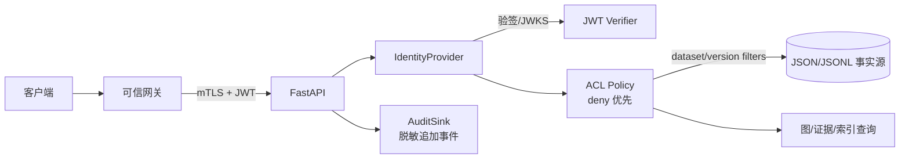

# M2 身份来源与 ACL/审计决策提案

```yaml
documentType: security-decision-proposal
moduleId: knowledge-graph-governance
relatedTasks: [RG-20, RG-23, RG-25]
decisionGate: G2-03
status: pending-human-confirmation
```

## 1. 事实基线与问题定义

### 1.1 已核验事实

- `apps/pingcode-api/app/main.py` 的 `upload_token()` 当前无论请求头内容都返回空字符串。
- `UploadService.authorize()` 当前直接返回 `local`，`Settings.upload_token` 虽从 `MATERIAL_UPLOAD_TOKEN` 读取，但没有参与校验。
- 图版本、图节点/边、证据、检索和数据集路由目前没有统一身份解析或 ACL 依赖；例如 `/api/datasets/{datasetId}/graph/*` 和 `/api/graph/versions/*` 直接调用服务。
- 仓库没有可复用的平台 JWT、会话或 RBAC introspection 中间件；依赖清单也没有可确认的 JWT 验证组件。
- 现有 ACL 契约已经冻结：默认拒绝，dataset 权限向 source/chunk/evidence/graph/index 继承，子资源只能收紧，默认禁止跨数据集；过滤必须发生在图遍历、向量召回、证据拼装和导出之前。

### 1.2 风险与用户影响

在缺少可信主体时继续接入 RG-20，会把客户端自报的用户或数据集当成事实，导致直接 ID、历史版本或跨数据集查询泄露资源存在性和证据正文。把 `MATERIAL_UPLOAD_TOKEN` 复用为图谱 ACL 也无法表达主体、租户、角色、过期、撤销和审计责任，属于安全边界扩大，禁止作为正式方案。

## 2. 目标、非目标与安全不变量

### 2.1 本阶段目标

1. 统一解析认证主体 `Principal`，覆盖发布、图、证据、索引、检索和导出入口。
2. 身份解析失败、策略服务不可用、无授权或作用域不合法时 fail-closed。
3. 在任何事实源读取、图遍历或召回前施加 dataset/version ACL 过滤；拒绝响应不得确认资源是否存在。
4. 对允许和拒绝事件写入脱敏、追加式审计，能够按 `requestId` 回溯，不记录 token、原文或完整查询。

### 2.2 非目标

- 本提案不引入图数据库、向量数据库或新的外部模型 Provider。
- 本提案不改变旧上传接口的业务语义，也不把上传会话 token 迁移成用户身份。
- 首版不开放匿名共享链接、跨租户查询或“管理员绕过”参数。

### 2.3 必须保持的不变量

```text
客户端字段不构成身份；服务端只信任经过验证的 Principal。
ACL 先于读取；底层存储不支持服务端过滤时拒绝请求，不全量读取后补过滤。
deny 优先；子资源 ACL 只能收紧父级权限。
P0 发布门禁不能由 ACL 失败或 force 参数绕过。
审计失败不把拒绝变成允许；拒绝事件本身不得泄露资源存在性。
```

## 3. 候选方案对比

| 方案 | 身份凭证与验证 | 安全性 | 性能 | 运维与失败模式 | 迁移/测试成本 | 结论 |
|---|---|---|---|---|---|---|
| A. 可信网关 JWT（推荐） | 网关完成登录和基础风控；通过 mTLS/受限网络转发签名 JWT；应用使用固定 issuer/audience 和 JWKS 本地验签，得到 `sub/tenant/roles/datasets/exp/jti` | 签名、过期、issuer、audience、nonce/jti 和网关信任边界可验证；客户端不能伪造 header；撤销以短 TTL、JWKS 轮换和必要 introspection 补足 | 验签为本地 CPU 操作；JWKS 只在轮换/缓存失效时拉取；每请求一次 ACL 计算，可按 policyVersion 短缓存 | 网关或 JWKS 不可用：已有有效 JWKS 可继续验签，未知 key 或过期 token 拒绝；需监控时钟偏差、密钥轮换和 mTLS | 需确认网关 claims 规范、密钥发布、TLS 和受信网络；需采用受维护 JWT 库或平台验证器；可先 shadow mode，回滚为全量拒绝 | 满足多实例、低延迟和可审计要求，作为首选 |
| B. 可信网关签名头（备选） | 网关通过 mTLS 传递 `X-Principal-*`；应用用共享密钥/HMAC 或网关公钥校验 canonical headers、时间戳、nonce、requestId | 依赖网络隔离和密钥管理；header 重放、规范化差异、代理篡改风险高于标准 JWT；必须拒绝客户端直连和未签名字段 | HMAC/签名验证快，但每请求 nonce 去重和时间窗校验需要共享存储；多语言代理容易出现 canonicalization 不一致 | 网关改 header 或密钥轮换会造成大面积拒绝；排障依赖链路日志；签名验证器需自行维护 | 无 JWT 依赖但需定义协议、密钥轮换、重放缓存和代理测试；迁移可控但长期维护成本高 | 仅在平台明确不提供 JWT、且 mTLS/密钥设施成熟时使用 |
| C. 平台 RBAC introspection（备选） | 应用把 bearer token 的 opaque reference 发送到平台 RBAC/会话服务，获取主体、租户、dataset/resource 权限和撤销状态 | 即时撤销和集中策略最强；应用不接触签名细节；安全依赖 introspection TLS、服务身份和响应完整性 | 每个请求有网络 RTT 和依赖服务负载；需短 TTL 结果缓存、请求合并和熔断；缓存过期期间策略变更传播有延迟 | introspection 超时/错误必须拒绝；平台升级或限流会直接影响读写；需要明确服务账号最小权限 | 需平台提供稳定 API、SLA 和测试租户；接线比 JWT 重，回滚可通过关闭策略开关进入拒绝模式 | 当平台 RBAC 已是唯一权威且能提供 SLA 时优先于自建 token ACL |

**明确排除：本地 token ACL。** 单个静态 token 只能证明“持有一个秘密”，不能可靠表达用户、租户、角色、数据集继承、撤销和责任审计；共享 token 还会把越权范围扩大到所有持有者。`MATERIAL_UPLOAD_TOKEN` 只能继续作为上传通道的独立凭证，不能用于 RG-20/23。

## 4. 推荐方案与适用前提

### 4.1 推荐

推荐 **方案 A：可信网关 JWT + 应用本地验签 + dataset ACL Policy**，并保留一个可替换的 `IdentityProvider` 接口，使未来已有平台 RBAC introspection 可以替换解析实现，而不改业务路由。

推荐的最小 claims：

```json
{
  "iss": "https://<trusted-issuer>",
  "aud": "yashandb-knowledge-api",
  "sub": "user-opaque-id",
  "tenant": "tenant-opaque-id",
  "roles": ["reader"],
  "datasets": ["dataset-a"],
  "iat": 1787000000,
  "exp": 1787000300,
  "jti": "token-opaque-id"
}
```

应用必须校验：签名算法白名单、issuer、audience、`exp`/允许的时钟偏差、`sub`/`tenant` 非空、dataset scope 格式和必要时的 `jti` 重放策略。JWT 中的 `datasets` 不是最终授权结果，而是 ACL Policy 的输入；发布、删除等动作仍需角色和资源策略判断。

### 4.2 适用前提

- 网关是唯一外部入口，应用端口不允许客户端直连；应用与网关之间使用 mTLS 或等效网络身份。
- 网关可提供稳定 issuer/audience、JWKS URI、公钥轮换通知和 claims 规范。
- 令牌 TTL 建议 5 分钟以内，密钥轮换和时钟同步可监控。
- dataset ACL 的权威配置可由平台配置/数据库提供；JWT 只携带请求范围或粗粒度角色。

若上述前提不成立，应暂停代码接线，改评方案 C；不允许退化为本地 token ACL。

## 5. 目标架构与接口草案



```text
IdentityProvider.resolve(request_headers) -> Principal | IdentityError
AclPolicy.authorize(principal, dataset_id, version_id?, resource_id?, action) -> Decision
AclPolicy.filters(principal, dataset_ids, version_ids?) -> Scope | Denial
AuditSink.append(event: SecurityEvent) -> None
```

统一的 `Principal` 至少包含：`subjectRef`（不可逆/脱敏引用）、`tenantRef`、`roles`、`datasetScopes`、`authnMethod`、`tokenIssuedAt`、`tokenExpiresAt`、`policyVersion`。业务层禁止接收原始 token。

## 6. 请求与拒绝伪代码

```text
authorized_read(request, headers):
  principal = identity_provider.resolve(headers)
  if principal is invalid:
    audit.denied(request, "ACL_UNAUTHENTICATED")
    return indistinguishable_401_or_403()

  decision = acl.authorize(principal, request.datasetId,
                           request.versionId, request.resourceId, request.action)
  if not decision.allowed:
    audit.denied(request, decision.reasonCode)
    return indistinguishable_403()  # 不说明 dataset/resource 是否存在

  scope = acl.filters(principal, request.datasetId, request.versionId)
  return repository.read_with_scope(scope, request)
```

```text
publish(request, headers):
  principal = identity_provider.resolve(headers)
  require acl.authorize(principal, request.datasetId, null, null, "publish")
  require publish_gate.evaluate(request, principal).p0_passed
  return state_store.compare_and_set(request.expectedStatusVersion)
```

策略服务、JWKS（未知 key）或事实源不可用时，读、发布、删除均返回结构化 `ACL_POLICY_UNAVAILABLE` 或 `ACL_UNAUTHENTICATED`，不返回原文、标题、计数或“是否存在”。查询结果也必须在召回源头过滤；应用层二次过滤只作为一致性断言，不能作为唯一防线。

## 7. 审计与隐私设计

审计事件采用追加式 JSONL 或平台审计流，最小字段如下：

```json
{
  "eventId": "evt-opaque-id",
  "occurredAt": "2026-08-18T00:00:00Z",
  "requestId": "req-opaque-id",
  "action": "graph.read",
  "decision": "deny",
  "reasonCode": "ACL_CROSS_DATASET",
  "principalRef": "hmac-sha256:user-opaque-id",
  "tenantRef": "hmac-sha256:tenant-opaque-id",
  "datasetId": "dataset-a",
  "versionId": "version-opaque-id",
  "policyVersion": "acl-v1",
  "resultCount": 0
}
```

禁止记录 Authorization、JWT、cookie、原文、完整查询、证据正文和未脱敏 IP。审计写入失败不能把拒绝改成允许；对已允许的低风险读取可按确认的可靠性策略异步写入，但发布、删除、ACL 拒绝必须同步确认已入队。默认保留期建议 180 天并配置化，最终以合规要求为准。

## 8. 失败模式、性能和运维要求

| 失败/压力场景 | 必须行为 | 监控与处置 |
|---|---|---|
| JWT 缺失、签名/issuer/audience/过期失败 | fail-closed；统一拒绝，不泄露资源存在性 | 统计按 reasonCode 聚合，不记录 token |
| JWKS 暂时不可用 | 已缓存且未过期的 key 可验签；未知 key 拒绝；超时不降级 | key 缓存年龄、轮换失败、时钟偏差告警 |
| ACL Policy 超时/不可用 | 读写均拒绝，返回 `ACL_POLICY_UNAVAILABLE` | 超时率、熔断、恢复探针；禁止 fail-open |
| ACL 变更与缓存并发 | policyVersion 进入缓存键；撤销时主动失效或 TTL 不超过 30 秒 | 记录授权决策版本，抽样回放 |
| 网关绕过/直连应用 | 网络层拒绝；应用拒绝缺少网关证明的请求 | mTLS 失败、来源网段异常告警 |
| 大量查询 | 在 source/graph/vector 层带 dataset/version filter；限制跨集请求大小 | P95 鉴权延迟预算建议 <10ms（JWT 本地验签）和 <50ms（ACL 命中缓存），以压测校准 |

## 9. 迁移与回滚

1. **准备期**：确认网关、issuer、audience、JWKS、mTLS、claims 和 ACL 权威源；新增 `IdentityProvider`/`AclPolicy` 接口与拒绝模式测试，不接生产路由。
2. **影子期**：对图、证据、索引和检索入口解析 JWT 并计算 ACL，但不改变响应；记录允许/拒绝差异，修正数据集 scope。
3. **强制期**：所有敏感入口默认拒绝；允许列表只来自 ACL Policy。旧客户端没有可信 JWT 时必须得到结构化未认证错误，而不是继续匿名访问。
4. **回滚**：只允许回滚到“全部拒绝/只读关闭”的安全状态，不允许恢复匿名读；上传接口仍独立使用其现有会话凭证。
5. **历史数据**：历史 dataset/version 不补造主体或权限；首次访问重新鉴权。审计从切换时开始，不能声称覆盖迁移前操作。

## 10. 验收与测试矩阵

| 类别 | Given/When | 预期证据 |
|---|---|---|
| JWT 合法 | 有效签名、issuer、audience、scope | 允许读取授权 dataset；响应带 requestId；审计 decision=allow |
| JWT 非法 | 缺失、过期、错误签名、错误 audience | 401/403 `ACL_UNAUTHENTICATED`；不泄露资源存在性 |
| 直接 ID | 无 dataset 权限但知道 node/evidence/resource ID | 拒绝且响应体不含标题、路径、正文 |
| 继承与收紧 | dataset allow、子资源 deny | 子资源拒绝；deny 优先；审计带 reasonCode |
| 跨数据集 | token 仅有 A，查询 A+B | 默认拒绝 `ACL_CROSS_DATASET`，不返回 B 的计数或内容 |
| 历史/撤销 | 旧 version 或权限撤销后重放请求 | 重新执行 ACL 后拒绝；旧缓存不绕过 |
| 依赖故障 | JWKS/ACL 超时或错误 | fail-closed `ACL_POLICY_UNAVAILABLE`；无原文返回 |
| 审计 | 允许、拒绝、发布、删除各一次 | JSONL/审计流字段完整；token/原文/IP 脱敏 |
| 绕过 | 直连应用、伪造 `X-Principal-*` | 网络或应用拒绝；伪造 header 不改变主体 |
| 性能 | S/M/L 查询并发压测 | 鉴权 P95、错误率、缓存命中率符合批准预算；无全量读取 |

RG-23 必须使用隔离测试租户和至少两个 dataset，不能对现有生产批次写入。真实后端 API 测试需验证图、证据、版本、索引和发布入口，而非只测试 `AclPolicy` 纯函数。

## 11. 必须人类确认的最小问题

在以下问题得到明确答复前，不应接入 RG-20 或把 RG-23 标记完成：

1. **身份源**：是否能提供可信网关 JWT（issuer、audience、JWKS、mTLS/网络边界、TTL）；若不能，是否已有可用的 RBAC introspection API 及 SLA？
2. **权限粒度**：是否确认 dataset 为首版授权主键，resource 只允许进一步收紧，allow/deny 冲突采用 deny 优先，默认禁止跨数据集？
3. **审计策略**：审计写入 JSONL 还是平台审计流；保留期是否接受默认 180 天；谁可查询；`principalRef/tenantRef/sourceIp` 的 HMAC/截断脱敏标准是什么？
4. **网关部署**：应用是否可以被网络策略限制为仅接受网关流量？若不能，必须补充等效请求签名/服务身份方案。

若第 1 项选择 RBAC introspection，本文档的 ACL Policy、审计和测试矩阵仍适用，仅替换 `IdentityProvider` 的验证步骤；若两者都无法提供，安全结论是维持阻塞，而不是启用本地 token ACL。
