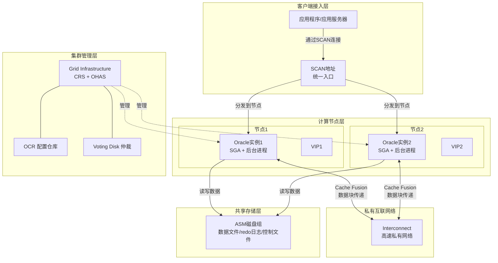
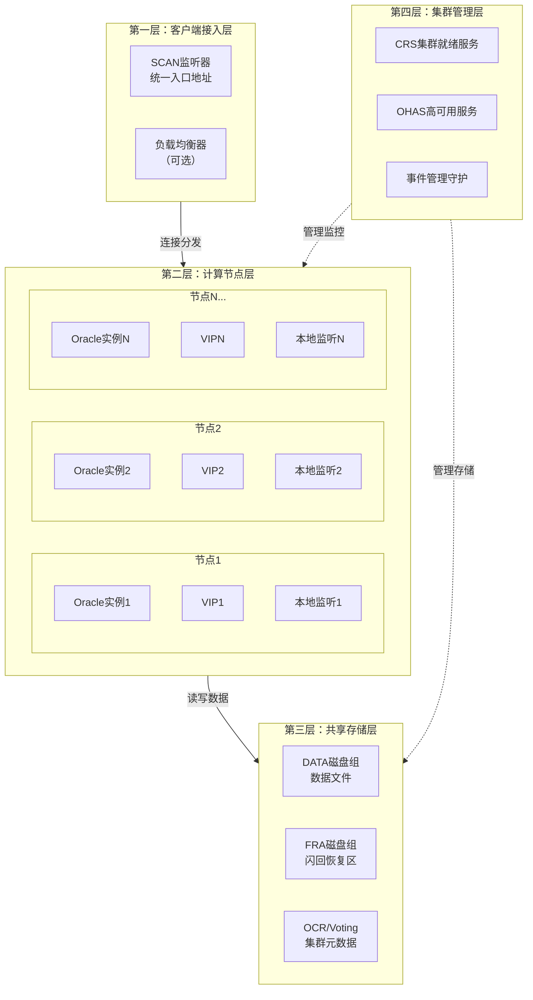
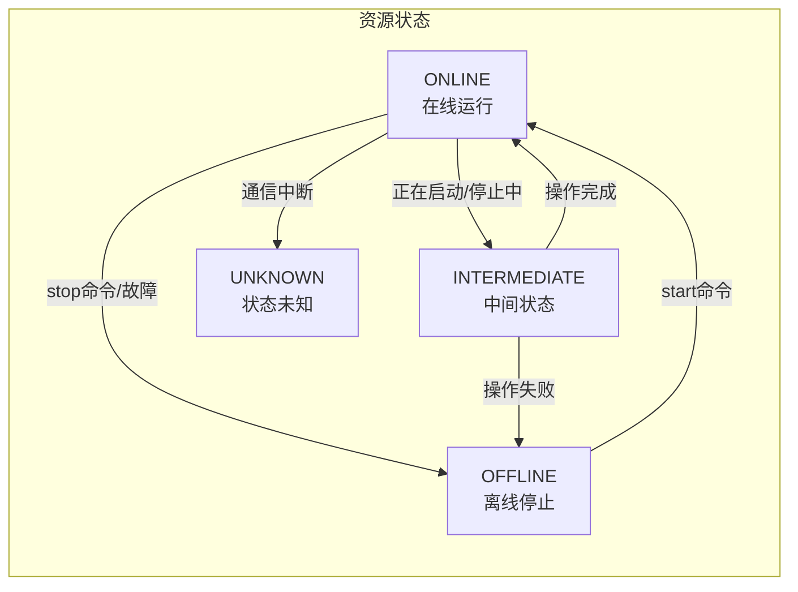
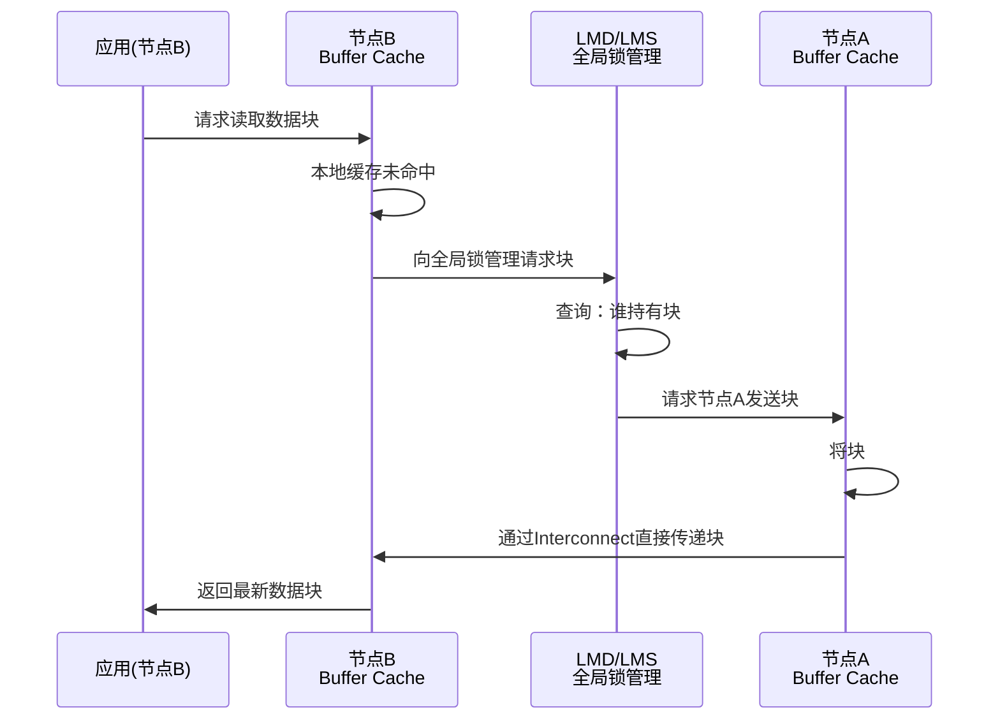
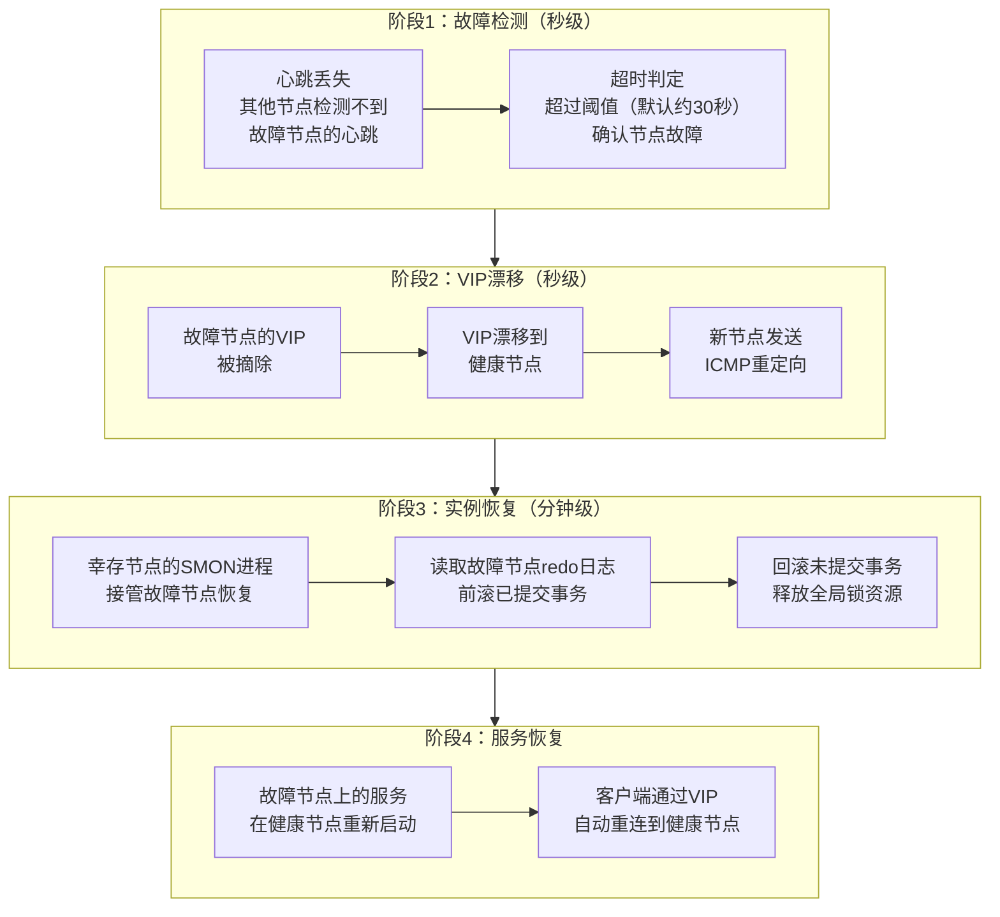
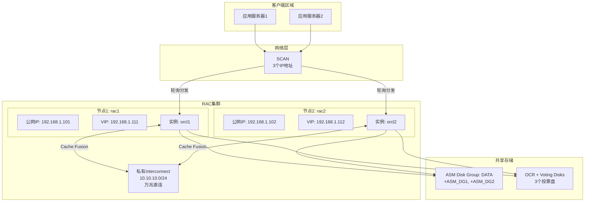

# Oracle集群基础概念与架构

> **适用读者**：初次接触Oracle集群的DBA、开发人员、运维工程师、技术管理者
>
> **学习目标**：理解集群是什么、解决什么问题、基本架构和运作逻辑
>
> **前置知识**：Oracle单实例数据库基础（了解数据库实例、表空间、数据文件等基本概念即可）

---

## 一、概述

### 1.1 一句话定义

Oracle RAC（Real Application Clusters，真实应用集群），本质上是**多个Oracle数据库实例同时共享同一份数据存储的集群架构**。

它在**单机性能无法满足业务需求**或**需要数据库高可用性**的场景下使用，解决**计算资源瓶颈**和**单点故障**两大核心问题。

### 1.2 为什么重要

- **不掌握的后果**：
  - 无法设计高可用数据库架构，业务面临单点故障导致停机的风险
  - 无法水平扩展数据库计算能力，只能依赖购买更昂贵的服务器（垂直扩展）
  - 遇到集群相关问题时无法理解和分析，只能依赖厂商支持

- **掌握的价值**：
  - 能够设计和维护高可用、可弹性扩展的数据库架构
  - 理解集群性能调优的核心思路（Cache Fusion、Interconnect等）
  - 具备处理集群故障的分析和诊断能力
  - 为后续深入学习集群内核、性能调优打下坚实基础

### 1.3 适用场景

| 场景 | 说明 |
|------|------|
| **高可用需求** | 金融、电信等7×24小时业务，任何单节点故障不影响业务连续性 |
| **性能扩展** | 单机CPU/内存无法满足并发需求，通过增加节点水平扩展计算能力 |
| **负载均衡** | 将应用连接分散到多个节点，避免单一节点过载 |
| **滚动维护** | 可以逐节点进行硬件/软件维护，整体服务不中断 |
| **灾备切换** | 结合Data Guard实现跨站点的灾难恢复 |

### 1.4 版本演进

| 版本 | 变化说明 |
|------|---------|
| 11gR2 | 引入SCAN（Single Client Access Name），简化客户端连接配置；Grid Infrastructure统一管理集群件 |
| 12cR1 | 引入Flex Cluster（灵活集群），支持Hub-Leaf拓扑；服务自动化管理增强 |
| 12cR2 | 引入Flex ASM，ASM实例不必每个节点都运行；AFD（ASM Filter Driver）增强存储安全 |
| 19c | 当前主流长期支持版本，集群管理稳定性和性能持续优化；推荐部署版本 |
| 21c | 创新版本，进一步增强应用连续性和自动化管理能力 |

---

## 二、术语与概念

### 2.1 核心术语表

| 术语 | 英文全称 | 含义 | 通俗类比 |
|------|---------|------|---------|
| **RAC** | Real Application Clusters | Oracle的真实应用集群产品 | 银行开设多个柜台窗口服务同一批客户 |
| **实例（Instance）** | Instance | 一组内存结构+后台进程的集合 | 一个柜台窗口（含柜员和工作台） |
| **节点（Node）** | Node | 集群中的一台服务器 | 一个柜台所在的工位 |
| **集群（Cluster）** | Cluster | 多台服务器协同工作的整体 | 整个银行大厅的所有柜台 |
| **Cache Fusion** | 缓存融合 | 节点间通过高速网络直接传递数据块 | 柜台间直接传递文件，而非都跑回金库取 |
| **Interconnect** | 内部互联网络 | 节点间的高速私有网络 | 柜台间的内部传送通道 |
| **VIP** | Virtual IP | 虚拟IP地址，绑定在节点上可漂移 | 柜台的叫号屏编号，窗口换了号还在 |
| **SCAN** | Single Client Access Name | 单一客户端访问名，提供统一入口 | 银行统一客服热线，自动转接到空闲柜台 |
| **OCR** | Oracle Cluster Registry | 集群配置注册表 | 银行的组织架构和人员花名册 |
| **Voting Disk** | 仲裁磁盘 | 用于节点成员资格判定的共享磁盘 | 投票箱，决定谁还能留在团队中 |
| **GI** | Grid Infrastructure | 集群基础设施软件 | 银行的大楼物业管理系统 |

### 2.2 关键角色/组件



**组件说明**：

- **客户端接入层**：应用程序通过SCAN地址或VIP连接到集群，无需关心具体哪个节点可用
- **计算节点层**：每个节点运行独立的Oracle实例（内存+进程），共同访问同一份数据
- **私有互联网络**：节点间的高速网络，用于Cache Fusion数据块传递和心跳检测
- **共享存储层**：所有节点通过ASM访问同一份数据文件，保证数据一致性
- **集群管理层**：Grid Infrastructure负责监控节点状态、管理资源、执行故障转移

---

## 三、为什么需要集群

### 3.1 单机数据库的三大瓶颈

在理解集群之前，先看看单机数据库面临的根本挑战：

**瓶颈一：计算与内存资源上限**

一台服务器的CPU核心数、内存容量存在物理上限。当业务并发量增长到单机无法承载时，只能购买更高端的服务器——但高端服务器的价格呈指数级增长，且终究存在天花板。

> **类比**：就像一个餐厅只有一个厨师，客人越来越多，厨师再快也忙不过来。买更快的灶台（垂直扩展）有极限，不如多请几个厨师（水平扩展）。

**瓶颈二：单点故障**

一台服务器一旦宕机（硬件故障、操作系统崩溃、计划内维护），所有业务立即中断。对于金融交易、在线支付等关键业务，即使是分钟级的停机也可能造成巨大损失。

> **类比**：就像只有一条高速公路的收费站，一旦这个收费站关闭，所有车辆都无法通行。

**瓶颈三：无法弹性扩展**

业务有波峰波谷（如电商大促、年终结算），单机架构无法根据负载动态增减资源，要么平时资源浪费，要么高峰期不够用。

### 3.2 单实例 vs RAC 对比

| 对比维度 | 单实例 | Oracle RAC |
|---------|--------|-----------|
| **计算能力** | 受限于单台服务器 | 多节点线性扩展 |
| **可用性** | 节点故障=业务中断 | 节点故障自动切换，业务连续 |
| **扩展方式** | 垂直扩展（更贵的硬件） | 水平扩展（增加节点） |
| **维护窗口** | 维护时业务中断 | 滚动维护，业务不中断 |
| **复杂度** | 简单 | 较高（需要理解集群机制） |
| **成本** | 硬件成本低，停机成本高 | 硬件+软件许可成本高，停机成本低 |
| **适用场景** | 开发测试、非关键业务 | 生产核心系统、高可用要求场景 |

### 3.3 集群的通俗解释：银行柜台模型

理解Oracle RAC最好的类比就是**银行柜台模型**：

> 想象一家银行（数据库），它有一个大金库（共享存储），里面存放着所有客户的账本（数据文件）。
>
> **单实例**就像只有一个柜台窗口：所有客户排一条队，一个柜员（实例）逐一服务。柜员忙不过来时，客户等待时间变长；柜员生病请假时，银行暂停营业。
>
> **RAC集群**就像开了多个柜台窗口：多个柜员（多个实例）同时服务客户，共享同一个金库（共享存储）。某个柜员暂时离开时，客户可以转到其他窗口继续办理。
>
> 但问题来了——如果两个柜员同时要修改同一个客户的账本怎么办？这就是集群需要解决的核心问题：**多节点并发访问的数据一致性**。Oracle通过**Cache Fusion（缓存融合）** 机制优雅地解决了这个问题。

---

## 四、Oracle RAC 四层架构

Oracle RAC的整体架构可以划分为四个层次，自顶向下分别是：

### 4.1 架构总览



### 4.2 第一层：客户端接入层

客户端接入层负责将应用程序的连接请求分发到可用的数据库节点。

**SCAN（Single Client Access Name）**

从Oracle 11gR2开始引入，提供一个统一的域名（如 `scan-oracle.example.com`），解析到多个IP地址（通常3个），客户端只需配置这一个地址即可访问整个集群。

> **类比**：就像拨打银行统一客服热线 `95588`，系统自动将你转接到空闲的客服代表，你不需要知道具体是哪个分机号。

**VIP（Virtual IP）**

每个节点绑定一个虚拟IP地址。当节点故障时，VIP会自动"漂移"到另一个健康节点，客户端通过VIP连接时可以快速感知故障并重连。

> **类比**：就像柜台的窗口编号牌。如果3号柜台的柜员暂时离开，窗口编号牌会被移到其他可用柜台，客户拿着3号的排队票仍然能找到服务窗口。

### 4.3 第二层：计算节点层

每个节点是一台独立的服务器，运行自己的Oracle数据库实例。

**Oracle实例的组成**：

- **SGA（System Global Area）**：共享内存区域，包含数据库缓冲区缓存（Buffer Cache）、共享池（Shared Pool）、日志缓冲区等
- **后台进程**：DBWn（写数据块）、LGWR（写redo日志）、SMON（系统监控）、PMON（进程监控）等
- **RAC专属进程**：LMS（全局缓存服务）、LMD（全局锁管理）、LMON（全局锁监控）——这些是实现多节点协同的关键

> **关键点**：每个实例有自己的SGA和后台进程，但所有实例读写的是同一份数据文件（在共享存储上）。这就是"多实例单数据库"的核心含义。

### 4.4 第三层：共享存储层

所有节点必须能够访问同一份数据，这通过共享存储实现。

**为什么需要共享存储？**

如果每个节点有自己的本地数据副本，就会面临数据同步的噩梦——多个节点同时修改同一条记录，如何保证最终一致？共享存储从根本上避免了这个问题：**只有一份数据，所有节点直接读写同一份**。

**Oracle ASM（Automatic Storage Management）**

Oracle推荐的存储管理方案，自动完成条带化和镜像，简化磁盘管理：

- **磁盘组（Disk Group）**：将多块物理磁盘组合成一个逻辑存储池
- **条带化（Striping）**：数据自动分散到多块磁盘，提升I/O性能
- **镜像（Mirroring）**：数据自动复制到不同磁盘，防止磁盘故障

### 4.5 第四层：集群管理层

**Grid Infrastructure（GI）** 是Oracle集群的基础设施软件，包含：

- **CRS（Cluster Ready Services）**：集群就绪服务，管理集群资源（数据库、监听、VIP等）的启动、停止和故障转移
- **OHAS（Oracle High Availability Services）**：节点级高可用服务，管理本节点的进程
- **CSS（Cluster Synchronization Services）**：集群同步服务，管理节点成员资格、心跳检测、仲裁判定

> **类比**：如果把集群比作一家银行，Grid Infrastructure就是银行的物业管理系统——它监控每个柜台的状态，决定哪个柜台开门营业，某个柜员出问题时安排替换，并维护整个大楼的安保系统。

---

## 五、集群的基本运作逻辑

### 5.1 资源状态模型

集群管理的每个资源（数据库、实例、监听、VIP等）都有明确的状态：



**状态说明**：

- **ONLINE**：资源正常运行。数据库实例正在服务用户连接
- **OFFLINE**：资源已停止。可能是手动关闭或故障后未恢复
- **INTERMEDIATE**：资源正在启动或停止的过渡状态。如果长时间停留在此状态，说明操作可能卡住
- **UNKNOWN**：集群无法与资源通信。可能是节点网络问题或代理进程异常

### 5.2 多节点读写：Cache Fusion 直观理解

**核心问题**：当节点A修改了一个数据块，节点B也需要读取这个数据块时，如何保证B读到的是最新版本？

**传统方式（磁盘中介）**：节点A将修改写回磁盘 → 节点B从磁盘读取最新数据。这种方式慢，因为磁盘I/O是瓶颈。

**Cache Fusion方式（内存直传）**：节点A通过高速私有网络（Interconnect），直接将内存中的数据块传给节点B。完全绕过了磁盘，速度提升数十倍。

> **类比**：两个柜员都需要查看同一份客户资料。传统方式是柜员A把资料放回金库，柜员B再去金库取。Cache Fusion则是柜员A直接通过对讲机告诉柜员B："资料我已经改好了，最新内容是……"——省去了跑金库的时间。

**Cache Fusion 基本流程**：



**关键点**：

- Cache Fusion是Oracle RAC性能的基石
- 依赖高质量的低延迟私有网络（通常要求 < 1ms延迟）
- 是集群特有等待事件（`gc buffer busy`、`gc cr block`等）的根源——后续文档会详细讲解

### 5.3 节点故障时的自动响应

当一个节点突然宕机，集群会自动执行一系列恢复动作：



**各阶段详解**：

- **故障检测**：通过Interconnect网络心跳和磁盘心跳双重机制检测节点存活。默认约30秒超时判定
- **VIP漂移**：故障节点的VIP自动迁移到健康节点。新节点发送ICMP重定向报文，通知客户端更新ARP缓存，实现快速重连
- **实例恢复**：幸存节点的SMON进程读取故障节点的redo日志，执行前滚（重做已提交但未写入数据文件的操作）和回滚（撤销未提交的事务），保证数据一致性
- **服务恢复**：原故障节点上运行的服务（如数据库实例、应用服务）在健康节点重新启动

> **提示**：整个故障检测和VIP漂移过程通常在秒级完成，但实例恢复的时间取决于故障节点redo日志的量，可能需要数十秒到数分钟。在此期间，连接到故障节点的事务会中断，需要应用层重连。

---

## 六、实战案例

### 6.1 案例背景

- **场景**：某电商平台Oracle 19c RAC环境（2节点），日常QPS约5000
- **时间**：2026年"618"大促期间
- **现象**：节点2因网卡驱动Bug突然宕机，应用出现约30秒的超时错误

### 6.2 诊断过程

**步骤1：确认集群状态**

```bash
$ crsctl stat res -t
```

- → 发现：节点2上的 `ora.orcl.db2` 实例状态为 OFFLINE，VIP2 已漂移到节点1
- → 判断：集群已正确检测到节点2故障并完成VIP漂移

**步骤2：检查故障转移时间线**

```bash
$ tail -100 /u01/app/grid/diag/crs/node1/trace/crsd.trc | grep -i "node2"
```

- → 发现：
  - 14:32:05 — 心跳丢失告警
  - 14:32:35 — 确认节点2宕机，开始驱逐
  - 14:32:38 — VIP2漂移完成
  - 14:33:45 — 实例恢复完成
- → 判断：故障检测30秒，VIP漂移3秒，实例恢复约70秒

**步骤3：应用侧确认**

- → 根因定位：应用连接池配置了VIP重试，30秒后自动重连到节点1
- → 解决方案：
  1. 短期：更新节点2网卡驱动，重启节点
  2. 长期：配置Application Continuity（应用连续性），实现事务级自动重放

### 6.3 解决结果

| 指标 | 值 |
|------|-----|
| 故障检测时间 | 30秒 |
| VIP漂移时间 | 3秒 |
| 实例恢复时间 | 约70秒 |
| 应用不可用窗口 | 约30秒（连接超时） |
| 数据一致性 | 完全一致，无数据丢失 |

### 6.4 复盘总结

- **根因**：节点2网卡驱动Bug导致网络中断，触发集群节点驱逐
- **教训**：
  1. 集群的自动故障转移机制工作正常
  2. 应用连接池的超时配置应与集群故障检测时间匹配
  3. 对于关键业务，应考虑配置Application Continuity进一步缩短不可用窗口

---

## 七、常见错误与排查

### 7.1 常见错误列表

| 错误/现象 | 原因 | 解决方法 |
|---------|------|---------|
| 客户端无法通过SCAN连接 | SCAN监听未启动或DNS解析错误 | 检查SCAN状态 `srvctl status scan`，验证DNS解析 `nslookup scan-name` |
| 节点间Cache Fusion极慢 | Interconnect网络延迟高或带宽不足 | 检查网络延迟 `ping -s 8192`，确认使用私有网络而非公网 |
| VIP漂移后客户端不重连 | 客户端未配置连接超时或TAF | 配置 `CONNECT_TIMEOUT` 参数，启用TAF或Application Continuity |
| 实例恢复时间过长 | 故障节点有大量未检查点的redo | 增加检查点频率，优化 `FAST_START_MTTR_TARGET` 参数 |
| 集群资源长时间处于INTERMEDIATE | 资源启动/停止操作卡住 | 检查相关进程是否hang，必要时手动 `crsctl stop res -f` |

### 7.2 排查步骤

1. **确认集群整体状态**：`crsctl stat res -t` 查看所有资源状态
2. **检查节点成员资格**：`olsnodes -s` 确认哪些节点在线
3. **查看集群告警日志**：检查各节点的 `alert.log` 和 CRS 日志
4. **验证网络连通性**：确认Public网络和Private Interconnect均正常
5. **检查共享存储访问**：确认所有节点能正常访问ASM磁盘组

---

## 八、最佳实践

### 8.1 官方推荐

- **Interconnect网络**：使用独立的物理网络（至少万兆），不与业务网络共用，延迟应 < 1ms
- **SCAN配置**：SCAN应解析到3个IP地址，提供连接冗余
- **最少2个节点**：生产环境至少2节点，配合3个Voting Disk实现仲裁
- **使用ASM**：推荐使用ASM管理共享存储，简化管理并提升可靠性

### 8.2 社区经验

- **监控心跳网络**：部署独立的网络监控，对Interconnect延迟设置告警（> 1ms即需关注）
- **定期演练故障转移**：每季度进行一次节点故障模拟演练，验证自动恢复流程
- **连接池配置**：应用连接池的 `CONNECT_TIMEOUT` 建议设为 10-15秒，`RETRY_COUNT` 设为 3-5次

### 8.3 反模式

| 反模式 | 问题 | 正确做法 |
|--------|------|---------|
| Interconnect走公网 | 延迟高、带宽不稳定，Cache Fusion性能差 | 使用独立私有网络，直连或通过专用交换机 |
| 单Voting Disk | 无法容忍任意组件故障（需要奇数个投票盘） | 配置3个或5个Voting Disk，分布在不同存储 |
| 不使用SCAN | 客户端硬编码节点IP，节点变更需修改应用 | 使用SCAN统一入口，应用无需感知节点变化 |
| 忽略实例恢复时间 | 故障后恢复慢，业务中断时间长 | 优化检查点频率，设置合理的 `FAST_START_MTTR_TARGET` |

---

## 九、总结速查

### 9.1 黄金法则

1. **RAC的本质**：多实例共享一份数据，通过Cache Fusion实现内存级数据协同
2. **高可用不是免费的**：集群解决了单点故障，但引入了网络延迟、锁竞争等新挑战
3. **四层架构缺一不可**：接入层、计算层、存储层、管理层，任何一层出问题都会影响整体
4. **故障转移≠零中断**：自动故障转移通常需要数十秒，关键业务需要额外配置应用连续性

### 9.2 一页纸检查清单

| 现象/场景 | 原因 | 处理方案 |
|-----------|------|----------|
| 客户端连不上集群 | SCAN/VIP配置问题或DNS故障 | 检查SCAN状态和DNS解析 |
| 单节点故障后业务中断30秒 | 正常的心跳检测超时时间 | 属于预期行为，可通过AC技术缩短 |
| 两节点间数据不一致 | 极罕见，通常是存储层问题 | 检查ASM磁盘组状态和存储链路 |
| 集群资源状态异常 | 资源依赖链中某个组件故障 | `crsctl stat res -t` 定位异常资源 |

### 9.3 关键数字

| 指标 | 正常范围 | 告警阈值 | 说明 |
|------|---------|---------|------|
| Interconnect延迟 | < 1ms | > 1ms | 直接影响Cache Fusion性能 |
| 心跳检测超时 | 默认约30秒 | — | 决定故障检测速度 |
| VIP漂移时间 | < 5秒 | > 10秒 | 影响客户端重连速度 |
| 实例恢复时间 | < 60秒 | > 5分钟 | 取决于redo量和检查点频率 |

---

## 附录

### A. 典型双节点RAC部署拓扑



**拓扑说明**：

- **公网IP**：节点管理用，DBA SSH登录维护
- **VIP**：客户端连接用，故障时自动漂移
- **SCAN**：统一入口，解析到3个IP，客户端只需配置一个地址
- **Interconnect**：私有万兆网络，专用于Cache Fusion和心跳
- **ASM**：共享存储，所有节点读写同一份数据

### B. 核心命令速查

| 命令 | 用途 | 示例 |
|------|------|------|
| `crsctl stat res -t` | 查看所有集群资源状态 | 日常巡检必用 |
| `srvctl status database -d orcl` | 查看数据库状态 | 确认各实例运行状态 |
| `olsnodes -s` | 查看节点成员状态 | 确认哪些节点在线 |
| `crsctl check cluster -all` | 检查集群健康状态 | 全面检查各节点CRS状态 |
| `srvctl config scan` | 查看SCAN配置 | 确认SCAN地址和IP |

### C. 官方参考

- [Oracle Grid Infrastructure Installation Guide](https://docs.oracle.com/en/database/oracle/oracle-database/19c/cwadd/)
- [Oracle Real Application Clusters Administration and Deployment Guide](https://docs.oracle.com/en/database/oracle/oracle-database/19c/racad/)
- [Oracle Database 2 Day + Real Application Clusters Guide](https://docs.oracle.com/en/database/oracle/oracle-database/19c/racad/)

### D. 修订记录

| 日期 | 版本 | 修改内容 | 修改人 |
|------|------|---------|--------|
| 2026-06-30 | v1.0 | 初始版本 | Oracle集群知识库 |

---

> **下一篇**：[集群核心组件与内部机制](02-集群核心组件与内部机制.md) — 深入Clusterware、ASM和Interconnect的内部工作原理
