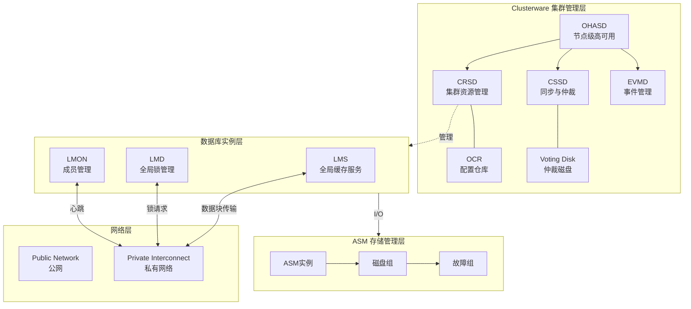
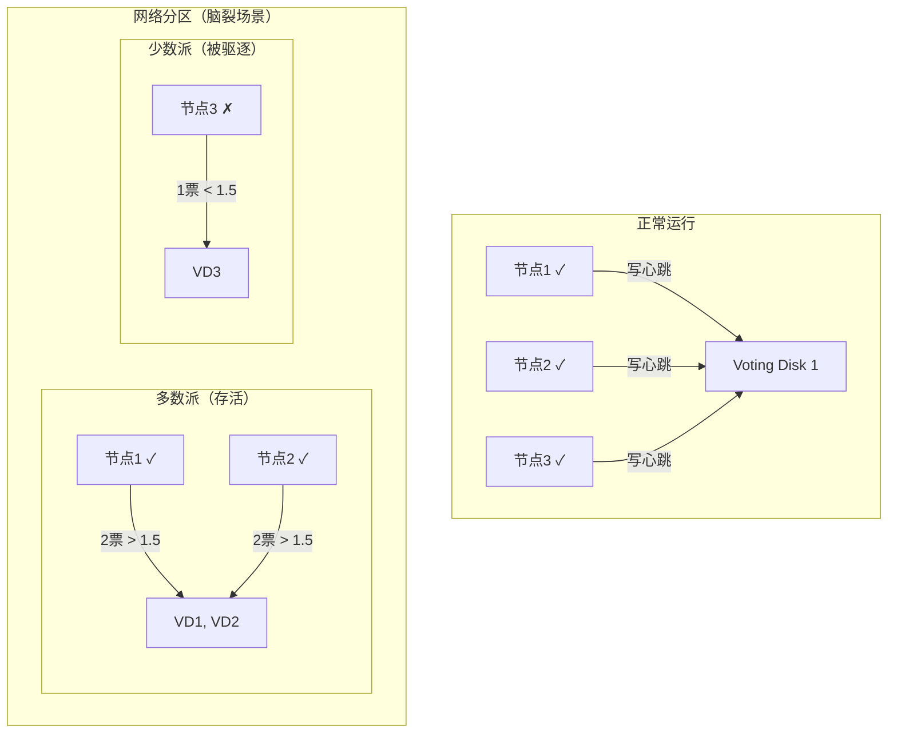
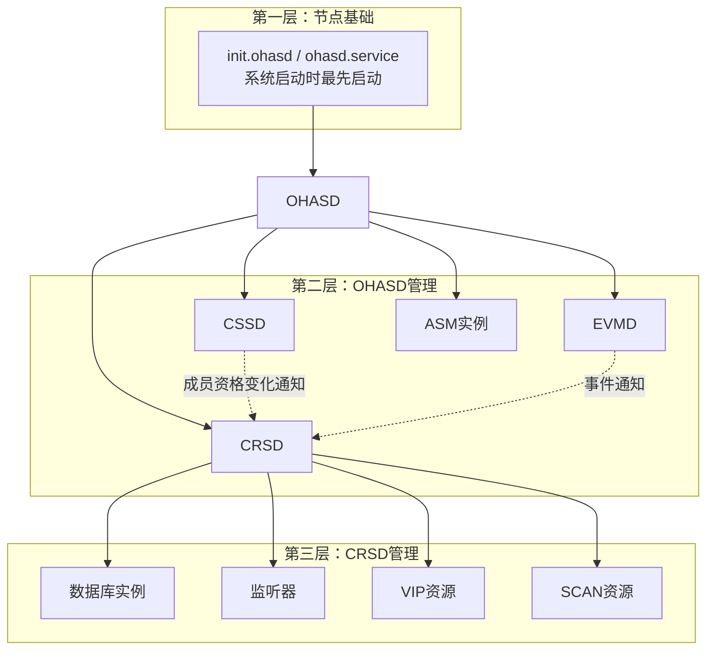
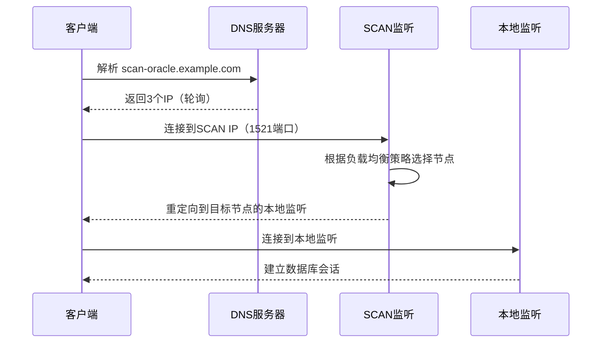
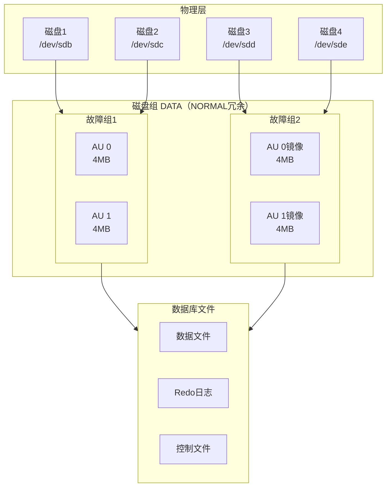
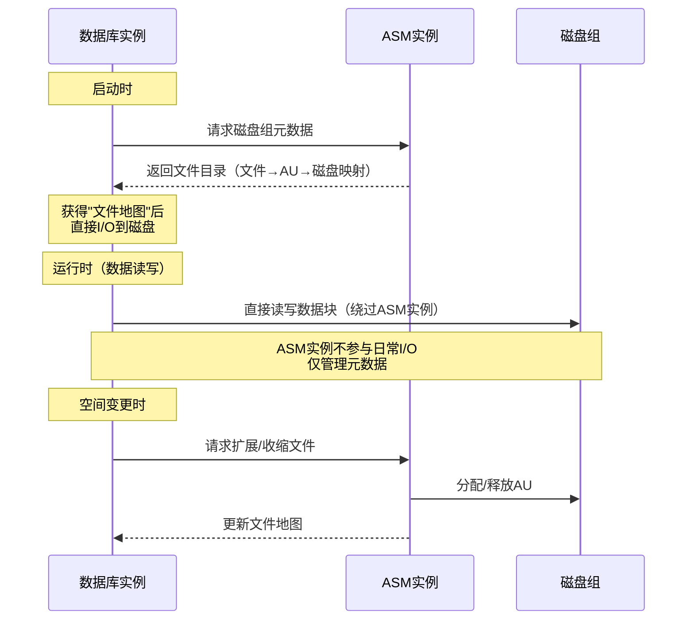
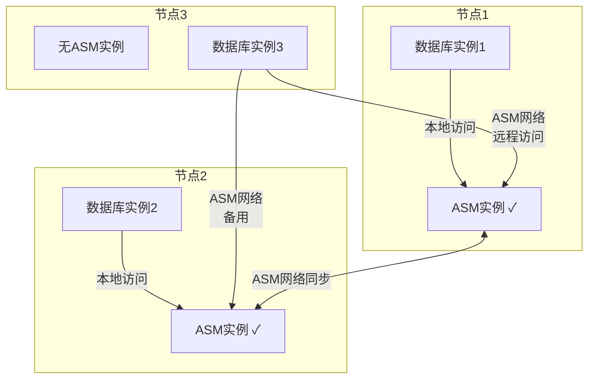
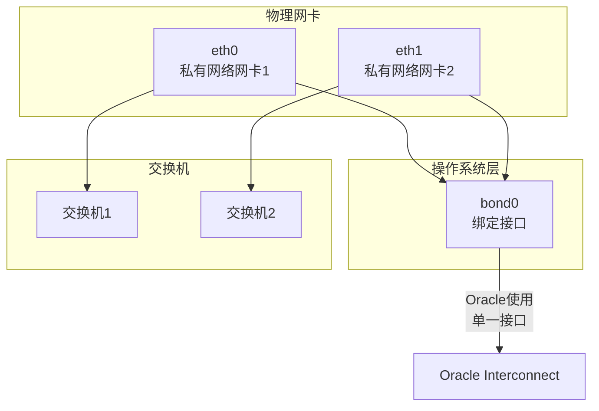

# 集群核心组件与内部机制

> **适用读者**：有一定RAC基础的DBA、系统架构师、高级运维工程师
>
> **学习目标**：深入理解集群管理软件（Clusterware）、共享存储（ASM）和网络通信（Interconnect）的内部工作原理
>
> **前置知识**：[Oracle集群基础概念与架构](01-Oracle集群基础概念与架构.md)

---

## 一、概述

### 1.1 一句话定义

Oracle集群的三大核心组件——**Clusterware集群管理软件**、**ASM自动存储管理**和**Private Interconnect私有互联网络**——分别承担"管理协调"、"数据承载"和"节点通信"职责，它们的内部机制决定了集群的可靠性、性能和可管理性。

### 1.2 为什么重要

- **不掌握的后果**：
  - 无法深入诊断集群故障（如节点驱逐、脑裂、存储异常）
  - 无法合理规划集群架构（如Voting Disk布局、网络冗余设计）
  - 无法优化集群性能（如Interconnect调优、ASM条带化策略）

- **掌握的价值**：
  - 具备集群架构设计和规划能力
  - 能够快速定位和解决组件层面的复杂问题
  - 能够进行性能调优和容量规划

### 1.3 适用场景

| 场景 | 说明 |
|------|------|
| **架构规划** | 设计集群组件布局，确定Voting Disk数量和网络拓扑 |
| **故障诊断** | 分析节点驱逐、脑裂、存储I/O异常等深层问题 |
| **性能优化** | 调优Cache Fusion性能、ASM I/O分布、网络带宽 |
| **容量规划** | 评估组件资源需求和扩展策略 |

---

## 二、术语与概念

### 2.1 核心术语表

| 术语 | 含义 | 类比 |
|------|------|------|
| **OCR** | Oracle Cluster Registry，集群配置仓库 | 公司的组织架构文档+通讯录 |
| **Voting Disk** | 仲裁磁盘，用于节点成员资格判定 | 投票器——谁还能留在团队里 |
| **CRS** | Cluster Ready Services，集群就绪服务 | 大楼物业管理处 |
| **CSSD** | Cluster Synchronization Services Daemon | 保安队长，负责点名和门禁 |
| **OHASD** | Oracle High Availability Services Daemon | 每栋楼的独立物业管理员 |
| **EVMD** | Event Manager Daemon | 广播系统，发布事件通知 |
| **ASM** | Automatic Storage Management | 智能文件柜管理系统 |
| **AU** | Allocation Unit，ASM分配单元（默认4MB） | 文件柜的最小格子 |
| **Failure Group** | 故障组，共享同一故障源的磁盘集合 | 同一排的文件柜（一排倒了全倒） |
| **Interconnect** | 节点间私有高速网络 | 柜台间的内部传送带 |
| **Cache Fusion** | 通过Interconnect在节点间直接传递数据块 | 柜台间直接递文件，不跑金库 |

### 2.2 组件关系总览



---

## 三、Clusterware 集群管理软件内部机制

### 3.1 集群注册表（OCR）

**是什么**：OCR是一个二进制文件，存储了整个集群的配置信息。

**存储内容**：

| 信息类型 | 具体内容 |
|---------|---------|
| 节点成员 | 哪些服务器是集群成员 |
| 资源定义 | 数据库、实例、监听、VIP、SCAN等资源的配置 |
| 资源依赖 | 资源之间的启动/停止依赖关系 |
| 权限信息 | 哪些用户/角色可以管理哪些资源 |
| 网络配置 | Public/Private网络定义 |

**存储位置与管理**：

- OCR默认存储在ASM磁盘组中（推荐），也可以存储在共享文件系统上
- 每个集群最多可以有2个OCR（主OCR + 镜像OCR）
- Oracle自动每4小时备份一次OCR，保留最近168小时（7天）的备份

```bash
# 查看OCR状态
$ ocrcheck

# 查看OCR备份列表
$ ocrconfig -showbackup

# 手动备份OCR
$ ocrconfig -manualbackup

# 恢复OCR（从自动备份）
$ ocrconfig -restore
```

> **提示**：OCR损坏是集群级灾难——所有集群配置丢失。务必确保OCR有镜像且定期验证备份可恢复。

### 3.2 仲裁与投票机制（Voting Disk）

**脑裂问题的本质**

当集群内部网络中断时，集群可能"分裂"成多个互相看不到的子集。每个子集都认为其他节点宕机了，试图接管全部资源——这就是**脑裂（Split-Brain）**。如果不加控制，多个子集同时写入共享存储会导致数据损坏。

**解决方案：仲裁机制**

Voting Disk是一个共享磁盘文件，所有节点都可以读写。它充当"裁判"：

- 每个节点定期向Voting Disk写入心跳（磁盘心跳）
- 当节点间网络中断时，通过Voting Disk判定谁应该继续运行
- **多数派原则**：能访问超过半数Voting Disk的子集存活，其余节点被驱逐



**Voting Disk数量规划**：

| Voting Disk数量 | 可容忍故障数 | 说明 |
|----------------|-------------|------|
| 1 | 0 | 不推荐，单点故障 |
| 3 | 1 | 推荐最小配置 |
| 5 | 2 | 高可用场景推荐 |
| 7 | 3 | 大规模集群 |

> **黄金法则**：Voting Disk数量必须为奇数，且应分布在不同的存储设备（故障组）上。

**仲裁设备存储方式**：

- **ASM（推荐）**：Voting Disk存放在ASM磁盘组中，自动条带化和镜像
- **共享文件系统**：如NFS、ACFS（ASM Cluster File System）
- **外部存储**：共享SAN存储的裸设备

```bash
# 查看Voting Disk配置
$ crsctl query css votedisk

##  STATE    | File Universal Id                | File Name | Disk group
--  -------- | -----------------                | --------- | ---------
 1. ONLINE   | 6a1c3e...(/dev/asm-vote1)        |           | OCR_VOTE
 2. ONLINE   | 8b2d4f...(/dev/asm-vote2)        |           | OCR_VOTE
 3. ONLINE   | 9c3e5a...(/dev/asm-vote3)        |           | OCR_VOTE
```

### 3.3 守护进程/服务框架

Clusterware采用分层的服务架构，从底到顶依次是：

**OHASD（Oracle High Availability Services Daemon）**

- 每个节点独立运行，是节点级的"管家"
- 负责启动和监控本节点的其他Clusterware进程
- 管理本节点的基础资源（如ASM实例、节点应用）

**CRSD（Cluster Ready Services Daemon）**

- 集群级的资源管理器，只在一个节点上处于"主"角色
- 管理所有集群资源（数据库、实例、VIP、SCAN等）的启动、停止、故障转移
- 读取OCR中的资源定义和依赖关系

**CSSD（Cluster Synchronization Services Daemon）**

- 集群的"安保队长"
- 管理节点成员资格（谁在集群中、谁被驱逐）
- 维护网络心跳和磁盘心跳
- 执行仲裁判定（脑裂时决定谁存活）
- 管理I/O校准（I/O fencing）

**EVMD（Event Manager Daemon）**

- 集群的"广播系统"
- 发布和订阅集群事件（如节点加入/离开、VIP漂移、资源状态变化）
- FAN（Fast Application Notification）事件通过EVMD分发

**进程启动层级与依赖**：



### 3.4 网络高可用

**Public Network（公网）冗余**

- 推荐使用网卡绑定（Bonding/Teaming）
- 常见模式：Active-Standby（主备）或 Active-Active（双活）
- 确保管理网络和数据网络分离

**Private Interconnect冗余**

- 至少配置2块私有网卡用于Interconnect
- 操作系统层面做网卡绑定，对Oracle透明
- 推荐使用独立的物理交换机，避免与公网共用

**SCAN（Single Client Access Name）**



**SCAN的优势**：

- 客户端只需配置一个地址，无需感知节点数量变化
- 增加/减少节点时，客户端配置无需修改
- SCAN监听器提供连接时的负载均衡
- 3个SCAN IP提供连接级别的冗余

---

## 四、共享存储技术原理（ASM）

### 4.1 ASM存储虚拟化架构

ASM是Oracle专为数据库设计的卷管理器和文件系统，它将原始块设备抽象为数据库可直接使用的存储池。

**核心概念**：



**分配单元（AU, Allocation Unit）**：

- ASM的最小分配单位，默认4MB（12c起推荐改为大AU）
- 每个文件由多个AU组成，AU分布在磁盘组的不同磁盘上
- AU大小影响性能和空间利用率：
  - 小AU（1MB）：适合小文件多的场景
  - 大AU（4-64MB）：适合大文件、大I/O场景（推荐）

**条带化策略**：

| 文件类型 | 条带粒度 | 说明 |
|---------|---------|------|
| 数据文件 | 细条带（1MB） | 小I/O均匀分布到所有磁盘 |
| Redo日志 | 粗条带（完整AU） | 顺序写，避免跨磁盘碎片 |
| 控制文件 | 细条带 | 频繁小I/O读写 |
| 临时文件 | 细条带 | 排序操作的大I/O |

**冗余模式**：

| 冗余类型 | 镜像份数 | 可容忍故障组故障数 | 空间利用率 |
|---------|---------|-------------------|-----------|
| EXTERNAL | 1（无镜像） | 0 | 100% |
| NORMAL | 2 | 1 | 50% |
| HIGH | 3 | 2 | 33% |
| FLEX | 1-3（可配置） | 可配置 | 取决于配置 |

### 4.2 ASM与数据库实例的交互



**关键设计**：

- ASM实例只在数据库实例启动时提供元数据（文件地图），之后数据库实例直接对磁盘进行I/O
- 这种设计避免了ASM实例成为I/O瓶颈
- ASM实例持续运行，管理磁盘组的元数据变更（如添加/删除磁盘、空间再平衡）

### 4.3 增强型存储架构：Flex ASM

从Oracle 12cR2开始引入Flex ASM，解决了"每个节点都必须运行ASM实例"的限制：

**传统ASM架构**：每个节点运行一个ASM实例，N个节点 = N个ASM实例

**Flex ASM架构**：

- 只需在部分节点（默认2个）运行ASM实例
- 其他节点通过ASM网络远程访问ASM服务
- 减少ASM实例数量，降低集群复杂度



**优势**：

- 减少ASM实例数量，降低集群件管理复杂度
- ASM实例故障时，客户端自动切换到其他ASM实例
- 适合大规模集群（8+节点）

---

## 五、集群网络与通信原理

### 5.1 Interconnect 流量模型

Private Interconnect承载三种类型的流量：

| 流量类型 | 内容 | 特征 | 带宽需求 |
|---------|------|------|---------|
| **Cache Fusion数据块** | 节点间传递的Buffer Cache数据块 | 突发性强，块大小8K-32K | 高（主要流量） |
| **全局锁请求** | LMD进程间的锁授予/释放消息 | 小包高频，< 1KB | 低但延迟敏感 |
| **心跳消息** | CSSD进程的存活检测包 | 固定频率，极小包 | 极低 |

**带宽规划建议**：

| 集群规模 | 推荐Interconnect带宽 | 说明 |
|---------|---------------------|------|
| 2节点 | 万兆（10Gbps） | 最低要求 |
| 4节点 | 25Gbps或万兆 | 取决于Cache Fusion流量 |
| 8+节点 | 25-100Gbps | 大规模集群需充分规划 |

**延迟要求**：

- 正常：< 1ms（同机房直连）
- 告警：1-3ms（可能需要排查网络配置）
- 异常：> 3ms（严重影响Cache Fusion性能）

```bash
# 测试Interconnect延迟（通过私有IP ping大包）
$ ping -s 8192 -c 100 10.10.10.2

# 预期输出：rtt min/avg/max/mdev = 0.1/0.2/0.5/0.1 ms
# 如果avg > 1ms，需要排查网络问题
```

### 5.2 网络冗余与高可用

**网卡绑定（Bonding）配置**：



**绑定模式选择**：

| 模式 | 名称 | 特点 | 推荐场景 |
|------|------|------|---------|
| mode=1 | Active-Standby | 主备切换，简单可靠 | 推荐用于Interconnect |
| mode=4 | 802.3ad (LACP) | 负载均衡+冗余，需交换机支持 | 需要高带宽时 |
| mode=6 | Balance-ALB | 自适应负载均衡，无需交换机配置 | 无法配置交换机时 |

### 5.3 连接分发与负载均衡

**客户端负载均衡（Client-Side Load Balancing）**

客户端连接描述符中配置多个地址，客户端驱动随机选择连接：

```ini
# tnsnames.ora 配置示例
ORCL =
  (DESCRIPTION =
    (ADDRESS_LIST =
      (LOAD_BALANCE = ON)        # 启用客户端负载均衡
      (FAILOVER = ON)            # 启用故障转移
      (ADDRESS = (PROTOCOL = TCP)(HOST = scan-oracle.example.com)(PORT = 1521))
    )
    (CONNECT_DATA =
      (SERVICE_NAME = orcl_service)
    )
  )
```

**服务器端运行时负载均衡（Server-Side Runtime Load Balancing）**

- SCAN监听器根据各节点的实时负载（CPU、会话数、I/O）分发连接
- 比客户端随机分发更智能，能感知节点实际压力
- 通过 `REMOTE_LISTENER` 参数注册到SCAN监听

**负载均衡策略对比**：

| 策略 | 决策位置 | 依据 | 精度 |
|------|---------|------|------|
| 客户端负载均衡 | 客户端驱动 | 地址列表随机/轮询 | 低（不知道节点实际负载） |
| SCAN监听分发 | SCAN监听器 | 节点注册的负载指标 | 中（基于注册时的快照） |
| 服务级负载均衡 | 集群件 | 服务定义的节点偏好和运行时指标 | 高（可结合服务策略） |

---

## 六、实战案例

### 6.1 案例背景

- **场景**：某ERP系统Oracle 19c RAC（2节点），运行3年后磁盘I/O性能下降
- **现象**：应用响应时间从50ms逐渐增加到200ms+，AWR报告显示大量 `gc cr block busy` 等待

### 6.2 诊断过程

**步骤1：检查Interconnect网络质量**

```bash
$ ping -s 8192 -c 1000 10.10.10.2
```

- → 发现：平均延迟0.8ms，但偶发延迟尖峰达50ms+
- → 判断：Interconnect网络存在间歇性抖动

**步骤2：检查网络绑定状态**

```bash
$ cat /proc/net/bonding/bond0
```

- → 发现：eth1（备用网卡）有大量的 link status down/up 记录
- → 判断：eth1网卡或线缆故障导致频繁切换，造成Interconnect抖动

**步骤3：检查ASM磁盘组I/O分布**

```sql
SELECT dg.name, d.path, d.total_mb, d.free_mb,
       ROUND(d.total_mb / (SELECT SUM(total_mb) FROM v$asm_disk
                            WHERE group_number = d.group_number) * 100, 1) as pct
FROM v$asm_diskgroup dg, v$asm_disk d
WHERE dg.group_number = d.group_number;
```

- → 发现：磁盘组DATA中4块磁盘的I/O分布不均匀，磁盘1承担了45%的I/O
- → 判断：添加新磁盘后未执行rebalance，或AU分布不均

**步骤4：解决问题**

- → 根因定位：
  1. Interconnect网络抖动导致Cache Fusion延迟飙升
  2. ASM磁盘组I/O分布不均加剧了热点
- → 解决方案：
  1. 更换eth1网卡和线缆，消除网络抖动
  2. 执行 `ALTER DISKGROUP DATA REBALANCE POWER 8` 重新均衡I/O

### 6.3 解决结果

| 指标 | 解决前 | 解决后 |
|------|--------|--------|
| Interconnect平均延迟 | 0.8ms（尖峰50ms） | 0.15ms（稳定） |
| `gc cr block busy` 等待 | 200ms/次 | 2ms/次 |
| 应用响应时间 | 200ms+ | 45ms |
| ASM磁盘I/O分布 | 45%/30%/15%/10% | 26%/25%/25%/24% |

### 6.4 复盘总结

- **根因**：Interconnect网卡硬件故障导致网络抖动，叠加ASM I/O不均
- **教训**：
  1. 定期监控Interconnect延迟，设置 < 1ms的告警阈值
  2. ASM磁盘组添加/删除磁盘后确认rebalance完成
  3. 网卡绑定应配置告警，及时发现备用链路故障

---

## 七、常见错误与排查

### 7.1 常见错误列表

| 错误/现象 | 原因 | 解决方法 |
|---------|------|---------|
| `ORA-29701: unable to connect to Cluster Manager` | CSSD进程未启动或通信异常 | 检查CRS状态 `crsctl check css`，查看CSS日志 |
| `ORA-15064: communication failure with ASM instance` | ASM实例与数据库实例通信中断 | 检查ASM实例状态，验证ASM网络连通性（Flex ASM） |
| OCR损坏 | 存储故障或误操作 | 从自动备份恢复 `ocrconfig -restore` |
| Voting Disk不可访问 | 存储链路中断 | 检查多路径配置，验证存储LUN映射 |
| Interconnect延迟高 | 网络拥塞、网卡故障、交换机配置问题 | 排查网络硬件，确认使用独立私有网络 |

### 7.2 排查步骤

1. **检查集群整体状态**：`crsctl stat res -t`
2. **检查OCR/Voting Disk**：`ocrcheck` 和 `crsctl query css votedisk`
3. **检查网络**：`ping -s 8192` 测试Interconnect，`ifconfig` 检查网卡状态
4. **检查ASM**：`asmcmd lsdg` 查看磁盘组状态
5. **查看日志**：`$GRID_HOME/log/<hostname>/` 下的CRS、CSS、EVMD日志

---

## 八、最佳实践

### 8.1 官方推荐

- **OCR/Voting Disk**：存放在ASM中，使用NORMAL冗余，至少3个Voting Disk
- **Interconnect**：使用独立的物理网络，万兆或更高，配置网卡绑定冗余
- **ASM**：使用NORMAL或HIGH冗余，AU大小根据工作负载选择（OLTP用4MB，DW用16-32MB）
- **SCAN**：配置3个SCAN IP，DNS轮询解析

### 8.2 社区经验

- **定期验证OCR备份**：每季度测试一次OCR恢复流程
- **监控ASM磁盘组使用率**：超过80%即需规划扩容
- **Interconnect独立VLAN**：即使物理网络隔离，也应在交换机层面配置独立VLAN
- **ASM POWER参数**：rebalance操作在业务低峰期执行，POWER值根据I/O余量调整

### 8.3 反模式

| 反模式 | 问题 | 正确做法 |
|--------|------|---------|
| OCR只有1份无镜像 | OCR损坏=集群配置全丢 | 配置主+镜像OCR |
| Voting Disk放在单个LUN | 存储故障=全部仲裁丢失 | 分布在3个独立存储设备 |
| Interconnect走公网交换机 | 延迟不可控，带宽被争抢 | 独立物理网络或独立VLAN |
| ASM使用EXTERNAL冗余 | 磁盘故障=数据丢失 | 至少NORMAL冗余 |
| 忽略ASM rebalance | 新磁盘加入后I/O不均 | 添加磁盘后确认rebalance完成 |

---

## 九、总结速查

### 9.1 黄金法则

1. **OCR是集群的大脑**：损坏即灾难，必须有镜像和可验证的备份
2. **Voting Disk是集群的裁判**：奇数配置，跨故障组分布，多数派决定存亡
3. **ASM是数据库的粮仓**：直接I/O设计避免中间层瓶颈，条带化自动均衡负载
4. **Interconnect是集群的神经**：延迟决定Cache Fusion性能，冗余保障心跳可靠

### 9.2 一页纸检查清单

| 现象/场景 | 原因 | 处理方案 |
|-----------|------|----------|
| CRS资源全部UNKNOWN | OCR损坏或CSSD异常 | 检查OCR状态，必要时恢复 |
| 节点反复被驱逐 | Voting Disk I/O延迟或Interconnect不稳定 | 检查磁盘心跳延迟，排查网络 |
| ASM磁盘组空间不足 | 未监控增长趋势 | 扩容磁盘组或清理不需要的文件 |
| Cache Fusion等待事件高 | Interconnect延迟或带宽不足 | 网络诊断，考虑升级带宽 |

### 9.3 关键数字

| 指标 | 正常范围 | 告警阈值 | 说明 |
|------|---------|---------|------|
| OCR备份间隔 | 4小时 | > 8小时未备份 | 自动备份是否正常运行 |
| Voting Disk I/O延迟 | < 10ms | > 200ms | 磁盘心跳延迟 |
| Interconnect延迟 | < 1ms | > 1ms | Cache Fusion性能基础 |
| ASM磁盘组使用率 | < 80% | > 85% | 预留空间用于rebalance |
| AU大小 | 4MB（OLTP） | — | 根据工作负载选择 |

---

## 附录

### A. 核心命令速查

| 命令 | 用途 | 说明 |
|------|------|------|
| `ocrcheck` | 检查OCR状态 | 显示OCR位置、完整性 |
| `ocrconfig -showbackup` | 查看OCR备份 | 列出自动和手动备份 |
| `crsctl query css votedisk` | 查看Voting Disk | 显示仲裁磁盘状态和位置 |
| `crsctl check crs` | 检查CRS健康 | 验证CRSD/CSSD/EVMD状态 |
| `crsctl stat res -t` | 资源状态总览 | 最常用巡检命令 |
| `asmcmd lsdg` | ASM磁盘组列表 | 显示磁盘组空间和冗余 |
| `srvctl status asm` | ASM实例状态 | 检查ASM实例运行状态 |
| `oifcfg getif` | 网络接口配置 | 查看Public/Private网络定义 |

### B. 相关视图

| 视图名 | 类型 | 用途 |
|--------|------|------|
| `V$ASM_DISKGROUP` | 动态视图 | ASM磁盘组信息 |
| `V$ASM_DISK` | 动态视图 | ASM磁盘详情 |
| `V$ASM_FILE` | 动态视图 | ASM中的数据库文件 |
| `V$CLUSTER_INTERCONNECTS` | 动态视图 | Interconnect网络配置 |
| `GV$RESOURCE_LIMIT` | 全局视图 | 集群资源限制 |

### C. 官方参考

- [Oracle Grid Infrastructure Administration and Deployment Guide](https://docs.oracle.com/en/database/oracle/oracle-database/19c/cwadm/)
- [Oracle Automatic Storage Management Administrator's Guide](https://docs.oracle.com/en/database/oracle/oracle-database/19c/asmag/)
- [Oracle RAC Administration and Deployment Guide - Interconnect](https://docs.oracle.com/en/database/oracle/oracle-database/19c/racad/)

### D. 修订记录

| 日期 | 版本 | 修改内容 | 修改人 |
|------|------|---------|--------|
| 2026-06-30 | v1.0 | 初始版本 | Oracle集群知识库 |

---

> **上一篇**：[Oracle集群基础概念与架构](01-Oracle集群基础概念与架构.md)
>
> **下一篇**：[集群资源管理与日常运维](03-集群资源管理与日常运维.md)
