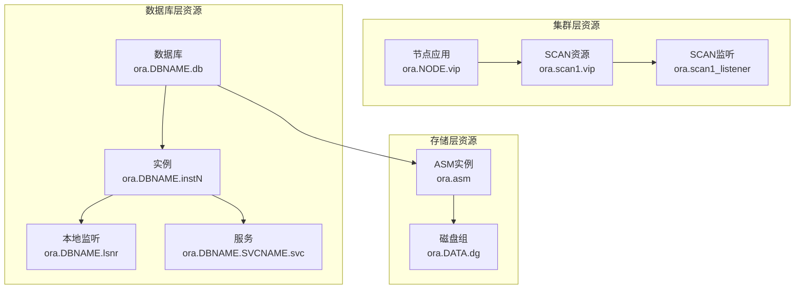
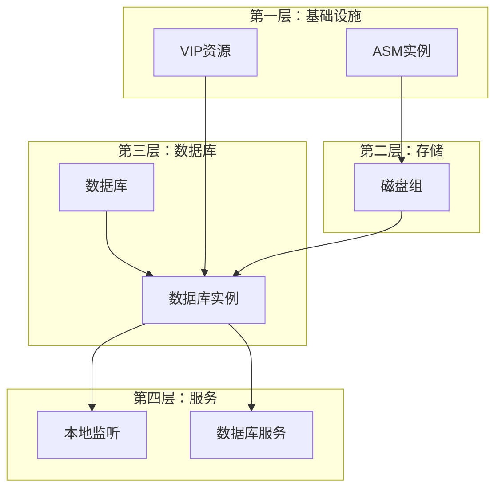
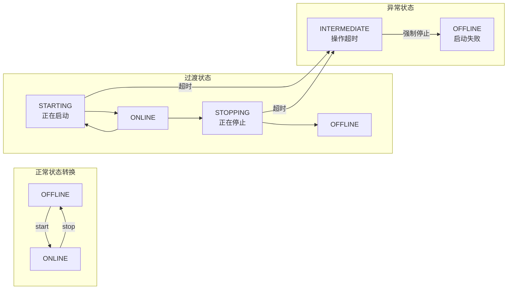
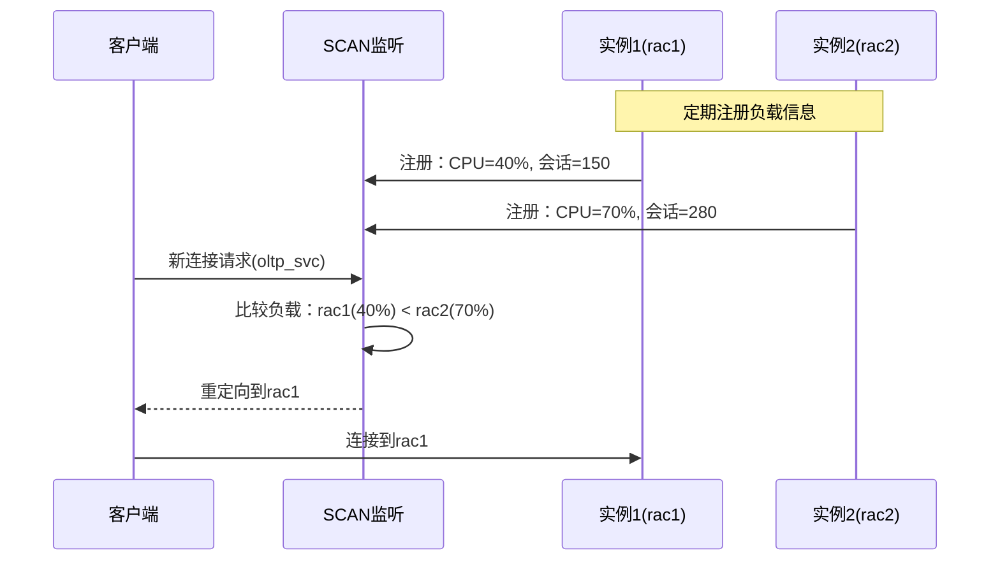
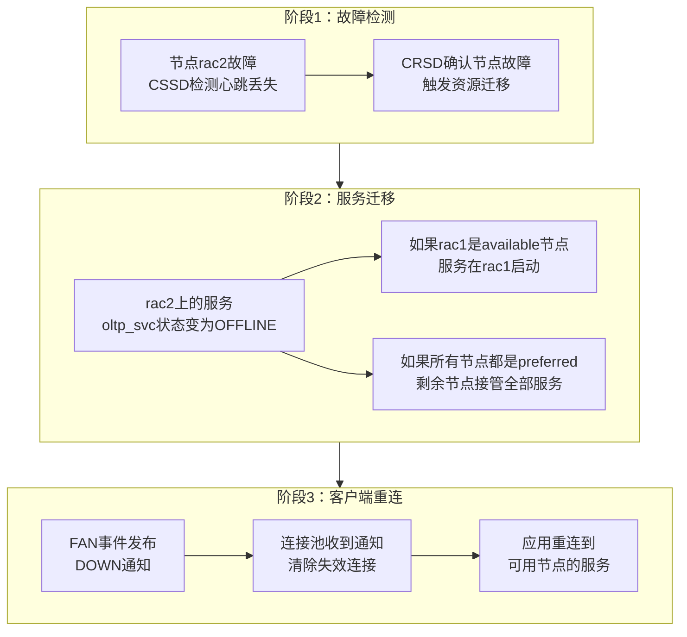
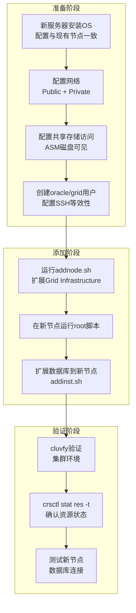
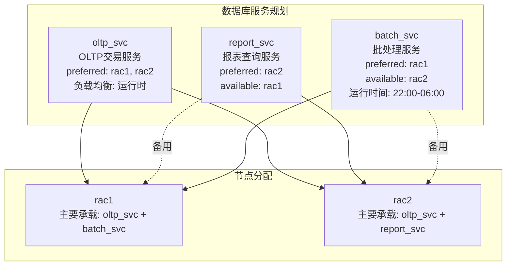

# 集群资源管理与日常运维

> **适用读者**：负责Oracle RAC日常运维的DBA、运维工程师
>
> **学习目标**：系统性地管理集群资源，理解服务高可用策略，掌握负载均衡配置，能应对常见运维操作
>
> **前置知识**：[集群核心组件与内部机制](02-集群核心组件与内部机制.md)

---

## 一、概述

### 1.1 一句话定义

集群资源管理是**通过Clusterware统一管理数据库、实例、监听、VIP、服务等各类资源的生命周期**，结合服务（Service）策略实现工作负载的智能分发和故障自动转移，是DBA日常运维的核心工作。

### 1.2 为什么重要

- **不掌握的后果**：
  - 无法有效管理集群资源，资源异常时排查效率低
  - 无法合理配置服务和负载均衡，导致节点间负载不均
  - 在线运维操作（如增删节点、滚动补丁）可能引发业务中断

- **掌握的价值**：
  - 高效管理集群资源，快速定位和解决资源异常
  - 通过服务策略优化工作负载分布，提升系统利用率
  - 安全执行在线运维操作，实现零停机维护

### 1.3 适用场景

| 场景 | 说明 |
|------|------|
| **日常巡检** | 检查所有集群资源状态，发现异常资源 |
| **服务管理** | 创建/修改/删除数据库服务，配置负载均衡策略 |
| **资源操作** | 启停数据库、实例、监听等资源 |
| **在线扩容** | 动态添加节点到集群 |
| **滚动维护** | 逐节点进行补丁更新或硬件维护 |

---

## 二、术语与概念

### 2.1 核心术语表

| 术语 | 含义 | 类比 |
|------|------|------|
| **资源（Resource）** | 集群管理的对象（数据库、实例、监听、VIP等） | 公司里的每个岗位 |
| **资源依赖** | 资源之间的启动/停止顺序关系 | 岗位之间的汇报关系 |
| **服务（Service）** | 数据库的逻辑工作负载单元 | 银行的不同业务窗口（对公/对私/VIP） |
| **首选节点（Preferred）** | 服务默认运行的节点 | 某业务窗口的固定柜员 |
| **可用节点（Available）** | 首选节点故障时的备用节点 | 替补柜员 |
| **TAF** | Transparent Application Failover，透明应用故障转移 | 柜台换了，业务自动继续 |
| **粘性（Pulled）** | 资源故障转移后是否自动回迁 | 员工病愈后是否回到原岗位 |

### 2.2 资源类型总览



---

## 三、集群资源管理模型

### 3.1 资源树与依赖关系

集群资源以层次化的树形结构组织，上层资源依赖下层资源：

**典型资源依赖链**：



**依赖规则**：

- **启动顺序**：从底层到顶层依次启动（VIP → ASM → 磁盘组 → 实例 → 监听 → 服务）
- **停止顺序**：从顶层到底层依次停止（服务 → 监听 → 实例 → 磁盘组 → ASM → VIP）
- **级联影响**：底层资源故障会自动触发上层资源停止

### 3.2 资源状态管理

**资源状态转换**：



**常用资源管理命令**：

```bash
# 查看所有资源状态（最常用）
$ crsctl stat res -t

# 启动/停止单个资源
$ srvctl start database -d orcl
$ srvctl stop instance -d orcl -i orcl2

# 查看资源详细配置
$ srvctl config database -d orcl

# 查看资源依赖关系
$ crsctl stat res ora.orcl.db -p | grep DEPENDENCY

# 强制停止资源（跳过依赖检查）
$ crsctl stop res ora.orcl.db -f
```

### 3.3 策略与权限

**资源放置策略（Placement Policy）**：

| 策略 | 说明 | 适用场景 |
|------|------|---------|
| **自动（Automatic）** | 集群自动决定资源在哪个节点运行 | 默认策略，推荐大多数场景 |
| **分布式（Distributed）** | 资源均匀分布在所有节点 | 希望负载均衡的场景 |
| **本地化（Local）** | 资源固定在启动时的节点 | 需要固定部署的场景 |

**故障转移策略**：

- **粘性（Failback/Pulled Back）**：资源故障转移到备用节点后，当首选节点恢复时是否自动回迁
  - 启用粘性：回迁到首选节点（适合有节点亲和性的场景）
  - 禁用粘性：留在当前节点（避免再次迁移的开销）

**管理权限**：

```bash
# 查看集群管理权限配置
$ crsctl get perm

# 设置资源管理权限（示例）
$ crsctl setperm resource ora.orcl.db -g oinstall -u user:oracle:r-x
```

---

## 四、服务与工作负载管理

### 4.1 数据库服务（Service）

**什么是数据库服务？**

服务是Oracle RAC中管理工作负载的核心概念。一个数据库可以创建多个服务，每个服务代表一种"工作负载类型"或"应用入口"。

> **类比**：银行大厅有多个业务窗口——对公业务窗口、对私业务窗口、VIP客户窗口。每个窗口就是一种"服务"，不同类型的客户去不同的窗口办理业务。

**服务策略类型**：

| 策略 | 说明 | 适用场景 |
|------|------|---------|
| **所有节点运行** | 服务在集群所有节点上同时运行 | OLTP型应用，需要负载均衡和故障转移 |
| **单一节点运行** | 服务只在一个节点上运行 | 批处理、报表等不适合跨节点并行的工作负载 |

```bash
# 创建服务（所有节点运行）
$ srvctl add service -d orcl -s oltp_svc -preferred "rac1,rac2"

# 创建服务（单一节点运行，rac1首选，rac2备用）
$ srvctl add service -d orcl -s batch_svc -preferred "rac1" -available "rac2"

# 启动服务
$ srvctl start service -d orcl -s oltp_svc

# 查看服务配置
$ srvctl config service -d orcl -s oltp_svc

# 查看服务运行状态
$ srvctl status service -d orcl
```

### 4.2 负载均衡机制

**客户端负载均衡**

客户端驱动在多个地址间随机选择连接：

```ini
# tnsnames.ora 配置
ORCL_OLTP =
  (DESCRIPTION =
    (ADDRESS_LIST =
      (LOAD_BALANCE = ON)
      (ADDRESS = (PROTOCOL = TCP)(HOST = scan-oracle.example.com)(PORT = 1521))
    )
    (CONNECT_DATA =
      (SERVICE_NAME = oltp_svc)
    )
  )
```

**服务器端运行时负载均衡**

通过 `REMOTE_LISTENER` 参数，各实例向SCAN监听注册自己的实时负载信息：



**负载均衡算法对比**：

| 算法 | 机制 | 优点 | 缺点 |
|------|------|------|------|
| 客户端随机 | 客户端驱动随机选地址 | 简单，无需服务器配置 | 不感知实际负载 |
| SCAN轮询 | DNS轮询解析3个SCAN IP | 连接级别均衡 | 粒度粗，不能感知会话 |
| 运行时负载均衡 | SCAN监听根据注册指标分发 | 感知实时负载 | 依赖指标更新频率 |
| 基于连接时间 | 选择响应最快的节点 | 实际体验最优 | 需要额外配置 |

### 4.3 服务故障转移

**故障转移流程**：



**TAF（Transparent Application Failover）配置**：

```ini
# 服务级别配置故障转移
$ srvctl modify service -d orcl -s oltp_svc \
    -failovertype SELECT \
    -failovermethod BASIC \
    -failoverretry 30 \
    -failoverdelay 5
```

| 参数 | 说明 |
|------|------|
| `-failovertype SELECT` | 故障转移后继续未完成的查询 |
| `-failovertype SESSION` | 故障转移后仅恢复会话（查询需重新执行） |
| `-failovermethod BASIC` | 故障时延迟创建新连接 |
| `-failoverretry 30` | 重试30次 |
| `-failoverdelay 5` | 每次重试间隔5秒 |

---

## 五、在线运维关键操作

### 5.1 动态添加节点

**流程概览**：



**关键命令**：

```bash
# 步骤1：扩展Grid Infrastructure
$ cd $GRID_HOME/addnode
$ ./addnode.sh -silent "CLUSTER_NEW_NODES={rac3}" \
    "CLUSTER_NEW_VIRTUAL_HOSTNAMES={rac3-vip}"

# 步骤2：在新节点执行root脚本
$ ssh rac3
$ /u01/app/oraInventory/orainstRoot.sh
$ /u01/app/19.0.0/grid/root.sh

# 步骤3：更新集群配置
$ cluvfy comp nodecon -n all -verbose

# 步骤4：扩展数据库实例到新节点
$ cd $ORACLE_HOME/oui/bin
$ ./addinst.sh -silent "GSM_USER=..." "GSM_PASSWORD=..."
```

### 5.2 动态删除节点

```bash
# 步骤1：停止并删除节点上的数据库实例
$ srvctl stop instance -d orcl -i orcl3
$ srvctl remove instance -d orcl -i orcl3

# 步骤2：从节点停止Grid Infrastructure
$ ssh rac3
$ /u01/app/19.0.0/grid/crs/install/rootcrs.sh -deconfig -force

# 步骤3：从其他节点删除rac3
$ crsctl delete node -n rac3

# 步骤4：验证
$ cluvfy comp nodecon -n all -verbose
$ olsnodes
```

### 5.3 滚动补丁更新

**核心思想**：逐节点停止、打补丁、启动，其他节点继续服务，实现零停机更新。


**关键命令**：

```bash
# 使用opatchauto进行滚动更新
# 步骤1：在节点1上执行（先停止该节点的资源）
$ ssh rac1
$ sudo $ORACLE_HOME/OPatch/opatchauto apply /patches/35742441 \
    -oh $ORACLE_HOME

# 步骤2：节点1完成后，在节点2上执行
$ ssh rac2
$ sudo $ORACLE_HOME/OPatch/opatchauto apply /patches/35742441 \
    -oh $ORACLE_HOME

# 步骤3：验证补丁版本
$ opatch lspatches
# 两个节点输出应一致
```

> **警告**：滚动更新期间，单个节点的容量需要能承载全部工作负载。更新前务必评估单节点容量是否充足。

### 5.4 日常巡检清单

| 检查项 | 命令 | 正常标准 | 频率 |
|--------|------|---------|------|
| 集群资源状态 | `crsctl stat res -t` | 所有资源ONLINE | 每日 |
| 节点成员状态 | `olsnodes -s` | 所有节点Active | 每日 |
| OCR状态 | `ocrcheck` | 完整性正常 | 每周 |
| Voting Disk | `crsctl query css votedisk` | 全部ONLINE | 每周 |
| ASM磁盘组空间 | `asmcmd lsdg` | 使用率 < 80% | 每周 |
| Interconnect延迟 | `ping -s 8192` 私有IP | < 1ms | 每月 |
| 集群日志异常 | 检查alert.log | 无ERROR/CRITICAL | 每日 |
| OCR备份状态 | `ocrconfig -showbackup` | 最近24h内有备份 | 每日 |

---

## 六、实战案例

### 6.1 案例背景

- **场景**：某CRM系统Oracle 19c RAC（2节点），业务反馈"上午系统慢、下午正常"
- **现象**：每天9:00-12:00期间，rac1节点CPU使用率持续90%+，rac2仅30%

### 6.2 诊断过程

**步骤1：检查服务配置**

```bash
$ srvctl config service -d crm -s crm_oltp
```

- → 发现：服务配置为 `-preferred "rac1,rac2"`，两节点均为首选
- → 判断：配置看起来正常，需要进一步分析连接分布

**步骤2：检查各节点会话分布**

```sql
-- 在rac1上执行
SELECT inst_id, COUNT(*) as sessions
FROM gv$session
WHERE type = 'USER'
GROUP BY inst_id;
```

- → 发现：
  - rac1：320个会话
  - rac2：80个会话
- → 判断：连接严重不均衡，80%的会话集中在rac1

**步骤3：分析连接来源**

```sql
SELECT inst_id, machine, COUNT(*) as cnt
FROM gv$session
WHERE type = 'USER'
GROUP BY inst_id, machine
ORDER BY cnt DESC;
```

- → 发现：应用服务器的连接字符串中 `LOAD_BALANCE=OFF`，且只配置了rac1的VIP地址
- → 判断：应用配置错误，绕过了SCAN和负载均衡

**步骤4：解决问题**

- → 根因定位：应用连接字符串配置错误，直连rac1的VIP而非SCAN地址
- → 解决方案：
  1. 修改应用连接字符串，使用SCAN地址并启用 `LOAD_BALANCE=ON`
  2. 配置服务器端运行时负载均衡

### 6.3 解决结果

| 指标 | 解决前 | 解决后 |
|------|--------|--------|
| rac1会话数 | 320 | 200 |
| rac2会话数 | 80 | 200 |
| rac1 CPU使用率 | 90%+ | 55% |
| rac2 CPU使用率 | 30% | 55% |
| 应用响应时间 | 上午800ms | 全天200ms |

### 6.4 复盘总结

- **根因**：应用连接字符串配置错误，直连单节点VIP，绕过负载均衡
- **教训**：
  1. 所有应用必须使用SCAN地址连接，禁止直连节点VIP
  2. 定期巡检会话分布，发现不均衡及时排查
  3. 部署时应有配置审核流程，验证连接字符串正确性

---

## 七、常见错误与排查

### 7.1 常见错误列表

| 错误/现象 | 原因 | 解决方法 |
|---------|------|---------|
| 资源长时间处于INTERMEDIATE | 资源启动/停止操作卡住 | 检查相关进程，必要时 `crsctl stop res -f` |
| 服务无法启动 | 依赖的实例未运行或磁盘组未挂载 | 先启动依赖资源，检查依赖链 |
| 负载严重不均衡 | 应用直连VIP或SCAN配置错误 | 使用SCAN地址，启用负载均衡 |
| 节点添加失败 | 环境配置不一致（OS参数、用户、网络） | 运行 `cluvfy` 预检查 |
| 滚动补丁失败 | 补丁版本不匹配或空间不足 | 确认补丁适用性，检查OPatch版本 |

### 7.2 排查步骤

1. **确认资源状态**：`crsctl stat res -t` 定位异常资源
2. **检查依赖链**：`srvctl config` 查看资源依赖关系
3. **查看资源日志**：`$GRID_HOME/log/<hostname>/` 下的相关日志
4. **验证环境一致性**：`cluvfy comp` 系列命令
5. **检查系统资源**：CPU、内存、磁盘空间是否充足

---

## 八、最佳实践

### 8.1 官方推荐

- **使用SCAN**：所有客户端通过SCAN连接，不直连节点VIP
- **服务分离**：不同类型的工作负载使用不同的服务（OLTP、报表、批处理）
- **巡检自动化**：将日常巡检命令封装为脚本，定时执行并告警
- **变更管理**：所有集群资源变更通过 `srvctl` 命令，避免手动修改配置文件

### 8.2 社区经验

- **服务命名规范**：建立统一的服务命名规范（如 `应用名_负载类型`）
- **资源状态监控**：部署监控系统对 `crsctl stat res -t` 输出进行解析告警
- **滚动更新演练**：每年至少进行一次滚动补丁更新演练
- **节点容量评估**：任意单节点需能承载60-70%的峰值负载（为故障转移留余量）

### 8.3 反模式

| 反模式 | 问题 | 正确做法 |
|--------|------|---------|
| 所有应用用一个服务 | 无法区分工作负载，无法精细化管理 | 按业务类型创建多个服务 |
| 应用直连节点VIP | 负载均衡失效，故障转移慢 | 使用SCAN地址连接 |
| 手动启停集群进程 | 绕过集群管理，状态不一致 | 始终使用 `srvctl` 或 `crsctl` |
| 忽略INTERMEDIATE状态 | 可能是资源卡住的早期信号 | 及时排查，不要等待自动恢复 |
| 单节点容量不足 | 故障时剩余节点无法承载全部负载 | 单节点容量至少承载60%峰值 |

---

## 九、命令与视图汇总

### 9.1 命令列表

| 命令 | 适用场景 | 说明 |
|------|---------|------|
| `crsctl stat res -t` | 日常巡检 | 查看所有资源状态 |
| `srvctl status database -d name` | 数据库状态 | 查看各实例运行状态 |
| `srvctl config service -d name` | 服务配置 | 查看服务详细配置 |
| `srvctl add service` | 创建服务 | 添加新的数据库服务 |
| `srvctl modify service` | 修改服务 | 修改服务配置（如故障转移策略） |
| `srvctl relocate service` | 迁移服务 | 手动将服务迁移到其他节点 |
| `crsctl check cluster -all` | 集群健康 | 检查所有节点的CRS状态 |
| `cluvfy comp nodecon` | 网络验证 | 验证节点间网络连通性 |
| `opatch lspatches` | 补丁查询 | 查看已安装的补丁列表 |

### 9.2 视图列表

| 视图名 | 类型 | 用途 | 关键字段 |
|--------|------|------|---------|
| `GV$SERVICENAME` | 全局视图 | 当前活跃的服务列表 | NAME, NETWORK_NAME |
| `GV$SESSION` | 全局视图 | 所有会话信息 | INST_ID, MACHINE, SERVICE_NAME |
| `GV$SERVICE_STATS` | 全局视图 | 服务级统计信息 | SERVICE_NAME, STAT_NAME |
| `DBA_SERVICES` | 数据字典 | 数据库服务定义 | NAME, NETWORK_NAME, PDB |

---

## 十、总结速查

### 10.1 黄金法则

1. **资源操作走 srvctl**：永远通过 `srvctl` 和 `crsctl` 管理资源，禁止手动修改配置文件
2. **服务是负载均衡的关键**：合理划分服务，使用SCAN连接，实现工作负载均衡
3. **单节点容量要留余量**：任一节点需能承载60%以上峰值负载，为故障转移留空间
4. **巡检要自动化**：日常巡检脚本化，异常自动告警，不要依赖人工检查

### 10.2 一页纸检查清单

| 现象/场景 | 原因 | 处理方案 |
|-----------|------|----------|
| 资源INTERMEDIATE卡住 | 进程hang或依赖资源异常 | 检查依赖链，必要时强制停止 |
| 负载不均衡 | 应用直连VIP或SCAN配置错误 | 统一使用SCAN，检查连接字符串 |
| 服务无法启动 | 依赖资源未就绪 | 按依赖顺序启动底层资源 |
| 节点添加失败 | 环境不一致 | `cluvfy` 预检查，修正差异 |

### 10.3 关键数字

| 指标 | 正常范围 | 告警阈值 | 说明 |
|------|---------|---------|------|
| 节点间会话分布 | 偏差 < 20% | 偏差 > 50% | 负载均衡效果 |
| 单节点CPU峰值 | < 70% | > 85% | 为故障转移留余量 |
| ASM磁盘组使用率 | < 80% | > 85% | 预留rebalance空间 |
| 服务故障转移时间 | < 30秒 | > 60秒 | 含检测+迁移+重连 |

---

## 附录

### A. 典型服务配置示例



**设计思路**：

- OLTP服务跨两节点运行，实现负载均衡和高可用
- 报表服务固定在rac2，避免大量查询影响OLTP性能
- 批处理服务固定在rac1夜间运行，与报表服务错开时间

### B. 官方参考

- [Oracle Real Application Clusters Administration and Deployment Guide](https://docs.oracle.com/en/database/oracle/oracle-database/19c/racad/)
- [Oracle Grid Infrastructure Administration and Deployment Guide](https://docs.oracle.com/en/database/oracle/oracle-database/19c/cwadm/)
- [Oracle Database 2 Day + Real Application Clusters Guide - Services](https://docs.oracle.com/en/database/oracle/oracle-database/19c/racad/)

### C. 修订记录

| 日期 | 版本 | 修改内容 | 修改人 |
|------|------|---------|--------|
| 2026-06-30 | v1.0 | 初始版本 | Oracle集群知识库 |

---

> **上一篇**：[集群核心组件与内部机制](02-集群核心组件与内部机制.md)
>
> **下一篇**：[集群性能监控与诊断](04-集群性能监控与诊断.md)
