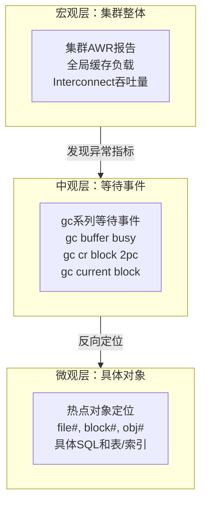
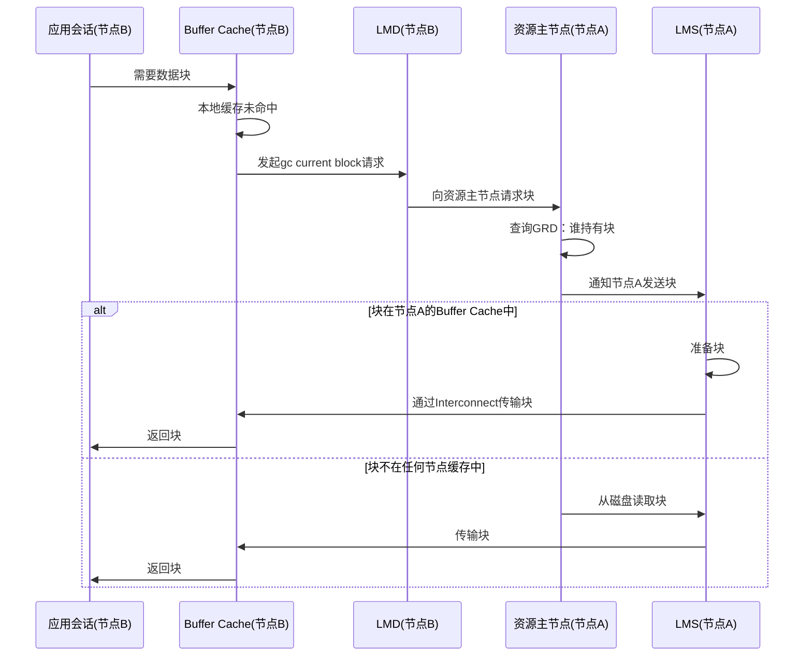
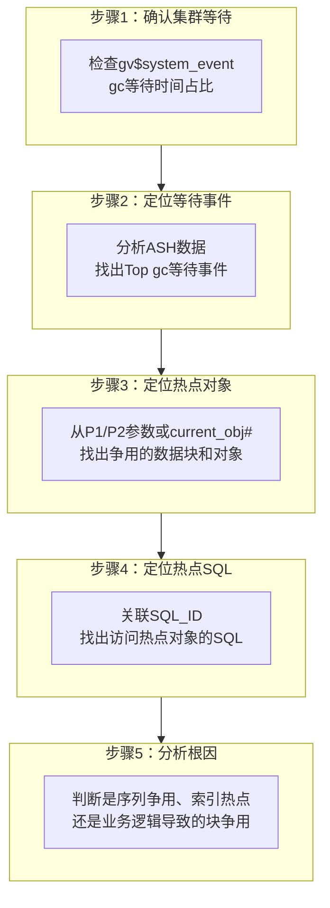

# 集群性能监控与诊断

> **适用读者**：负责Oracle RAC性能管理的DBA、性能分析师
>
> **学习目标**：掌握集群级性能监控框架，理解全局缓存等待事件，具备从宏观报告到微观等待事件的诊断能力
>
> **前置知识**：[集群资源管理与日常运维](03-集群资源管理与日常运维.md)

---

## 一、概述

### 1.1 一句话定义

集群性能监控与诊断是**通过全局性能视图（GV$）、集群AWR报告和实时分析工具，从跨节点维度发现和分析全局缓存争用、锁冲突、网络瓶颈等集群特有性能问题**的系统方法。

### 1.2 为什么重要

- **不掌握的后果**：
  - 无法发现集群特有的性能问题（如Cache Fusion瓶颈）
  - 单节点AWR看不出全局视角，遗漏跨节点争用
  - 性能问题定位慢，只能依赖Oracle支持

- **掌握的价值**：
  - 能够独立进行集群级性能分析
  - 快速定位全局缓存争用、热点块、网络瓶颈
  - 为性能调优提供精确的数据支撑

### 1.3 适用场景

| 场景 | 说明 |
|------|------|
| **日常性能巡检** | 定期检查集群级AWR，发现潜在性能趋势 |
| **性能故障诊断** | 应用响应变慢时，定位是否为集群特有等待 |
| **容量规划** | 评估Interconnect带宽、全局锁资源是否充足 |
| **调优前分析** | 为后续调优操作（第5篇）提供诊断依据 |

---

## 二、术语与概念

### 2.1 核心术语表

| 术语 | 含义 | 类比 |
|------|------|------|
| **GV$视图** | 全局动态性能视图，汇总所有节点数据 | 所有柜台的汇总报表 |
| **AWR RAC** | 集群级AWR报告，包含跨节点统计 | 整个银行的月度运营报告 |
| **gc等待事件** | 全局缓存（Global Cache）相关等待事件的总称 | 柜台间传递文件时的等待 |
| **CR Block** | Consistent Read块，用于查询的一致性读块 | 文件的历史快照副本 |
| **Current Block** | 当前块，用于DML操作的最新版本块 | 文件的最新编辑版 |
| **GRD** | Global Resource Directory，全局资源目录 | 快递分拣中心的目录 |
| **LMS** | Global Cache Service进程，负责块传输 | 柜台间的快递员 |
| **Hot Block** | 被多个节点频繁访问的数据块 | 大家都在抢的热门文件 |

### 2.2 集群性能诊断思维模型



---

## 三、集群性能监控框架

### 3.1 全局性能视图（GV$视图）

Oracle提供了一系列以 `GV$` 开头的全局视图，它们在 `V$` 视图基础上增加了 `INST_ID` 列，可以查看跨所有节点的性能数据。

**核心全局视图**：

| 视图 | 用途 | 关键列 |
|------|------|--------|
| `GV$SESSION` | 所有节点的会话信息 | INST_ID, SID, EVENT, WAIT_CLASS |
| `GV$SESSION_WAIT` | 当前等待事件 | INST_ID, EVENT, P1TEXT, P1, P2TEXT, P2 |
| `GV$SYSTEM_EVENT` | 系统级等待事件统计 | INST_ID, EVENT, TOTAL_WAITS, TIME_WAITED |
| `GV$SQL` | SQL执行统计 | INST_ID, SQL_ID, EXECUTIONS, ELAPSED_TIME |
| `GV$SEGMENT_STATISTICS` | 段级统计 | INST_ID, OWNER, OBJECT_NAME, STATISTIC_NAME |
| `GV$CR_BLOCK_SERVER` | CR块服务统计 | INST_ID, REQUEST, CR_BLOCK_TRANSFER_TIME |
| `GV$CURRENT_BLOCK_SERVER` | Current块服务统计 | INST_ID, REQUEST, CURRENT_BLOCK_TRANSFER_TIME |
| `GV$INTERCONNECT_PING` | Interconnect延迟统计 | INST_ID, TARGET, PING_TIME |

**常用查询示例**：

```sql
-- 查看各节点的Top等待事件
SELECT inst_id, event, total_waits, time_waited_micro/1000000 as time_sec
FROM gv$system_event
WHERE wait_class = 'Cluster'
  AND time_waited_micro > 0
ORDER BY time_waited_micro DESC;

-- 查看当前正在发生gc等待的会话
SELECT inst_id, sid, serial#, event, p1text, p1, p2text, p2, p3text, p3,
       seconds_in_wait
FROM gv$session
WHERE event LIKE 'gc%'
  AND wait_class = 'Cluster'
ORDER BY seconds_in_wait DESC;

-- 查看Interconnect延迟统计
SELECT inst_id, target, ping_count,
       ROUND(avg_ping_time/10, 1) as avg_ms,
       ROUND(max_ping_time/10, 1) as max_ms
FROM gv$interconnect_ping
ORDER BY inst_id, avg_ping_time DESC;
```

### 3.2 集群级AWR报告

**生成集群AWR报告**：

```bash
# 使用awrgrpt.sql生成集群AWR（需要SYSDBA权限）
$ sqlplus / as sysdba
SQL> @?/rdbms/admin/awrgrpt.sql

# 或使用awrgrpti.sql指定实例和快照
SQL> @?/rdbms/admin/awrgrpti.sql
```

**集群AWR特有章节**：

| 章节名称 | 包含内容 | 关注重点 |
|---------|---------|---------|
| **Cluster Interconnect Statistics** | 网络包统计、延迟分布 | 是否有延迟尖峰 |
| **Global Cache Load Profile** | 全局缓存的每秒操作数 | gc cr/current blocks served |
| **Global Cache Transfer Statistics** | 块传输时间、失败率 | 传输失败率应 < 1% |
| **Global Cache CR vs Current** | CR块和Current块的比例 | 判断读密集还是写密集 |
| **Global Enqueue Statistics** | 全局锁获取/转换统计 | 锁转换失败率 |

**健康基线解读**：

| 指标 | 健康值 | 告警值 | 说明 |
|------|--------|--------|------|
| Global Cache CR Block Transfer Time | < 1ms | > 5ms | CR块平均传输时间 |
| Global Cache Current Block Transfer Time | < 1ms | > 5ms | Current块平均传输时间 |
| Global Cache Transfer Failures | < 0.1% | > 1% | 块传输失败率 |
| Global Cache Lost Blocks | 0 | > 0 | 丢失的数据块数 |
| Interconnect Ping Latency | < 1ms | > 3ms | 节点间网络延迟 |

### 3.3 实时分析工具

**ASH（Active Session History）全局分析**：

```sql
-- 实时查看集群级活跃会话的等待分布
SELECT inst_id, event, COUNT(*) as active_sessions
FROM gv$active_session_history
WHERE sample_time > SYSDATE - 5/1440  -- 最近5分钟
  AND wait_class = 'Cluster'
GROUP BY inst_id, event
ORDER BY active_sessions DESC;

-- 定位造成全局等待的Top SQL
SELECT sql_id, inst_id, event, COUNT(*) as samples
FROM gv$active_session_history
WHERE sample_time > SYSDATE - 15/1440
  AND event LIKE 'gc%'
GROUP BY sql_id, inst_id, event
ORDER BY samples DESC
FETCH FIRST 10 ROWS ONLY;
```

**实时监控脚本**：

```sql
-- 实时监控集群等待（每10秒刷新）
SELECT TO_CHAR(SYSDATE, 'HH24:MI:SS') as time,
       inst_id,
       SUM(CASE WHEN event LIKE 'gc buffer busy%' THEN 1 ELSE 0 END) as gc_busy,
       SUM(CASE WHEN event LIKE 'gc cr%' THEN 1 ELSE 0 END) as gc_cr,
       SUM(CASE WHEN event LIKE 'gc current%' THEN 1 ELSE 0 END) as gc_cur,
       COUNT(*) as total_cluster_wait
FROM gv$session
WHERE wait_class = 'Cluster'
GROUP BY inst_id
ORDER BY inst_id;
```

---

## 四、全局缓存与锁竞争原理

### 4.1 Cache Fusion等待事件全景

当多个节点同时访问相同数据块时，需要通过Cache Fusion协调。这个协调过程会产生等待事件，统称为 `gc`（Global Cache）系列等待事件。

**核心等待事件分类**：

| 等待事件 | 等待含义 | 常见触发场景 |
|---------|---------|-------------|
| **gc buffer busy acquire** | 等待获取全局缓存块的访问权 | 热点块争用，多节点同时请求同一块 |
| **gc buffer busy release** | 等待块被释放后才能获取 | 块正在被其他节点修改 |
| **gc cr block 2pc** | 等待CR块的两阶段传输完成 | 查询需要一致性读，但块在远端节点 |
| **gc cr block request** | 请求CR块 | 查询需要一致性读版本的块 |
| **gc cr grant 2pc** | 等待CR块的两阶段授予 | 锁授予需要两个网络往返 |
| **gc current block 2pc** | 等待Current块的两阶段传输 | DML需要最新版本的块 |
| **gc current block request** | 请求Current块 | DML操作需要当前版本的块 |
| **gc current grant 2pc** | 等待Current块的两阶段授予 | 锁授予过程 |
| **gc remaster** | 等待资源主节点重新分配 | 节点加入/离开触发remastering |

**等待事件内部流程**：



### 4.2 等待事件参数解读

gc等待事件的关键参数可以帮助定位争用的具体数据块：

| 参数 | 含义 | 用途 |
|------|------|------|
| **P1 = file#** | 数据文件号 | 定位到具体数据文件 |
| **P2 = block#** | 数据块号 | 定位到具体数据块 |
| **P3 = class#** | 块类别 | 区分数据块、索引块、段头等 |

**从等待事件反向定位争用对象**：

```sql
-- 根据file#和block#定位具体对象
SELECT owner, segment_name, segment_type, tablespace_name
FROM dba_extents
WHERE file_id = &file_number
  AND &block_number BETWEEN block_id AND block_id + blocks - 1;

-- 批量分析：找出被gc等待最多的对象
SELECT current_obj#, COUNT(*) as wait_count
FROM gv$active_session_history
WHERE event LIKE 'gc%'
  AND sample_time > SYSDATE - 1/24  -- 最近1小时
  AND current_obj# > 0
GROUP BY current_obj#
ORDER BY wait_count DESC
FETCH FIRST 20 ROWS ONLY;

-- 关联对象名称
SELECT o.owner, o.object_name, o.object_type,
       COUNT(*) as wait_count
FROM gv$active_session_history ash,
     dba_objects o
WHERE ash.event LIKE 'gc%'
  AND ash.current_obj# = o.object_id
  AND ash.sample_time > SYSDATE - 1/24
GROUP BY o.owner, o.object_name, o.object_type
ORDER BY wait_count DESC
FETCH FIRST 10 ROWS ONLY;
```

### 4.3 热点数据诊断

**热点块（Hot Block）的识别特征**：

| 特征 | 表现 | 诊断方法 |
|------|------|---------|
| 高gc buffer busy等待 | 大量会话等待同一块 | ASH分析：`current_obj#` 集中在少数对象 |
| 序列争用 | 序列缓存耗尽导致频繁跨节点获取 | 检查序列CACHE大小 |
| 索引右倾热点 | B树索引最右叶块被并发插入 | 分析索引块等待分布 |
| 计数器更新热点 | 频繁UPDATE同一行/块 | 业务逻辑分析 |

**热点诊断流程**：



**诊断SQL合集**：

```sql
-- 1. 集群等待占总等待的比例
SELECT ROUND(
    (SELECT SUM(time_waited_micro) FROM gv$system_event WHERE wait_class = 'Cluster')
    / (SELECT SUM(time_waited_micro) FROM gv$system_event) * 100, 2
) as cluster_wait_pct FROM DUAL;
-- 健康值：< 10%，告警值：> 30%

-- 2. 各节点的gc等待时间分布
SELECT inst_id,
       event,
       total_waits,
       ROUND(time_waited_micro/1000000, 2) as time_sec,
       ROUND(time_waited_micro/NULLIF(total_waits,0)/1000, 2) as avg_ms_per_wait
FROM gv$system_event
WHERE event LIKE 'gc%'
  AND time_waited_micro > 0
ORDER BY inst_id, time_waited_micro DESC;

-- 3. 块传输统计（判断Interconnect是否瓶颈）
SELECT inst_id,
       cr_blocks_received,
       cr_blocks_served,
       current_blocks_received,
       current_blocks_served,
       ROUND(cr_block_transfer_time/NULLIF(cr_blocks_served,0)/1000, 2) as avg_cr_ms,
       ROUND(current_block_transfer_time/NULLIF(current_blocks_served,0)/1000, 2) as avg_cur_ms
FROM gv$cr_block_server
JOIN gv$current_block_server USING (inst_id);

-- 4. 定位热点块（基于ASH）
SELECT NVL(ash.current_obj#, 0) as obj#,
       ash.current_file# as file#,
       ash.current_block# as block#,
       COUNT(*) as samples,
       ROUND(COUNT(*) * 100 / SUM(COUNT(*)) OVER(), 2) as pct
FROM gv$active_session_history ash
WHERE ash.event LIKE 'gc buffer busy%'
  AND ash.sample_time > SYSDATE - 1/24
GROUP BY ash.current_obj#, ash.current_file#, ash.current_block#
ORDER BY samples DESC
FETCH FIRST 10 ROWS ONLY;
```

---

## 五、实战案例

### 5.1 案例背景

- **场景**：某订单系统Oracle 19c RAC（2节点），下午高峰期应用响应时间从100ms飙升到2秒
- **现象**：AWR报告显示 `gc buffer busy acquire` 等待排名第一，占总等待时间的45%

### 5.2 诊断过程

**步骤1：确认集群等待占比**

```sql
SELECT ROUND(
    (SELECT SUM(time_waited_micro) FROM gv$system_event WHERE wait_class = 'Cluster')
    / (SELECT SUM(time_waited_micro) FROM gv$system_event) * 100, 2
) as cluster_wait_pct FROM DUAL;
```

- → 发现：cluster_wait_pct = 47.3%
- → 判断：集群等待占比严重偏高（健康值应 < 10%）

**步骤2：分析Top gc等待事件**

```sql
SELECT inst_id, event, total_waits,
       ROUND(time_waited_micro/1000000, 2) as time_sec
FROM gv$system_event
WHERE event LIKE 'gc%'
  AND time_waited_micro > 0
ORDER BY time_waited_micro DESC
FETCH FIRST 5 ROWS ONLY;
```

- → 发现：
  - `gc buffer busy acquire`：1250秒（节点1）+ 980秒（节点2）
  - `gc cr block 2pc`：150秒
- → 判断：主要是buffer busy争用，不是网络传输问题

**步骤3：定位热点对象**

```sql
SELECT o.owner, o.object_name, o.object_type, COUNT(*) as samples
FROM gv$active_session_history ash, dba_objects o
WHERE ash.event LIKE 'gc buffer busy%'
  AND ash.current_obj# = o.object_id
  AND ash.sample_time > SYSDATE - 1/24
GROUP BY o.owner, o.object_name, o.object_type
ORDER BY samples DESC;
```

- → 发现：
  - `ORDER_SEQ`（SEQUENCE）：65%的等待
  - `IDX_ORDER_STATUS`（INDEX）：25%的等待
- → 判断：序列争用是主因，索引热点是次因

**步骤4：检查序列配置**

```sql
SELECT sequence_name, cache_size, order_flag
FROM dba_sequences
WHERE sequence_name = 'ORDER_SEQ';
```

- → 发现：`CACHE_SIZE = 20`（默认值），`ORDER_FLAG = Y`（有序序列）
- → 判断：有序序列 + 小缓存 = 每次获取序列值都需要跨节点协调

**步骤5：定位热点SQL**

```sql
SELECT sql_id, sql_text, executions,
       ROUND(elapsed_time/1000000/executions, 3) as avg_sec
FROM gv$sql
WHERE sql_text LIKE '%ORDER_SEQ%'
ORDER BY elapsed_time DESC
FETCH FIRST 3 ROWS ONLY;
```

- → 发现：插入订单的SQL每次执行都要等待序列值，平均耗时1.8秒

**步骤6：解决问题**

- → 根因定位：有序序列CACHE_SIZE=20太小，高并发下每次获取序列值都需跨节点协调
- → 解决方案：
  1. 将序列CACHE增大到10000
  2. 如果业务允许，改为NOORDER序列（消除跨节点排序）

```sql
-- 增大序列缓存
ALTER SEQUENCE order_seq CACHE 10000;

-- 如果业务允许无序，改为NOORDER（需重建）
-- CREATE SEQUENCE order_seq NOORDER CACHE 10000;
```

### 5.3 解决结果

| 指标 | 解决前 | 解决后 |
|------|--------|--------|
| `gc buffer busy` 等待时间 | 2230秒/小时 | 15秒/小时 |
| 集群等待占比 | 47.3% | 3.2% |
| 应用响应时间 | 2秒 | 120ms |
| 序列获取延迟 | 1.8秒/次 | 0.01秒/次 |

### 5.4 复盘总结

- **根因**：有序序列缓存过小，高并发下成为全局热点
- **教训**：
  1. RAC环境中，序列CACHE应设置足够大（至少1000+）
  2. 如果业务允许，使用NOORDER序列可以大幅减少跨节点协调
  3. 定期检查集群等待占比，> 10%即需深入分析

---

## 六、常见错误与排查

### 6.1 常见错误列表

| 错误/现象 | 原因 | 解决方法 |
|---------|------|---------|
| gc等待事件占比 > 30% | 热点块争用或Interconnect性能差 | 定位热点对象，检查网络延迟 |
| 块传输失败率 > 1% | Interconnect丢包或LMS进程繁忙 | 检查网络质量，调整LMS进程数 |
| AWR显示大量gc remaster | 节点频繁加入/离开或动态重主 | 检查集群稳定性，考虑冻结remaster |
| 单节点gc等待远高于其他节点 | 负载不均或该节点Interconnect异常 | 检查负载均衡和网络状态 |

### 6.2 排查步骤

1. **确认集群等待占比**：查询 `gv$system_event` 中Cluster类等待的百分比
2. **分析AWR RAC报告**：检查Global Cache章节的传输时间和失败率
3. **定位热点对象**：通过ASH和 `current_obj#` 找出争用最多的对象
4. **检查Interconnect**：`ping` 测试延迟，查看 `gv$interconnect_ping`
5. **分析SQL负载**：找出访问热点对象的SQL，评估是否可以优化

---

## 七、命令与视图汇总

### 7.1 视图列表

| 视图名 | 类型 | 用途 | 关键字段 |
|--------|------|------|---------|
| `GV$SYSTEM_EVENT` | 全局视图 | 系统级等待事件统计 | EVENT, TIME_WAITED_MICRO |
| `GV$SESSION` | 全局视图 | 当前会话等待 | EVENT, P1, P2, P3 |
| `GV$ACTIVE_SESSION_HISTORY` | 全局视图 | 活跃会话历史采样 | EVENT, SQL_ID, CURRENT_OBJ# |
| `GV$CR_BLOCK_SERVER` | 全局视图 | CR块服务统计 | CR_BLOCK_TRANSFER_TIME |
| `GV$CURRENT_BLOCK_SERVER` | 全局视图 | Current块服务统计 | CURRENT_BLOCK_TRANSFER_TIME |
| `GV$INTERCONNECT_PING` | 全局视图 | Interconnect延迟 | AVG_PING_TIME |
| `GV$POLICY_HISTORY` | 全局视图 | Remastering历史 | OBJECT_ID, EVENT_DATE |
| `GV$DYNAMIC_REMASTER_STATS` | 全局视图 | 动态重主统计 | REMASTER_OPS, REMASTER_TIME |

### 7.2 诊断脚本汇总

| 脚本用途 | 关键视图 | 输出 |
|---------|---------|------|
| 集群等待占比 | `GV$SYSTEM_EVENT` | 百分比 |
| 各节点gc等待分布 | `GV$SYSTEM_EVENT` | 按实例和事件分组 |
| 热点对象定位 | `GV$ACTIVE_SESSION_HISTORY` + `DBA_OBJECTS` | 对象名和等待次数 |
| 块传输性能 | `GV$CR_BLOCK_SERVER` + `GV$CURRENT_BLOCK_SERVER` | 平均传输时间 |
| Interconnect延迟 | `GV$INTERCONNECT_PING` | 平均/最大延迟 |

---

## 八、总结速查

### 8.1 黄金法则

1. **先看全局再看局部**：从集群AWR开始，逐步下钻到具体等待事件和对象
2. **gc等待占比是健康晴雨表**：< 10%健康，10-30%需关注，> 30%需立即分析
3. **热点定位三板斧**：等待事件 → 热点对象（file#/block#/obj#） → 热点SQL
4. **Interconnect延迟是基础**：网络延迟高，所有Cache Fusion操作都会变慢

### 8.2 一页纸检查清单

| 现象/场景 | 可能原因 | 诊断方法 |
|-----------|---------|---------|
| gc buffer busy等待高 | 热点块/序列争用 | ASH分析current_obj#，检查序列CACHE |
| gc cr/current block慢 | Interconnect延迟高 | 检查gv$interconnect_ping |
| 块传输失败率高 | 网络丢包或LMS繁忙 | 检查网络质量，增加LMS进程 |
| 单节点等待远高于其他 | 负载不均或网络异常 | 对比各节点指标，检查网络绑定 |

### 8.3 关键数字

| 指标 | 正常范围 | 告警阈值 | 说明 |
|------|---------|---------|------|
| 集群等待占比 | < 10% | > 30% | Cluster类等待/总等待 |
| CR块传输时间 | < 1ms | > 5ms | 平均传输延迟 |
| Current块传输时间 | < 1ms | > 5ms | 平均传输延迟 |
| 块传输失败率 | < 0.1% | > 1% | 失败次数/总请求 |
| Interconnect延迟 | < 1ms | > 3ms | 节点间ping延迟 |

---

## 附录

### A. 集群AWR关键章节速查

| AWR章节 | 关注指标 | 健康基线 |
|---------|---------|---------|
| Top Foreground Events | gc等待事件排名和时间 | gc等待不在Top 5 |
| Cluster Interconnect Stats | 包大小分布、延迟 | 平均延迟 < 1ms |
| Global Cache Load Profile | blocks served / received | 与业务量匹配 |
| Global Cache Transfer Stats | 失败率、传输时间 | 失败率 < 0.1% |
| Global Enqueue Statistics | 锁获取/转换/释放 | 无异常增长趋势 |

### B. 官方参考

- [Oracle Database Performance Tuning Guide - RAC](https://docs.oracle.com/en/database/oracle/oracle-database/19c/tgdba/)
- [Oracle RAC Administration and Deployment Guide - Performance](https://docs.oracle.com/en/database/oracle/oracle-database/19c/racad/)
- MOS Note: 1385806.1 — RAC: Troubleshooting Cache Fusion Wait Events

### C. 修订记录

| 日期 | 版本 | 修改内容 | 修改人 |
|------|------|---------|--------|
| 2026-06-30 | v1.0 | 初始版本 | Oracle集群知识库 |

---

> **上一篇**：[集群资源管理与日常运维](03-集群资源管理与日常运维.md)
>
> **下一篇**：[集群性能调优实战](05-集群性能调优实战.md)
