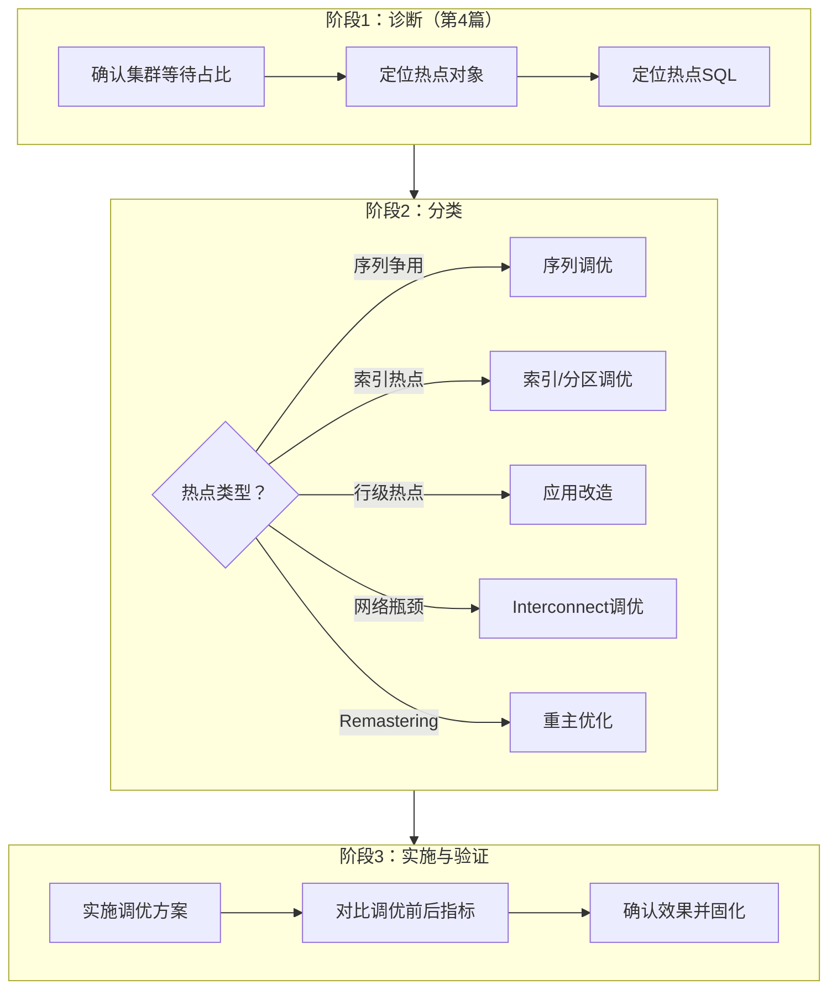
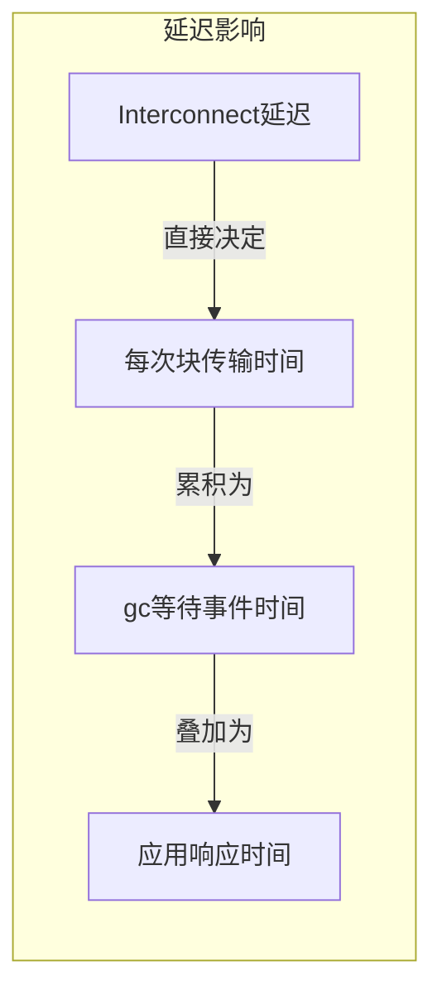
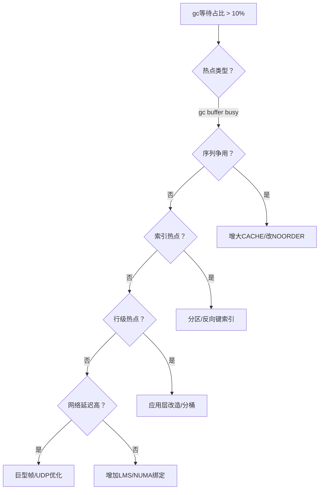

# 集群性能调优实战

> **适用读者**：负责Oracle RAC性能调优的高级DBA、性能工程师
>
> **学习目标**：掌握热点冷却技术、Remastering优化、Interconnect调优，具备独立完成集群性能调优项目的能力
>
> **前置知识**：[集群性能监控与诊断](04-集群性能监控与诊断.md)

---

## 一、概述

### 1.1 一句话定义

集群性能调优是**在诊断出全局缓存争用、网络瓶颈等问题后，通过热点冷却、Remastering优化、Interconnect参数调整等手段，系统性消除或缓解集群特有性能瓶颈**的实践过程。

### 1.2 为什么重要

- **不掌握的后果**：
  - 知道问题在哪但不知道如何解决，只能依赖应用改造
  - 调优方向错误可能适得其反（如盲目增加LMS进程）
  - 无法评估调优效果，缺乏量化的调优方法论

- **掌握的价值**：
  - 具备系统性的集群调优方法论
  - 能够针对不同热点类型选择正确的调优手段
  - 能够量化调优效果，形成闭环

### 1.3 适用场景

| 场景 | 说明 |
|------|------|
| **序列争用调优** | 有序序列CACHE过小导致的全局热点 |
| **索引热点调优** | B树索引右倾导致的并发插入瓶颈 |
| **行级热点调优** | 频繁更新同一行/块导致的gc buffer busy |
| **Interconnect调优** | 网络延迟或带宽不足影响Cache Fusion |
| **Remastering调优** | 动态重主频繁导致的不稳定 |

---

## 二、术语与概念

### 2.1 核心术语表

| 术语 | 含义 | 类比 |
|------|------|------|
| **热点冷却（Hot Spot Cooling）** | 通过技术手段分散对同一数据块的并发访问 | 把排队的人分散到多个窗口 |
| **Remastering** | 资源主节点在节点间迁移 | 区域负责人换人 |
| **Affinity** | 对象亲和性，让资源主节点固定在某个节点 | 让区域负责人不换岗 |
| **LMS进程** | Global Cache Service，负责块传输 | 快递员 |
| **巨型帧（Jumbo Frame）** | 大于标准1500字节的网络帧，减少CPU中断 | 大货车一次运更多货 |
| **NUMA** | Non-Uniform Memory Access，非一致内存访问 | 不同CPU访问不同内存速度不同 |

### 2.2 调优方法论总览



---

## 三、热点冷却技术

### 3.1 序列争用调优

**问题本质**：有序序列（ORDERED）每次获取序列值都需要跨节点协调，CACHE越小，协调频率越高。

**调优策略**：

| 策略 | 方法 | 效果 | 适用条件 |
|------|------|------|---------|
| **增大CACHE** | `ALTER SEQUENCE seq CACHE 10000` | 减少跨节点协调频率 | 所有场景首选 |
| **改为NOORDER** | 重建序列为NOORDER | 消除跨节点排序，各节点独立获取 | 业务允许序列值不严格递增 |
| **应用层缓存** | 应用层批量预取序列值 | 大幅减少数据库请求 | 应用可改造 |
| **使用UUID替代** | 应用层生成UUID | 完全消除序列争用 | 业务允许非数字主键 |

**增大CACHE的效果评估**：

```sql
-- 查看当前序列配置
SELECT sequence_owner, sequence_name, cache_size, min_value, max_value,
       cycle_flag, order_flag
FROM dba_sequences
WHERE sequence_name = UPPER('&seq_name');

-- 估算CACHE大小
-- 假设每秒需要1000个序列值，2节点
-- CACHE=20: 每20/1000=0.02秒就需要协调一次 → 每秒50次跨节点请求
-- CACHE=10000: 每10000/1000=10秒才协调一次 → 每秒0.1次跨节点请求
-- 效果：跨节点请求减少500倍
```

**推荐CACHE大小参考**：

| 并发级别 | 推荐CACHE | 说明 |
|---------|----------|------|
| 低（< 100 TPS） | 1000 | 足够覆盖大部分场景 |
| 中（100-1000 TPS） | 10000 | 减少协调频率到可接受水平 |
| 高（> 1000 TPS） | 100000 | 大幅减少跨节点请求 |

### 3.2 分区/分片打散

**问题本质**：大量并发INSERT/UPDATE集中在同一个数据块（如索引最右叶块、单表数据段），形成热点。

**调优策略**：

**策略一：范围分区 → 哈希/列表分区**

```sql
-- 问题：按日期范围分区，最新分区成为写入热点
-- 改造：使用组合分区（范围+哈希），将写入分散到多个分区

-- 改造前（热点）
CREATE TABLE orders (
    order_id NUMBER,
    order_date DATE,
    status VARCHAR2(20)
) PARTITION BY RANGE (order_date) (
    PARTITION p202606 VALUES LESS THAN (DATE '2026-07-01')
);

-- 改造后（分散热点）
CREATE TABLE orders (
    order_id NUMBER,
    order_date DATE,
    status VARCHAR2(20)
) PARTITION BY RANGE (order_date)
  SUBPARTITION BY HASH (order_id) SUBPARTITIONS 8 (
    PARTITION p202606 VALUES LESS THAN (DATE '2026-07-01')
);
```

**策略二：索引分区**

```sql
-- 问题：全局索引的右倾热点
-- 改造：将全局索引改为分区索引

-- 改造前（全局索引热点）
CREATE INDEX idx_orders_status ON orders(status);

-- 改造后（本地索引，随表分区分散）
CREATE INDEX idx_orders_status ON orders(status) LOCAL;
```

**策略三：反向键索引**

```sql
-- 问题：序列生成的主键导致索引右倾
-- 改造：使用反向键索引，将顺序插入分散到索引各叶块

CREATE INDEX idx_orders_pk ON orders(order_id) REVERSE;

-- 注意：反向键索引不支持范围扫描
-- 适用场景：只有等值查询的主键索引
```

### 3.3 应用层改造

**场景**：高并发UPDATE同一行（如计数器、余额字段）

**调优策略**：

| 策略 | 方法 | 效果 |
|------|------|------|
| **批量更新** | 将逐行UPDATE改为批量聚合后更新 | 减少块访问频率 |
| **乐观锁** | 应用层缓存+最终一致性更新 | 避免频繁跨节点协调 |
| **队列缓冲** | 将更新请求放入队列，异步批量处理 | 将并发写转为串行批处理 |
| **分桶计数** | 将单个计数器拆分为N个桶，分散更新 | 消除单块热点 |

**分桶计数器示例**：

```sql
-- 问题：单行计数器被高并发更新
-- CREATE TABLE counters (name VARCHAR2(30), value NUMBER);
-- 所有节点都在UPDATE同一行 → gc buffer busy

-- 解决：分桶计数
CREATE TABLE counters (
    name VARCHAR2(30),
    bucket_id NUMBER,     -- 桶编号（0-15）
    value NUMBER,
    PRIMARY KEY (name, bucket_id)
);

-- 初始化16个桶
INSERT INTO counters SELECT 'page_views', LEVEL-1, 0
FROM DUAL CONNECT BY LEVEL <= 16;

-- 更新时随机选择桶
UPDATE counters
SET value = value + 1
WHERE name = 'page_views'
  AND bucket_id = DBMS_RANDOM.VALUE(0, 15);

-- 查询总数
SELECT SUM(value) FROM counters WHERE name = 'page_views';
```

---

## 四、动态重主（Remastering）优化

### 4.1 Remastering机制回顾

**什么是Remastering？**

在Oracle RAC中，每个全局资源都有一个"主节点"（Master Node），负责协调该资源的锁请求。当资源的访问模式发生变化（如某个节点开始大量访问原本由另一节点主导的资源），Oracle会动态迁移资源的主节点——这就是Remastering。

**Remastering的代价**：

- 迁移期间该资源的所有锁请求暂停（冻结）
- 大量资源同时Remastering会导致短暂的集群性能抖动
- 频繁的Remastering说明访问模式不稳定

### 4.2 监控Remastering活动

```sql
-- 查看最近的Remastering操作
SELECT object_id, policy, freezing_time, frozen_time,
       recovery_time, remaster_time
FROM gv$policy_history
ORDER BY remaster_time DESC
FETCH FIRST 20 ROWS ONLY;

-- 查看动态Remastering统计
SELECT inst_id, remaster_ops, remaster_time,
       remaster_local_sleep, remaster_remote_sleep
FROM gv$dynamic_remaster_stats;

-- 查看对象的当前主节点
SELECT object_id, object_name, owner,
       master_node, current_policy
FROM gv$gcspfmo_statistics;  -- 19c+
```

### 4.3 调优策略

**策略一：冻结Remastering（适用于稳定负载）**

```sql
-- 禁止动态Remastering
ALTER SYSTEM SET "_gc_policy_minimum" = 1000000;
-- 将策略阈值设得极高，实际上禁止了动态Remastering

-- 或者通过隐含参数控制
ALTER SYSTEM SET "_gc_undo_affinity" = TRUE;
-- UNDO段亲和性，避免UNDO块频繁Remastering
```

**策略二：对象亲和性绑定（适用于已知热点）**

```sql
-- 将特定对象的主节点固定在访问最多的节点
-- 通过DBMS_SERVICE或隐含参数设置
-- 注意：这需要深入了解对象的访问模式

-- 查看当前对象的访问分布
SELECT object_id, inst_id, SUM(forced_reads + forced_writes) as io_count
FROM gv$gcspfmo_statistics
GROUP BY object_id, inst_id
ORDER BY object_id, io_count DESC;
```

**策略三：调整Remastering阈值**

```sql
-- 增大触发Remastering的阈值，减少不必要的迁移
ALTER SYSTEM SET "_gc_policy_time" = 60;
-- 默认30秒，增大到60秒需要更长时间的观察才触发

ALTER SYSTEM SET "_gc_policy_minimum" = 50;
-- 默认15，增大后需要更多访问才触发Remastering
```

| 参数 | 默认值 | 调优方向 | 说明 |
|------|--------|---------|------|
| `_gc_policy_time` | 30秒 | 增大 | 延长观察窗口，减少频繁Remastering |
| `_gc_policy_minimum` | 15 | 增大 | 提高触发阈值，减少不必要的迁移 |
| `_gc_undo_affinity` | FALSE | TRUE | UNDO段亲和性，减少UNDO相关Remastering |

---

## 五、Interconnect 网络优化

### 5.1 网络带宽与延迟的影响模型

**延迟对Cache Fusion的影响**：



**经验公式**：

- 每次gc等待 ≈ Interconnect延迟 × 2（请求+响应两个往返）
- 如果每秒发生1000次gc等待，每次延迟增加1ms → 总等待增加1秒/秒

### 5.2 巨型帧（Jumbo Frame）

**原理**：标准以太网帧MTU为1500字节，传输一个8KB数据块需要6个帧。巨型帧（MTU=9000）只需1个帧，减少CPU中断次数和协议开销。

**配置步骤**：

```bash
# 步骤1：在操作系统层面配置巨型帧（所有节点）
# Linux示例
$ ip link set dev eth1 mtu 9000

# 持久化配置
$ echo 'MTU=9000' >> /etc/sysconfig/network-scripts/ifcfg-eth1

# 步骤2：确保交换机端口也支持巨型帧
# 交换机配置（以Cisco为例）
# system mtu jumbo 9216

# 步骤3：验证MTU
$ ping -s 8192 -M do -c 10 10.10.10.2
# 如果不分片能成功，说明巨型帧配置正确
```

**效果评估**：

| 指标 | 标准帧（1500） | 巨型帧（9000） | 改善 |
|------|---------------|---------------|------|
| 传输8KB块所需帧数 | 6 | 1 | 减少83% |
| CPU中断次数 | 6次 | 1次 | 减少83% |
| 协议开销 | ~240字节 | ~40字节 | 减少83% |

### 5.3 UDP缓冲区优化

```bash
# 查看当前UDP缓冲区设置
$ sysctl net.core.rmem_max
$ sysctl net.core.wmem_max

# 推荐设置（Interconnect使用UDP传输）
$ sysctl -w net.core.rmem_max=4194304    # 4MB
$ sysctl -w net.core.wmem_max=4194304    # 4MB
$ sysctl -w net.core.rmem_default=262144 # 256KB
$ sysctl -w net.core.wmem_default=262144 # 256KB

# 持久化
$ cat >> /etc/sysctl.conf << 'EOF'
net.core.rmem_max = 4194304
net.core.wmem_max = 4194304
net.core.rmem_default = 262144
net.core.wmem_default = 262144
EOF
$ sysctl -p
```

### 5.4 NUMA绑定优化

**原理**：在NUMA架构下，LMS进程如果运行在离Interconnect网卡较远的CPU上，内存访问延迟会增加。将LMS绑定到网卡所在的NUMA节点可以减少延迟。

```bash
# 查看NUMA拓扑
$ numactl --hardware

# 查看Interconnect网卡所在的NUMA节点
$ ethtool -i eth1 | grep bus-info
# bus-info: 0000:03:00.0 → 查看该PCI设备属于哪个NUMA节点

# 绑定LMS进程到指定NUMA节点（通过隐含参数）
ALTER SYSTEM SET "_lm_rcv_cast_sleep" = 0 SCOPE=SPFILE;
-- 需要重启实例生效

-- 或通过OS层面绑定（更灵活）
$ taskset -cp 4-7 <lms_pid>  # 绑定到特定CPU
```

### 5.5 LMS进程数调优

```sql
-- 查看当前LMS进程数
SELECT ksppinm as parameter, ksppstvl as value
FROM x$ksppi a, x$ksppsv b
WHERE a.indx = b.indx
  AND ksppinm = '_gcs_server_processes';

-- 推荐LMS进程数
-- 2节点：2-3个LMS
-- 4节点：3-4个LMS
-- 8+节点：4-6个LMS

-- 调整（需要重启）
ALTER SYSTEM SET "_gcs_server_processes" = 4 SCOPE=SPFILE;
```

---

## 六、实战案例

### 6.1 案例背景

- **场景**：某电信计费系统Oracle 19c RAC（4节点），月末批处理时间从4小时延长到8小时
- **现象**：AWR显示 `gc buffer busy acquire` 等待严重，集中在 `CHARGE_RECORDS` 表的索引 `IDX_CHARGE_DATE`

### 6.2 诊断过程

**步骤1：确认热点对象**

```sql
SELECT o.owner, o.object_name, o.object_type,
       COUNT(*) as samples,
       ROUND(COUNT(*) * 100 / SUM(COUNT(*)) OVER(), 2) as pct
FROM gv$active_session_history ash, dba_objects o
WHERE ash.event LIKE 'gc buffer busy%'
  AND ash.current_obj# = o.object_id
  AND ash.sample_time > SYSDATE - 4/24
GROUP BY o.owner, o.object_name, o.object_type
ORDER BY samples DESC;
```

- → 发现：
  - `IDX_CHARGE_DATE`（INDEX）：78%的等待
  - `CHARGE_RECORDS`（TABLE）：15%的等待
- → 判断：索引热点是主因

**步骤2：分析索引结构**

```sql
-- 检查索引类型和分区情况
SELECT index_name, index_type, partitioned, uniqueness
FROM dba_indexes
WHERE index_name = 'IDX_CHARGE_DATE';

-- 检查索引的块访问分布
SELECT ash.current_file#, ash.current_block#, COUNT(*) as cnt
FROM gv$active_session_history ash
WHERE ash.event LIKE 'gc buffer busy%'
  AND ash.current_obj# = (SELECT object_id FROM dba_indexes
                          WHERE index_name = 'IDX_CHARGE_DATE')
  AND ash.sample_time > SYSDATE - 4/24
GROUP BY ash.current_file#, ash.current_block#
ORDER BY cnt DESC
FETCH FIRST 5 ROWS ONLY;
```

- → 发现：
  - 索引类型：NORMAL（B树），非分区
  - 80%的等待集中在最后3个数据块（索引最右叶块）
- → 判断：典型的索引右倾热点——月末批处理按日期顺序插入，所有INSERT都竞争索引最右叶块

**步骤3：制定调优方案**

- → 根因定位：非分区全局索引 + 顺序插入 = 索引最右叶块成为热点
- → 解决方案：将全局索引改为哈希分区索引

**步骤4：实施调优**

```sql
-- 方案：将索引改为范围-哈希组合分区
-- 按日期范围分区（业务查询需要），按ID哈希子分区（分散写入）

-- 重建索引
DROP INDEX idx_charge_date;

CREATE INDEX idx_charge_date ON charge_records(charge_date)
    GLOBAL PARTITION BY RANGE (charge_date)
    SUBPARTITION BY HASH (record_id) SUBPARTITIONS 16 (
        PARTITION p202601 VALUES LESS THAN (DATE '2026-02-01'),
        PARTITION p202602 VALUES LESS THAN (DATE '2026-03-01'),
        PARTITION p202603 VALUES LESS THAN (DATE '2026-04-01'),
        PARTITION p202604 VALUES LESS THAN (DATE '2026-05-01'),
        PARTITION p202605 VALUES LESS THAN (DATE '2026-06-01'),
        PARTITION p202606 VALUES LESS THAN (DATE '2026-07-01'),
        PARTITION pmax VALUES LESS THAN (MAXVALUE)
    );
```

### 6.3 解决结果

| 指标 | 调优前 | 调优后 |
|------|--------|--------|
| `gc buffer busy` 等待时间 | 4500秒/批处理 | 120秒/批处理 |
| 索引热点块数 | 3个块集中 | 分散到64个子分区 |
| 批处理时间 | 8小时 | 4.5小时 |
| 集群等待占比 | 42% | 8% |

### 6.4 复盘总结

- **根因**：非分区全局索引在顺序插入场景下产生右倾热点
- **教训**：
  1. RAC环境中，大表的索引应优先考虑分区策略
  2. 顺序插入场景（如按时间递增）必须打散索引
  3. 调优前后对比数据是评估效果的关键依据

---

## 七、常见错误与排查

### 7.1 常见错误列表

| 错误做法 | 问题 | 正确做法 |
|---------|------|---------|
| 盲目增大LMS进程数 | 增加CPU竞争，可能适得其反 | 先分析块传输瓶颈在哪 |
| 忽略应用层改造 | 只调数据库参数不治本 | 结合应用层批量更新、分桶等策略 |
| 随意禁用Remastering | 访问模式变化时无法自适应 | 仅在稳定负载且确认Remastering有害时禁用 |
| 不验证MTU配置 | 巨型帧配置不完整导致丢包 | 端到端验证（网卡+交换机+OS） |

### 7.2 调优决策树



---

## 八、最佳实践

### 8.1 官方推荐

- **序列**：RAC环境中序列CACHE至少1000，高并发场景建议10000+
- **索引**：大表索引使用分区索引，避免全局非分区索引
- **Interconnect**：使用万兆或更高带宽，配置巨型帧
- **监控**：建立集群性能基线，定期对比趋势

### 8.2 社区经验

- **先诊断后调优**：不要凭感觉调参数，用数据说话
- **一次改一个变量**：每次只改一个参数，对比效果后再改下一个
- **关注应用层**：很多集群性能问题的根源在应用设计
- **建立基线**：调优前记录当前指标，调优后对比验证

### 8.3 反模式

| 反模式 | 问题 | 正确做法 |
|--------|------|---------|
| 盲目增加SGA | 更大的Buffer Cache不等于更少gc等待 | 先分析热点对象，针对性调优 |
| 关闭Cache Fusion | 不可能也不应该关闭 | 优化Cache Fusion的底层条件 |
| 单节点运行所有负载 | 失去RAC意义，且单点故障 | 合理分配服务到各节点 |
| 忽视网络质量 | 网络是Cache Fusion的基础 | 定期监控Interconnect延迟和丢包 |

---

## 九、命令与视图汇总

### 9.1 调优参数汇总

| 参数 | 默认值 | 调优场景 | 说明 |
|------|--------|---------|------|
| `_gcs_server_processes` | 自动 | LMS进程数不足 | 增加块传输并行度 |
| `_gc_policy_time` | 30秒 | Remastering过于频繁 | 延长观察窗口 |
| `_gc_policy_minimum` | 15 | Remastering过于频繁 | 提高触发阈值 |
| `_gc_undo_affinity` | FALSE | UNDO段Remastering | 启用UNDO亲和性 |
| `gc_files_to_locks` | 空 | 特定文件锁优化 | 精细控制锁分配 |

### 9.2 调优视图汇总

| 视图名 | 用途 |
|--------|------|
| `GV$POLICY_HISTORY` | Remastering历史记录 |
| `GV$DYNAMIC_REMASTER_STATS` | 动态重主统计 |
| `GV$CR_BLOCK_SERVER` | CR块传输性能 |
| `GV$CURRENT_BLOCK_SERVER` | Current块传输性能 |
| `GV$INTERCONNECT_PING` | Interconnect延迟 |
| `GV$SEGMENT_STATISTICS` | 段级统计（定位热点段） |

---

## 十、总结速查

### 10.1 黄金法则

1. **先诊断后调优**：用数据定位热点类型，选择针对性方案
2. **应用层优先**：很多集群热点的根源在应用设计（序列、索引、并发模式）
3. **网络是基础**：Interconnect延迟决定Cache Fusion性能上限
4. **量化验证**：每次调优都要有前后对比数据

### 10.2 一页纸检查清单

| 热点类型 | 调优手段 | 预期效果 |
|---------|---------|---------|
| 序列争用 | 增大CACHE / 改NOORDER | gc等待减少80%+ |
| 索引右倾 | 哈希分区 / 反向键索引 | 写入分散到多块 |
| 行级热点 | 分桶计数 / 批量更新 | 减少单块访问频率 |
| 网络延迟 | 巨型帧 / UDP优化 | 块传输时间降低50%+ |
| Remastering频繁 | 增大阈值 / 冻结 | 消除remaster抖动 |

### 10.3 关键数字

| 指标 | 调优前参考 | 调优目标 | 说明 |
|------|-----------|---------|------|
| 序列CACHE | 20（默认） | 10000+ | 减少跨节点协调 |
| 集群等待占比 | > 30% | < 10% | 整体健康指标 |
| Interconnect延迟 | > 3ms | < 1ms | 网络基础指标 |
| 块传输时间 | > 5ms | < 1ms | Cache Fusion效率 |

---

## 附录

### A. 调优效果评估模板

| 评估维度 | 调优前值 | 调优后值 | 改善幅度 | 达标 |
|---------|---------|---------|---------|------|
| 集群等待占比 | | | | |
| Top gc等待时间 | | | | |
| 块传输平均时间 | | | | |
| Interconnect延迟 | | | | |
| 应用响应时间 | | | | |

### B. 官方参考

- [Oracle Database Performance Tuning Guide - RAC Tuning](https://docs.oracle.com/en/database/oracle/oracle-database/19c/tgdba/)
- [Oracle RAC Administration and Deployment Guide - Tuning](https://docs.oracle.com/en/database/oracle/oracle-database/19c/racad/)
- MOS Note: 1385806.1 — RAC: Troubleshooting Cache Fusion Wait Events
- MOS Note: 1373615.1 — Interconnect Tuning Best Practices

### C. 修订记录

| 日期 | 版本 | 修改内容 | 修改人 |
|------|------|---------|--------|
| 2026-06-30 | v1.0 | 初始版本 | Oracle集群知识库 |

---

> **上一篇**：[集群性能监控与诊断](04-集群性能监控与诊断.md)
>
> **下一篇**：[高可用与容灾架构](06-高可用与容灾架构.md)
