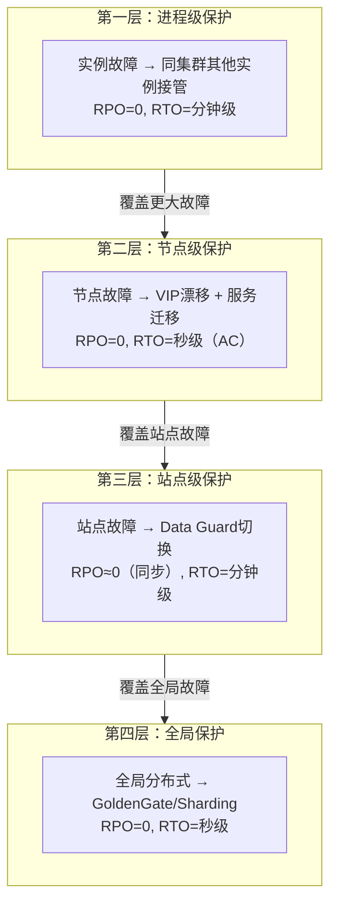
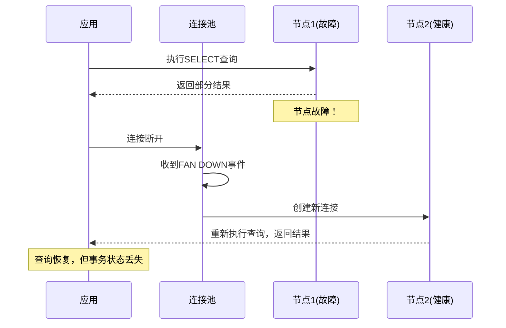
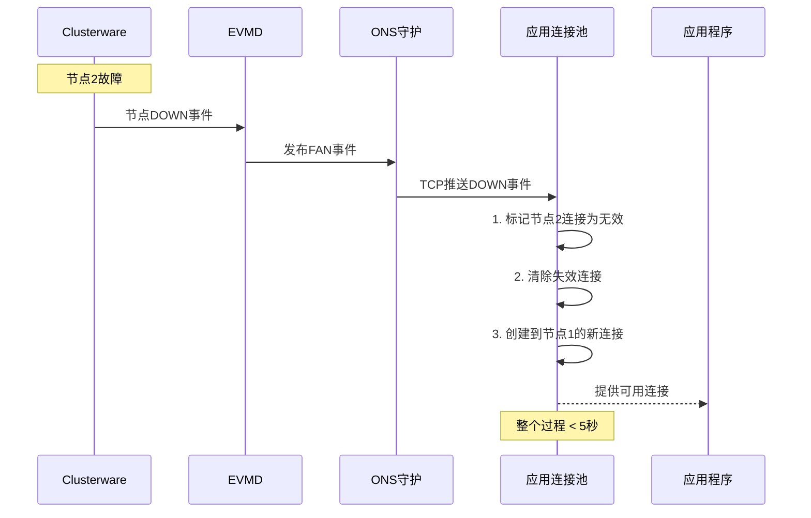
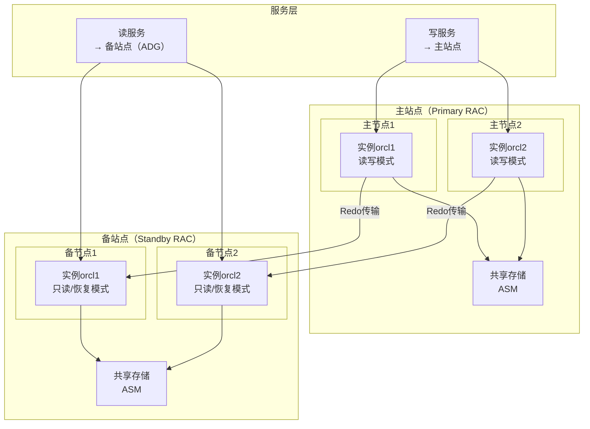
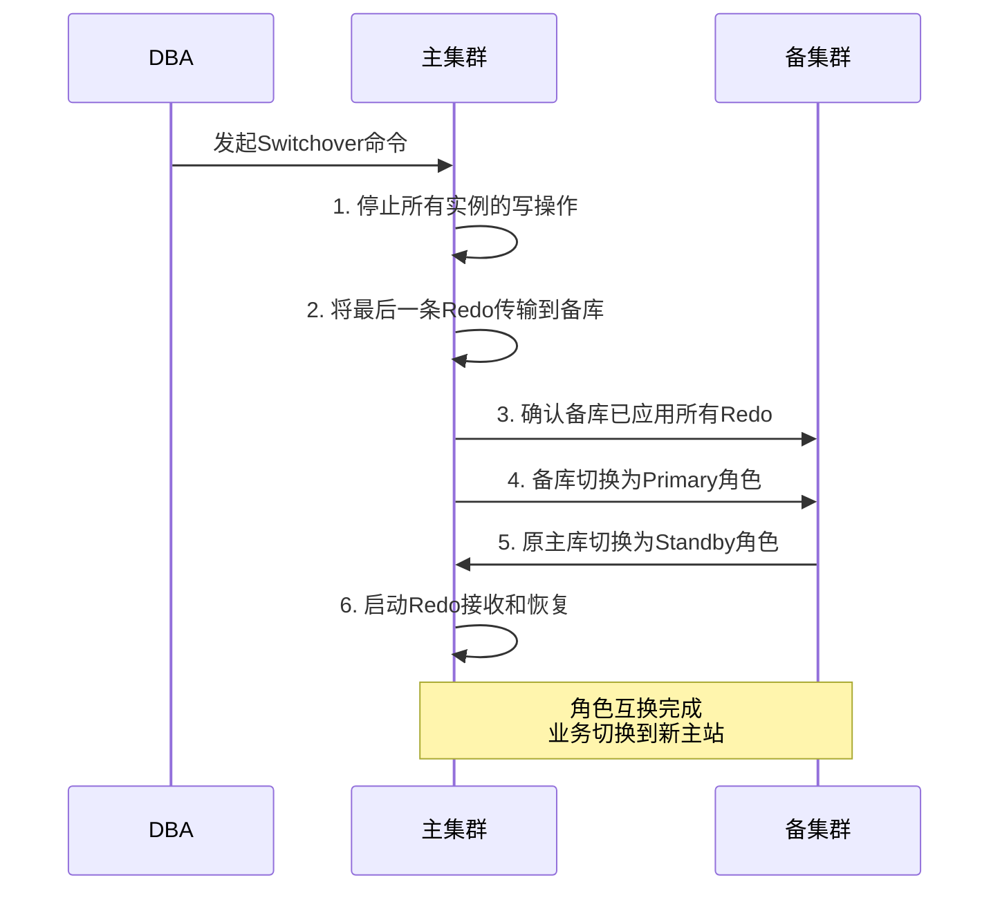
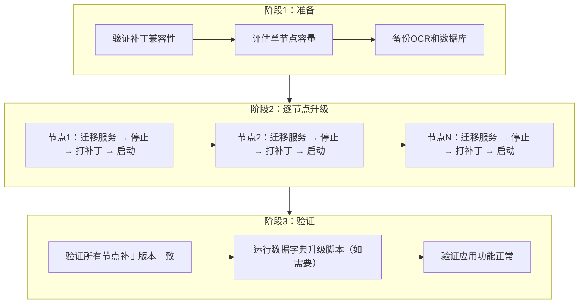
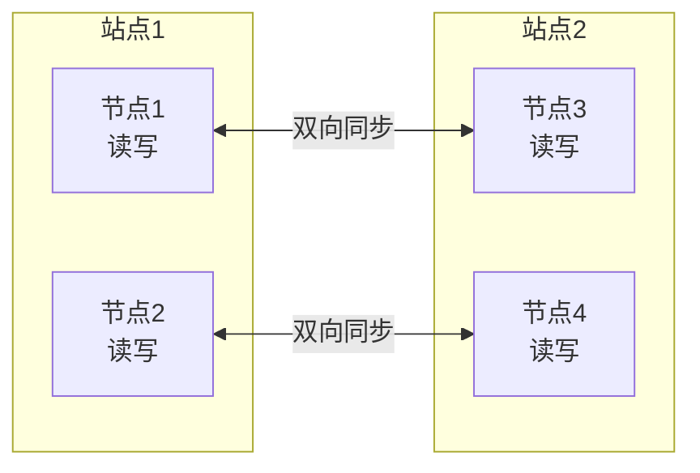
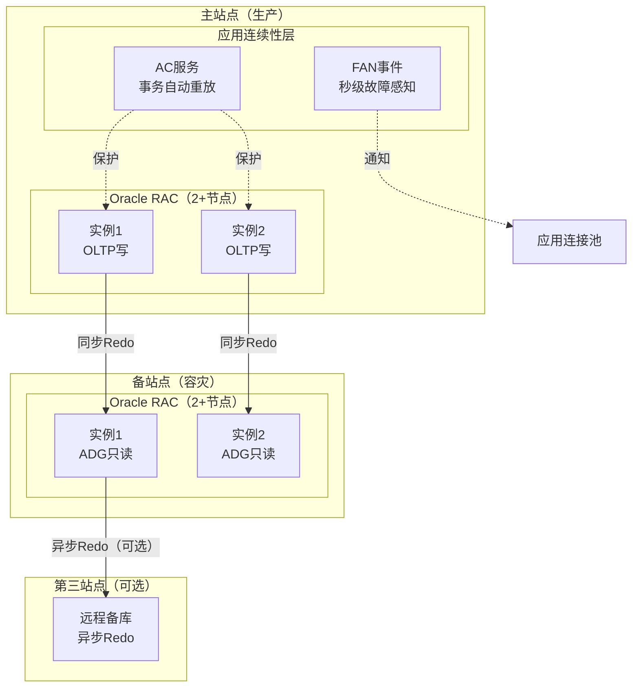

# 高可用与容灾架构

> **适用读者**：负责高可用架构设计的架构师、高级DBA
>
> **学习目标**：理解应用连续性技术体系，掌握集群与Data Guard容灾的结合方案，了解集群架构演进趋势
>
> **前置知识**：[集群性能调优实战](05-集群性能调优实战.md)

---

## 一、概述

### 1.1 一句话定义

Oracle集群的高可用与容灾架构是**从单集群内的节点级故障转移，扩展到跨站点的应用连续性保护和零数据丢失容灾**的完整体系，目标是实现"接近零停机、接近零数据丢失"的业务连续性保障。

### 1.2 为什么重要

- **不掌握的后果**：
  - 单集群只能应对节点级故障，无法应对站点级灾难（机房断电、自然灾害）
  - 应用故障转移体验差（事务丢失、用户需手动重连）
  - 无法设计满足RPO/RTO要求的高可用架构

- **掌握的价值**：
  - 能够设计满足业务RPO/RTO要求的完整高可用架构
  - 理解Application Continuity等高级技术，实现应用无感知故障转移
  - 能够规划集群与Data Guard结合的跨站点容灾方案

### 1.3 适用场景

| 场景 | 说明 |
|------|------|
| **站点级容灾** | 应对机房级故障（断电、火灾、洪水） |
| **应用连续性** | 关键业务要求故障转移时事务不丢失 |
| **滚动升级** | 硬件/软件更新期间业务零停机 |
| **架构演进** | 从传统双活集群向现代化高可用架构演进 |

### 1.4 版本演进

| 版本 | 变化说明 |
|------|---------|
| 11gR2 | TAF（Transparent Application Failover）；FAN事件基础支持 |
| 12cR1 | Application Continuity（AC）首次引入；MAA参考架构成熟 |
| 12cR2 | AC增强：支持Java/XA事务；Transparent Application Continuity（TAC） |
| 19c | AC/TAC进一步完善；Active Data Guard DML重定向；Switchover自动化 |
| 21c | 进一步增强应用连续性和自动化故障转移能力 |

---

## 二、术语与概念

### 2.1 核心术语表

| 术语 | 含义 | 类比 |
|------|------|------|
| **RPO** | Recovery Point Objective，恢复点目标 | 最多能接受丢失多少数据 |
| **RTO** | Recovery Time Objective，恢复时间目标 | 最多能接受停机多长时间 |
| **TAF** | Transparent Application Failover，透明应用故障转移 | 柜台换了，查询自动继续 |
| **AC** | Application Continuity，应用连续性 | 柜台换了，交易自动重做 |
| **TAC** | Transparent Application Continuity | AC的增强版，对应用完全透明 |
| **FAN** | Fast Application Notification，快速应用通知 | 银行广播：3号柜台暂停服务 |
| **Data Guard** | Oracle数据保护与容灾技术 | 在另一个城市建一个备份银行 |
| **Switchover** | 计划内角色切换（主备互换） | 计划内换班，两边都准备好 |
| **Failover** | 故障时自动切换（备升主） | 紧急情况，备岗直接接管 |
| **MAA** | Maximum Availability Architecture，最高可用架构 | Oracle官方的"满分"高可用方案 |

### 2.3 高可用层次模型



---

## 三、应用连续性技术体系

### 3.1 客户端故障切换（TAF）

**机制**：当连接的节点故障时，客户端驱动自动创建到新节点的连接，并重新执行未完成的查询。

**局限性**：

| 方面 | TAF能力 | 局限 |
|------|---------|------|
| 未完成的SELECT | 可以恢复 | 在新节点重新执行查询 |
| 未完成的事务 | 不能保护 | 事务被中断，需要应用重试 |
| DML操作 | 不能保护 | INSERT/UPDATE/DELETE丢失 |
| 会话状态 | 部分恢复 | 需要重新设置NLS参数等 |



### 3.2 服务器端事件驱动（FAN）

**FAN（Fast Application Notification）** 是集群件发布的实时事件通知机制：

**事件类型**：

| 事件 | 触发条件 | 应用响应 |
|------|---------|---------|
| **UP** | 资源启动完成 | 连接池添加新节点连接 |
| **DOWN** | 资源停止/故障 | 连接池清除该节点连接 |
| **RESTART** | 资源即将重启 | 连接池准备切换 |
| **NODE** | 节点状态变化 | 连接池更新可用节点列表 |

**FAN工作流程**：



**配置FAN**：

```bash
# 配置ONS（Oracle Notification Service）
# 在应用服务器端配置ons.config
$ cat $ORACLE_HOME/opmn/conf/ons.config
local_port=6100
remote_port=6200
nodes=rac1:6200,rac2:6200

# 使用racgwrap测试FAN事件
$ racgwrap check
```

**连接池配置（UCP示例）**：

```ini
# Universal Connection Pool 配置
UCPDataSource.setFastConnectionFailoverEnabled(true);
UCPDataSource.setONSConfiguration("nodes=rac1:6200,rac2:6200");
```

### 3.3 内核级事务自动重放（Application Continuity）

**AC的核心思想**：在故障切换后，数据库自动重放故障期间已提交但未返回确认的事务，使应用完全无感知。

**AC的工作原理**：

```mermaid
sequenceDiagram
    participant App as 应用
    participant DB as 数据库(节点1)
    participant Redo as Redo日志
    participant DB2 as 数据库(节点2)

    App->>DB: BEGIN; INSERT...; UPDATE...; COMMIT;
    DB->>Redo: 记录所有操作到redo
    DB->>DB: 事务提交成功
    Note over DB: 返回确认前，节点故障！
    Note over DB: 确认未送达应用

    Note over DB2: 故障转移发生
    DB2->>Redo: 读取已提交但未确认的事务
    DB2->>DB2: 重放事务（安全重做）
    DB2-->>App: 返回"提交成功"
    Note over App: 应用认为事务正常完成<br/>完全无感知！
```

**AC的保护范围**：

| 操作类型 | 是否保护 | 说明 |
|---------|---------|------|
| SELECT查询 | ✓ | 重新执行查询 |
| INSERT/UPDATE/DELETE | ✓ | 通过重放恢复 |
| COMMIT后的确认 | ✓ | 核心能力——提交后确认不丢失 |
| 未COMMIT的事务 | ✗ | 需要应用重试 |
| 外部交互（发邮件等） | ✗ | 无法安全重放 |
| PL/SQL中的DBMS_OUTPUT | ✗ | 输出缓冲区不重放 |

**配置Application Continuity**：

```bash
# 步骤1：创建AC服务
$ srvctl add service -d orcl -s ac_svc \
    -preferred "rac1,rac2" \
    -commit_outcome TRUE \
    -retention 86400 \
    -notification TRUE \
    -failovertype AUTO \
    -failoverretry 30 \
    -failoverdelay 3

# 步骤2：授予执行权限
sqlplus / as sysdba
SQL> EXECUTE DBMS_APP_CONT_ADMIN.GRANT_PERMISSIONS('APP_USER');

# 步骤3：应用连接使用AC服务
# JDBC URL: jdbc:oracle:thin:@scan:1521/ac_svc
```

**AC vs TAF vs TAC 对比**：

| 特性 | TAF | AC | TAC |
|------|-----|-----|-----|
| 查询恢复 | ✓ | ✓ | ✓ |
| 事务保护 | ✗ | ✓ | ✓ |
| DML重放 | ✗ | ✓ | ✓ |
| 应用改造 | 需要配置TAF | 需要AC服务 | 无需改造 |
| 版本要求 | 9i+ | 12cR1+ | 12cR2+ |
| 性能开销 | 低 | 中（记录重放信息） | 低（优化后） |

---

## 四、集群与容灾复制结合

### 4.1 RAC + Data Guard 架构

**架构设计**：主站点和备站点都是RAC集群，通过Data Guard实现跨站点数据保护。



### 4.2 日志传输与协同

**Redo传输模式**：

| 模式 | 同步/异步 | RPO | 性能影响 | 适用场景 |
|------|---------|-----|---------|---------|
| **Maximum Protection** | 同步（AFFIRM） | 0 | 高（等待备库确认） | 零数据丢失要求 |
| **Maximum Availability** | 同步（正常）/异步（降级） | 0/少量 | 中 | 兼顾性能和安全 |
| **Maximum Performance** | 异步（NOAFFIRM） | 少量 | 低 | 性能优先 |

**RAC主库的Redo传输配置**：

```sql
-- 配置Redo传输到备库（所有节点都需要配置）
ALTER SYSTEM SET LOG_ARCHIVE_DEST_2 =
    'SERVICE=standby_scan ASYNC VALID_FOR=(ONLINE_LOGFILES,PRIMARY_ROLE)
     DB_UNIQUE_NAME=standby'
    SCOPE=BOTH;

-- 启用Redo传输
ALTER SYSTEM SET LOG_ARCHIVE_DEST_STATE_2 = ENABLE;
```

> **关键点**：RAC环境中每个实例都独立传输Redo到备库，备库的恢复进程会合并来自所有主库实例的Redo流。

### 4.3 角色切换

**Switchover（计划内切换）**：



```bash
# 使用Data Guard Broker执行Switchover
$ dgmgrl sys/password@primary_scan
DGMGRL> SHOW CONFIGURATION;
DGMGRL> SWITCHOVER TO standby;
# 自动完成所有步骤
```

**Failover（故障切换）**：

- 主站点完全不可用时触发
- 备站点提升为新的主库
- 可能丢失未传输的Redo（取决于传输模式）
- 原主库恢复后需要重建为新的备库

### 4.4 Active Data Guard 只读扩展

**ADG的价值**：备库在应用Redo的同时，可以开放为只读模式，承载报表查询等读负载。

```sql
-- 开启Active Data Guard（备库只读模式）
-- 在备库执行
ALTER DATABASE OPEN READ ONLY;

-- 19c新增：ADG DML重定向
-- 备库上的DML自动重定向到主库执行
ALTER SYSTEM SET ADG_REDIRECT_DML = TRUE;
```

**读写分离架构**：

| 工作负载 | 路由到 | 说明 |
|---------|--------|------|
| OLTP写操作 | 主集群 | 读写模式 |
| 报表查询 | 备集群（ADG） | 只读模式，分担主库压力 |
| 备份操作 | 备集群 | 减少主库备份压力 |

---

## 五、零停机维护与架构演进

### 5.1 滚动升级机制

**原理**：逐节点停止、更新、启动，其他节点继续服务。关键在于服务迁移和版本兼容。

**滚动升级流程**：



**关键注意事项**：

- 滚动升级期间，运行的节点版本高于停止的节点（向前兼容）
- 数据库版本升级时，数据字典升级（`catbundle.sql`等）需要在所有节点升级完成后执行
- GI补丁可以滚动，但数据库RU通常也需要滚动应用

### 5.2 集群形态演进

**对称全活集群（Symmetric Active-Active）**



- 所有节点同时提供读写服务
- 需要解决跨站点延迟问题
- 适用场景：同城双活数据中心

**中心辐射集群（Hub-Spoke / Stretch Cluster）**

- 中心节点（Hub）提供核心计算
- 辐射节点（Leaf/Spoke）提供扩展计算或只读服务
- 12cR1 Flex Cluster引入此拓扑

**单节点冷备集群**

- 一个完整的RAC集群 + 一个独立的冷备节点
- 冷备节点平时不运行实例，故障时启动
- 成本最低，但RTO最长

### 5.3 存储与计算分离趋势

**传统架构**：每个节点运行ASM实例，计算和存储紧耦合

**现代趋势**：

| 方面 | 传统 | 现代 |
|------|------|------|
| 存储 | 本地ASM + 共享SAN | 分布式存储/云存储 |
| 计算 | 固定节点 | 弹性伸缩 |
| 扩展 | 增加节点（需共享存储） | 计算和存储独立扩展 |
| 故障域 | 节点+存储 | 缩小的故障域 |

**Oracle Exadata 的存储服务器模型**：

- 计算节点（Database Server）只负责CPU和内存
- 存储节点（Storage Server）负责磁盘I/O和智能扫描
- 计算和存储可以独立扩展和升级

---

## 六、实战案例

### 6.1 案例背景

- **场景**：某银行核心系统Oracle 19c RAC（2节点）+ Data Guard（异地2节点RAC备库）
- **需求**：RPO=0，RTO < 30秒，年度计划内停机 < 15分钟
- **挑战**：主站点计划内维护时如何做到业务零感知

### 6.2 解决方案设计

**架构**：

- 主站点：2节点RAC，配置AC服务
- 备站点：2节点RAC ADG，同步Redo传输
- 应用层：UCP连接池 + FAN事件

**故障转移策略**：

| 故障类型 | 保护机制 | 预期RTO |
|---------|---------|---------|
| 单实例故障 | 集群内故障转移 + AC | < 15秒 |
| 单节点故障 | VIP漂移 + 服务迁移 + AC | < 30秒 |
| 主站点故障 | Data Guard自动切换 | < 5分钟 |
| 计划内维护 | Switchover | < 1分钟 |

### 6.3 实施效果

| 指标 | 目标 | 实际 |
|------|------|------|
| RPO | 0 | 0（同步传输） |
| RTO（节点故障） | < 30秒 | 12秒（AC重放） |
| RTO（站点切换） | < 5分钟 | 3分钟 |
| 计划内停机 | < 15分钟/年 | 8分钟/年（Switchover） |
| 应用感知 | 无感知 | 事务自动重放，用户无感 |

### 6.4 复盘总结

- **关键成功因素**：
  1. AC服务配置正确，覆盖了核心交易
  2. FAN事件配置到位，连接池秒级感知
  3. Data Guard同步传输确保RPO=0
- **经验教训**：
  1. AC不适用于所有事务——包含外部交互（如调用外部API）的事务需要应用层处理
  2. 定期进行Switchover演练，验证流程可靠性
  3. 监控Redo传输延迟，设置告警

---

## 七、常见错误与排查

### 7.1 常见错误列表

| 错误/现象 | 原因 | 解决方法 |
|---------|------|---------|
| AC未生效 | 服务未配置commit_outcome或应用未使用AC服务 | 检查服务配置，确认应用连接到AC服务 |
| FAN事件未收到 | ONS配置错误或网络不通 | 验证ONS配置，检查6200端口连通性 |
| Switchover失败 | Redo传输有gap | 先解决传输延迟，确保所有Redo已应用 |
| 备库延迟大 | 网络带宽不足或备库I/O瓶颈 | 检查网络，优化备库I/O |
| 滚动升级后版本不一致 | 某个节点补丁失败 | 检查OPatch日志，重新应用补丁 |

### 7.2 排查步骤

1. **检查AC配置**：`srvctl config service -d dbname -s svcname`
2. **检查FAN**：验证ONS配置和网络连通性
3. **检查Data Guard**：`dgmgrl> SHOW CONFIGURATION;`
4. **检查Redo传输**：`SELECT * FROM v$archive_dest_status WHERE dest_id=2;`
5. **检查应用连接**：确认应用使用的是正确的服务名

---

## 八、最佳实践

### 8.1 官方推荐（MAA参考架构）

- **最高可用性**：RAC + AC + Data Guard（同步） = MAA架构
- **服务配置**：核心交易使用AC服务，报表使用ADG只读服务
- **Redo传输**：关键业务使用Maximum Availability模式
- **定期演练**：每季度一次Switchover演练，每半年一次Failover演练

### 8.2 社区经验

- **AC不是万能的**：包含外部交互的事务需要特别处理
- **FAN是基础**：没有FAN，连接池无法快速感知故障
- **监控Redo延迟**：设置告警阈值（如 > 30秒），及时发现传输问题
- **文档化切换流程**：Switchover/Failover操作步骤文档化，定期演练

### 8.3 反模式

| 反模式 | 问题 | 正确做法 |
|--------|------|---------|
| 只依赖RAC不做容灾 | 无法应对站点级故障 | RAC + Data Guard组合 |
| 忽略应用连续性 | 故障转移时事务丢失，用户体验差 | 核心服务配置AC |
| 从不演练切换 | 真正故障时才发现流程有问题 | 定期Switchover/Failover演练 |
| 备库从不使用 | 备库闲置浪费资源，且无法验证可用性 | 开启ADG承载读负载 |

---

## 九、总结速查

### 9.1 黄金法则

1. **分层保护**：进程级 → 节点级 → 站点级 → 全局，每层都有对应技术
2. **AC是应用连续性的关键**：核心交易必须配置AC，实现事务级故障转移
3. **FAN是快速感知的基础**：连接池必须配置FAN，才能秒级感知故障
4. **演练是检验标准的唯一方式**：不演练的高可用等于没有高可用

### 9.2 一页纸检查清单

| 现象/场景 | 原因 | 处理方案 |
|-----------|------|----------|
| 故障转移后事务丢失 | 未配置AC或事务包含外部交互 | 配置AC服务，应用层处理外部交互 |
| 连接池切换慢（> 30秒） | FAN未配置或ONS不通 | 配置FAN，验证ONS连通性 |
| 备库Redo延迟大 | 网络带宽不足或主库负载过高 | 优化网络，调整传输模式 |
| Switchover失败 | Redo有gap或备库状态异常 | 先解决gap，确认备库状态 |

### 9.3 关键数字

| 指标 | 目标值 | 说明 |
|------|--------|------|
| AC故障转移时间 | < 15秒 | 含检测+重放 |
| FAN事件传播时间 | < 5秒 | ONS推送延迟 |
| Data Guard RPO | 0（同步） | Maximum Protection/Availability |
| Switchover时间 | < 1分钟 | 计划内切换 |
| 年度演练次数 | ≥ 4次 | 每季度一次 |

---

## 附录

### A. MAA参考架构图



### B. 官方参考

- [Oracle Maximum Availability Architecture (MAA)](https://www.oracle.com/database/technologies/availability/maa.html)
- [Oracle Data Guard Concepts and Administration](https://docs.oracle.com/en/database/oracle/oracle-database/19c/sbydb/)
- [Oracle Application Continuity Guide](https://docs.oracle.com/en/database/oracle/oracle-database/19c/jjucp/)
- [Oracle RAC Administration - Application Continuity](https://docs.oracle.com/en/database/oracle/oracle-database/19c/racad/)

### C. 修订记录

| 日期 | 版本 | 修改内容 | 修改人 |
|------|------|---------|--------|
| 2026-06-30 | v1.0 | 初始版本 | Oracle集群知识库 |

---

> **上一篇**：[集群性能调优实战](05-集群性能调优实战.md)
>
> **下一篇**：[集群内核机制深度解析](07-集群内核机制深度解析.md)
