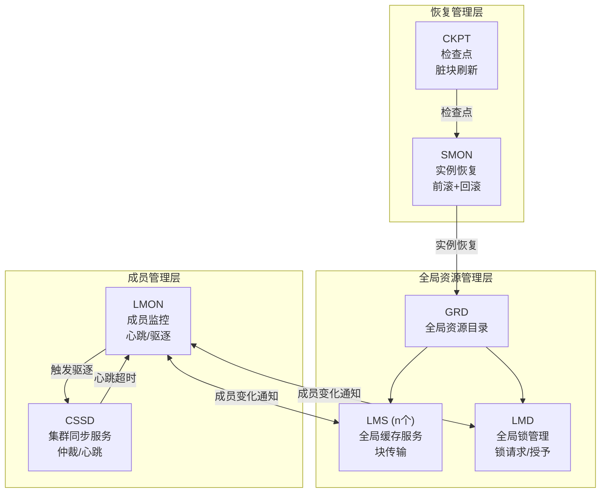
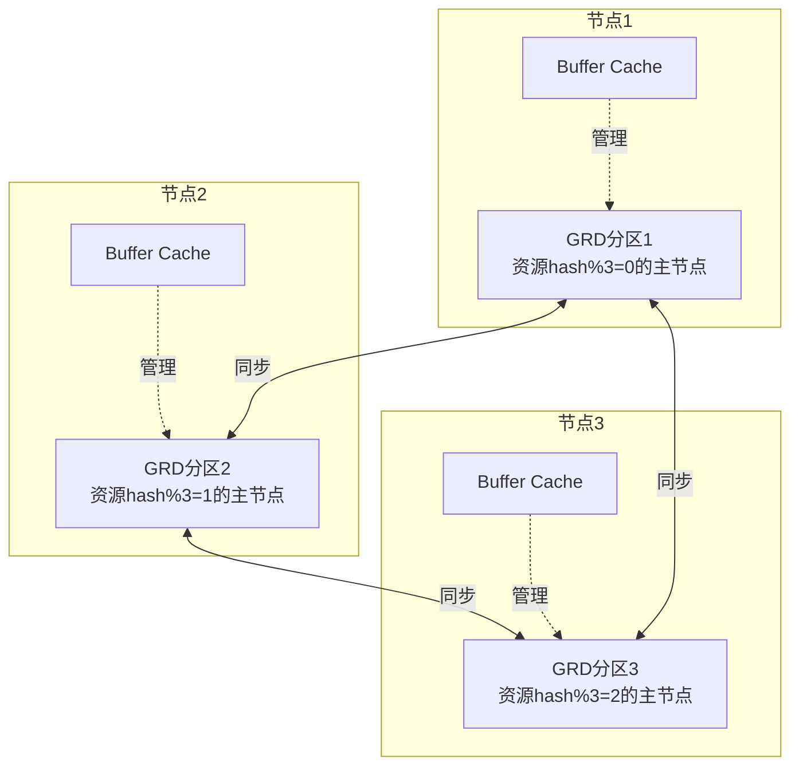
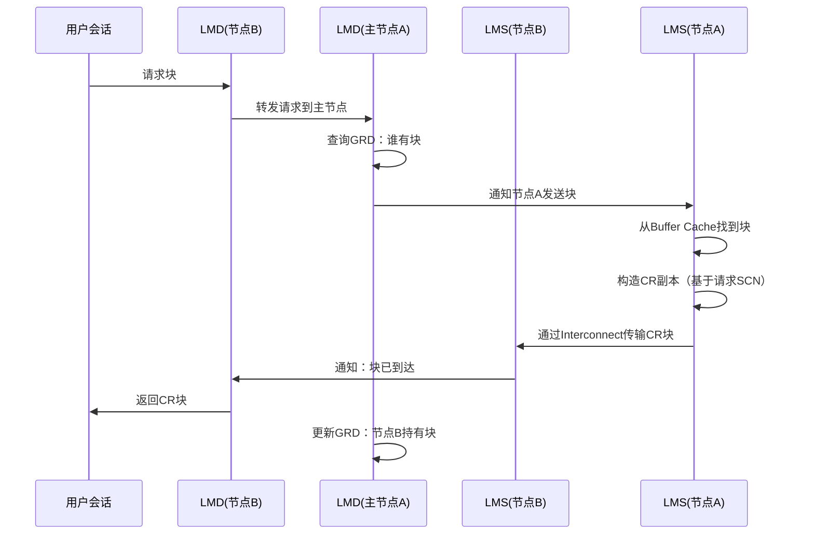
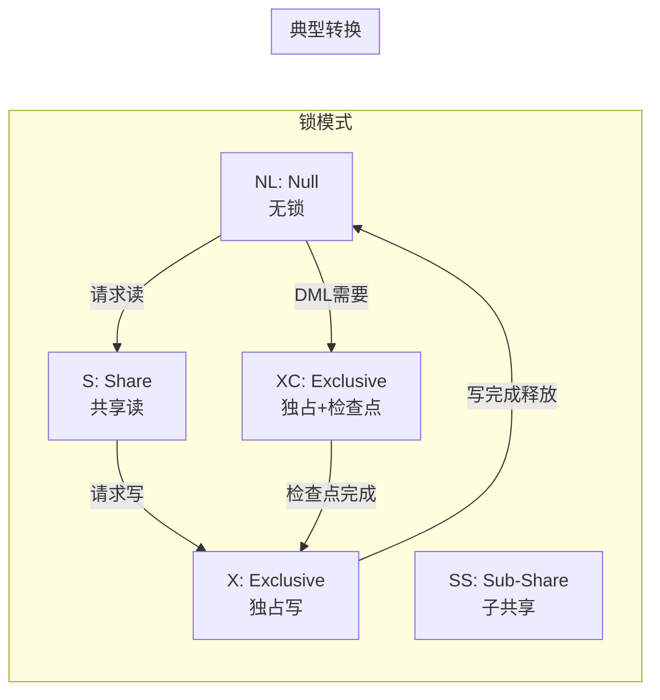
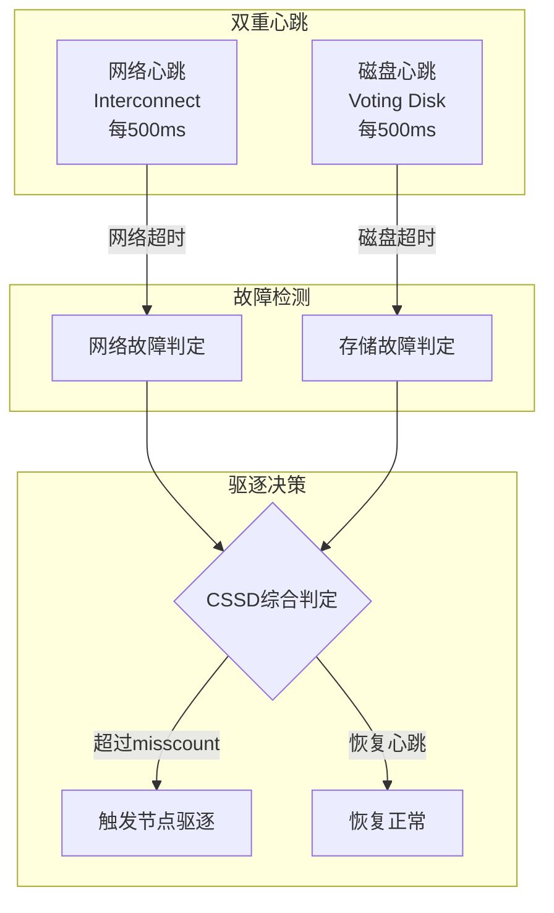
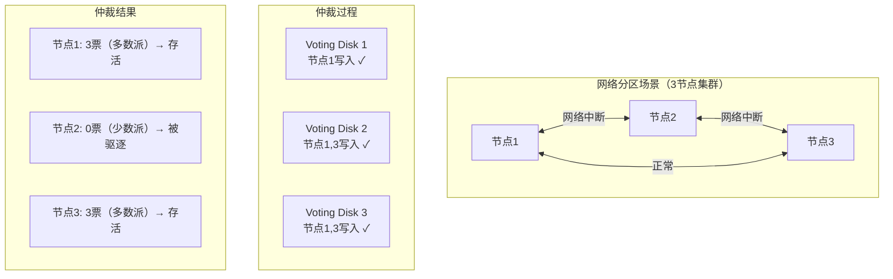
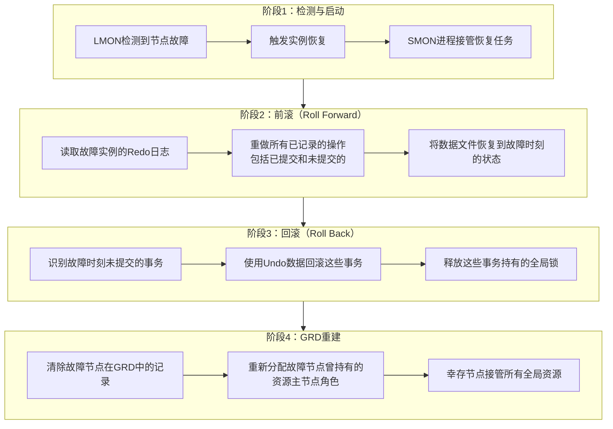
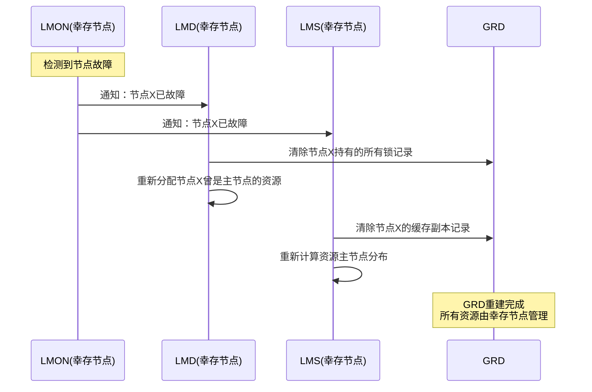
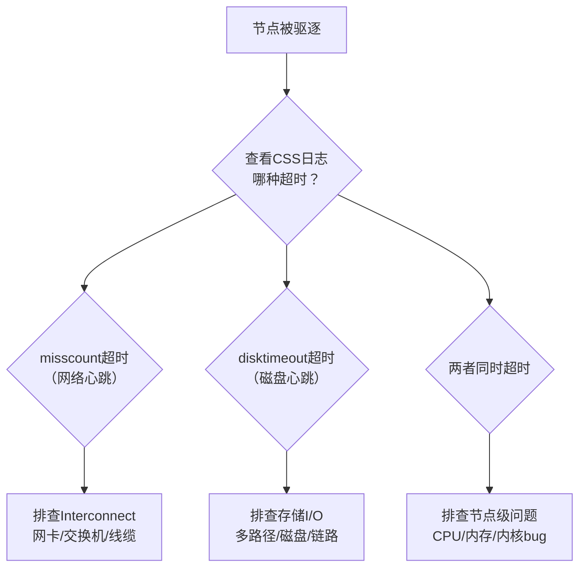

# 集群内核机制深度解析

> **适用读者**：高级RAC DBA、Oracle技术支持工程师、对内核机制感兴趣的技术专家
>
> **学习目标**：深入理解全局资源管理、节点成员管理、脑裂预防的底层算法，掌握标准化的灾难级故障根因分析方法
>
> **前置知识**：[高可用与容灾架构](06-高可用与容灾架构.md)

---

## 一、概述

### 1.1 一句话定义

集群内核机制是**Oracle RAC底层的全局资源目录管理、后台进程协作、数据块传输协议、节点成员管理与脑裂仲裁算法**的集合，是集群高可用和数据一致性的最终保障。当集群出现节点驱逐、脑裂、长时间恢复等灾难级问题时，只有深入内核才能进行根因分析。

### 1.2 为什么重要

- **不掌握的后果**：
  - 面对节点驱逐、脑裂等严重问题只能依赖Oracle Support
  - 无法理解集群"为什么做出某个决策"（如为什么驱逐了这个节点）
  - 缺乏系统化的故障分析方法论，排查效率低

- **掌握的价值**：
  - 能够独立进行灾难级故障的根因分析
  - 深入理解集群决策机制，做出更合理的架构和运维决策
  - 具备Oracle RAC专家级技术能力

### 1.3 适用场景

| 场景 | 说明 |
|------|------|
| **节点驱逐分析** | 分析为什么节点被驱逐，根因是什么 |
| **脑裂诊断** | 分析脑裂场景下的仲裁决策过程 |
| **长时间恢复** | 分析实例恢复时间过长的原因 |
| **性能瓶颈定位** | 从内核层面定位Cache Fusion瓶颈 |
| **架构设计** | 深入理解内核限制，设计更合理的架构 |

---

## 二、术语与概念

### 2.1 核心术语表

| 术语 | 含义 | 类比 |
|------|------|------|
| **GRD** | Global Resource Directory，全局资源目录 | 全球快递分拣中心的总目录 |
| **Master Node** | 资源主节点，负责协调特定资源 | 区域分拣中心负责人 |
| **Remastering** | 资源主节点迁移 | 更换区域负责人 |
| **LMS** | Global Cache Service，块传输进程 | 快递员 |
| **LMD** | Global Enqueue Service，锁管理进程 | 签证官——发放和管理通行证 |
| **LMON** | Global Enqueue Service Monitor，成员监控 | 保安队长——监控谁在岗 |
| **LCK0** | Lock Process，锁进程 | 锁匠——管理非缓存资源锁 |
| **Fencing** | 节点隔离/驱逐 | 将危险人员请出大楼 |
| **Eviction** | 节点驱逐 | 开除员工 |
| **I/O Fencing** | 通过存储层隔离故障节点 | 取消员工的门禁卡 |
| **Checkpoint** | 检查点，确保脏块写入磁盘 | 定期把修改记录归档到金库 |

### 2.2 内核进程全景图



---

## 三、全局资源与缓存管理内核

### 3.1 全局资源目录（GRD）

**GRD是什么**：

GRD是Oracle RAC的核心数据结构，它记录了所有全局资源（数据块、锁）的状态信息，包括：谁持有该资源、以什么模式持有、谁在等待该资源。

**GRD的分布方式**：

GRD不是集中存储的，而是分布在所有节点上。每个资源有一个"主节点"（Master Node），负责管理该资源的GRD条目。



**资源主节点分配算法**：

- 资源通过哈希函数分配到主节点：`master_node = hash(resource_name) % num_nodes`
- 数据块资源的名称格式为：`[数据块地址][资源类型]`（如 `[0x1a2b3c,0x15],[BL]`）
- 这种分配方式保证资源均匀分布在所有节点上

**动态重主（Dynamic Remastering）**：

当某个资源的访问模式发生变化（如原本主要由节点1访问的资源，现在主要由节点2访问），Oracle会将该资源的主节点迁移到节点2，减少跨节点锁请求的延迟。

```sql
-- 查看Remastering历史
SELECT object_id, policy, freezing_time, frozen_time,
       recovery_time, remaster_time
FROM gv$policy_history
ORDER BY remaster_time DESC;

-- 查看当前对象的GRD分布
SELECT inst_id, file_id, block_id,
       master_node, policy
FROM gv$gcspfmo_statistics
WHERE object_id = &obj_id;
```

### 3.2 后台进程协作模型

**各进程精确分工**：

| 进程 | 职责 | 类比 | 数量 |
|------|------|------|------|
| **LMS** | 处理CR和Current块请求，执行块传输，维护本地GRD副本 | 快递员 | 每实例2-5个 |
| **LMD** | 处理全局锁请求（授予/转换/释放），管理全局队列 | 签证官 | 每实例1-2个 |
| **LMON** | 监控节点成员变化，在节点加入/离开时执行GRD重配 | 保安队长 | 每实例1个 |
| **LCK0** | 管理非缓存资源的全局锁（如字典锁、库缓存锁） | 锁匠 | 每实例1个 |

**进程间协作流程（以块请求为例）**：



### 3.3 数据块传输机制

**传输模式**：

| 模式 | 场景 | 锁模式 | 说明 |
|------|------|--------|------|
| **CR传输** | SELECT查询 | CR模式（S/SS） | 构造一致性读副本，基于请求SCN回滚 |
| **Current传输** | DML操作 | Current模式（X/XC） | 传输最新版本的数据块 |
| **Past Image** | 特殊场景 | — | 传输块的过去版本（用于恢复） |

**锁模式与角色转换**：



**块传输的性能指标**：

```sql
-- 查看块传输性能
SELECT inst_id,
       cr_requests,
       current_requests,
       cr_block_time / NULLIF(cr_requests, 0) / 10000 AS avg_cr_time_ms,
       current_block_time / NULLIF(current_requests, 0) / 10000 AS avg_cur_time_ms,
       cr_block_failures + current_block_failures AS total_failures,
       ROUND((cr_block_failures + current_block_failures) * 100.0
             / NULLIF(cr_requests + current_requests, 0), 4) AS failure_pct
FROM gv$cr_block_server
JOIN gv$current_block_server USING (inst_id);
```

---

## 四、节点成员管理与脑裂预防

### 4.1 双重心跳机制

Oracle RAC使用两种独立的心跳机制来检测节点存活：

| 心跳类型 | 通道 | 频率 | 用途 |
|---------|------|------|------|
| **网络心跳** | Private Interconnect | 每500ms一次 | 快速检测网络连通性 |
| **磁盘心跳** | Voting Disk | 每500ms一次 | 检测存储I/O能力 |

**双重心跳的互补保护**：



**关键参数**：

| 参数 | 默认值 | 说明 |
|------|--------|------|
| `disktimeout` | 200秒 | 磁盘心跳超时阈值 |
| `misscount` | 30秒 | 网络心跳超时阈值 |
| `reboottime` | 3秒 | 驱逐后重启等待时间 |

```bash
# 查看心跳参数
$ cssctl parameter misscount
# CSS would like to set misscount to 30000 (30 seconds)

$ cssctl parameter disktimeout
# CSS would like to set disktimeout to 200000 (200 seconds)
```

### 4.2 脑裂仲裁算法

**脑裂场景**：

当Interconnect网络中断但存储仍然可达时，集群可能分裂为多个子集，每个子集都认为其他节点已故障。

**仲裁算法**：



**不同配置下的仲裁结果**：

| 配置 | Voting Disk数 | 存活需要票数 | 可容忍节点丢失 |
|------|--------------|-------------|---------------|
| 2节点 + 1 VD | 1 | 1 | 0（不推荐） |
| 2节点 + 3 VD | 3 | 2 | 1 |
| 3节点 + 3 VD | 3 | 2 | 1 |
| 4节点 + 5 VD | 5 | 3 | 2 |
| 5节点 + 5 VD | 5 | 3 | 2 |

**仲裁设备选择**：

| 方案 | 适用场景 | 优缺点 |
|------|---------|--------|
| ASM Voting Disk | 使用ASM的集群（推荐） | 自动镜像，管理简单 |
| 外部冗余存储 | SAN环境 | 依赖存储可靠性 |
| 仲裁节点（Quorum Node） | 偶数节点集群 | 虚拟节点提供额外投票 |

### 4.3 标准化根因分析流程

当发生节点驱逐等严重问题时，按以下标准化流程进行根因分析：

**步骤1：时间线确认**

```bash
# 从所有节点收集日志，锁定事件发生的精确时间
# 关键日志文件：
# - $GRID_HOME/log/<hostname>/alert_<hostname>.log
# - $GRID_HOME/log/<hostname>/cssd/ocssd.log
# - $GRID_HOME/log/<hostname>/crsd/crsd.log
# - /var/log/messages (OS日志)

# 搜索关键事件
$ grep -i "evict\|reconfig\|heartbeat\|misscount\|disktimeout" \
    $GRID_HOME/log/$(hostname)/alert_$(hostname).log | tail -50
```

**步骤2：日志收集关键域**

| 日志域 | 文件位置 | 关注内容 |
|--------|---------|---------|
| CRS日志 | `$GRID_HOME/log/<host>/crsd/` | 资源状态变化 |
| CSS日志 | `$GRID_HOME/log/<host>/cssd/` | 心跳、驱逐决策 |
| OS日志 | `/var/log/messages` | 内核panic、OOM、网络事件 |
| ASM日志 | `$GRID_HOME/log/<host>/alert_+ASM*.log` | 存储访问异常 |
| 数据库日志 | `$ORACLE_BASE/diag/rdbms/.../trace/alert_*.log` | 实例状态变化 |

**步骤3：关键信息搜索**

```bash
# 搜索驱逐相关关键词
$ grep -E "ERROR|WARNING|evict|reboot|fencing|lost|timeout|hung" \
    $GRID_HOME/log/$(hostname)/cssd/ocssd.log | tail -100

# 搜索I/O相关事件
$ grep -i "i/o\|disk\|storage\|asm" \
    /var/log/messages | tail -50

# 搜索内存/CPU相关事件
$ grep -i "oom\|out of memory\|killed process\|cpu.*throttl" \
    /var/log/messages | tail -50
```

**步骤4：根因分类判定**

| 根因类别 | 典型日志特征 | 排查方向 |
|---------|------------|---------|
| **I/O子系统hang** | `disktimeout expired`，ASM I/O延迟飙升 | 检查存储链路、多路径、磁盘健康 |
| **内存耗尽** | OOM killer日志，`killed process` | 检查SGA/PGA配置，是否有内存泄漏 |
| **CPU资源抢占** | CPU 100%，`cssd`进程得不到调度 | 检查是否有CPU密集型进程抢占 |
| **Interconnect中断** | `network heartbeat missed`，ping超时 | 检查网卡、交换机、线缆 |
| **第三方集群件冲突** | 非Oracle进程修改了Voting Disk | 检查是否有其他HA软件运行 |

---

## 五、崩溃恢复与缓存重建内幕

### 5.1 实例恢复步骤

当RAC中一个节点故障，幸存节点的SMON进程会对故障实例执行恢复：



**前滚过程详解**：

- SMON从故障实例的最后检查点开始，读取Redo日志
- 逐条重做Redo中的操作，将数据块恢复到故障时刻的状态
- 前滚的范围 = 最后一个检查点 → 故障时刻（Redo日志的末尾）
- 前滚时间取决于：检查点频率 × Redo生成速率

**回滚过程详解**：

- 前滚完成后，SMON识别出故障时刻未提交的事务
- 使用Undo段中的旧值，逐一回滚这些事务的修改
- 回滚是异步进行的，不阻塞其他事务
- 回滚时间取决于：未提交事务的数量和大小

### 5.2 缓存重建过程

故障节点的Buffer Cache中的全局锁信息需要被清除和重建：



**Remastering during Recovery**：

- 故障节点曾是主节点的资源需要重新分配
- 幸存节点会触发批量Remastering操作
- 大量Remastering期间可能出现短暂的 `gc remaster` 等待

### 5.3 恢复性能影响

**影响恢复时间的因素**：

| 因素 | 影响 | 优化方向 |
|------|------|---------|
| Redo量 | 前滚范围大 → 恢复时间长 | 增加检查点频率 |
| 未提交事务量 | 回滚时间长 | 控制长事务，优化应用 |
| 磁盘I/O性能 | 影响Redo读取和脏块写入速度 | 优化存储I/O |
| 并行恢复 | 多进程并行前滚 | 配置 `FAST_START_PARALLEL_ROLLBACK` |

**优化恢复时间**：

```sql
-- 设置MTTR目标（Mean Time To Recovery）
ALTER SYSTEM SET FAST_START_MTTR_TARGET = 60;
-- 目标：60秒内完成实例恢复
-- Oracle会自动调整检查点频率来满足此目标

-- 查看当前MTTR建议
SELECT target_mttr, estimated_mttr, writes_mttr
FROM v$instance_recovery;

-- 配置并行回滚
ALTER SYSTEM SET FAST_START_PARALLEL_ROLLBACK = 'HIGH';
-- LOW: 回滚并行度 = 2 * CPU_COUNT
-- HIGH: 回滚并行度 = 4 * CPU_COUNT
```

**监控恢复进度**：

```sql
-- 查看恢复进度
SELECT usn, state, undoblocksdone, undoblockstotal,
       cputime, parentusn
FROM v$fast_start_servers;

-- 查看预计恢复完成时间
SELECT state, undoblocksdone, undoblockstotal,
       ROUND(undoblockstotal / NULLIF(undoblocksdone, 0) * cputime - cputime, 0)
       AS remaining_seconds
FROM v$fast_start_servers
WHERE state != 'RECOVERED';
```

---

## 六、实战案例

### 6.1 案例背景

- **场景**：某核心系统Oracle 19c RAC（3节点），凌晨3:00节点2被驱逐
- **现象**：应用报错"connection reset"，约2分钟后自动恢复
- **挑战**：需要确定根因——是网络问题、存储问题还是OS问题

### 6.2 诊断过程

**步骤1：时间线确认**

```bash
$ grep -i "evict\|reconfig\|misscount\|heartbeat" \
    /u01/app/grid/diag/crs/rac1/trace/alert_rac1.log
```

- → 发现：
  - 03:00:15 — `Network heartbeat missed with rac2`
  - 03:00:25 — `Disk heartbeat timeout for rac2`
  - 03:00:28 — `Initiating eviction of rac2`
  - 03:00:31 — `Eviction complete, reconfiguration started`
  - 03:01:45 — `Reconfiguration complete, GRD rebuilt`
- → 判断：网络心跳和磁盘心跳几乎同时超时，可能是节点级问题

**步骤2：检查节点2的OS日志**

```bash
$ ssh rac2
$ grep -i "error\|warn\|oom\|kill\|i/o\|hung" /var/log/messages | grep "03:0"
```

- → 发现：
  - 02:58:30 — `kernel: INFO: task kworker/2:1:456 blocked for more than 120 seconds`
  - 02:59:00 — `kernel: INFO: task jbd2/dm-3-8:789 blocked for more than 120 seconds`
  - 03:00:00 — `kernel: task cssd:1234 still blocked, CPU soft lockup`
- → 判断：节点2在02:58开始出现进程阻塞，可能是I/O子系统hang

**步骤3：检查存储I/O**

```bash
$ ssh rac2
$ iostat -x 1 5
```

- → 发现：
  - Voting Disk所在LUN的 `await` 值 > 5000ms（正常应 < 10ms）
  - 数据磁盘的I/O正常
- → 判断：Voting Disk所在存储路径出现I/O hang

**步骤4：交叉验证**

```bash
# 在节点1检查Voting Disk的I/O延迟
$ crsctl get css disktimeout
# disktimeout = 200000 (200 seconds)

# 检查多路径状态
$ multipath -ll | grep vote
```

- → 发现：Voting Disk的一条存储路径在02:57变为 `faulty`
- → 根因定位：存储路径故障导致Voting Disk I/O延迟飙升，触发 `disktimeout`，节点2被驱逐

### 6.3 解决结果

| 指标 | 值 |
|------|-----|
| 故障开始时间 | 02:58:30（I/O路径故障） |
| 驱逐触发时间 | 03:00:28（disktimeout） |
| 驱逐完成时间 | 03:00:31 |
| GRD重建完成 | 03:01:45 |
| 应用恢复时间 | 约2分钟 |
| 数据一致性 | 完全一致 |

### 6.4 复盘总结

- **根因**：Voting Disk所在存储路径故障，I/O延迟超过disktimeout阈值
- **修复措施**：
  1. 修复存储路径，恢复多路径冗余
  2. 重启节点2加入集群
  3. 添加存储路径监控告警
- **教训**：
  1. 双重心跳机制正确工作——网络心跳和磁盘心跳同时检测到问题
  2. 存储路径监控是必要的——应提前发现路径故障
  3. 标准化的根因分析流程（时间线→日志→交叉验证）高效定位了问题

---

## 七、常见错误与排查

### 7.1 常见错误列表

| 错误/现象 | 可能根因 | 排查方法 |
|---------|---------|---------|
| 节点反复被驱逐 | I/O不稳定或Interconnect间歇性故障 | 检查CSS日志中的超时类型 |
| 实例恢复时间 > 10分钟 | Redo量大或检查点间隔过长 | 检查 `FAST_START_MTTR_TARGET` 设置 |
| GRD重建期间性能骤降 | 大量Remastering操作 | 正常现象，等待重建完成 |
| 脑裂后两个子集都存活 | Voting Disk配置不当 | 检查Voting Disk数量和分布 |
| CSS进程CPU占用100% | 大量GRD操作或进程竞争 | 检查是否有大量Remastering |

### 7.2 根因分析快速参考



---

## 八、最佳实践

### 8.1 官方推荐

- **Voting Disk**：至少3个，分布在不同存储设备，使用ASM NORMAL冗余
- **心跳参数**：不要随意修改 `misscount` 和 `disktimeout`，除非Oracle Support建议
- **MTTR设置**：生产环境设置 `FAST_START_MTTR_TARGET` 为60-300秒
- **日志收集**：定期归档集群日志，保留至少30天

### 8.2 社区经验

- **建立基线**：记录正常情况下的CSS日志模式，异常时快速对比
- **自动化日志分析**：编写脚本自动提取关键事件，生成时间线
- **定期演练驱逐**：在测试环境模拟节点驱逐，验证恢复流程
- **存储路径监控**：对Voting Disk的I/O延迟设置 < 100ms的告警

### 8.3 反模式

| 反模式 | 问题 | 正确做法 |
|--------|------|---------|
| 随意增大misscount | 故障检测变慢，业务中断时间更长 | 使用默认值，除非有明确理由 |
| 忽略CSS日志 | 无法理解驱逐决策的原因 | 每次驱逐后都要分析CSS日志 |
| 单Voting Disk | 无法容忍任何存储故障 | 至少3个Voting Disk |
| 不设置MTTR目标 | 恢复时间不可控 | 设置合理的 `FAST_START_MTTR_TARGET` |

---

## 九、总结速查

### 9.1 黄金法则

1. **GRD是集群的大脑**：理解资源主节点分配和Remastering是理解集群行为的关键
2. **双重心跳是安全网**：网络心跳 + 磁盘心跳互补，确保任何单一路径故障都能检测
3. **多数派决定存亡**：Voting Disk仲裁遵循多数派原则，奇数配置是硬性要求
4. **恢复时间可预测**：通过MTTR目标和检查点频率控制恢复时间

### 9.2 一页纸检查清单

| 现象/场景 | 可能根因 | 处理方案 |
|-----------|---------|----------|
| 节点被驱逐（misscount） | Interconnect网络问题 | 检查网卡/交换机/线缆 |
| 节点被驱逐（disktimeout） | 存储I/O hang | 检查多路径/存储链路 |
| 实例恢复时间过长 | Redo量大/检查点间隔长 | 设置MTTR目标，优化检查点 |
| GRD重建期间性能差 | 大量Remastering | 正常现象，等待完成 |
| 脑裂场景 | 网络分区 | 检查Voting Disk配置和仲裁 |

### 9.3 关键数字

| 指标 | 正常范围 | 告警阈值 | 说明 |
|------|---------|---------|------|
| 网络心跳延迟 | < 500ms | > 1s | misscount触发前 |
| 磁盘心跳延迟 | < 100ms | > 1s | disktimeout触发前 |
| 实例恢复时间 | < 60秒 | > 5分钟 | 取决于MTTR设置 |
| GRD重建时间 | < 2分钟 | > 10分钟 | 取决于资源数量 |
| Remastering频率 | < 1次/天 | > 10次/小时 | 频繁Remastering说明不稳定 |

---

## 附录

### A. 内核诊断命令速查

| 命令 | 用途 | 说明 |
|------|------|------|
| `cssctl parameter` | 查看CSS参数 | misscount, disktimeout等 |
| `crsctl lsmodules css` | 查看CSS模块日志级别 | 调试时临时调高 |
| `crsctl logcss` | 开启CSS调试日志 | 临时使用，完成后关闭 |
| `oradbg` | 内核调试工具 | 高级诊断（需Oracle Support指导） |
| `oerr css` | 查看CSS错误码说明 | 快速理解错误含义 |

### B. 进一步学习方向

完成本系列7篇文档的学习后，建议继续深入以下方向：

| 方向 | 内容 | 推荐资源 |
|------|------|---------|
| **Oracle Exadata** | 存储服务器、智能扫描、RDMA | Oracle Exadata文档 |
| **Oracle Cloud Infrastructure** | 云上的RAC部署、自治数据库 | OCI文档 |
| **GoldenGate** | 跨异构数据库的实时复制 | Oracle GoldenGate文档 |
| **Sharding** | 超大规模水平扩展 | Oracle Sharding文档 |
| **内核调试** | ORA-600/ORA-7445分析 | MOS知识库 |
| **性能诊断** | 10046/10053事件深入 | Jonathan Lewis著作 |

### C. 官方参考

- [Oracle RAC Administration and Deployment Guide](https://docs.oracle.com/en/database/oracle/oracle-database/19c/racad/)
- [Oracle Grid Infrastructure Administration and Deployment Guide](https://docs.oracle.com/en/database/oracle/oracle-database/19c/cwadm/)
- [Oracle Database Performance Tuning Guide](https://docs.oracle.com/en/database/oracle/oracle-database/19c/tgdba/)
- MOS Note: 1385806.1 — RAC: Troubleshooting Cache Fusion Wait Events
- MOS Note: 559615.1 — RAC: Node Eviction / Reconfiguration Troubleshooting

### D. 修订记录

| 日期 | 版本 | 修改内容 | 修改人 |
|------|------|---------|--------|
| 2026-06-30 | v1.0 | 初始版本 | Oracle集群知识库 |

---

> **上一篇**：[高可用与容灾架构](06-高可用与容灾架构.md)
>
> **系列完结**：恭喜你完成了Oracle集群知识库的全部学习！从基础概念到内核机制，你已经具备了从入门到精通的完整知识体系。建议结合实际环境进行实践，并参考附录中的进一步学习方向继续深造。
