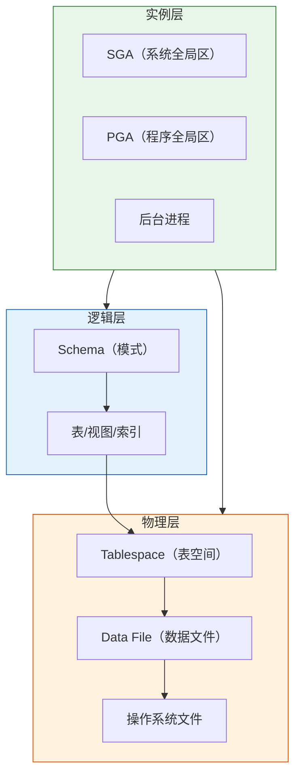
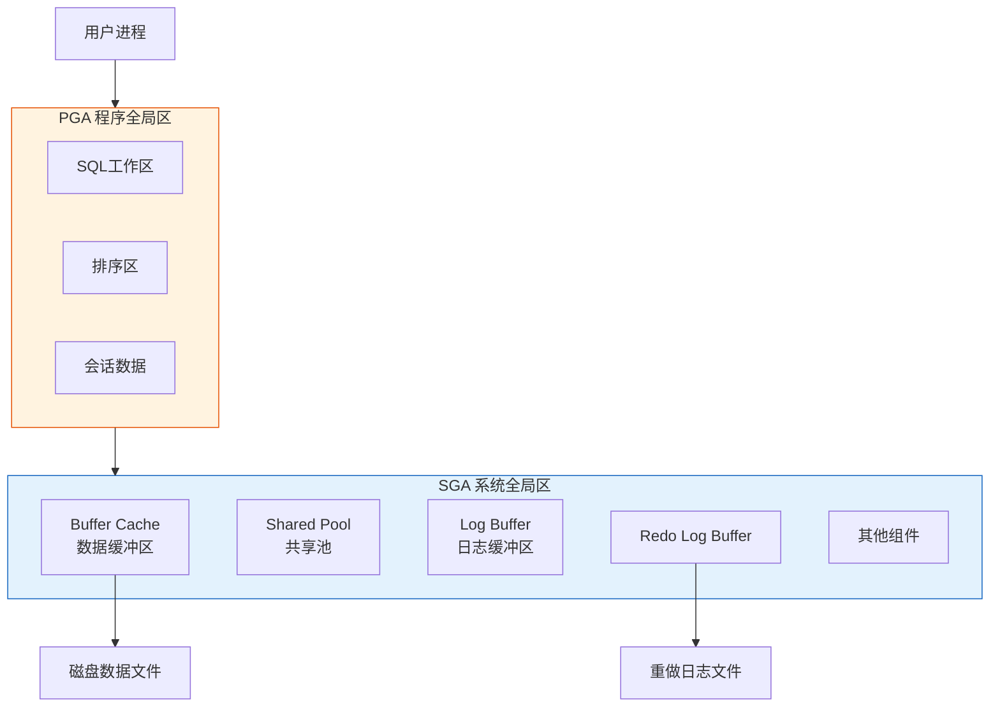

# Oracle数据库基本概念

## 一、概述

### 1.1 一句话定义

Oracle Database，本质上是全球领先的企业级关系型数据库管理系统（RDBMS）。
它在需要高可靠性、高性能、大规模数据处理的企业级应用场景中出现和使用，解决复杂事务处理、数据分析、业务连续性等核心问题。

### 1.2 为什么重要

- **不掌握的后果：** 无法有效管理和优化Oracle数据库，可能导致性能问题、数据丢失、安全风险
- **掌握的价值：** 能够设计高效的数据库架构、编写优化的SQL、保障数据安全和业务连续性

### 1.3 适用场景

| 场景 | 说明 |
|------|------|
| 企业级OLTP系统 | 金融、电信、ERP等核心业务系统 |
| 数据仓库与BI | 大规模数据分析、报表生成 |
| 混合负载（HTAP） | 同时支持事务处理和分析查询 |
| 高可用架构 | 需要7x24不间断运行的关键业务 |

### 1.4 版本演进

| 版本 | 变化说明 |
|------|---------|
| 11gR2 | 成熟稳定版本，广泛使用于传统企业应用 |
| 12cR1 | 引入多租户架构（CDB/PDB），云数据库开端 |
| 12cR2 | 增强Sharding、JSON支持、自动索引 |
| 19c | 长期支持版本（LTS），生产环境主流选择 |
| 21c | 创新版本，引入区块链表、机器学习功能 |

## 二、术语与概念

### 2.1 核心术语表

| 术语 | 含义 | 类比 |
|------|------|------|
| Database（数据库） | 有组织的数据集合，包含表、索引、视图等对象 | 像一个大型图书馆 |
| DBMS（数据库管理系统） | 管理数据库的软件系统，提供数据定义、操纵、控制功能 | 图书馆的管理系统 |
| Instance（实例） | Oracle的内存结构（SGA）和后台进程的集合 | 图书馆的工作人员和服务台 |
| Schema（模式） | 数据库对象的逻辑容器，与用户一一对应 | 图书馆的不同分类区域 |
| Tablespace（表空间） | 逻辑存储单元，包含一个或多个数据文件 | 图书馆的书架区域 |
| Data File（数据文件） | 物理文件，存储实际的数据 | 书架上的具体位置 |

### 2.2 关键组件



**组件说明：**
- **实例（Instance）：** 内存和进程的集合，负责处理用户请求，类似图书馆的服务团队
- **数据库（Database）：** 物理文件的集合，存储实际数据，类似图书馆的藏书
- **表空间（Tablespace）：** 逻辑存储单元，用于组织和管理数据，类似图书馆的分类区域

## 三、核心原理

### 3.1 Oracle数据库架构

Oracle采用**实例与数据库分离**的架构设计：

1. **实例（Instance）**
   - SGA（System Global Area）：共享内存区域
   - 后台进程：DBWR、LGWR、SMON、PMON等
   - 实例是临时的，重启后消失

2. **数据库（Database）**
   - 数据文件（.dbf）：存储表、索引等数据
   - 控制文件（.ctl）：记录数据库结构信息
   - 重做日志文件（.log）：记录所有变更
   - 数据库是持久的，存储在磁盘上

3. **实例与数据库的关系**
   - 一个实例挂载（Mount）一个数据库
   - RAC环境下，多个实例共享一个数据库

### 3.2 Oracle与其他数据库对比

| 特性 | Oracle | MySQL | PostgreSQL |
|------|--------|-------|------------|
| 架构 | 多进程，共享内存 | 多线程 | 多进程 |
| 事务支持 | 完整ACID，MVCC | InnoDB支持ACID | 完整ACID，MVCC |
| 并发控制 | 行级锁，读不阻塞写 | 行级锁 | 行级锁，MVCC |
| SQL标准 | 高度兼容，有扩展 | 部分兼容 | 高度兼容 |
| 扩展性 | RAC集群，Exadata | 主从复制 | 流复制，逻辑复制 |
| 成本 | 商业授权，成本高 | 开源免费 | 开源免费 |
| 适用场景 | 企业级核心系统 | 互联网应用 | 复杂查询，GIS |

## 四、架构与组件

### 4.1 Oracle内存结构



**内存组件说明：**
- **Buffer Cache：** 缓存从磁盘读取的数据块，减少I/O
- **Shared Pool：** 缓存SQL执行计划和数据字典
- **Log Buffer：** 暂存事务的redo记录
- **PGA：** 每个会话私有内存，用于排序、哈希等操作

### 4.2 Oracle后台进程

| 进程 | 作用 | 类比 |
|------|------|------|
| DBWR | 将脏块从Buffer Cache写入数据文件 | 图书管理员整理书籍 |
| LGWR | 将Log Buffer写入redo日志文件 | 记录员记录所有变更 |
| SMON | 实例恢复，合并空闲空间 | 清洁工整理环境 |
| PMON | 清理失败进程，释放资源 | 保安清理异常人员 |
| CKPT | 触发检查点，更新控制文件和数据文件头 | 时钟同步时间 |

## 五、配置与参数

### 5.1 关键初始化参数

```sql
-- 查看当前参数
SHOW PARAMETER db_name;
SHOW PARAMETER db_block_size;
SHOW PARAMETER sga_target;
SHOW PARAMETER pga_aggregate_target;

-- 常用参数说明
db_name           -- 数据库名称
db_block_size     -- 数据块大小（通常8KB）
sga_target        -- SGA总大小（自动内存管理）
pga_aggregate_target -- PGA目标大小
processes         -- 最大进程数
sessions          -- 最大会话数
```

### 5.2 数据库创建示例

```sql
-- 使用DBCA创建数据库（命令行示例）
dbca -silent -createDatabase \
  -templateName General_Purpose.dbc \
  -gdbname orcl -sid orcl \
  -responseFile NO_VALUE \
  -characterSet AL32UTF8 \
  -sysPassword Oracle123 \
  -systemPassword Oracle123 \
  -createAsContainerDatabase true \
  -numberOfPDBs 1 \
  -pdbName pdb1 \
  -pdbAdminPassword Oracle123 \
  -totalMemory 2048 \
  -storageType FS \
  -datafileDestination /u01/app/oracle/oradata \
  -redoLogFileSize 50 \
  -emConfiguration NONE \
  -databaseType MULTIPURPOSE

-- 手动创建表空间
CREATE TABLESPACE users
  DATAFILE '/u01/app/oracle/oradata/orcl/users01.dbf'
  SIZE 100M AUTOEXTEND ON NEXT 50M MAXSIZE UNLIMITED;

-- 创建用户
CREATE USER app_user IDENTIFIED BY password123
  DEFAULT TABLESPACE users
  TEMPORARY TABLESPACE temp
  QUOTA UNLIMITED ON users;

-- 授予权限
GRANT CONNECT, RESOURCE TO app_user;
```

## 六、监控与诊断

### 6.1 实例状态检查

```sql
-- 查看数据库状态
SELECT status FROM v$instance;

-- 查看数据库信息
SELECT name, open_mode, created FROM v$database;

-- 查看SGA信息
SELECT * FROM v$sgainfo;

-- 查看PGA统计
SELECT * FROM v$pgastat;

-- 查看会话信息
SELECT username, status, machine, program 
FROM v$session 
WHERE type = 'USER';
```

### 6.2 性能监控

```sql
-- 查看等待事件
SELECT event, total_waits, time_waited
FROM v$system_event
WHERE wait_class != 'Idle'
ORDER BY time_waited DESC;

-- 查看SQL性能
SELECT sql_id, executions, elapsed_time/1000000 elapsed_sec
FROM v$sql
WHERE executions > 0
ORDER BY elapsed_time DESC
FETCH FIRST 10 ROWS ONLY;
```

## 七、实战案例

### 7.1 案例背景

- **场景**：某企业新上线Oracle 19c数据库，需要验证基础配置
- **时间**：2026年7月
- **现象**：数据库创建完成，需要确认各项配置正确

### 7.2 诊断过程

**步骤1：检查数据库状态**

```sql
SQL> SELECT status FROM v$instance;

STATUS
------------
OPEN

SQL> SELECT name, open_mode FROM v$database;

NAME   OPEN_MODE
------ --------------------
ORCL   READ WRITE
```
- → 发现：数据库状态正常，处于OPEN模式
- → 判断：数据库可以正常接受连接

**步骤2：检查内存配置**

```sql
SQL> SHOW PARAMETER sga_target;

NAME       TYPE    VALUE
---------- ------- -----
sga_target big integer 2G

SQL> SHOW PARAMETER pga_aggregate_target;

NAME                  TYPE    VALUE
--------------------- ------- -----
pga_aggregate_target  big integer 512M
```
- → 发现：SGA 2GB，PGA 512MB
- → 判断：内存配置符合预期

**步骤3：检查表空间**

```sql
SQL> SELECT tablespace_name, status, contents 
     FROM dba_tablespaces;

TABLESPACE_NAME  STATUS    CONTENTS
---------------- --------- ---------
SYSTEM           ONLINE    PERMANENT
SYSAUX           ONLINE    PERMANENT
UNDOTBS1         ONLINE    UNDO
TEMP             ONLINE    TEMPORARY
USERS            ONLINE    PERMANENT
```
- → 发现：所有表空间在线
- → 判断：存储配置正常

### 7.3 解决结果

| 指标 | 预期值 | 实际值 | 状态 |
|------|--------|--------|------|
| 数据库状态 | OPEN | OPEN | ✓ |
| SGA大小 | 2GB | 2GB | ✓ |
| PGA大小 | 512MB | 512MB | ✓ |
| 表空间数量 | 5 | 5 | ✓ |

### 7.4 复盘总结

- **根因：** 数据库基础配置验证通过
- **教训：** 新数据库上线前必须进行完整的配置检查

## 八、常见错误与排查

### 8.1 常见错误列表

| 错误代码 | 错误信息 | 原因 | 解决方法 |
|---------|---------|------|---------|
| ORA-01034 | ORACLE not available | 实例未启动 | 启动实例：STARTUP |
| ORA-01017 | invalid username/password | 用户名或密码错误 | 检查凭据 |
| ORA-00942 | table or view does not exist | 表不存在或无权限 | 检查对象名和权限 |
| ORA-01555 | snapshot too old | UNDO空间不足 | 增大UNDO表空间 |

### 8.2 排查步骤

1. **确认当前状态：** `SELECT status FROM v$instance;`
2. **检查告警日志：** 查看`$ORACLE_BASE/diag/rdbms/.../trace/alert_<SID>.log`
3. **查看监听状态：** `lsnrctl status`
4. **验证连接：** 使用SQL*Plus或SQL Developer测试连接
5. **定位根因：** 根据错误代码查询Oracle文档

### 8.3 解决方案

**方案一：实例启动**

```sql
-- 连接到空闲实例
sqlplus / as sysdba

-- 启动实例
STARTUP;

-- 如果启动失败，查看告警日志定位问题
```

**方案二：监听重启**

```bash
# 检查监听状态
lsnrctl status

# 重启监听
lsnrctl stop
lsnrctl start
```

## 九、最佳实践

### 9.1 官方推荐

- 使用19c LTS版本作为生产环境
- 启用自动内存管理（AMM）或自动共享内存管理（ASMM）
- 使用ASM管理数据文件
- 配置Data Guard实现高可用

### 9.2 社区经验

- 定期更新OPatch补丁
- 使用AWR报告进行性能分析
- 建立完善的备份策略（RMAN）
- 监控关键等待事件

### 9.3 反模式

| 反模式 | 问题 | 正确做法 |
|--------|------|---------|
| 使用SYSTEM表空间存储用户数据 | 影响系统性能 | 创建独立的USERS表空间 |
| 禁用归档模式 | 无法进行时间点恢复 | 生产环境必须启用ARCHIVELOG |
| 不监控表空间使用率 | 空间满导致业务中断 | 设置告警阈值（80%、90%） |
| 使用SYSDBA进行日常操作 | 安全风险 | 创建普通用户进行日常操作 |

## 十、命令与视图汇总

### 10.1 命令列表

| 命令 | 适用场景 | 说明 |
|------|---------|------|
| `STARTUP` | 启动实例 | 启动Oracle实例 |
| `SHUTDOWN IMMEDIATE` | 关闭实例 | 立即关闭，回滚未提交事务 |
| `ALTER SYSTEM SET` | 修改参数 | 动态修改初始化参数 |
| `SHOW PARAMETER` | 查看参数 | 显示初始化参数值 |

### 10.2 视图列表

| 视图名 | 类型 | 用途 | 关键字段 |
|--------|------|------|---------|
| V$INSTANCE | 动态 | 实例状态 | STATUS, INSTANCE_NAME |
| V$DATABASE | 动态 | 数据库信息 | NAME, OPEN_MODE |
| V$SESSION | 动态 | 会话信息 | USERNAME, STATUS, SQL_ID |
| DBA_TABLESPACES | 数据字典 | 表空间信息 | TABLESPACE_NAME, STATUS |
| DBA_DATA_FILES | 数据字典 | 数据文件 | FILE_NAME, TABLESPACE_NAME |

## 十一、总结速查

### 11.1 黄金法则

1. **实例是临时的，数据库是持久的** - 理解两者的区别
2. **SGA是共享的，PGA是私有的** - 内存管理的基础
3. **生产环境必须启用ARCHIVELOG模式** - 保证可恢复性

### 11.2 一页纸检查清单

| 现象/场景 | 原因 | 处理方案 |
|-----------|------|----------|
| ORA-01034 | 实例未启动 | STARTUP启动实例 |
| 连接被拒绝 | 监听未启动 | lsnrctl start启动监听 |
| 表空间满 | 空间不足 | 添加数据文件或启用自动扩展 |
| 性能下降 | 等待事件 | 分析AWR报告，优化SQL |

### 11.3 关键数字

| 指标 | 正常范围 | 告警阈值 | 说明 |
|------|---------|---------|------|
| Buffer Cache命中率 | >95% | <90% | 内存缓存效率 |
| Library Cache命中率 | >99% | <95% | SQL共享效率 |
| 表空间使用率 | <80% | >90% | 空间使用预警 |
| 活跃会话数 | <processes*80% | >processes*90% | 连接数预警 |

## 附录

### A. 官方参考

- [Oracle Database Concepts](https://docs.oracle.com/en/database/oracle/oracle-database/19c/cncpt/)
- [Oracle Database Administrator's Guide](https://docs.oracle.com/en/database/oracle/oracle-database/19c/admin/)
- [Oracle Database SQL Language Reference](https://docs.oracle.com/en/database/oracle/oracle-database/19c/sqlqr/)

### B. 修订记录

| 日期 | 版本 | 修改内容 | 修改人 |
|------|------|---------|--------|
| 2026-07-01 | v1.0 | 初始版本 | YashanDB知识库生成器 |
