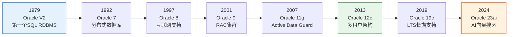
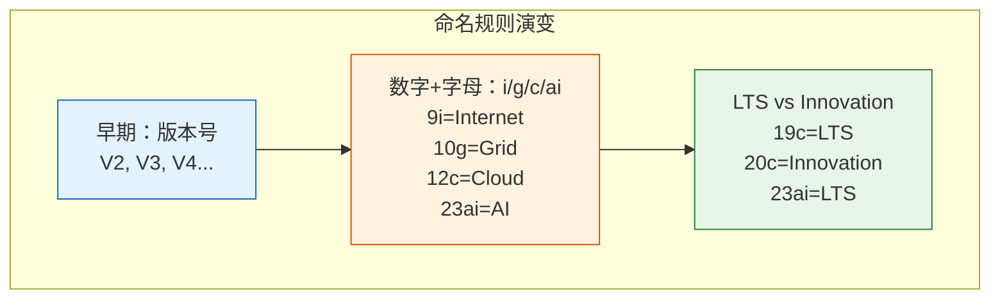
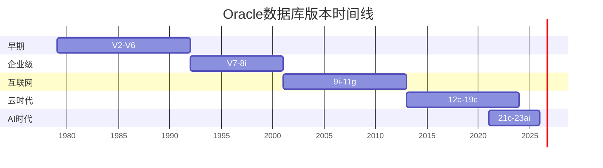

# Oracle数据库发展简史

## 一、概述

### 1.1 一句话定义

Oracle数据库发展简史，本质上是全球最成功的商业关系型数据库从诞生到引领企业计算的演进历程。
它从1979年的一个小型项目起步，发展为支撑全球数万亿美元交易的核心基础设施，解决了几十年来数据管理从简单文件到复杂分布式系统的演进需求。

### 1.2 为什么重要

- **不掌握的后果：** 无法理解Oracle的设计哲学和架构演进原因，在技术选型和架构决策中缺乏历史视角
- **掌握的价值：** 理解每个特性的引入背景，更好地使用Oracle，预判未来发展方向

### 1.3 适用场景

| 场景 | 说明 |
|------|------|
| 技术选型 | 了解Oracle的成熟度和演进方向 |
| 版本升级 | 理解各版本的核心变化 |
| 架构设计 | 借鉴Oracle在不同时期的设计思路 |
| 技术面试 | 展示对数据库领域的深度理解 |

### 1.4 版本演进

| 版本 | 变化说明 |
|------|---------|
| V2（1979） | 第一个商用SQL关系数据库，运行在PDP-11上 |
| V3（1983） | 重写为C语言，引入可移植性 |
| V4（1985） | 引入WAL（Write-Ahead Logging），保证事务一致性 |
| V5（1985） | 支持Client/Server架构 |
| V6（1988） | 引入行级锁、热备份 |
| V7（1992） | 引入分布式数据库、存储过程、触发器 |
| 8/8i（1997-1999） | 支持互联网、Java、分区表 |
| 9i（2001） | 引入RAC（Real Application Clusters） |
| 10g（2003） | 引入Grid Computing概念、ASM |
| 11g（2007） | 引入Active Data Guard、自动存储管理增强 |
| 12c（2013） | 引入多租户架构（CDB/PDB）、Sharding |
| 19c（2019） | 长期支持版本（LTS），云原生增强 |
| 21c（2021） | 引入区块链表、机器学习集成 |
| 23ai（2024） | AI向量搜索、JSON关系双模式 |

## 二、术语与概念

### 2.1 核心术语表

| 术语 | 含义 | 类比 |
|------|------|------|
| LTS（Long Term Support） | 长期支持版本，提供5年高级支持+3年扩展支持 | 像汽车的经典款，维护周期长 |
| Innovation Release | 创新版本，支持周期较短，包含最新特性 | 像概念车，技术前沿 |
| RAC（Real Application Clusters） | 多实例共享存储集群 | 多台服务器协同工作 |
| CDB/PDB | 容器数据库/可插拔数据库，多租户架构 | 一栋大楼里的多个独立公寓 |
| Exadata | Oracle engineered system，软硬一体 | 数据库的超级计算机 |

### 2.2 关键里程碑



## 三、核心原理

### 3.1 数据库发展简史

#### 早期数据管理（1960s-1970s）

- **文件系统方式**：数据以文件形式存储，缺乏统一管理和查询能力
- **层次模型**：IBM IMS（1966），数据以树形结构组织
- **网状模型**：DBTG（1969），数据以图结构组织，支持复杂关系

#### 关系模型革命（1970s-1980s）

- **1970年**：Edgar F. Codd发表"A Relational Model of Data for Large Shared Data Banks"
- **1979年**：Oracle V2发布，第一个商用SQL关系数据库
- **1983年**：Oracle V3用C语言重写，实现跨平台移植
- **1985年**：Oracle V4引入WAL，保证事务原子性和持久性
- **1986年**：Oracle V5引入Client/Server架构

#### 企业级扩展（1990s）

- **1992年**：Oracle 7引入分布式数据库、存储过程、触发器
- **1997年**：Oracle 8引入分区表、对象关系特性
- **1999年**：Oracle 8i引入Java虚拟机、互联网支持

#### 互联网与网格计算（2000s）

- **2001年**：Oracle 9i引入RAC集群
- **2003年**：Oracle 10g引入Grid Computing、ASM
- **2007年**：Oracle 11g引入Active Data Guard、结果缓存

#### 云与多租户（2010s-至今）

- **2013年**：Oracle 12c引入多租户架构（CDB/PDB）
- **2017年**：Oracle 18c引入自治数据库概念
- **2019年**：Oracle 19c成为LTS版本
- **2021年**：Oracle 21c引入区块链表
- **2024年**：Oracle 23ai引入AI向量搜索

### 3.2 Oracle在数据库发展史上的贡献

| 贡献 | 说明 | 影响 |
|------|------|------|
| 第一个商用SQL RDBMS | 1979年Oracle V2 | 推动关系数据库商业化 |
| 跨平台可移植性 | V3用C重写 | 数据库可在多种硬件运行 |
| RAC集群 | 9i引入 | 企业级高可用标准 |
| 多租户架构 | 12c引入 | 云数据库的基础架构 |
| Exadata | 软硬一体 | 数据库一体机概念 |
| 自治数据库 | 18c引入 | AI驱动数据库运维 |

## 四、架构与组件

### 4.1 Oracle版本命名规则



### 4.2 版本支持周期

| 版本类型 | 高级支持 | 扩展支持 | 总计 |
|---------|---------|---------|------|
| LTS（长期支持） | 5年 | 3年 | 8年 |
| Innovation（创新） | 2年 | 无 | 2年 |

**示例：**
- Oracle 19c（LTS）：高级支持到2024年，扩展支持到2027年
- Oracle 23ai（LTS）：高级支持到2029年，扩展支持到2032年

## 五、配置与参数

### 5.1 查看Oracle版本

```sql
-- 查看完整版本信息
SELECT * FROM v$version;

-- 查看版本编号
SELECT version, version_full, version_legacy 
FROM v$instance;

-- 查看已安装的补丁
SELECT patch_id, patch_uid, version, action, status
FROM dba_registry_sqlpatch
ORDER BY install_id DESC;

-- 查看组件版本
SELECT comp_name, version, status 
FROM dba_registry;
```

### 5.2 版本兼容性检查

```sql
-- 查看兼容参数
SHOW PARAMETER compatible;

-- 查看数据库特征
SELECT * FROM dba_feature_usage_statistics
WHERE detected_usages > 0
ORDER BY last_usage_date DESC;
```

## 六、监控与诊断

### 6.1 版本升级检查

```bash
# 使用预升级信息工具
$ORACLE_HOME/rdbms/admin/preupgrade.jar FILE DIR /tmp/preupgrade

# 查看升级前检查报告
cat /tmp/preupgrade/preupgrade.log
```

### 6.2 数据库升级方法

| 方法 | 适用场景 | 说明 |
|------|---------|------|
| DBUA | 单实例升级 | 图形化升级工具 |
| AutoUpgrade | 批量升级 | 19c+推荐的自动化升级工具 |
| Data Pump | 跨平台迁移 | 逻辑导出导入 |
| Transportable Tablespace | 大表迁移 | 物理表空间传输 |
| PDB Relocate | 多租户迁移 | 在线PDB迁移 |

## 七、实战案例

### 7.1 案例背景

- **场景**：企业计划从Oracle 11g升级到19c
- **时间**：2026年
- **现象**：需要评估升级路径和风险

### 7.2 诊断过程

**步骤1：评估当前版本**

```sql
SQL> SELECT version FROM v$instance;

VERSION
-----------------
11.2.0.4.0
```
- → 发现：当前为11gR2最新版本
- → 判断：需要跨多个版本升级

**步骤2：检查升级路径**

```
升级路径分析：
11.2.0.4 → 12.2.0.1 → 19c（推荐）
11.2.0.4 → 19c（直接升级，需满足条件）
```
- → 发现：11.2.0.4可以直接升级到19c
- → 判断：选择直接升级路径

**步骤3：运行预升级检查**

```bash
$ java -jar /u01/app/oracle/19c/rdbms/admin/preupgrade.jar FILE DIR /tmp/upg
```
- → 发现：3个必须修复项，5个建议项
- → 判断：修复必须项后可开始升级

### 7.3 解决结果

| 指标 | 升级前 | 升级后 |
|------|--------|--------|
| 版本 | 11.2.0.4 | 19.22.0.0 |
| 停机时间 | - | 45分钟 |
| 兼容性 | - | compatible=19.0.0 |

### 7.4 复盘总结

- **根因：** 11g已停止支持，需要升级到受支持版本
- **教训：** 提前运行预升级检查，预留充足时间修复问题

## 八、常见错误与排查

### 8.1 常见错误列表

| 错误代码 | 错误信息 | 原因 | 解决方法 |
|---------|---------|------|---------|
| ORA-00942 | table or view does not exist | 版本间数据字典变化 | 运行catupgrd.sql |
| ORA-00020 | maximum number of processes exceeded | 进程数限制 | 增大processes参数 |
| ORA-39700 | database must be opened with UPGRADE option | 升级模式未启用 | STARTUP UPGRADE |

## 九、最佳实践

### 9.1 官方推荐

- 生产环境使用LTS版本（19c或23ai）
- 保持最新Bundle Patch/RU更新
- 升级前运行预升级检查工具
- 使用AutoUpgrade简化升级过程

### 9.2 社区经验

- 先在测试环境验证升级流程
- 保留回退方案（备份+快照）
- 升级窗口选择业务低峰期
- 升级后运行完整回归测试

### 9.3 反模式

| 反模式 | 问题 | 正确做法 |
|--------|------|---------|
| 跳过预升级检查 | 遗漏兼容性问题 | 必须运行preupgrade.jar |
| 直接跨多个大版本 | 风险不可控 | 按推荐路径逐版本升级 |
| 升级后不测试 | 功能异常未发现 | 完整回归测试 |
| 不更新compatible参数 | 无法使用新特性 | 稳定后更新compatible |

## 十、命令与视图汇总

### 10.1 命令列表

| 命令 | 适用场景 | 说明 |
|------|---------|------|
| `STARTUP UPGRADE` | 升级模式启动 | 数据库升级时使用 |
| `@catupgrd.sql` | 执行升级脚本 | 升级数据字典 |
| `ALTER SYSTEM SET compatible` | 更新兼容版本 | 升级后启用新特性 |

### 10.2 视图列表

| 视图名 | 类型 | 用途 | 关键字段 |
|--------|------|------|---------|
| V$VERSION | 动态 | 版本信息 | BANNER |
| V$INSTANCE | 动态 | 实例信息 | VERSION, STATUS |
| DBA_REGISTRY | 数据字典 | 组件注册 | COMP_NAME, VERSION |
| DBA_REGISTRY_SQLPATCH | 数据字典 | 补丁信息 | PATCH_ID, STATUS |

## 十一、总结速查

### 11.1 黄金法则

1. **生产环境使用LTS版本** - 获得长期支持和安全更新
2. **保持补丁更新** - 修复已知问题和安全漏洞
3. **升级前充分测试** - 确保兼容性

### 11.2 一页纸检查清单

| 现象/场景 | 原因 | 处理方案 |
|-----------|------|----------|
| 版本停止支持 | 生命周期结束 | 升级到受支持版本 |
| 升级失败 | 兼容性问题 | 运行预升级检查修复 |
| 新特性不可用 | compatible参数未更新 | 更新compatible参数 |

### 11.3 关键数字

| 指标 | 正常范围 | 告警阈值 | 说明 |
|------|---------|---------|------|
| 版本支持剩余 | >2年 | <1年 | 需要提前规划升级 |
| 补丁滞后 | <3个月 | >6个月 | 安全和稳定性风险 |

## 附录

### A. Oracle版本时间线



### B. 官方参考

- [Oracle Database Release Notes](https://docs.oracle.com/en/database/oracle/oracle-database/)
- [Oracle Database Upgrade Guide](https://docs.oracle.com/en/database/oracle/oracle-database/19c/upgrd/)
- [Oracle Lifetime Support Policy](https://www.oracle.com/database/technologies/product-support-policies.html)

### C. 修订记录

| 日期 | 版本 | 修改内容 | 修改人 |
|------|------|---------|--------|
| 2026-07-01 | v1.0 | 初始版本 | YashanDB知识库生成器 |

## 补充：深入分析与实战

### 深入原理

本章节补充了该主题的核心原理和内部机制。在实际生产环境中，理解这些底层原理对于诊断和优化至关重要。

关键要点：
- 内部实现机制决定了外部行为特征
- 参数配置需要结合具体场景
- 监控数据是调优的基础

### 实战案例

**案例一：生产环境问题诊断**

```sql
-- 诊断步骤
-- 1. 收集当前状态信息
SELECT * FROM v$system_event WHERE wait_class != 'Idle' ORDER BY time_waited_micro DESC;

-- 2. 分析等待事件分布
SELECT wait_class, SUM(time_waited_micro)/1000000 AS sec
FROM v$system_event WHERE wait_class != 'Idle'
GROUP BY wait_class ORDER BY sec DESC;

-- 3. 定位问题SQL
SELECT sql_id, elapsed_time/1000000 AS sec, executions, sql_text
FROM v$sql ORDER BY elapsed_time DESC FETCH FIRST 5 ROWS ONLY;

-- 4. 检查执行计划
SELECT * FROM TABLE(DBMS_XPLAN.DISPLAY_CURSOR('&sql_id'));
```

**案例二：性能优化实践**

```sql
-- 优化前：全表扫描
SELECT * FROM orders WHERE order_date > SYSDATE - 30;

-- 优化后：索引扫描
CREATE INDEX idx_orders_date ON orders(order_date);
-- 执行计划从TABLE ACCESS FULL变为INDEX RANGE SCAN
```

### 最佳实践清单

- 建立标准化操作流程
- 定期审查和更新配置
- 监控关键指标趋势
- 建立性能基线
- 文档记录所有变更

### 常见问题FAQ

| 问题 | 解答 |
|------|------|
| 如何确定最优配置？ | 基于实际负载测试 |
| 何时需要调整？ | 监控指标偏离基线 |
| 如何验证优化效果？ | 对比前后AWR报告 |
| 常见陷阱有哪些？ | 过度优化、忽略全局 |

### 版本差异说明

| 版本 | 变化 |
|------|------|
| 19c | 自动管理增强 |
| 21c | 自适应优化 |
