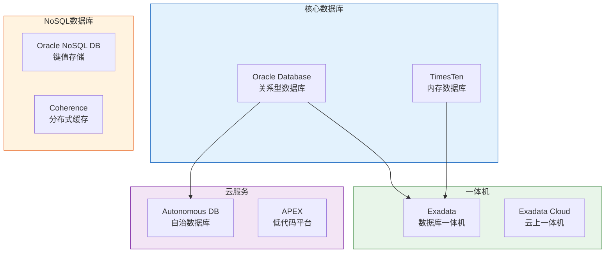
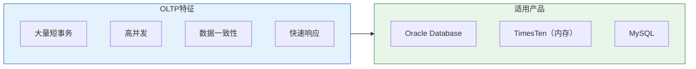
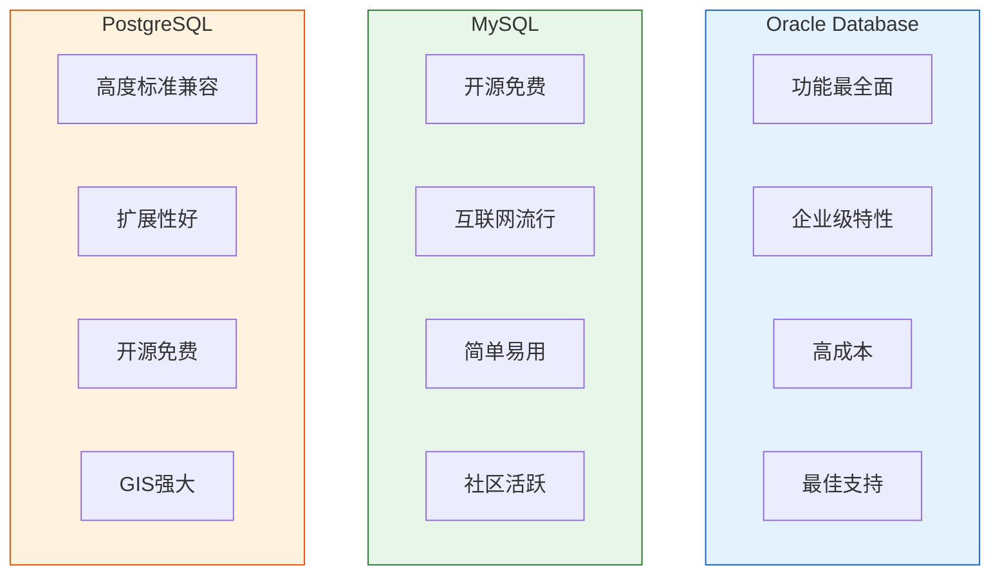
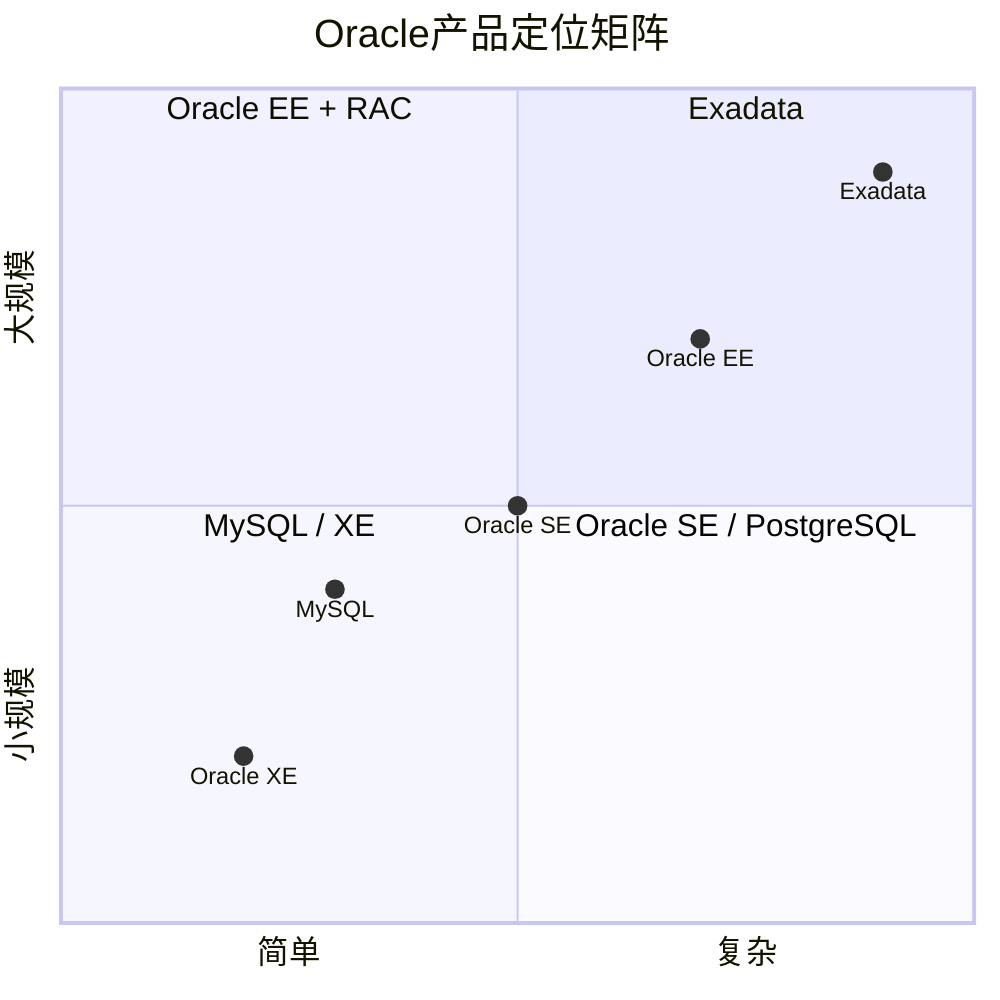

# Oracle数据库分类与定位

## 一、概述

### 1.1 一句话定义

Oracle数据库分类与定位，本质上是Oracle公司针对不同数据管理需求构建的完整产品矩阵。
它在关系型数据库（Oracle Database）、NoSQL数据库（Oracle NoSQL）、内存数据库（TimesTen）、一体机（Exadata）等多个细分领域提供解决方案，解决从简单事务处理到超大规模数据分析的全场景数据管理需求。

### 1.2 为什么重要

- **不掌握的后果：** 无法为业务场景选择合适的Oracle产品，可能导致过度投资或方案不足
- **掌握的价值：** 精准选型，充分利用Oracle产品矩阵的优势

### 1.3 适用场景

| 场景 | 说明 |
|------|------|
| 技术选型 | 为业务场景选择最合适的Oracle产品 |
| 架构设计 | 理解不同产品的适用边界 |
| 成本优化 | 避免为简单场景选择过度复杂的方案 |
| 竞品分析 | 与MySQL、PostgreSQL等产品对比定位 |

### 1.4 版本演进

| 版本 | 变化说明 |
|------|---------|
| 1979 | Oracle Database V2：第一个关系数据库产品 |
| 2001 | Oracle NoSQL Database：进入键值存储领域 |
| 2006 | Oracle TimesTen：内存数据库（收购） |
| 2008 | Exadata：软硬一体机 |
| 2013 | Oracle 12c：多租户架构，云数据库 |
| 2016 | Oracle Autonomous Database：自治数据库 |
| 2024 | Oracle 23ai：AI向量搜索，JSON关系双模式 |

## 二、术语与概念

### 2.1 核心术语表

| 术语 | 含义 | 类比 |
|------|------|------|
| RDBMS | 关系型数据库管理系统 | 结构化数据仓库 |
| OLTP | 在线事务处理 | 超市收银台，快速处理单笔交易 |
| OLAP | 在线分析处理 | 数据分析室，复杂报表查询 |
| HTAP | 混合事务/分析处理 | 既能收银又能分析的智能超市 |
| NoSQL | 非关系型数据库 | 灵活的文档柜，不需要固定格式 |
| In-Memory | 内存数据库 | 把数据放在桌面上，随时取用 |
| Engineered System | 软硬一体机 | 预装好的整套厨房设备 |

### 2.2 Oracle产品矩阵



## 三、核心原理

### 3.1 按数据模型分类

#### 关系型数据库

| 产品 | 特点 | 适用场景 |
|------|------|---------|
| **Oracle Database** | 功能最全面的RDBMS | 企业核心系统、复杂事务 |
| **MySQL** | 开源、互联网流行 | Web应用、中小规模系统 |
| **PostgreSQL** | 开源、高度标准兼容 | 复杂查询、GIS、数据完整性 |
| **SQL Server** | 微软生态集成 | Windows环境、BI |

#### NoSQL数据库

| 产品 | 数据模型 | 适用场景 |
|------|---------|---------|
| **Oracle NoSQL DB** | 键值存储 | 高并发、简单查询 |
| **Oracle Coherence** | 分布式缓存 | 会话缓存、实时数据 |
| **Oracle Berkeley DB** | 嵌入式键值 | 应用内嵌数据库 |

#### 文档/JSON数据库

| 产品 | 特点 | 适用场景 |
|------|------|---------|
| **Oracle Database (JSON)** | 关系+JSON双模式 | 需要灵活schema+事务 |
| **MongoDB** | 纯文档数据库 | 快速迭代、灵活schema |

### 3.2 按处理类型分类

#### OLTP（在线事务处理）



**典型场景：**
- 银行交易系统
- 电商订单处理
- 电信计费系统

#### OLAP（在线分析处理）


**典型场景：**
- 财务报表分析
- 销售趋势分析
- 数据挖掘

#### HTAP（混合负载）

**Oracle解决方案：**
- **Oracle Database**：同时支持OLTP和OLAP
- **Exadata**：Smart Scan加速分析查询
- **In-Memory Option**：内存列式存储加速分析

### 3.3 按架构分类

| 架构 | 说明 | Oracle产品 |
|------|------|-----------|
| 单机 | 单实例部署 | Oracle Database SE/EE |
| 主从复制 | 一主多从 | Data Guard、GoldenGate |
| 共享存储集群 | 多实例共享存储 | Oracle RAC |
| 无共享集群 | 多实例独立存储 | Oracle Sharding |
| 分布式 | 跨地域部署 | GoldenGate、Active Data Guard |

## 四、架构与组件

### 4.1 Oracle Database版本对比

| 版本 | 定位 | 关键特性 | 适用场景 |
|------|------|---------|---------|
| **Express Edition (XE)** | 免费入门 | 2CPU/2GB/12GB限制 | 开发测试、学习 |
| **Standard Edition (SE)** | 标准版 | 基础功能 | 中小型企业 |
| **Enterprise Edition (EE)** | 企业版 | 完整功能 | 大型企业核心系统 |
| **Exadata** | 一体机 | 软硬优化 | 超大规模、高性能 |

### 4.2 Oracle vs MySQL vs PostgreSQL



**详细对比：**

| 特性 | Oracle | MySQL | PostgreSQL |
|------|--------|-------|------------|
| 许可 | 商业授权 | GPL/商业 | PostgreSQL License |
| 成本 | 高 | 低/免费 | 免费 |
| 并发控制 | MVCC，读不阻塞写 | InnoDB MVCC | MVCC |
| 集群 | RAC（共享存储） | Group Replication | 流复制 |
| 备份 | RMAN | mysqldump/xtrabackup | pg_dump/pg_basebackup |
| 性能 | 极高 | 中高 | 高 |
| 扩展性 | 垂直+水平 | 垂直为主 | 垂直+逻辑复制 |
| 支持 | 官方24x7 | 社区/商业 | 社区/商业 |

## 五、配置与参数

### 5.1 Oracle Database版本选择

```sql
-- 查看当前版本
SELECT banner FROM v$version WHERE banner LIKE 'Oracle Database%';

-- 查看已安装选项
SELECT * FROM v$option WHERE value = 'TRUE';

-- 查看使用的许可
SELECT name FROM v$option 
WHERE value = 'TRUE' 
AND name IN ('Partitioning', 'Real Application Clusters', 'Advanced Compression');
```

### 5.2 产品选型决策

```
选型决策树：

是否需要完整RDBMS功能？
├── 是 → 是否需要企业级特性（RAC、Data Guard）？
│       ├── 是 → Oracle Database Enterprise Edition
│       └── 否 → Oracle Database Standard Edition 或 MySQL/PostgreSQL
└── 否 → 数据模型是什么？
        ├── 键值 → Oracle NoSQL DB
        ├── 文档 → MongoDB 或 Oracle JSON
        └── 图 → 其他图数据库
```

## 六、监控与诊断

### 6.1 数据库类型识别

```sql
-- 查看数据库类型和版本
SELECT banner_full FROM v$version;

-- 查看已安装组件
SELECT comp_name, version, status 
FROM dba_registry 
ORDER BY comp_name;

-- 查看使用的特性
SELECT name, detected_usages, last_usage_date
FROM dba_feature_usage_statistics
WHERE detected_usages > 0
ORDER BY last_usage_date DESC;
```

### 6.2 性能特征对比

| 指标 | Oracle | MySQL | PostgreSQL |
|------|--------|-------|------------|
| 典型TPS | 100K+ | 10K-50K | 20K-80K |
| 并发连接 | 数千-数万 | 数百-数千 | 数百-数千 |
| 查询复杂度 | 极高 | 中等 | 高 |
| 数据量 | TB-PB | GB-TB | GB-TB |

## 七、实战案例

### 7.1 案例背景

- **场景**：企业技术选型，需要在Oracle、MySQL、PostgreSQL中选择
- **时间**：2026年
- **现象**：业务快速增长，需要可扩展的数据库方案

### 7.2 诊断过程

**步骤1：分析业务需求**

- 并发用户：5000+
- 数据量：10TB+，年增长50%
- 事务要求：强一致性
- 高可用：RPO=0，RTO<30秒

**步骤2：评估各产品**

| 需求 | Oracle | MySQL | PostgreSQL |
|------|--------|-------|------------|
| 并发5000+ | ✓ | △ | △ |
| 10TB+ | ✓ | △ | △ |
| 强一致性 | ✓ | ✓ | ✓ |
| RPO=0 | ✓（RAC） | △ | △ |
| RTO<30s | ✓（RAC） | ✗ | ✗ |

**步骤3：成本评估**

| 产品 | 许可成本 | 硬件成本 | 运维成本 |
|------|---------|---------|---------|
| Oracle RAC | 高 | 高 | 中 |
| MySQL集群 | 低 | 中 | 高 |
| PostgreSQL集群 | 低 | 中 | 高 |

### 7.3 解决结果

| 指标 | 选择 | 原因 |
|------|------|------|
| 最终选择 | Oracle RAC | 满足所有需求，运维成本可控 |
| 备选方案 | PostgreSQL + Patroni | 成本敏感时的选择 |

### 7.4 复盘总结

- **根因：** 业务对高可用和扩展性要求极高
- **教训：** 选型需要综合考虑功能、性能、成本、运维能力

## 八、常见错误与排查

### 8.1 常见选型错误

| 错误 | 问题 | 正确做法 |
|------|------|---------|
| 过度选型 | 简单场景用Oracle RAC | 评估实际需求，避免浪费 |
| 选型不足 | 高并发场景用MySQL单机 | 充分评估未来增长 |
| 忽视运维 | 选择复杂方案但缺乏运维能力 | 评估团队技术能力 |
| 忽视成本 | 只看功能不看TCO | 计算3-5年总拥有成本 |

## 九、最佳实践

### 9.1 官方推荐

- 核心业务系统使用Oracle Database Enterprise Edition
- 开发测试使用XE或MySQL
- 分析场景使用Exadata或In-Memory
- 云优先场景使用Autonomous Database

### 9.2 社区经验

- 先明确需求再选型
- 做POC验证
- 考虑团队技术栈
- 预留扩展空间

### 9.3 反模式

| 反模式 | 问题 | 正确做法 |
|--------|------|---------|
| 跟风选型 | 不适合自身业务 | 基于需求分析 |
| 只看成本 | 忽视隐性成本 | 计算TCO |
| 一成不变 | 业务变化后不调整 | 定期评估 |

## 十、命令与视图汇总

### 10.1 命令列表

| 命令 | 适用场景 | 说明 |
|------|---------|------|
| `SELECT * FROM v$version` | 查看版本 | 数据库版本信息 |
| `SELECT * FROM v$option` | 查看选项 | 已安装的功能选项 |
| `SELECT * FROM dba_registry` | 查看组件 | 已安装的组件 |

### 10.2 视图列表

| 视图名 | 类型 | 用途 | 关键字段 |
|--------|------|------|---------|
| V$VERSION | 动态 | 版本信息 | BANNER |
| V$OPTION | 动态 | 功能选项 | NAME, VALUE |
| DBA_REGISTRY | 数据字典 | 组件注册 | COMP_NAME, VERSION |
| DBA_FEATURE_USAGE_STATISTICS | 数据字典 | 特性使用 | NAME, DETECTED_USAGES |

## 十一、总结速查

### 11.1 黄金法则

1. **需求驱动选型** - 先明确业务需求，再选择产品
2. **TCO全面评估** - 考虑许可、硬件、运维、培训总成本
3. **预留扩展空间** - 选择可随业务增长的方案

### 11.2 一页纸检查清单

| 现象/场景 | 原因 | 处理方案 |
|-----------|------|----------|
| 性能瓶颈 | 产品选型不当 | 重新评估需求，考虑升级 |
| 成本超支 | 过度选型 | 评估是否可降级 |
| 运维困难 | 方案过于复杂 | 简化架构或增加培训 |

### 11.3 关键数字

| 指标 | 正常范围 | 告警阈值 | 说明 |
|------|---------|---------|------|
| 许可成本占比 | <20% TCO | >30% TCO | 许可成本过高 |
| 数据增长率 | <50%/年 | >100%/年 | 需要重新评估架构 |

## 附录

### A. Oracle产品定位图



### B. 官方参考

- [Oracle Database Licensing Guide](https://www.oracle.com/database/technologies/licensing.html)
- [Oracle Product Family](https://www.oracle.com/database/)
- [Oracle vs MySQL Comparison](https://www.oracle.com/database/mysql-vs-oracle/)

### C. 修订记录

| 日期 | 版本 | 修改内容 | 修改人 |
|------|------|---------|--------|
| 2026-07-01 | v1.0 | 初始版本 | YashanDB知识库生成器 |
