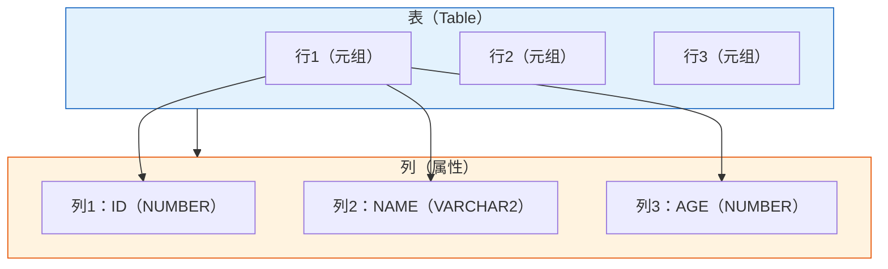
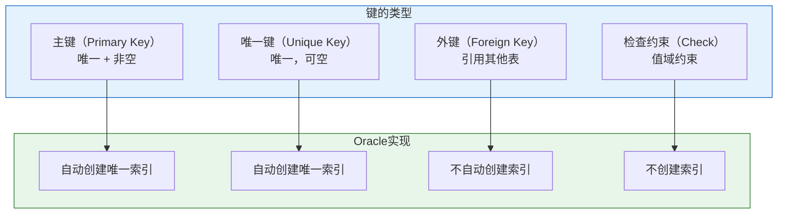
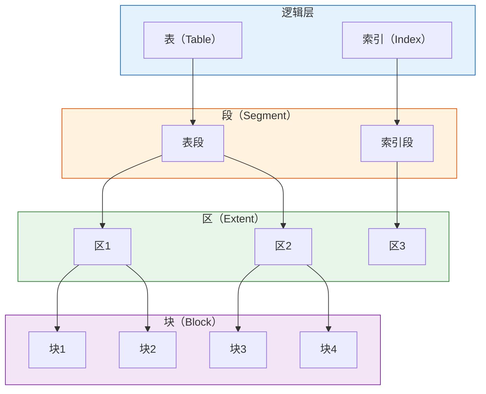
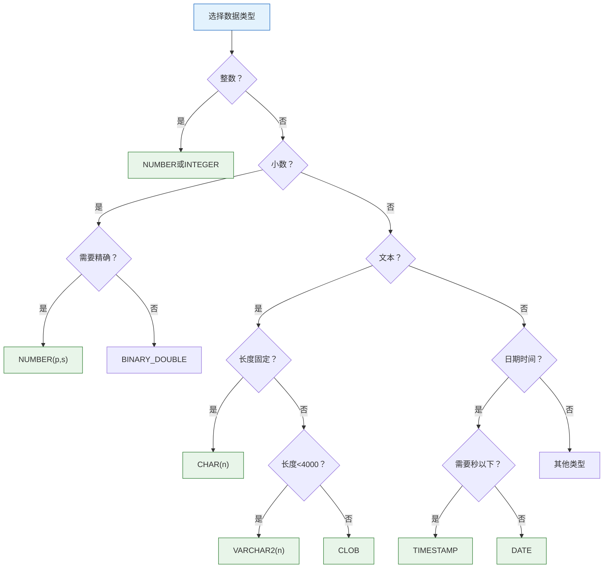

# Oracle关系数据结构

## 一、概述

### 1.1 一句话定义

Oracle关系数据结构，本质上是Oracle数据库中以表（Table）为核心组织和管理数据的方式。
它在关系数据库中出现和使用，解决数据的结构化存储、完整性约束和高效访问问题。

### 1.2 为什么重要

- **不掌握的后果：** 无法正确设计表结构，导致数据冗余、查询低效、完整性问题
- **掌握的价值：** 设计高效的数据库结构，为应用提供可靠的数据基础

### 1.3 适用场景

| 场景 | 说明 |
|------|------|
| 数据库设计 | 创建表结构、定义数据类型 |
| 数据建模 | 将业务需求转换为关系模型 |
| 性能优化 | 选择合适的数据类型和存储方式 |
| 数据迁移 | 理解Oracle特有的数据结构 |

### 1.4 版本演进

| 版本 | 变化说明 |
|------|---------|
| 11gR2 | 支持虚拟列、不可见列 |
| 12cR1 | IDENTITY列、默认值优化、JSON支持 |
| 12cR2 | 增强JSON数据类型 |
| 19c | 区块链表、多态表函数 |
| 21c | 增强JSON关系双模式 |
| 23ai | AI向量数据类型、JSON Duality视图 |

## 二、术语与概念

### 2.1 核心术语表

| 术语 | 含义 | 类比 |
|------|------|------|
| 关系（Relation） | 二维表，由行和列组成 | Excel表格 |
| 元组（Tuple） | 表中的一行记录 | 表格中的一行数据 |
| 属性（Attribute） | 表中的一列，具有特定数据类型 | 表格中的列标题 |
| 域（Domain） | 属性所有可能取值的集合 | 列的数据类型和约束 |
| 超键（Super Key） | 能唯一标识元组的属性集 | 身份证号的完整信息 |
| 候选键（Candidate Key） | 最小超键，无多余属性 | 精简后的唯一标识 |
| 主键（Primary Key） | 选定的候选键，用于唯一标识 | 身份证号 |
| 外键（Foreign Key） | 引用其他表主键的属性 | 关联到其他表的引用 |
| ROWID | Oracle行物理地址 | 图书馆的精确位置编号 |

### 2.2 Oracle表结构



**结构说明：**
- **表（Table）：** 数据的逻辑容器，由行和列组成
- **行（Row）：** 一条完整的记录，包含所有列的值
- **列（Column）：** 特定类型的数据字段，具有名称和数据类型

## 三、核心原理

### 3.1 Oracle数据类型

#### 数值类型

| 数据类型 | 说明 | 存储大小 | 适用场景 |
|---------|------|---------|---------|
| NUMBER(p,s) | 精确数值，p精度，s小数位 | 1-22字节 | 金额、计数 |
| BINARY_FLOAT | 单精度浮点 | 4字节 | 科学计算 |
| BINARY_DOUBLE | 双精度浮点 | 8字节 | 高精度计算 |
| INTEGER | 整数，NUMBER(38)的子类型 | 1-22字节 | 整数 |

```sql
-- 数值类型示例
CREATE TABLE numeric_example (
    id          NUMBER(10) PRIMARY KEY,
    price       NUMBER(10,2),      -- 最多10位，2位小数
    quantity    INTEGER,
    ratio       BINARY_DOUBLE
);
```

#### 字符类型

| 数据类型 | 说明 | 最大长度 | 适用场景 |
|---------|------|---------|---------|
| CHAR(n) | 定长字符 | 2000字节 | 固定长度编码 |
| VARCHAR2(n) | 变长字符 | 32767字节 | 通用文本 |
| NCHAR(n) | 定长国家字符集 | 2000字节 | 多语言固定长度 |
| NVARCHAR2(n) | 变长国家字符集 | 32767字节 | 多语言变长 |
| CLOB | 大文本对象 | 4GB | 长文本、文档 |

```sql
-- 字符类型示例
CREATE TABLE char_example (
    code        CHAR(10),          -- 固定10字符
    name        VARCHAR2(100),     -- 最多100字符
    description CLOB,              -- 大文本
    name_cn     NVARCHAR2(50)      -- 中文名称
);
```

#### 日期时间类型

| 数据类型 | 说明 | 存储大小 | 精度 |
|---------|------|---------|------|
| DATE | 日期和时间 | 7字节 | 秒 |
| TIMESTAMP | 时间戳 | 7-11字节 | 纳秒 |
| TIMESTAMP WITH TIME ZONE | 带时区时间戳 | 13字节 | 纳秒+时区 |
| TIMESTAMP WITH LOCAL TIME ZONE | 本地时区时间戳 | 7-11字节 | 纳秒 |
| INTERVAL YEAR TO MONTH | 年月间隔 | 5字节 | 月 |
| INTERVAL DAY TO SECOND | 日秒间隔 | 11字节 | 秒 |

```sql
-- 日期时间示例
CREATE TABLE datetime_example (
    created_at      DATE,
    updated_at      TIMESTAMP(6),
    event_time      TIMESTAMP WITH TIME ZONE,
    local_time      TIMESTAMP WITH LOCAL TIME ZONE,
    duration        INTERVAL DAY TO SECOND
);
```

#### 二进制和大对象类型

| 数据类型 | 说明 | 最大大小 | 适用场景 |
|---------|------|---------|---------|
| RAW(n) | 变长二进制 | 2000字节 | 加密数据、哈希 |
| BLOB | 二进制大对象 | 4GB | 图片、文件 |
| BFILE | 外部二进制文件 | 4GB | 外部大文件引用 |

```sql
-- 二进制类型示例
CREATE TABLE binary_example (
    id          NUMBER PRIMARY KEY,
    hash        RAW(32),           -- SHA256哈希
    photo       BLOB,              -- 图片
    document    BFILE              -- 外部文件
);
```

#### Oracle特有类型

| 数据类型 | 说明 | 适用场景 |
|---------|------|---------|
| ROWID | 行物理地址 | 快速行定位 |
| UROWID | 通用行ID | 索引组织表 |
| JSON | JSON数据（23ai） | 半结构化数据 |
| VECTOR | 向量数据（23ai） | AI嵌入向量 |
| XMLType | XML数据 | XML文档 |
| SDO_GEOMETRY | 空间几何 | GIS数据 |

### 3.2 Oracle键的实现



**键的说明：**
- **主键（Primary Key）：** 唯一标识每行，自动创建唯一索引
- **唯一键（Unique Key）：** 保证唯一性，允许NULL
- **外键（Foreign Key）：** 维护参照完整性
- **检查约束（Check）：** 限制列值范围

### 3.3 ROWID结构

Oracle的ROWID是行的物理地址，包含以下信息：

```
ROWID格式：OOOOOOFFFBBBBBBRRR

OOOOOO  - 数据对象号（Data Object Number）
FFF     - 相对文件号（Relative File Number）
BBBBBB  - 块号（Block Number）
RRR     - 行号（Row Number）
```

```sql
-- 查看ROWID
SELECT rowid, id, name 
FROM employees 
WHERE id = 100;

-- ROWID输出示例
-- AAAVmHAAEAAAAZzAAA
-- AAAVmh = 数据对象号
-- AAE = 文件号
-- AAAAAZz = 块号
-- AAA = 行号

-- 使用ROWID快速访问
SELECT * FROM employees 
WHERE rowid = 'AAAVmHAAEAAAAZzAAA';
```

## 四、架构与组件

### 4.1 表的物理存储



**存储层次：**
- **表（Table）：** 逻辑对象
- **段（Segment）：** 存储空间分配单位
- **区（Extent）：** 连续的数据块集合
- **块（Block）：** 最小I/O单位，默认8KB

### 4.2 堆表vs索引组织表

| 特性 | 堆表（Heap） | 索引组织表（IOT） |
|------|-------------|------------------|
| 存储方式 | 无序存储 | 按主键有序存储 |
| 访问方式 | 通过ROWID | 通过主键 |
| 适用场景 | 通用场景 | 主键查询为主 |
| 性能特点 | 全表扫描快 | 主键查询快 |
| ROWID | 物理ROWID | 逻辑ROWID |

## 五、配置与参数

### 5.1 建表语法

```sql
-- 完整建表语法
CREATE TABLE [schema.]table_name (
    column_name1  datatype [DEFAULT expr] [constraint],
    column_name2  datatype [DEFAULT expr] [constraint],
    ...
    [table_constraint]
)
[TABLESPACE tablespace_name]
[PCTFREE integer]
[PCTUSED integer]
[INITRANS integer]
[STORAGE_clause];

-- 示例：创建员工表
CREATE TABLE employees (
    employee_id   NUMBER(6)       PRIMARY KEY,
    first_name    VARCHAR2(20)    NOT NULL,
    last_name     VARCHAR2(25)    NOT NULL,
    email         VARCHAR2(25)    UNIQUE,
    phone_number  VARCHAR2(20),
    hire_date     DATE            DEFAULT SYSDATE NOT NULL,
    job_id        VARCHAR2(10)    NOT NULL,
    salary        NUMBER(8,2)     CHECK (salary > 0),
    commission_pct NUMBER(2,2),
    manager_id    NUMBER(6),
    department_id NUMBER(4),
    CONSTRAINT emp_pk PRIMARY KEY (employee_id),
    CONSTRAINT emp_email_uk UNIQUE (email),
    CONSTRAINT emp_dept_fk FOREIGN KEY (department_id) 
        REFERENCES departments(department_id),
    CONSTRAINT emp_salary_ck CHECK (salary > 0)
)
TABLESPACE users
PCTFREE 10
PCTUSED 40;
```

### 5.2 修改表结构

```sql
-- 添加列
ALTER TABLE employees ADD (
    bonus NUMBER(8,2) DEFAULT 0
);

-- 修改列
ALTER TABLE employees MODIFY (
    phone_number VARCHAR2(30)
);

-- 删除列
ALTER TABLE employees DROP COLUMN bonus;

-- 重命名列
ALTER TABLE employees RENAME COLUMN phone_number TO phone;

-- 重命名表
ALTER TABLE employees RENAME TO emp;
```

## 六、监控与诊断

### 6.1 表信息查看

```sql
-- 查看表结构
DESCRIBE employees;

-- 查看表详细信息
SELECT table_name, tablespace_name, num_rows, 
       blocks, avg_row_len, last_analyzed
FROM user_tables
WHERE table_name = 'EMPLOYEES';

-- 查看列信息
SELECT column_name, data_type, data_length, 
       nullable, data_default
FROM user_tab_columns
WHERE table_name = 'EMPLOYEES'
ORDER BY column_id;

-- 查看约束
SELECT constraint_name, constraint_type, 
       search_condition, status
FROM user_constraints
WHERE table_name = 'EMPLOYEES';

-- 查看索引
SELECT index_name, index_type, uniqueness, 
       tablespace_name, status
FROM user_indexes
WHERE table_name = 'EMPLOYEES';
```

### 6.2 表空间使用

```sql
-- 查看表空间使用情况
SELECT tablespace_name,
       ROUND(SUM(bytes)/1024/1024, 2) AS size_mb,
       ROUND(SUM(maxbytes)/1024/1024, 2) AS max_mb
FROM dba_data_files
GROUP BY tablespace_name;

-- 查看表占用空间
SELECT segment_name, segment_type, 
       ROUND(bytes/1024/1024, 2) AS size_mb
FROM user_segments
WHERE segment_name = 'EMPLOYEES';
```

## 七、实战案例

### 7.1 案例背景

- **场景**：设计电商订单系统的数据表
- **时间**：2026年
- **现象**：需要合理选择数据类型和约束

### 7.2 设计过程

**步骤1：分析业务需求**

- 订单号：唯一标识，15位字符串
- 客户ID：关联客户表
- 订单金额：精确到分
- 订单状态：有限枚举值
- 创建时间：精确到秒
- 订单详情：JSON格式

**步骤2：选择数据类型**

```sql
CREATE TABLE orders (
    order_id       VARCHAR2(15)    PRIMARY KEY,
    customer_id    NUMBER(10)      NOT NULL,
    order_amount   NUMBER(12,2)    NOT NULL CHECK (order_amount >= 0),
    order_status   VARCHAR2(20)    NOT NULL 
        CHECK (order_status IN ('PENDING','PAID','SHIPPED','DELIVERED','CANCELLED')),
    created_at     TIMESTAMP       DEFAULT SYSTIMESTAMP NOT NULL,
    updated_at     TIMESTAMP,
    order_details  JSON,
    shipping_addr  VARCHAR2(500),
    CONSTRAINT orders_customer_fk FOREIGN KEY (customer_id) 
        REFERENCES customers(customer_id)
)
TABLESPACE orders_ts
PCTFREE 10;

-- 创建索引
CREATE INDEX idx_orders_customer ON orders(customer_id);
CREATE INDEX idx_orders_status ON orders(order_status);
CREATE INDEX idx_orders_created ON orders(created_at);
```

**步骤3：验证设计**

```sql
-- 插入测试数据
INSERT INTO orders (order_id, customer_id, order_amount, order_status, order_details)
VALUES ('ORD2026070100001', 1001, 299.99, 'PENDING', 
        '{"items":[{"id":1,"qty":2,"price":149.995}]}');

-- 验证约束
-- 以下会失败：状态值不在允许范围
INSERT INTO orders (order_id, customer_id, order_amount, order_status)
VALUES ('ORD2026070100002', 1002, 100.00, 'INVALID');
-- ORA-02290: check constraint violated
```

### 7.3 设计结果

| 设计要素 | 选择 | 原因 |
|---------|------|------|
| 订单号 | VARCHAR2(15) | 业务规则，非纯数字 |
| 金额 | NUMBER(12,2) | 精确计算，避免浮点误差 |
| 状态 | VARCHAR2+CHECK | 有限枚举，保证数据完整性 |
| 时间 | TIMESTAMP | 需要精确时间 |
| 详情 | JSON | 灵活结构，23ai原生支持 |

### 7.4 复盘总结

- **根因：** 根据业务需求选择合适的数据类型和约束
- **教训：** 合理使用约束保证数据完整性，选择合适类型优化存储和性能

## 八、常见错误与排查

### 8.1 常见错误列表

| 错误代码 | 错误信息 | 原因 | 解决方法 |
|---------|---------|------|---------|
| ORA-00904 | invalid identifier | 列名不存在 | 检查列名拼写 |
| ORA-00906 | missing left parenthesis | 语法错误 | 检查数据类型定义 |
| ORA-00907 | missing right parenthesis | 语法错误 | 检查约束定义 |
| ORA-01400 | cannot insert NULL | 违反NOT NULL约束 | 提供非空值 |
| ORA-01438 | value larger than specified precision | 数值超出范围 | 检查数据类型精度 |
| ORA-02291 | integrity constraint violated - parent key not found | 外键约束违反 | 确保引用记录存在 |

### 8.2 排查步骤

1. **确认错误代码：** 查看完整错误信息
2. **检查表结构：** DESCRIBE table_name
3. **查看约束：** 查询user_constraints
4. **验证数据：** 检查插入/更新的数据
5. **定位根因：** 根据错误类型处理

## 九、最佳实践

### 9.1 官方推荐

- 使用VARCHAR2代替CHAR（除非固定长度）
- 金额使用NUMBER，避免浮点类型
- 时间戳使用TIMESTAMP代替DATE
- 大文本使用CLOB，避免LONG（已废弃）
- 合理使用约束保证数据完整性

### 9.2 社区经验

- 表名使用单数形式（employee而非employees）
- 列名使用下划线分隔（first_name而非firstName）
- 主键使用代理键（自增ID）而非业务键
- 预留扩展列（但不过度设计）

### 9.3 反模式

| 反模式 | 问题 | 正确做法 |
|--------|------|---------|
| 使用LONG类型 | 已废弃，功能受限 | 使用CLOB |
| 过度使用VARCHAR2(4000) | 浪费空间 | 根据实际需要定义长度 |
| 不使用约束 | 数据完整性无法保证 | 合理定义约束 |
| 使用中文列名 | 兼容性问题 | 使用英文列名 |

## 十、命令与视图汇总

### 10.1 命令列表

| 命令 | 适用场景 | 说明 |
|------|---------|------|
| `CREATE TABLE` | 创建表 | 定义表结构 |
| `ALTER TABLE` | 修改表 | 添加/修改/删除列 |
| `DROP TABLE` | 删除表 | 删除表及数据 |
| `TRUNCATE TABLE` | 清空表 | 快速删除所有数据 |
| `DESCRIBE` | 查看结构 | 显示列信息 |

### 10.2 视图列表

| 视图名 | 类型 | 用途 | 关键字段 |
|--------|------|------|---------|
| USER_TABLES | 数据字典 | 用户表信息 | TABLE_NAME, NUM_ROWS |
| USER_TAB_COLUMNS | 数据字典 | 列信息 | COLUMN_NAME, DATA_TYPE |
| USER_CONSTRAINTS | 数据字典 | 约束信息 | CONSTRAINT_NAME, TYPE |
| USER_INDEXES | 数据字典 | 索引信息 | INDEX_NAME, UNIQUENESS |
| DBA_TABLES | 数据字典 | 所有表 | 需要DBA权限 |

## 十一、总结速查

### 11.1 黄金法则

1. **选择合适的数据类型** - 平衡存储空间和查询性能
2. **合理使用约束** - 保证数据完整性
3. **理解ROWID** - Oracle特有的行定位机制

### 11.2 一页纸检查清单

| 现象/场景 | 原因 | 处理方案 |
|-----------|------|----------|
| 数据截断 | 数据类型长度不足 | 增大列长度 |
| 精度丢失 | 使用浮点类型 | 改用NUMBER |
| 约束违反 | 数据不符合约束 | 检查数据或调整约束 |
| 性能问题 | 数据类型选择不当 | 优化数据类型 |

### 11.3 关键数字

| 指标 | 正常范围 | 告警阈值 | 说明 |
|------|---------|---------|------|
| VARCHAR2最大长度 | 32767字节 | - | Extended Data Types |
| NUMBER精度 | 38位 | - | 最大精度 |
| 单表列数限制 | 1000列 | - | 设计时避免过多列 |

## 附录

### A. 数据类型选择指南



### B. 官方参考

- [Oracle Database SQL Language Reference - Datatypes](https://docs.oracle.com/en/database/oracle/oracle-database/19c/sqlqr/Data-Types.html)
- [Oracle Database Concepts - Tables](https://docs.oracle.com/en/database/oracle/oracle-database/19c/cncpt/tables-and-table-clusters.html)

### C. 修订记录

| 日期 | 版本 | 修改内容 | 修改人 |
|------|------|---------|--------|
| 2026-07-01 | v1.0 | 初始版本 | YashanDB知识库生成器 |
