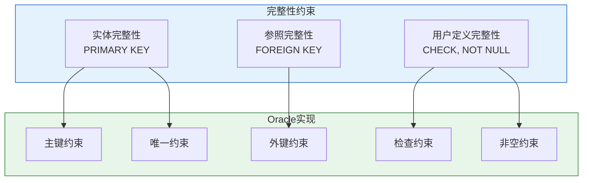

# Oracle关系完整性约束

## 一、概述

### 1.1 一句话定义

Oracle关系完整性约束，本质上是Oracle数据库保证数据正确性和一致性的规则机制。
它在表定义中出现和使用，解决数据冗余、不一致和无效数据的问题。

### 1.2 为什么重要

- **不掌握的后果：** 数据质量无法保证，业务逻辑错误，数据不一致
- **掌握的价值：** 设计健壮的数据模型，减少应用层校验负担

### 1.3 适用场景

| 场景 | 说明 |
|------|------|
| 数据建模 | 定义业务规则和数据完整性 |
| 数据质量控制 | 防止无效数据进入数据库 |
| 应用开发 | 减少应用层校验代码 |
| 数据迁移 | 保证迁移后数据一致性 |

### 1.4 版本演进

| 版本 | 变化说明 |
|------|---------|
| 11gR2 | 虚拟列约束支持 |
| 12cR1 | 增强外键级联操作 |
| 12cR2 | 约束性能优化 |
| 19c | 约束管理增强 |
| 21c | 增强JSON约束 |
| 23ai | 域类型约束 |

## 二、术语与概念

### 2.1 核心术语表

| 术语 | 含义 | 类比 |
|------|------|------|
| 实体完整性 | 主键不能为NULL | 身份证不能为空 |
| 参照完整性 | 外键必须引用有效主键 | 部门编号必须存在 |
| 用户定义完整性 | 业务规则约束 | 年龄必须大于0 |
| 约束状态 | ENABLE/DISABLE + VALIDATE/NOVALIDATE | 约束的开关和检查范围 |

### 2.2 约束类型关系



## 三、核心原理

### 3.1 实体完整性

实体完整性要求每个表都有主键，主键值必须唯一且非空。

```sql
-- 主键约束
CREATE TABLE employees (
    employee_id NUMBER(6) PRIMARY KEY,  -- 列级定义
    name VARCHAR2(50) NOT NULL
);

-- 复合主键
CREATE TABLE order_items (
    order_id NUMBER(10),
    item_id NUMBER(5),
    quantity NUMBER(10) NOT NULL,
    CONSTRAINT order_items_pk PRIMARY KEY (order_id, item_id)  -- 表级定义
);
```

**Oracle实现机制：**
- 自动创建唯一索引
- 插入重复值时报ORA-00001
- 插入NULL时报ORA-01400

### 3.2 参照完整性

参照完整性要求外键值必须在被引用表的主键中存在。

```sql
-- 创建被引用表
CREATE TABLE departments (
    dept_id NUMBER(4) PRIMARY KEY,
    dept_name VARCHAR2(30) NOT NULL
);

-- 创建外键约束
CREATE TABLE employees (
    emp_id NUMBER(6) PRIMARY KEY,
    name VARCHAR2(50) NOT NULL,
    dept_id NUMBER(4),
    CONSTRAINT emp_dept_fk FOREIGN KEY (dept_id) 
        REFERENCES departments(dept_id)
);

-- 带级联操作的外键
CREATE TABLE orders (
    order_id NUMBER(10) PRIMARY KEY,
    customer_id NUMBER(10) NOT NULL,
    CONSTRAINT orders_customer_fk FOREIGN KEY (customer_id)
        REFERENCES customers(customer_id)
        ON DELETE CASCADE  -- 删除父记录时级联删除子记录
);

-- SET NULL级联
CREATE TABLE employees (
    emp_id NUMBER(6) PRIMARY KEY,
    manager_id NUMBER(6),
    CONSTRAINT emp_mgr_fk FOREIGN KEY (manager_id)
        REFERENCES employees(emp_id)
        ON DELETE SET NULL  -- 删除时设置为NULL
);
```

**Oracle实现机制：**
- 外键列自动创建索引（建议手动创建以提高性能）
- 插入无效外键时报ORA-02291
- 删除被引用记录时报ORA-02292

### 3.3 用户定义完整性

用户定义完整性通过CHECK和NOT NULL约束实现业务规则。

```sql
-- CHECK约束
CREATE TABLE employees (
    emp_id NUMBER(6) PRIMARY KEY,
    name VARCHAR2(50) NOT NULL,
    salary NUMBER(10,2) CHECK (salary > 0),  -- 工资必须大于0
    age NUMBER(3) CHECK (age >= 18 AND age <= 65),  -- 年龄范围
    status VARCHAR2(10) CHECK (status IN ('ACTIVE', 'INACTIVE', 'TERMINATED')),
    CONSTRAINT emp_salary_ck CHECK (salary > 0)  -- 表级定义
);

-- 复杂CHECK约束
CREATE TABLE projects (
    project_id NUMBER(10) PRIMARY KEY,
    start_date DATE NOT NULL,
    end_date DATE,
    CONSTRAINT project_date_ck CHECK (end_date IS NULL OR end_date > start_date)
);
```

## 四、架构与组件

### 4.1 约束状态管理

Oracle约束有四种状态组合：

| 状态 | 说明 | 适用场景 |
|------|------|---------|
| ENABLE VALIDATE | 默认状态，检查新旧数据 | 生产环境 |
| ENABLE NOVALIDATE | 只检查新数据，不检查现有数据 | 大表添加约束 |
| DISABLE VALIDATE | 禁用约束，但保持验证状态 | 特殊场景 |
| DISABLE NOVALIDATE | 完全禁用，不检查任何数据 | 数据加载 |

```sql
-- 约束状态操作
ALTER TABLE employees ENABLE VALIDATE CONSTRAINT emp_salary_ck;
ALTER TABLE employees ENABLE NOVALIDATE CONSTRAINT emp_salary_ck;
ALTER TABLE employees DISABLE NOVALIDATE CONSTRAINT emp_salary_ck;

-- 大表添加约束（不验证现有数据）
ALTER TABLE employees ADD CONSTRAINT emp_age_ck 
    CHECK (age >= 18) ENABLE NOVALIDATE;
```

### 4.2 延迟约束

Oracle支持延迟约束检查，在事务提交时才检查。

```sql
-- 创建可延迟约束
CREATE TABLE employees (
    emp_id NUMBER(6),
    manager_id NUMBER(6),
    CONSTRAINT emp_mgr_fk FOREIGN KEY (manager_id)
        REFERENCES employees(emp_id)
        DEFERRABLE INITIALLY DEFERRED  -- 延迟到事务提交时检查
);

-- 设置约束检查时机
SET CONSTRAINT emp_mgr_fk DEFERRED;  -- 延迟检查
SET CONSTRAINT emp_mgr_fk IMMEDIATE; -- 立即检查

-- 使用场景：自引用表的批量插入
INSERT INTO employees VALUES (1, NULL);  -- 先插入经理
INSERT INTO employees VALUES (2, 1);     -- 再插入员工
COMMIT;  -- 此时才检查外键约束
```

## 五、配置与参数

### 5.1 约束定义语法

```sql
-- 列级约束
column_name datatype [CONSTRAINT constraint_name] constraint_type

-- 表级约束
[CONSTRAINT constraint_name] constraint_type (column_list)

-- 完整示例
CREATE TABLE orders (
    order_id NUMBER(10) CONSTRAINT orders_pk PRIMARY KEY,
    customer_id NUMBER(10) NOT NULL,
    order_date DATE DEFAULT SYSDATE,
    amount NUMBER(12,2) CONSTRAINT orders_amount_ck CHECK (amount > 0),
    status VARCHAR2(20) DEFAULT 'PENDING' 
        CONSTRAINT orders_status_ck CHECK (status IN ('PENDING','COMPLETED','CANCELLED')),
    CONSTRAINT orders_customer_fk FOREIGN KEY (customer_id) 
        REFERENCES customers(customer_id),
    CONSTRAINT orders_date_ck CHECK (order_date <= SYSDATE)
);
```

### 5.2 约束管理命令

```sql
-- 添加约束
ALTER TABLE employees ADD CONSTRAINT emp_email_uk UNIQUE (email);

-- 修改约束状态
ALTER TABLE employees DISABLE CONSTRAINT emp_email_uk;
ALTER TABLE employees ENABLE CONSTRAINT emp_email_uk;

-- 删除约束
ALTER TABLE employees DROP CONSTRAINT emp_email_uk;

-- 重命名约束
ALTER TABLE employees RENAME CONSTRAINT emp_email_uk TO emp_email_unique;

-- 查看约束
SELECT constraint_name, constraint_type, status, validated
FROM user_constraints
WHERE table_name = 'EMPLOYEES';
```

## 六、监控与诊断

### 6.1 约束信息查询

```sql
-- 查看所有约束
SELECT constraint_name, constraint_type, table_name, status
FROM user_constraints
ORDER BY table_name, constraint_type;

-- 查看约束类型说明
-- P = Primary Key
-- U = Unique
-- R = Foreign Key (Reference)
-- C = Check (includes NOT NULL)
-- V = Check Option on a View
-- O = Read Only on a View

-- 查看约束列
SELECT constraint_name, column_name, position
FROM user_cons_columns
WHERE table_name = 'EMPLOYEES'
ORDER BY constraint_name, position;

-- 查看外键引用关系
SELECT a.constraint_name, a.table_name, a.column_name,
       c.table_name AS referenced_table, c.column_name AS referenced_column
FROM user_cons_columns a
JOIN user_constraints b ON a.constraint_name = b.constraint_name
JOIN user_cons_columns c ON b.r_constraint_name = c.constraint_name
WHERE b.constraint_type = 'R'
ORDER BY a.table_name;
```

### 6.2 约束违反诊断

```sql
-- 查看约束违反异常
-- ORA-00001: unique constraint violated
-- ORA-01400: cannot insert NULL
-- ORA-02290: check constraint violated
-- ORA-02291: integrity constraint violated - parent key not found
-- ORA-02292: integrity constraint violated - child record found

-- 查找违反约束的数据
-- 示例：查找外键违反
SELECT e.employee_id, e.department_id
FROM employees e
LEFT JOIN departments d ON e.department_id = d.department_id
WHERE d.department_id IS NULL AND e.department_id IS NOT NULL;
```

## 七、实战案例

### 7.1 案例背景

- **场景**：电商系统订单表约束设计
- **时间**：2026年
- **现象**：需要保证订单数据的完整性和一致性

### 7.2 设计过程

**步骤1：定义业务规则**

- 订单号必须唯一
- 客户ID必须存在于客户表
- 订单金额必须大于0
- 订单状态必须是预定义值
- 发货日期不能早于下单日期

**步骤2：实现约束**

```sql
-- 客户表
CREATE TABLE customers (
    customer_id NUMBER(10) PRIMARY KEY,
    name VARCHAR2(100) NOT NULL,
    email VARCHAR2(100) UNIQUE
);

-- 订单表
CREATE TABLE orders (
    order_id NUMBER(15) PRIMARY KEY,
    customer_id NUMBER(10) NOT NULL,
    order_date DATE DEFAULT SYSDATE NOT NULL,
    ship_date DATE,
    amount NUMBER(12,2) NOT NULL,
    status VARCHAR2(20) DEFAULT 'PENDING' NOT NULL,
    -- 约束定义
    CONSTRAINT orders_customer_fk FOREIGN KEY (customer_id)
        REFERENCES customers(customer_id),
    CONSTRAINT orders_amount_ck CHECK (amount > 0),
    CONSTRAINT orders_status_ck CHECK (status IN ('PENDING','PAID','SHIPPED','DELIVERED','CANCELLED')),
    CONSTRAINT orders_date_ck CHECK (ship_date IS NULL OR ship_date >= order_date)
);

-- 创建索引提高外键查询性能
CREATE INDEX idx_orders_customer ON orders(customer_id);
```

**步骤3：验证约束**

```sql
-- 正常插入
INSERT INTO customers VALUES (1, 'John Doe', 'john@example.com');
INSERT INTO orders VALUES (1001, 1, SYSDATE, NULL, 299.99, 'PENDING');

-- 测试约束违反
-- 1. 主键重复
INSERT INTO orders VALUES (1001, 1, SYSDATE, NULL, 100.00, 'PENDING');
-- ORA-00001: unique constraint violated

-- 2. 外键违反
INSERT INTO orders VALUES (1002, 999, SYSDATE, NULL, 100.00, 'PENDING');
-- ORA-02291: integrity constraint violated - parent key not found

-- 3. CHECK违反
INSERT INTO orders VALUES (1003, 1, SYSDATE, NULL, -50.00, 'PENDING');
-- ORA-02290: check constraint violated

-- 4. 状态CHECK违反
INSERT INTO orders VALUES (1004, 1, SYSDATE, NULL, 100.00, 'INVALID');
-- ORA-02290: check constraint violated
```

### 7.3 设计结果

| 约束类型 | 数量 | 作用 |
|---------|------|------|
| PRIMARY KEY | 1 | 保证订单唯一性 |
| FOREIGN KEY | 1 | 保证客户存在 |
| CHECK | 3 | 保证金额、状态、日期合理 |
| NOT NULL | 3 | 保证关键字段非空 |

### 7.4 复盘总结

- **根因：** 通过约束在数据库层面保证数据完整性
- **教训：** 约束设计要全面覆盖业务规则，但也要考虑性能影响

## 八、常见错误与排查

### 8.1 常见错误列表

| 错误代码 | 错误信息 | 原因 | 解决方法 |
|---------|---------|------|---------|
| ORA-00001 | unique constraint violated | 主键或唯一键重复 | 检查重复值 |
| ORA-01400 | cannot insert NULL | 违反NOT NULL约束 | 提供非空值 |
| ORA-02290 | check constraint violated | 违反CHECK约束 | 检查数据是否符合规则 |
| ORA-02291 | parent key not found | 外键引用不存在 | 确保父记录存在 |
| ORA-02292 | child record found | 删除被引用的记录 | 先删除子记录或级联删除 |

### 8.2 排查步骤

1. **确认错误代码：** 查看完整错误信息
2. **定位约束名称：** 从错误信息获取约束名
3. **查看约束定义：** 查询user_constraints
4. **分析违反数据：** 找出导致违反的数据
5. **修复数据或调整约束：** 根据业务需求处理

## 九、最佳实践

### 9.1 官方推荐

- 每个表都应有主键
- 外键列应创建索引
- 使用有意义的约束名称
- 生产环境使用ENABLE VALIDATE状态
- 大表添加约束时使用NOVALIDATE选项

### 9.2 社区经验

- 约束命名规范：表名_列名_约束类型缩写
- CHECK约束使用IN代替多个OR
- 复杂业务规则考虑使用触发器
- 定期审查约束有效性

### 9.3 反模式

| 反模式 | 问题 | 正确做法 |
|--------|------|---------|
| 不使用约束 | 数据完整性无法保证 | 合理定义约束 |
| 约束命名随意 | 难以维护 | 使用规范命名 |
| 外键无索引 | 性能问题 | 外键列创建索引 |
| 过度使用约束 | 影响性能 | 平衡完整性和性能 |

## 十、命令与视图汇总

### 10.1 命令列表

| 命令 | 适用场景 | 说明 |
|------|---------|------|
| `ALTER TABLE ... ADD CONSTRAINT` | 添加约束 | 定义新的约束 |
| `ALTER TABLE ... ENABLE/DISABLE` | 启用/禁用约束 | 改变约束状态 |
| `ALTER TABLE ... DROP CONSTRAINT` | 删除约束 | 移除约束定义 |
| `ALTER TABLE ... VALIDATE/NOVALIDATE` | 验证/不验证 | 控制验证范围 |

### 10.2 视图列表

| 视图名 | 类型 | 用途 | 关键字段 |
|--------|------|------|---------|
| USER_CONSTRAINTS | 数据字典 | 约束信息 | CONSTRAINT_NAME, TYPE, STATUS |
| USER_CONS_COLUMNS | 数据字典 | 约束列 | COLUMN_NAME, POSITION |
| DBA_CONSTRAINTS | 数据字典 | 所有约束 | 需要DBA权限 |

## 十一、总结速查

### 11.1 黄金法则

1. **主键是必须的** - 每个表都应有主键
2. **外键创建索引** - 提高关联查询性能
3. **CHECK覆盖业务规则** - 在数据库层面保证数据正确性

### 11.2 一页纸检查清单

| 现象/场景 | 原因 | 处理方案 |
|-----------|------|----------|
| ORA-00001 | 主键重复 | 检查重复值，调整数据 |
| ORA-02291 | 外键违反 | 确保父记录存在 |
| ORA-02290 | CHECK违反 | 检查数据是否符合规则 |
| 约束性能问题 | 约束过多或无索引 | 优化约束，添加索引 |

### 11.3 关键数字

| 指标 | 正常范围 | 告警阈值 | 说明 |
|------|---------|---------|------|
| 每表约束数 | 3-10 | >20 | 约束过多影响性能 |
| 外键索引覆盖率 | 100% | <100% | 外键应全部有索引 |

## 附录

### A. 约束类型速查

| 类型代码 | 约束类型 | 说明 |
|---------|---------|------|
| P | Primary Key | 主键约束 |
| U | Unique | 唯一约束 |
| R | Foreign Key | 外键约束 |
| C | Check | 检查约束（含NOT NULL） |
| V | Check Option | 视图检查选项 |
| O | Read Only | 视图只读 |

### B. 官方参考

- [Oracle Database SQL Language Reference - Constraints](https://docs.oracle.com/en/database/oracle/oracle-database/19c/sqlqr/Constraints.html)
- [Oracle Database Concepts - Data Integrity](https://docs.oracle.com/en/database/oracle/oracle-database/19c/cncpt/data-integrity.html)

### C. 修订记录

| 日期 | 版本 | 修改内容 | 修改人 |
|------|------|---------|--------|
| 2026-07-01 | v1.0 | 初始版本 | YashanDB知识库生成器 |
