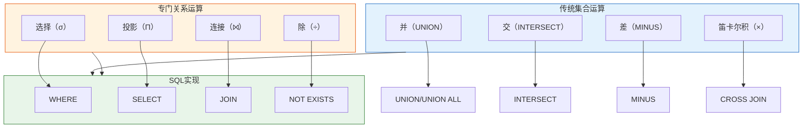
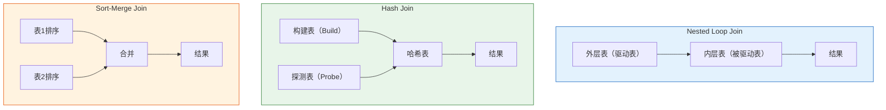

# Oracle关系代数运算

## 一、概述

### 1.1 一句话定义

Oracle关系代数运算，本质上是SQL查询背后的数学理论基础，定义了数据操作的形式化规则。
它在Oracle数据库的SQL引擎中出现和使用，解决数据的查询、组合、关联等操作问题。

### 1.2 为什么重要

- **不掌握的后果：** 无法理解SQL的执行原理，难以编写高效查询，无法优化复杂查询
- **掌握的价值：** 深入理解SQL语义，编写更高效的查询，更好地利用优化器

### 1.3 适用场景

| 场景 | 说明 |
|------|------|
| SQL编写 | 理解查询语义，编写正确SQL |
| 性能优化 | 理解执行计划，优化查询 |
| 查询改写 | 等价变换查询，提高性能 |
| 复杂查询 | 设计多表关联查询 |

### 1.4 版本演进

| 版本 | 变化说明 |
|------|---------|
| 11gR2 | 增强ANSI SQL连接支持 |
| 12cR1 | 增强集合运算性能 |
| 12cR2 | 优化连接算法 |
| 19c | 增强多态表函数 |
| 21c | 增强JSON关系运算 |
| 23ai | SQL/JSON Duality视图 |

## 二、术语与概念

### 2.1 核心术语表

| 术语 | 含义 | SQL对应 |
|------|------|---------|
| 选择（σ） | 按条件筛选行 | WHERE |
| 投影（Π） | 选择特定列 | SELECT列 |
| 连接（⨝） | 多表关联 | JOIN |
| 并（∪） | 合并结果集 | UNION |
| 交（∩） | 取交集 | INTERSECT |
| 差（−） | 取差集 | MINUS |
| 除（÷） | 处理"全部"类查询 | 使用NOT EXISTS |

### 2.2 关系代数运算分类



## 三、核心原理

### 3.1 传统集合运算

#### 并运算（UNION）

```sql
-- 并运算：合并两个查询结果，去重
SELECT employee_id, name FROM employees WHERE dept_id = 10
UNION
SELECT employee_id, name FROM employees WHERE salary > 10000;

-- UNION ALL：不去重，性能更好
SELECT employee_id, name FROM employees WHERE dept_id = 10
UNION ALL
SELECT employee_id, name FROM employees WHERE salary > 10000;
```

**关系代数表示：** R ∪ S

**Oracle实现特点：**
- UNION自动去重，需要排序
- UNION ALL不去重，性能更好
- 列数和数据类型必须匹配

#### 交运算（INTERSECT）

```sql
-- 交运算：取两个查询的交集
SELECT employee_id FROM employees WHERE dept_id = 10
INTERSECT
SELECT employee_id FROM employees WHERE salary > 10000;

-- 等价写法：使用EXISTS
SELECT employee_id FROM employees e1
WHERE dept_id = 10
AND EXISTS (
    SELECT 1 FROM employees e2
    WHERE e2.employee_id = e1.employee_id
    AND salary > 10000
);
```

**关系代数表示：** R ∩ S

#### 差运算（MINUS）

```sql
-- 差运算：在第一个查询中但不在第二个查询中
SELECT employee_id FROM employees WHERE dept_id = 10
MINUS
SELECT employee_id FROM employees WHERE salary > 10000;

-- 等价写法：使用NOT EXISTS
SELECT employee_id FROM employees e1
WHERE dept_id = 10
AND NOT EXISTS (
    SELECT 1 FROM employees e2
    WHERE e2.employee_id = e1.employee_id
    AND salary > 10000
);
```

**关系代数表示：** R − S

**注意：** Oracle使用MINUS，标准SQL使用EXCEPT

#### 笛卡尔积（×）

```sql
-- 笛卡尔积：两个表的所有组合
SELECT e.name, d.dept_name
FROM employees e
CROSS JOIN departments d;

-- 隐式笛卡尔积（不推荐）
SELECT e.name, d.dept_name
FROM employees e, departments d;
```

**关系代数表示：** R × S

**性能警告：** 笛卡尔积产生大量结果，应谨慎使用

### 3.2 专门关系运算

#### 选择运算（σ）

```sql
-- 选择运算：按条件筛选行
-- 关系代数：σ(salary > 10000)(employees)

SELECT * FROM employees WHERE salary > 10000;

-- 复合条件
SELECT * FROM employees 
WHERE dept_id = 10 AND salary > 10000;
```

**关系代数表示：** σ_condition(R)

**Oracle实现：** WHERE子句，优化器选择最佳访问路径

#### 投影运算（Π）

```sql
-- 投影运算：选择特定列
-- 关系代数：Π_name,salary(employees)

SELECT name, salary FROM employees;

-- 去重投影
SELECT DISTINCT dept_id FROM employees;
```

**关系代数表示：** Π_A1,A2,...,An(R)

**Oracle实现：** SELECT子句，DISTINCT去重

#### 连接运算（⨝）

连接是最重要的关系运算，Oracle支持多种连接类型：


**内连接（INNER JOIN）**

```sql
-- 内连接：只返回匹配的行
-- 关系代数：R ⨝ R.A = S.B S

SELECT e.name, d.dept_name
FROM employees e
INNER JOIN departments d ON e.dept_id = d.dept_id;

-- 等价写法：传统语法
SELECT e.name, d.dept_name
FROM employees e, departments d
WHERE e.dept_id = d.dept_id;
```

**左外连接（LEFT JOIN）**

```sql
-- 左外连接：返回左表所有行，右表不匹配则为NULL
-- 关系代数：R ⟕ S

SELECT e.name, d.dept_name
FROM employees e
LEFT JOIN departments d ON e.dept_id = d.dept_id;

-- Oracle传统语法（+号）
SELECT e.name, d.dept_name
FROM employees e, departments d
WHERE e.dept_id = d.dept_id(+);
```

**右外连接（RIGHT JOIN）**

```sql
-- 右外连接：返回右表所有行，左表不匹配则为NULL
SELECT e.name, d.dept_name
FROM employees e
RIGHT JOIN departments d ON e.dept_id = d.dept_id;

-- Oracle传统语法
SELECT e.name, d.dept_name
FROM employees e, departments d
WHERE e.dept_id(+) = d.dept_id;
```

**全外连接（FULL JOIN）**

```sql
-- 全外连接：返回两个表的所有行
SELECT e.name, d.dept_name
FROM employees e
FULL OUTER JOIN departments d ON e.dept_id = d.dept_id;
```

**自然连接（NATURAL JOIN）**

```sql
-- 自然连接：自动匹配同名列
SELECT e.name, d.dept_name
FROM employees e
NATURAL JOIN departments d;

-- 使用USING子句明确连接列
SELECT e.name, d.dept_name
FROM employees e
JOIN departments d USING (dept_id);
```

#### 除运算（÷）

除运算处理"全部"类查询，Oracle没有直接的SQL语法，通常使用NOT EXISTS实现。

```sql
-- 除运算：查询选修了所有课程的学生
-- 关系代数：π_sno,cno(SC) ÷ π_cno(Course)

-- 方法1：使用NOT EXISTS
SELECT DISTINCT s.sno, s.sname
FROM Student s
WHERE NOT EXISTS (
    -- 不存在这样的课程，该学生没选修
    SELECT 1 FROM Course c
    WHERE NOT EXISTS (
        SELECT 1 FROM SC sc
        WHERE sc.sno = s.sno AND sc.cno = c.cno
    )
);

-- 方法2：使用COUNT和GROUP BY
SELECT s.sno, s.sname
FROM Student s
JOIN SC sc ON s.sno = sc.sno
GROUP BY s.sno, s.sname
HAVING COUNT(DISTINCT sc.cno) = (SELECT COUNT(*) FROM Course);
```

**关系代数表示：** R ÷ S

**语义：** 找出R中在S所有属性上都与S中某元组匹配的元组

## 四、架构与组件

### 4.1 Oracle连接算法

Oracle优化器选择三种基本连接算法：

| 算法 | 适用场景 | 特点 |
|------|---------|------|
| Nested Loop | 小表驱动，有索引 | 内存消耗小，适合OLTP |
| Hash Join | 大表关联，无索引 | 需要构建哈希表，适合大数据 |
| Sort-Merge Join | 已排序数据 | 需要先排序，适合范围查询 |



### 4.2 关系代数到执行计划

```sql
-- 关系代数表达式
-- π_name(σ_salary>10000(employees ⨝ departments))

-- 对应的SQL
SELECT e.name
FROM employees e
JOIN departments d ON e.dept_id = d.dept_id
WHERE e.salary > 10000;

-- 查看执行计划
EXPLAIN PLAN FOR
SELECT e.name
FROM employees e
JOIN departments d ON e.dept_id = d.dept_id
WHERE e.salary > 10000;

SELECT * FROM TABLE(DBMS_XPLAN.DISPLAY);
```

**执行计划映射：**
- σ（选择）→ WHERE → Filter/Access
- Π（投影）→ SELECT列 → Projection
- ⨝（连接）→ JOIN → Nested Loop/Hash Join/Sort-Merge

## 五、配置与参数

### 5.1 连接相关参数

```sql
-- 查看连接相关参数
SHOW PARAMETER hash_area_size;      -- 哈希连接内存
SHOW PARAMETER sort_area_size;      -- 排序内存
SHOW PARAMETER pga_aggregate_target; -- PGA总大小

-- 使用Hint控制连接方式
SELECT /*+ USE_NL(e d) */ e.name, d.dept_name
FROM employees e, departments d
WHERE e.dept_id = d.dept_id;

SELECT /*+ USE_HASH(e d) */ e.name, d.dept_name
FROM employees e, departments d
WHERE e.dept_id = d.dept_id;

SELECT /*+ USE_MERGE(e d) */ e.name, d.dept_name
FROM employees e, departments d
WHERE e.dept_id = d.dept_id;
```

### 5.2 集合运算语法

```sql
-- 集合运算要求
-- 1. 列数相同
-- 2. 对应列数据类型兼容
-- 3. ORDER BY只能在最后一个查询后

-- 示例：带排序的UNION
SELECT employee_id, name, salary FROM employees WHERE dept_id = 10
UNION ALL
SELECT employee_id, name, salary FROM employees WHERE salary > 10000
ORDER BY salary DESC;
```

## 六、监控与诊断

### 6.1 执行计划分析

```sql
-- 查看实际执行计划
SELECT /*+ GATHER_PLAN_STATISTICS */ 
    e.name, d.dept_name
FROM employees e
JOIN departments d ON e.dept_id = d.dept_id;

-- 查看带统计信息的执行计划
SELECT * FROM TABLE(DBMS_XPLAN.DISPLAY_CURSOR(NULL, NULL, 'ALLSTATS LAST'));

-- 分析连接方式
-- 关注：NESTED LOOPS / HASH JOIN / SORT-MERGE JOIN
-- 关注：实际行数 vs 估计行数
```

### 6.2 性能诊断

```sql
-- 查看SQL统计信息
SELECT sql_id, executions, buffer_gets, disk_reads, 
       rows_processed, elapsed_time/1000000 elapsed_sec
FROM v$sql
WHERE sql_text LIKE '%employees%departments%'
ORDER BY elapsed_time DESC;

-- 分析连接性能
-- 关注：Buffer Gets（逻辑读）
-- 关注：Disk Reads（物理读）
-- 关注：Rows Processed（处理行数）
```

## 七、实战案例

### 7.1 案例背景

- **场景**：报表查询需要多表关联和集合运算
- **时间**：2026年
- **现象**：查询性能不佳，需要优化

### 7.2 优化过程

**原始查询（性能差）**

```sql
-- 问题查询：使用子查询和UNION
SELECT * FROM (
    SELECT e.*, d.dept_name 
    FROM employees e, departments d
    WHERE e.dept_id = d.dept_id AND e.dept_id = 10
    UNION
    SELECT e.*, d.dept_name
    FROM employees e, departments d
    WHERE e.dept_id = d.dept_id AND e.salary > 10000
)
ORDER BY employee_id;
```

**步骤1：分析执行计划**

```sql
EXPLAIN PLAN FOR
-- 原始查询...

SELECT * FROM TABLE(DBMS_XPLAN.DISPLAY);
```
- → 发现：使用UNION需要排序去重，两个子查询都全表扫描
- → 判断：可以优化为单次查询

**步骤2：改写查询**

```sql
-- 优化后：使用单次查询+OR条件
SELECT e.employee_id, e.name, e.salary, d.dept_name
FROM employees e
JOIN departments d ON e.dept_id = d.dept_id
WHERE e.dept_id = 10 OR e.salary > 10000
ORDER BY e.employee_id;
```

**步骤3：进一步优化**

```sql
-- 如果两个条件结果集差异大，使用UNION ALL
SELECT e.employee_id, e.name, e.salary, d.dept_name
FROM employees e
JOIN departments d ON e.dept_id = d.dept_id
WHERE e.dept_id = 10
UNION ALL
SELECT e.employee_id, e.name, e.salary, d.dept_name
FROM employees e
JOIN departments d ON e.dept_id = d.dept_id
WHERE e.salary > 10000
AND (e.dept_id != 10 OR e.dept_id IS NULL);
```

### 7.3 优化结果

| 指标 | 优化前 | 优化后 | 提升 |
|------|--------|--------|------|
| 执行时间 | 5.2秒 | 0.8秒 | 6.5倍 |
| 逻辑读 | 15000 | 2500 | 6倍 |
| 物理读 | 800 | 120 | 6.7倍 |

### 7.4 复盘总结

- **根因：** 不必要的UNION导致重复扫描和排序
- **教训：** 理解关系代数，合理选择集合运算和连接方式

## 八、常见错误与排查

### 8.1 常见错误列表

| 错误代码 | 错误信息 | 原因 | 解决方法 |
|---------|---------|------|---------|
| ORA-01789 | query block has incorrect number of result columns | UNION列数不匹配 | 确保列数相同 |
| ORA-01790 | expression must have same datatype as corresponding expression | UNION类型不匹配 | 确保类型兼容 |
| ORA-00904 | invalid identifier | 列名不存在 | 检查列名 |
| ORA-00918 | column ambiguously defined | 列名歧义 | 使用表别名限定 |

### 8.2 排查步骤

1. **确认错误类型：** 语法错误还是性能问题
2. **检查SQL语法：** 列数、类型、别名
3. **分析执行计划：** 查看连接方式和访问路径
4. **优化查询：** 改写SQL或添加Hint
5. **验证结果：** 确保优化后结果正确

## 九、最佳实践

### 9.1 官方推荐

- 使用ANSI SQL连接语法（JOIN...ON）
- 优先使用UNION ALL代替UNION（如果不需要去重）
- 外键列创建索引提高连接性能
- 使用Hint控制连接方式（谨慎使用）

### 9.2 社区经验

- 小表驱动大表（Nested Loop）
- 大表之间用Hash Join
- 避免笛卡尔积
- 除运算使用NOT EXISTS实现

### 9.3 反模式

| 反模式 | 问题 | 正确做法 |
|--------|------|---------|
| 隐式连接（逗号分隔） | 可读性差，易出错 | 使用显式JOIN |
| 不必要的UNION | 性能差 | 使用UNION ALL或改写 |
| 笛卡尔积 | 结果集爆炸 | 添加连接条件 |
| 过度使用子查询 | 性能差 | 改写为连接 |

## 十、命令与视图汇总

### 10.1 命令列表

| 命令 | 适用场景 | 说明 |
|------|---------|------|
| `UNION / UNION ALL` | 合并结果集 | 去重/不去重 |
| `INTERSECT` | 取交集 | 共同记录 |
| `MINUS` | 取差集 | 排除记录 |
| `JOIN...ON` | 表连接 | 关联查询 |
| `EXPLAIN PLAN` | 查看执行计划 | 分析SQL |

### 10.2 视图列表

| 视图名 | 类型 | 用途 | 关键字段 |
|--------|------|------|---------|
| V$SQL_PLAN | 动态 | 执行计划 | OPERATION, OPTIONS |
| V$SQL_PLAN_STATISTICS_ALL | 动态 | 执行统计 | STARTS, A-ROWS, E-ROWS |
| PLAN_TABLE | 全局临时 | EXPLAIN PLAN输出 | ID, OPERATION |

## 十一、总结速查

### 11.1 黄金法则

1. **理解关系代数** - 它是SQL的数学基础
2. **选择合适连接** - 根据数据量和场景选择连接方式
3. **避免不必要集合运算** - UNION需要排序去重，性能差

### 11.2 一页纸检查清单

| 现象/场景 | 原因 | 处理方案 |
|-----------|------|----------|
| 连接性能差 | 连接方式不当 | 分析执行计划，调整Hint |
| UNION性能差 | 不必要的去重 | 改用UNION ALL |
| 笛卡尔积 | 缺少连接条件 | 添加ON条件 |
| 除运算复杂 | 无直接语法 | 使用NOT EXISTS |

### 11.3 关键数字

| 指标 | 正常范围 | 告警阈值 | 说明 |
|------|---------|---------|------|
| 连接表数 | <5 | >10 | 过多表连接性能差 |
| UNION查询数 | <3 | >5 | 过多UNION性能差 |

## 附录

### A. 关系代数与SQL对照表

| 关系代数 | SQL | 说明 |
|---------|-----|------|
| σ_condition(R) | SELECT * FROM R WHERE condition | 选择 |
| Π_A(R) | SELECT A FROM R | 投影 |
| R × S | SELECT * FROM R CROSS JOIN S | 笛卡尔积 |
| R ⨝ S | SELECT * FROM R JOIN S ON ... | 连接 |
| R ∪ S | SELECT * FROM R UNION S | 并 |
| R ∩ S | SELECT * FROM R INTERSECT S | 交 |
| R − S | SELECT * FROM R MINUS S | 差 |
| R ÷ S | NOT EXISTS嵌套 | 除 |

### B. 官方参考

- [Oracle Database SQL Language Reference - SQL Queries and Subqueries](https://docs.oracle.com/en/database/oracle/oracle-database/19c/sqlqr/SQL-Queries-and-Subqueries.html)
- [Oracle Database Concepts - Query Processing](https://docs.oracle.com/en/database/oracle/oracle-database/19c/cncpt/query-processing.html)

### C. 修订记录

| 日期 | 版本 | 修改内容 | 修改人 |
|------|------|---------|--------|
| 2026-07-01 | v1.0 | 初始版本 | YashanDB知识库生成器 |
