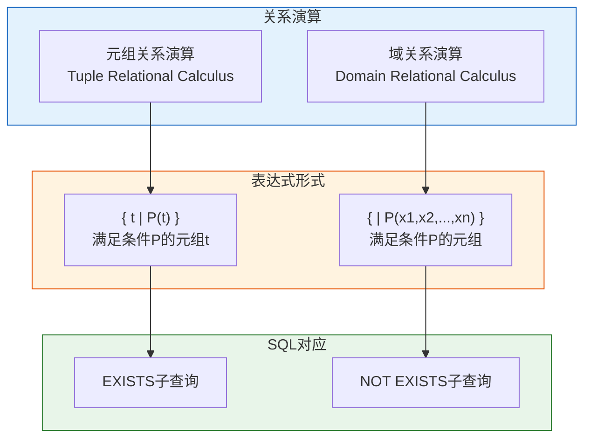

# Oracle关系演算

## 一、概述

### 1.1 一句话定义

Oracle关系演算，本质上是关系数据库的另一种形式化查询语言理论，与关系代数等价但表达方式不同。
它在Oracle SQL的语义理解中出现和使用，帮助开发者理解SQL查询的本质含义。

### 1.2 为什么重要

- **不掌握的后果：** 难以深入理解SQL的语义，无法进行查询等价变换
- **掌握的价值：** 从理论层面理解SQL，更好地编写和优化查询

### 1.3 适用场景

| 场景 | 说明 |
|------|------|
| SQL理解 | 从理论角度理解SQL语义 |
| 查询优化 | 等价变换查询表达式 |
| 学术研究 | 数据库理论基础 |
| 教学培训 | 数据库原理教学 |

### 1.4 版本演进

| 版本 | 变化说明 |
|------|---------|
| 所有版本 | Oracle SQL实现基于关系演算理论 |
| 12c+ | 增强 lateral 子句支持 |
| 19c | 增强多态表函数 |
| 23ai | SQL/JSON Duality视图 |

## 二、术语与概念

### 2.1 核心术语表

| 术语 | 含义 | 类比 |
|------|------|------|
| 元组关系演算 | 以元组（行）为变量的演算 | 按行查找 |
| 域关系演算 | 以属性值为变量的演算 | 按列值查找 |
| 原子公式 | 基本查询条件 | 单个筛选条件 |
| 量词 | 存在量词∃、全称量词∀ | EXISTS/NOT EXISTS |
| QBE | Query By Example，基于域演算 | 填表式查询 |

### 2.2 关系演算分类



## 三、核心原理

### 3.1 元组关系演算

元组关系演算以元组（行）为变量，表达式形式为 `{ t | P(t) }`。

**基本表达式：**

```
{ t | t ∈ R ∧ P(t) }
```

含义：从关系R中选取满足条件P的元组t

**Oracle SQL对应：**

```sql
-- 元组演算：{ t | t ∈ employees ∧ t.salary > 10000 }
-- SQL实现：
SELECT * FROM employees WHERE salary > 10000;
```

**存在量词（∃）：**

```
{ t | ∃s ∈ departments (t.dept_id = s.dept_id ∧ s.dept_name = 'IT') }
```

含义：存在departments中的元组s，满足条件

```sql
-- SQL实现：
SELECT * FROM employees e
WHERE EXISTS (
    SELECT 1 FROM departments d
    WHERE d.dept_id = e.dept_id
    AND d.dept_name = 'IT'
);
```

**全称量词（∀）：**

```
{ t | ∀s ∈ departments (s.dept_name = 'IT' → t.dept_id = s.dept_id) }
```

含义：对于所有departments中的元组s，如果s.dept_name='IT'，则t.dept_id=s.dept_id

```sql
-- SQL实现：使用双重NOT EXISTS
SELECT * FROM employees e
WHERE NOT EXISTS (
    SELECT 1 FROM departments d
    WHERE d.dept_name = 'IT'
    AND d.dept_id != e.dept_id
);
```

### 3.2 域关系演算

域关系演算以属性值（域）为变量，表达式形式为 `{ <x1,x2,...,xn> | P(x1,x2,...,xn) }`。

**基本表达式：**

```
{ <eid, name, salary> | <eid, name, salary, dept_id> ∈ employees ∧ salary > 10000 }
```

含义：从employees中选取salary>10000的元组，投影指定属性

```sql
-- SQL实现：
SELECT employee_id, name, salary 
FROM employees 
WHERE salary > 10000;
```

**域演算与QBE：**

QBE（Query By Example）是基于域关系演算的图形化查询语言。

```
-- QBE示例：查询工资大于10000的员工
employees | employee_id | name | salary | dept_id |
          | P.eid       | P.n  | >10000 | P.d     |

-- 等价SQL：
SELECT employee_id, name, dept_id 
FROM employees 
WHERE salary > 10000;
```

### 3.3 关系演算与SQL的等价性

| 关系演算 | SQL | 说明 |
|---------|-----|------|
| { t \| t ∈ R } | SELECT * FROM R | 全表查询 |
| { t \| t ∈ R ∧ t.A > v } | SELECT * FROM R WHERE A > v | 选择 |
| { t.A \| t ∈ R } | SELECT A FROM R | 投影 |
| { t \| ∃s ∈ S (t.A = s.B) } | SELECT * FROM R WHERE A IN (SELECT B FROM S) | 存在 |
| { t \| ∀s ∈ S (P(s)) } | SELECT * FROM R WHERE NOT EXISTS (SELECT 1 FROM S WHERE NOT P) | 全称 |

## 四、架构与组件

### 4.1 关系演算的安全性

关系演算表达式必须是**安全的**，即结果必须是有限集合。

**安全表达式：**
```
{ t | t ∈ employees ∧ t.salary > 10000 }
```
结果有限，安全

**不安全表达式：**
```
{ t | ¬(t ∈ employees) }
```
结果无限（所有不在employees中的元组），不安全

**Oracle SQL限制：**
- SQL只允许安全表达式
- 不允许产生无限结果的查询

### 4.2 关系演算的等价变换

```sql
-- 原始查询
SELECT e.name 
FROM employees e
WHERE e.dept_id IN (
    SELECT d.dept_id FROM departments d WHERE d.location = 'Beijing'
);

-- 等价变换1：使用EXISTS
SELECT e.name
FROM employees e
WHERE EXISTS (
    SELECT 1 FROM departments d
    WHERE d.dept_id = e.dept_id
    AND d.location = 'Beijing'
);

-- 等价变换2：使用JOIN
SELECT e.name
FROM employees e
JOIN departments d ON e.dept_id = d.dept_id
WHERE d.location = 'Beijing';

-- 等价变换3：使用半连接（Oracle优化器可能自动转换）
SELECT /*+ SEMIJOIN */ e.name
FROM employees e
WHERE e.dept_id IN (
    SELECT d.dept_id FROM departments d WHERE d.location = 'Beijing'
);
```

## 五、配置与参数

### 5.1 查看SQL的关系演算语义

```sql
-- 查看执行计划，理解SQL的内部处理
EXPLAIN PLAN FOR
SELECT e.name
FROM employees e
WHERE EXISTS (
    SELECT 1 FROM departments d
    WHERE d.dept_id = e.dept_id
    AND d.location = 'Beijing'
);

SELECT * FROM TABLE(DBMS_XPLAN.DISPLAY);

-- 关注：SEMI JOIN / ANTI JOIN
-- 这些是关系演算中∃和∀的实现
```

### 5.2 相关子查询与关系演算

```sql
-- 相关子查询对应元组演算中的存在量词
SELECT e.name, e.salary
FROM employees e
WHERE e.salary > (
    SELECT AVG(salary) FROM employees e2
    WHERE e2.dept_id = e.dept_id  -- 相关条件
);

-- 关系演算表示：
-- { t | t ∈ employees ∧ t.salary > avg({ s.salary | s ∈ employees ∧ s.dept_id = t.dept_id }) }
```

## 六、监控与诊断

### 6.1 查询等价性验证

```sql
-- 验证两个查询是否等价
-- 方法1：使用MINUS检查差异
(SELECT * FROM query1 MINUS SELECT * FROM query2)
UNION ALL
(SELECT * FROM query2 MINUS SELECT * FROM query1);

-- 如果结果为空，两个查询等价

-- 方法2：比较执行计划
EXPLAIN PLAN FOR query1;
-- 记录plan_hash_value
EXPLAIN PLAN FOR query2;
-- 比较plan_hash_value
```

### 6.2 性能对比

```sql
-- 对比不同写法的性能
-- 写法1：IN子查询
SELECT * FROM employees WHERE dept_id IN (SELECT dept_id FROM departments WHERE location = 'Beijing');

-- 写法2：EXISTS
SELECT * FROM employees e WHERE EXISTS (SELECT 1 FROM departments d WHERE d.dept_id = e.dept_id AND d.location = 'Beijing');

-- 写法3：JOIN
SELECT e.* FROM employees e JOIN departments d ON e.dept_id = d.dept_id WHERE d.location = 'Beijing';

-- 使用AUTOTRACE对比
SET AUTOTRACE ON
-- 执行各查询，对比统计信息
```

## 七、实战案例

### 7.1 案例背景

- **场景**：将复杂业务需求转换为SQL
- **时间**：2026年
- **现象**：需求描述为自然语言，需要转换为SQL

### 7.2 转换过程

**需求描述：**
"查询选修了所有课程的学生姓名"

**步骤1：关系演算表达**

```
{ t.name | t ∈ Student ∧ ∀c ∈ Course (∃sc ∈ SC (sc.sno = t.sno ∧ sc.cno = c.cno)) }
```

**步骤2：转换为SQL**

```sql
-- 使用双重NOT EXISTS实现全称量词
SELECT s.sname
FROM Student s
WHERE NOT EXISTS (
    -- 不存在这样的课程
    SELECT 1 FROM Course c
    WHERE NOT EXISTS (
        -- 该学生没有选修
        SELECT 1 FROM SC sc
        WHERE sc.sno = s.sno AND sc.cno = c.cno
    )
);
```

**步骤3：验证结果**

```sql
-- 使用COUNT方法验证
SELECT s.sname
FROM Student s
JOIN SC sc ON s.sno = sc.sno
GROUP BY s.sno, s.sname
HAVING COUNT(DISTINCT sc.cno) = (SELECT COUNT(*) FROM Course);
```

### 7.3 转换结果

| 步骤 | 表达 | 说明 |
|------|------|------|
| 需求 | 自然语言 | 查询选修所有课程的学生 |
| 关系演算 | ∀c ∃sc | 全称量词+存在量词 |
| SQL | NOT EXISTS嵌套 | 双重否定实现全称 |

### 7.4 复盘总结

- **根因：** 全称量词在SQL中没有直接对应，需要使用双重NOT EXISTS
- **教训：** 理解关系演算有助于处理复杂的"全部"类查询

## 八、常见错误与排查

### 8.1 常见错误

| 错误 | 原因 | 解决方法 |
|------|------|---------|
| 全称量词转换错误 | 不理解双重否定 | 使用NOT EXISTS嵌套 |
| 相关子查询性能差 | 每行都执行子查询 | 改写为JOIN |
| 无限结果集 | 不安全的演算表达式 | SQL不允许，检查逻辑 |

## 九、最佳实践

### 9.1 官方推荐

- 优先使用JOIN代替相关子查询（性能更好）
- 使用EXISTS代替IN（对于大数据集）
- 理解查询语义后再优化

### 9.2 社区经验

- 复杂查询先用关系演算表达，再转换为SQL
- 全称量词使用双重NOT EXISTS
- 验证查询等价性

### 9.3 反模式

| 反模式 | 问题 | 正确做法 |
|--------|------|---------|
| 不理解语义就写SQL | 逻辑错误 | 先用关系演算表达 |
| 过度使用子查询 | 性能差 | 改写为JOIN |
| 忽略安全性 | 理论错误 | 确保结果有限 |

## 十、命令与视图汇总

### 10.1 命令列表

| 命令 | 适用场景 | 说明 |
|------|---------|------|
| `EXISTS` | 存在量词 | 检查子查询是否有结果 |
| `NOT EXISTS` | 全称量词 | 双重否定实现∀ |
| `EXPLAIN PLAN` | 查看执行计划 | 理解SQL内部处理 |

### 10.2 视图列表

| 视图名 | 类型 | 用途 |
|--------|------|------|
| V$SQL_PLAN | 动态 | 查看执行计划 |
| PLAN_TABLE | 临时 | EXPLAIN PLAN输出 |

## 十一、总结速查

### 11.1 黄金法则

1. **理解关系演算** - 它是SQL的理论基础
2. **全称量词用双重NOT EXISTS** - SQL没有直接的∀语法
3. **确保表达式安全** - 结果必须是有限集合

### 11.2 一页纸检查清单

| 现象/场景 | 原因 | 处理方案 |
|-----------|------|----------|
| 全称查询不会写 | 不理解∀的转换 | 使用双重NOT EXISTS |
| 子查询性能差 | 相关子查询 | 改写为JOIN |
| 查询结果不对 | 语义理解错误 | 用关系演算验证 |

## 附录

### A. 关系演算与SQL对照

| 关系演算 | SQL | 说明 |
|---------|-----|------|
| { t \| t ∈ R } | SELECT * FROM R | 基本查询 |
| { t \| t ∈ R ∧ P(t) } | SELECT * FROM R WHERE P | 选择 |
| { t.A \| t ∈ R } | SELECT A FROM R | 投影 |
| { t \| ∃s ∈ S (t.A = s.B) } | WHERE EXISTS / IN | 存在 |
| { t \| ∀s ∈ S (P(s)) } | WHERE NOT EXISTS (NOT P) | 全称 |

### B. 官方参考

- [Oracle Database SQL Language Reference](https://docs.oracle.com/en/database/oracle/oracle-database/19c/sqlqr/)
- Database System Concepts (Silberschatz, Korth, Sudarshan) - Chapter on Relational Calculus

### C. 修订记录

| 日期 | 版本 | 修改内容 | 修改人 |
|------|------|---------|--------|
| 2026-07-01 | v1.0 | 初始版本 | YashanDB知识库生成器 |
