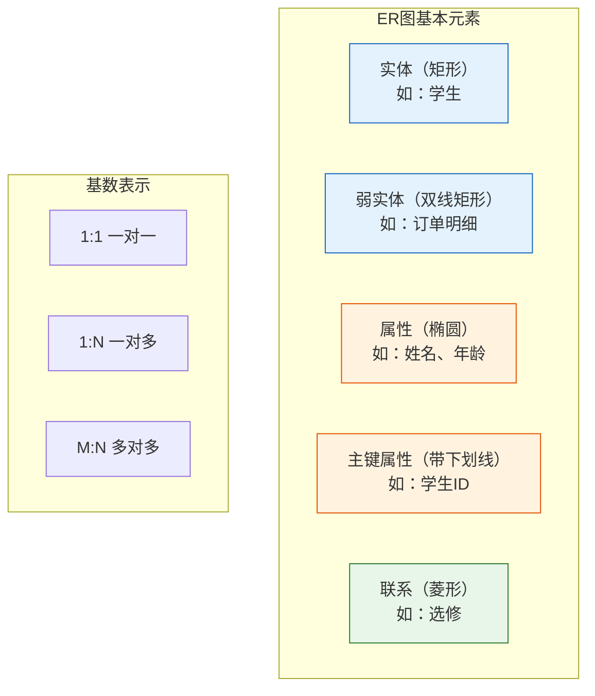
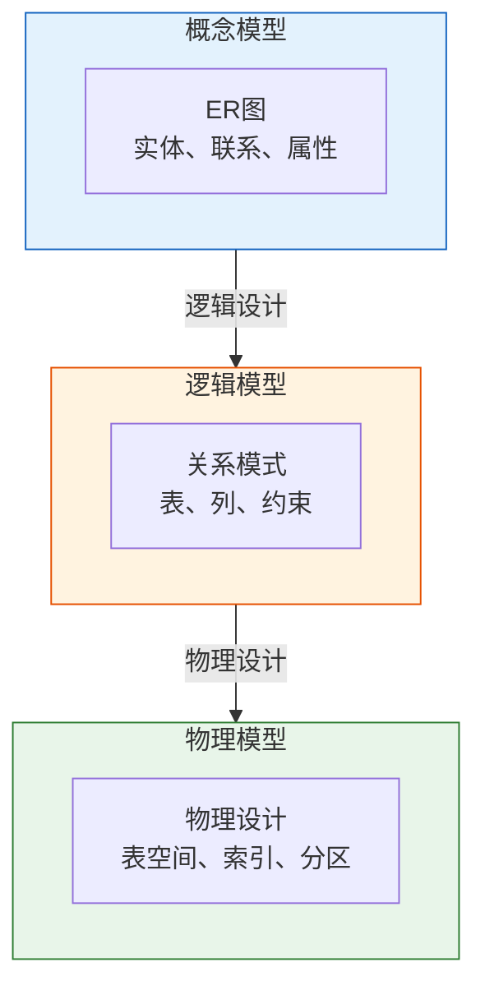
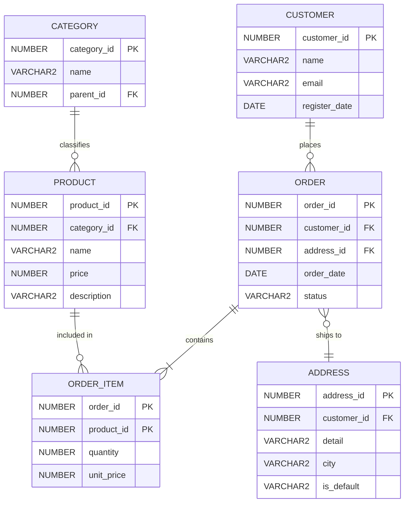
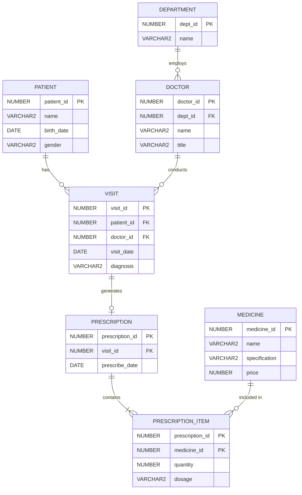

# Oracle概念模型与ER模型设计

## 一、概述

### 1.1 一句话定义

Oracle概念模型与ER模型设计，本质上是使用实体-关系图将业务需求抽象为数据模型的方法论。
它在Oracle数据库设计流程中出现和使用，解决从业务需求到数据结构的转换问题。

### 1.2 为什么重要

- **不掌握的后果：** 数据库结构设计不合理，数据冗余，查询效率低
- **掌握的价值：** 设计高质量的数据库结构，为应用提供可靠的数据基础

### 1.3 适用场景

| 场景 | 说明 |
|------|------|
| 新系统设计 | 从业务需求到数据模型 |
| 系统重构 | 优化现有数据库结构 |
| 数据迁移 | 重新设计目标数据库结构 |
| 文档编写 | 数据库设计文档 |

### 1.4 版本演进

| 版本 | 变化说明 |
|------|---------|
| 11gR2 | SQL Developer Data Modeler独立发布 |
| 12cR1 | 增强对象关系建模支持 |
| 19c | 增强JSON和XML建模 |
| 21c | 增强多租户建模 |
| 23ai | JSON Duality视图建模 |

## 二、术语与概念

### 2.1 核心术语表

| 术语 | 含义 | 类比 |
|------|------|------|
| 实体（Entity） | 可唯一标识的业务对象 | 一张表格中的一行 |
| 属性（Attribute） | 实体的特征或性质 | 表格中的列 |
| 联系（Relationship） | 实体之间的关联 | 表格之间的外键 |
| 基数（Cardinality） | 联系中实体的数量关系 | 1:1、1:N、M:N |
| 强实体 | 可独立存在的实体 | 不依赖其他实体 |
| 弱实体 | 依赖其他实体存在 | 必须依附于强实体 |

### 2.2 ER图基本元素



## 三、核心原理

### 3.1 实体识别

从业务需求中识别实体：

**示例：电商系统实体识别**

```
业务需求：
- 客户可以下单
- 订单包含多个商品
- 商品属于某个分类
- 订单需要配送地址

识别实体：
- 客户（Customer）
- 订单（Order）
- 商品（Product）
- 分类（Category）
- 地址（Address）
```

### 3.2 联系类型

#### 一对一联系（1:1）


**Oracle实现：**
```sql
CREATE TABLE users (
    user_id NUMBER PRIMARY KEY,
    username VARCHAR2(50) NOT NULL
);

CREATE TABLE user_profiles (
    user_id NUMBER PRIMARY KEY,  -- 同时是主键和外键
    bio VARCHAR2(500),
    avatar_url VARCHAR2(200),
    CONSTRAINT up_user_fk FOREIGN KEY (user_id) REFERENCES users(user_id)
);
```

#### 一对多联系（1:N）


**Oracle实现：**
```sql
CREATE TABLE departments (
    dept_id NUMBER PRIMARY KEY,
    dept_name VARCHAR2(50) NOT NULL
);

CREATE TABLE employees (
    emp_id NUMBER PRIMARY KEY,
    name VARCHAR2(50) NOT NULL,
    dept_id NUMBER,  -- 外键在"多"方
    CONSTRAINT emp_dept_fk FOREIGN KEY (dept_id) REFERENCES departments(dept_id)
);
```

#### 多对多联系（M:N）


**Oracle实现（需要关联表）：**
```sql
CREATE TABLE students (
    stu_id NUMBER PRIMARY KEY,
    name VARCHAR2(50) NOT NULL
);

CREATE TABLE courses (
    course_id NUMBER PRIMARY KEY,
    course_name VARCHAR2(100) NOT NULL
);

-- 关联表实现M:N
CREATE TABLE student_courses (
    stu_id NUMBER,
    course_id NUMBER,
    score NUMBER(5,2),
    enroll_date DATE DEFAULT SYSDATE,
    CONSTRAINT sc_pk PRIMARY KEY (stu_id, course_id),
    CONSTRAINT sc_stu_fk FOREIGN KEY (stu_id) REFERENCES students(stu_id),
    CONSTRAINT sc_course_fk FOREIGN KEY (course_id) REFERENCES courses(course_id)
);
```

### 3.3 属性类型

| 属性类型 | 说明 | ER图表示 |
|---------|------|---------|
| 简单属性 | 不可再分 | 普通椭圆 |
| 复合属性 | 可分解为子属性 | 分支椭圆 |
| 多值属性 | 可取多个值 | 双线椭圆 |
| 派生属性 | 可从其他属性计算 | 虚线椭圆 |
| 主键属性 | 唯一标识实体 | 带下划线 |

**Oracle实现考虑：**
- 简单属性 → 普通列
- 复合属性 → 多个列或对象类型
- 多值属性 → 关联表或嵌套表
- 派生属性 → 虚拟列或不存储

## 四、架构与组件

### 4.1 三层模型



### 4.2 Oracle建模工具

**Oracle SQL Developer Data Modeler**

```
功能：
- 概念模型设计（ER图）
- 逻辑模型设计（关系模式）
- 物理模型设计（Oracle特定）
- 模型转换（概念→逻辑→物理）
- DDL生成
- 版本管理
```

**使用流程：**
1. 创建概念模型（ER图）
2. 转换为逻辑模型
3. 转换为物理模型（选择Oracle）
4. 生成DDL
5. 执行DDL创建数据库对象

## 五、配置与参数

### 5.1 ER图设计示例

**电商系统ER图：**



### 5.2 转换为Oracle DDL

```sql
-- 从ER图生成的Oracle DDL

-- 分类表
CREATE TABLE categories (
    category_id NUMBER GENERATED ALWAYS AS IDENTITY PRIMARY KEY,
    name VARCHAR2(100) NOT NULL,
    parent_id NUMBER,
    CONSTRAINT cat_parent_fk FOREIGN KEY (parent_id) 
        REFERENCES categories(category_id)
);

-- 客户表
CREATE TABLE customers (
    customer_id NUMBER GENERATED ALWAYS AS IDENTITY PRIMARY KEY,
    name VARCHAR2(100) NOT NULL,
    email VARCHAR2(100) UNIQUE NOT NULL,
    register_date DATE DEFAULT SYSDATE NOT NULL
);

-- 地址表
CREATE TABLE addresses (
    address_id NUMBER GENERATED ALWAYS AS IDENTITY PRIMARY KEY,
    customer_id NUMBER NOT NULL,
    detail VARCHAR2(500) NOT NULL,
    city VARCHAR2(50) NOT NULL,
    is_default VARCHAR2(1) DEFAULT 'N' CHECK (is_default IN ('Y','N')),
    CONSTRAINT addr_customer_fk FOREIGN KEY (customer_id) 
        REFERENCES customers(customer_id)
);

-- 商品表
CREATE TABLE products (
    product_id NUMBER GENERATED ALWAYS AS IDENTITY PRIMARY KEY,
    category_id NUMBER,
    name VARCHAR2(200) NOT NULL,
    price NUMBER(10,2) NOT NULL CHECK (price >= 0),
    description CLOB,
    CONSTRAINT prod_category_fk FOREIGN KEY (category_id) 
        REFERENCES categories(category_id)
);

-- 订单表
CREATE TABLE orders (
    order_id NUMBER GENERATED ALWAYS AS IDENTITY PRIMARY KEY,
    customer_id NUMBER NOT NULL,
    address_id NUMBER NOT NULL,
    order_date TIMESTAMP DEFAULT SYSTIMESTAMP NOT NULL,
    status VARCHAR2(20) DEFAULT 'PENDING' 
        CHECK (status IN ('PENDING','PAID','SHIPPED','DELIVERED','CANCELLED')),
    CONSTRAINT ord_customer_fk FOREIGN KEY (customer_id) 
        REFERENCES customers(customer_id),
    CONSTRAINT ord_address_fk FOREIGN KEY (address_id) 
        REFERENCES addresses(address_id)
);

-- 订单明细表
CREATE TABLE order_items (
    order_id NUMBER,
    product_id NUMBER,
    quantity NUMBER(10) NOT NULL CHECK (quantity > 0),
    unit_price NUMBER(10,2) NOT NULL CHECK (unit_price >= 0),
    CONSTRAINT oi_pk PRIMARY KEY (order_id, product_id),
    CONSTRAINT oi_order_fk FOREIGN KEY (order_id) 
        REFERENCES orders(order_id) ON DELETE CASCADE,
    CONSTRAINT oi_product_fk FOREIGN KEY (product_id) 
        REFERENCES products(product_id)
);

-- 创建索引
CREATE INDEX idx_orders_customer ON orders(customer_id);
CREATE INDEX idx_orders_date ON orders(order_date);
CREATE INDEX idx_products_category ON products(category_id);
CREATE INDEX idx_addresses_customer ON addresses(customer_id);
```

## 六、监控与诊断

### 6.1 模型验证

```sql
-- 验证ER图到DDL的转换
-- 1. 检查所有外键约束
SELECT constraint_name, table_name, r_constraint_name
FROM user_constraints
WHERE constraint_type = 'R';

-- 2. 检查所有表
SELECT table_name, num_rows, tablespace_name
FROM user_tables
ORDER BY table_name;

-- 3. 检查索引
SELECT index_name, table_name, uniqueness
FROM user_indexes
ORDER BY table_name;
```

### 6.2 数据模型文档

```sql
-- 生成数据字典文档
SELECT 
    t.table_name,
    c.column_name,
    c.data_type,
    c.nullable,
    c.data_default,
    cc.constraint_type
FROM user_tables t
JOIN user_tab_columns c ON t.table_name = c.table_name
LEFT JOIN (
    SELECT cc.column_name, cc.table_name, ct.constraint_type
    FROM user_cons_columns cc
    JOIN user_constraints ct ON cc.constraint_name = ct.constraint_name
) cc ON c.column_name = cc.column_name AND c.table_name = cc.table_name
ORDER BY t.table_name, c.column_id;
```

## 七、实战案例

### 7.1 案例背景

- **场景**：设计医院管理系统数据库
- **时间**：2026年
- **现象**：需要从业务需求到完整ER图

### 7.2 设计过程

**步骤1：需求分析**

```
业务需求：
- 患者挂号就诊
- 医生属于某个科室
- 患者可以有多个就诊记录
- 就诊记录包含诊断和处方
- 处方包含多种药品
```

**步骤2：识别实体**

```
实体：
- 患者（Patient）
- 医生（Doctor）
- 科室（Department）
- 就诊记录（Visit）
- 处方（Prescription）
- 药品（Medicine）
```

**步骤3：识别联系**

```
联系：
- 科室 1:N 医生
- 患者 1:N 就诊记录
- 医生 1:N 就诊记录
- 就诊记录 1:1 处方
- 处方 M:N 药品（通过处方明细）
```

**步骤4：绘制ER图**



### 7.3 设计结果

| 实体 | 属性数 | 联系数 | 说明 |
|------|--------|--------|------|
| Department | 2 | 1 | 科室 |
| Doctor | 4 | 2 | 医生 |
| Patient | 4 | 1 | 患者 |
| Visit | 5 | 3 | 就诊记录 |
| Prescription | 3 | 2 | 处方 |
| Medicine | 4 | 1 | 药品 |

### 7.4 复盘总结

- **根因：** 系统化的ER建模方法确保数据模型完整准确
- **教训：** 先识别实体和联系，再细化属性，最后转换为关系模式

## 八、常见错误与排查

### 8.1 常见错误

| 错误 | 问题 | 解决方法 |
|------|------|---------|
| 遗漏实体 | 数据模型不完整 | 全面分析业务需求 |
| 联系类型错误 | 1:N写成M:N | 仔细分析业务规则 |
| 属性归属错误 | 属性放错实体 | 根据业务含义分配 |
| 缺少弱实体 | 依赖实体未识别 | 检查标识依赖性 |

## 九、最佳实践

### 9.1 官方推荐

- 使用Oracle SQL Developer Data Modeler
- 遵循三层模型设计流程
- 使用标准ER图符号
- 保持模型与业务一致

### 9.2 社区经验

- 先画概念模型，再转换逻辑模型
- 使用命名规范
- 评审ER图后再实现
- 保持模型文档更新

### 9.3 反模式

| 反模式 | 问题 | 正确做法 |
|--------|------|---------|
| 直接画物理模型 | 缺乏业务分析 | 先概念后物理 |
| 过度设计 | 不必要的复杂性 | 满足需求即可 |
| 忽视联系 | 只关注实体 | 联系同样重要 |

## 十、命令与视图汇总

### 10.1 命令列表

| 命令 | 适用场景 | 说明 |
|------|---------|------|
| `CREATE TABLE` | 创建表 | 从ER图生成 |
| `ALTER TABLE` | 修改表 | 调整模型 |
| `DROP TABLE` | 删除表 | 重构模型 |

### 10.2 视图列表

| 视图名 | 类型 | 用途 |
|--------|------|------|
| USER_TABLES | 数据字典 | 表信息 |
| USER_TAB_COLUMNS | 数据字典 | 列信息 |
| USER_CONSTRAINTS | 数据字典 | 约束信息 |

## 十一、总结速查

### 11.1 黄金法则

1. **先概念后物理** - 从业务需求出发
2. **识别实体和联系** - ER图的核心
3. **M:N需要关联表** - Oracle不直接支持M:N

### 11.2 一页纸检查清单

| 现象/场景 | 原因 | 处理方案 |
|-----------|------|----------|
| 数据冗余 | 模型设计不当 | 规范化处理 |
| 查询复杂 | 联系过多 | 优化模型结构 |
| 扩展困难 | 设计过于僵化 | 预留扩展空间 |

## 附录

### A. 官方参考

- [Oracle SQL Developer Data Modeler](https://www.oracle.com/database/sqldeveloper/technologies/sql-data-modeler/)
- [Oracle Database Concepts - Database Objects](https://docs.oracle.com/en/database/oracle/oracle-database/19c/cncpt/database-objects.html)

### B. 修订记录

| 日期 | 版本 | 修改内容 | 修改人 |
|------|------|---------|--------|
| 2026-07-01 | v1.0 | 初始版本 | YashanDB知识库生成器 |
