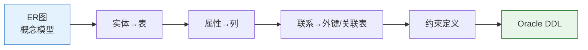

# Oracle逻辑设计与关系模式转换

## 一、概述

### 1.1 一句话定义

Oracle逻辑设计与关系模式转换，本质上是ER模型到Oracle表结构的系统化转换过程。
它在Oracle数据库设计流程中出现和使用，解决概念模型到可实施的关系模式转换问题。

### 1.2 为什么重要

- **不掌握的后果：** ER图无法正确转换为表结构，数据完整性受损
- **掌握的价值：** 高效准确地将业务模型转换为Oracle数据库结构

### 1.3 适用场景

| 场景 | 说明 |
|------|------|
| ER图转表结构 | 从概念模型到物理实现 |
| 数据库重构 | 调整现有表结构 |
| 数据迁移 | 目标数据库结构设计 |

### 1.4 版本演进

| 版本 | 变化说明 |
|------|---------|
| 11gR2 | 虚拟列支持 |
| 12cR1 | IDENTITY列、JSON类型 |
| 19c | 区块链表、多态表函数 |
| 21c | JSON Duality视图 |
| 23ai | 域类型、向量类型 |

## 二、术语与概念

### 2.1 核心术语表

| 术语 | 含义 | 类比 |
|------|------|------|
| 关系模式 | 表的结构定义（列、约束） | 表格的模板 |
| 转换规则 | ER到表的映射规则 | 翻译字典 |
| 数据字典 | Oracle系统元数据存储 | 数据库的目录 |

### 2.2 转换流程



## 三、核心原理

### 3.1 实体转换为表

**规则：** 每个强实体转换为一个表

```
ER图实体：Student(stu_id, name, age, gender)
    ↓ 转换
Oracle表：
CREATE TABLE students (
    stu_id   NUMBER PRIMARY KEY,
    name     VARCHAR2(50) NOT NULL,
    age      NUMBER(3),
    gender   VARCHAR2(1)
);
```

### 3.2 属性转换为列

**规则：** 每个属性转换为一个列

| 属性类型 | 转换方式 |
|---------|---------|
| 简单属性 | 普通列 |
| 复合属性 | 多个列 |
| 多值属性 | 关联表 |
| 派生属性 | 虚拟列或不存储 |
| 主键属性 | PRIMARY KEY约束 |

**复合属性转换示例：**

```
ER图：Address(city, street, zip_code)
    ↓ 转换
Oracle：
CREATE TABLE addresses (
    addr_id   NUMBER PRIMARY KEY,
    city      VARCHAR2(50),
    street    VARCHAR2(200),
    zip_code  VARCHAR2(10)
);
```

**多值属性转换示例：**

```
ER图：Student -- 多值 -- Phone
    ↓ 转换
Oracle：
CREATE TABLE students (
    stu_id NUMBER PRIMARY KEY,
    name   VARCHAR2(50)
);

CREATE TABLE student_phones (
    stu_id  NUMBER,
    phone   VARCHAR2(20),
    CONSTRAINT sp_pk PRIMARY KEY (stu_id, phone),
    CONSTRAINT sp_stu_fk FOREIGN KEY (stu_id) REFERENCES students(stu_id)
);
```

**派生属性转换示例：**

```
ER图：Employee(birth_date, 派生:age)
    ↓ 转换
Oracle：
CREATE TABLE employees (
    emp_id     NUMBER PRIMARY KEY,
    birth_date DATE,
    age        NUMBER GENERATED ALWAYS AS 
               (MONTHS_BETWEEN(SYSDATE, birth_date)/12) VIRTUAL
);
```

### 3.3 联系转换为外键/关联表

#### 1:1联系

```
ER图：User 1:1 UserProfile
    ↓ 转换
Oracle：外键放在任一方（通常放在引用频率高的一方）

CREATE TABLE users (
    user_id NUMBER PRIMARY KEY,
    username VARCHAR2(50)
);

CREATE TABLE user_profiles (
    profile_id NUMBER PRIMARY KEY,
    user_id    NUMBER UNIQUE,  -- UNIQUE保证1:1
    bio        VARCHAR2(500),
    CONSTRAINT up_user_fk FOREIGN KEY (user_id) REFERENCES users(user_id)
);
```

#### 1:N联系

```
ER图：Department 1:N Employee
    ↓ 转换
Oracle：外键放在"N"方

CREATE TABLE departments (
    dept_id NUMBER PRIMARY KEY,
    dept_name VARCHAR2(50)
);

CREATE TABLE employees (
    emp_id  NUMBER PRIMARY KEY,
    name    VARCHAR2(50),
    dept_id NUMBER,  -- 外键在"N"方
    CONSTRAINT emp_dept_fk FOREIGN KEY (dept_id) REFERENCES departments(dept_id)
);
```

#### M:N联系

```
ER图：Student M:N Course
    ↓ 转换
Oracle：创建关联表

CREATE TABLE students (
    stu_id NUMBER PRIMARY KEY,
    name   VARCHAR2(50)
);

CREATE TABLE courses (
    course_id NUMBER PRIMARY KEY,
    course_name VARCHAR2(100)
);

-- 关联表
CREATE TABLE student_courses (
    stu_id    NUMBER,
    course_id NUMBER,
    score     NUMBER(5,2),
    CONSTRAINT sc_pk PRIMARY KEY (stu_id, course_id),
    CONSTRAINT sc_stu_fk FOREIGN KEY (stu_id) REFERENCES students(stu_id),
    CONSTRAINT sc_course_fk FOREIGN KEY (course_id) REFERENCES courses(course_id)
);
```

### 3.4 弱实体转换

```
ER图：Order -- 依赖 -- OrderItem
    ↓ 转换
Oracle：弱实体的主键包含强实体主键

CREATE TABLE orders (
    order_id NUMBER PRIMARY KEY,
    order_date DATE
);

CREATE TABLE order_items (
    order_id NUMBER,     -- 来自强实体
    item_seq NUMBER,     -- 弱实体自身标识
    product_name VARCHAR2(100),
    quantity NUMBER,
    CONSTRAINT oi_pk PRIMARY KEY (order_id, item_seq),  -- 复合主键
    CONSTRAINT oi_order_fk FOREIGN KEY (order_id) REFERENCES orders(order_id)
        ON DELETE CASCADE  -- 级联删除
);
```

## 四、架构与组件

### 4.1 完整转换规则表

| ER元素 | Oracle实现 | 说明 |
|--------|-----------|------|
| 强实体 | TABLE | 每个实体一个表 |
| 弱实体 | TABLE + 复合主键 | 包含父实体主键 |
| 简单属性 | COLUMN | 直接映射 |
| 复合属性 | 多个COLUMN | 分解为子属性 |
| 多值属性 | 关联TABLE | 新建表 |
| 派生属性 | VIRTUAL COLUMN | 或不存储 |
| 主键 | PRIMARY KEY | 唯一标识 |
| 1:1联系 | FOREIGN KEY + UNIQUE | 外键加唯一约束 |
| 1:N联系 | FOREIGN KEY | 在N方添加外键 |
| M:N联系 | 关联TABLE | 新建关联表 |

### 4.2 Oracle数据字典

Oracle数据字典存储所有数据库对象的元数据：

```sql
-- 数据字典视图分类
-- USER_开头：当前用户拥有的对象
-- ALL_开头：当前用户可访问的对象
-- DBA_开头：所有数据库对象（需DBA权限）

-- 查看当前用户的表
SELECT table_name, tablespace_name, num_rows
FROM user_tables;

-- 查看表的列信息
SELECT column_name, data_type, data_length, nullable
FROM user_tab_columns
WHERE table_name = 'EMPLOYEES';

-- 查看约束
SELECT constraint_name, constraint_type, status
FROM user_constraints
WHERE table_name = 'EMPLOYEES';

-- 查看索引
SELECT index_name, index_type, uniqueness
FROM user_indexes
WHERE table_name = 'EMPLOYEES';
```

## 五、配置与参数

### 5.1 完整转换示例

**ER图描述：**

```
实体：
- Department(dept_id, dept_name)
- Employee(emp_id, name, salary, hire_date)
- Project(proj_id, proj_name, start_date)

联系：
- Department 1:N Employee
- Employee M:N Project（带属性：角色role）
```

**转换后的Oracle DDL：**

```sql
-- 1. Department实体 → departments表
CREATE TABLE departments (
    dept_id   NUMBER GENERATED ALWAYS AS IDENTITY PRIMARY KEY,
    dept_name VARCHAR2(100) NOT NULL UNIQUE
);

-- 2. Employee实体 → employees表
-- Department 1:N Employee → 外键在Employee
CREATE TABLE employees (
    emp_id    NUMBER GENERATED ALWAYS AS IDENTITY PRIMARY KEY,
    name      VARCHAR2(100) NOT NULL,
    salary    NUMBER(10,2) CHECK (salary > 0),
    hire_date DATE DEFAULT SYSDATE NOT NULL,
    dept_id   NUMBER,
    CONSTRAINT emp_dept_fk FOREIGN KEY (dept_id) 
        REFERENCES departments(dept_id)
);

-- 3. Project实体 → projects表
CREATE TABLE projects (
    proj_id    NUMBER GENERATED ALWAYS AS IDENTITY PRIMARY KEY,
    proj_name  VARCHAR2(200) NOT NULL,
    start_date DATE NOT NULL
);

-- 4. Employee M:N Project → 关联表
CREATE TABLE employee_projects (
    emp_id   NUMBER,
    proj_id  NUMBER,
    role     VARCHAR2(50),  -- 联系属性
    join_date DATE DEFAULT SYSDATE,
    CONSTRAINT ep_pk PRIMARY KEY (emp_id, proj_id),
    CONSTRAINT ep_emp_fk FOREIGN KEY (emp_id) 
        REFERENCES employees(emp_id) ON DELETE CASCADE,
    CONSTRAINT ep_proj_fk FOREIGN KEY (proj_id) 
        REFERENCES projects(proj_id) ON DELETE CASCADE
);

-- 5. 创建索引
CREATE INDEX idx_emp_dept ON employees(dept_id);
CREATE INDEX idx_ep_proj ON employee_projects(proj_id);

-- 6. 插入测试数据
INSERT INTO departments (dept_name) VALUES ('Engineering');
INSERT INTO departments (dept_name) VALUES ('Marketing');

INSERT INTO employees (name, salary, dept_id) VALUES ('Alice', 15000, 1);
INSERT INTO employees (name, salary, dept_id) VALUES ('Bob', 12000, 1);

INSERT INTO projects (proj_name, start_date) VALUES ('Project Alpha', DATE '2026-01-01');
INSERT INTO projects (proj_name, start_date) VALUES ('Project Beta', DATE '2026-03-01');

INSERT INTO employee_projects (emp_id, proj_id, role) VALUES (1, 1, 'Tech Lead');
INSERT INTO employee_projects (emp_id, proj_id, role) VALUES (2, 1, 'Developer');
INSERT INTO employee_projects (emp_id, proj_id, role) VALUES (2, 2, 'Developer');
```

## 六、监控与诊断

### 6.1 验证转换完整性

```sql
-- 检查所有表是否创建
SELECT table_name FROM user_tables ORDER BY table_name;

-- 检查所有外键约束
SELECT 
    a.constraint_name,
    a.table_name AS child_table,
    a.column_name AS child_column,
    c.table_name AS parent_table,
    c.column_name AS parent_column
FROM user_cons_columns a
JOIN user_constraints b ON a.constraint_name = b.constraint_name
JOIN user_cons_columns c ON b.r_constraint_name = c.constraint_name
WHERE b.constraint_type = 'R'
ORDER BY a.table_name;

-- 检查所有索引
SELECT index_name, table_name, uniqueness
FROM user_indexes
WHERE index_name NOT LIKE 'SYS_%'
ORDER BY table_name;
```

### 6.2 数据字典查询

```sql
-- 查看完整的数据模型
SELECT 
    t.table_name,
    c.column_name,
    c.data_type || CASE 
        WHEN c.data_type IN ('VARCHAR2', 'CHAR', 'RAW') 
        THEN '(' || c.data_length || ')'
        WHEN c.data_type = 'NUMBER' AND c.data_precision IS NOT NULL
        THEN '(' || c.data_precision || ',' || NVL(c.data_scale, 0) || ')'
        ELSE ''
    END AS data_type_info,
    c.nullable,
    CASE WHEN pk.column_name IS NOT NULL THEN 'PK' ELSE '' END AS key_type
FROM user_tables t
JOIN user_tab_columns c ON t.table_name = c.table_name
LEFT JOIN (
    SELECT cc.table_name, cc.column_name
    FROM user_cons_columns cc
    JOIN user_constraints ct ON cc.constraint_name = ct.constraint_name
    WHERE ct.constraint_type = 'P'
) pk ON c.table_name = pk.table_name AND c.column_name = pk.column_name
ORDER BY t.table_name, c.column_id;
```

## 七、实战案例

### 7.1 案例背景

- **场景**：将图书馆管理系统ER图转换为Oracle表结构
- **时间**：2026年
- **现象**：需要完整的转换过程和DDL

### 7.2 转换过程

**ER图描述：**

```
实体：
- Book(book_id, isbn, title, publish_year)
- Member(member_id, name, email, join_date)
- Loan(loan_id, loan_date, due_date, return_date)

联系：
- Book 1:N Loan
- Member 1:N Loan
```

**步骤1：实体转换**

```sql
-- Book实体
CREATE TABLE books (
    book_id      NUMBER GENERATED ALWAYS AS IDENTITY PRIMARY KEY,
    isbn         VARCHAR2(20) UNIQUE NOT NULL,
    title        VARCHAR2(300) NOT NULL,
    publish_year NUMBER(4)
);

-- Member实体
CREATE TABLE members (
    member_id  NUMBER GENERATED ALWAYS AS IDENTITY PRIMARY KEY,
    name       VARCHAR2(100) NOT NULL,
    email      VARCHAR2(100) UNIQUE NOT NULL,
    join_date  DATE DEFAULT SYSDATE NOT NULL
);
```

**步骤2：联系转换**

```sql
-- Loan实体（与Book和Member都有1:N联系）
CREATE TABLE loans (
    loan_id     NUMBER GENERATED ALWAYS AS IDENTITY PRIMARY KEY,
    book_id     NUMBER NOT NULL,
    member_id   NUMBER NOT NULL,
    loan_date   DATE DEFAULT SYSDATE NOT NULL,
    due_date    DATE NOT NULL,
    return_date DATE,
    CONSTRAINT loan_book_fk FOREIGN KEY (book_id) 
        REFERENCES books(book_id),
    CONSTRAINT loan_member_fk FOREIGN KEY (member_id) 
        REFERENCES members(member_id),
    CONSTRAINT loan_date_ck CHECK (due_date > loan_date),
    CONSTRAINT loan_return_ck CHECK (return_date IS NULL OR return_date >= loan_date)
);

-- 索引
CREATE INDEX idx_loans_book ON loans(book_id);
CREATE INDEX idx_loans_member ON loans(member_id);
CREATE INDEX idx_loans_due ON loans(due_date);
```

### 7.3 转换结果

| ER元素 | Oracle对象 | 状态 |
|--------|-----------|------|
| Book实体 | books表 | ✓ |
| Member实体 | members表 | ✓ |
| Loan实体 | loans表 | ✓ |
| Book 1:N Loan | loans.book_id外键 | ✓ |
| Member 1:N Loan | loans.member_id外键 | ✓ |

### 7.4 复盘总结

- **根因：** 系统化转换规则确保ER到表的正确映射
- **教训：** 每个联系都要转换为外键或关联表，不要遗漏

## 八、常见错误与排查

### 8.1 常见错误

| 错误 | 问题 | 解决方法 |
|------|------|---------|
| M:N未创建关联表 | 无法实现多对多 | 添加关联表 |
| 外键方向错误 | 1:N放错位置 | 外键在N方 |
| 遗漏联系属性 | 关联表缺少列 | 联系属性放入关联表 |
| 数据类型不匹配 | 外键列类型不一致 | 统一数据类型 |

## 九、最佳实践

### 9.1 官方推荐

- 使用SQL Developer Data Modeler自动转换
- 遵循命名规范
- 所有外键创建索引
- 使用数据字典验证

### 9.2 社区经验

- 转换前先检查ER图完整性
- 使用IDENTITY列代替序列
- 添加CHECK约束保证数据质量
- 转换后执行完整性验证

### 9.3 反模式

| 反模式 | 问题 | 正确做法 |
|--------|------|---------|
| 手动转换大型ER图 | 容易遗漏 | 使用工具辅助 |
| 不创建外键索引 | 性能问题 | 所有外键建索引 |
| 忽略约束 | 数据完整性差 | 合理添加约束 |

## 十、命令与视图汇总

### 10.1 命令列表

| 命令 | 适用场景 | 说明 |
|------|---------|------|
| `CREATE TABLE` | 创建表 | ER转换核心 |
| `ALTER TABLE ADD CONSTRAINT` | 添加约束 | 定义关系 |
| `CREATE INDEX` | 创建索引 | 性能优化 |

### 10.2 视图列表

| 视图名 | 类型 | 用途 |
|--------|------|------|
| USER_TABLES | 数据字典 | 表列表 |
| USER_TAB_COLUMNS | 数据字典 | 列信息 |
| USER_CONSTRAINTS | 数据字典 | 约束信息 |
| USER_CONS_COLUMNS | 数据字典 | 约束列 |
| USER_INDEXES | 数据字典 | 索引信息 |

## 十一、总结速查

### 11.1 黄金法则

1. **实体→表，属性→列** - 基本转换规则
2. **M:N必须关联表** - Oracle不直接支持M:N
3. **1:N外键在N方** - 外键放置规则

### 11.2 一页纸检查清单

| 检查项 | 说明 |
|--------|------|
| 所有实体都有对应表 | 无遗漏 |
| 所有联系都有外键或关联表 | 关系完整 |
| 外键列有索引 | 性能保障 |
| 数据类型一致 | 避免转换问题 |
| 约束定义完整 | 数据完整性 |

## 附录

### A. 官方参考

- [Oracle Database SQL Language Reference - CREATE TABLE](https://docs.oracle.com/en/database/oracle/oracle-database/19c/sqlqr/CREATE-TABLE.html)
- [Oracle SQL Developer Data Modeler Documentation](https://docs.oracle.com/en/database/oracle/sql-developer-data-modeler/)

### B. 修订记录

| 日期 | 版本 | 修改内容 | 修改人 |
|------|------|---------|--------|
| 2026-07-01 | v1.0 | 初始版本 | YashanDB知识库生成器 |
