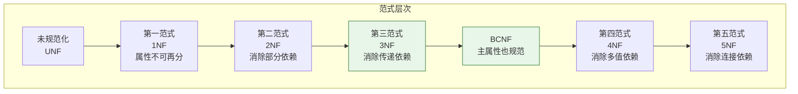
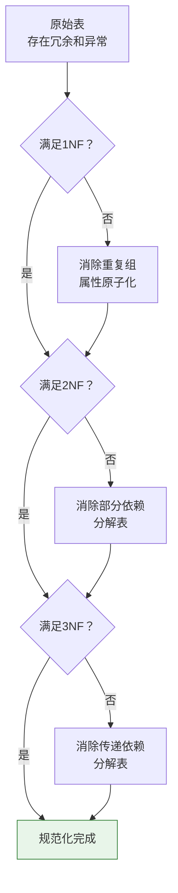

# Oracle规范化理论与范式设计

## 一、概述

### 1.1 一句话定义

Oracle规范化理论与范式设计，本质上是消除数据冗余和异常的关系数据库设计方法论。
它在Oracle数据库设计中出现和使用，解决数据冗余、更新异常、插入异常和删除异常问题。

### 1.2 为什么重要

- **不掌握的后果：** 数据冗余导致更新异常，存储空间浪费，数据不一致
- **掌握的价值：** 设计高效的数据库结构，减少冗余，保证数据一致性

### 1.3 适用场景

| 场景 | 说明 |
|------|------|
| 数据库设计 | 消除冗余，保证一致性 |
| 数据库重构 | 优化现有表结构 |
| 性能优化 | 权衡规范化与反规范化 |

### 1.4 版本演进

| 版本 | 变化说明 |
|------|---------|
| 11gR2 | 虚拟列支持反规范化 |
| 12cR1 | 增强JSON支持 |
| 19c | 增强物化视图（反规范化） |
| 23ai | JSON Duality视图（平衡规范化与灵活性） |

## 二、术语与概念

### 2.1 核心术语表

| 术语 | 含义 | 类比 |
|------|------|------|
| 函数依赖 | X→Y，X确定则Y确定 | 身份证→姓名 |
| 部分依赖 | 依赖候选键的一部分 | 只靠学号不够 |
| 传递依赖 | X→Y→Z，Z传递依赖X | 间接依赖 |
| 范式 | 规范化程度的标准 | 质量等级 |
| 反规范化 | 有意引入冗余提高性能 | 以空间换时间 |

### 2.2 范式层次



**Oracle设计实践：** 通常达到3NF或BCNF即可

## 三、核心原理

### 3.1 函数依赖

```
定义：X → Y 表示X的值唯一确定Y的值

示例：
- employee_id → name, salary, dept_id
- (order_id, product_id) → quantity, price
- dept_id → dept_name（如果部门名唯一）
```

**函数依赖类型：**

| 类型 | 定义 | 示例 |
|------|------|------|
| 完全函数依赖 | 依赖整个候选键 | (学号,课程号)→成绩 |
| 部分函数依赖 | 依赖候选键的一部分 | (学号,课程号)→学生姓名 |
| 传递函数依赖 | X→Y→Z | 员工号→部门号→部门名 |

### 3.2 第一范式（1NF）

**规则：** 每个属性都是原子的，不可再分

**违反1NF示例：**

```sql
-- 违反1NF：phone列包含多个值
CREATE TABLE employees_bad (
    emp_id NUMBER PRIMARY KEY,
    name VARCHAR2(50),
    phones VARCHAR2(200)  -- '13800138000,13900139000'
);
```

**符合1NF：**

```sql
-- 方案1：拆分为多行
CREATE TABLE employee_phones (
    emp_id NUMBER,
    phone VARCHAR2(20),
    CONSTRAINT ep_pk PRIMARY KEY (emp_id, phone)
);

-- 方案2：使用嵌套表（Oracle特有）
CREATE TYPE phone_list AS TABLE OF VARCHAR2(20);

CREATE TABLE employees (
    emp_id NUMBER PRIMARY KEY,
    name VARCHAR2(50),
    phones phone_list  -- 嵌套表
) NESTED TABLE phones STORE AS emp_phones_tab;
```

### 3.3 第二范式（2NF）

**规则：** 在1NF基础上，消除非主属性对候选键的部分依赖

**违反2NF示例：**

```sql
-- 候选键：(学号, 课程号)
-- 学生姓名只依赖学号（部分依赖）
CREATE TABLE student_courses_bad (
    stu_id NUMBER,
    course_id NUMBER,
    stu_name VARCHAR2(50),    -- 部分依赖候选键
    course_name VARCHAR2(100), -- 部分依赖候选键
    score NUMBER(5,2),
    CONSTRAINT sc_pk PRIMARY KEY (stu_id, course_id)
);
```

**符合2NF：**

```sql
-- 分解为三个表
CREATE TABLE students (
    stu_id NUMBER PRIMARY KEY,
    stu_name VARCHAR2(50) NOT NULL
);

CREATE TABLE courses (
    course_id NUMBER PRIMARY KEY,
    course_name VARCHAR2(100) NOT NULL
);

CREATE TABLE student_courses (
    stu_id NUMBER,
    course_id NUMBER,
    score NUMBER(5,2),
    CONSTRAINT sc_pk PRIMARY KEY (stu_id, course_id),
    CONSTRAINT sc_stu_fk FOREIGN KEY (stu_id) REFERENCES students(stu_id),
    CONSTRAINT sc_course_fk FOREIGN KEY (course_id) REFERENCES courses(course_id)
);
```

### 3.4 第三范式（3NF）

**规则：** 在2NF基础上，消除非主属性对候选键的传递依赖

**违反3NF示例：**

```sql
-- 存在传递依赖：emp_id → dept_id → dept_name
CREATE TABLE employees_bad (
    emp_id NUMBER PRIMARY KEY,
    name VARCHAR2(50),
    dept_id NUMBER,
    dept_name VARCHAR2(50)  -- 传递依赖emp_id
);
```

**符合3NF：**

```sql
-- 分解消除传递依赖
CREATE TABLE departments (
    dept_id NUMBER PRIMARY KEY,
    dept_name VARCHAR2(50) NOT NULL
);

CREATE TABLE employees (
    emp_id NUMBER PRIMARY KEY,
    name VARCHAR2(50) NOT NULL,
    dept_id NUMBER,
    CONSTRAINT emp_dept_fk FOREIGN KEY (dept_id) REFERENCES departments(dept_id)
);
```

### 3.5 BCNF

**规则：** 每个决定因素都必须是候选键

**违反BCNF示例：**

```sql
-- 仓库管理：(仓库,商品)→管理员，管理员→仓库
-- 候选键：(仓库,商品) 和 (管理员,商品)
-- 管理员→仓库，但管理员不是候选键
CREATE TABLE warehouse_management_bad (
    warehouse VARCHAR2(50),
    product VARCHAR2(50),
    manager VARCHAR2(50),
    CONSTRAINT wm_pk PRIMARY KEY (warehouse, product)
);
```

**符合BCNF：**

```sql
-- 分解
CREATE TABLE warehouse_managers (
    warehouse VARCHAR2(50) PRIMARY KEY,
    manager VARCHAR2(50) NOT NULL
);

CREATE TABLE product_managers (
    product VARCHAR2(50),
    manager VARCHAR2(50),
    CONSTRAINT pm_pk PRIMARY KEY (product, manager)
);
```

## 四、架构与组件

### 4.1 规范化过程



### 4.2 规范化 vs 反规范化

| 方面 | 规范化 | 反规范化 |
|------|--------|---------|
| 目标 | 消除冗余 | 提高查询性能 |
| 数据一致性 | 高 | 需要额外维护 |
| 存储空间 | 小 | 大 |
| 更新操作 | 简单 | 复杂 |
| 查询操作 | 复杂（多表JOIN） | 简单 |
| 适用场景 | OLTP | OLAP、报表 |

## 五、配置与参数

### 5.1 Oracle反规范化技术

```sql
-- 1. 物化视图（预计算结果）
CREATE MATERIALIZED VIEW mv_emp_dept
BUILD IMMEDIATE
REFRESH ON COMMIT
AS
SELECT e.emp_id, e.name, d.dept_name, e.salary
FROM employees e
JOIN departments d ON e.dept_id = d.dept_id;

-- 2. 虚拟列（派生属性）
CREATE TABLE orders (
    order_id NUMBER PRIMARY KEY,
    amount NUMBER(10,2),
    tax_rate NUMBER(3,2) DEFAULT 0.13,
    tax_amount NUMBER GENERATED ALWAYS AS (amount * tax_rate) VIRTUAL,
    total_amount NUMBER GENERATED ALWAYS AS (amount * (1 + tax_rate)) VIRTUAL
);

-- 3. 冗余列（提高查询性能）
CREATE TABLE order_items (
    item_id NUMBER PRIMARY KEY,
    order_id NUMBER NOT NULL,
    product_id NUMBER NOT NULL,
    product_name VARCHAR2(200),  -- 冗余列，避免JOIN
    quantity NUMBER,
    CONSTRAINT oi_order_fk FOREIGN KEY (order_id) REFERENCES orders(order_id)
);

-- 4. 表分区（大表优化）
CREATE TABLE sales (
    sale_id NUMBER,
    sale_date DATE,
    amount NUMBER(10,2)
)
PARTITION BY RANGE (sale_date) (
    PARTITION p2025 VALUES LESS THAN (DATE '2026-01-01'),
    PARTITION p2026 VALUES LESS THAN (DATE '2027-01-01'),
    PARTITION pmax VALUES LESS THAN (MAXVALUE)
);
```

### 5.2 Oracle JSON Duality视图（23ai）

```sql
-- JSON Duality视图：兼顾规范化和灵活性
CREATE JSON RELATIONAL DUALITY VIEW order_dv AS
    orders @insert @update @delete {
        _id : order_id,
        orderDate : order_date,
        customer : customers @insert {
            _id : customer_id,
            name : customer_name
        },
        items : order_items @insert @update @delete [{
            product : products @insert {
                _id : product_id,
                name : product_name,
                price : unit_price
            },
            quantity : quantity
        }]
    };

-- 查询时像JSON文档
SELECT json_serialize(value(o) RETURNING VARCHAR2 PRETTY)
FROM order_dv o
WHERE json_value(value(o), '$._id') = 1001;
```

## 六、监控与诊断

### 6.1 检查表规范化程度

```sql
-- 分析表的函数依赖
-- 检查是否存在冗余列
SELECT table_name, column_name, data_type
FROM user_tab_columns
WHERE table_name = 'EMPLOYEES'
ORDER BY column_id;

-- 检查是否存在传递依赖
-- 例如：如果emp表有dept_name列，可能存在传递依赖
```

### 6.2 性能对比

```sql
-- 规范化查询（需要JOIN）
SELECT e.name, d.dept_name
FROM employees e
JOIN departments d ON e.dept_id = d.dept_id
WHERE e.emp_id = 1001;

-- 反规范化查询（冗余列）
SELECT name, dept_name
FROM employees_flat
WHERE emp_id = 1001;

-- 对比执行计划
SET AUTOTRACE ON
-- 执行两个查询，对比逻辑读
```

## 七、实战案例

### 7.1 案例背景

- **场景**：电商订单表规范化
- **时间**：2026年
- **现象**：单表存储所有订单信息，存在大量冗余

### 7.2 规范化过程

**原始表（违反多范式）：**

```sql
-- 违反1NF：items列包含多个值
-- 违反2NF：(order_id, item_seq)→product_name部分依赖
-- 违反3NF：order_id→customer_city传递依赖
CREATE TABLE orders_all_bad (
    order_id NUMBER,
    customer_name VARCHAR2(100),
    customer_email VARCHAR2(100),
    customer_city VARCHAR2(50),
    item_seq NUMBER,
    product_name VARCHAR2(200),
    product_category VARCHAR2(50),
    quantity NUMBER,
    unit_price NUMBER(10,2),
    items VARCHAR2(4000),  -- 违反1NF
    CONSTRAINT oa_pk PRIMARY KEY (order_id, item_seq)
);
```

**规范化后：**

```sql
-- 1NF：消除重复组
-- 2NF：消除部分依赖
-- 3NF：消除传递依赖

-- 客户表
CREATE TABLE customers (
    customer_id NUMBER GENERATED ALWAYS AS IDENTITY PRIMARY KEY,
    name VARCHAR2(100) NOT NULL,
    email VARCHAR2(100) UNIQUE NOT NULL,
    city VARCHAR2(50)
);

-- 商品分类表
CREATE TABLE categories (
    category_id NUMBER GENERATED ALWAYS AS IDENTITY PRIMARY KEY,
    name VARCHAR2(50) NOT NULL UNIQUE
);

-- 商品表
CREATE TABLE products (
    product_id NUMBER GENERATED ALWAYS AS IDENTITY PRIMARY KEY,
    name VARCHAR2(200) NOT NULL,
    category_id NUMBER,
    price NUMBER(10,2) NOT NULL,
    CONSTRAINT prod_cat_fk FOREIGN KEY (category_id) REFERENCES categories(category_id)
);

-- 订单表
CREATE TABLE orders (
    order_id NUMBER GENERATED ALWAYS AS IDENTITY PRIMARY KEY,
    customer_id NUMBER NOT NULL,
    order_date DATE DEFAULT SYSDATE NOT NULL,
    status VARCHAR2(20) DEFAULT 'PENDING',
    CONSTRAINT ord_cust_fk FOREIGN KEY (customer_id) REFERENCES customers(customer_id)
);

-- 订单明细表
CREATE TABLE order_items (
    order_id NUMBER,
    item_seq NUMBER,
    product_id NUMBER NOT NULL,
    quantity NUMBER NOT NULL CHECK (quantity > 0),
    unit_price NUMBER(10,2) NOT NULL,
    CONSTRAINT oi_pk PRIMARY KEY (order_id, item_seq),
    CONSTRAINT oi_order_fk FOREIGN KEY (order_id) REFERENCES orders(order_id),
    CONSTRAINT oi_prod_fk FOREIGN KEY (product_id) REFERENCES products(product_id)
);
```

### 7.3 规范化结果

| 指标 | 规范化前 | 规范化后 |
|------|---------|---------|
| 表数量 | 1 | 5 |
| 冗余数据 | 大量 | 最小 |
| 更新异常 | 存在 | 消除 |
| 查询复杂度 | 低 | 高（需JOIN） |

### 7.4 复盘总结

- **根因：** 规范化消除冗余和异常
- **教训：** 规范化程度需要权衡，OLTP系统通常3NF即可

## 八、常见错误与排查

### 8.1 常见错误

| 错误 | 问题 | 解决方法 |
|------|------|---------|
| 过度规范化 | 表过多，JOIN复杂 | 适当反规范化 |
| 规范化不足 | 数据冗余 | 进一步分解 |
| 忽略业务需求 | 理论脱离实际 | 结合实际场景 |

## 九、最佳实践

### 9.1 官方推荐

- OLTP系统达到3NF
- 数据仓库可适度反规范化
- 使用物化视图平衡性能
- 定期审查表结构

### 9.2 社区经验

- 先规范化，再根据性能需求反规范化
- 使用虚拟列代替冗余列
- 物化视图定期刷新

### 9.3 反模式

| 反模式 | 问题 | 正确做法 |
|--------|------|---------|
| 完全不规范化 | 数据冗余严重 | 至少达到3NF |
| 过度规范化 | 查询过于复杂 | 适度反规范化 |
| 忽视业务场景 | 理论脱离实际 | 结合实际需求 |

## 十、命令与视图汇总

### 10.1 命令列表

| 命令 | 适用场景 | 说明 |
|------|---------|------|
| `CREATE MATERIALIZED VIEW` | 反规范化 | 预计算结果 |
| `ALTER TABLE ADD VIRTUAL COLUMN` | 派生属性 | 虚拟列 |

### 10.2 视图列表

| 视图名 | 类型 | 用途 |
|--------|------|------|
| USER_TABLES | 数据字典 | 表列表 |
| USER_MVIEWS | 数据字典 | 物化视图 |

## 十一、总结速查

### 11.1 黄金法则

1. **OLTP至少3NF** - 消除冗余和异常
2. **OLAP适度反规范化** - 以空间换时间
3. **物化视图平衡性能** - 预计算复杂查询

### 11.2 一页纸检查清单

| 范式 | 检查项 | 说明 |
|------|--------|------|
| 1NF | 属性原子性 | 无重复组 |
| 2NF | 无部分依赖 | 非主属性完全依赖候选键 |
| 3NF | 无传递依赖 | 非主属性不依赖其他非主属性 |
| BCNF | 决定因素是候选键 | 更严格的3NF |

## 附录

### A. 官方参考

- [Oracle Database Concepts - Data Warehousing](https://docs.oracle.com/en/database/oracle/oracle-database/19c/cncpt/data-warehousing.html)
- [Oracle Database Data Warehousing Guide](https://docs.oracle.com/en/database/oracle/oracle-database/19c/dwhsg/)

### B. 修订记录

| 日期 | 版本 | 修改内容 | 修改人 |
|------|------|---------|--------|
| 2026-07-01 | v1.0 | 初始版本 | YashanDB知识库生成器 |
